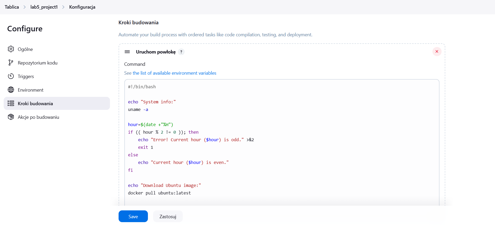
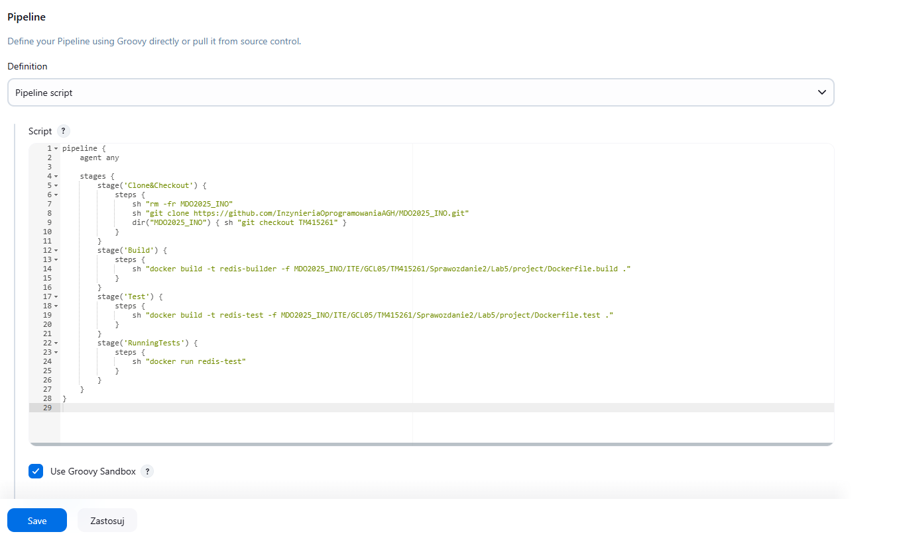
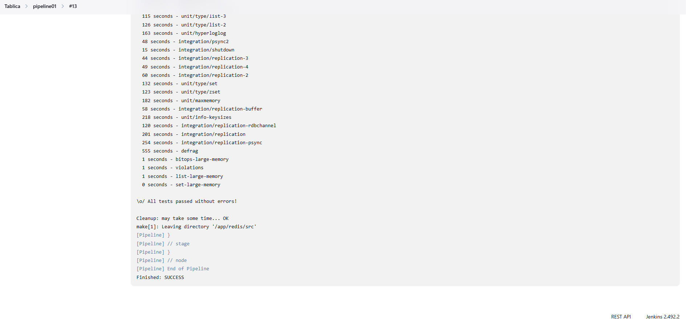

# Sprawozdanie 2
#### Tomasz Mandat ITE gr. 05

<br>

## Przygotowanie środowiska oraz wstępne uruchomienie i testy

### Tworzenie instancji `Jenkins`

Na początku należało przygotować środowisko do pracy - `Jenkins`'a. W tym celu skorzystałem z instrukcji na stronie `Jenkins`'a (https://www.jenkins.io/doc/book/installing/docker/). Poniżej znajdują się kroki wymagane do uruchomienia `Jenkins`'a jako kontener Dockera. 

1. Utworzenie sieci mostkowej:


2. Uruchomienie kontenera `DIND` (potrzebny, aby możliwe było korzystanie z `Docker`'a w `Jenkins`):


3. Dostosowywanie obrazu `Jenkins` za pomocą [`Dockerfile`](./Dockerfile):
```dockerfile
FROM jenkins/jenkins:2.492.2-jdk17
USER root
RUN apt-get update && apt-get install -y lsb-release ca-certificates curl && \
    install -m 0755 -d /etc/apt/keyrings && \
    curl -fsSL https://download.docker.com/linux/debian/gpg -o /etc/apt/keyrings/docker.asc && \
    chmod a+r /etc/apt/keyrings/docker.asc && \
    echo "deb [arch=$(dpkg --print-architecture) signed-by=/etc/apt/keyrings/docker.asc] \
    https://download.docker.com/linux/debian $(. /etc/os-release && echo \"$VERSION_CODENAME\") stable" \
    | tee /etc/apt/sources.list.d/docker.list > /dev/null && \
    apt-get update && apt-get install -y docker-ce-cli && \
    apt-get clean && rm -rf /var/lib/apt/lists/*
USER jenkins
RUN jenkins-plugin-cli --plugins "blueocean docker-workflow"
```

4. Zbudowanie obrazu `Jenkins` z `BlueOcean`:

    `BlueOcean` to plugin zapewniający nowoczesny interfejs użytkownika, który umożliwia graficzne tworzenie, wizualizację i diagnozowanie `Pipeline`'ów. 

    

5. Uruchomienie kontenera `jenkins-blueocean`:


6. Przekierowanie portów:
    Aby korzystać z `Jenkins`a na przeglądarce, należy przekierować go na port `8080`, a następnie uruchomić w przeglądarce (adres: `localhost:8080`)

<br>

### Wstępne uruchomienie

Aby uruchomić `Jenkins`'a, będziemy potrzebowali hasła. Najprostszym sposobem jest znalezienie go w logach kontenera. W terminalu należy wpisać:
``` bash
docker logs jenkins-blueocean
```
Fragment z hasłem wygląda następująco:


Hasło wpisujemy do pola pojawiającego się na stronie zaraz po uruchomieniu `Jenkins`'a:


Następnie `Jenkins` pyta nas o zainstalowanie wtyczek. W moim przypadku zainstalowałem sugerowane:


Po zainstalowaniu wtyczek należy utworzyć konto i na tym kończy się wstępna konfiguracja `Jenkins`'a.


### Projekt testowy

Poniżej znajduje się testowy projekt w `Jenkins`'ie. Aby utworzyć nowy projekt należy na stronie głównej przejść do **Nowy projekt** i wybrać typ projektu - w tym przypadku będzie to **Ogólny projekt**.

Założenia projektu:
* Wyświetlanie `uname`
* Zwracanie błędu, gdy godzina jest nieparzysta
* Pobranie w projekcie obrazu kontenera `ubuntu` stosując `docker pull`

Kod projektu:


Efekt uruchomienia projektu (sprawdzamy go w **Logach konsoli**):


<br>

### Obiekt typu `pipeline`

Kolejne zadanie to stworzenie prostego `pipeline`'u. W tym celu ponownie wybieramy **Nowy projekt**, lecz tym razem typem projektu będzie **Pipeline**.

Poniższy `pipeline` klonuje repozytorium przedmiotowe oraz buduje obraz (na podstawie pliku `Dockerfile`) programu wybranego we wcześniejszym sprawozdaniu.

Ze względu na problemy z planowanym krokiem `Deploy` w `pipeline` postanowiłem zmienić wybrany program. Nowy program do `Redis` i spełnia wymagania podane w konspekcie do zajęć nr 3.

Treść `pipeline` wzbogacona również o zbudowanie obrazu do testów oraz ich uruchomienie - znajduje się ona narazie bezpośrednio w obiekcie (później treść `pipeline`'u będzie pobierana z `Jenkinsfile`):


Efekt uruchomienia `pipeline`'u:


<br><br>

## Kompletny pipeline 

### Modyfikacja pobierania treści `pipeline`'u

Swoją pracę rozpocząłem od zmiany sposobu pobierania treści `pipeline`'u. Teraz będzie ona znajdowała się w repozytorium przedmiotowym na mojej gałęzi w pliku `Jenkinsfile`. 

W tym celu należało zmodyfikować konfigurację projektu `pipeline`, wybierając opcję **Pipeline script from SCM** w polu **Definition** w sekcji **Pipeline**. Następnie trzeba było podać szczegółowe informacje o lokalizacji `Jenkinsfile`.


Aktualna treść pliku `Jenkinsfile` jest identyczna z wcześniej znajdującą się treścią `pipeline`'u w obiekcie:


### Finalna wersja Pipeline

Do poprzedniego `pipeline`'u dodałem kroki `Deploy` (budowa obrazu do wdrożenia na środowisko produkcyjne) oraz `Publish` (publikacja obrazu na DockerHub). Dodatkowo przy budowie obrazów dodałem opcję `--no-cache`, aby budowa odbywała się poprawnie w przypadku np. aktualizacji `Dockerfile`'ów lub samego kodu aplikacji.

**Kompletny `pipeline`:**
```groovy
pipeline {
    agent any
    
    environment {
        IMAGE_NAME = "tomaszek03/redis-app"
        IMAGE_TAG = "v1.0.${BUILD_NUMBER}"
    }
    
    stages {
        stage('Clone&Checkout') {
            steps {
                sh "rm -fr MDO2025_INO"
                sh "git clone https://github.com/InzynieriaOprogramowaniaAGH/MDO2025_INO.git"
                dir("MDO2025_INO") { sh "git checkout TM415261" }
            }
        }
        stage('Build') {
            steps {
                sh "docker build --no-cache -t redis-builder -f MDO2025_INO/ITE/GCL05/TM415261/Sprawozdanie2/project/Dockerfile.build ."
            }
        }
        stage('Test') {
            steps {
                sh "docker build --no-cache -t redis-test -f MDO2025_INO/ITE/GCL05/TM415261/Sprawozdanie2/project/Dockerfile.test ."
            }
        }
        stage('RunningTests') {
            steps {
                sh "docker run --rm redis-test"
            }
        }
        stage('Deploy') {
            steps {
                sh """
                    if [ \$(docker ps -a -q -f name=redis-deploy-test) ]; then
                        docker rm -f redis-deploy-test
                    fi
                """
                sh """ 
                    docker build --no-cache -t ${IMAGE_NAME}:${IMAGE_TAG} -f MDO2025_INO/ITE/GCL05/TM415261/Sprawozdanie2/Dockerfile.deploy .
                """
                echo "Testing deploy..."
                sh """
                    docker network inspect test-net >/dev/null 2>&1 || docker network create test-net
                    docker run -d --name redis-deploy-test --network test-net ${IMAGE_NAME}:${IMAGE_TAG}
                    sleep 5
                    docker run --rm --network test-net redis redis-cli -h redis-deploy-test PING | grep PONG
                    docker run --rm --network test-net redis redis-cli -h redis-deploy-test SET test_key "MyKey" | grep OK
                    docker run --rm --network test-net redis redis-cli -h redis-deploy-test GET test_key | grep MyKey
                    docker stop redis-deploy-test
                    docker rm redis-deploy-test
                    docker network rm test-net
                """
            }
        }
        stage('Publish') {
            steps {
                withCredentials([usernamePassword(credentialsId: 'dockerhub-credentials', usernameVariable: 'DOCKER_USERNAME', passwordVariable: 'DOCKER_PASSWORD')]) {
                    sh '''
                        echo "Logging into DockerHub as ${DOCKER_USERNAME}..."
                        echo "$DOCKER_PASSWORD" | docker login -u "$DOCKER_USERNAME" --password-stdin
                        echo "Pushing image: ${IMAGE_NAME}:${IMAGE_TAG} to DockerHub..."
                        docker push ${IMAGE_NAME}:${IMAGE_TAG}
        
                        echo "Creating and pushing tag: latest..."
                        docker tag ${IMAGE_NAME}:${IMAGE_TAG} ${IMAGE_NAME}:latest
                        docker push ${IMAGE_NAME}:latest
                        docker logout
                    '''
        }
    }
        }
    }
}
```
`Jenkinsfile` jest dostępny w repozytorium w tym miejscu: [`Jenkinsfile`](./Jenkinsfile)

Pełny opis każdego etapu `pipeline`'u znajduje się poniżej:

#### Etap `Clone&Checkout`
W tym etapie najpierw usuwana jest kopia repozytorium przedmiotowego, aby następnie pobrać aktualną wersję. Po wykonaniu operacji zmieniana jest gałąź na moją (`TM415261`).

#### Etap `Build`

Etap ten odpowiada za zbudowanie obrazu wybranego programu (`Redis`'a). Instalowane są potrzebne zależności oraz ściągane jest repozytorium zawierające program. Odbywa się to za pomocą tego [`Dockerfile.build`](./project/Dockerfile.build):

```dockerfile
FROM ubuntu:latest

ENV DEBIAN_FRONTEND=noninteractive

RUN apt-get update && \
    apt-get install -y \
    git \
    make \
    gcc \
    tcl \
    build-essential \
    libc6-dev \
    libjemalloc-dev \
    && rm -rf /var/lib/apt/lists/*

WORKDIR /app

RUN git clone https://github.com/redis/redis.git redis

WORKDIR /app/redis

RUN make -j$(nproc)

ENV PATH="/app/redis/src:${PATH}"
```
Uwagi do pliku:
* dodałem `ENV DEBIAN_FRONTEND=noninteractive`, aby system nie zadawał pytań podczas instalacji zależności (mogłoby to zawiesić build) - instalacja odbywa się z domyślnymi odpowiedziami
* polecenie `rm -rf /var/lib/apt/lists/*` usuwa katalogi z cache'em `APT` - zmniejszam w ten sposób rozmiar obrazu

#### Etap `Test`
Następuje tu budowa obrazu do testowania oprogramowania. Plik [`Dockerfile.test`](./project/Dockerfile.test):
```dockerfile
FROM redis-builder

WORKDIR /app/redis

CMD ["./runtest", "--single", "unit/printver"]
```

Ze względu na długotrwały proces testowania aplikacji oraz niedeterministyczny wynik testów (czasami nie przechodził jeden test - niestety za każdym razem inny, ale zawsze niegroźny), w dalszej części pracy postanowiłem ograniczyć testowanie do wykonania jednego testu. Przyspieszyło to proces testowania i zapobiegło przerywania wykonywania `pipeline`'u w przypadku niepowodzenia któregoś z testów (wybrałem jeden z unit testów, który zawsze kończył się sukcesem).

#### Etap `RunningTests`

Etap ten odpowiada za uruchomienie testów dołączonych do aplikacji (w moim przypadku testów w zredukowanej wersji).

#### Etap `Deploy`
W tym etapie przygotowywana jest wersja obrazu gotowa do dystrybucji. Obraz jest budowany za pomocą [`Dockerfile.deploy`](./Dockerfile.deploy):

```dockerfile
FROM redis-builder AS builder
FROM ubuntu:latest

RUN apt-get update && \
    apt-get install -y libjemalloc2 && \
    rm -rf /var/lib/apt/lists/*

COPY --from=builder /app/redis/src/redis-server /usr/local/bin/
COPY --from=builder /app/redis/src/redis-cli /usr/local/bin/

EXPOSE 6379

ENTRYPOINT ["redis-server"]
CMD ["--protected-mode", "no"]
```

Dzięki temu powstaje obraz gotowy do opublikowania. Jest on dużo lżejszy od wcześniejszego buildera (zawiera tylko to co jest potrzebne do uruchomienia aplikacji). Kopiowana jest główna aplikacja `Redis`'a (serwer) oraz klient do łączenia się z `Redis`'em. Jest on także bezpieczniejszy (nie zawiera narzędzi buildowych, które mogłby zostać wykorzystane np. do ataku). Linia `EXPOSE 6379` oznacza, że kontener nasłuchuje na porcie 6379 (domyślny port `Redis`'a). Ustawiłem również, aby serwer był domyślnie uruchamiany przy starcie kontenera (`ENTRYPOINT ["redis-server"]`). Ze względu na pojawiające się problemy podczas testowania serwera z zewnątrz (`Redis` blokował połączenie), wyłączyłem ograniczenie dostępu za pomocą argumentów przu uruchomieniu (`--protected-mode no`).

Po zbudowaniu obrazu następuje weryfikacja, że aplikacja działa poprawnie. Tworzona jest pomocnicza sieć (`test-net`) oraz na podstawie zbudowanego obrazu docelowego uruchamiany jest kontener (`redis-deploy-test`). Testowanie polega na komunikacji między kontenerami w tej samej sieci i wysyłaniu zapytań do serwera `Redis` za pomocą narzędzia `redis-cli`.

Wysyłane są przykładowe zapytania:
* `PING` oczekuje odpowiedzi `PONG` (potwierdza działanie serwera)
* `SET test_key "MyKey"` oczekuje odpowiedzi `OK` (oznacza, że wartość została pomyślnie zapisana)
* `GET test_key` oczekuje odpowiedzi `MyKey` (odczytuje wcześniej zapisaną wartość)

Obraz do publikacji nosi nazwę `tomaszek03/redis-app` i jest wersjonowany za pomocą numeru builda.

#### Etap `Publish`
Etap ten odpowiada za opublikowanie obrazu na DockerHub. Na początku dodałem do Jenkinsa tzw. "credentials" umożliwiające zalogowanie się do DockerHub'a (login i hasło). Następnie w etapie `Publish` w `pipeline`, za ich pomocą loguję się do DockerHub'a i publikuję aktualną wersję obrazu. Dodatkowo publikuję też wersję `latest` w celu szybkiego dostępu do najnowszej wersji obrazu.

### Weryfikacja działania `pipeline`'u

Po uruchomieniu `pipeline` zakończył się sukcesem


Pełny log dostępny jest w repozytorium: [`pipeline_log.txt`](./pipeline_log.txt).

Repozytorium pojawiło się na moim profilu DockerHub:


Dostępne są wszystkie opublikowane wersje obrazu:


#### Ponowne uruchomienie `pipeline`'u

Ponowne uruchomienie `pipeline`'u ponownie zakończyło się sukcesem. Dowodem na to, że pracował na najnowszym (a nie *cache'owanym*) kodzie jest bardzo zbliżony czas wykonania obydwu `pipeline`'ów:


Na DockerHub'ie pojawiła się nowa wersja obrazu:


#### Próba pobrania i uruchomienia obrazu:

Spróbowałem pobrać obraz i uruchomić na jego podstawie kontener. Całość zakończyła się sukcesem.


