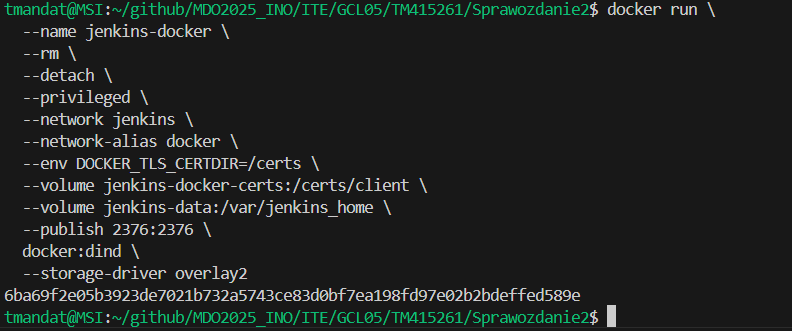

# Sprawozdanie 2
#### Tomasz Mandat ITE gr. 05

<br>

## Laboratorium nr 5

### Tworzenie instancji `Jenkins`

Na początku należało przygotować środowisko do pracy - `Jenkins`'a. W tym celu skorzystałem z instrukcji na stronie `Jenkins`'a (https://www.jenkins.io/doc/book/installing/docker/). Poniżej znajdują się kroki wymagane do uruchomienia `Jenkins`'a jako kontener Dockera. 

1. Utworzenie sieci mostkowej:


2. Uruchomienie kontenera `DIND` (potrzebny, aby możliwe było korzystanie z `Docker`'a w `Jenkins`):


3. Dostosowywanie obrazu `Jenkins` za pomocą `Dockerfile`:


4. Zbudowanie obrazu `Jenkins` z `BlueOcean`:

    `BlueOcean` to plugin zapewniający nowoczesny interfejs użytkownika, który umożliwia graficzne tworzenie, wizualizację i diagnozowanie `Pipeline`'ów. 

    

5. Uruchomienie kontenera `jenkins-blueocean`:


6. Przekierowanie portów:
    Aby korzystać z `Jenkins`a na przeglądarce, należy przekierować go na port `8080`, a następnie uruchomić w przeglądarce (adres: `localhost:8080`)

<br>

### Wstępne uruchomienie

Aby uruchomić `Jenkins`'a, będziemy potrzebowali hasła. Najprostszym sposobem jest znalezienie go w logach kontenera. W terminalu należy wpisać:
``` bash
docker logs jenkins-blueocean
```
Fragment z hasłem wygląda następująco:


Hasło wpisujemy do pola pojawiającego się na stronie zaraz po uruchomieniu `Jenkins`'a:


Następnie `Jenkins` pyta nas o zainstalowanie wtyczek. W moim przypadku zainstalowałem sugerowane:


Po zainstalowaniu wtyczek należy utworzyć konto i na tym kończy się wstępna konfiguracja `Jenkins`'a.


### Projekt testowy

Poniżej znajduje się testowy projekt w `Jenkins`'ie. Aby utworzyć nowy projekt należy na stronie głównej przejść do **Nowy projekt** i wybrać typ projektu - w tym przypadku będzie to **Ogólny projekt**.

Założenia projektu:
* Wyświetlanie `uname`
* Zwracanie błędu, gdy godzina jest nieparzysta
* Pobranie w projekcie obrazu kontenera `ubuntu` stosując `docker pull`

Kod projektu:


Efekt uruchomienia projektu (sprawdzamy go w **Logach konsoli**):


<br>

### Obiekt typu `pipeline`

Kolejne zadanie to stworzenie prostego `pipeline`'u. W tym celu ponownie wybieramy **Nowy projekt**, lecz tym razem typem projektu będzie **Pipeline**.

Poniższy `pipeline` klonuje repozytorium przedmiotowe oraz buduje obraz (na podstawie pliku `Dockerfile`) programu wybranego we wcześniejszym sprawozdaniu.

Ze względu na problemy z planowanym krokiem `Deploy` w `pipeline` postanowiłem zmienić wybrany program. Nowy program do `Redis` i spełnia wymagania podane w konspekcie do zajęć nr 3.

Treść `pipeline` wzbogacona również o zbudowanie obrazu do testów oraz ich uruchomienie - znajduje się ona narazie bezpośrednio w obiekcie (później treść `pipeline`'u będzie pobierana z `Jenkinsfile`):


Efekt uruchomienia `pipeline`'u:


<br><br>

## Laboratorium nr 6

Podczas tego laboratorium omawiany był plan wdrożenia aplikacji na środowisko produkcyjne (`Deploy`).

Swoją pracę rozpocząłem od zmiany sposobu pobierania treści `pipeline`'u. Teraz będzie ona znajdowała się w repozytorium przedmiotowym na mojej gałęzi w pliku `Jenkinsfile`. 

W tym celu należało zmodyfikować konfigurację projektu `pipeline`, wybierając opcję **Pipeline script from SCM** w polu **Definition** w sekcji **Pipeline**. Następnie trzeba było podać szczegółowe informacje o lokalizacji `Jenkinsfile`.


Aktualna treść pliku `Jenkinsfile` jest identyczna z wcześniej znajdującą się treścią `pipeline`'u w obiekcie:


Ze względu na długotrwały proces testowania aplikacji oraz niedeterministyczny wynik testów (czasami nie przechodził jeden test - niestety za każdym razem inny, ale zawsze niegroźny), w dalszej części pracy postanowiłem ograniczyć testowanie do wykonania jednego testu. Przyspieszyło to proces testowania i zapobiegło przerywania wykonywania `pipeline`'u w przypadku niepowodzenia któregoś z testów (wybrałem jeden z unit testów, który zawsze kończył się sukcesem). 