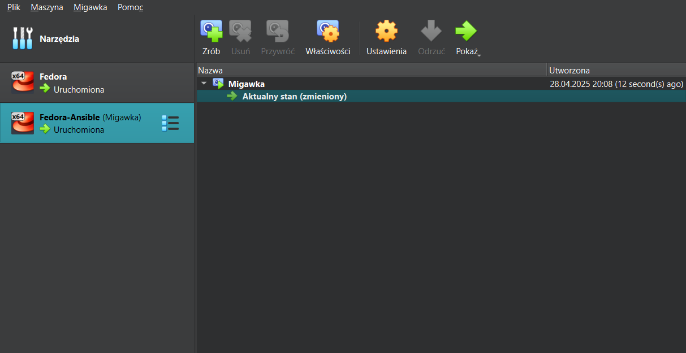
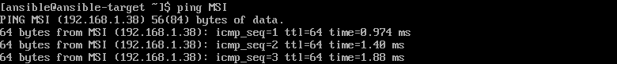
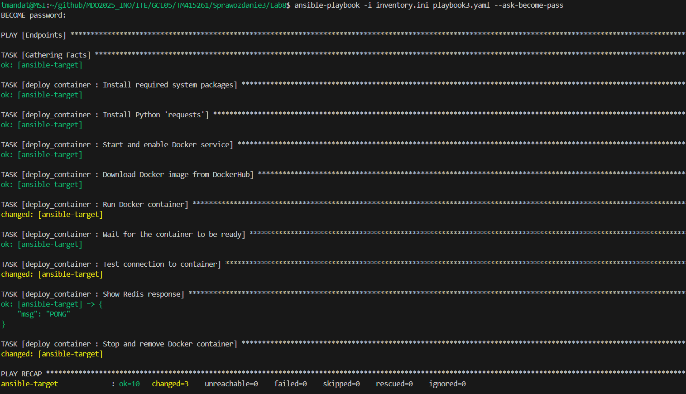

# Sprawozdanie 3
#### Tomasz Mandat ITE gr. 05

<br>

## Automatyzacja i zdalne wykonywanie poleceń za pomocą Ansible

### Instalacja zarządcy Ansible
Na początku utworzyłem drugą maszynę wirtualną posiadającą ten sam system operacyjny, co "główna" maszyna (`Fedora 41`).

Podczas instalacji nadałem maszynie *hostname* `ansible-target` oraz utworzyłem użytkownika `ansible`.


Po pomyślnej instalacji zalogowałem się na nowo utworzoną maszynę.


Następnie zainstalowałem program `tar` oraz serwer `OpenSSH` (`shd`). Okazało się, że serwer jest już zainstalowany.
``` bash
sudo dnf install tar openssh-server -y
```


Po udanej instalacji zrobiłem migawkę maszyny.


Następny krok odbył się na głównej maszynie wirtualnej. Mianowicie zainstalowałem na niej oprogramowanie Ansible.
``` bash
sudo dnf install ansible -y
```


Instalacja zakończyła się sukcesem.


Następnie wymieniłem klucze SSH między użytkownikiem na głównej maszynie, a użytkownikiem `ansible`. Dzięki temu podczas logowania przez `ssh` nie będzie wymagane hasło.
Z racji, że klucz publiczny został już utworzony podczas laboratoriów nr 1, wymiana kluczy odbyła się jedynie poleceniem:
``` bash
ssh-copy-id ansible@ansible-target
```


Podczas próby logowania, hasło faktycznie nie było wymagane. To potwierdza skuteczność operacji.


<br>

### Inwentaryzacja
Następnie należało dokonać inwentaryzacji systemów. Zacząłem od ustalenia przewidywalnych nazw komputerów (maszyn wirtualnych) stosując `hostnamectl`.

Najpierw wykonałem to na głównej maszynie:


A następnie na nowej:


W kolejnym kroku zapewniłem możliwość wywoływania komputerów za pomocą nazw, a nie tylko adresów IP. W tym celu dopisałem adresy i nazwy hostów to pliku `/etc/hosts`. Jest to lokalna alternatywa dla `DNS`. Modyfikacja pliku nastąpiła na obydwu maszynach w identyczny sposób.

Główna maszyna:


Nowa maszyna:


Po zapisaniu zmodyfikowanych plików, zweryfikowałem łączność w obu kierunkach (stosując `ping`). Zamiast adresów używałem wcześniej ustawionych nazw.

Główna maszyna -> Nowa maszyna


Nowa maszyna -> Główna maszyna


W kolejnym kroku utworzyłem plik inwentaryzacji. Zawiera on sekcje `Orchestrators` (czyli maszyny, które zarządzają innymi) oraz `Endpoints` (maszyny docelowe). W odpowiednich sekcjach zostały dodane nazwy maszyn, ich adresy IP oraz nazwy użytkowników.

Plik [inventory.ini](./Lab8/inventory.ini):
``` ini
[Orchestrators]
MSI ansible_host=192.168.1.38 ansible_user=tmandat

[Endpoints]
ansible-target ansible_host=192.168.1.41 ansible_user=ansible
```

Teraz, za pomocą pliku inwentaryzacji, wysłałem żądanie `ping` do wszystkich maszyn. Operacja zakończyła się sukcesem.


<br>

### Zdalne wywoływanie procedur

Po dokonaniu inwentaryzacji utworzyłem `playbook` odpowiedzialny za: 
* wysłanie żądania `ping` do wszystkich maszyn
* skopiowanie pliku inwentaryzacji na maszyny
* aktualizację pakietów w systemie
* restart usługi `sshd` i `rngd`

Treść [`playbooka`](./Lab8/playbook1.yaml):
``` yaml
- hosts: all
  become: yes
  tasks:
    - name: Ping machines
      ansible.builtin.ping:

    - name: Copy inventory file
      ansible.builtin.copy:
        src: ./inventory.ini
        dest: /tmp/inventory.ini

    - name: Update all packages
      ansible.builtin.dnf:
        name: '*'
        state: latest
        update_cache: yes

    - name: Restart sshd and rngd
      ansible.builtin.systemd:
        name: "{{ item }}"
        state: restarted
      loop:
        - sshd
        - rngd
```

Podczas wykonania pojawił się problem - brak `rngd` na maszynach. Aby operacja przebiegła poprawnie, ręcznie doinstalowałem program:
``` bash
sudo dnf install rng-tools
```

Przy uruchomieniu `playbooka` dodałem opcję `--ask-become-pass`, która na wstępie prosi o podanie hasła użytkownika wykonującego polecenia z uprawnieniami roota, wymaganego do przeprowadzenia operacji wymagających wyższych uprawnień.

Efekt pierwszego (działającego) uruchomienia `playbooka`:


Ponowne uruchomienie `playbooka`:


Różnica, jaka pojawiła się między pierwszym a drugim uruchomieniem to dodatkowa operacja ze statusem `changed` (przy kopiowaniu pliku inwentaryzacji do nowej maszyny). 

Następnie sprawdziłem, jak `ansible` poradzi sobie w przypadku braku połączenia do jednej z maszyn docelowych. W tym celu wyłączyłem serwer `ssh` oraz odpiąłem karte sieciową z nowej maszyny. Serwer `ssh` wyłączyłem poleceniem:
``` bash
sudo systemctl stop sshd
```
Po tym upewniłem się, że serwer jest wyłączony:


Oto efekt uruchomienia:


Jak możemy zauważyć, `ansible-target` został oznaczony jako `unreachable`, więc żadna operacja na nowej maszynie się nie wykonała. Nie uniemożliwiło to jednak poprawnego wykonania operacji na osiągalnej maszynie. Jest to zaleta `ansible`, który nie wstrzymuje działania całego `playbooka` w przypadku takiego błędu.

<br>

### Zarządzanie stworzonym artefaktem

Z racji, że artefaktem z mojego `pipeline`'u z poprzednich zajęć był kontener, zadanie polegało na zbudowaniu i uruchomieniu kontenera opublikowanego na DockerHubie oraz połączeniu się z nim. Całość odbywa się za pomocą `playbooka`.

Pełna treść [`playbooka`](./Lab8/playbook2.yaml):
``` yaml
---
- hosts: Endpoints
  become: yes
  tasks:
    - name: Install required system packages
      ansible.builtin.dnf:
        name:
          - python3-packaging
          - python3-pip
          - docker
          - redis
        state: present
        update_cache: yes

    - name: Install Python 'requests'
      ansible.builtin.pip:
        name: requests
        executable: pip3

    - name: Start and enable Docker service
      ansible.builtin.service:
        name: docker
        state: started
        enabled: yes

    - name: Download Docker image from DockerHub
      ansible.builtin.docker_image:
        name: tomaszek03/redis-app:latest
        source: pull

    - name: Run Docker container
      ansible.builtin.docker_container:
        name: redis-app
        image: tomaszek03/redis-app:latest
        state: started
        ports:
          - "6379:6379"

    - name: Wait for the container to be ready
      ansible.builtin.wait_for:
        host: "ansible-target"
        port: 6379
        state: started
        delay: 10
        timeout: 60
        msg: "Redis is not available on port 6379"

    - name: Test connection to container
      command: redis-cli -h ansible-target -p 6379 ping
      register: redis_ping

    - name: Show Redis response
      debug:
        msg: "{{ redis_ping.stdout }}"

    - name: Stop and remove Docker container
      ansible.builtin.docker_container:
        name: redis-app
        state: absent
        force_kill: yes
```
Na początku pobierane są wszystkie programy potrzebne do poprawnego wykonania zadania. Następnie pobierany jest opublikowany w ramach kroku `Publish` w `pipeline` obraz, uruchamiany jest kontener i sprawdzane jest połączenie z serwerem z zewnątrz kontenera (stąd jednym z potrzebnych programów do zainstalowania jest `redis`). Na koniec kontener jest zatrzymywany i usuwany.

Efekt uruchomienia:


Ostatnim zadaniem w ramach tego laboratorium było ubranie kroków dotyczących zarządzania stworzonym kontenerem w rolę.

Utworzyłem nową rolę o nazwie `deploy_container` poleceniem:
``` bash
ansible-galaxy init deploy_container
```


Konfiguracja roli odbyła się następująco:
* skopiowałem treści zadań poprzedniego `playbooka` do *deploy_container/tasks/[*main.yml*](./Lab8/deploy_container/tasks/main.yml)*
    ``` yml
    ---
    - name: Install required system packages
    ansible.builtin.dnf:
        name:
        - python3-packaging
        - python3-pip
        - docker
        - redis
        state: present
        update_cache: yes

    - name: Install Python 'requests'
    ansible.builtin.pip:
        name: requests
        executable: pip3

    - name: Start and enable Docker service
    ansible.builtin.service:
        name: docker
        state: started
        enabled: yes

    - name: Download Docker image from DockerHub
    ansible.builtin.docker_image:
        name: "{{ redis_image }}"
        source: pull

    - name: Run Docker container
    ansible.builtin.docker_container:
        name: "{{ redis_container_name }}"
        image: "{{ redis_image }}"
        state: started
        ports:
        - "{{ redis_port }}:{{ redis_port }}"

    - name: Wait for the container to be ready
    ansible.builtin.wait_for:
        host: "ansible-target"
        port: "{{ redis_port }}"
        state: started
        delay: 10
        timeout: 60
        msg: "Redis is not available on port {{ redis_port }}"

    - name: Test connection to container
    command: redis-cli -h ansible-target -p {{ redis_port }} ping
    register: redis_ping

    - name: Show Redis response
    debug:
        msg: "{{ redis_ping.stdout }}"

    - name: Stop and remove Docker container
    ansible.builtin.docker_container:
        name: "{{ redis_container_name }}"
        state: absent
        force_kill: yes
    ```

* zauważyć można, że niektóre zmienne zostały zastąpione symbolicznymi nazwami, a nie konkretnymi wartościami - nazwy te zostały zdefiniowane w *deploy_container/defaults/[*main.yml*](./Lab8/deploy_container/defaults/main.yml)*
    ``` yml
    ---
    redis_image: "tomaszek03/redis-app:latest"
    redis_container_name: "redis-app"
    redis_port: 6379
    ```
* utworzyłem [`playbook`](./Lab8/playbook3.yaml), który korzysta z utworzonej roli
    ``` yaml
    ---
    - hosts: Endpoints
    become: yes
    roles:
        - deploy_container
    ```

Aby skorzystać z utworzonej roli, wystarczyło uruchomić `playbooka`, który z niej korzysta.


<br>

## Pliki odpowiedzi dla wdrożeń nienadzorowanych

### Instalacja nienadzorowana systemu Fedora z pliku odpowiedzi

Pracę rozpocząłem od skopiowania pliku odpowiedzi do katalogu w swoim repozytorium. Plik znajdował się w katalogu `root`.
Po skopiowaniu ustawiłem siebie jako właściciela pliku.


Po skopiowaniu lekko zmodyfikowałem plik, aby zawierał wzmianki na temat potrzebnych repozytoriów. W tym celu dodałem do niego linie:

``` ini
url --mirrorlist=http://mirrors.fedoraproject.org/mirrorlist?repo=fedora-41&arch=x86_64
repo --name=update --mirrorlist=http://mirrors.fedoraproject.org/mirrorlist?repo=updates-released-f41&arch=x86_64
```

Upewniłem się również, że plik będzie zawsze formatować całość dysku:
``` ini
clearpart --all --initlabel
```
oraz, że *hostname* jest inny niż domyślny:
``` ini
network  --hostname=MSI
```

Kompletny plik odpowiedzi [anaconda-ks.cfg](./Lab9/anaconda-ks.cfg):
``` ini
# Generated by Anaconda 41.35
# Generated by pykickstart v3.58
#version=DEVEL

# Keyboard layouts
keyboard --vckeymap=pl --xlayouts='pl'
# System language
lang pl_PL.UTF-8

# Network information
network  --bootproto=dhcp --device=enp0s3 --ipv6=auto --activate
network  --hostname=MSI

%packages
@^server-product-environment

%end

# Run the Setup Agent on first boot
firstboot --enable

url --mirrorlist=http://mirrors.fedoraproject.org/mirrorlist?repo=fedora-41&arch=x86_64
repo --name=update --mirrorlist=http://mirrors.fedoraproject.org/mirrorlist?repo=updates-released-f41&arch=x86_64

# Generated using Blivet version 3.11.0
ignoredisk --only-use=sda
# Partition clearing information
clearpart --all --initlabel
# Disk partitioning information
autopart

# System timezone
timezone Europe/Warsaw --utc

# Root password
rootpw --iscrypted --allow-ssh $y$j9T$KSEGChrZJLvmEOIhngOstxPa$nVl1KcKl9yq9Ds9ySNdtvUo./uYWQvyvbKdkWsNZkr5
user --groups=wheel --name=tmandat --password=$y$j9T$/jeTBjygnoX1mhh97mAtNS/o$Zx0ew2.d0O78RGdMMrJ0RkPPdwMr8oApMwHxWCumCF7 --iscrypted --gecos="Tomasz Mandat"

reboot
```

Gotowy plik odpowiedzi umieściłem w repozytorium i rozpocząłem tworzenie maszyny wirtualnej. Na początku utworzyłem maszynę tak jak poprzednio - opcje przy tworzeniu pozostawiłem domyślne, gdyż plik odpowiedzi i tak je później nadpisze. 


Podczas pierwszego uruchomienia instalatora Fedory 41, zamiast wybierać opcję `Install Fedora 41`, nacisnąłem klawisz `E`, aby zmodyfikować parametry jądra.

W celu wskazania zdalnego pliku odpowiedzi, dodałem na końcu linii zaczynającej się od `linux` parametr `inst.ks=[adres URL do pliku Kickstart]`. Aby adres prowadził bezpośrednio do zawartości pliku (a nie do strony przeglądarki), należy w repozytorium GitHub kliknąć "Raw", a dopiero potem skopiować link. W rezultacie link powinien prowadzić do takiej strony:


Ze względu na długość adresu URL, skróciłem go za pomocą narzędzia `TinyURL`. Efektem była czytelna i zwięzła forma linku, którą następnie dołączyłem do parametrów instalacji (https://tinyurl.com/2e4j7u9y).

Modyfikacja parametrów jądra wyglądała jak na poniższym zrzucie:


Po zapisaniu zmian (klawiszami `Ctrl + X` lub `F10`), instalator automatycznie pobrał plik Kickstart i rozpoczął instalację systemu.

Dzięki odpowiednio przygotowanemu plikowi Kickstart, instalator nie pytał o ustawienia sieci, utworzenie użytkownika, ani partycjonowanie dysku. Oznacza to, że wszystkie te ustawienia zostały poprawnie odczytane z pliku odpowiedzi.


Dzięki opcji `reboot` w pliku odpowiedzi, system automatycznie się zrestartował po instalacji i był gotowy do działania. Problemem, który się pojawił po zakończeniu instalacji, było ponowne uruchamianie instalatora zamiast właściwego systemu operacyjnego. Aby temu zapobiec, należało usunąć plik `ISO` z ustawień maszyny wirtualnej w sekcji **Pamięć**. Dzięki temu przy kolejnym uruchomieniu system startuje już z zainstalowanego dysku.

 

<br>

### Rozszerzenie pliku odpowiedzi
W kolejnym zadaniu plik odpowiedzi należało rozszerzyć o repozytoria i oprogramowanie potrzebne do uruchomienia programu, zbudowanego w ramach projektu `pipeline`.

Z racji, że artefaktem z mojego projektu był kontener opublikowany na DockerHub, potrzebnym oprogramowaniem był Docker. W sekcji `%post` utworzyłem mechanizm umożliwiający pobranie i uruchomienie kontenera.

Kompletny plik odpowiedzi uruchamiający na starcie kontener: [anaconda-ks-2.cfg](./Lab9/anaconda-ks-2.cfg):

``` ini
# Generated by Anaconda 41.35
# Generated by pykickstart v3.58
#version=DEVEL

keyboard --vckeymap=pl --xlayouts='pl'
lang pl_PL.UTF-8

network --bootproto=dhcp --device=enp0s3 --ipv6=auto --activate
network --hostname=MSI

# Run the Setup Agent on first boot
firstboot --enable

url --mirrorlist=http://mirrors.fedoraproject.org/mirrorlist?repo=fedora-41&arch=x86_64
repo --name=update --mirrorlist=http://mirrors.fedoraproject.org/mirrorlist?repo=updates-released-f41&arch=x86_64

# Generated using Blivet version 3.11.0
ignoredisk --only-use=sda
# Partition clearing information
clearpart --all --initlabel
# Disk partitioning information
autopart

# System timezone
timezone Europe/Warsaw --utc

# Root password
rootpw --iscrypted --allow-ssh $y$j9T$KSEGChrZJLvmEOIhngOstxPa$nVl1KcKl9yq9Ds9ySNdtvUo./uYWQvyvbKdkWsNZkr5
user --groups=wheel --name=tmandat --password=$y$j9T$/jeTBjygnoX1mhh97mAtNS/o$Zx0ew2.d0O78RGdMMrJ0RkPPdwMr8oApMwHxWCumCF7 --iscrypted --gecos="Tomasz Mandat"

%packages
@^server-product-environment
docker
wget
%end

%post --log=/root/ks-post.log --interpreter=/bin/bash

systemctl enable docker

cat << 'EOF' > /usr/local/bin/start-redis-app.sh
#!/bin/bash
until systemctl is-active --quiet docker; do
  sleep 1
done
if ! docker ps -a --format '{{.Names}}' | grep -q '^redis-app$'; then
  docker run -d --name redis-app -p 6379:6379 tomaszek03/redis-app
fi
EOF

chmod +x /usr/local/bin/start-redis-app.sh

echo "[Unit]
Description=Start Redis container
After=network-online.target docker.service
Requires=docker.service

[Service]
ExecStart=/usr/local/bin/start-redis-app.sh
Type=oneshot
RemainAfterExit=yes

[Install]
WantedBy=multi-user.target
" > /etc/systemd/system/redis-container.service

systemctl enable redis-container.service

%end

reboot
```

Całość instalacji systemu przebiegła identycznie jak poprzednio - jedyna różnica to zmiana linku na link do rozszerzonego pliku odpowiedzi (https://tinyurl.com/4u3wwmkr).

Po uruchomieniu systemu widzimy działający kontener, z którym możemy wchodzić w interakcję.


<br>

## Wdrażanie na zarządzalne kontenery: Kubernetes

### Tu będzie sprawko z Kubernetes