# Sprawozdanie 1 - Adam Olech

### Ćwiczenia nr.1

## Instalacja klienta Git i SSH

Instalacja klienta Git oraz OpenSSH na maszynie wirtualnej z systemem Ubuntu, aby umożliwić pracę z repozytorium i obsługę kluczy SSH.

**1. Sprawdzenie poprawności instalacji za pomocą poniższych metod:**

`git --version`

`ssh -V`

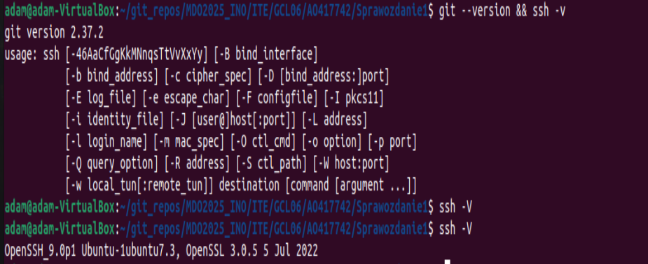

**2. Klonowanie repozytorium za pomocą HTTPS:**

Sklonowanie repozytorium przedmiotowego używając HTTPS i PAT(Personal Access Token).

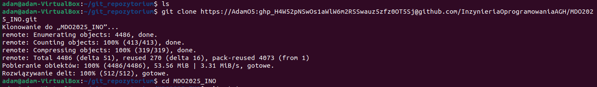

**3. Klonowanie repozytorium za pomocą SSH:**

- Wygenerowanie dwóch kluczy SSH do uwierzytelniania na GitHub:

`ssh-keygen -t ed25519 -C "aolech55@gmail.com"`

`ssh-keygen -t ecdsa -b 521 -C "aolech55@gmail.com"`

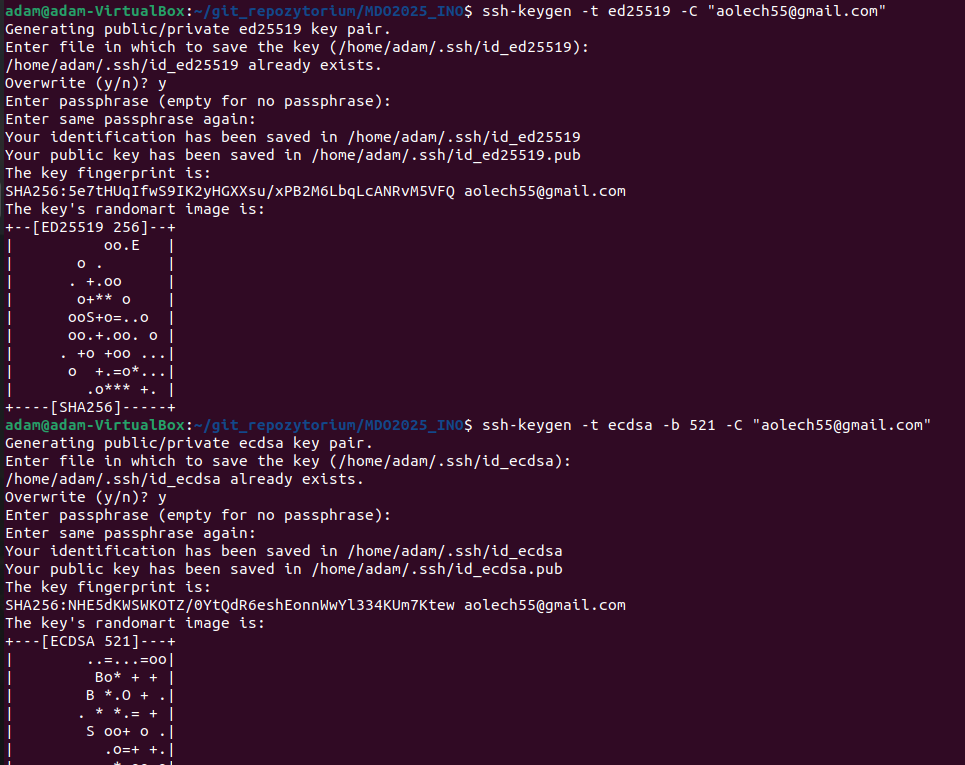

- Konfiguracja klucza SSH jako metoda dostępu do GitHuba.
  Dodanie klucza prywatnego do agenta SSH

`eval "$(ssh-agent -s)"`

`ssh-add ~/.ssh/id_ed25519`

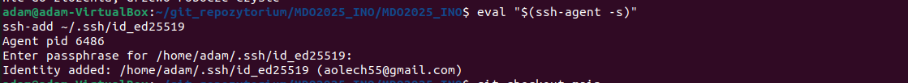

- Skopiowanie klucza publicznego do GitHuba

`cat ~/.ssh/id_ed25519.pub`

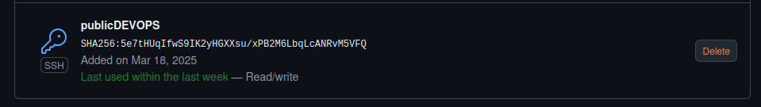

- sklonowanie repozytorium z wykorzystaniem protokołu SSH

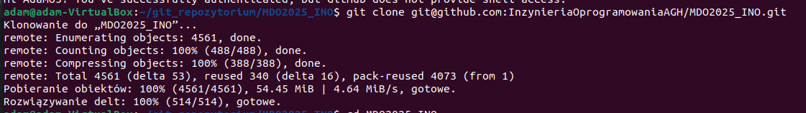

- konfiguracja uwierzytelniania dwuetapowego 2FA

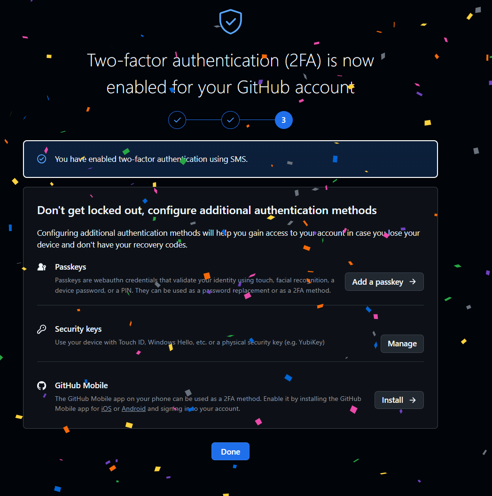

## 4. Przejście na odpowiednią gałąź w repozytorium

Przełączenie się na gałąź main:

`git checkout main`

`git pull origin main`

Sprawdzenie dostępnych zdalnych gałęzi odbywa się za pomocą polecenia:

`git branch -r`

Następnie przełączenie się na gałąź grupową i utworzenie nowej gałęzi z moimi inicjałami i numerem albumu.

`git checkout -b GCL06 origin/GCL06`

`git checkout -b AO417742`

`git push -u origin AO417742`

Utworzono również nowy katalog także o nazwie inicjały i numer albumu.

`mkdir AO417742`


## 5. Tworzenie Git Hooka:

Aby zapewnić jednolity format commit message stworzono skrypt GitHook commit-msg, który sprawdza czy każdy commit zaczyna się od AO417742


**Testowanie dodawania commita**

`adam@adam-VirtualBox:~/git_repozytorium/MDO2025_INO$ git commit -m "Testowy commit " BŁĄD: commit message musi zaczynać się od 'AO417742'`

Próba wciągnięcia swojej gałęzi do gałęzi grupowej Po zakończeniu prac na mojej gałęzi AO417742, scalono ją do GCL06.

`git merge AO417742`

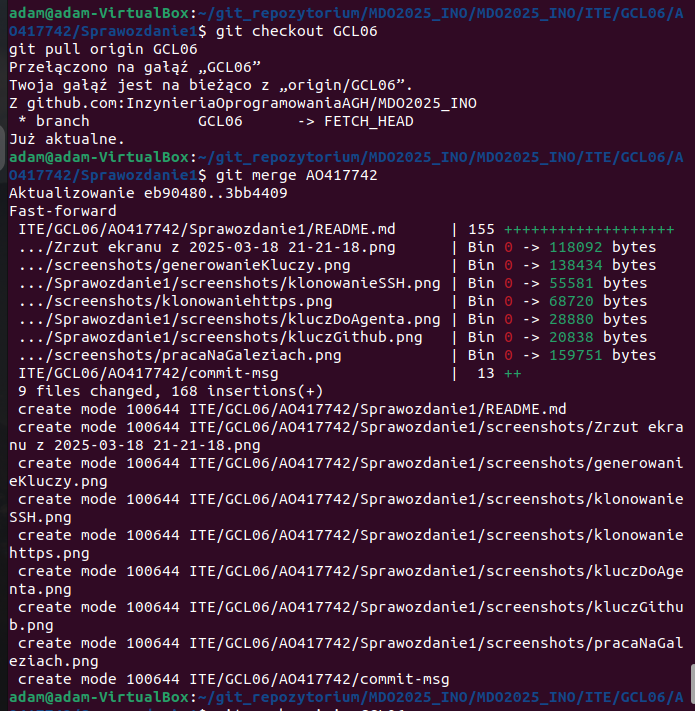

### Ćwiczenia nr.2

## 1. Instalacja dockera:

Do instalacji użyto repozytorium APT:

Na poczatku zainstalowano potrzebne narzędzia:

```
sudo apt install apt-transport-https ca-certificates curl software-properties-common -y
```

Pobranie klucza GPG, który umożliwia weryfikacje pakietów pobieranych z repozytorium dockera:

```
curl -fsSL https://download.docker.com/linux/ubuntu/gpg | sudo gpg --dearmor -o /usr/share/keyrings/docker-archive-keyring.gpg
```

Dodanie repozytorium Dockera:

```
echo "deb [arch=$(dpkg --print-architecture) signed-by=/usr/share/keyrings/docker-archive-keyring.gpg] \
https://download.docker.com/linux/ubuntu $(lsb_release -cs) stable" | \
sudo tee /etc/apt/sources.list.d/docker.list > /dev/null
```

Dodatkowo odświeżono listę pakietów:

`sudo apt update`

Zainstalowano Dockera:

```
sudo apt install docker-ce docker-ce-cli containerd.io -y
```

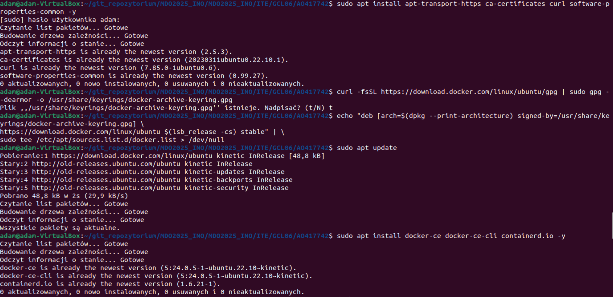

Na końcu sprawdzono czy docker został zainstalowany poprawnie:
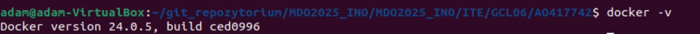

Uruchomienie i weryfikacja statusu usługi:

`sudo systemctl start docker`

`sudo systemctl status docker`

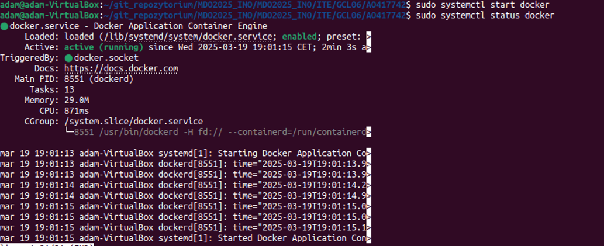

## 2. Rejestracja w DockerHub

Zarejestrowano się w DockerHub a następnie zalogowano

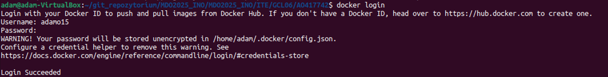

## 3. Pobrano za pomocą Dockera obrazy:

hello-world, busybox, ubuntu, mysql

```
docker pull hello-world
docker pull busybox
docker pull ubuntu
docker pull mysql
```

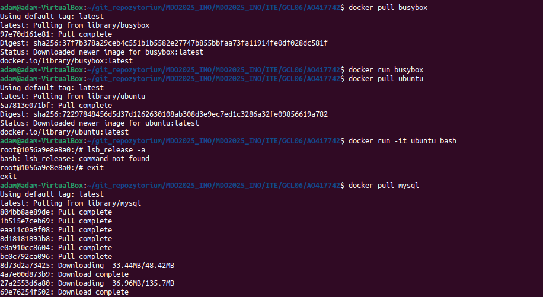

Zweryfikowano poprawność pobrania obrazów za pomocą komendy:

`docker images`

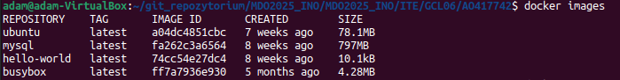

## 4. Uruchomienie kontenera z obrazu busybox:

`docker run --name busybox-container -it busybox sh`

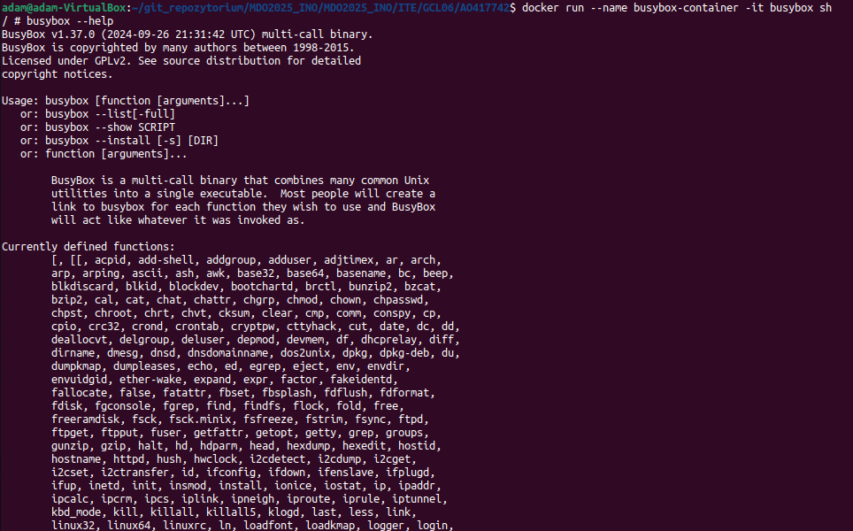

Efekt uruchomienia kontenera:

`docker ps -a`

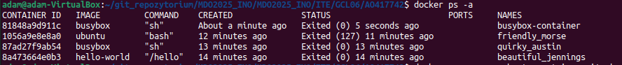

## 5. Uruchomienie "systemu w kontenerze" - Ubuntu

```
docker run --name ubuntu-container -it ubuntu bash
```

Zaprezentowano PID1 w kontenerze:

`ps aux`

Zaaktualizowano pakiety:

`apt update && apt upgrade -y`

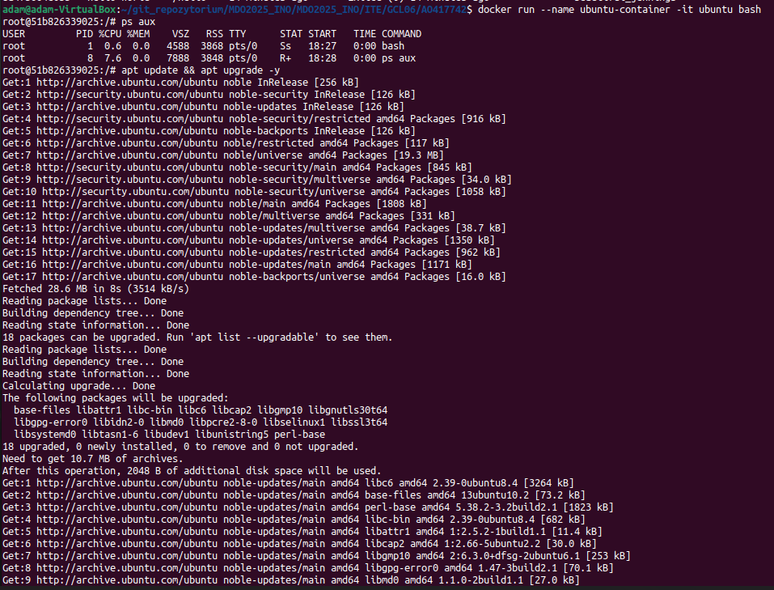

Wyjście z kontenera za pomocą komendy:

`exit`

## 6. Stworzenie pliku Dockerfile i zbudowanie obrazu z klonowaniem repozytorium:

Zawartość pliku Dockerfile:

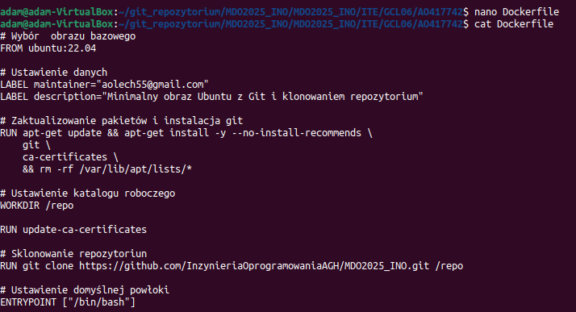

Następnie zbudowano i uruchomiono obraz

Budowa obrazu:

`docker build -t moj-ubuntu-git .`

Uruchomienie obrazu w trybie interaktywnym:

`docker run --name ubuntu-git-container -it moj-ubuntu-git`


## 7. Pokazanie uruchomionych kontenerów oraz wyczyszczenie ich:

Wyświetlenie uruchomionych kontenerów za pomoca polecenia:

`docker ps -a`

Wyczyszczenie kontenerów:

`docker container prune`

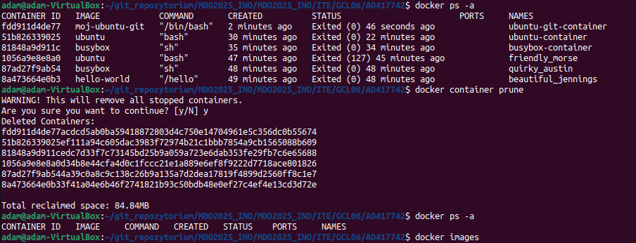

## 8. Wyczyszczenie wszystkich obrazów:

`docker images`

`docker images prune -a`

## 9. Dodanie Dockerfile do folderu Sprawozdanie1 w repozytorium:


### Ćwiczenia nr. 3

## 1. Budowanie i testowanie projektu poza kontenerem

## Projekt 1 - irssi

Sklonowanie repozytorium

`git clone https://github.com/irssi/irssi.git`

`cd irssi`

Następnie zainstalowano wymagane zależności:

```
sudo apt install -y git curl build-essential meson ninja-build
sudo apt install -y libglib2.0-dev libssl-dev libperl-dev libncurses-dev
sudo apt install -y libutf8proc-dev libgcrypt20-dev libotr5-dev
sudo apt install -y pkg-config perl libperl5.34 perl-modules-5.34
```

Budowanie i testowanie:

`meson build`

`ninja -C build`

`meson test -C build`

Testy zakończyły się sukcesem:

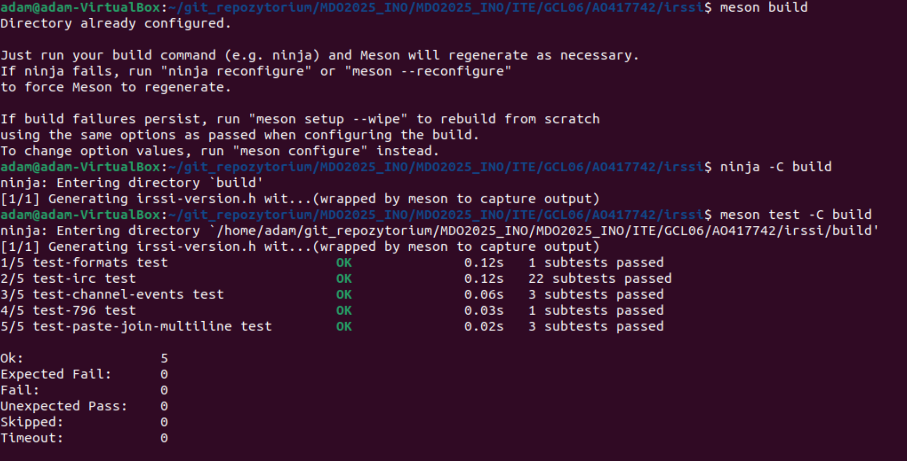

## Projekt 2 - node-js-dummy-test

Sklonowanie repozytorium:

`git clone https://github.com/devenes/node-js-dummy-test.git`

`cd node-js-dummy-test`

Instalacja zależności:

```
sudo apt install -y git curl
sudo apt install -y nodejs
```

Uruchomienie testów:

`npm test`

Test zakończony pomyślnie:

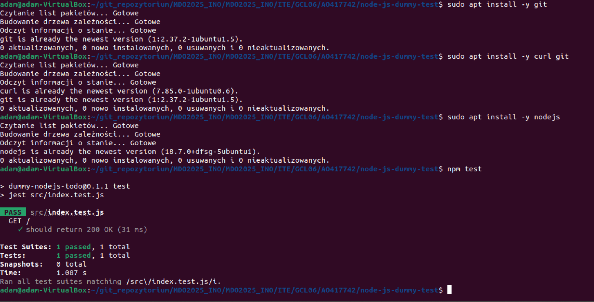

### 2. Przeprowadzenie buildu i testu w kontenerze

### Projekt 1 - irssi

Uruchomienie kontenera z obrazem Ubuntu w trybie interaktywnym:

`sudo docker run -it --name irssi-build ubuntu:22.04 /bin/bash`

oraz aktualizacja pakietów:

`apt update`

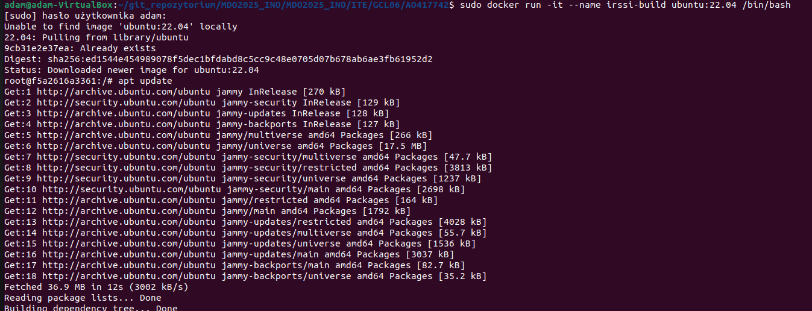

Instalacja wymaganych zależności:

1. meson, ninja, git:

`apt install -y git curl build-essential meson ninja-build`

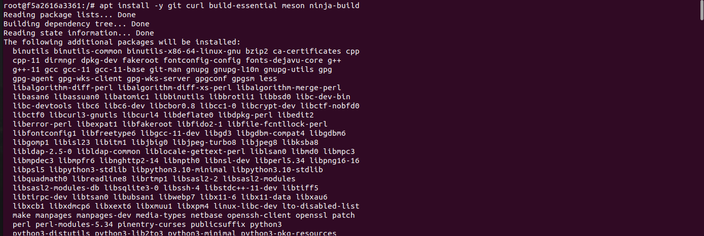

2. Dodatkowe biblioteki dev - libglib, libssl, libperl, libcurses

`apt install -y libglib2.0-dev libssl-dev libperl-dev libncurses-dev`

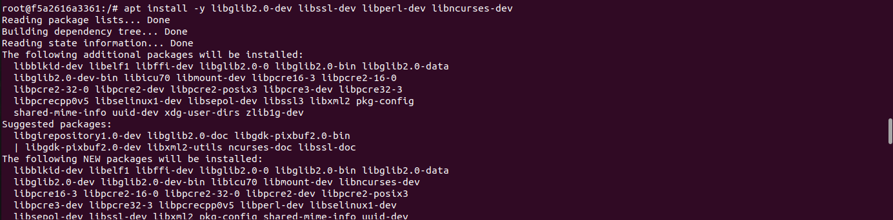

3. Dodatkowe niezbędne biblioteki:

`apt install -y libutf8proc-dev libgcrypt20-dev libotr5-dev`

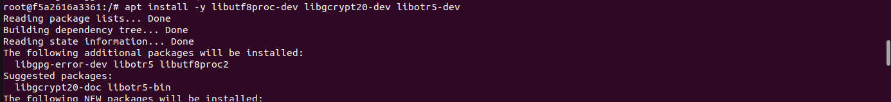

`apt install -y pkg-config perl libperl5.34 perl-modules-5.34`

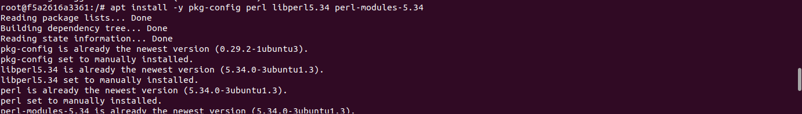

Klonowanie repozytorium irssi:

```
git clone https://github.com/irssi/irssi.git
cd irssi
```

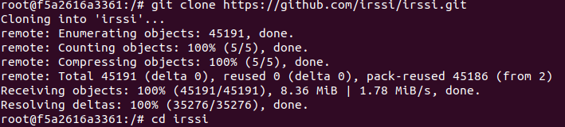

Konfiguracja środowiska oraz uruchomienie build:

`meson build`

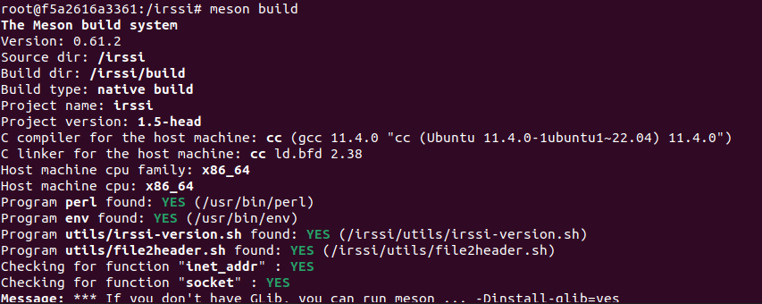

`ninja -C build`

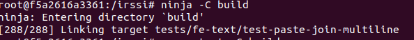

Uruchomienie testów jednostkowych:

`meson test -C build`

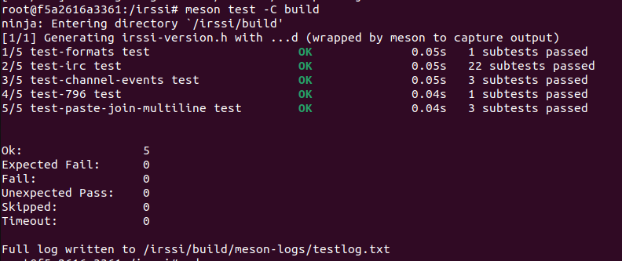

### Projekt 2 - node-js-dummy-test

Uruchomienie kontenera w trybie interaktywnym:

`sudo docker run -it --name node-dummy-ubuntu ubuntu:22.04 bash`

oraz aktualizacja pakietów:

`apt update`

Instalacja zależności (curl i git)

`apt install -y curl git`

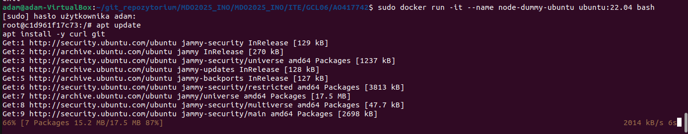

Instalacja Node.js oraz npm

`apt install -y nodejs`

`npm install`

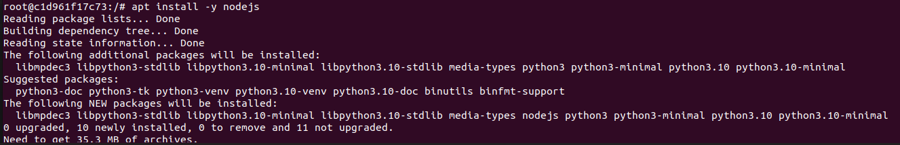

Weryfikacja poprawności instalacji:

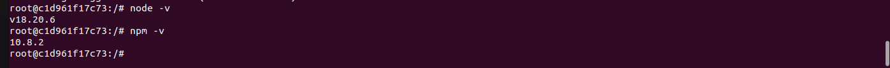

Klonowanie repozytorium:

```
git clone https://github.com/devenes/node-js-dummy-test.git
cd node-js-dummy-test

```

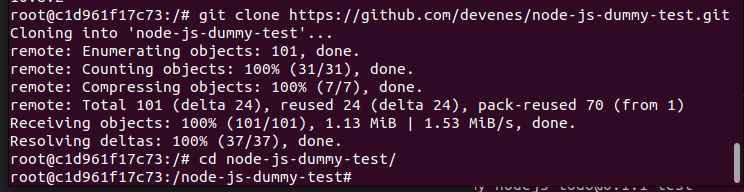

Uruchomienie testów:

`npm test`

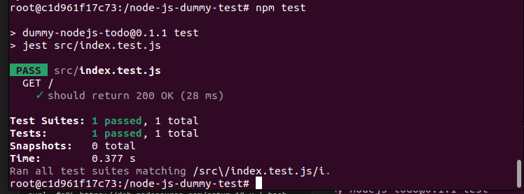

## 3. Stworzenie Dockerfile'i do builda i testów

### Projekt 1 - irssi

Dockerfile wykonujący build:

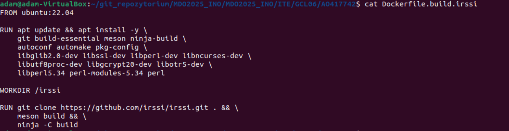

Następnie wykonano build za pomocą Dockerfile:

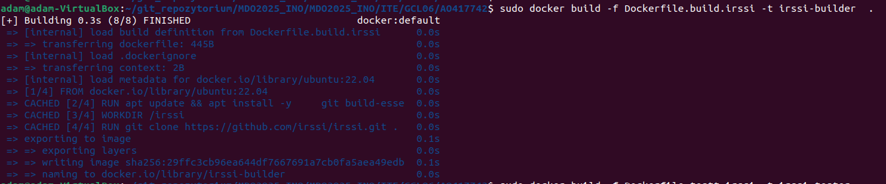

Dockerfile testujący, który bazuje na obrazie irssi-builder:

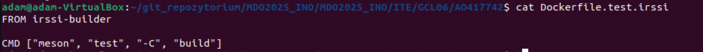

Testowanie za pomocą Dockerfile:

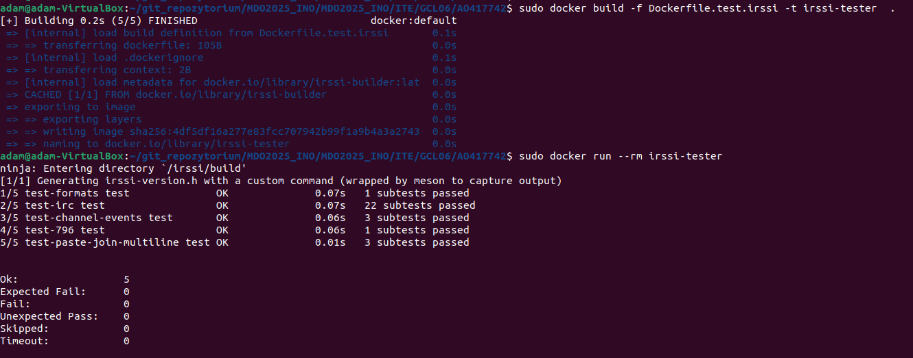

### Projekt 2 - node-js-dummy-test

Dockerfile wykonujący build:


Następnie wykonano build za pomocą Dockerfile:

`sudo docker build -f Dockerfile.build.node -t node-dummy-builder .`

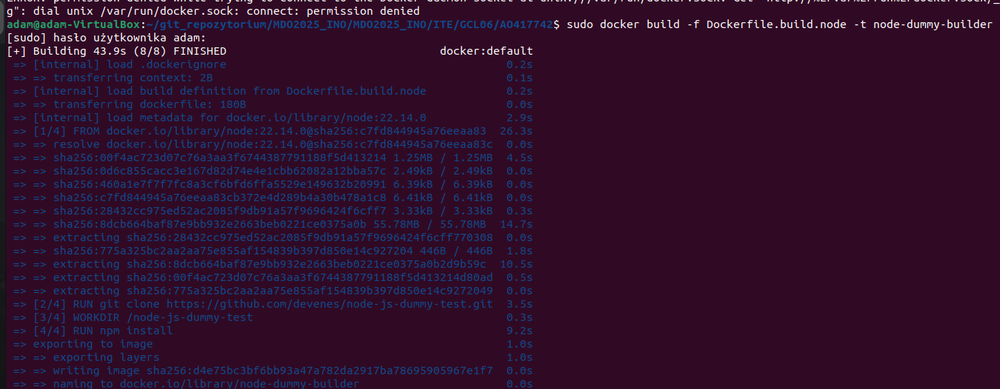

Dockerfile testujący, który bazuje na obrazie node-dummy-builder:


Testowanie za pomocą Dockerfile:

- budowanie obrazu testera:

`docker build -f Dockerfile.test.node -t node-dummy-tester .`

- uruchomienie testów:

`docker run --rm node-dummy-tester`

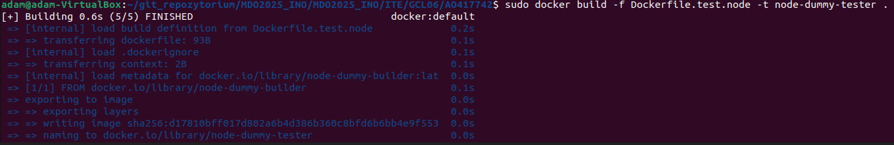
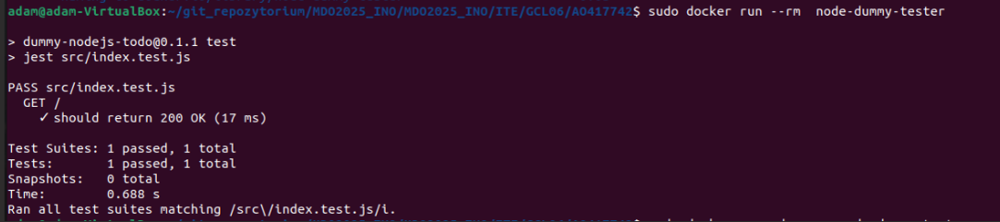

## 4. Wykazanie poprawności wdrażania i pracy kontenera

Sprawdzenie wyników działania kontenerów:
Sprawdzenie listy kontenerów:

`sudo docker ps -a`

Sprawdzenie logów działania:

```
sudo docker logs node-test-debug
sudo docker logs irssi-test-debug
```

Logi pokazują wykonanie testów, wszystkie zakończone OK, co dowodzi poprawnego działania.

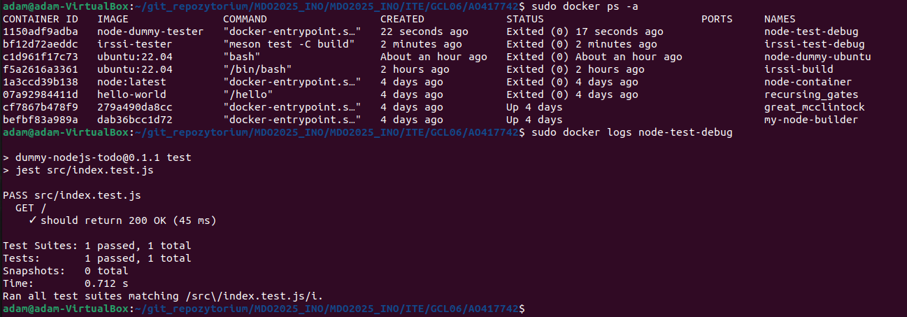


## Ćwiczenia nr. 4

## 1. Zachowywanie stanu (woluminy)

Utworzenie woluminów wjściowego i wyjściowego oraz podłączenie ich do kontenera bazowego.

```
docker volume create wejscie
docker volume create wyjscie
```

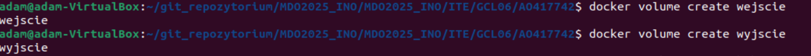

Uruchomienie kontenera bazowego

```
docker run --rm -it --name f1 \
  -v wejscie:/mnt/wez \
  -v wyjscie:/mnt/wynik \
  ubuntu:22.04 /bin/bash
```

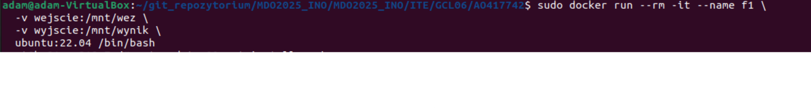
W kontenerze doinstalowano wymagane zależności:

```
apt update && apt install -y build-essential meson ninja-build \ autoconf automake pkg-config \ libglib2.0-dev libssl-dev libperl-dev libncurses-dev \ libutf8proc-dev perl libgcrypt20-dev libotr5-dev
```

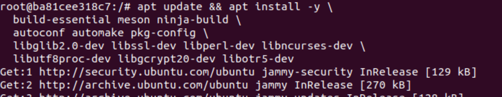

Klonowanie repozytorium na wolumin wejściowy

**Wariant – na hoście do plików dockera:**

```
sudo git clone --branch AO417742 https://github.com/InzynieriaOprogramowaniaAGH/MDO2025_INO.git /var/lib/docker/volumes/wejscie/_data/MDO2025_INO
```

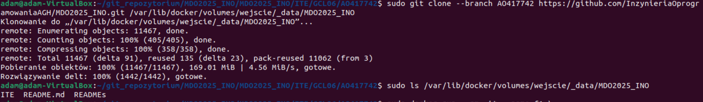

Build projektu (wewnątrz kontenera)

W kontenerze:

```
cd irssi
meson setup build
```

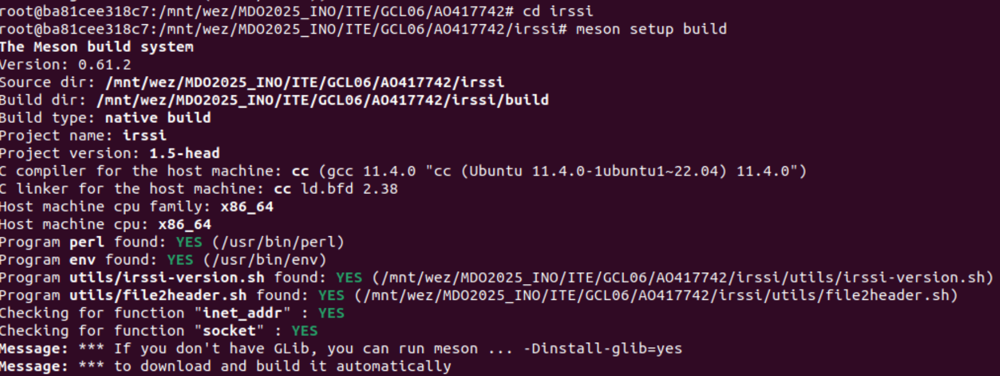

```
ninja -C build
cp -r build /mnt/wynik/
```

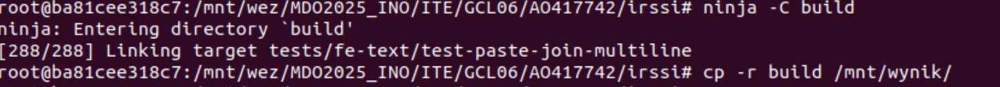

Woluminy po wyjściu z kontenera:

Pliki `build/` pozostały zapisane w `/mnt/wynik` – są dostępne po zatrzymaniu/usunięciu kontenera.

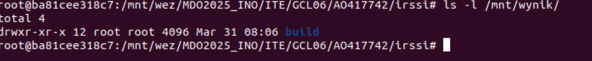

Dyskusja: Dockerfile & RUN --mount

Można zautomatyzować te kroki w Dockerfile wykorzystując:

```
RUN --mount=type=bind,target=/mnt/wejscie \
   https://github.com/InzynieriaOprogramowaniaAGH/MDO2025_INO.git /var/lib/docker/volumes/wejscie/_data/MDO2025_INO
```

## 2. Eksponowanie portu + sieci w Dockerze

1. Uruchomiono serwer iperf3 wewnątrz kontenera

`docker pull networkstatic/iperf3`

`docker run -dit --name iperf-serwer  networkstatic/iperf3 -s`

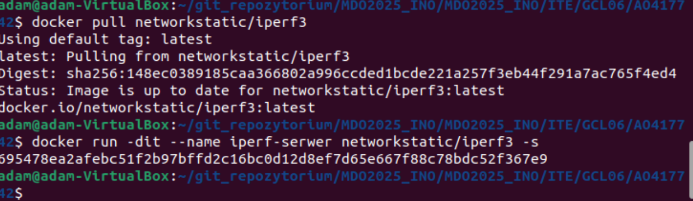

2. Połączono się z drugiego kontennera aby zbadać ruch.Uruchomiono klienta:

```
docker run --rm --name iperf-klient --link iperf-serwer networkstatic/iperf3 -c iperf-serwer
```

**Dzięki --link kontener klienta widzi iperf-serwer**

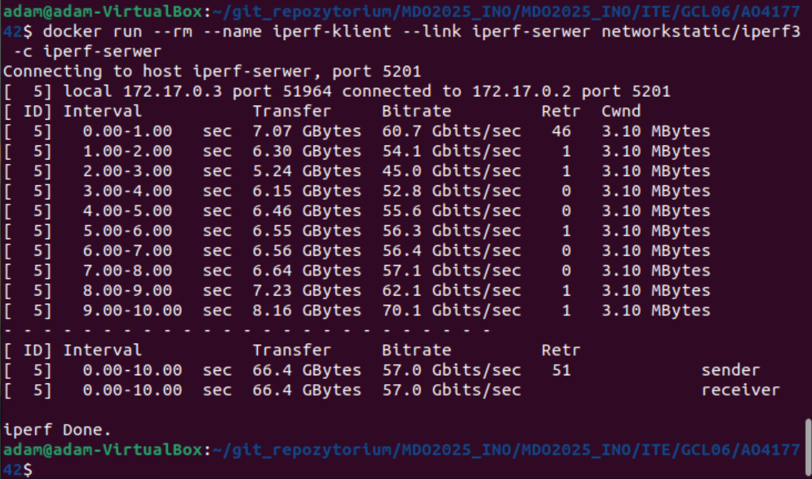

3. Stworzono własną dedykowaną sieć mostkową:

`docker network create --driver bridge moja_siec `

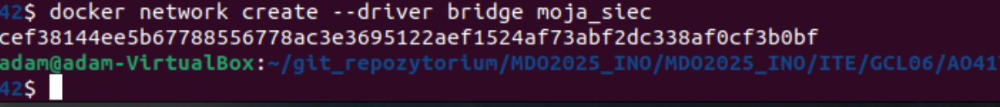

4. Powtórzono serwer i klienta w własnej sieci:

- wyczyszczono poprzedni kontener:

`docker rm -f iperf-serwer`

- uruchomiono serwer w nowej sieci:

```
docker run -dit --name iperf-serwer --network moja_siec networkstatic/iperf3 -s
```

- Uruchomiono klienta:

```
docker run --rm --name iperf-klient --network moja_siec networkstatic/iperf3 -c iperf-serwer
```

**rozwiązywanie nazw zadziałało - klient łączy się po nazwie (iperf-serwer)**

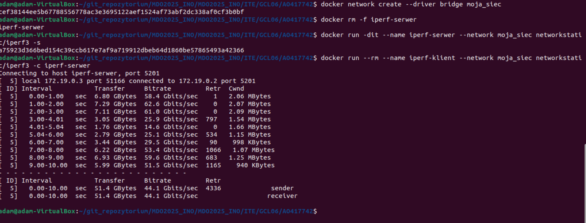

Dodatkowa weryfikacja działania kontenera i komunikacji. Aby upewnić się, że konfiguracja kontenera iperf3 działa poprawnie, poprosiłem asystenta AI (ChatGPT) o sprawdzenie, czy wszystkie kroki zostały wykonane zgodnie z wymaganiami. Prompt, który został wpisany, brzmiał:

„sprawdź czy dokładnie wszystko jest zrobione poprawnie i odwołuj się do poleceń z terminala”

Asystent przeanalizował polecenia z terminala, w tym:

stworzenie własnej sieci mostkowej docker network create --driver bridge moja_siec,

uruchomienie serwera iperf3 w kontenerze podłączonym do tej sieci,

wykonanie testu przepustowości z drugiego kontenera z rozwiązywaniem nazw (iperf-serwer),

Odpowiedź asystenta potwierdziła, że każdy z wymaganych kroków został wykonany poprawnie, a konfiguracja działała tak, jak oczekiwano. Weryfikacja ta miała na celu dodatkowe udokumentowanie, że środowisko zostało zbudowane i przetestowane zgodnie z założeniami ćwiczenia.

5. Połączono się z hosta (spoza kontenera)

- zniszczono stary serwer

`docker rm -f iperf-serwer`

- wystawiono port na zewnątrz i uruchomiono serwer:

```
docker run -dit --name iperf-serwer --network moja_siec -p 5201:5201 networkstatic/iperf3 -s
```

- połączono się z hosta:

`iperf3 -c 127.0.0.1`

**Host łączy się z serwerem w kontenerze przez port 5201**

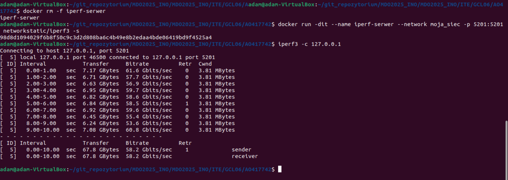

6. Sprawdzono przepustowość, wyciągając logi z kontenera

`docker logs iperf-serwer`

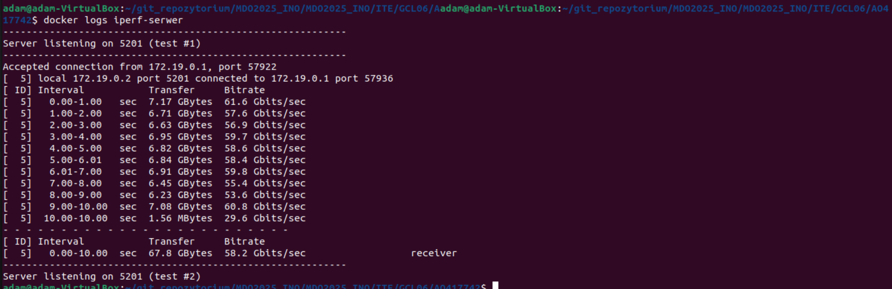

## 3. Jenkins:

- Utworzono sieć dla Jenkins + DIND

`docker network create jenkins`

- Uruchomiono kontener z (pomocnika)

```
docker run \
  --name jenkins-docker \
  --rm \
  --detach \
  --privileged \
  --network jenkins \
  --network-alias docker \
  --env DOCKER_TLS_CERTDIR="" \
  -v jenkins-docker-certs:/certs/client \
  -v jenkins-data:/var/jenkins_home \
  docker:dind
```

**--privilegend** - wymagane dla DIND

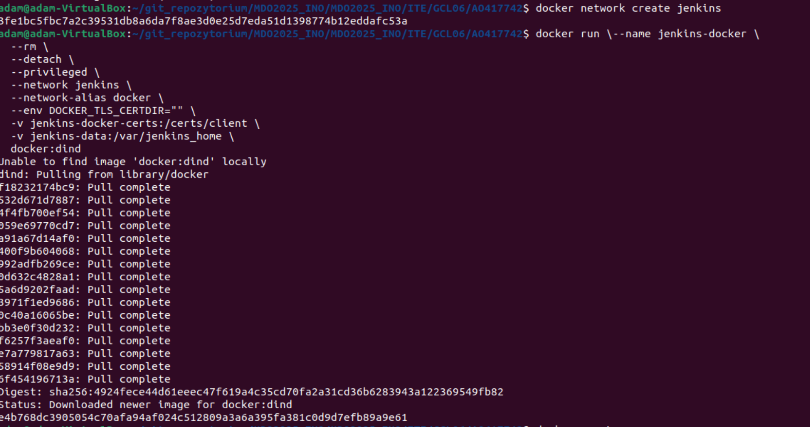

- Uruchomiono kontener Jenkins (master)

```
docker run \
  --name jenkins \
  --rm \
  --detach \
  --network jenkins \
  -p 8080:8080 -p 50000:50000 \
  -v jenkins-data:/var/jenkins_home \
  -v jenkins-docker-certs:/certs/client:ro \
  -e DOCKER_HOST=tcp://docker:2375 \
  -e DOCKER_CERT_PATH=/certs/client \
  -e DOCKER_TLS_VERIFY=0 \
  jenkins/jenkins:lts
```

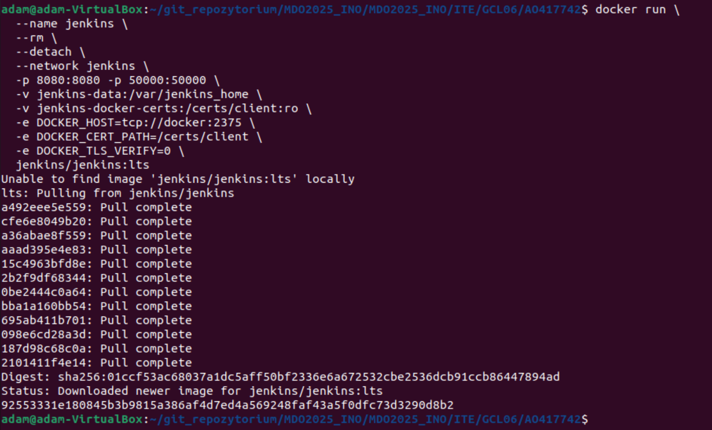

- Sprawdzenie działających kontenerów:

`docker ps`

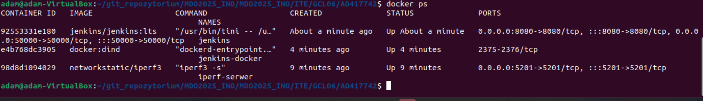

- Następnie wyciągnięto klucz z logów za pomocą polecenia:

```
docker logs jenkins 2>&1 | grep -A 2 "Please use the following password"
```

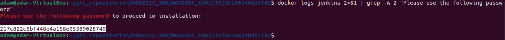

- Efektem było zalogowanie się do Jenkinsa:

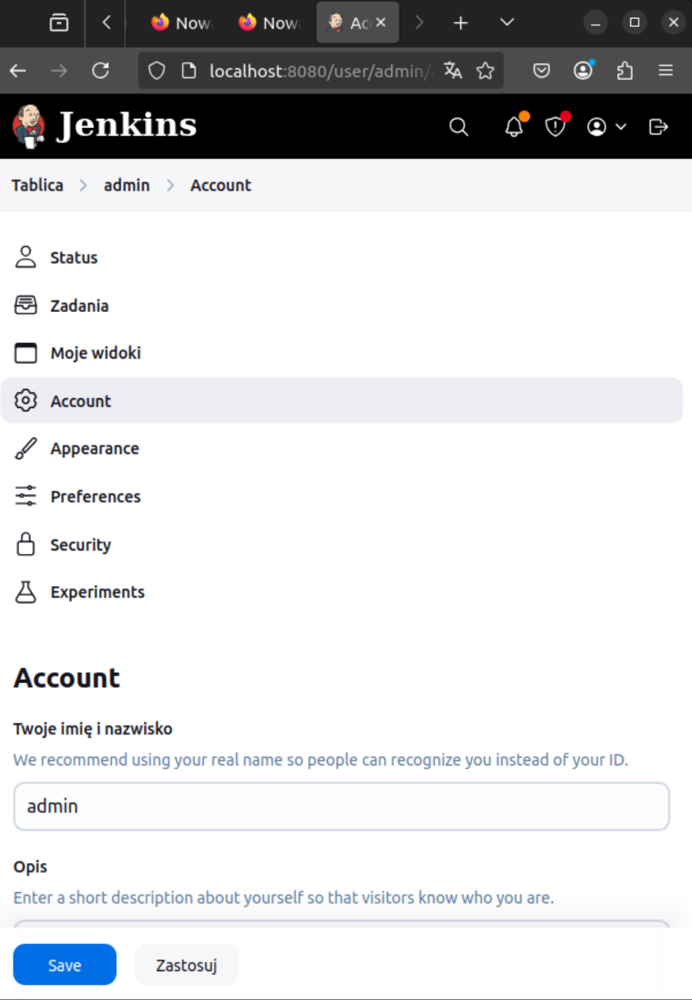
