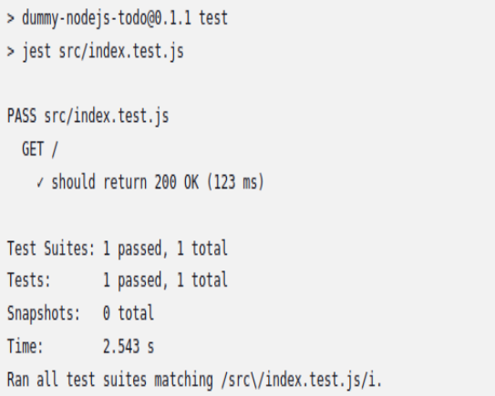

# Sprawozdanie 2 - Adam Olech

## 1. Utworzenie instancji Jenkins

W pierwszym kroku upewniono się, że działają wymagane kontenery:

- Kontener Jenkins (jenkins/jenkins:lts)

- Kontener Docker DIND (docker:dind)

Weryfikacja za pomocą polecenia:

`docker ps`

Efekt działania:


Widać, że kontener jenkins pracuje na porcie 8080, natomiast docker:dind udostępnia port 2375, umożliwiając Jenkinsowi komunikację z Dockerem.

## 2. Jenkins - zadania wstępne

1. Utworzenie projektu, który wyświetla uname.

W Jenkinsie utworzono nowy ogólny projekt o nazwie "uname" i w kroku budowania wybrano "Uruchom powłokę", gdzie dodano polecenie:

`uname -a`

W efekcie wyświetlono informacje o systemie:


2. Utworzenie projektu, sprawdzającego czy godzina jest parzysta.

Za pomocą polecenia:

```
if [ $(( $(date +%H) % 2 )) -ne 0 ]; then
  echo "Godzina jest nieparzysta."
  exit 1
else
  echo "Godzina jest parzysta."
fi
```

W efekcie uzyskano poprawny wynik:

- Jeśli godzina jest nieparzysta zadanie kończy się błędem (EXIT 1).

- Jeśli godzina jest parzysta zadanie kończy się sukcesem.


3.  Utworzenie projektu w którym pobierany jest obraz kontenera Ubuntu (docker pull)

`docker pull`

Efekt:
W logu konsoli widać pobieranie obrazu ubuntu:latest zakończone powodzeniem.


## 3. Jenkins - pierwszy obiekt typu pipeline.

W tej części utworzono pierwszy obiekt typu Pipeline, zgodnie z wymaganiami ćwiczeń. Pipeline skonfigurowano ręcznie w Jenkinsie, bez użycia SCM

### Konfiguracja pipeline’u :

1. W Jenkinsie utworzono nowy obiekt typu Pipeline, nazwany first_pipeline.

2. W pipeline znajdują się dwa etapy: Checkout i Build.

### Zawartość pipeline’u:

```pipeline {
    agent any

    stages {
        stage('Clone') {
            steps {
                git branch: 'AO417742', url: 'https://github.com/InzynieriaOprogramowaniaAGH/MDO2025_INO.git'
            }
        }
        stage('Build Dockerfile') {
            steps {
                sh 'docker build -t node-dummy-builder -f ITE/GCL06/AO417742/Dockerfile.build.node ITE/GCL06/AO417742/'
            }
        }
    }
}
```

fragmenty logów konsoli:


Po zapisaniu i uruchomieniu pipeline’u, Jenkins poprawnie wykonał oba etapy (Clone i Build Dockerfile) i zakończył zadanie sukcesem.


Pipeline został uruchomiony wielokrotnie, co potwierdza jego powtarzalność. Na zrzucie widać dwa zakończone sukcesem wykonania (#4, #5):

## 4. Opis celu + diagramy

### Cel:

Celem projektu było stworzenie i uruchomienie kompletnego procesu CI/CD w Jenkinsie dla aplikacji Node.js (node-js-dummy-test), z wykorzystaniem kontenerów Docker. Pipeline realizuje wszystkie etapy typowego procesu integracji i wdrożenia:

clone -> build -> test -> deploy -> publish

### Wymagania wstępne środowiska:

Aby pipeline działał poprawnie, środowisko musi spełniać następujące warunki:

- Zainstalowany Docker + wsparcie dla Docker-in-Docker (DIND)

- Uruchomiony kontener jenkins/jenkins:lts skonfigurowany do pracy z Docker

- Uruchomiony kontener docker:dind

- Jenkins z zainstalowanym pluginem Pipeline

- Dostęp do repozytorium GitHub (MDO2025_INO) z plikami: Jenkinsfile, Dockerfile., kod źródłowy aplikacji

### Diagram aktywności procesu CI:


### Diagram wdrożeniowy:


Diagramy zostały wykonane w programie "diagrams.net"

## 5. Realizacja Pipeline – składnia i etapy

### Konfiguracja środowiska – Jenkins i DIND

Na potrzeby realizacji pipeline'u skonfigurowano środowisko zgodnie z wymaganiami projektu. W tym celu uruchomiono dwa kontenery:

```
docker run -d \
  --name jenkins \
  -p 8080:8080 -p 50000:50000 \
  -v jenkins_home:/var/jenkins_home \
  -v /var/run/docker.sock:/var/run/docker.sock \
  jenkins/jenkins:lts

```

Jenkins (jenkins/jenkins:lts) – odpowiada za wykonanie pipeline’u, pobieranie kodu, budowanie i testowanie aplikacji.

```
docker run --privileged \
  --name dind \
  -d -p 2375:2375 \
  -e DOCKER_TLS_CERTDIR= \
  docker:dind

```

Docker-in-Docker (docker:dind) – umożliwia Jenkinsowi budowanie i uruchamianie obrazów Docker wewnątrz własnego środowiska kontenerowego.

#### Dlaczego DIND?

Kontener Jenkins działa bezpośrednio wewnątrz Dockera, ale nie posiada domyślnie uprawnień do uruchamiania kolejnych kontenerów. Docker-in-Docker (DIND) rozwiązuje ten problem, udostępniając serwis Dockera jako endpoint na porcie 2375.

### Pliki Dockerfile używane w pipeline:

Pipeline został zdefiniowany jako plik Jenkinsfile, umieszczony w repozytorium pod gałęzią AO417742. Wykonywane są w nim wszystkie główne etapy procesu CI/CD: Clone, Build, Test, Deploy, Publish.

Zdecydowano o oddzieleniu kontenera build od deploy. Choć oba obrazy bazują na node:22.14.0-slim, to:

- node-js-dummy:build służy wyłącznie do instalacji zależności (npm install)

- node-js-dummy:deploy jest lekki i uruchamia aplikację (CMD ["npm", "start"])

W ramach realizacji pipeline wykorzystywane są trzy kluczowe pliki:

- Dockerfile.build.node – używany w etapie Build, zawiera instrukcję npm install, przygotowuje zależności aplikacji.

```

FROM node:22.14.0-slim

COPY node-js-dummy-test/ .
WORKDIR /node-js-dummy-test

RUN npm install
```

- Dockerfile.test.node – używany w etapie Test, uruchamia testy aplikacji (npm test).

```
FROM node:22.14.0-slim

WORKDIR /app

COPY node-js-dummy-test/ .

RUN npm install

CMD ["npm", "test"]
```

- Dockerfile.deploy.node – wykorzystywany w etapie Deploy, zawiera CMD ["npm", "start"], służy do uruchomienia aplikacji jako kontener działający na porcie 3000.

```
FROM node:22.14.0-slim

WORKDIR /app

COPY node-js-dummy-test/ .

RUN npm install

CMD ["npm", "start"]
```

Każdy z tych plików został odpowiednio umieszczony w folderze ITE/GCL06/AO417742 i pobierany jest w odpowiednim etapie pipeline’u.

\*Pipeline skonfigurowano z użyciem SCM – Jenkins pobiera definicję pipeline’u bezpośrednio z repozytorium GitHub (gałąź AO417742, plik Jenkinsfile)


### Etapy Pipeline:

#### Etap 1: Clone

```
stage('Clone') {
    steps {
        sh 'rm -rf MDO2025_INO'
        sh 'git clone -b AO417742 --single-branch https://github.com/InzynieriaOprogramowaniaAGH/MDO2025_INO.git'
    }
}

```


- Pobiera repozytorium ze zdalnego Gita (w tym Jenkinsfile oraz pliki Dockerfile i źródła).

- W logach widoczna poprawna inicjalizacja i checkout

### Etap 2: Build

```
stage('Build') {
    steps {
        echo 'Budowanie obrazu aplikacji'
        sh 'docker build -t ${IMAGE_NAME}:build -f ${PATH_PREFIX}/Dockerfile.build.node ${PATH_PREFIX}'
    }
}

```


- Buduje obraz node-js-dummy:build z pliku Dockerfile.build.node.

- Plik zawiera RUN npm install, co przygotowuje zależności.

- Obraz bazuje na node:22.14.0-slim – świadomie wybrany tag, jak zaleca instrukcja.

### Etap 3: Test

```
stage('Test') {
    steps {
        echo 'Uruchamianie testów'
        sh 'docker build -t ${IMAGE_NAME}:test -f ${PATH_PREFIX}/Dockerfile.test.node ${PATH_PREFIX}'
        sh 'docker run --rm ${IMAGE_NAME}:test npm test'
    }
}
```




- Tworzy obraz testowy node-js-dummy:test z pliku Dockerfile.test.node.

- Uruchamiane są testy z użyciem jest.

- Log potwierdza wykonanie testu i wynik PASS

### Etap 4: Build Deploy Image

```
stage('Build Deploy Image') {
    steps {
        echo 'Budowanie obrazu (deploy)'
        sh 'docker build -t ${IMAGE_NAME}:deploy -f ${PATH_PREFIX}/Dockerfile.deploy.node ${PATH_PREFIX}'
    }
}

```


- Obraz node-js-dummy:deploy zawiera CMD ["npm", "start"], uruchamiający aplikację.

- Używany ten sam kod co w build/test, ale celem jest runtime w środowisku docelowym.

### Etap 5: Deploy

```
stage('Deploy') {
    steps {
        echo 'Tworzenie sieci deploy i uruchamianie kontenera'
        sh 'docker network create ci || true'
        sh 'docker run -d --rm --network ci --name deploy -p 3000:3000 ${IMAGE_NAME}:deploy'
    }
}

```


- Tworzy sieć ci i uruchamia aplikację na porcie 3000.

- Pozwala na testowanie dostępności wewnątrz tej samej sieci Docker.

### Etap 6: Test Deploy

```
stage('Test Deploy') {
    steps {
        echo 'Sprawdzenie czy aplikacja działa na porcie 3000'
        sh '''
        sleep 5
        docker run --rm --network ci curlimages/curl curl -s deploy:3000 || echo "curl failed"
        '''
    }
}
```


- Używa kontenera curlimages/curl do sprawdzenia dostępności aplikacji.

- Log potwierdza zwrócenie HTML-a strony (czyli aplikacja działa).

### Etap 7: Publish

```
stage('Publish') {
    steps {
        echo 'Tworzenie artefaktu ZIP'
        sh '''
        cd ${PATH_PREFIX}/node-js-dummy-test
        zip -r ../../../node-js-dummy-test.zip .
        '''
        archiveArtifacts artifacts: 'MDO2025_INO/ITE/node-js-dummy-test.zip', fingerprint: true
    }
}
```


- Tworzony jest artefakt .zip zawierający zbudowaną aplikację.

- Artefakt jest wersjonowany i archiwizowany w Jenkinsie.


Powyższy zrzut ekranu przedstawia podsumowanie zakończonego pipeline'u. Widać, że został uruchomiony na poprawnej gałęzi (AO417742), zakończył się sukcesem, a artefakt node-js-dummy-test.zip został zarchiwizowany i jest dostępny do pobrania w Jenkinsie.


Jako formę publikacji wybrano archiwum .zip, zawierające kompletny kod źródłowy aplikacji Node.js wraz z plikami package.json, Dockerfile, kodem źródłowym i frontendem. Jest to uniwersalny i przenośny format, który można uruchomić na dowolnej maszynie z Node.js

### Etap 8: Images

```
stage('Images') {
    steps {
        sh 'docker images'
    }
}
```


- Dla celów diagnostycznych pokazuje, które obrazy zostały utworzone.

### Post: Cleanup

```
post {
    always {
        echo 'Czyszczenie kontenera i sieci'
        sh 'docker stop deploy || true'
        sh 'docker network rm ci || true'
    }
}

```


- Zgodnie z dobrą praktyką — usuwa kontener deploy i sieć ci.

### Kompletna treść Pipeline'a:

```
pipeline {
    agent any

    environment {
        IMAGE_NAME = "node-js-dummy"
        TAG = "v1.0"
        PATH_PREFIX = "MDO2025_INO/ITE/GCL06/AO417742"
    }

    stages {
        stage('Clone') {
            steps {
                sh 'rm -rf MDO2025_INO'
                sh 'git clone -b AO417742 --single-branch https://github.com/InzynieriaOprogramowaniaAGH/MDO2025_INO.git'

            }
        }

        stage('Build') {
            steps {
                echo 'Budowanie obrazu aplikacji'
                sh 'docker build -t ${IMAGE_NAME}:build -f ${PATH_PREFIX}/Dockerfile.build.node ${PATH_PREFIX}'
            }
        }

        stage('Test') {
            steps {
                echo 'Uruchamianie testów'
                sh 'docker build -t ${IMAGE_NAME}:test -f ${PATH_PREFIX}/Dockerfile.test.node ${PATH_PREFIX}'
                sh 'docker run --rm ${IMAGE_NAME}:test npm test'
            }
        }

        stage('Build Deploy Image') {
            steps {
                echo 'Budowanie obrazu (deploy)'
                sh 'docker build -t ${IMAGE_NAME}:deploy -f ${PATH_PREFIX}/Dockerfile.deploy.node ${PATH_PREFIX}'
            }
        }

        stage('Deploy') {
            steps {
                echo 'Tworzenie sieci deploy i uruchamianie kontenera'
                sh 'docker network create ci || true'
                sh 'docker run -d --rm --network ci --name deploy -p 3000:3000 ${IMAGE_NAME}:deploy'
            }
        }

       stage('Test Deploy') {
    steps {
        echo 'Sprawdzenie czy aplikacja działa na porcie 3000'
        sh '''
        sleep 5
        docker run --rm --network ci curlimages/curl curl -s deploy:3000 || echo "curl failed"
        '''
    }
}
        stage('Publish') {
            steps {
                echo 'Tworzenie artefaktu ZIP'
                sh '''
                cd ${PATH_PREFIX}/node-js-dummy-test
                zip -r ../../../node-js-dummy-test.zip .
                '''
                archiveArtifacts artifacts: 'MDO2025_INO/ITE/node-js-dummy-test.zip', fingerprint: true
            }
        }

        stage('Images') {
            steps {
                sh 'docker images'
            }
        }
    }

    post {
        always {
            echo 'Czyszczenie kontenera i sieci'
            sh 'docker stop deploy || true'
            sh 'docker network rm ci || true'
        }
    }
}

```


- Pipeline był uruchamiany wielokrotnie, a każde wykonanie przechodziło poprawnie. Zapewnia to, że proces CI/CD jest powtarzalny, odporny na błędy środowiskowe i nie polega na żadnych danych cache’owanych z poprzednich wykonań.

## Pomoc narzędzia AI:

- Problem:

Etap Test Deploy w pipeline'ie nie zwracał oczekiwanej odpowiedzi HTTP. Aplikacja działała, ale curl uruchamiany z osobnego kontenera nie potrafił się z nią połączyć.

- Rozwiązanie:

ChatGPT pomógł zdiagnozować problem związany z izolacją sieci kontenerów. Zasugerował dodanie obu kontenerów (deploy oraz curl) do tej samej sieci Docker (--network ci). W wyniku tej zmiany curl poprawnie połączył się z aplikacją.

- Weryfikacja:

Logi z etapu Test Deploy pokazują poprawną odpowiedź HTTP
