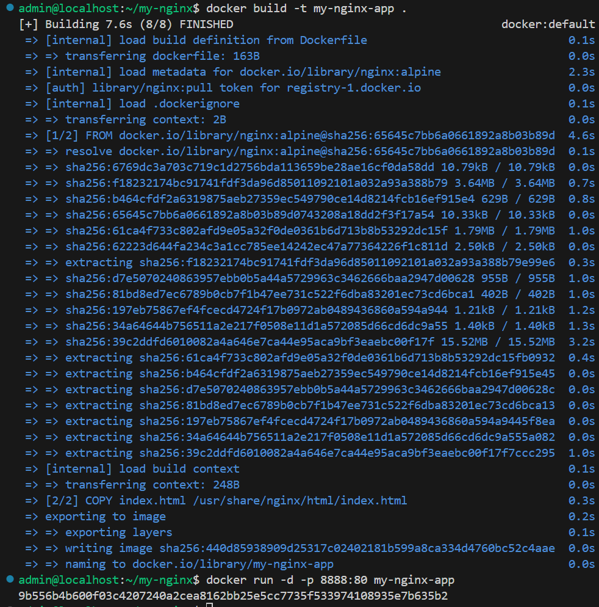
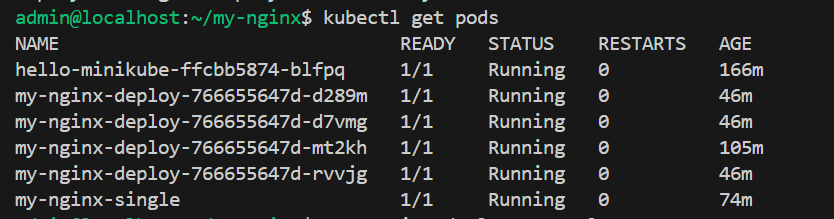

# Sprawozdanie 3 - Adam Olech

### Ćwiczenia nr.8 - "Automatyzacja i zdalne wykonywanie poleceń za pomocą Ansible"

## Etap 1: Przygotowanie maszyny docelowej ("ansible-target")

W tej części skonfigurowano drugą maszynę wirtualną, która będzie pełniła rolę hosta zarządzanego przez Ansible.

1. **Utworzenie maszyny wirtualnej**

   - W programie VirtualBox stworzono nową maszynę o nazwie `ansible-target`.
   - Użyto systemu operacyjnego Ubuntu 64-bit, zgodnie z wersją maszyny głównej (`Ubuntu 1`).

2. **Hostname**

   - Ustawiono nazwę hosta na `ansible-target` już na etapie instalacji.

3. **Utworzenie użytkownika `ansible`**

   - Podczas instalacji dodano nowego użytkownika:


## Etap 2: Instalacja Ansible i konfiguracja połączenia SSH

### Krok 1: Instalacja Ansible na głównej maszynie (Ubuntu 1)

```sudo apt update
sudo apt install ansible -y
```

następnie spradzono poprawność instalacjii:

` sudo --version`


### Krok 2: Wymiana kluczy SSH i połączenie bez hasła

1. Wygenerowano klucz SSH
   Na głównej maszynie wirtualnej (Ubuntu 1), działając jako użytkownik adam

`ssh-keygen`

2. Skopiowano klucz publiczny na maszynę ansible-target

`ssh-copy-id ansible@192.168.0.199`

Podczas pierwszego połączenia należało jeszcze podać hasło użytkownika ansible. Po pomyślnym dodaniu klucza pojawił się komunikat:

"Number of key(s) added: 1"

3. Sprawdzenie połączenia bez hasła
   Po udanym skopiowaniu klucza, połączenie SSH z maszyną ansible-target zostało przetestowane poleceniem:

` ssh ansible@192.168.0.199`

Efektem było bezpośrednie logowanie na konto użytkownika ansible bez pytania o hasło:


## Etap 3: Inwentaryzacja

**Realizacja:**

1. Ustalono przewidywalne nazwy maszyn (hostnamectl)
   polecenia:
   ` sudo hostnamectl set-hostname orchestrator-01`
   oraz `set-hostname ansible-target`.

2. Wprowadzono lokalne nazwy DNS (/etc/hosts),dodano odpowiednie wpisy IP i nazw hostów w plikach /etc/hosts obu maszyn

```
192.168.0.88 orchestrator-01
192.168.0.199 ansible-target
```

3. Zweryfikowano łączność między maszynami (ping)
   przeprowadzono test ping pomiędzy maszynami, potwierdzając łączność po nazwach.

4. Utworzono plik inwentaryzacji z podziałem na grupy:

```
[Orchestrators]
orchestrator-01 ansible_host=192.168.0.88 ansible_user=adam

[Endpoints]
ansible-target ansible_host=192.168.0.199 ansible_user=ansible

```

Wysłano żądanie ping do wszystkich maszyn (Ansible) za pomocą komendy:

```
 ansible all -m ping -i inventory.ini
```


— wynik "pong" dla obu maszyn potwierdził sukces.

## Etap 4: Zdalne wywoływanie procedur

_zadania zostały wykonanne przy użyciu własnych playbooków w katalogu (ansible/playbooks)_

1. Wysłanie żądania ping do wszystkich maszyn
   Wykonano playbook ping_all.yaml:

```
- name: Ping all hosts
  hosts: all
  tasks:
    - name: Ping hosts
      ansible.builtin.ping:
```

Uruchomienie:

`ansible-playbook -i ../inventory.ini ping_all.yaml`


2.  Skopiowanie pliku inwentaryzacji na maszynę ansible-target
    Wykonano playbook copy_inventory.yaml:

```
- name: Copy inventory to endpoints
  hosts: Endpoints
  tasks:
    - name: Copy inventory.ini to /tmp
      ansible.builtin.copy:
        src: ../inventory.ini
        dest: /tmp/inventory.ini
```

Plik został poprawnie skopiowany, changed=1


3. Ponowienie operacji i porównanie wyjścia
   Po wykonaniu operacji kopiowania pliku inventory.ini na maszynę ansible-target, powtórzono oba playbooki:

- copy_inventory.yaml

- ping_all.yaml

Wyniki:


- Playbook copy_inventory.yaml:
  Za drugim uruchomieniem: changed=0, ok=2

Oznacza to, że plik nie został nadpisany, ponieważ już istniał w wymaganej formie

- Playbook ping_all.yaml:

Wykazał changed=0, ok=2 dla obu maszyn

Potwierdza, że żadne zmiany nie zostały wprowadzone

4. Aktualizacja pakietów w systemie
   Wykonano playbook update_system.yaml:

```
- name: Update system packages
  hosts: all
  become: true
  tasks:
    - name: Update apt packages
      ansible.builtin.apt:
        upgrade: dist
        update_cache: true

```

Uruchomienie:

`ansible-playbook -i ../inventory.ini update_system.yaml --ask-become-pass`

Aktualizacja przebiegła pomyślnie (changed=1 lub ok)


5. Restart usług sshd i rngd
   Wykonano playbook restart_services.yaml:

```
- name: Restart sshd and rngd services
  hosts: all
  become: true
  tasks:
    - name: Restart sshd
      ansible.builtin.service:
        name: ssh
        state: restarted

    - name: Restart rngd
      ansible.builtin.service:
        name: rngd
        state: restarted
        enabled: true
      ignore_errors: true
```


Usługa sshd została zrestartowana, brak błędów przy rngd dzięki ignore_errors: true - w przypadku braku usługi

6. Ponowienie operacji przy wyłączonym ssh oraz odłączonej karcie sieciowej na maszynie docelowej
   Na maszynie ansible-target wykonano:

```
sudo systemctl stop ssh
sudo ip link set enp0s3 down
```

Następnie z orchestrator-01 wykonano:

`ansible all -m ping -i ../inventory.ini`


- Maszyna ansible-target została oznaczona jako UNREACHABLE
- orchestrator-01 odpowiedział poprawnie

Po testach przywrócono łączność:

```
sudo ip link set enp0s3 up
sudo systemctl start ssh
```

- Ponowny ping zakończył się sukcesem.

## Etap 5: Zarządzanie stworzonym artefaktem

_Zdalne wywoływanie procedur – artefakt: plik binarny (aplikacja Node.js)_

### Krok 1: **Skopiowanie pliku aplikacji na maszynę docelową**

`deploy_app.yml`

```
- name: Deploy Node.js App
  hosts: Endpoints
  become: true
  roles:
    - myapp
```

Opis:

- Playbook wykonuje całą operację na grupie (Endpoints).
- Wszystkie kroki są zawarte w roli `myapp`.

### Krok 2: **Struktura roli `myapp`**

Utworzono rolę poleceniem:

```
ansible-galaxy init myapp
```

#### Katalog: `roles/myapp/tasks/main.yml`

_Poniżej znajduje się treść pliku main.yml, realizującego wdrożenie aplikacji:_

```
- name: Ensure /opt/myapp exists
  ansible.builtin.file:
    path: /opt/myapp
    state: directory
    mode: '0755'

- name: Install unzip
  apt:
    name: unzip
    state: present
  become: true

- name: Install Docker
  apt:
    name: docker.io
    state: present
    update_cache: true
  become: true

- name: Copy artifact zip
  copy:
    src: node-js-dummy-test.zip
    dest: /tmp/node-js-dummy-test.zip

- name: Unpack app zip
  unarchive:
    src: /tmp/node-js-dummy-test.zip
    dest: /opt/myapp/
    remote_src: yes

- name: Copy Dockerfile
  copy:
    src: Dockerfile
    dest: /opt/myapp/Dockerfile

- name: Build app Docker image
  community.docker.docker_image:
    name: myapp_image
    build:
      path: /opt/myapp/
      dockerfile: Dockerfile
    source: build
    state: present
  become: true

- name: Run app Docker container
  community.docker.docker_container:
    name: myapp
    image: myapp_image
    state: started
    ports:
      - "3000:3000"
  become: true

```

**Opis:**

- Instalacja wymaganych pakietów (docker.io, unzip).
- Wysłanie i rozpakowanie aplikacji.
- Budowa obrazu Dockera i uruchomienie kontenera.

### Krok 3: **Pliki dodatkowe roli**

#### `roles/myapp/files/Dockerfile`

```
FROM node:18
WORKDIR /app
COPY . .
RUN npm install
EXPOSE 3000
CMD ["npm", "start"]
```

Opis:

- Aplikacja działa na Node.js.
- Wszystkie pliki kopiowane, zależności instalowane.
- Kontener wystawia port 3000.

### Krok 4: **Weryfikacja działania**

Po wykonaniu playbooka:

`ansible-playbook -i ../inventory.ini deploy_myapp.yml`

- Uruchomiono kontener `myapp`.
- Sprawdzono: `docker ps`.
- Aplikacja nasłuchuje poprawnie na porcie 3000 - sprawdzenie curl'em.


## **Podsumowanie**

- Aplikacja została przesłana, rozpakowana i uruchomiona.
- Kontener Dockera działa na zdalnej maszynie.
- Wszystko opakowane w rolę myapp i automatyzowane przez deploy_app.yml.
- Działanie aplikacji zostało zweryfikowane praktycznie, a nie tylko uruchomieniem playbooka.

### Ćwiczenia nr. 9 - Pliki odpowiedzi dla wdrożeń nienadzorowanych

## Etap 1: Instalacja systemu fedora i pobranie pliku odpowiedzi

Instalacja systemu Fedora i pobranie pliku odpowiedzi
Do instalacji systemu wykorzystano obraz Fedora Server, uruchomiony na maszynie wirtualnej. Instalację przeprowadzono w trybie graficznym z domyślnymi ustawieniami: automatyczne partycjonowanie, konfiguracja użytkownika root oraz sieci.


Po zakończeniu instalacji system został uruchomiony ponownie. Zalogowano się, a następnie pobrano wygenerowany automatycznie plik odpowiedzi:

Plik ten wrzucono na repozytorium, ponieważ będzie on wykorzystany do przygotowania nienadzorowanej instalacji w kolejnych etapach.

## Etap 2: Instalacja systemu Fedora w trybie nienadzorowanym z użyciem pliku Kickstart

1. Modyfikacja pliku Kickstart:

Plik "anaconda-ks.cfg" został zmodyfikowany w celu zapewnienia poprawnego działania instalacji:

- Dodano repozytoria z pakietami dla Fedory 42:

```
url --mirrorlist=http://mirrors.fedoraproject.org/mirrorlist?repo=fedora-42&arch=x86_64
repo --name=update --mirrorlist=http://mirrors.fedoraproject.org/mirrorlist?repo=updates-released-f42&arch=x86_64

```

- Ustawiono automatyczne czyszczenie całego dysku:

```
clearpart --all --initlabel
```

- Skonfigurowano unikalną nazwę hosta:

```
network --hostname=fedora-nienadzorowana --bootproto=dhcp
```

2. Instalacja:

Do instalacji wykorzystano obraz systemu Fedora 42 Server Edition, uruchomiony na maszynie wirtualnej VirtualBox. Jako źródło konfiguracji wskazano plik Kickstart, znajdujący się w repozytorium GitHub:

```
inst.ks=https://raw.githubusercontent.com/InzynieriaOprogramowaniaAGH/MDO2025_INO/main/ITE/GCL06/AO417742/anaconda-ks.cfg
```

3. Efekt:

System został pomyślnie zainstalowany w trybie nienadzorowanym. Po zakończeniu instalacji:

- Maszyna uruchomiła się automatycznie

- System posiada nadany hostname fedora-nienadzorowana, zgodnie z konfiguracją.

- Login do systemu jako użytkownik root przebiegł bezproblemowo

- Plik Kickstart został automatycznie zapisany jako /root/anaconda-ks.cfg i zawiera wszystkie zastosowane ustawienia

Poniższe zrzuty ekranu potwierdzają poprawne wykonanie instalacji:


- Logowanie do systemu po instalacji (login: root)

- Podgląd zawartości pliku Kickstart oraz struktury patrtycji (lsblk)

## Etap 3: Integracja artefaktu z systemem za pomocą Kickstart

1. **Modyfikacja pliku Kickstart**:

Do instalacji systemu Fedora wykorzystano plik odpowiedzi anaconda-ks.cfg, który umożliwia automatyczne przeprowadzenie całego procesu. Zawiera on wszystkie kroki niezbędne do przygotowania środowiska, zainstalowania zależności, pobrania aplikacji oraz uruchomienia jej jako usługi systemowej:

```
# Generated by Anaconda 42.27.12
# Generated by pykickstart v3.62
#version=DEVEL

url --mirrorlist=http://mirrors.fedoraproject.org/mirrorlist?repo=fedora-42&arch=x86_64
repo --name=update --mirrorlist=http://mirrors.fedoraproject.org/mirrorlist?repo=updates-released-f42&arch=x86_64

network --hostname=fedora-nienadzorowana --bootproto=dhcp

# Keyboard layouts
keyboard --vckeymap=pl --xlayouts='pl'

# System language
lang pl_PL.UTF-8

timezone Europe/Warsaw --utc
ignoredisk --only-use=sda
clearpart --all --initlabel
autopart --type=lvm
bootloader --location=mbr --boot-drive=sda
firstboot --enable

# Root password
rootpw --iscrypted $y$j9T$narFjE/6C3ovO7bx/cZhEmKR$OW/pUJvHNWRiMTXd5pNGugqlrCgpfEXKXM.GDwNmoj4

%packages
@^server-product-environment
@core
@container-management
wget
curl
unzip
nodejs
%end

%post
# Tworzenie katalogu na aplikację
mkdir -p /usr/local/bin/nodejs-dummy

# Pobranie i wypakowanie artefaktu z GitHuba
wget -O /tmp/node-js-dummy-test.zip https://github.com/InzynieriaOprogramowaniaAGH/MDO2025_INO/raw/refs/heads<aw/refs/heads/AO417742/ITE/GCL06/AO417742/node-js-dummy-test.zip/AO417742/ITE/GCL06/AO417742/node-js-dummy-test.zip
unzip /tmp/node-js-dummy-test.zip -d /usr/local/bin/nodejs-dummy

# Skrypt startowy aplikacji Node.js
cat << 'EOF' > /usr/local/bin/start-nodejs
#!/bin/bash
cd /usr/local/bin/nodejs-dummy
npm install
npm start
EOF

chmod +x /usr/local/bin/start-nodejs

# Konfiguracja usługi systemd
cat << 'EOF' > /etc/systemd/system/nodejs-dummy.service
[Unit]
Description=Start Node.js Dummy App
After=network.target

[Service]
ExecStart=/usr/local/bin/start-nodejs
Restart=always
User=root

[Install]
WantedBy=multi-user.target
EOF

# Włączenie usługi przy starcie
systemctl enable nodejs-dummy.service

# Włączenie Dockera (bez startu)
systemctl enable docker
%end

# auto reboot
reboot
```

- **Zależności aplikacji:**

W sekcji %packages wskazano pakiety wymagane przez aplikację:

```
@core
nodejs
wget, curl, unzip
```

- **Pobranie artefaktu:**

W sekcji %post zastosowano wget, aby pobrać zip z aplikacją node-js-dummy-test.zip z GitHuba:

```
wget -O /tmp/node-js-dummy-test.zip ...
unzip -d /usr/local/bin/nodejs-dummy
```

- **Konfiguracja aplikacji:**

Tworzony jest skrypt startowy oraz jednostka systemd:

```
cat > /usr/local/bin/start-nodejs ...
cat > /etc/systemd/system/nodejs-dummy.service ...
systemctl enable nodejs-dummy.service

```

- **Reboot:**

Po zakończeniu instalacji system jest automatycznie restartowany:

`reboot`

2.  **Weryfikacja poprawności działania**

Po restarcie i uruchomieniu systemu Fedora zalogowano się jako root. Następnie potwierdzono, że aplikacja została uruchomiona jako usługa:

Zrzuty:


`systemctl status nodejs-dummy` – usługa aktywna

`journalctl -u nodejs-dummy -b` – aplikacja uruchamia się poprawnie

`curl http://localhost:3000` – aplikacja działa (Simple To-Do App)

### Ćwiczenia nr. 10 - Wdrażanie na zarządzalne kontenery: Kubernetes (1)

1. **Instalacja i uruchomienie Minikube na Fedora:**

- **Instalacja Minikube:**
  Minikube został pobrany bezpośrednio jako pakiet RPM i zainstalowany

```
curl -LO https://storage.googleapis.com/minikube/releases/latest/minikube-latest.x86_64.rpm
sudo rpm -Uvh minikube-latest.x86_64.rpm
```


Po uruchomieniu klastra Minikube z driverem Docker`minikube start --driver=docker`, wystąpił problem z brakiem połączenia z internetem wewnątrz minikube:

"Failing to connect to https://registry.k8s.io from inside the minikube container"

Docker na hoście działał poprawnie (ping z busybox przechodził) ale wewnątrz Minikube sieć nie działała.

**Rozwiązanie:**

- Usunąłem poprzedni klaster: `minikube delete`

- Zrestartowałem Dockera: `sudo systemctl restart docker`

- Uruchomiłem klaster ponownie z poprawnym trybem sieciowym:
  `minikube start --driver=docker --network=bridge`

Po tych krokach Minikube odzyskał pełny dostęp do internetu – problem zniknął.


Po uruchomieniu, działanie klastra sprawdzono:

```
minikubectl get nodes
minikubectl get pods -A
```


Następnie uruchomiono testowy pod:

```
kubectl create deployment hello-minikube --image=kicbase/echo-server:1.0
kubectl expose deployment hello-minikube --type=NodePort --port=8080

```

Kroki:

- Uruchomiono przekierowanie portów do serwisu w Kubernetesie:

- kubectl port-forward service/hello-minikube 7080:8080
  W pliku ~/.ssh/config w systemie Windows dodano wpis:

```
Host fedora
  HostName 192.168.1.23
  User admin
  LocalForward 7080 localhost:7080
```

Po połączeniu z Fedorą przez Remote-SSH w VS Code, otwarto w przeglądarce Windowsa http://localhost:7080


Następnym krokiem było uruchomienie Dashboarda:

`minikube dashboard`


2. **Analiza posiadanego kontenera**

W ramach zadania przygotowano własny obraz Dockera na bazie nginx z indywidualnym plikiem **index.html**. Plik ten zawierał prostą aplikację HTML wyświetlającą komunikat potwierdzający działanie.

- Dockerfile:

```
FROM nginx:alpine
COPY index.html /usr/share/nginx/html/index.html
```

- Budowa i uruchomienie obrazu:

```
docker build -t my-nginx-app .
docker run -d -p 8888:80 my-nginx-app
```



Po uruchomieniu kontenera, aplikacja była dostępna pod adresem:

http://192.168.1.23:8888


Przygotowany wcześniej obraz Dockera my-nginx-app został wdrożony w lokalnym klastrze Kubernetes uruchomionym przez Minikube.

- Załadowanie obrazu do klastra:

```
docker build -t my-nginx-app:latest .
minikube image load my-nginx-app:latest

```

- Utworzenie poda:

```
minikube kubectl -- run my-nginx-single \
  --image=my-nginx-app:latest \
  --port=80 \
  --labels app=my-nginx-single \
  --image-pull-policy=Never

```

Polecenie to tworzy pojedynczy Pod o nazwie my-nginx-single, używając lokalnego obrazu

- Sprawdzenie działania poda:

`kubectl get pods `


Wyprowadzenie portu z poda:

```
kubectl port-forward pod/my-nginx-single 7082:80 --address=0.0.0.0
```


Aplikacja była dostępna pod adresem:http://192.168.1.23:7082


3. **Przekucie wdrożenia manualnego w plik wdrożenia**

Przygotowanie **deploy.yaml**

```
apiVersion: apps/v1
kind: Deployment
metadata:
  creationTimestamp: null
  labels:
    app: my-nginx-deploy
  name: my-nginx-deploy
spec:
  replicas: 1
  selector:
    matchLabels:
      app: my-nginx-deploy
  strategy: {}
  template:
    metadata:
      creationTimestamp: null
      labels:
        app: my-nginx-deploy
    spec:
      containers:
      - image: my-nginx-app:latest
        name: my-nginx-app
        imagePullPolicy: Never
        resources: {}
status: {}
```

Wdrożenie deploymentu do klastra:

`kubectl apply -f deploy.yaml`

Sprawdzenie rollout status:

`kubectl rollout status deployment/my-nginx-deploy`


Potwierdzenie działania wszystkich replik:

`kubectl get pods`


Wystawienie aplikacji przez NodePort:

`kubectl expose deployment my-nginx-deploy --type=NodePort --port=80`

Udostępnienie aplikacji przez kubectl port-forward:

`kubectl port-forward service/my-nginx-deploy 7081:80 --address=0.0.0.0`


### Ćwiczenia nr. 11 - Wdrażanie na zarządzalne kontenery: Kubernetes (2)

1. Przygotowanie wersji aplikacji

Ugtworzono dwa podkatalogi:

```
mkdir nginx-v1
mkdir nginx-v2
```

W każdym z nich umieszczono odpowiedni Dockerfile oraz zmodyfikowany index.html. Następnie zbudowano lokalne obrazy Dockera:

```
cd nginx-v1
docker build -t my-nginx-app:v1 .

cd ../nginx-v2
docker build -t my-nginx-app:v2 .
```

2. Obrazy załadowano do klastra Minikube:

```
minikube image load my-nginx-app:v1
minikube image load my-nginx-app:v2
```

3. Wdrożenie wersji v1 z replikacją

Stworzono plik "nginx-deploy-v1.yaml" z 4 replikami:

```
apiVersion: apps/v1
kind: Deployment
metadata:
  name: nginx-deploy
spec:
  replicas: 4
  selector:
    matchLabels:
      app: nginx-deploy
  template:
    metadata:
      labels:
        app: nginx-deploy
    spec:
      containers:
      - name: nginx
        image: my-nginx-app:v1
        imagePullPolicy: Never
        ports:
        - containerPort: 80

```

Zastosowano wdrożenie:

```
kubectl apply -f nginx-deploy-v1.yaml
kubectl rollout status deployment/nginx-deploy

```

Wdrożenie przebiegło pomyślnie – 4 pody z wersją v1 zostały uruchomione.


Widok aplikacji w przeglądarce (wersja v1):


4. **Zmiany w deploymencie**:

   1. Zmiana ilości replik:

- Zwiększenie do 8 replik
  Zmieniono replicas: 8 i ponownie wykonano apply.
  
- Zmniejszenie do 1 repliki
  Zmieniono replicas: 1 i wykonano apply.
  

- Skalowanie do zera (replicas: 0)
  brak uruchomionych podów.
  

- Ponowne uruchomienie (4 repliki)
  Zmieniono replicas: 4 wykonano apply.

      2. Aktualizacja aplikacji – wdrożenie v2

  Zmodyfikowano plik yaml podmieniając obraz:

`image: my-nginx-app:v2`

Wykonano:

```
kubectl apply -f nginx-deploy-v2.yaml
kubectl rollout status deployment/nginx-deploy
```


Widok aplikacji po aktualizacji do wersji v2:


5. **Historia i cofanie wdrożeń**

Wyświetlenie historii:

`kubectl rollout history deployment/nginx-deploy`


Cofnięcie zmian:

```
kubectl rollout undo deployment/nginx-deploy
kubectl rollout status deployment/nginx-deploy

```


Widok aplikacji po cofnięciu :


6. **Zastosowanie wadliwego obrazu:\***
   Przygotowano wersję obrazu zawierającą błędny ENTRYPOINT:

```
FROM nginx:alpine
ENTRYPOINT ["nonexistent-command"]
```

Następnie:

```
docker build -t my-nginx-app:broken .
minikube image load my-nginx-app:broken

```


W pliku nginx-deploy.yaml wskazano obraz:

```
image: my-nginx-app:broken
imagePullPolicy: Never
```

Wdrożenie zakończyło się błędem:

```
kubectl apply -f nginx-deploy-broken.yaml
kubectl rollout status deployment/nginx-deploy

```


- komenda kubectl get pods ujawniała status CrashLoopBackOff.


- po wykonaniu polecenia `kubectl describe pod nginx-deploy-b9689c7cb-qgrrj` ukazał się powód błędu:

" it: exec: "nonexistent-command": executable file not found in $PATH: unknown "

7. **Skrypt weryfikujący wdrożenie (60 sekund)**
   W celu weryfikacji, czy wdrożenie zakończyło się sukcesem w ciągu maksymalnie 60 sekund, przygotowano skrypt bashowy:

Plik: check-deployment.sh:

```
#!/bin/bash

DEPLOYMENT_NAME="nginx-deploy"
TIMEOUT=60
SECONDS=0

echo "Sprawdzam stayus wdrozenia: $DEPLOYMENT_NAME"

while [ $SECONDS -lt $TIMEOUT ]; do
    STATUS=$(kubectl rollout status deployment/$DEPLOYMENT_NAME 2>&1)

    if [[ "$STATUS" == *"successfully rolled out"* ]]; then
        echo "Wdrozenie zakonczone sukcesem po $SECONDS sek."
        exit 0
    fi

    sleep 5
done

echo "Wdrozenie nie zakończylo się w ciagu $TIMEOUT sekund."
exit 1

```

- Nadano skryptowi prawa wykonywania:

`chmod +x check-deployment.sh`

- Następnie uruchomiono:

`./check-deployment.sh`

### Wyniki dla:

1. Wersji broken


2. Wersji v1


3. Wersji v2


### Wykorzystanie narzędzi AI / LLM

**Treść zapytania:**
Podczas uruchamiania klastra Minikube z driverem Docker:

```
minikube start --driver=docker
```

pojawił się problem z brakiem dostępu do internetu wewnątrz klastra. Kontenery nie mogły połączyć się z zewnętrznymi rejestramy, mimo że Docker na hoście miał dostęp do sieci.

Zadane pytanie do AI:

"Minikube z driverem docker nie ma internetu w środku klastra – jak to naprawić?”

**Odpowiedź AI i rozwiązanie:**
AI zaproponowało sprawdzenie ustawień sieciowych oraz ponowne uruchomienie klastra z parametrem `--network=bridge`, który wymusza użycie odpowiedniego trybu sieciowego Dockera.

Zastosowane kroki:

```bash
minikube delete
sudo systemctl restart docker
minikube start --driver=docker --network=bridge
```

**Metoda weryfikacji odpowiedzi:**
Po wykonaniu powyższych kroków, dostęp do internetu w klastrze Minikube został przywrócony. Możliwe było np. pobieranie obrazów.
