# Sprawozdanie 1
### Aleksander Rutkowski
## 001-Class

1. Zainstaluj klienta Git i obsługę kluczy SSH

    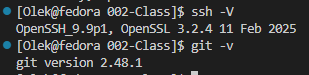

2. Sklonuj repozytorium przedmiotowe za pomocą HTTPS i personal access token

    

3. Upewnij się w kwestii dostępu do repozytorium jako uczestnik i sklonuj je za pomocą utworzonego klucza SSH, zapoznaj się dokumentacją
   - Utwórz dwa klucze SSH, inne niż RSA, w tym co najmniej jeden zabezpieczony hasłem
   - Skonfiguruj klucz SSH jako metodę dostępu do GitHuba

    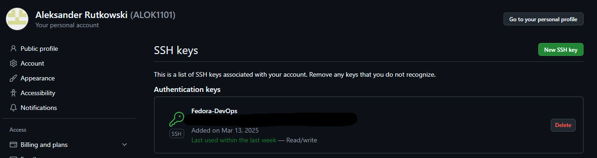

   - Sklonuj repozytorium z wykorzystaniem protokołu SSH
   
    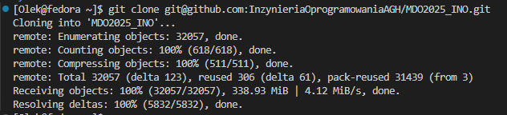
   
   - Skonfiguruj 2FA

    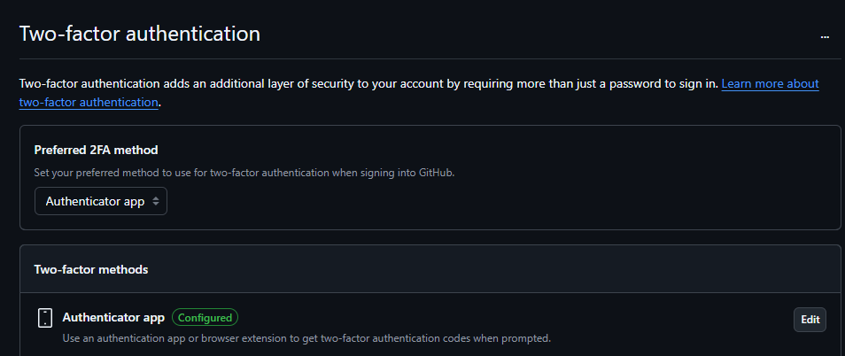

4. Przełącz się na gałąź ```main```, a potem na gałąź swojej grupy (pilnuj gałęzi i katalogu!)
5. Utwórz gałąź o nazwie "inicjały & nr indeksu" np. ```KD232144```. Miej na uwadze, że odgałęziasz się od brancha grupy!

6. Rozpocznij pracę na nowej gałęzi
   - W katalogu właściwym dla grupy utwórz nowy katalog, także o nazwie "inicjały & nr indeksu" np. ```KD232144```

    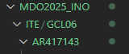

   - Napisz Git hooka - skrypt weryfikujący, że każdy Twój "commit message" zaczyna się od "twoje inicjały & nr indexu". (Przykładowe githook'i są w `.git/hooks`.)
   - Dodaj ten skrypt do stworzonego wcześniej katalogu.
   [Mój GitHook](001-Class/commit-msg-hook.sh)
   - Skopiuj go we właściwe miejsce, tak by uruchamiał się za każdym razem kiedy robisz commita.
   - Umieść treść githooka w sprawozdaniu.
 ```bash
   #!/bin/bash 
    commit_msg=$(cat "$1") 
    if ! [[ $commit_msg =~ ^AR417143 ]]; then 
    echo "Error: Commit messege musi zaczynac sie od 'AR417143'" 
    echo "Commit messege: $commit_msg" 
    exit 1 
    fi 
    exit 0 
```
  

## 002-Class

1. Zainstaluj Docker w systemie linuksowym
   
    

3. Zarejestruj się w [Docker Hub](https://hub.docker.com/) i zapoznaj z sugerowanymi obrazami
4. Pobierz obrazy `hello-world`, `busybox`, `ubuntu` lub `fedora`, `mysql`
5. Uruchom kontener z obrazu `busybox`

   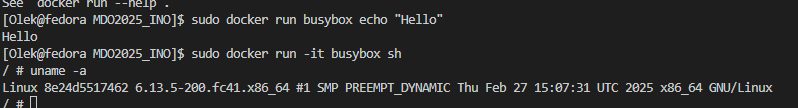

6. Uruchom "system w kontenerze" (czyli kontener z obrazu `fedora` lub `ubuntu`)
   
   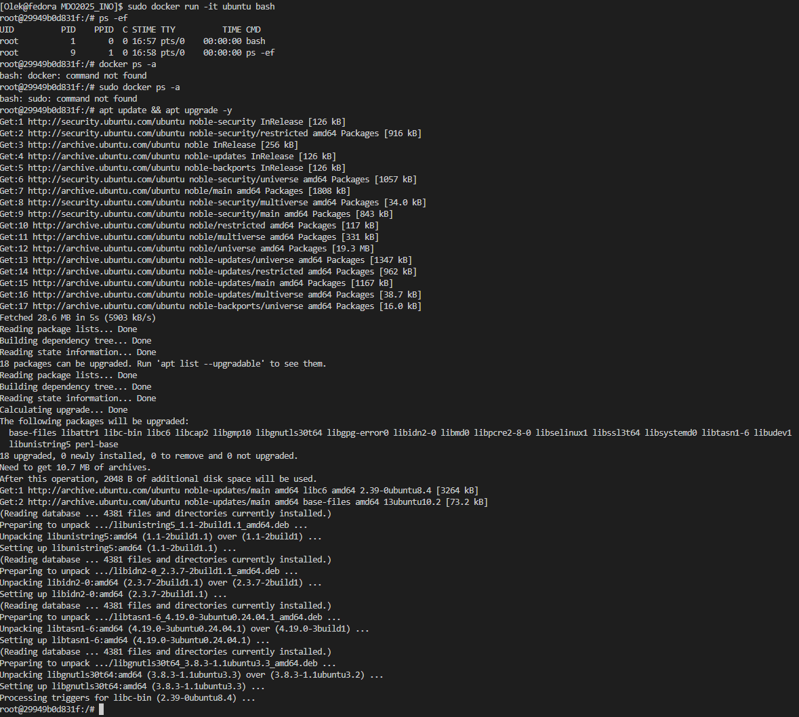 

7. Stwórz własnoręcznie, zbuduj i uruchom prosty plik `Dockerfile` bazujący na wybranym systemie i sklonuj nasze repo.
   [Mój Dockerfile](002-Class/Dockerfile) 
  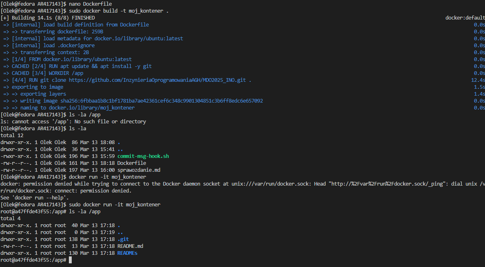 


   
8. Pokaż uruchomione ( != "działające" ) kontenery, wyczyść je.

   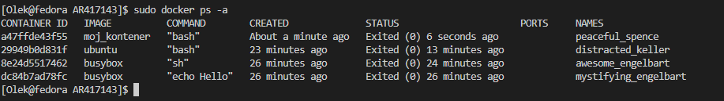 

## 003-Class

* Znajdź repozytorium z kodem dowolnego oprogramowania, które:
* dysponuje otwartą licencją	
* Sklonuj niniejsze repozytorium, przeprowadź build programu (doinstaluj wymagane zależności)

  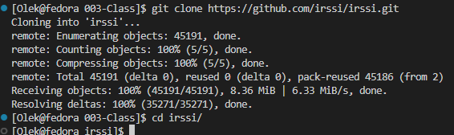 

* Uruchom testy jednostkowe dołączone do repozytorium

  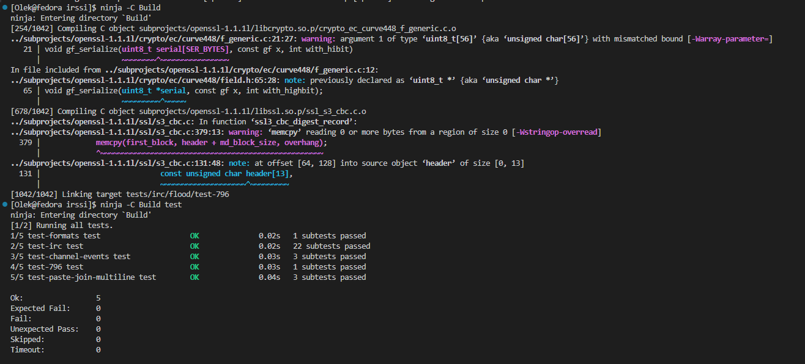 

1. Wykonaj kroki `build` i `test` wewnątrz wybranego kontenera bazowego. Tj. wybierz "wystarczający" kontener, np ```ubuntu``` dla aplikacji C lub ```node``` dla Node.js
	* uruchom kontener
	* podłącz do niego TTY celem rozpoczęcia interaktywnej pracy
	* zaopatrz kontener w wymagania wstępne (jeżeli proces budowania nie robi tego sam)
	* sklonuj repozytorium
	* Skonfiguruj środowisko i uruchom *build*
	* uruchom testy

    

2. Stwórz dwa pliki `Dockerfile` automatyzujące kroki powyżej, z uwzględnieniem następujących kwestii:
	* Kontener pierwszy ma przeprowadzać wszystkie kroki aż do *builda*

      [Mój Dockerfile Build](003-Class/dockerfileIrssi/Dockerfile.irssibld) 

      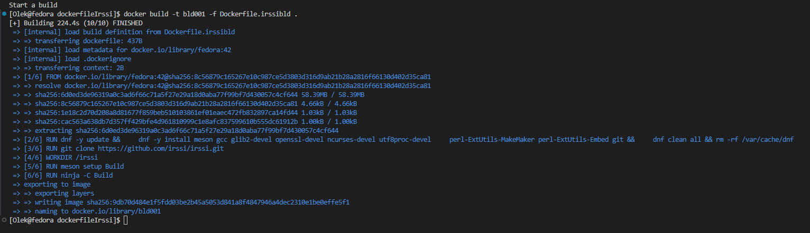

	* Kontener drugi ma bazować na pierwszym i wykonywać testy (lecz nie robić *builda*!)

      [Mój Dockerfile Test](003-Class/dockerfileIrssi/Dockerfile.irssitest) 

      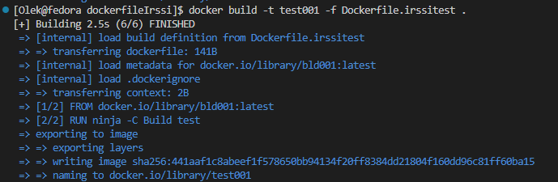

3. Wykaż, że kontener wdraża się i pracuje poprawnie. Pamiętaj o różnicy między obrazem a kontenerem. Co pracuje w takim kontenerze?

     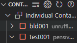

     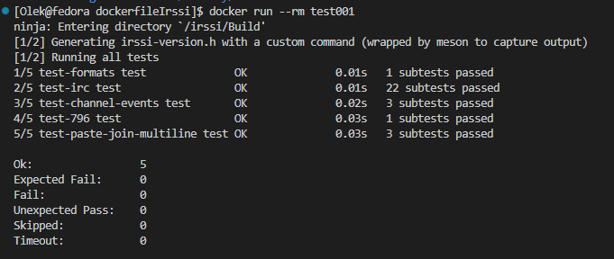

    W takim kontenerze działa proces, który został określony w Dockerfile

## 004-Class

* Zapoznaj się z dokumentacją:
  * https://docs.docker.com/storage/volumes/
  * https://docs.docker.com/engine/storage/bind-mounts/
  * https://docs.docker.com/engine/storage/volumes/
  * https://docs.docker.com/reference/dockerfile/#volume
  * https://docs.docker.com/reference/dockerfile/#run---mount
* Przygotuj woluminy wejściowy i wyjściowy, o dowolnych nazwach, i podłącz je do kontenera bazowego (np. tego, z którego rozpoczynano poprzednio pracę). Kontener bazowy to ten, który umie budować nasz projekt (ma zainstalowane wszystkie dependencje, `git` nią nie jest)

    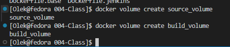

* Uruchom kontener, zainstaluj/upewnij się że istnieją niezbędne wymagania wstępne (jeżeli istnieją), ale *bez gita*

    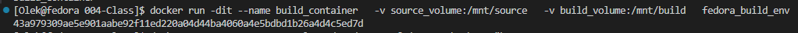

* Sklonuj repozytorium na wolumin wejściowy
  * Opisz dokładnie, jak zostało to zrobione
    * Wolumin/kontener pomocniczy?

    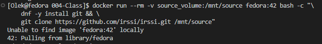

* Uruchom build w kontenerze - rozważ skopiowanie repozytorium do wewnątrz kontenera
* Zapisz powstałe/zbudowane pliki na woluminie wyjściowym, tak by były dostępne po wyłączniu kontenera.

    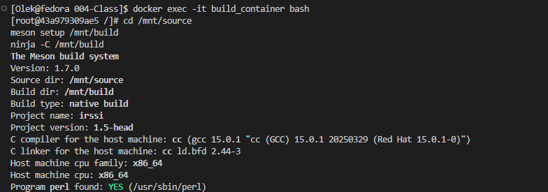


* Ponów operację, ale klonowanie na wolumin wejściowy przeprowadź wewnątrz kontenera (użyj gita w kontenerze)

    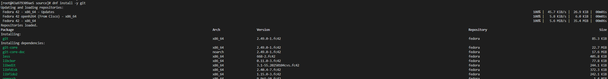

    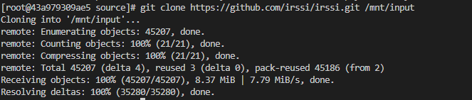

* Przedyskutuj możliwość wykonania ww. kroków za pomocą `docker build` i pliku `Dockerfile`. (podpowiedź: `RUN --mount`)

### Eksponowanie portu
* Zapoznaj się z dokumentacją https://iperf.fr/
* Uruchom wewnątrz kontenera serwer iperf (iperf3)

    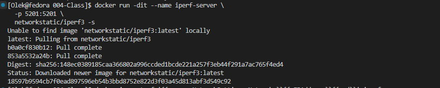

* Połącz się z nim z drugiego kontenera, zbadaj ruch

    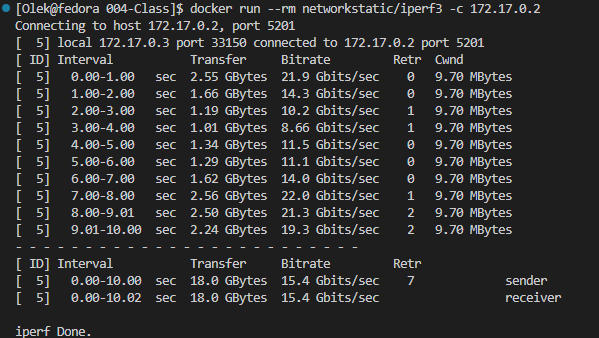


* Zapoznaj się z dokumentacją `network create` : https://docs.docker.com/engine/reference/commandline/network_create/
* Ponów ten krok, ale wykorzystaj własną dedykowaną sieć mostkową (zamiast domyślnej). Spróbuj użyć rozwiązywania nazw

    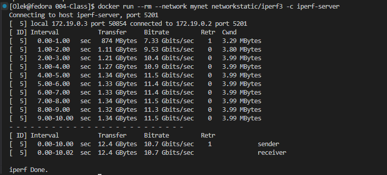


* Połącz się spoza kontenera (z hosta i spoza hosta)

    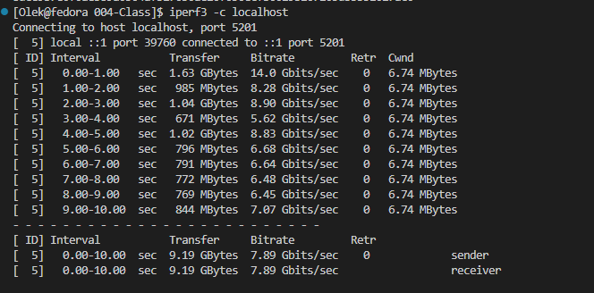


    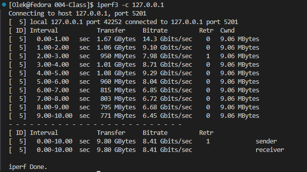


* Przedstaw przepustowość komunikacji lub problem z jej zmierzeniem (wyciągnij log z kontenera, woluminy mogą pomóc)

    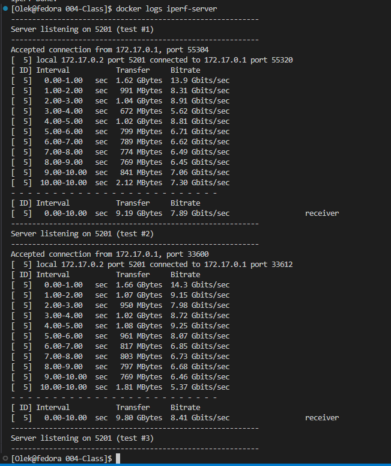


* Opcjonalnie: odwołuj się do kontenera serwerowego za pomocą nazw, a nie adresów IP

### Instancja Jenkins
* Zapoznaj się z dokumentacją  https://www.jenkins.io/doc/book/installing/docker/
* Przeprowadź instalację skonteneryzowanej instancji Jenkinsa z pomocnikiem DIND

    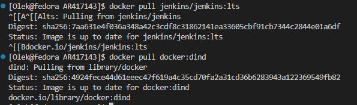

    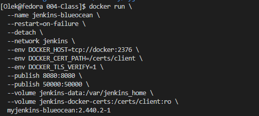

* Zainicjalizuj instację, wykaż działające kontenery, pokaż ekran logowania

    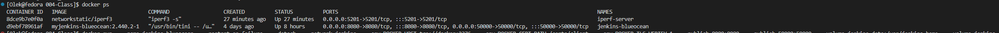

    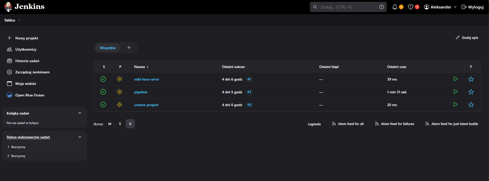