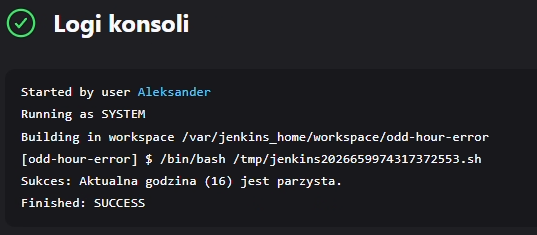
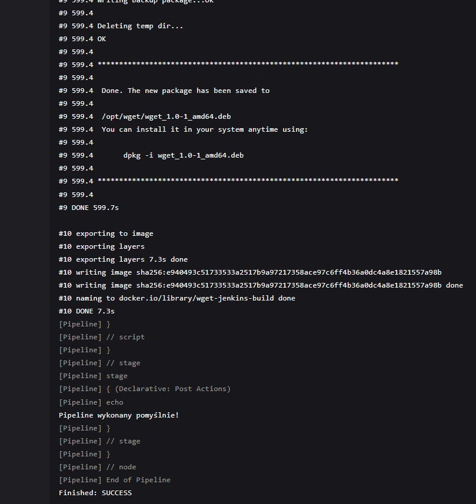
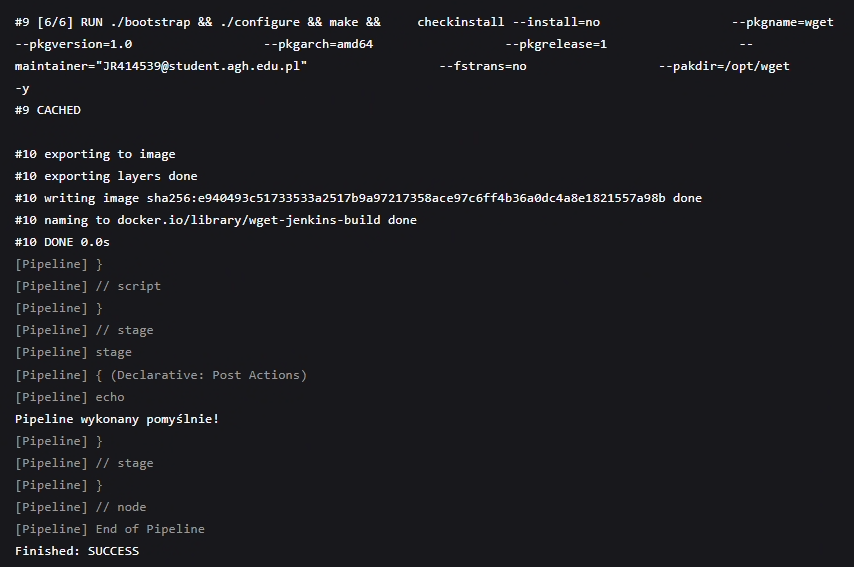
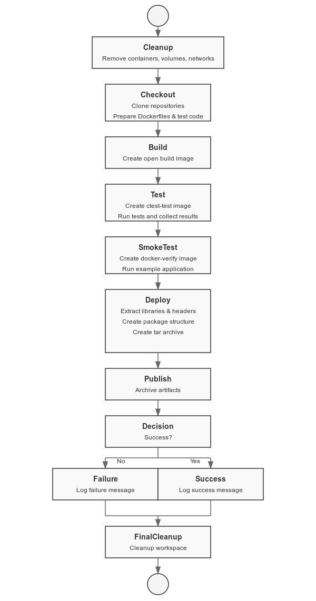

# Sprawozdanie 1
### Aleksander Rutkowski
## 005-Class

### Przygotowanie
🌵 Utwórz instancję Jenkins

Instalacja Jenkins zawarta w sprawozdaniu nr 1.
  
### Zadanie wstępne: uruchomienie
🌵 Zadanie do wykonania na ćwiczeniach
* Konfiguracja wstępna i pierwsze uruchomienie
  * Utwórz projekt, który wyświetla `uname`

     

  * Utwórz projekt, który zwraca błąd, gdy... godzina jest nieparzysta

    

### Zadanie wstępne: obiekt typu pipeline
🌵 Ciąg dalszy sprawozdania - zadanie do wykonania po wykazaniu działania Jenkinsa
* Utwórz nowy obiekt typu `pipeline`
* Wpisz treść *pipeline'u* bezpośrednio do obiektu (nie z SCM - jeszcze!)

~~~~bash
pipeline {
    agent any

    stages {
        stage('Clone Repository') {
            steps {
                git branch: "AR417143", url: "https://github.com/InzynieriaOprogramowaniaAGH/MDO2025_INO.git"
            }
        }

        

        stage('Build Docker Image') {
            steps {
                    script {
                        def dockerfilePath = 'ITE/GCL06/AR417143/006-Class/Dockerfile.build'
                        def imageName = 'wget-jenkins-build' 

                        sh "docker build -f ${dockerfilePath} -t ${imageName} ."
                    }
            }
        }
    }

    post {
        success {
            echo 'Pipeline wykonany pomyślnie!'
        }
        failure {
            echo 'Pipeline zakończony niepowodzeniem.'
        }
    }
}
~~~~

* Spróbuj sklonować repo przedmiotowe (`MDO2025_INO`)
* Zrób *checkout* do swojego pliku Dockerfile (na osobistej gałęzi) właściwego dla *buildera* wybranego w poprzednim sprawozdaniu programu
* Zbuduj Dockerfile

    

* Uruchom stworzony *pipeline* drugi raz

    

Diagram aktywności: 

