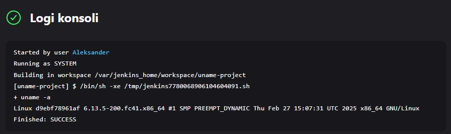
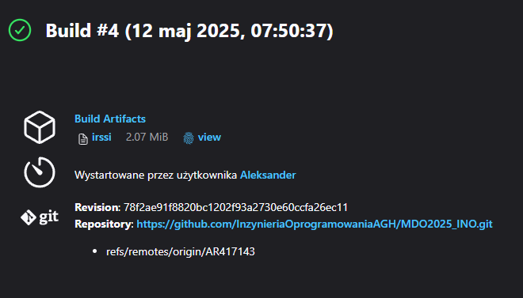

# Sprawozdanie 1
### Aleksander Rutkowski
## 005-Class

### Przygotowanie
🌵 Utwórz instancję Jenkins

Instalacja Jenkins zawarta w sprawozdaniu nr 1.
  
### Zadanie wstępne: uruchomienie
🌵 Zadanie do wykonania na ćwiczeniach
* Konfiguracja wstępna i pierwsze uruchomienie
  * Utwórz projekt, który wyświetla `uname`

     

  * Utwórz projekt, który zwraca błąd, gdy... godzina jest nieparzysta

    


### Zadanie wstępne: obiekt typu pipeline
🌵 Ciąg dalszy sprawozdania - zadanie do wykonania po wykazaniu działania Jenkinsa
* Utwórz nowy obiekt typu `pipeline`
* Wpisz treść *pipeline'u* bezpośrednio do obiektu (nie z SCM - jeszcze!)

~~~~bash
pipeline {
    agent any

    stages {
        stage('Clone Repository') {
            steps {
                git branch: "AR417143", url: "https://github.com/InzynieriaOprogramowaniaAGH/MDO2025_INO.git"
            }
        }

        

        stage('Build Docker Image') {
            steps {
                    script {
                        def dockerfilePath = 'ITE/GCL06/AR417143/006-Class/Dockerfile.build'
                        def imageName = 'wget-jenkins-build' 

                        sh "docker build -f ${dockerfilePath} -t ${imageName} ."
                    }
            }
        }
    }

    post {
        success {
            echo 'Pipeline wykonany pomyślnie!'
        }
        failure {
            echo 'Pipeline zakończony niepowodzeniem.'
        }
    }
}
~~~~

* Spróbuj sklonować repo przedmiotowe (`MDO2025_INO`)
* Zrób *checkout* do swojego pliku Dockerfile (na osobistej gałęzi) właściwego dla *buildera* wybranego w poprzednim sprawozdaniu programu
* Zbuduj Dockerfile

    

* Uruchom stworzony *pipeline* drugi raz

    

Diagram aktywności: 


Kompletny *pipeline* (wprowadzenie) - do wykonania po ustaleniu kształu kroków `deploy` i `publish`
*  Kontener Jenkins i DIND skonfigurowany według instrukcji dostawcy oprogramowania
*  Pliki `Dockerfile` wdrażające instancję Jenkinsa załączone w repozytorium przedmiotowym pod ścieżką i na gałęzi według opisu z poleceń README
*  Zdefiniowany wewnątrz Jenkinsa obiekt projektowy *pipeline*, realizujący następujące kroki:
  * Kontener `Builder`, który powinien bazować na obrazie zawierającym dependencje (`Dependencies`), o ile stworzenie takiego kontenera miało uzasadnienie. Obrazem tym może być np. baza pobrana z Docker Hub (jak obraz node lub 
dotnet) lub obraz stworzony samodzielnie i zarejestrowany/widoczny w DIND (jak np. obraz oparty o Fedorę, doinstalowujący niezbędne zależności, nazwany Dependencies). Jeżeli, jak często w przypadku Node, nie ma różnicy między runtimowym obrazem a obrazem z dependencjami, proszę budować się w oparciu nie o latest, ale o **świadomie wybrany tag z konkretną wersją**

[Mój Dockerfile.build](006-Class/Dockerfile.build)
```Docker
FROM fedora:42

RUN dnf -y install git meson gcc glib2-devel openssl-devel ncurses-devel perl-ExtUtils-Embed
RUN git clone http://github.com/irssi/irssi.git
WORKDIR /irssi
RUN meson Build
RUN ninja -C Build

```

  * Obraz testujący, w ramach kontenera `Tester`
    * budowany przy użyciu ww. kontenera kod, wykorzystujący w tym celu testy obecne w repozytorium programu
    * Zadbaj o dostępność logów i możliwość wnioskowania jakie testy nie przechodzą


[Mój Dockerfile.test](006-Class/Dockerfile.test)

```Docker
FROM irssibld
RUN ninja -C Build test

```

  * `Deploy`
    *  Krok uruchamiający aplikację na kontenerze docelowym
    *  Jeżeli kontener buildowy i docelowy **wydają się być te same** - być może warto zacząć od kroku `Publish` poniżej
    *  Jeżeli to kontener buildowy ma być wdrażany - czy na pewno nie trzeba go przypadkiem posprzątać?
    *  Przeprowadź dyskusję dotyczącą tego, jak powinno wyglądać wdrożenie docelowe wybranej aplikacji. Odpowiedz (z uzasadnieniem i dowodem) na następujące kwestie:
        * czy program powinien zostać *„zapakowany”* do jakiegoś przenośnego pliku-formatu (DEB/RPM/TAR/JAR/ZIP/NUPKG)
        * czy program powinien być dystrybuowany jako obraz Docker? Jeżeli tak – czy powinien zawierać zawartość sklonowanego repozytorium, logi i artefakty z *builda*?
        * Przypomnienie: czym się różni (i jakie ma zastosowanie) obraz `node` od `node-slim`
    *  Proszę opisać szczegółowo proces który zostanie opisany jako `Deploy`, ze względu na mnogość podejść

[Mój Dockerfile.deploy](006-Class/Dockerfile.deploy)

```Docker
FROM irssibld as builder

FROM fedora
RUN microdnf install -y glib2 openssl-libs ncurses perl && \
    microdnf clean all
WORKDIR /irssi
COPY --from=builder /irssi/Build/src/fe-text/irssi /usr/local/bin/irssi
CMD ["irssi"]

```
Proces wdrożenia aplikacji irssi za pomocą kontenera Docker przebiega w kilku etapach. Najpierw tworzę obraz bazowy, w którym kompiluję aplikację w dedykowanym środowisku (builder). Następnie korzystam z obrazu systemowego Fedora, gdzie instaluję wszystkie niezbędne biblioteki i zależności, aby zapewnić poprawne działanie aplikacji. Po przygotowaniu środowiska kopiuję skompilowaną wersję irssi z pierwszego etapu do finalnego obrazu, umieszczając ją w odpowiednim katalogu. Na końcu określam domyślne polecenie uruchomieniowe, dzięki czemu aplikacja irssi zostaje automatycznie uruchomiona po starcie kontenera. Korzystanie z wieloetapowego budowania (multi-stage builds) pozwala mi zoptymalizować końcowy obraz, zmniejszyć jego rozmiar i jednocześnie zachować pełną funkcjonalność aplikacji.

  * `Publish`
    * Przygotowanie wersjonowanego artefaktu, na przykład:
      * Instalator
      * NuGet/Maven/NPM/JAR
      * ZIP ze zbudowanym runtimem
    * Opracuj odpowiednią postać redystrybucyjną swojego artefaktu i/lub obrazu (przygotuj instalator i/lub pakiet, ewentualnie odpowiednio uporządkowany obraz kontenera Docker)
      * Musi powstać co najmniej jeden z tych elementów
      * Jeżeli ma powstać artefakt, dodaj go jako pobieralny obiekt do rezultatów „przejścia” *pipeline’u* Jenkins (https://www.jenkins.io/doc/pipeline/steps/core/).
    * Opcjonalnie, krok `Publish` (w przypadku podania parametru) może dokonywać promocji artefaktu na zewnętrzne *registry*

**Pelen pipeline**

[Mój Jenkinsfile](006-Class/Jenkinsfile)

```bash
pipeline {
    agent any

    environment {
        GIT_REPO = 'https://github.com/InzynieriaOprogramowaniaAGH/MDO2025_INO.git'
        BRANCH = 'AR417143'
        DOCKERFILE_BUILD_PATH = 'ITE/GCL06/AR417143/006-Class/Dockerfile.build'
        DOCKERFILE_TEST_PATH = 'ITE/GCL06/AR417143/006-Class/Dockerfile.test'
        DOCKERFILE_DEPLOY_PATH = 'ITE/GCL06/AR417143/006-Class/Dockerfile.deploy'
        DOCKERFILE_RUNTIME_PATH = 'ITE/GCL06/AR417143/006-Class/Dockerfile.runtime'
        DOCKER_CONTEXT = 'ITE/GCL06/AR417143/006-Class'
        DOCKER_IMAGE = 'irssibld'
        DEPLOY_IMAGE = 'irssidep'
        TEST_IMAGE = 'irssitest'
    }

    stages {
        stage('Clone') {
            steps {
                git branch: "${BRANCH}", url: "${GIT_REPO}"
            }
        }

        stage('Check') {
            steps {
                sh "ls -la ${DOCKER_CONTEXT}"
                sh "cat ${DOCKERFILE_BUILD_PATH}"
            }
        }

        stage('Build Docker image') {
            steps {
                sh "docker build --no-cache -t ${DOCKER_IMAGE} -f ${DOCKERFILE_BUILD_PATH} ."
            }
        }

        stage('Test irssi') {
            steps {
                sh "docker build --no-cache -t ${TEST_IMAGE} -f ${DOCKERFILE_TEST_PATH} ."
            }
        }
        
        stage('Deploy') {
           steps {
                sh "docker build --no-cache -t ${DEPLOY_IMAGE} -f ${DOCKERFILE_DEPLOY_PATH} ."   
                sh "docker run -dit irssidep"
            }
        }
        
        
        stage('Publish Runtime Image') {
           steps {
                sh 'docker cp $(docker ps -q --filter ancestor=irssidep | head -n 1):/usr/local/bin/irssi ${WORKSPACE}/irssi'
                sh 'ls -la ${WORKSPACE}/irssi'
                archiveArtifacts artifacts: 'irssi/irssi', allowEmptyArchive: false, fingerprint: true   
            }
        }
    }

    post {
        always {
                    sh 'docker ps -q --filter ancestor=irssidep | xargs docker stop | xargs docker rm'
        }
        success {
            echo 'Succes.'
        }
        failure {
            echo 'Pipeline error.'
        }
    }
}
```
Definiuję tutaj automatyczny pipeline do budowy i wdrażania aplikacji irssi. Na początku pobieram kod źródłowy z repozytorium GitHub, sprawdzam obecność kluczowych plików oraz buduje obraz Docker (irssibld), a potem jego testowanie. W fazie Deploy tworzę finalny obraz wdrożeniowy i uruchamiam kontener. Na koniec kopiuję  irssi z kontenera i archiwizuję je jako artefakt. Po zakończeniu procesu pipeline usuwa uruchomione kontenery, a w zależności od wyniku wyświetla komunikat o sukcesie lub błędzie.

Pomyslnie ukonczony pipeline:


W Jenkinsie mam dostęp do artefaktu i mogę go pobrać:

