# Sprawozdanie 1
### Aleksander Rutkowski
## 008-Class

### Instalacja zarządcy Ansible
* 🌵 Utwórz drugą maszynę wirtualną o **jak najmniejszym** zbiorze zainstalowanego oprogramowania
  * Zastosuj ten sam system operacyjny, co "główna" maszyna (najlepiej też w tej samej wersji)

    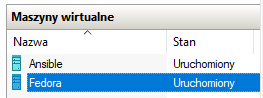

  * Zapewnij obecność programu `tar` i serwera OpenSSH (`sshd`)


  * Nadaj maszynie *hostname* `ansible-target` (najlepiej jeszcze podczas instalacji)
  * Utwórz w systemie użytkownika `ansible` (najlepiej jeszcze podczas instalacji)

    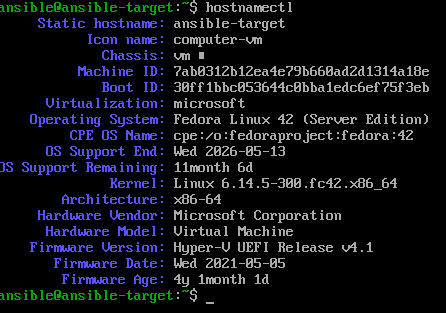

  * Zrób migawkę maszyny (i/lub przeprowadź jej eksport)

    

* 🌵 Na głównej maszynie wirtualnej (nie na tej nowej!), zainstaluj [oprogramowanie Ansible](https://docs.ansible.com/ansible/latest/installation_guide/index.html), najlepiej z repozytorium dystrybucji
* Wymień klucze SSH między użytkownikiem w głównej maszynie wirtualnej, a użytkownikiem `ansible` z nowej tak, by logowanie `ssh ansible@ansible-target` nie wymagało podania hasła

    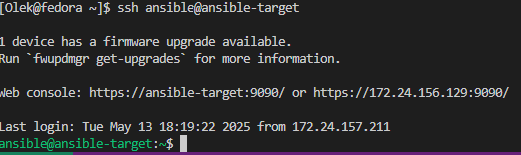
  
### Inwentaryzacja
* 🌵 Dokonaj inwentaryzacji systemów
  * Ustal przewidywalne nazwy komputerów (maszyn wirtualnych) stosując `hostnamectl`, Unikaj `localhost`.
  * Wprowadź nazwy DNS dla maszyn wirtualnych, stosując `systemd-resolved` lub `resolv.conf` i `/etc/hosts` - tak, aby możliwe było wywoływanie komputerów za pomocą nazw, a nie tylko adresów IP

    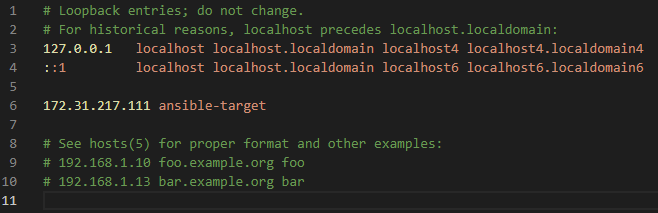

  * Zweryfikuj łączność

    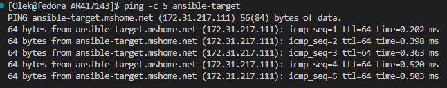

  * Stwórz [plik inwentaryzacji](https://docs.ansible.com/ansible/latest/getting_started/get_started_inventory.html)


  * Umieść w nim sekcje `Orchestrators` oraz `Endpoints`. Umieść nazwy maszyn wirtualnych w odpowiednich sekcjach

    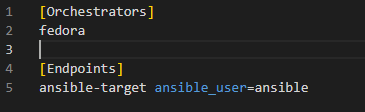

  * 🌵 Wyślij żądanie `ping` do wszystkich maszyn

    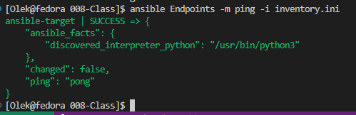

* Zapewnij łączność między maszynami
  * Użyj co najmniej dwóch maszyn wirtualnych (optymalnie: trzech)
  * Dokonaj wymiany kluczy między maszyną-dyrygentem, a końcówkami (`ssh-copy-id`)
  * Upewnij się, że łączność SSH między maszynami jest możliwa i nie potrzebuje haseł
  
### Zdalne wywoływanie procedur
Za pomocą [*playbooka*](https://docs.ansible.com/ansible/latest/getting_started/get_started_playbook.html) Ansible:

  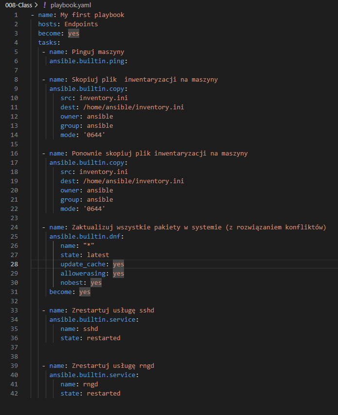

  * 🌵 Wyślij żądanie `ping` do wszystkich maszyn
  * Skopiuj plik inwentaryzacji na maszyny/ę `Endpoints`
  * Ponów operację, porównaj różnice w wyjściu

    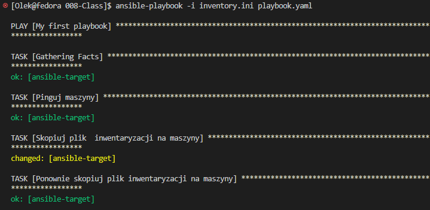

  * Zaktualizuj pakiety w systemie (⚠️ [uwaga!](https://github.com/ansible/ansible/issues/84634) )
  * Zrestartuj usługi `sshd` i `rngd`

  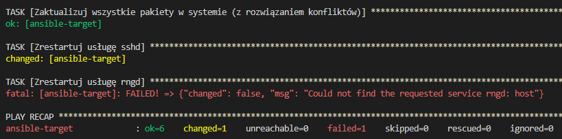

  * Przeprowadź operacje względem maszyny z wyłączonym serwerem SSH, odpiętą kartą sieciową
  
  

  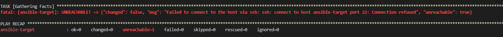

### Zarządzanie stworzonym artefaktem
Za pomocą [*playbooka*](https://docs.ansible.com/ansible/latest/getting_started/get_started_playbook.html) Ansible:


* Jeżeli artefaktem z Twojego *pipeline'u* był plik binarny (lub ich zestaw):
  * Wyślij plik aplikacji na zdalną maszynę
  * Stwórz kontener przeznaczony do uruchomienia aplikacji (zaopatrzony w zależności)
  * Umieść/udostępnij plik w kontenerze, uruchom w nim aplikację
  * Zweryfikuj poprawne uruchomienie (a nie tylko wykonanie *playbooka*)

  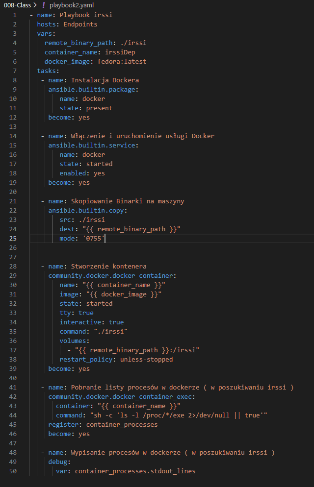

  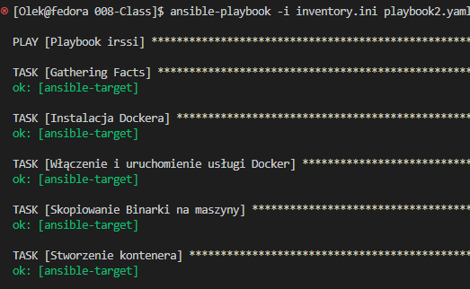

## 009-Class

🌵 Przeprowadź instalację nienadzorowaną systemu Fedora z pliku odpowiedzi z naszego repozytorium

* Zainstaluj [system Fedora](https://download.fedoraproject.org/pub/fedora/linux/releases/)
  * zastosuj instalator sieciowy (*Everything Netinst*) lub
  * zastosuj instalator wariantu *Server* z wbudowanymi pakietami, przyjmujący plik odpowiedzi (dobra opcja dla osób z ograniczeniami transferu internetowego)
* Pobierz plik odpowiedzi `/root/anaconda-ks.cfg`
* Zapoznaj się z [dokumentacją pliku odpowiedzi](https://pykickstart.readthedocs.io/en/latest/kickstart-docs.html) i zmodyfikuj swój plik:
  * Plik odpowiedzi może nie zawierać wzmianek na temat potrzebnych repozytoriów. Jeżeli Twoja płyta instalacyjna nie zawiera pakietów, dodaj wzmiankę o repozytoriach skąd je pobrać. Na przykład, dla systemu Fedora 38:
      * `url --mirrorlist=http://mirrors.fedoraproject.org/mirrorlist?repo=fedora-38&arch=x86_64`
      * `repo --name=update --mirrorlist=http://mirrors.fedoraproject.org/mirrorlist?repo=updates-released-f38&arch=x86_64`
  * Plik odpowiedzi może zakładać pusty dysk. Zapewnij, że zawsze będzie formatować całość, stosując `clearpart --all`
  * Ustaw *hostname* inny niż domyślny `localhost`
* Użyj pliku odpowiedzi do przeprowadzenia [instalacji nienadzorowanej](https://docs.fedoraproject.org/en-US/fedora/f36/install-guide/advanced/Kickstart_Installations/)
  * 🌵 Uruchom nową maszynę wirtualną z płyty ISO i wskaż instalatorowi przygotowany plik odpowiedzi stosowną dyrektywą

  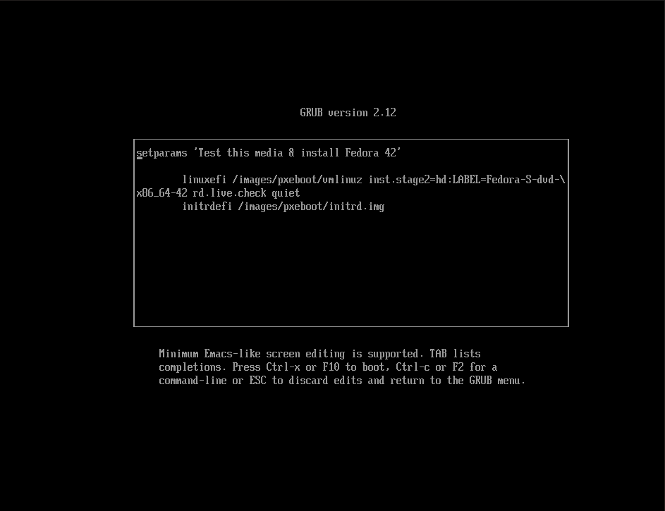

  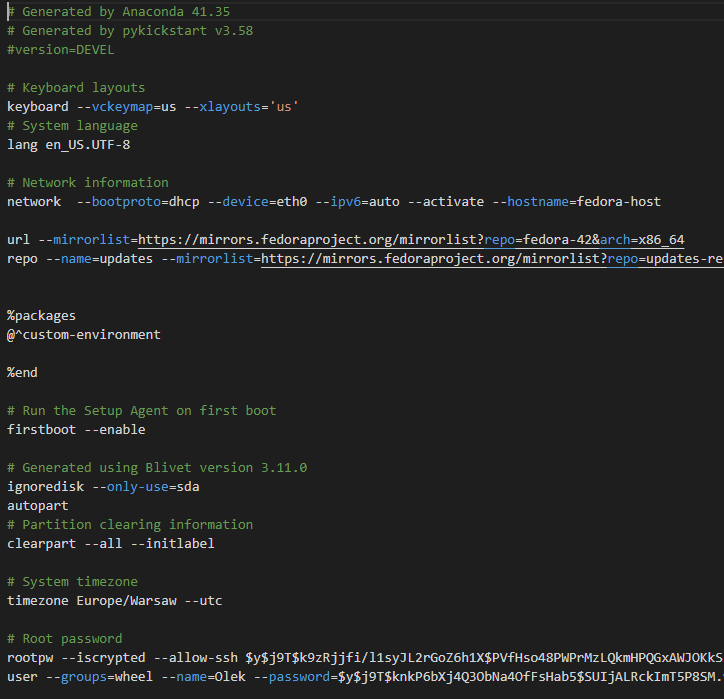

  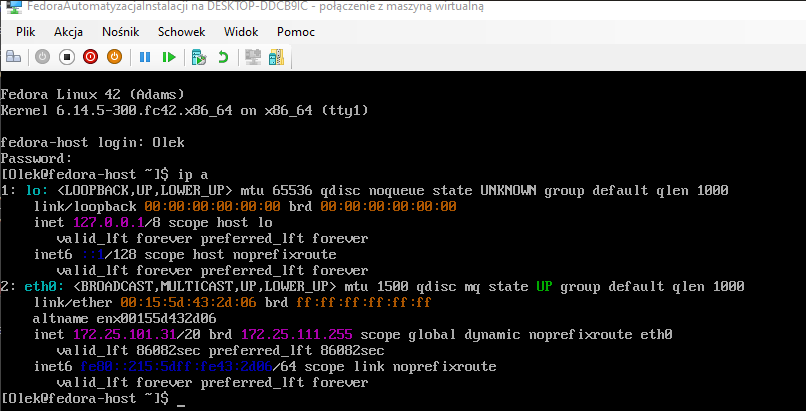


  
---
* Rozszerz plik odpowiedzi o repozytoria i oprogramowanie potrzebne do uruchomienia programu, zbudowanego w ramach projektu - naszego *pipeline'u*. 
  * W przypadku kontenera, jest to po prostu Docker.
    * Utwórz w sekcji `%post` mechanizm umożliwiający pobranie i uruchomienie kontenera
    * Jeżeli efektem pracy pipeline'u nie był kontener, a aplikacja samodzielna - zainstaluj ją
    * Pamiętaj, że **Docker zadziała dopiero na uruchomionym systemie!** - nie da się wdać w interakcję z Dockerem z poziomu instalatora systemu: polecenia `docker run` nie powiodą się na tym etapie. Nie zadziała też `systemctl start` (ale `systemctl enable` już tak)
  * Gdy program pracuje poza kontenerem, potrzebny jest cały łańcuch dependencji oraz sam program.
    * Użyj sekcji `%post`, by pobrać z Jenkinsa zbudowany artefakt
    * Rozważ stworzenie repozytorium ze swoim programem i dodanie go dyrektywą `repo` oraz zainstalowanie pakietu sekcją `%packages`
    * Jeżeli nie jest to możliwe/wykonalne, użyj dowolnego serwera SFTP/FTP/HTTP aby "zahostować" program - następnie pobierz go z tak hostującego serwera (stosując np. `wget`)
    * Umieść program w ścieżce stosownej dla binariów `/usr/local/bin/`
    * Zadbaj w sekcji `%packages`, by system zainstalował wszystkie dependencje potrzebne do działania programu
  * Wybierz oprogramowanie na podstawie poprzedniego sprawozdania.
* Zadbaj o automatyczne ponowne uruchomienie na końcu instalacji

  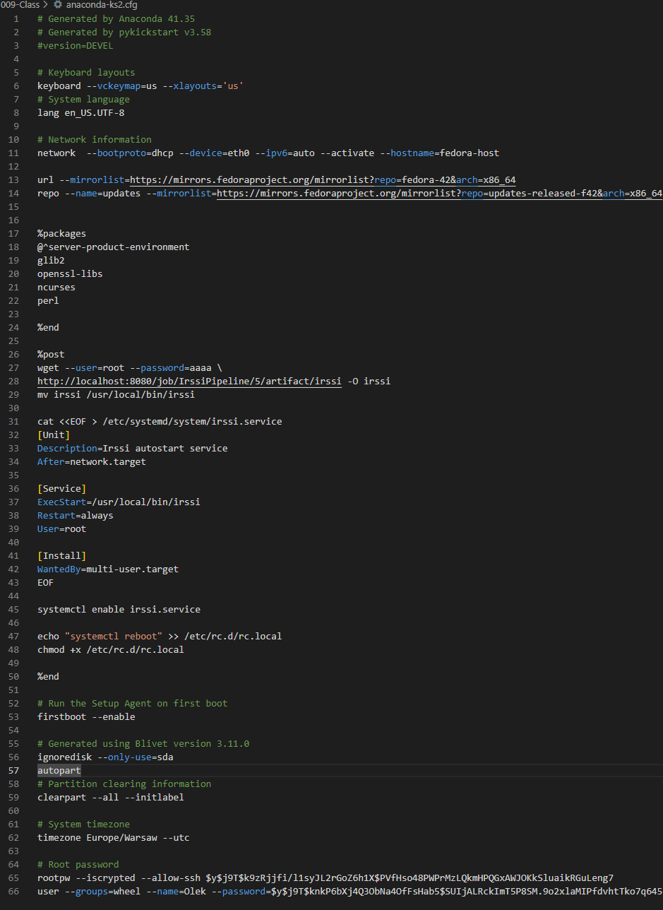

* Zapewnij, by od razu po pierwszym uruchomieniu systemu, oprogramowanie zostało uruchomione (w dowolny sposób)

## 010-Class

### Instalacja klastra Kubernetes
 * 🌵 Zaopatrz się w implementację stosu k8s: [minikube](https://minikube.sigs.k8s.io/docs/start/)
 * Przeprowadź instalację, wykaż poziom bezpieczeństwa instalacji
 * Zaopatrz się w polecenie `kubectl` w wariancie minikube, może być alias `minikubctl`, jeżeli masz już "prawdziwy" `kubectl`

  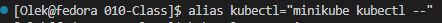

 * Uruchom Kubernetes, pokaż działający kontener/worker
 * Zmityguj problemy wynikające z wymagań sprzętowych lub odnieś się do nich (względem dokumentacji)
 * 🌵 Uruchom Dashboard, otwórz w przeglądarce, przedstaw łączność

  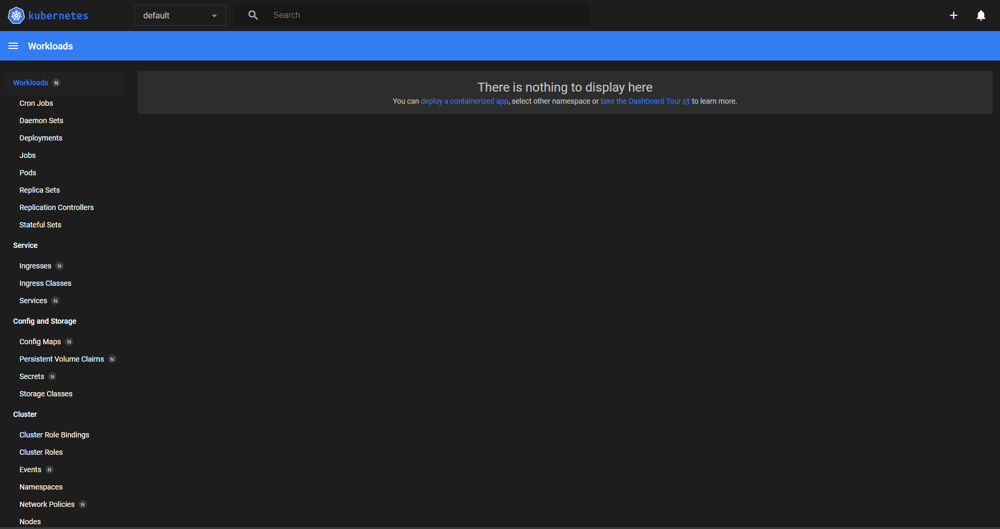

 * Zapoznaj się z koncepcjami funkcji wyprowadzanych przez Kubernetesa (*pod*, *deployment* itp)
 
### Analiza posiadanego kontenera
 * Zdefiniuj krok "Deploy" swojego projektu jako "Deploy to cloud":
   * Deploy zbudowanej aplikacji powinien się odbywać "na kontener"
   * Przygotuj obraz Docker ze swoją aplikacją - sprawdź, że Twój kontener Deploy na pewno **pracuje**, a nie natychmiast kończy pracę! 😎
   * Jeżeli wybrana aplikacja nie nadaje się do pracy w kontenerze i nie wyprowadza interfejsu funkcjonalnego przez sieć, wymień projekt na potrzeby tego zadania:
     * Optimum:
       * obraz-gotowiec (czyli po prostu inna aplikacja, np. `nginx`, ale **z dorzuconą własną konfiguracją**)
       * samodzielnie wybrany program i obraz zbudowany na jego bazie, niekoniecznie via *pipeline*
     * Plan max: obraz wygenerowany wskutek pracy *pipeline'u*
   * Wykaż, że wybrana aplikacja pracuje jako kontener

  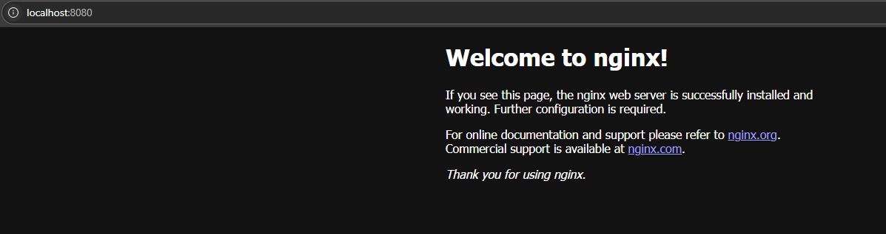

  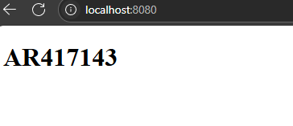

   
### Uruchamianie oprogramowania
 * 🌵 Uruchom kontener ze swoją/wybraną aplikacją na stosie k8s
 * Kontener uruchomiony w minikubie zostanie automatycznie "ubrany" w *pod*.
 * ```minikube kubectl run -- <nazwa-jednopodowego-wdrożenia> --image=<obraz-docker> --port=<wyprowadzany port> --labels app=<nazwa-jednopodowego-wdrożenia>```
 * Przedstaw że *pod* działa (via Dashboard oraz `kubectl`)

  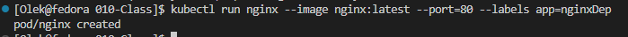

  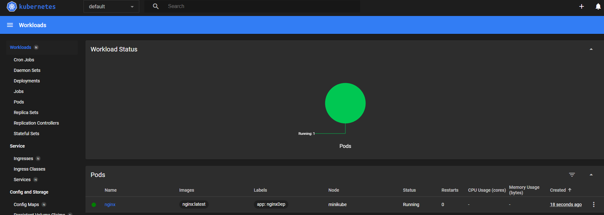

 * Wyprowadź port celem dotarcia do eksponowanej funkcjonalności
 * ```kubectl port-forward pod/<nazwa-wdrożenia> <LO_PORT>:<PODMAIN_CNTNR_PORT> ```
 * Przedstaw komunikację z eskponowaną funkcjonalnością
 
### Przekucie wdrożenia manualnego w plik wdrożenia (wprowadzenie)
 * Zapisz [wdrożenie](https://kubernetes.io/docs/concepts/workloads/controllers/deployment/) jako plik YML

  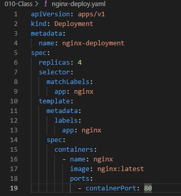

 * Przeprowadź próbne wdrożenie przykładowego *deploymentu* (może być `nginx`)
   * Wykonaj ```kubectl apply``` na pliku
   * Upewnij się, że posiadasz wdrożenie zapisane jako plik
   * Wzbogać swój *deployment* o 4 repliki
   * Rozpocznij wdrożenie za pomocą ```kubectl apply```

  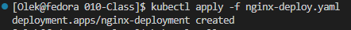

   * Zbadaj stan za pomocą ```kubectl rollout status```

  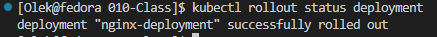

  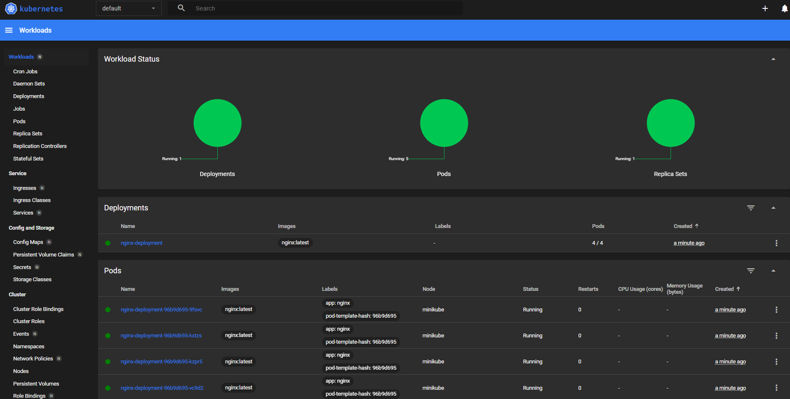

 * Wyeksponuj wdrożenie jako serwis
 * Przekieruj port do serwisu (tak, jak powyżej) 

 ## 011-Class

 ### Przygotowanie nowego obrazu
 * Zarejestruj nową wersję swojego obrazu `Deploy` (w Docker Hub lub [lokalnie+przeniesienie](https://minikube.sigs.k8s.io/docs/commands/image/#minikube-image-load))
 * Upewnij się, że dostępne są dwie co najmniej wersje obrazu z wybranym programem
 * Jeżeli potrzebny jest "gotowiec" z powodu problemów z `Deploy`, można użyć np `httpd`, ale powinien to być **własny** kontener: zmodyfikowany względem oryginału i opublikowany na własnym koncie Docker Hub.
 * Będzie to wymagać 
   * przejścia przez *pipeline* dwukrotnie, lub
   * ręcznego zbudowania dwóch wersji, lub
   * przepakowania wybranego obrazu samodzielnie np przez ```commit```
 * Przygotuj kolejną wersję obrazu, którego uruchomienie kończy się błędem

 [Dockerfile](/home/Olek/MDO2025_INO/ITE/GCL06/AR417143/010-Class/Dockerfile)

 [Dockerfile2](/home/Olek/MDO2025_INO/ITE/GCL06/AR417143/010-Class/Dockerfile2)

 [Dockerfilefail](/home/Olek/MDO2025_INO/ITE/GCL06/AR417143/010-Class/DockerfileFail)
  
### Zmiany w deploymencie
 * 🌵 Aktualizuj plik YAML z wdrożeniem i przeprowadzaj je ponownie po zastosowaniu następujących zmian:
   * zwiększenie replik np. do 8

  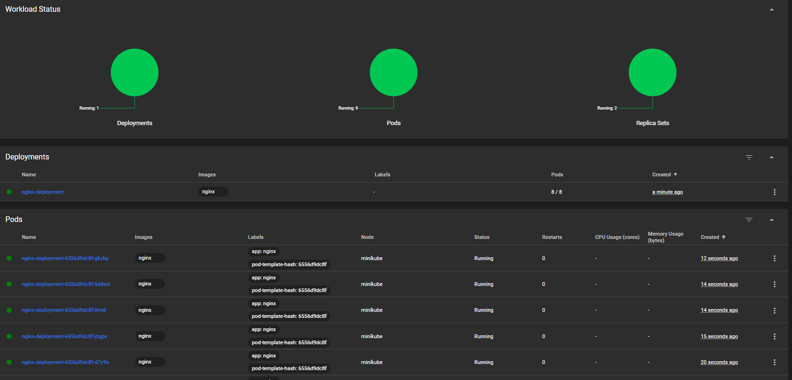

   * zmniejszenie liczby replik do 1

  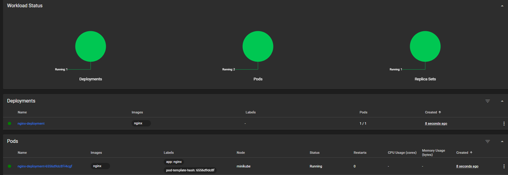

   * zmniejszenie liczby replik do 0

  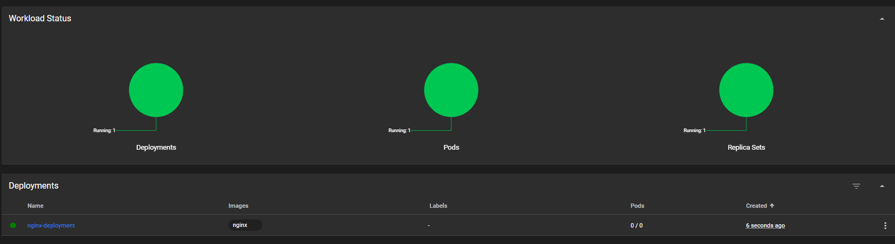

   * ponowne przeskalowanie w górę do 4 replik (co najmniej)

  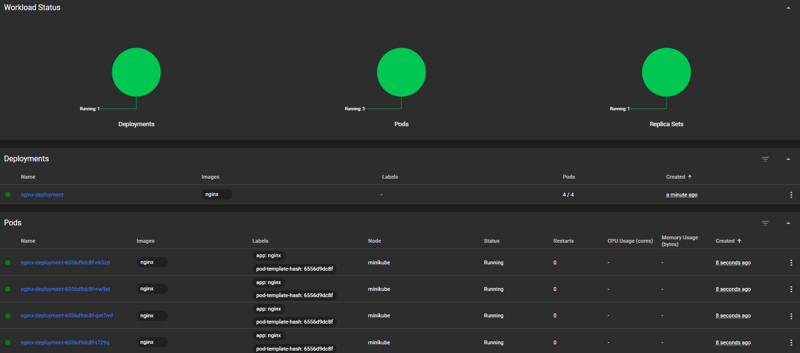

   * Zastosowanie nowej wersji obrazu

  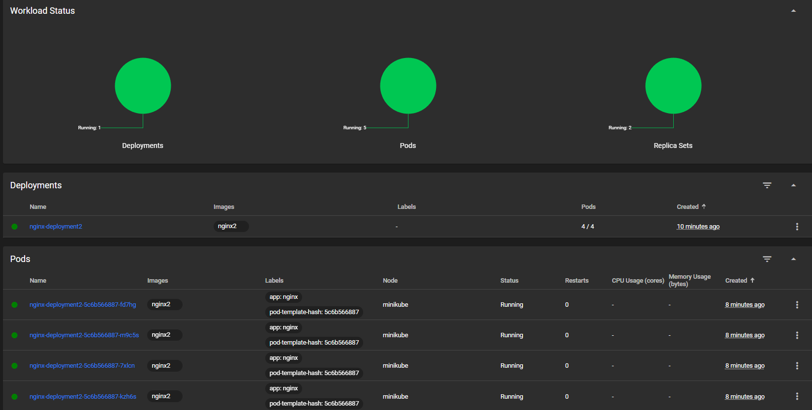

   * Zastosowanie starszej wersji obrazu
   * Zastosowanie "wadliwego" obrazu

  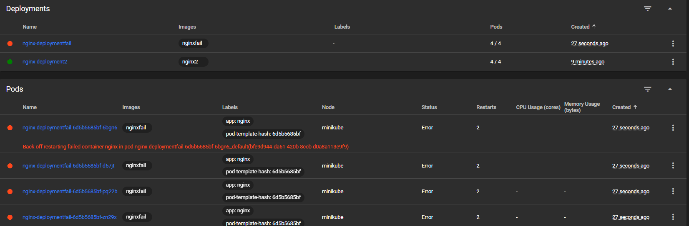

 * Przywracaj poprzednie wersje wdrożeń za pomocą poleceń
   * ```kubectl rollout history```
   * ```kubectl rollout undo```

### Kontrola wdrożenia
 * Zidentyfikuj historię wdrożenia i zapisane w niej problemy, skoreluj je z wykonywanymi czynnościami

  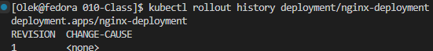

 * Napisz skrypt weryfikujący, czy wdrożenie "zdążyło" się wdrożyć (60 sekund)
 * Zakres rozszerzony: Ujmij skrypt w pipeline Jenkins (o ile `minikube` jest dostępny z zewnątrz)
 
### Strategie wdrożenia
 * Przygotuj wersje [wdrożeń](https://kubernetes.io/docs/concepts/workloads/controllers/deployment/) stosujące następujące strategie wdrożeń
   * Recreate
   * Rolling Update (z parametrami `maxUnavailable` > 1, `maxSurge` > 20%)
   * Canary Deployment workload
 * Zaobserwuj i opisz różnice

  # STRATEGIE WDROŻENIA
Wdrażając oprogramowanie można stosować różne strategie. Ich celem jest  dostosowanie procesu wdrożenia do konkretnych celów klientów, minimalizacja ryzyka związanego z wdrożeniem czy wpływ na dostępność i wydajność aplikacji podczas wdrożenia.
Skrypty i ich wyniki dla różnych wdrożeń:
- Recreate Deployment – najprostsza strategia w której występuje downtime gdyż cały zestaw podów jest zatrzymywany a następnie tworzony jest nowy zestaw z nową wersją aplikacji
 
 
- Rolling Update Deployment – nowa wersja aplikacji jest wdrażana stopniowo, można kontrolować ilość niedostępnych jednocześnie podów i ilość równocześnie uruchomionych
 
 
- Canary Deployment – umożliwia testowanie aplikacji w środowisku produkcyjnym gdyż nowa wersja wdrażana jest dla małego grona użytkowników lub serwerów
 
 
Strategia Canary nie jest obsługiwana bezpośrednio w elemencie Deployment. Wdrożenie tego typu można uzyskać tworząc wiele wdrożeń z różnymi wagami dla dystrybucji ruchu.
Wymienione wyżej strategie wdrażania oprogramowania różnią się od siebie przede wszystkim tym jak i ile podów na raz jest włączonych/wyłączonych. Każda ze strategii znajdzie swoje zastosowanie w zależności od tego do czego dążymy z wdrożeniem naszej aplikacji.

