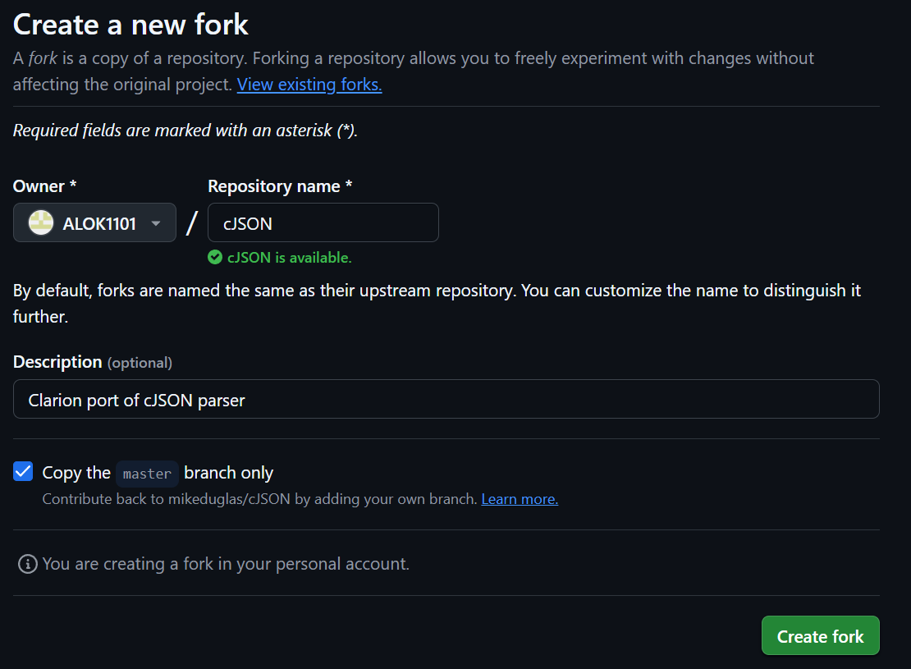
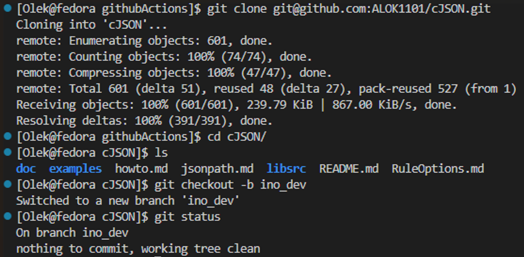
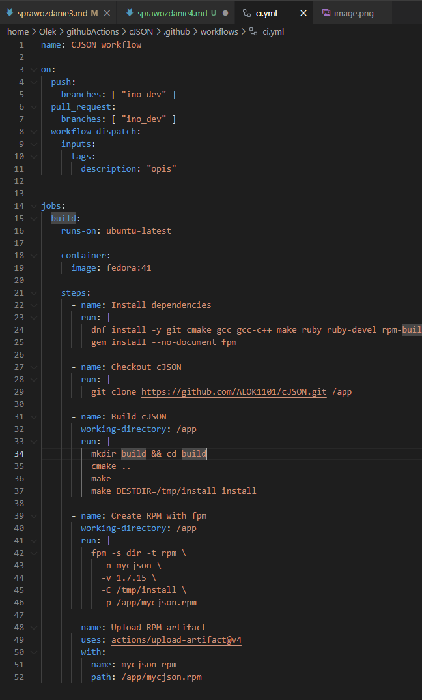
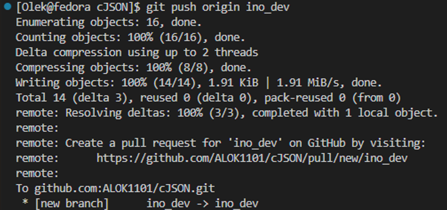
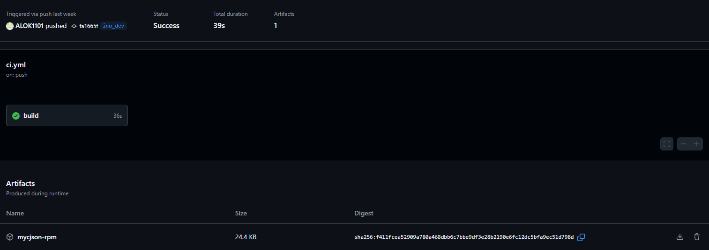

# Sprawozdanie 4
### Aleksander Rutkowski
## 013-Class

 - Zapoznaj się z koncepcją [GitHub Actions](https://docs.github.com/en/actions)
 - Zwróć szczególną uwagę na *trigger* dla tworzonych akcji, omawiany na zajęciach
 - Cennik do przeczytania (ze zrozumieniem!!):
   https://docs.github.com/en/billing/managing-billing-for-github-actions/about-billing-for-github-actions
 - **Darmowy plan** powinien wystarczyć przynajmniej do zdefiniowania przykładu
 - *Sforkuj* repozytorium z wybranym oprogramowaniem. **Nie commituj pipeline'ów do głównego projektu!!** (kontrybutorzy go nie wciągną, ale nie ma potrzeby tego sprawdzać)

    
 
 - Stwórz akcję przeprowadzającą *build* na podstawie *kontrybucji* do dedykowanej gałęzi `ino_dev`

    

  - Usuń obecne w projekcie *workflows*, jeżeli istnieją
  - Utwórz własną akcję reagującą na zmianę w `ino_dev` i/lub na kryterium indywidualnie omówione na zajęciach (🌵)

    

  - Zweryfikuj, że wybrany program buduje się wewnątrz Akcji po zacommitowaniu zmiany do gałęzi

    

    

    

  - Jeżeli build jest zbyt duży, zmodyfikuj akcję aby wykonywała inną czynność, związaną najlepiej z *code quality*
  - Jeżeli to możliwe, załącz zbudowany artefakt za pomocą [dedykowanej akcji](https://docs.github.com/en/actions/writing-workflows/choosing-what-your-workflow-does/storing-and-sharing-data-from-a-workflow)
