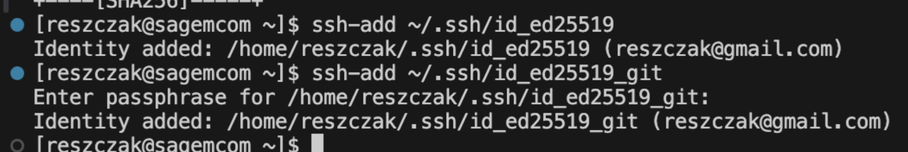
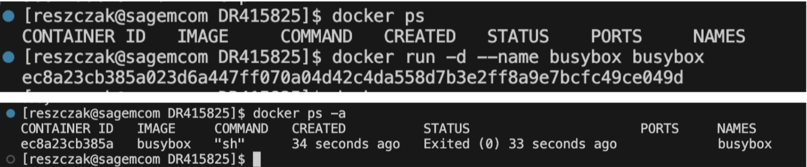
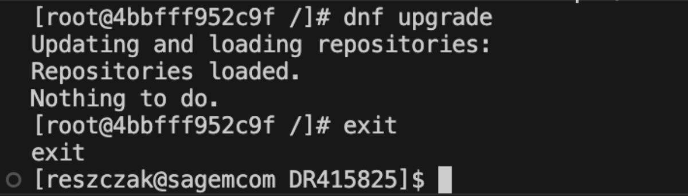
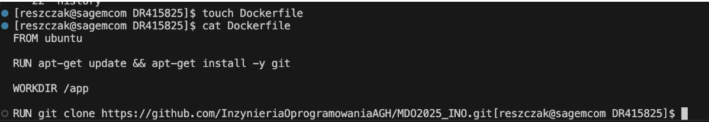
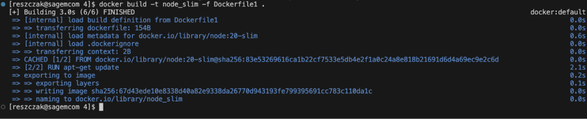
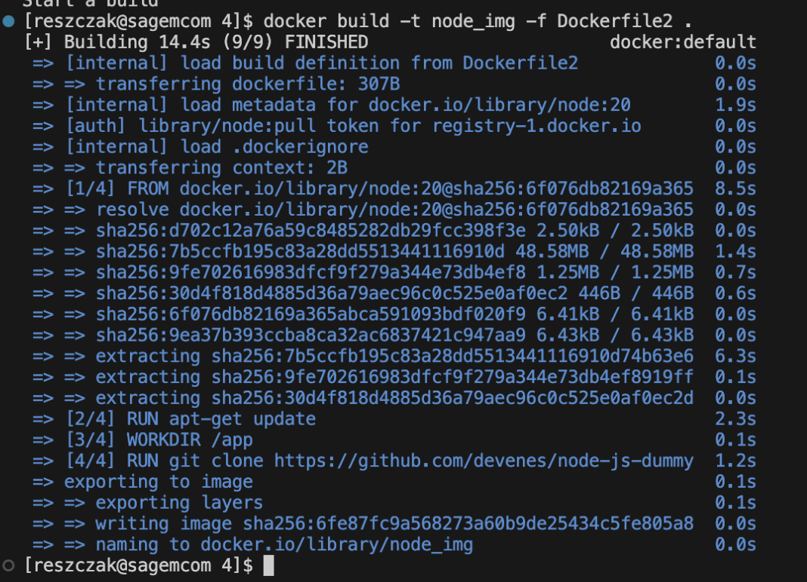

# Sprawozdanie 1 - Git, Docker - Dawid Reszczyński

## Ćw. 1 - Instalacja Git i obsługa SSH

### Cel laboratorium

Celem zajęć laboratoryjnych było praktyczne zapoznanie z konfiguracją i wykorzystaniem narzędzi Git oraz SSH. Zakres tematyczny obejmował konfigurację kluczy SSH, techniki klonowania repozytoriów, zasady zarządzania gałęziami, a także przykładowe wdrożenie haków (GitHooks) w procesie deweloperskim.

### Instalacja
Instalacja Git z pomocą polecenia: `sudo dnf install -y git`


### Sklonowanie repozytorium projektu

Sklonowanie plików projektowych poleceniem: `git clone https://github.com/InzynieriaOprogramowaniaAgh/MDO2025_INO.git`


### Generacja kluczy SSH

Wygenerowanie dwóch par kluczy SSH - jednego bez hasła, drugiego z: `ssh-keygen -t ed25519 -C "reszczak@gmail.com"`


### Konfiguracja dostępu na GitHubie i clone repo za pomocą ssh

Dodanie ssh-agenta: `eval "$(ssh-agent -s)"`


Podpięcie kluczy: `ssh-add ~/.ssh/<key>`



Dodanie kluczy na GitHub:


Sklonowanie repozytorium za pomocą ssh: `git clone git@github.com:InzynieriaOprogramowaniaAGH/MDO2025_INO.git`


### Praca na branchach

Przełączenie się na własny branch (inicjały_nr_indexu): `git checkout -b DR415825`


### Utworzenie Git Hooka

Plik `commit-msg`

```bash 
#!/bin/sh
FILE=$1
MSG=$(cat "$FILE")

if [[ ! $MSG =~ ^DR415825 ]]; then
    echo "ERROR: Invalid commit message. It has to begin with 'DR415825'."
    exit 1
fi
```

### Ustawienie dostępu

```bash 
chmod +x <path>
git config --local core.hooksPath <path>
```


### Wnioski

Klucze SSH upraszczają bezpieczny dostęp do repozytoriów, eliminując potrzebę ciągłego podawania poświadczeń. Gałęzie (branches) są kluczowe dla izolacji pracy, a GitHooks pozwalają automatyzować walidację, np. komunikatów commitów, w celu utrzymania spójności projektu.

## Ćw. 2 - Docker

### Cel laboratorium
Celem laboratorium było wprowadzenie do technologii konteneryzacji z wykorzystaniem narzędzia Docker. Zakres merytoryczny zajęć obejmował metody tworzenia obrazów, sposoby uruchamiania kontenerów oraz zasady konstruowania plików Dockerfile.

### Aktualizacja systemu

Aktualizacja składników używając: `sudo yum update -y`


### Instalacja dockera

Instalacja dockera poleceniem: `sudo yum install docker`


### Start dockera

Wystartowanie dockera z użyciem: `systemctl start docker` , `systemctl enable docker`


### Status dockera

`systemctl status docker`


### Logowanie do dockera

`docker login`


### Pobranie obrazów

Pobranie obrazów hello-world, busybox, fedora, mysql poleceniem : `docker pull`


### Uruchomienie kontenera

#### Zwykły 

Stworzenie kontenera i sprawdzenie statusu na liście kontenerów
`docker run -d --name busybox busybox`


#### Interaktywny

Uruchomienie kontenera z trybem interaktywnym i ukazanie wersji
`docker run -it --name busybox busybox sh` 


#### System w kontenerze

Uruchomienie systemu w kontenerze i ukazanie wersji


#### Proces PID

`ps aux`


#### Aktualizacja pakietów i wyjście

Zaktualizowanie pakietów z użyciem polecenia: 
`dnf update`


### Dockerfile

#### Stworzenie pliku Dockerfile



Jak widać, dockerfile automatycznie klonuje nam repozytorium

#### Zbudowanie obrazu na podstawie Dockerfile

`docker build . -t test`


#### Uruchomienie kontenera na bazie obrazu

`docker run -it ubuntu`


I tak dla każdego przypadku 

#### Wypisanie uruchomionych kontenerów

`docker ps -a`


#### Zatrzymanie i usunięcie wszystkich kontenerów 

`docker stop` - zatrzymanie
`docker rm` - usunięcie 


### Wnioski

Ćwiczenie pozwoliło zrozumieć podstawowy cykl pracy z Dockerem: definicja środowiska w Dockerfile, wykorzystanie obrazów z Docker Hub i uruchamianie izolowanych kontenerów. Kluczowym wnioskiem jest zdolność do tworzenia powtarzalnych i przenośnych środowisk aplikacyjnych.

## Ćw. 3 Dockerfiles, Kontenery

### Cel laboratorium
Celem zajęć było praktyczne zastosowanie Dockera do konteneryzacji aplikacji. Proces ten obejmował stworzenie plików Dockerfile do budowy i uruchamiania aplikacji w izolowanym środowisku, a także przeprowadzenie analizy porównawczej jej działania w kontenerze i poza nim.

### Host 

#### Sklonowanie repozytorium i instalacja bibliotek


#### Przygotowanie build dla Meson, zbudowanie aplikacji i wykonanie testów

``` bash
meson Build
ninja -C Build
ninja -C Build test
```


#### Historia poleceń


### Kontener 

#### Uruchomienie kontenera na bazie obrazu fedory

`docker run -it --name fedora fedore:latest /bin/bash`


#### Instalacja bibliotek 


#### Sklonowanie repozytorium 


#### Przygotowanie builda, build i testy

``` bash
meson Build
ninja -C Build
ninja -C Build test
```


#### Historia - system


#### Historia - poza systemem 


### Automatzacja procesu - kontener instaluje wszystko do builda a drugi bazuje na pierwszym i uruchamia testy

#### Dockerfile do buildowania aplikacji


#### Budowanie obrazu


#### Dockerfile do testów


#### Kolejny build obrazu 


#### Stworzenie kontenera na bazie obrazu 


### Dockerfile dla node-js-dummy-test

#### Dockerfile2.build i Dockerfile2.test


#### Buildy


Obraz się stworzył, więc testy zaliczone.

### Wnioski

Konteneryzacja eliminuje problemy z różnicami między środowiskami, gwarantując powtarzalny proces budowy aplikacji. Zastosowanie wieloetapowego budowania (multi-stage builds) okazało się skuteczną metodą optymalizacji, która znacząco zmniejsza rozmiar finalnego obrazu.

## Ćw. 4 Konteneryzacja i instalacja Jenkins

### Cel laboratorium
Celem laboratorium było pogłębienie wiedzy z zakresu zarządzania woluminami i sieciami w środowiskach skonteneryzowanych. Program zajęć obejmował również praktyczne przeprowadzenie testów wydajnościowych za pomocą narzędzia iperf3 oraz konfigurację środowiska Jenkins w celu automatyzacji procesów CI/CD. 

### Zachowanie stanu

#### Stworzenie woluminów v1 - wejściowy i v2 - wyjściowy

`docker volume create v1`


#### Dockerfile bez git'a do uruchomienia projektu


#### Zbudowanie obrazu


I tutaj pojawił się błąd, na starcie nie wiedziałem co się dzieje więc postanowiłem poczekać do czasu który był napisany w errorze - i zadziałało, może moja maszyna ma źle ustawiony czas, albo błąd losowy.



#### Utworzenie kontenera głownego w podpięciem woluminów 


#### Pobranie obrazu alpine z gitem


#### Stworzenie kontenera i sklonowanie repozytorium 


#### Wywołanie builda na woluminie wejściowym 


#### Skopiowanie powstałych plików na wolumin wyjściowy


#### Dockerfile operacji klonowania na wolumin wyjściowy za pomocą głównego kontenera

Tutaj trzeba wstawić po zalogowaniu na maszyne bo nie mam screena 


#### Zbudowanie obrazu



#### Uruchomienie kontenera i sprawdzenie zawartości


### Eksponowanie portu

#### Dockerfile pod iperf3


#### Zbudowanie obrazu


#### Uruchomienie kontenera
Kontener uruchamiamy w trybie detached przekierowując port iperf3 5201


#### Zmiana nazwy kontenera


#### Podpięcie się do innego kontenera (fedory z lab2)


#### Doinstalowanie iperf3


#### Przetestowanie działania


#### Dockerfile pod obraz klienta


#### Zbudowanie obrazu 


#### Stworzenie własnej sieci 
`docker network create`


#### Uruchomienie kontenera serwerowego i klienskiego 

Serwerowy - wystawiony port, podłączony do sieci, detached

`docker run -d --net=iperf_net -p 5201:5201 --name iperf_s iperf3_img`

Kliencki - podłączony do sieci

`docker run --rm  -it--net=iperf_net --name iperf_c iperf3_img_client iperf3 -c iperf_s`


#### Test ruchu


### Instalacja Jenkins

#### Utworzenie sieci i uruchomienie dockera na bazie obrazu docker:dind

```bash 
docker create network

docker run \
  --name jenkins-docker \
  --rm \
  --detach \
  --privileged \
  --network jenkins \
  --network-alias docker \
  --env DOCKER_TLS_CERTDIR=/certs \
  --volume jenkins-docker-certs:/certs/client \
  --volume jenkins-data:/var/jenkins_home \
  --publish 2376:2376 \
  docker:dind \
  --storage-driver overlay2
```


#### Kontenery (docker ps)


#### Dockerfile (według dokumentacji)


#### Zbudowanie obrazu 


#### Uruchomienie kontenera na bazie obrazu


#### Kontenery 


#### Historia


#### Start Jenkinsa


#### Konsola Jenkinsa i uzyskanie hasła


#### Koniec ćwiczenia


### Wnioski 

Woluminy i sieci Docker są niezbędne do budowy złożonych aplikacji, zapewniając trwałość danych i komunikację między kontenerami. Uruchomienie Jenkinsa w architekturze Docker-in-Docker zademonstrowało zaawansowany wzorzec tworzenia w pełni skonteneryzowanego i przenośnego środowiska CI/CD.


***PS: Z tego miejsca bardzo przepraszam za opóźnienie. Zrobiłem to ćwiczenie już dawno (można sprawdzić po commitach - nie w terminie, chyba 11 maja), ale wypadło mi z głowy zrobienie sprawozdania. Pozdrawiam, Dawid R***

