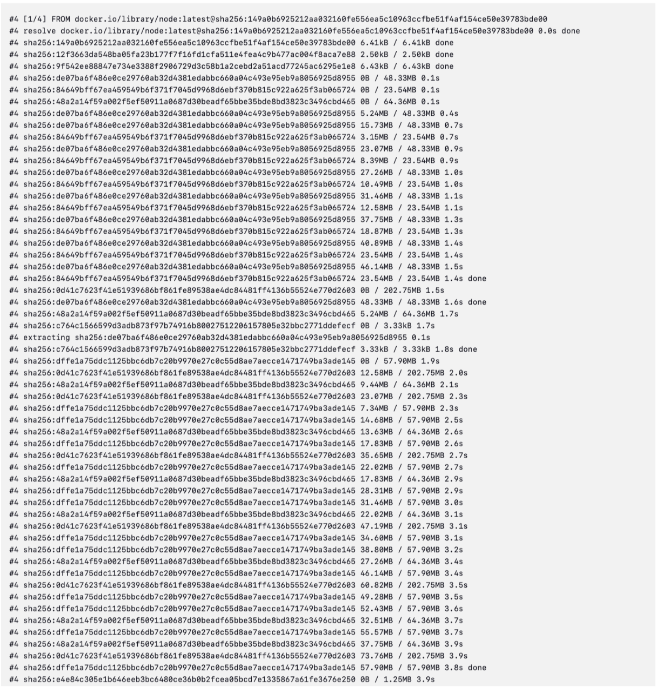
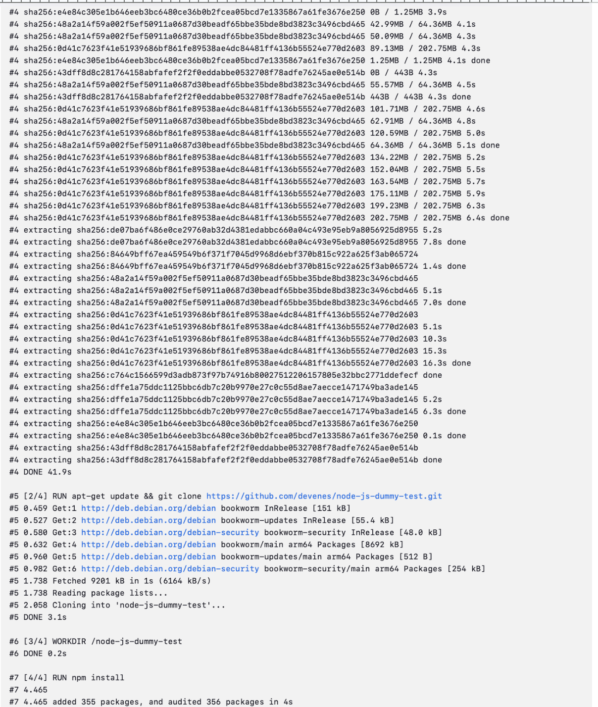
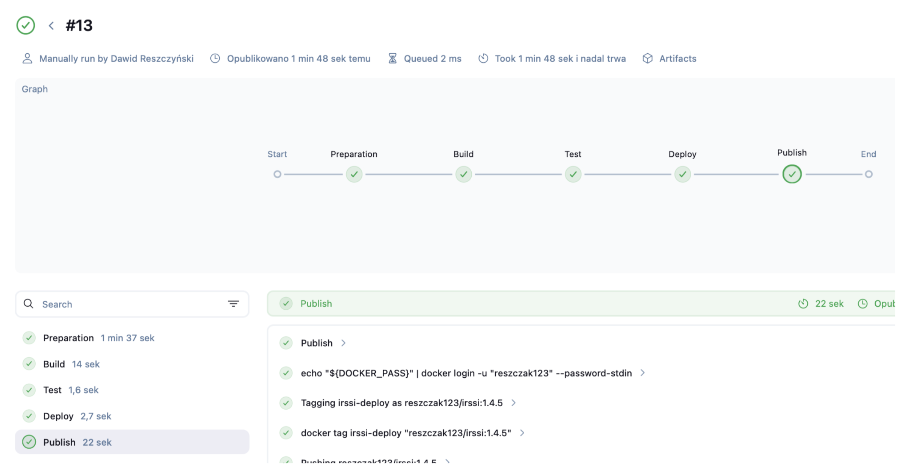

# Sprawozdanie 2 - Jenkins, Pipeline, Izolacja Etapów - Dawid Reszczyński

## Cel projektu
Celem projektu jest poznanie możliwości automatyzacji procesów budowania i wdrażania aplikacji przy pomocy Jenkinsa. W trakcie realizacji wykorzystywane są kontenery oraz technologia Docker in Docker. Ważnym elementem jest znalezienie sposobu na archiwizację kolejnych wersji lub instancji budowanej aplikacji.
Celem stworzenia takich zautomatyzowanych pipeline'ów jest wsparcie osób odpowiedzialnych za utrzymanie aplikacji, gdzie często wprowadza się zmiany w kodzie, co prowadzi do konfliktów i problemów ze stabilnością aplikacji.

## Instalacja Jenkinsa
Instalacja odbyła się na poprzednich zajęciach (Lab4)


## Pierwsze projekty w Jenkins
### Projekt 1 
Zadanie polegało na utworzeniu projektu o nazwie `projekt1` i wybraniu uruchomienia powłoki oraz wpisaniu `uname`.


Tak stworzony projekt zapisałem i uruchomiłem. Logi prezentują się następująco: 

### Projekt 2 
Następny problem polegał na implementacji powłoki, która działa prawidłowo tylko gdy godzina jest parzysta. W przeciwnym przypadku jest błąd.

Dla parzystej godziny:

Dla nieparzystej godziny:

### Projekt 3
Kolejne zadanie polegało na pobraniu obrazu kontenera i wyeksponowanie go


## Podstawowy projekt typu pipeline
Następnym problemem z którym się mierzyłem było przygotowanie pipeline'a, który klonuje repozytorium, przepina się na mojego brancha i korzystając z dockerfile'i z poprzednich labów testuje, czy działa. 
Projekt jest tworzony już jako pipeline, a nie jako projekt ogólny.

Pipeline script:
```bash
pipeline {
    agent any
 
    stages {
        stage('Klonowanie repozytorium') {
            steps {
                script {
                    sh '''
                    if [ -d "MDO2025_INO" ]; then
                        rm -rf MDO2025_INO
                    fi
                    git clone https://github.com/InzynieriaOprogramowaniaAGH/MDO2025_INO
                    '''
                    dir('MDO2025_INO') {
                        sh 'git checkout DR415825'
                    }
                }
            }
        }
 
        stage('Build "build image"') {
            steps {
                script {
                    dir('MDO2025_INO/ITE/GCL06/DR415825/Sprawozdanie1/3/') {
                        sh 'docker build -t node1 -f Dockerfile2.build .'
                    }
                }
            }
        }
 
        stage('Build "test image"') {
            steps {
                script {
                    dir('MDO2025_INO/ITE/GCL06/DR415825/Sprawozdanie1/3/') {
                        sh 'docker build -t node1_test -f Dockerfile2.test .'
                        sh 'docker images'
                    }
                }
            }
        }
    }
}
```





Uruchomiłem także skrypt ponownie:


## Projekt główny

### Wybrana aplikacja
Postanowiłem wybrać aplikację Irssi (licencja GNU GPL), czyli modularnego klienta czatu. Służy on do komunikacji np. przez IRC. Jeśli chodzi o build - tutaj meson.

### Diagram
Diagram aktywności: 


### Pierwszy pipeline script

Na początku pipeline został podzielony na 3 kroki (docelowo 5). 
1. Preparation - sklonowanie repozytorium i zbudowanie zależności
2. Build - zbudowaniu całej aplikacji przy użyciu Dockerfile
3. Test - przetestowaniu całej aplikacji przy użyciu Dockerfile

Pierwszy skrypt Pipeline'u wyglądał następująco: 
```bash 
pipeline {
    agent any

    stages {
        stage('Preparation') {
            steps {
                echo 'Preparation'
                sh 'docker rmi irssi-builder irssi-test || true'
                sh 'rm -rf MDO2025_INO'
                
                sh 'mkdir MDO2025_INO'
                dir('./MDO2025_INO'){
                    git branch: 'DR415825', url: 'https://github.com/InzynieriaOprogramowaniaAGH/MDO2025_INO.git'
                }
                sh 'docker build -f ./MDO2025_INO/ITE/GCL06/DR415825/Sprawozdanie2/dependencies.Dockerfile -t irssi-dependencies .'
            }
        }
        stage('Build') {
            steps {
                echo 'Build'
                dir ('./MDO2025_INO/ITE/GCL06/DR415825/Sprawozdanie2') {
                    sh 'docker build -f ./build.Dockerfile -t irssi-builder .'
                }
            }
        }
        stage('Test') {
            steps {
                echo 'Test'
                sh 'docker build -f ./MDO2025_INO/ITE/GCL06/DR415825/Sprawozdanie2/test.Dockerfile -t irssi-test --progress=plain --no-cache .'
            }
        }
    }
}
```
### Preparation
Udoskonalona wersja preparation: 
```bash
stage('Preparation') {
    steps {
        echo 'Preparation'
        sh 'docker rmi -f irssi-dependencies irssi-builder irssi-test || true'
        
        sh 'rm -rf MDO2025_INO'
        sh 'rm -rf LOGS'
                
        sh 'mkdir MDO2025_INO'            
        sh 'mkdir LOGS'
        
        dir('./MDO2025_INO'){
            git branch: 'DR415825', url: 'https://github.com/InzynieriaOprogramowaniaAGH/MDO2025_INO.git'
        }
        sh 'docker build -f ./MDO2025_INO/ITE/GCL06/DR415825/Sprawozdanie2/dependencies.Dockerfile -t irssi-dependencies .'
    }
}
```


Na wstępie dokonuje się usunięcie lokalnej kopii repozytorium projektu i jego ponowne sklonowanie. Równocześnie usuwane są obrazy Docker utworzone podczas poprzednich uruchomień - nie warto pracować na przestarzałych wersjach. Podobnie, katalog przeznaczony na logi bieżącego wykonania jest opróżniany - logi są zachowywane jako artefakty.
Wykorzystano wbudowany w Jenkins mechanizm integracji z systemem Git do pobrania kodu źródłowego z repozytorium, z automatycznym przejściem na branch `DR415825`

Finalnym krokiem jest zbudowanie obrazu kontenera (irssi-dependencies), który zawiera zależności niezbędne do późniejszej kompilacji aplikacji. Dockerfile wygląda następująco:

```bash 
FROM fedora:40
RUN dnf -y update
RUN dnf -y install git gcc meson ninja* glib2-devel utf8proc-devel ncurses* perl-Ext* openssl-devel
```

### Build
Ulepszona wersja skryptu:

```bash
stage('Build') {
    steps {
        echo 'Build'
        sh "docker build -f ./MDO2025_INO/ITE/GCL06/DR415825/Sprawozdanie2/build.Dockerfile -t irssi-builder . 2>&1 | tee ./LOGS/build_${env.BUILD_NUMBER}.txt"
        archiveArtifacts artifacts: "LOGS/build_${env.BUILD_NUMBER}.txt", allowEmptyArchive: true, onlyIfSuccessful: false
        
        sh 'docker run --rm -t -d --name irssi-builder irssi-builder'
        sh "docker cp irssi-builder:/usr/local/bin/irssi ./irssi-${env.VERSION}_${env.BUILD_NUMBER}"
        sh 'docker stop irssi-builder'
        sh "cp ./irssi-${env.VERSION}_${env.BUILD_NUMBER} ./irssi" 
        
        archiveArtifacts artifacts: "irssi-${env.VERSION}_${env.BUILD_NUMBER}, irssi", allowEmptyArchive: true, onlyIfSuccessful: false
    }
}
```

W tym etapie przeprowadzana jest właściwa kompilacja aplikacji. Wykorzystuje się do tego celu dedykowany kontener `(builder)`, uruchamiany w środowisku Docker in Docker `(DinD)`. Logi są zapisywane w artefaktach. Po pomyślnym zbudowaniu, wynikowy plik binarny jest zapisywany podobnie.
Podczas budowy obrazu `irssi-builder`, standardowe wyjście wraz z błędami `(2>&1)` jest kierowane do pliku logów `(tee ./LOGS/build_${BUILD_NUMBER}.txt)`, wersjonowanego unikalnym numerem wykonania `(${BUILD_NUMBER})`. Te logi są archiwizowane jako artefakty Jenkinsa, nawet w przypadku niepowodzenia etapu `(onlyIfSuccessful: false)`. Następnie, kontener `irssi-builder` jest uruchamiany w tle `(-d)`. Z działającego kontenera kopiowany jest skompilowany plik binarny, po czym kontener jest zatrzymywany i usuwany `(flaga --rm)`. Wersjonowana binarka jest archiwizowana, a dodatkowo tworzona jest jej kopia pod stałą nazwą irssi.

### Test
Skrypt pipeline'u: 
```bash 
stage('Test') {
    steps {
        echo 'Test'
        sh "docker build -f ./MDO2025_INO/ITE/GCL06/DR415825/Sprawozdanie2/test.Dockerfile -t irssi-test --no-cache . 2>&1 | tee ./LOGS/test_${env.BUILD_NUMBER}.txt"
        archiveArtifacts artifacts: "LOGS/test_${env.BUILD_NUMBER}.txt", allowEmptyArchive: true, onlyIfSuccessful: false
    }
}
```
Testowanie aplikacji odbywa się w dedykowanym kontenerze, bazującym na obrazie buildera, gdzie w katalogu ze skompilowaną aplikacją uruchamiane jest polecenie ninja test. Analogicznie do etapu builda, logi są zapisywane do pliku tekstowego, a następnie archiwizowane jako artefakty.

Wynik builda: 

Wynik testów z artefaktu:

Artefakty: 


### Deployment

Etap wdrożenia (Deployment) polega na uruchomieniu aplikacji w nowym, odchudzonym kontenerze produkcyjnym, zawierającym tylko niezbędne zależności i skompilowany plik binarny. Celowo nie wykorzystano obrazu builder z poprzednich etapów, aby uniknąć dołączania zbędnych plików deweloperskich (jak kod źródłowy czy narzędzia kompilacji) oraz logów, minimalizując rozmiar finalnego obrazu i dostarczając użytkownikowi tylko to, co potrzebne.

Dockerfile: 
```bash 
FROM fedora:40

RUN dnf -y update
RUN dnf -y install utf8proc
RUN dnf clean all

COPY irssi /usr/local/bin/irssi
ENTRYPOINT [ "irssi" ]
```

Pipeline:

```bash
stage('Deploy'){
    steps{
    echo 'Deploy'
    sh 'docker build -f ./MDO2025_INO/ITE/GCL06/DR415825/Sprawozdanie2/deploy.Dockerfile -t irssi-deploy .'
    sh 'docker run --rm --name irssi-deploy -t -d -e TERM=xterm irssi-deploy'
    sh 'docker ps > LOGS/deploy_docker_ps_${BUILD_NUMBER}.txt'
    sh 'docker stop irssi-deploy'
    archiveArtifacts artifacts: "LOGS/deploy_docker_ps_${BUILD_NUMBER}.txt", onlyIfSuccessful: false
}
```

Weryfikację wdrożenia oparto na sprawdzeniu, czy kontener pozostaje aktywny, co potwierdza działanie aplikacji irssi. Próba zapisu interfejsu aplikacji do logów w Jenkinsie nie powiodła się (plik 0B), mimo lokalnego sukcesu. W efekcie, jako artefakt dokumentujący status wdrożenia, archiwizowany jest output polecenia docker ps.


Zawartość artefaktu: 

Artefakty: 


### Publish 

Etap publikacji (Publish) zrealizowano poprzez opublikowanie na DockerHubie obrazu kontenera bazującego na Fedorze, zawierającego aplikację irssi wraz z jej zależnościami. Wybrano tę metodę zamiast np. tworzenia pakietu RPM, aby przetestować integrację z DockerHubem. W tym celu, do konfiguracji Jenkinsa dodano poświadczenia logowania do DockerHuba, niezbędne do autoryzacji procesu publikacji obrazu.


Pipeline: 
```bash
stage('Publish'){
    steps{
        echo 'Publish'
        withCredentials([usernamePassword(credentialsId: 'bbbd88f8-04bd-465a-bb91-c47d96225687', usernameVariable: 'DOCKER_USER', passwordVariable: 'DOCKER_PASS')]){
        
        sh "echo \"${DOCKER_PASS}\" | docker login -u \"${DOCKER_USER}\" --password-stdin"

        echo "Tagging irssi-deploy as ${DOCKER_USER}/irssi:${env.VERSION}"
        sh "docker tag irssi-deploy \"${DOCKER_USER}/irssi:${env.VERSION}\""

        echo "Pushing ${DOCKER_USER}/irssi:${env.VERSION}"
        sh "docker push \"${DOCKER_USER}/irssi:${env.VERSION}\""
    }
}
```
`WithCredentials` - deklaracja stosowania danych zapisanych w Jenkinsie

1. Typ credentiala
2. ID credentiala
3. Nazwa użytkownika
3. Hasło

`docker tag` - oczekuje przekazania nazwy obrazu do upublicznienia. To samo z repozytorium i tagiem, które pozwolą pobrać je z Dockerhuba.




### Test działania obrazu

Obraz jest pobrany i uruchomiony poleceniami: 
`docker pull reszczak123/irssi:1.4.5`
`docker run --rm -it reszczak123/irssi:1.4.5`


Jak widać, wszystko działa!

### Jenkinsfile

```bash 
pipeline {
    agent any

    environment {
        
        VERSION = "1.4.5" 
    }

    stages {
        stage('Preparation') {
            steps {
                echo 'Preparation'
                sh 'docker rmi -f irssi-dependencies irssi-builder irssi-test || true'
                
                sh 'rm -rf MDO2025_INO'
                sh 'rm -rf LOGS'
                        
                sh 'mkdir MDO2025_INO'            
                sh 'mkdir LOGS'
                
                dir('./MDO2025_INO'){
                    git branch: 'DR415825', url: 'https://github.com/InzynieriaOprogramowaniaAGH/MDO2025_INO.git'
                }
                sh 'docker build -f ./MDO2025_INO/ITE/GCL06/DR415825/Sprawozdanie2/dependencies.Dockerfile -t irssi-dependencies .'
            }
        }
        stage('Build') {
            steps {
                echo 'Build'
                sh "docker build -f ./MDO2025_INO/ITE/GCL06/DR415825/Sprawozdanie2/build.Dockerfile -t irssi-builder . 2>&1 | tee ./LOGS/build_${env.BUILD_NUMBER}.txt"
                archiveArtifacts artifacts: "LOGS/build_${env.BUILD_NUMBER}.txt", allowEmptyArchive: true, onlyIfSuccessful: false
                
                sh 'docker run --rm -t -d --name irssi-builder irssi-builder'
                sh "docker cp irssi-builder:/usr/local/bin/irssi ./irssi-${env.VERSION}_${env.BUILD_NUMBER}"
                sh 'docker stop irssi-builder'
                sh "cp ./irssi-${env.VERSION}_${env.BUILD_NUMBER} ./irssi" 
                
                archiveArtifacts artifacts: "irssi-${env.VERSION}_${env.BUILD_NUMBER}, irssi", allowEmptyArchive: true, onlyIfSuccessful: false
            }
        }
        stage('Test') {
            steps {
                echo 'Test'
                sh "docker build -f ./MDO2025_INO/ITE/GCL06/DR415825/Sprawozdanie2/test.Dockerfile -t irssi-test --no-cache . 2>&1 | tee ./LOGS/test_${env.BUILD_NUMBER}.txt"
                archiveArtifacts artifacts: "LOGS/test_${env.BUILD_NUMBER}.txt", allowEmptyArchive: true, onlyIfSuccessful: false
            }
        }
        stage('Deploy'){
              steps{
                echo 'Deploy'
                sh 'docker build -f ./MDO2025_INO/ITE/GCL06/DR415825/Sprawozdanie2/deploy.Dockerfile -t irssi-deploy .'
                sh 'docker run --rm --name irssi-deploy -t -d -e TERM=xterm irssi-deploy'
                sh 'docker ps > LOGS/deploy_docker_ps_${BUILD_NUMBER}.txt'
                sh 'docker stop irssi-deploy'
                archiveArtifacts artifacts: "LOGS/deploy_docker_ps_${BUILD_NUMBER}.txt", onlyIfSuccessful: false
              }
        }
               stage('Publish'){
            steps{
              echo 'Publish'
              withCredentials([usernamePassword(credentialsId: 'bbbd88f8-04bd-465a-bb91-c47d96225687', usernameVariable: 'DOCKER_USER', passwordVariable: 'DOCKER_PASS')]){
                
                sh "echo \"${DOCKER_PASS}\" | docker login -u \"${DOCKER_USER}\" --password-stdin"

                echo "Tagging irssi-deploy as ${DOCKER_USER}/irssi:${env.VERSION}"
                sh "docker tag irssi-deploy \"${DOCKER_USER}/irssi:${env.VERSION}\""

                echo "Pushing ${DOCKER_USER}/irssi:${env.VERSION}"
                sh "docker push \"${DOCKER_USER}/irssi:${env.VERSION}\""

              }
            }
        }
    }
}
```

### Definition of done

#### Czy opublikowany obraz może być pobrany z Rejestru i uruchomiony w Dockerze bez modyfikacji (acz potencjalnie z szeregiem wymaganych parametrów, jak obraz DIND)? 
Tak, obraz można zarówno pobrać jak i uruchomić z DockerHuba bez konieczności modyfikacji.

#### Czy dołączony do jenkinsowego przejścia artefakt, gdy pobrany, ma szansę zadziałać od razu na maszynie o oczekiwanej konfiguracji docelowej?
Tak, ale maszyna musi być uprzednio przygotowana - dependencies powinny być zaciągnięte.

### Lista kontrolna

Na moje oko, wszystkie punkty z listy zostały wypełnione.
