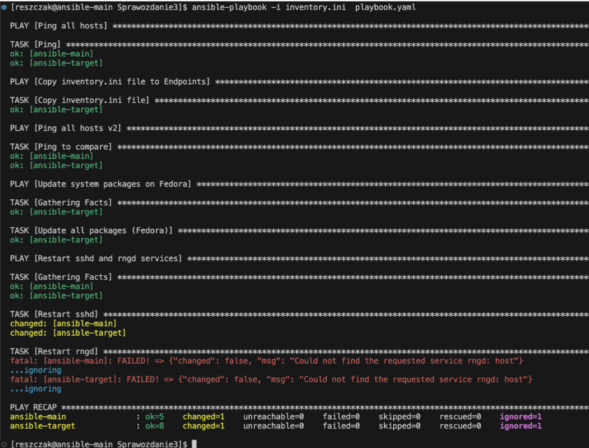
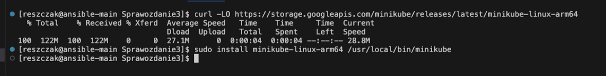

# Sprawozdanie 3 Dawid Reszczyński

## Cel ćwiczeń

Laboratorium obejmowało kompleksowy przegląd nowoczesnych narzędzi do automatyzacji, od poziomu instalacji systemu operacyjnego, przez zarządzanie jego konfiguracją, aż po orkiestrację aplikacji kontenerowych.

Na laboratoriach zyskałem praktyczne doświadczenie w wykorzystaniu Ansible do bezagentowego zarządzania systemami, przeprowadziłem automatyczną instalację OS za pomocą pliku Kickstart, a następnie wdrożyłem i zarządzałem aplikacją Nginx w środowisku Kubernetes (Minikube). Kluczowym elementem było testowanie zaawansowanych strategii wdrażania (Recreate, Rolling Update, Canary) oraz mechanizmów rollback, co stanowi fundament niezawodnych systemów IT.

## Ćw 8 - Automatyzacja i zdalne wykonywanie poleceń z wykorzystaniem Ansible

### Instalacja Ansible na drugiej maszynie

#### Instalacja maszyny ansilbe-target i ustawienie odpowiedniego hostname


#### Instalacja openssh-server i tar


#### Włączenie SSH


### Instalacja Ansible na maszynie głównej

#### Zmiana hosta na "ansible-main"


#### Instalacja Ansible


#### Wygenerowanie klucza ssh na głównej maszynie 

Klucz będzie wykorzystywany do komunikacji z innymi maszynami


#### IP maszyny "ansible-target"


I tutaj pojawił się problem - nie mogłem skopiować kluczy - wymagało to zmiany ustawień karty sieciowej ansible-target na bridged


Stąd zmiana IP

#### Skopiowanie kluczy na docelową maszynę


#### Logowanie na maszyne "ansible target" poprzez ssh

Warto zauważyć, że logowanie odbyło się bez podania hasła


#### Sprawdzenie komunikacji


### Inwentaryzacja

#### Dodanie DNS na dwóch maszynach, by rozpoznawać nazwy hostów


#### Utworzenie pliku inwentaryzacji (inventory.ini). 

`Orchestrators` - maszyny zarządzające
`Endpoints` - maszyny docelowe


#### Wywołanie żądania ping dla wszystkich maszyn za pomocą ansible

```bash 
ansible all -i inventory.ini -m ping
```


Tutaj wynikło, że trzeba dodać dopisek do pliku inventory informującym o byciu zalogowanym lokalnie na maszynie


### Zdalne wywoływanie procedur 

#### Utworzenie pliku `playbook.yaml` i dodanie taska wysyłającego ping


```bash 
ansible-playbook -i inventory.ini playbook.yaml
```

#### Rozbudowanie `playbook.yaml` o kolejne zadania


Pojawił się błąd: 


Rozwiązanie to dodanie hasła do sudo do pliku `inventory.ini`


#### Wynik 

Jak widać, wszystko wykonuje się poprawnie:
 - SSH zostaje zresetowane prawidłowo
 - RNGD nie zostaje znalezione, więc jest ignorowane (zgodnie z plikiem .yaml)



### Zarządzanie Kontenerem

#### Stworzenie nowego playbooka 


#### Rezultat


### Wnioski

Integracja narzędzia Ansible z ekosystemem Docker pozwoliła na skuteczną realizację celów w zakresie automatyzacji wdrażania aplikacji. Zastosowanie dedykowanych playbooków umożliwiło standaryzację cyklu życia kontenerów, od ich inicjalizacji po finalne uruchomienie aplikacji.

Kluczowym rezultatem jest znaczące uproszczenie zarządzania infrastrukturą kontenerową oraz uzyskanie zdolności do szybkiego dostosowywania konfiguracji do bieżących potrzeb projektowych. Takie podejście jest zgodne z paradygmatem elastycznych i skalowalnych systemów IT. Cały proces techniczny, obejmujący konfigurację i uruchomienie, został precyzyjnie udokumentowany przy użyciu zrzutów ekranu, co stanowi kompletną bazę referencyjną.

## Ćw 9 - Nienadzorowana Instalacja 

#### Skopiowanie pliku `anaconda-ks.cfg` do repozytorium


#### Modyfikacja pliku 

- Dodanie wzmianek o repozytoriach fedory


- ustawienie hostname


- wzmianki o pakietach (dodanie dockera)


- formatowanie dysku


#### Sekcja %post

W sekcji post odbywa sie inicjalizacja kontenera 


#### Finalna wersja `anaconda-ks.cfg`


#### Umieszczenie pliku na github

Plik umieściłem na github pod tym [linkiem](https://raw.githubusercontent.com/InzynieriaOprogramowaniaAGH/MDO2025_INO/refs/heads/DR415825/ITE/GCL06/DR415825/Sprawozdanie3/anaconda-ks.cfg)

#### Dopisanie zależności przy instalacji

Podczas instalacji nacisnąłem klawisz `e`, żeby przejść do uzupełnienia zależności 
Dopisanie `init.ks=https://raw.githubusercontent.com/InzynieriaOprogramowaniaAGH/MDO2025_INO/refs/heads/DR415825/ITE/GCL06/DR415825/Sprawozdanie3/anaconda-ks.cfg`


#### Instalacja 


Po zalogowaniu widać kontener irssi i podłączyć się do niego za pomocą `docker attach`


Jak widać wszystko się uruchamia i działa poprawnie - ćwiczenie wykonane

### Wnioski

Podczas zajęć zautomatyzowano proces instalacji systemu Fedora, co dowiodło skuteczności plików Kickstart w tworzeniu powtarzalnych środowisk. Kluczowym elementem był centralnie zarządzany plik konfiguracyjny `anaconda.ks` przechowywany na GitHubie.

Jeśli chodzi o plusy tego rozwiązania, to są następujące:
- **Pełna automatyzacja:** Plik Kickstart umożliwił bezobsługowe przeprowadzenie całego procesu – od partycjonowania dysku, przez tworzenie użytkowników, aż po instalację konkretnych pakietów (Docker, Git).
- **Konfiguracja "po instalacji":** Wykorzystano skrypt post-install do automatycznego uruchomienia kontenera, co pokazuje, że system może być gotowy do pracy natychmiast po pierwszym starcie.
- **Prostota uruchomienia:** Cała procedura została zainicjowana jednym parametrem startowym w GRUB-ie `inst.ks=...`, co minimalizuje ryzyko błędu ludzkiego.


## Ćw 10-11 Kubernetes

### Wdrażanie na zarządzalne kontenery (L10)

#### Instalacja i uruchomienie Minikube

Pobranie i zainstalowanie Minikube 



Dodanie aliasu do skrócenia polecenia `minikube kubectl --` na `kubectl` 


Sprawdzenie minikube `minikube version`


Uruchomienie minikube `minikube start`


Uruchomienie dashboard'u `minikube dashboard`


#### Deployment i Service'y

Stworzenie plików `depl-nginx.yaml` i `serv-nginx.yaml` w celu późniejszego apply'u aplikacji


Apply plików


Weryfikacja czy pody i service'y zostały poprawnie utworzone


Port-forwarding z portu 8080 na localhost w celu ekspozycji aplikacji poza klaster


### Wdrażanie na zarządzalne kontenery (L11)

#### Utworzenie Obrazów

Stworzenie 3 różnych od siebie obrazów nginxa

`Dockerfile1` - oryginalny obraz


`Dockerfile2` - obraz ze zmienionym head'erem


`DockerfileBad` - obraz, który zawsze zwróci błąd


#### Zbudowanie obrazów i publish

Logowanie do dockerhuba `docker login`


Zbudowanie obrazów `docker build`


Push do dockerhuba `docker push`


I tak dla wszystkich obrazów


#### Zbudowanie deploymentu i service'ów dla obrazów

Modyfikacja plików `depl-nginx.yaml` i `serv-nginx.yaml`


Apply `kubectl apply`


#### Zmiana ilości replik dla każdego deploymentu 

Uywane polecenia:
- `kubectl scale` - zmiana replik
- `kubectl set images/image` - zmiana obrazu
- `kubectl rollout undo` - powrót do poprzedniej wersji

Obrazy: 

- `nginx-custom:v1`


- `nginx-custom:v2` - zmiana obrazu i ilości replik 


- `nginx-custom:bad` - zmiana obrazu


- Powrót do poprzedniej wersji


- Eventy


#### Sprawdzenie statusu rolloutów i deploymentu 

`kubectl rollout history` i `kubectl rollout status`


#### Plik sprawdzający wykonanie deploymentu

Utworzenie pliku `check_deployment.sh`


Nadanie mu uprawnień i wykonanie go


#### Zmiana strategii 

- RollingUpdate


- Recreate


#### Stworzenie wdrożenia Canary Deployment

Utworzenie pliku `canary-nginx.yaml`


Apply: 


Sprawdzenie działania wszystkich podów:


Deploymenty: 


### Wnioski

#### Podsumowując działanie strategii wdrożeń w Kubernetesie, można wyciągnąć następujące wnioski:

- `Rolling Update` jest standardowym, zrównoważonym podejściem. Wnioskujemy, że sprawdza się najlepiej, gdy priorytetem jest utrzymanie ciągłości działania, a organizacja jest przygotowana na szybkie wycofanie błędnej wersji.
- `Recreate`, mimo swojej prostoty, ma ograniczone zastosowanie. Jej implementacja oznacza przerwę w działaniu, co prowadzi do wniosku, że jest odpowiednia głównie dla środowisk deweloperskich lub aplikacji, których chwilowa niedostępność jest akceptowalna.
- Zastosowanie `Canary Deployment` świadczy o dojrzałości procesu CI/CD. Konieczność rozbudowy monitoringu i konfiguracji oznacza, że to metoda dla kluczowych systemów. Wniosek jest taki, że minimalizacja ryzyka biznesowego jest tu ważniejsza niż prostota techniczna.


