# Sprawozdanie 1 – DR416985
# LAB1
## Opis

W ramach pierwszego zadania wykonano pełną konfigurację środowiska Git, SSH oraz repozytorium zdalnego z uwzględnieniem wymagań dotyczących kluczy, 2FA i hooków.

---

## 1. Instalacja Gita i SSH
```sh
git --version
```
```sh
ssh -V
```
```sh
ls
```

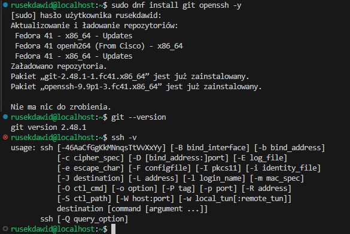

## 2. Klonowanie repozytorium przez HTTPS

```sh
git clone https://github.com/InzynieriaOprogramowaniaAGH/MDO2025_INO.git
```


## 3. Generowanie kluczy SSH

```sh
ssh-keygen -t ed25519 -C "drusin@student.agh.edu.pl"
ssh-keygen -t ecdsa -b 521 -C "drusin@student.agh.edu.pl"
```

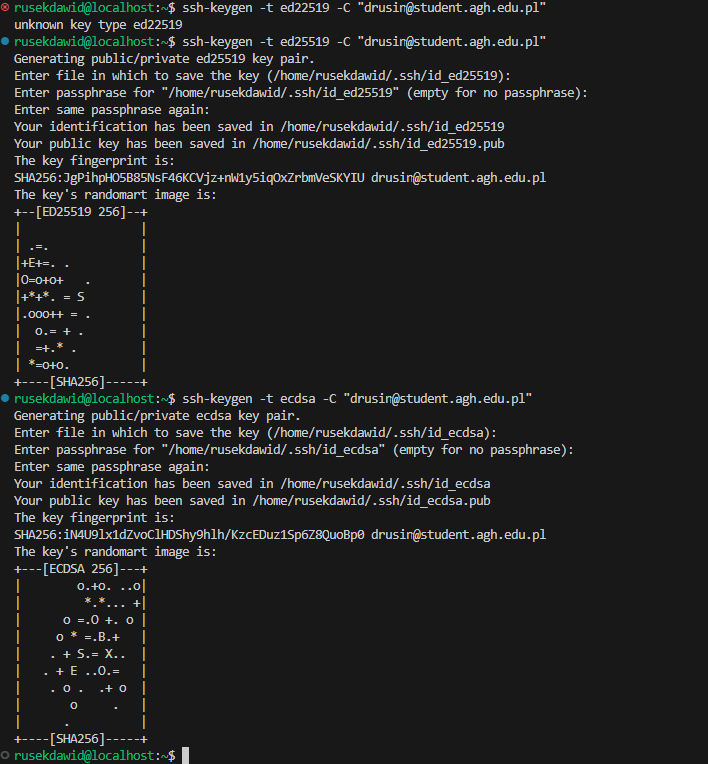


## 4. Dodanie klucza do GitHuba

Dodano klucz publiczny id_ed25519.pub do ustawień GitHuba.


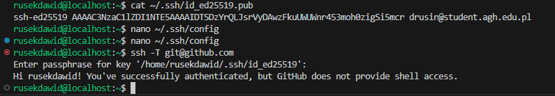


## 5. Klonowanie repozytorium przez SSH

```sh
git clone git@github.com:InzynieriaOprogramowaniaAGH/MDO2025_INO.git
```


## 6. Przejście na swojego brancha
```sh
git checkout DR416985
```

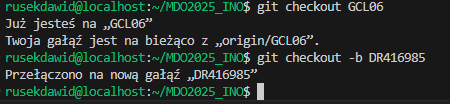


## 7. Włączenie 2FA


## 9. Hook commit-msg

```sh
#!/bin/bash
MESSAGE=$(cat $1)
if [[ ! $MESSAGE =~ ^DR416985 ]]; then
  echo "ERROR: Commit message must zaczynać się od 'DR416985'"
  exit 1
fi
```

Nadanie uprawnien

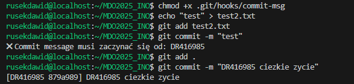


## 10. Test działania hooka

```sh
chmod +x .git/hooks/commit-msg
git add .
git commit -m "test"
git add .
git commit -m "DR416985.."

```


## 11. Push zmian
```sh
git push origin DR416985
```
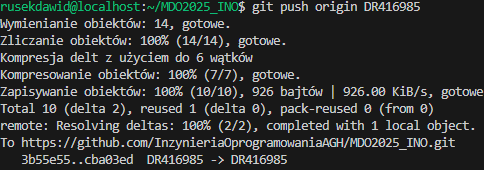

# Lab 2

## Zainstalowanie dockera

```sh
sudo dnf install docker -y
```
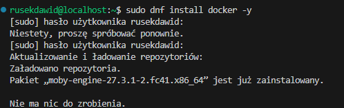
## Pobranie wymaganych obrazów

```sh
docker pull hello-world
docker pull busybox
docker pull ubuntu
docker pull mysql
```

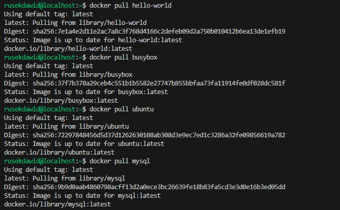

## Uruchomienie kontenerów
```ssh
docker run ubuntu
```

### Interaktywne uruchomienie
```sh
docker run -it ubuntu
```

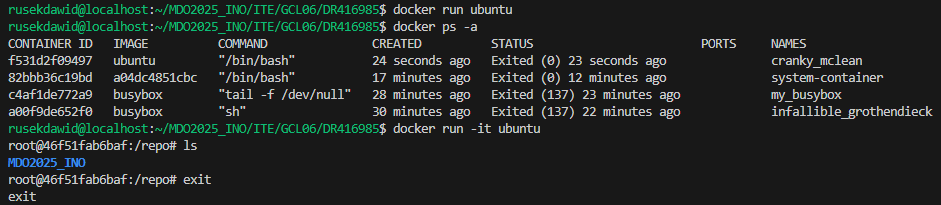
## Tworzenie dockerfile

## Budowanie i urucomienie obrazu

```sh
docker build -t ubuntu .
```

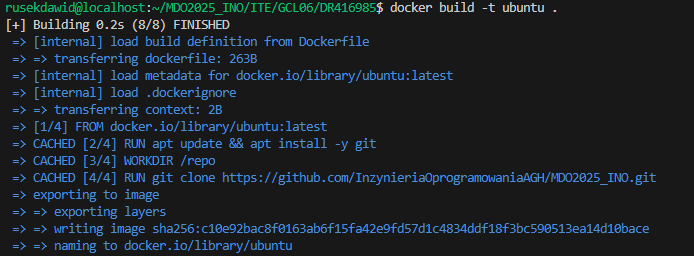

## Czyszczenie konternerów i obrazów

```sh
dcoker rm $(docker ps -aq)
docker rmi $(docker imgaes -q)
```
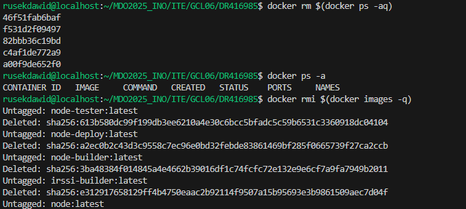
Jeden z konteów był wciąż uruchomiony więc się nie usunoł

```sh
dcoker rm -f c10e92bac8f0
```
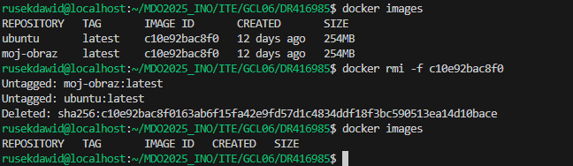

# LAB 3

### Oprogramowanie
**irssi, Node-js-dummy-test**

### klnowanie repo 
```sh
git clone https://github.com/irssi/irssi.git
```

### Instalacja potrzebnych zależności 

```sh
 dnf install -y meson gcc glib2-devel openssl-devel ncurses-devel utf8proc-devel perl-ExtUtils* cmake libgcrypt-config libgcrypt libotr-devel cap_enter-devel pkg-config
```
### Zbudowanie aplikacji i testy

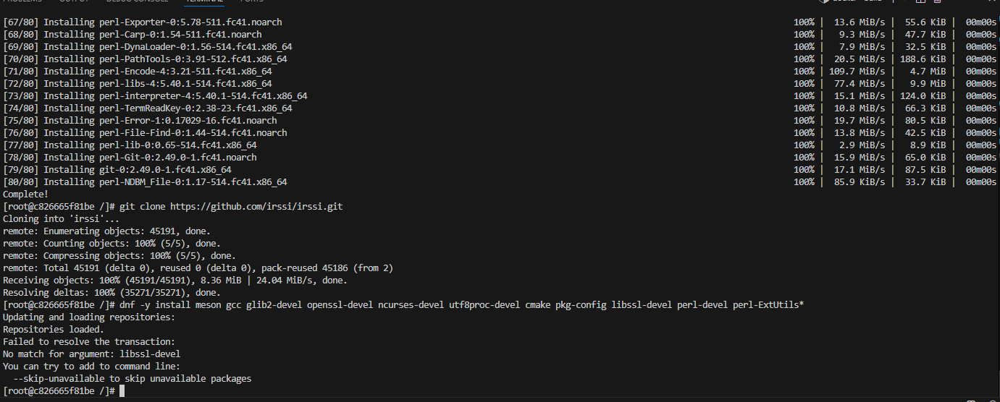

```sh
meson build
ninja test
```
### Zbudowanie irssi w kontenerze

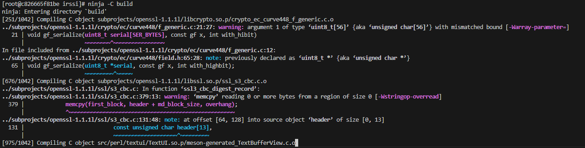

```sh
dokcer run -it --rm fedora bash
git clone https://github.com/irssi/irssi.git
dnf -y install meson gcc glib2-devel openssl-devel ncurses-devel utf8proc-devel cmake pkg-config libssl-devel perl-devel perl-ExtUtils*
meson build
ninja -C build
```

### Dockerfile


**irssi-build.Dockerfile**

```sh
 FROM fedora
 RUN dnf -y update && dnf -y install git meson ninja* gcc glib2-devel utf8proc* ncurses* perl-Ext*
 RUN git clone https://github.com/irssi/irssi.git
 WORKDIR /irssi
 RUN meson Build
 RUN ninja -C /irssi/Build
```

**irssi-test.Dockerfile**

```sh
 FROM irssi-builder
 WORKDIR /irssi/Build
 RUN ninja test
```

### Budowanie obrazu

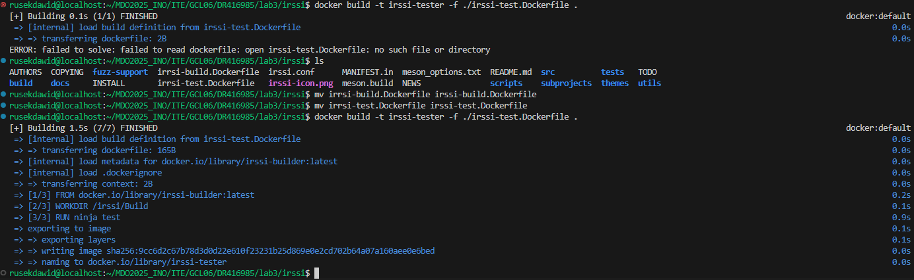

```sh
docker build -t irssi-builder -f ./irssi-build.Dockerfile .
```

**Kontener uruchamiamy poleceniem**

```sh
docker run irssi-builder
```
**Testujemy kontener**

```sh
 docker build -t irssi-tester -f ./irssi-test.Dockerfile .
```

**Podgląd zbudowanych obrazów kontenera**


### Aplikacja w Nodzie

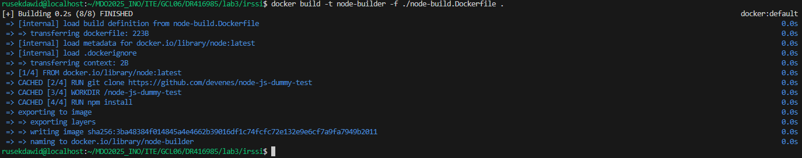

**Interaktywne uruchomienie kontenera**

```sh
sudo docker run --rm -it node /bin/bash
```
**Akutalizacja pakietów, instalacja zależności + testy**

```sh
apt-get update
npm install
npm run test
```

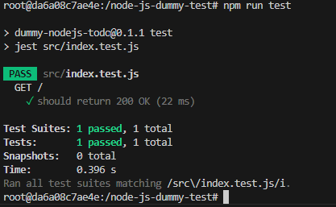

### Dockerfile

**node-build.Dockerfile**

```sh
FROM node
RUN git clone https://github.com/devenes/node-js-dummy-test
WORKDIR /node-js-dummy-test
RUN npm install
```
**node-test.Dockerfile**

```sh
FROM node-builder
RUN npm test
```

**node-deploy.Dockerfile**
```sh
FROM node-builder
CMD ["npm","start"]
```

**Budowanie obrazów**
```sh
docker build -t node-builder -f ./node-build.Dockerfile .
docker build -t node-tester -f ./node-test.Dockerfile .
docker build -t node-deploy -f ./node-deploy.Dockerfile .
```

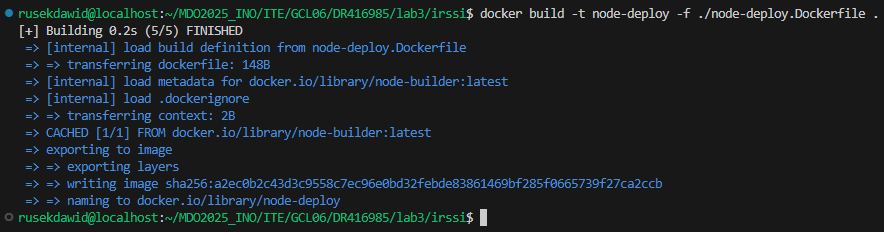

**uruchomienie aplikacji**

```sh
docker run --rm node-deploy
```

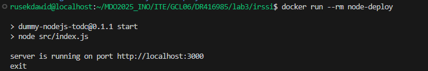

**Podglą obrazów konternerów**

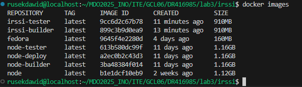

# LAB4

## Tworzenie i budowanie obrazu


Przygotowano Dockerfile, który pobiera repozytorium Node.js i wykonuje instalację oraz testy:

```Dockerfile
FROM node AS node-builder
RUN git clone https://github.com/devenes/node-js-dummy-test
WORKDIR /node-js-dummy-test
RUN npm install 
RUN npm test
```

Obraz zbudowano komendą:

```sh
docker build -t node-base .
```

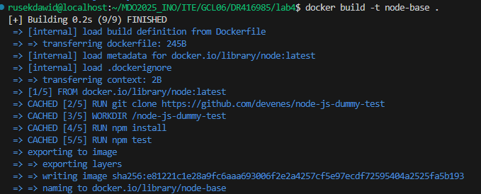

## Tworzenie woluminów i uruchomienie kontenera

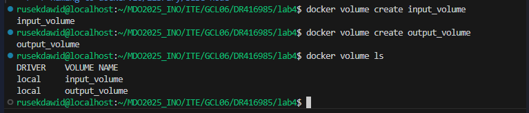

```sh
docker volume create input_volume
docker volume create output_volume

docker run -it --name base-cont -v input_volume:/input -v output_volume:/output node-base bash
```

## Skopiowanie repozytorium do kontenera


```sh
docker cp node-js-dummy-test base-cont:/input
```

## Instalacja zależności i uruchomienie testów w kontenerze

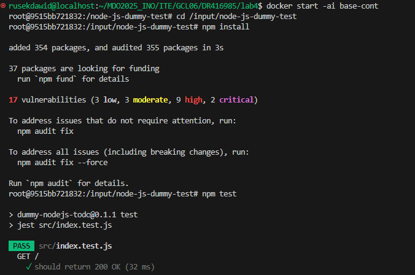
```sh
cd /input/node-js-dummy-test
npm install
npm test
```

## Przeniesienie wyniku do woluminu wyjściowego

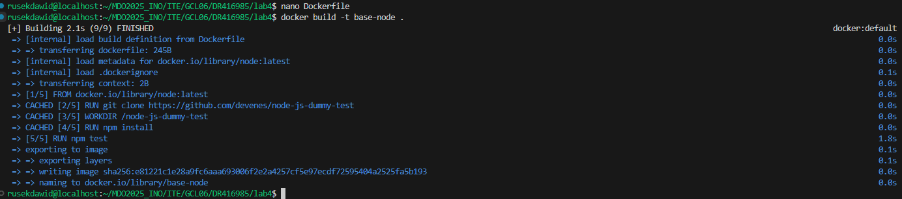
```sh
cp -r /input/node-js-dummy-test /output/
```

Serwer:
```sh
docker run -it --name docker1 -p 5201:5201 networkstatic/iperf3 -s
```

Z innego kontenera:
```sh
docker run -it --name drugi networkstatic/iperf3 -c 172.17.0.3
```

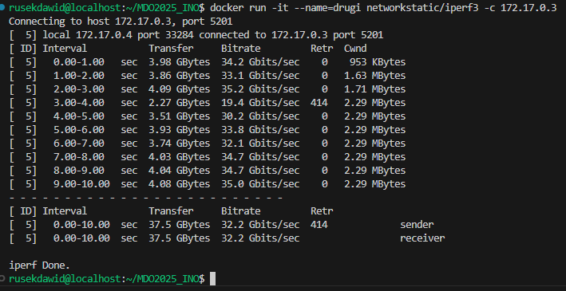

Z hosta:
```sh
iperf3 -c localhost -p 5201

```
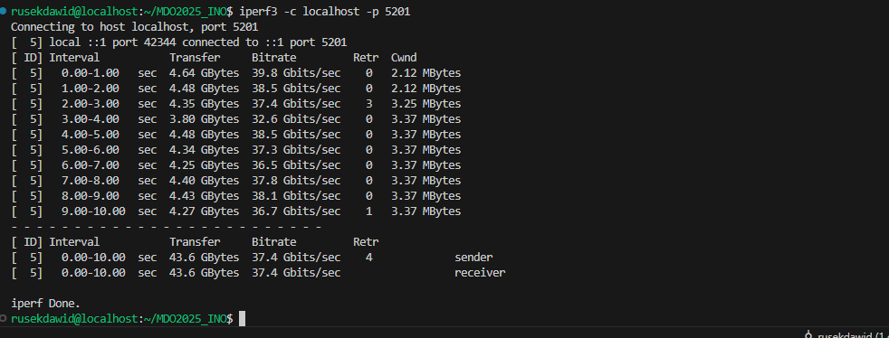


Z innego hosta (np. Windows):
```sh
iperf3.exe -c 172.21.196.66 -p 5201
```

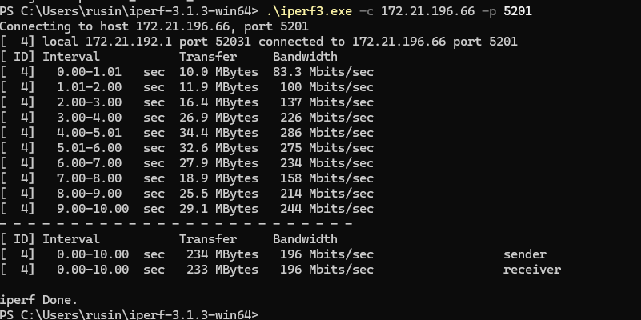


Zapis logów:
```sh
docker logs docker1 > logs.txt
```

## Jenkins

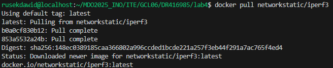
Tworzenie własnej sieci:
```sh
docker network create jenkins
```

Dockerfile:
```Dockerfile
FROM jenkins/jenkins:2.440.2-jdk17
USER root
RUN apt-get update && apt-get install -y lsb-release
RUN curl -fsSLo /usr/share/keyrings/docker-archive-keyring.asc https://download.docker.com/linux/debian/gpg
RUN echo "deb [arch=$(dpkg --print-architecture) signed-by=/usr/share/keyrings/docker-archive-keyring.asc] https://download.docker.com/linux/debian $(lsb_release -cs) stable" > /etc/apt/sources.list.d/docker.list
RUN apt-get update && apt-get install -y docker-ce-cli
USER jenkins
RUN jenkins-plugin-cli --plugins "blueocean docker-workflow"
```

Budowanie:
```sh
docker build -t jenkins1 .
```
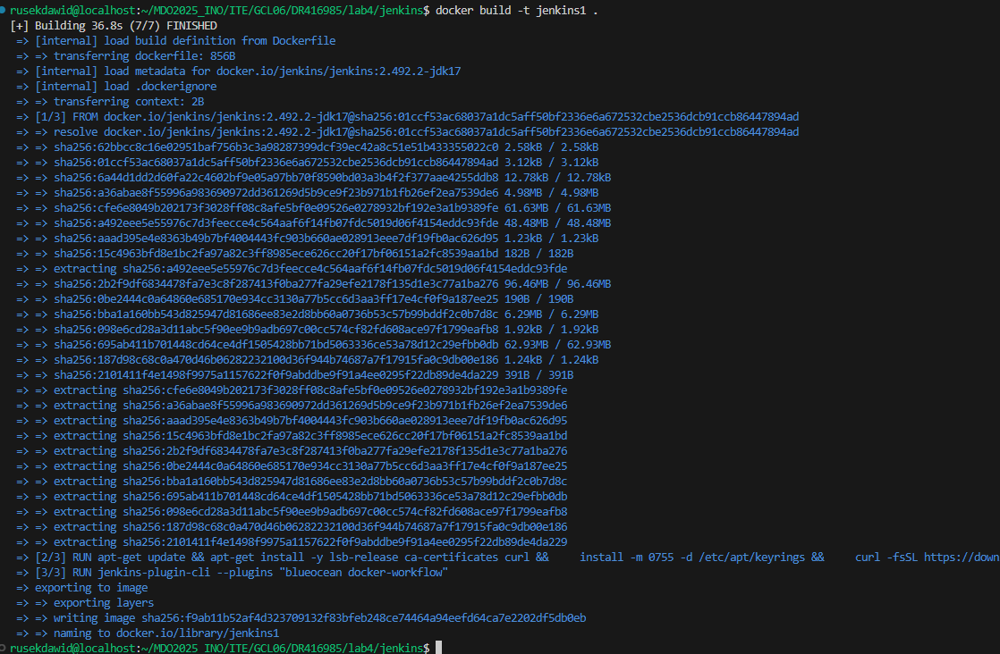


Uruchomienie DinD:
```sh
docker run   --name jenkins-docker   --rm   --detach   --privileged   --network jenkins   --network-alias docker   --env DOCKER_TLS_CERTDIR=/certs   --volume jenkins-docker-certs:/certs/client   --volume jenkins-data:/var/jenkins_home   --publish 2376:2376   docker:dind   --storage-driver overlay2
```

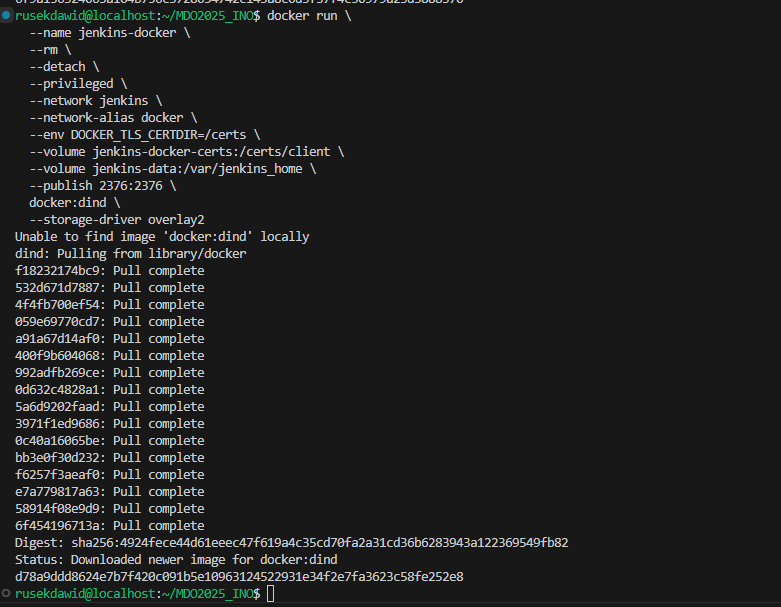

Uruchomienie Jenkinsa:
```sh
docker run   --name jenkins-ui   --restart=on-failure   --detach   --network jenkins   --env DOCKER_HOST=tcp://docker:2376   --env DOCKER_CERT_PATH=/certs/client   --env DOCKER_TLS_VERIFY=1   --publish 8080:8080   --publish 50000:50000   --volume jenkins-data:/var/jenkins_home   --volume jenkins-docker-certs:/certs/client:ro   jenkins1
```

Hasło początkowe:
```sh
docker exec jenkins-ui cat /var/jenkins_home/secrets/initialAdminPassword
```

Po wpisaniu hasła można przejść do konfiguracji i instalacji pluginów.
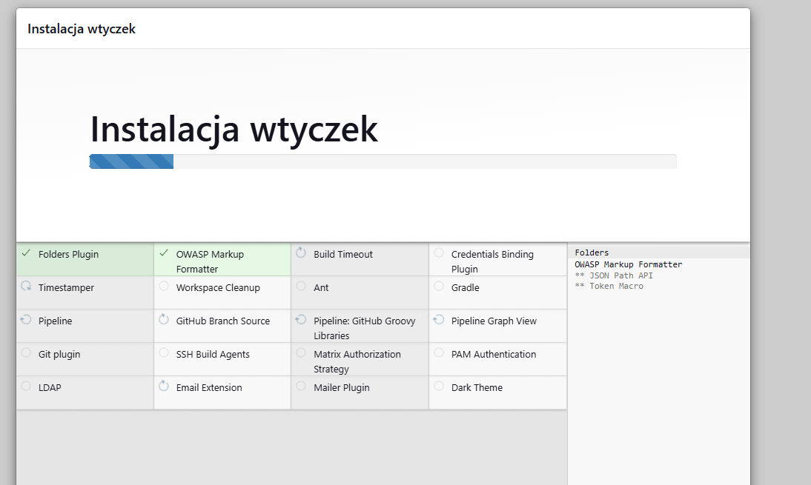
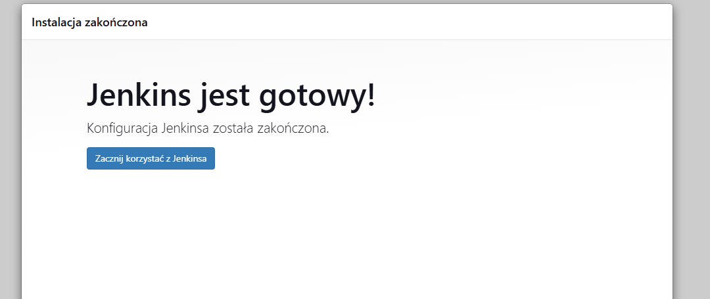
