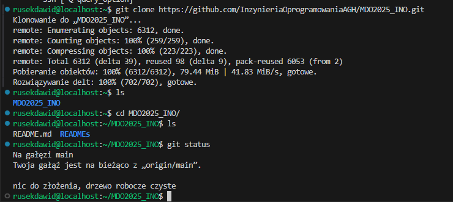

# Sprawozdanie 1 – DR416985
# LAB1
## Opis

W ramach pierwszego zadania wykonano pełną konfigurację środowiska Git, SSH oraz repozytorium zdalnego z uwzględnieniem wymagań dotyczących kluczy, 2FA i hooków.

---

## 1. Instalacja Gita i SSH
```sh
git --version
```
```sh
ssh -V
```
```sh
ls
```


## 2. Klonowanie repozytorium przez HTTPS

```sh
git clone https://github.com/InzynieriaOprogramowaniaAGH/MDO2025_INO.git
```


## 3. Generowanie kluczy SSH

```sh
ssh-keygen -t ed25519 -C "drusin@student.agh.edu.pl"
ssh-keygen -t ecdsa -b 521 -C "drusin@student.agh.edu.pl"
```


## 4. Dodanie klucza do GitHuba

Dodano klucz publiczny id_ed25519.pub do ustawień GitHuba.


## 5. Klonowanie repozytorium przez SSH

```sh
git clone git@github.com:InzynieriaOprogramowaniaAGH/MDO2025_INO.git
```


## 6. Przejście na swojego brancha
```sh
git checkout DR416985
```


## 7. Włączenie 2FA


## 9. Hook commit-msg

```sh
#!/bin/bash
MESSAGE=$(cat $1)
if [[ ! $MESSAGE =~ ^DR416985 ]]; then
  echo "ERROR: Commit message must zaczynać się od 'DR416985'"
  exit 1
fi
```

Nadanie uprawnien


## 10. Test działania hooka

```sh
chmod +x .git/hooks/commit-msg
git add .
git commit -m "test"
git add .
git commit -m "DR416985.."

```


## 11. Push zmian
```sh
git push origin DR416985
```


# Lab 2

## Zainstalowanie dockera

```sh
sudo dnf install docker -y
```

## Pobranie wymaganych obrazów

```sh
docker pull hello-world
docker pull busybox
docker pull ubuntu
docker pull mysql
```


## Uruchomienie kontenerów
```ssh
docker run ubuntu
```

### Interaktywne uruchomienie
```sh
docker run -it ubuntu
```


## Tworzenie dockerfile

## Budowanie i urucomienie obrazu

```sh
docker build -t ubuntu .
```


## Czyszczenie konternerów i obrazów

```sh
dcoker rm $(docker ps -aq)
docker rmi $(docker imgaes -q)
```

Jeden z konteów był wciąż uruchomiony więc się nie usunoł

```sh
dcoker rm -f c10e92bac8f0
```


