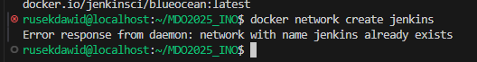
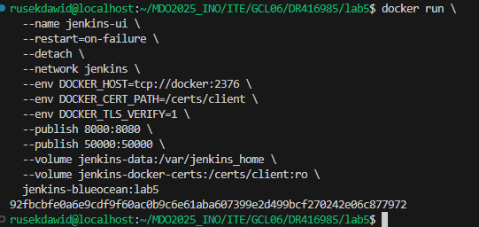
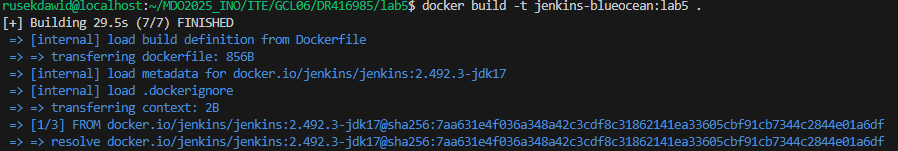
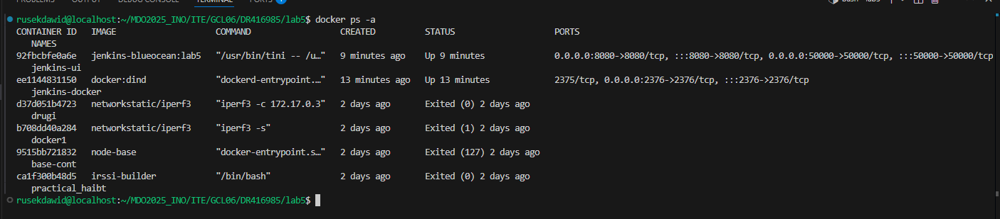
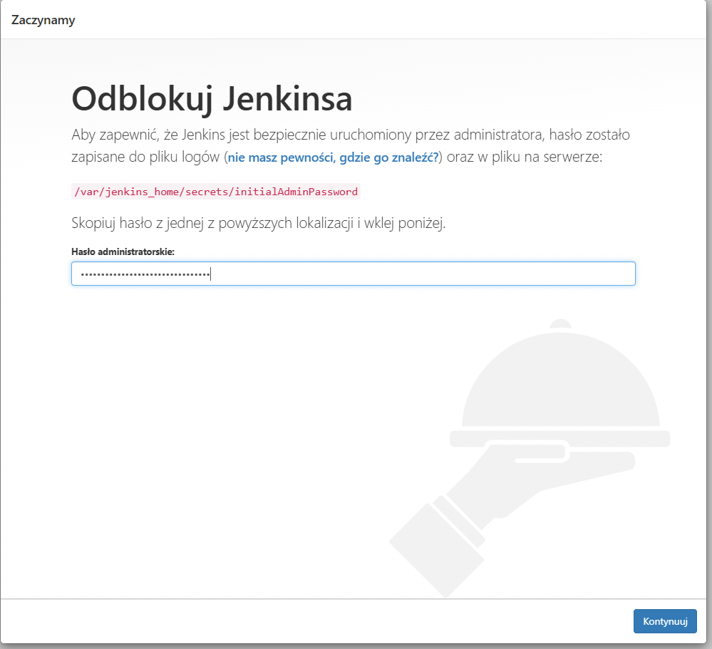
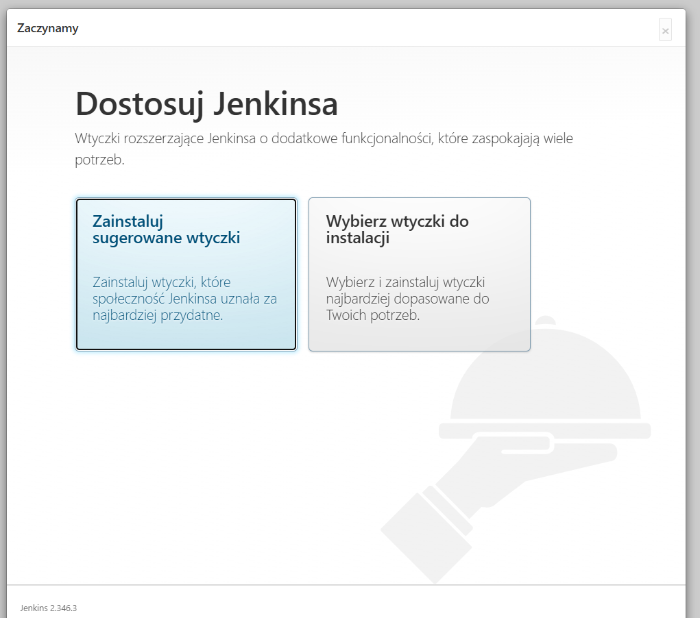
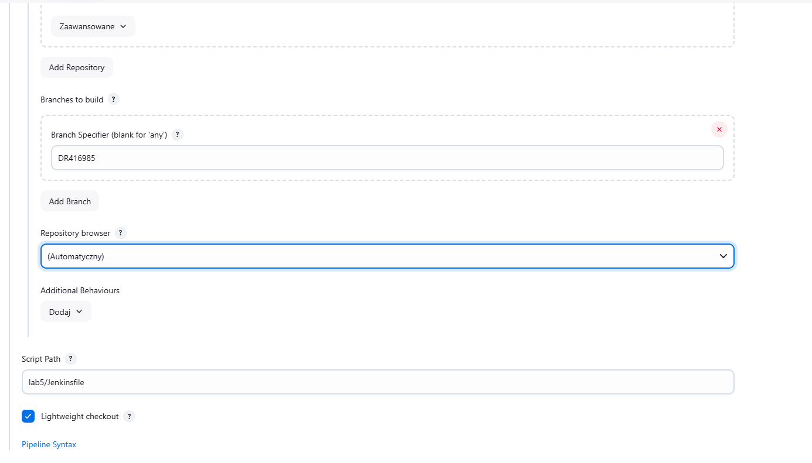

# Sprawozdanie 2
Dawid Rusin

#### Instancja Jenkins

1. Wykonanie kolejno instrukcji instalacji Jenkinsa

```sh
docker network create (nazwa)
```


```sh
docker run --name jenkins-docker --rm --detach   --privileged --network jenkins --network-alias docker   --env DOCKER_TLS_CERTDIR=/certs   --volume jenkins-docker-certs:/certs/client   --volume jenkins-data:/var/jenkins_home   --publish 2376:2376   docker:dind --storage-driver overlay2
```


2. Utworzenie dockerfile

 ```Dockerfile
FROM jenkins/jenkins:2.492.2-jdk17
USER root
RUN apt-get update && apt-get install -y lsb-release ca-certificates curl && \
    install -m 0755 -d /etc/apt/keyrings && \
    curl -fsSL https://download.docker.com/linux/debian/gpg -o /etc/apt/keyrings/docker.asc && \
    chmod a+r /etc/apt/keyrings/docker.asc && \
    echo "deb [arch=$(dpkg --print-architecture) signed-by=/etc/apt/keyrings/docker.asc] \
    https://download.docker.com/linux/debian $(. /etc/os-release && echo \"$VERSION_CODENAME\") stable" \
    | tee /etc/apt/sources.list.d/docker.list > /dev/null && \
    apt-get update && apt-get install -y docker-ce-cli && \
    apt-get clean && rm -rf /var/lib/apt/lists/*
USER jenkins
RUN jenkins-plugin-cli --plugins "blueocean docker-workflow"
```

3. Stworzenie kontenera

4. Działające kontenery
Komenda:
```sh
docker ps
```


5. Po wejściu na localhost:8080
   Ukazywało się nam odblokuje jenkinsa (niesety nie mam tutaj ss)
   Uzyskanie hasła za pomocą komendy
```sh
  docker exec jenkins-blueocean cat /var/jenkins_home/secrets/initialAdminPassword
  ```

Po uzyskaniu hasła pojawia się strona

Następnie tworzymy konto i możemy korzystać z Jankinsa

# Jenkins

1. Wyświetlanie uname
```sh
uname -a
```
2. Sprawdzanie czy godzina jest nieparzysta.

```sh
hour=$(date +%H)
if [ $(( hour % 2 )) -ne 0 ]; then
  echo "FAILURE: The hour is odd."
  exit 1
else
  echo "SUCCESS: The hour is even."
fi
```
Skrypt ten sprawdza, czy godzina jest parzysta i kończy się niepowodzeniem gdzy nie jest. 
3. Pobranie obrazu Ubuntu z Dockerhuba
```sh
docker pull ubuntu:latest
```


4. Obiekt typu Pipeline do klonowania repo
```sh
pipeline {
    agent any

    stages {
        stage('Klonowanie repozytorium') {
            steps {
                git branch: 'DR416985', url: 'https://github.com/InzynieriaOprogramowaniaAGH/MDO2025_INO.git'
            }
        }

        stage('Budowanie obrazu Docker') {
            steps {
                script {
                    sh 'docker build -t obraz_build -f ./ITE/GCL07/DR416985/lab4/node-build.Dockerfile .'
                }
            }
        }
    }
}
```

## Pipeline do wybranej aplikacji
### Node-js-dummy-test

#### DIND vs na Native Docker w CI
##### Docker-in-Docker (DinD)

Kontener CI uruchamia własny demon Dockera, umożliwiając izolowane budowanie i testowanie.

Zalety:

- Pełna izolacja środowiska

- Brak konfliktów między pipeline’ami

Wady:

- Wolniejsze budowanie (brak współdzielonego cache)

- Ryzyko bezpieczeństwa (kontener z uprawnieniami root)

###### Native Docker (via socket)

Kontener CI łączy się z Dockerem na hoście przez /var/run/docker.sock.

Zalety:

- Szybsze budowanie (wykorzystuje cache hosta)

- Prostsza konfiguracja

Wady:

- Mniejsza izolacja (kontenery działają na hoście)

- Potencjalne ryzyko bezpieczeństwa (dostęp do socketu = kontrola nad Dockerem)
1. Diagram
 
  
3. Pipeline:
   
```sh
pipeline {
    agent any

    environment {
        BASE_DIR = 'MDO2025_INO/ITE/GCL06/DR416985/lab5'
        BUILD_VER = '1.0'
        NODE_VER = '23-alpine'
        IMG_BUILD = "node-build:${NODE_VER}"
        IMG_TEST = "node-test:v${BUILD_VER}"
        IMG_DEPLOY = "node-deploy:v${BUILD_VER}"
        NETWORK_NAME = 'app_net'
        PROJECT_DIR = 'MDO2025_INO/ITE/GCL06/DR416985/lab5'
    }

    stages {
        stage('Prepare') {
            steps {
                sh '''
                    rm -rf MDO2025_INO || true
                    git clone https://github.com/InzynieriaOprogramowaniaAGH/MDO2025_INO.git
                    cd MDO2025_INO
                    git checkout DR416985
                '''
            }
        }

        stage('Logs') {
            steps {
                dir("${BASE_DIR}") {
                    sh 'touch build.log'
                    sh 'touch test.log'
                }
            }
        }

        stage('Build') {
            steps {
                dir("${BASE_DIR}") {
                    sh 'docker build -f node-build.Dockerfile -t ${IMG_BUILD} . > build.log 2>&1'
                }
                archiveArtifacts artifacts: "${BASE_DIR}/build.log"
            }
        }

        stage('Tests') {
            steps {
                dir("${BASE_DIR}") {
                    sh 'docker build -f node-test.Dockerfile -t ${IMG_TEST} . > test.log 2>&1'
                }
                archiveArtifacts artifacts: "${BASE_DIR}/test.log"
            }
        }

        stage('Deploy') {
            steps {
                sh 'docker network create ${NETWORK_NAME} || true'
                dir("${BASE_DIR}") {
                    sh '''
                        docker build -f node-deploy.Dockerfile -t ${IMG_DEPLOY} .
                        docker rm -f app || true
                        docker run -d --rm --name app --network ${NETWORK_NAME} -p 3000:3000 ${IMG_DEPLOY}
                    '''
                }
                sleep(10)
            }
        }

        stage('Smoke Tests') {
            steps {
                script {
                    echo 'Running smoke tests...'
                    sh 'docker run --rm --network ${NETWORK_NAME} curlimages/curl curl -v http://app:3000' 
                }
            }
        }

        stage('Publish') {
            steps {
                dir("${PROJECT_DIR}") {
                    sh '''
                        mkdir -p artifacts_${BUILD_NUMBER}
                        tar -cvf artifacts_${BUILD_NUMBER}.tar *.log
                    '''
                    archiveArtifacts artifacts: "artifacts_${BUILD_NUMBER}.tar"
                }
            }
        }
    }

    post {
        always {
            echo 'Cleaning up Docker resources...'
            sh '''
                docker container prune -f || true
                docker rmi -f ${IMG_BUILD} ${IMG_TEST} ${IMG_DEPLOY} || true
                docker stop app || true
                docker network rm ${NETWORK_NAME} || true
            '''
        }
    }
}
```

Opis etapów:
   - Prepare

Ten etap przygotowuje środowisko pracy poprzez usunięcie ewentualnych istniejących plików, sklonowanie repozytorium GitHub i przejście do odpowiedniej gałęzi (DR416985). Gwarantuje to, że pipeline rozpoczyna pracę z aktualną i odpowiednią wersją kodu źródłowego.

   - Logs

Etap tworzy pliki dziennika (logów) dla procesów budowania i testowania. Pliki te są niezbędne do przechowywania informacji o przebiegu tych procesów, co umożliwia późniejszą analizę ewentualnych problemów.

   - Build

Ten fragment kodu definiuje etap budowania aplikacji, w którym tworzony jest obraz Dockera na podstawie pliku node-build.Dockerfile. Proces budowania jest rejestrowany w pliku build.log, który jest następnie archiwizowany jako artefakt. Ten etap zapewnia, że aplikacja jest poprawnie skompilowana i gotowa do dalszych etapów.

   - Tests

Ten fragment kodu definiuje etap testów, który jest kluczowym krokiem w procesie zapewniania jakości oprogramowania poprzez automatyzację testowania aplikacji. Obraz testowy jest budowany na podstawie pliku node-test.Dockerfile, a wyniki testów są zapisywane w pliku test.log i archiwizowane.

   - Deploy

Po pomyślnym zakończeniu testów, etap deploy automatycznie wdraża zbudowaną aplikację lub oprogramowanie na odpowiednie środowisko. Tworzona jest sieć Docker, budowany jest obraz deployowy, a następnie kontener z aplikacją jest uruchamiany na porcie 3000. Automatyzacja tego procesu eliminuje potrzebę ręcznego wdrażania, co z kolei przyspiesza cykl dostarczania oprogramowania.

   - Smoke Tests

#### Przy uruchamianiu pipeline używane są również dockerfile:

1. node-build.Dockerfile

```Dockerfile
FROM node:23-alpine

WORKDIR /app

COPY . .

RUN npm install
```

2. node-test.Dockerfile
```Dockerfile

FROM node:23-alpine

WORKDIR /app

COPY . .

RUN npm install

CMD ["npm", "test"]

```

3. node-deploy.Dockerfile
```Dockerfile

FROM node:23-alpine

WORKDIR /app

COPY . .

RUN npm install

CMD ["npm", "start"]

```

Uruchomienie Pipeline przy użyciu SCM




Aby uruchomić pipeline za pomocą SCM należy stworzyć Jenkinsfile na maszynie, następnie na Jenkinsie stworzyć nowy projekt i wybrać Pipeline a potem Pipeline script from SCM

Niestety nie posiadam screenów na działanie tego ostatniego pipline. Nie wiem czy Pan pamięta ale zgłosiłem się kiedyś do Pana że każdo razowo po zamknięciu Jenkinsa przy nastepnym uruchumieniu działa ona potwornie wolno
Jakoś udało mi śie rozwiazac wtedy ten problem jednak dziś przy odapleniu jenkinsa było to samo dosłownie po zalogowaniu czekałem koło 10min potem cokowliek kliknąc to jest kolejne 5 więc prędzej rzuciłbym komputerem o scianę niż porobił te ss. Stwierdziłem że postawie Jenkinsa od nowa ale tu też pojawiły się problemy że wyszedł jakiś nowy Jenkins i są jakies problemy z pluginami. Wyjeżdzam jutro rano na Akademickie Mistrzostwa Polski więc nie mam aktualnie ani chęci ani czasu się z tym bawić. Jeśli to sprawozdanie wystarczy na 3.0 to będe więcej niż szczęsliwy jeśli nie prosiłbym o wiadomość zwrotną to postaram się znaleść cczas w przyszłym tygodniu żeby to zrobić porządniej.


