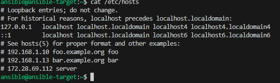
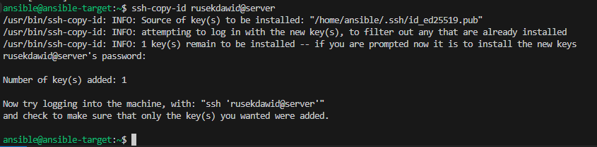

# LAB8 ANSIBLE

## 1. Instalacja zarządcy Ansible
1.1 Utwórzyłem drugą maszynę wirtualną:
System: Taki sam jak na maszynie głównej (np. Fedora Server, Ubuntu Server)
Nazwa hosta: ansible-target (u mnie początkowo ansible ale potem zmieniłem na ansible-target)
```sh
sudo hostnamectl set-hostname ansible-target
```


1.2 Zainstalowałem wymagane pakiety
```sh
sudo dnf install tar openssh-server -y
```


1.3 Utwórzyłem użytkownika ansible

## 2. Instalacja Ansible na maszynie głównej
2.1 Instalacja Ansible
```sh
sudo dnf install ansible -y
```


w naszym przypadku już mamy ansible więc tylko sprawdzamy
```sh
ansible --version
```
2.2 Klucze
Kolejny krok to generowanie klucz lecz ponownie my już klucze mamy także robimy tylko
```sh
ssh-copy-id ansible@ansible
```


2.3 Sprawdź połączenie:
```sh
ssh ansible@ansible
```


2.4 Sprawdzenie połaczenia poprzez ping
```sh
ping ansible-target
```


## 3 Inwentaryzacja systemów
3.1 Ustawienia hostname:
Na każdej maszynie:
```sh
hostnamectl set-hostname NAZWA
```


3.2 Wprowadź wpisy DNS / hostów:
Na każdej maszynie edytuj /etc/hosts:



3.3 Skopiowanie klucza na nowej maszynie
```sh
ssh-copy-id rusekdawid@server
```


3.4 Podłączenie się z głownej maszyny na nową 
```sh
ssh rusekdawid@server
```



3.5 Plik inwentaryzacji (inventory.ini):
```sh
[Orchestrators]
orchestrator

[Endpoints]
ansible-target
```
## 4. Zdalne wywoływanie procedur
4.1 Ping playbook:
```sh
# ping.yml
- hosts: all
  tasks:
    - name: Test ping
      ping:
```
```sh
ansible-playbook -i inventory.ini ping.yml
```
4.2 Skopiuj plik:
```sh
# copy_inventory.yml
- hosts: Endpoints
  tasks:
    - name: Copy inventory
      copy:
        src: ./inventory.ini
        dest: /home/ansible/inventory.ini
```
4.3 Aktualizacja pakietów:
```sh
# update.yml
- hosts: Endpoints
  become: true
  tasks:
    - name: Update packages
      package:
        name: "*"
        state: latest
```
4.4 Restart usług:
```sh
# restart_services.yml
- hosts: Endpoints
  become: true
  tasks:
    - name: Restart sshd
      service:
        name: sshd
        state: restarted

    - name: Restart rngd
      service:
        name: rngd
        state: restarted
```

# LAB9
## Wdrożenia nienadzorowane

## 1. Pierwszym krokiem było wyciągniecię pliki anaconda-ks.cfg z naszej głownej maszyny Fedora
```sh
sudo cp /root/anaconda-ks.cfg
```

## 1.1 Plik został wrzucony na githuba aby potem móc pobrać link w wersja RAW

## 2. Tworzymy nową maszyne virtualną, ważne jest aby użyć tego samoego obrazu bo potem można spędzić 2h zasnataawiając się czemu nie działa 

## 3. Modyfikacja pliku odpowiedzi
- dodano repozytoria Fedora,
- włączono automatyczne czyszczenie dysku,
- ustawiono hostname,
- dodano wymagane pakiety (np. docker, wget),
- przygotowano pobieranie i instalację programu z serwera.

Pełen plik anakonda-ks.cfg
```sh
# Generated by Anaconda 41.35
# Generated by pykickstart v3.58
#version=DEVEL

# Źródło instalacji i repozytoria
url --mirrorlist=http://mirrors.fedoraproject.org/mirrorlist?repo=fedora-41&arch=x86_64
repo --name="updates" --mirrorlist=http://mirrors.fedoraproject.org/mirrorlist?repo=updates-released-f41&arch=x86_64


# Nazwa hosta
network --hostname=fedora41-host


# Partycjonowanie
ignoredisk --only-use=sda
autopart
clearpart --all --initlabel

# Użytkownicy
rootpw --iscrypted --allow-ssh $y$j9T$PPvWXQ08ubuDtlePbgWRwHG5$UX6gS9fKxntSXnmME.7GPO5pGZYkT8o9aBV9okODfhD
user --groups=wheel --name=rusekdawid --password=$y$j9T$isy1wV.oQTw96wiKPjIQi2IE$ooeiaPW.QOSsay.YmAMO1.Ws9vy1YoaSsH3TPNjf9m0 --iscrypted --gecos="rusekdawid"

# Ustawienia po instalacji
firstboot --enable
reboot

# Pakiety do zainstalowania
%packages
@^server-product-environment
wget
curl
docker
%end


%post --log=/root/ks-post.log


# Skrypt uruchamiający Twój program w kontenerze
cat << 'EOF' > /usr/local/sbin/run-my-app-container.sh
#!/bin/bash
IMAGE="rusekdawid/mojprogram:latest"
CONTAINER="mojprogram"
sleep 5
docker pull $IMAGE
docker run -d --name $CONTAINER --restart=unless-stopped -p 3000:3000 $IMAGE
EOF

chmod +x /usr/local/sbin/run-my-app-container.sh

# Usługa systemd do automatycznego uruchomienia programu
cat << 'EOF' > /etc/systemd/system/run-my-app-container.service
[Unit]
Description=Run my Node.js app container
Requires=docker.service
After=network-online.target docker.service

[Service]
Type=oneshot
RemainAfterExit=yes
ExecStart=/usr/local/sbin/run-my-app-container.sh

[Install]
WantedBy=multi-user.target
EOF

systemctl daemon-reload
systemctl enable run-my-app-container.service

%end
```
## 4. Kolejnym krokiem jest pobranie linku raw i wklejeniu go podczas odpalania maszyny w linicje zaczynajacej sie od linux...
Dokładniej mówiąc to przepisanie go bo wklejać się tam nie da


## 4.1 Po zresetowaniu fedora się odapla i zaczyna instalować pakiety


## 4.2 Udało się odaplić maszyny


# LAB 10+11

##  1. Instalacja i uruchomienie Minikube

- Zainstalowano Minikube
- Uruchomiono klaster

```bash
minikube start
minikube status
```

- Uruchomiono Dashboard

```bash
minikube dashboard
```

 **Screen 1:** Dashboard – pusta lista zasobów (brak podów, brak deploymentów)

---

##  2. Ręczne uruchomienie PODa

- Utworzono plik `nginx-pod.yaml`
- Uruchomiono pod:

```bash
kubectl apply -f nginx-pod.yaml
kubectl get pods
kubectl port-forward pod/nginx-pod 8088:8080
```

 **Screen 2:** `kubectl get pods` – widać pod `nginx-pod` w stanie Running  
 **Screen 3:** Przeglądarka – działająca aplikacja pod `localhost:8088`  
 **Screen 4:** Dashboard – widoczny pod `nginx-pod`

---

##  3. Deployment z YAML i replikami

- Utworzono `nginx-deployment.yaml`
- Uruchomiono deployment:

```bash
kubectl apply -f nginx-deployment.yaml
kubectl get deployments
kubectl get pods
```

 **Screen 5:** `kubectl get deployments` i `kubectl get pods` – 4 pody  
 **Screen 6:** Dashboard – widoczny deployment i 4 działające pody

---

##  4. Skalowanie Deploymentu

- Skalowano liczbę replik:

```bash
kubectl scale deployment nginx-deployment --replicas=8
kubectl scale deployment nginx-deployment --replicas=1
kubectl scale deployment nginx-deployment --replicas=0
kubectl scale deployment nginx-deployment --replicas=4
```

 **Screen 7:** Dashboard – np. 8 podów  
 **Screen 8:** Dashboard – 0 podów  
 **Screen 9:** Dashboard – z powrotem 4 pody

---

##  5. Błędna wersja obrazu i rollback

- Zmieniono `image` w `nginx-deployment.yaml` na nieistniejący
- Zastosowano:

```bash
kubectl apply -f nginx-deployment.yaml
kubectl get pods
```

- Rollback:

```bash
kubectl rollout undo deployment nginx-deployment
```

 **Screen 10:** Dashboard – pody z błędem `ErrImageNeverPull`  
 **Screen 11:** Dashboard – po rollbacku, wszystkie pody `Running`  
 **Screen 12:** Terminal – wynik `kubectl rollout undo`

---

##  6. Strategia Recreate

- Zmieniono strategię w YAML:

```yaml
strategy:
  type: Recreate
```

- Wdrożono ponownie:

```bash
kubectl apply -f nginx-deployment.yaml
```

 **Screen 13:** Dashboard – moment bez żadnych podów (`Terminating`, `Pending`)

---

##  7. Skrypt sprawdzający rollout (60s)

- Plik `check-rollout.sh`:

```bash
#!/bin/bash
timeout=60
elapsed=0
echo "⏳ Czekam na wdrożenie nginx-deployment..."

while [ $elapsed -lt $timeout ]; do
  ready=$(kubectl get deployment nginx-deployment -o jsonpath='{.status.readyReplicas}')
  if [ "$ready" == "4" ]; then
    echo " Wdrożenie zakończone sukcesem."
    exit 0
  fi
  sleep 5
  elapsed=$((elapsed + 5))
done

echo " Wdrożenie NIE zakończyło się w 60 sekund."
exit 1
```

- Uruchomienie:

```bash
chmod +x check-rollout.sh
./check-rollout.sh
```

 **Screen 14:** Terminal – wynik działania skryptu

---
