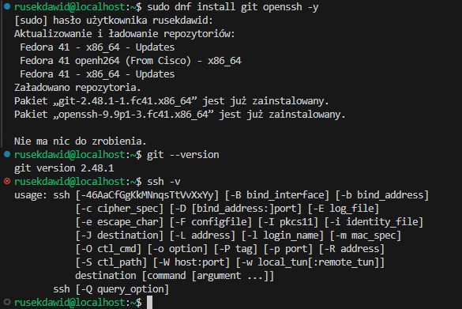
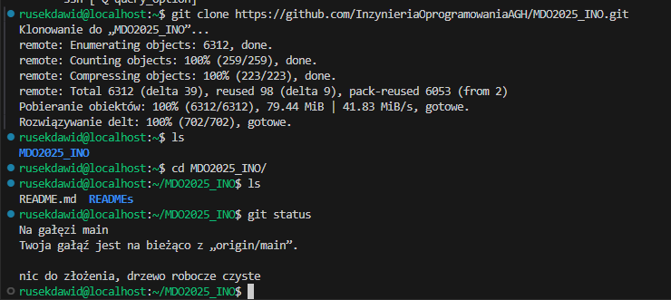
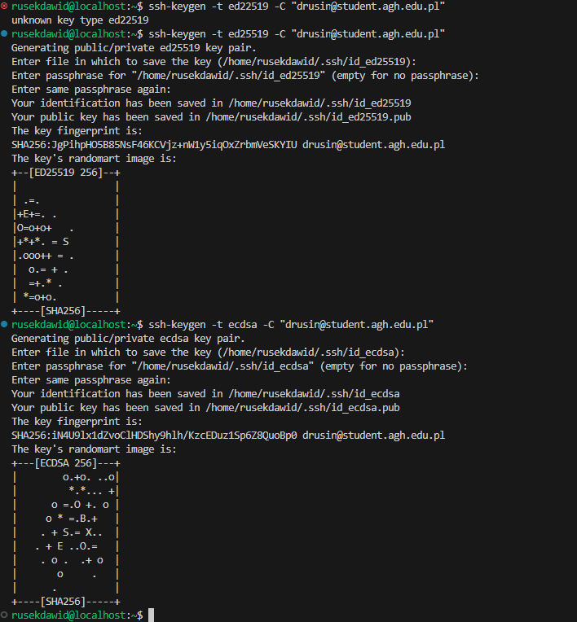
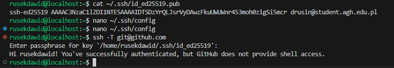
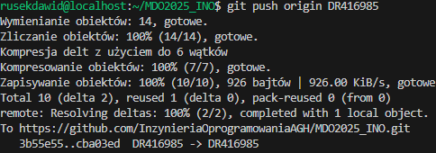

# Sprawozdanie 1 – DR416985

## Opis

W ramach pierwszego zadania wykonano pełną konfigurację środowiska Git, SSH oraz repozytorium zdalnego z uwzględnieniem wymagań dotyczących kluczy, 2FA i hooków.

---

## 1. Instalacja Gita i SSH
```sh
git --version
```
```sh
ssh -V
```
```sh
ls
```



## 2. Klonowanie repozytorium przez HTTPS

```sh
git clone https://github.com/InzynieriaOprogramowaniaAGH/MDO2025_INO.git
```


## 3. Generowanie kluczy SSH

```sh
ssh-keygen -t ed25519 -C "drusin@student.agh.edu.pl"
ssh-keygen -t ecdsa -b 521 -C "drusin@student.agh.edu.pl"
```




## 4. Dodanie klucza do GitHuba

Dodano klucz publiczny id_ed25519.pub do ustawień GitHuba.




## 5. Konfiguracja pliku SSH

Host github.com
  User git
  HostName github.com
  IdentityFile ~/.ssh/id_ed25519
  IdentitiesOnly yes

## 6. Klonowanie repozytorium przez SSH

git clone git@github.com:InzynieriaOprogramowaniaAGH/MDO2025_INO.git


## 7. Przejście na swojego brancha
```sh
git checkout DR416985
```


## 7. Włączenie 2FA


## 9. Hook commit-msg


## 10. Test działania hooka
[screen](./testhook.png)

## 11. Push zmian




