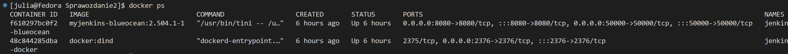
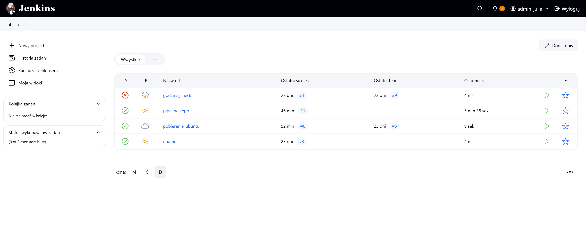
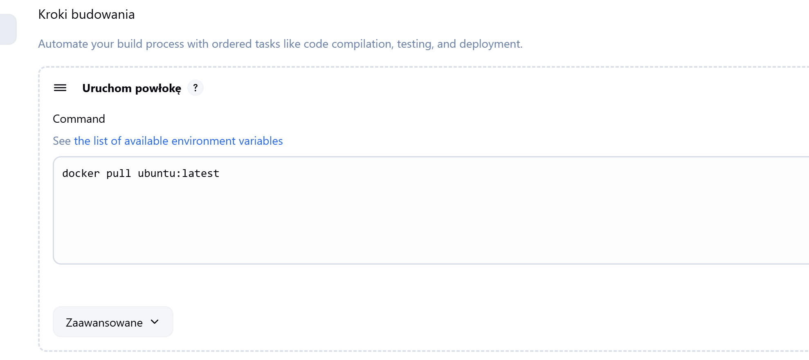
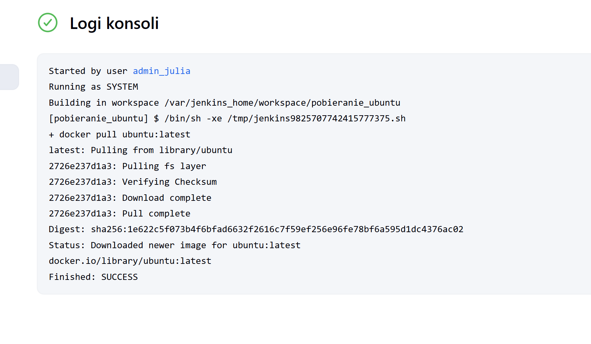

# Sprawozdanie nr 2
Julia Piśniakowska <br>
System operacyjny: Fedora <br>
Wizualizacja: Hyper-V <br>
Projekt: Node-js-dummy <br>

## Jenkins 🌵:<br>

Jenkins Blue Ocean to udoskonalona wersja interfejsu użytkownika platformy Jenkins, stworzona z myślą o poprawie doświadczenia użytkownika. Charakteryzuje się intuicyjnym interfejsem graficznym, który znacząco ułatwia wizualizację i analizę procesów ciągłej integracji i dostarczania (CI/CD). Blue Ocean wyposażono w zestaw preinstalowanych wtyczek zoptymalizowanych specjalnie pod kątem współpracy z tym interfejsem, co zwiększa jego funkcjonalność i efektywność.
### Utworzenie sieci dla Jenkinsa:
` docker network create jenkins `
### Dockerfile dla własnego obrazu zawierającego Blue Ocean:
``` 
FROM jenkins/jenkins:2.440.3-jdk17
USER root
RUN apt-get update && apt-get install -y lsb-release
RUN curl -fsSLo /usr/share/keyrings/docker-archive-keyring.asc \
  https://download.docker.com/linux/debian/gpg
RUN echo "deb [arch=$(dpkg --print-architecture) \
  signed-by=/usr/share/keyrings/docker-archive-keyring.asc] \
  https://download.docker.com/linux/debian \
  $(lsb_release -cs) stable" > /etc/apt/sources.list.d/docker.list
RUN apt-get update && apt-get install -y docker-ce-cli
USER jenkins
RUN jenkins-plugin-cli --plugins "blueocean docker-workflow" 

```
### Zbudowanie obrazu:
` docker build -t blueocean -f Blueocean.Dockerfile . `

W celu przeprowadzenia konfiguracji Jenkinsa (http://localhost:8080) wpisałam hasło i pobrałam potrzebne rozszerzenia.


## Projekty: 🌵🌵
* Konfiguracja wstępna i pierwsze uruchomienie

  * 1. Utwórz projekt, który wyświetla uname

    Dodaje nowy projekt. Następnie wybieram typ projektu - *Projket Ogólny*.<br>
    W sekcji *Kroki Budowania* wybieram - *Uruchom powłokę*, gdzie wprowadzam swój skrypt.<br>
    ` uname -a`<br>

Sukces. Skryt działa poprawnie.<br>

 * 2. Utwórz projekt, który zwraca błąd, gdy godzina jest nieparzysta
    Ponownie tworzę nowy projekt. Wybieram *Projekt Ogólny*. W sekcji *Kroki Budowania* tworzę skrypt, który będzie zwracał błąd w przypadku godziny nieparzystej.<br>
` sratatat `<br>

Błąd. Skryt działa poprawnie, bo godzina była nieparzysta.

* 3. Pobieranie w projekcie obraz kontenera ubuntu (stosując docker pull), użyłam latest, żeby pobrać najnowsza wersje.


Sukces. Skryt działa poprawnie.<br>

## 🌵🌵🌵
---
config:
  theme: redux
  layout: dagre
---
flowchart TD
 subgraph s1["Node"]
        n2["Node_modules"]
  end
    s1 --> n3["Untitled Node"]
