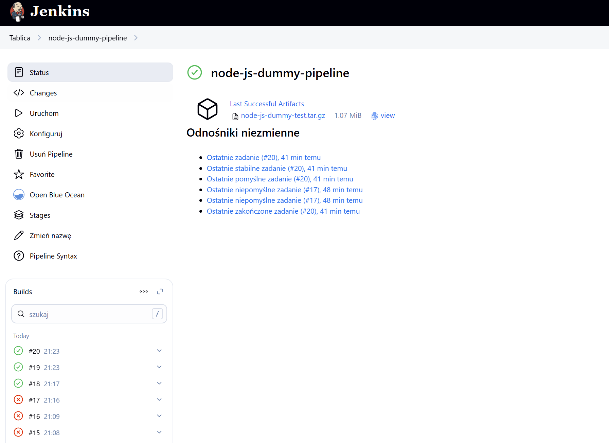
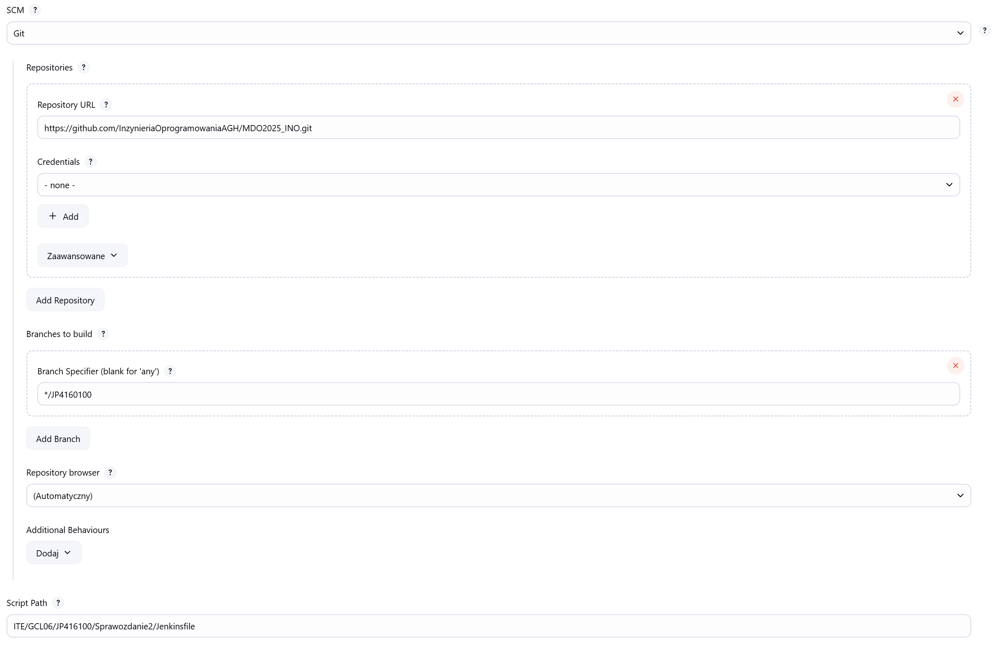

# Sprawozdanie nr 2
Julia Piśniakowska <br>
System operacyjny: Fedora <br>
Wizualizacja: Hyper-V <br>
Projekt: Node-js-dummy <br>

## Jenkins 🌵:<br>

Jenkins Blue Ocean to udoskonalona wersja interfejsu użytkownika platformy Jenkins, stworzona z myślą o poprawie doświadczenia użytkownika. Charakteryzuje się intuicyjnym interfejsem graficznym, który znacząco ułatwia wizualizację i analizę procesów ciągłej integracji i dostarczania (CI/CD). Blue Ocean wyposażono w zestaw preinstalowanych wtyczek zoptymalizowanych specjalnie pod kątem współpracy z tym interfejsem, co zwiększa jego funkcjonalność i efektywność.
### Utworzenie sieci dla Jenkinsa:
` docker network create jenkins `
### Dockerfile dla własnego obrazu zawierającego Blue Ocean:
``` 
FROM jenkins/jenkins:2.440.3-jdk17
USER root
RUN apt-get update && apt-get install -y lsb-release
RUN curl -fsSLo /usr/share/keyrings/docker-archive-keyring.asc \
  https://download.docker.com/linux/debian/gpg
RUN echo "deb [arch=$(dpkg --print-architecture) \
  signed-by=/usr/share/keyrings/docker-archive-keyring.asc] \
  https://download.docker.com/linux/debian \
  $(lsb_release -cs) stable" > /etc/apt/sources.list.d/docker.list
RUN apt-get update && apt-get install -y docker-ce-cli
USER jenkins
RUN jenkins-plugin-cli --plugins "blueocean docker-workflow" 

```
### Zbudowanie obrazu:
` docker build -t blueocean -f Blueocean.Dockerfile . `

W celu przeprowadzenia konfiguracji Jenkinsa (http://localhost:8080) wpisałam hasło i pobrałam potrzebne rozszerzenia.


## Projekty: 🌵🌵
* Konfiguracja wstępna i pierwsze uruchomienie

  * 1. Utwórz projekt, który wyświetla uname

    Dodaje nowy projekt. Następnie wybieram typ projektu - *Projket Ogólny*.<br>
    W sekcji *Kroki Budowania* wybieram - *Uruchom powłokę*, gdzie wprowadzam swój skrypt.<br>
    ` uname -a`<br>

Sukces. Skryt działa poprawnie.<br>

 * 2. Utwórz projekt, który zwraca błąd, gdy godzina jest nieparzysta
    Ponownie tworzę nowy projekt. Wybieram *Projekt Ogólny*. W sekcji *Kroki Budowania* tworzę skrypt, który będzie zwracał błąd w przypadku godziny nieparzystej.<br>
` sratatat `<br>

Błąd. Skryt działa poprawnie, bo godzina była nieparzysta.

* 3. Pobieranie w projekcie obraz kontenera ubuntu (stosując docker pull), użyłam latest, żeby pobrać najnowsza wersje.


Sukces. Skryt działa poprawnie.<br>

## Jenkins - pierwszy obiekt typu pipeline 🌵🌵🌵

Pipeline składa się z :
* Checkout – klonuje repozytorium Git z konkretnej gałęzi JP416100.
* Build – przechodzi do katalogu ITE/GCL06/JP416100/Sprawozdanie1 i buduje obraz Dockera o nazwie budowaa, korzystając z pliku Dockerfile.build.

```
pipeline {
    agent any

    stages {
        stage('Checkout') {
            steps {
                git branch: 'JP416100', url: 'https://github.com/InzynieriaOprogramowaniaAGH/MDO2025_INO.git'
            }
        }
        stage('Build') {
            steps {
                dir('ITE/GCL06/JP416100/Sprawozdanie1') {
                    script {
                        docker.build('budowaa', '-f Dockerfile.build .')
                    }
                }
            }
        }
    }
}
```

Sukces.

## Node-js-Dummy 🐊💣
`▶︎ •၊၊||၊|။||||။‌‌‌‌‌၊|• 0:10`

# Cel projektu
Celem projektu było zaprojektowanie i uruchomienie kompletnego procesu CI/CD w Jenkinsie dla aplikacji Node.js (node-js-dummy-test, wybranym na laboratorium nr 3) z wykorzystaniem kontenerów Docker. Pipeline realizuje wszystkie kluczowe etapy typowego cyklu integracji i wdrażania oprogramowania:<br>
Aby pipeline działał poprawnie, środowisko musi spełniać następujące warunki:<br>
## Diagram aktywności procesu CI<br>
<br>

Zainstalowany Docker z obsługą Docker-in-Docker (DinD)
* Uruchomiony kontener: jenkins/jenkins:lts, odpowiednio skonfigurowany do pracy z Dockerem
* Uruchomiony kontener: docker:dind
* Jenkins z zainstalowanym pluginem Pipeline
* Dostęp do repozytorium GitHub MDO2025_INO zawierającego:<br>
 -plik Jenkinsfile<br>
 -plik Dockerfile<br>
 -kod źródłowy aplikacji

 ## Diagram wdrożeniowy

 <br><br>

 Zaimplementowałam obiekt typu pipeline, który klonuje repozytorium, buduje i testuje obrazy Dockera dla aplikacji Node.js, wdraża aplikację w kontenerze, sprawdza jej działanie przez sieć Docker, publikuje artefakt w postaci archiwum .tgz, a na końcu automatycznie czyści środowisko z uruchomionych kontenerów i sieci.
<br>
Kod pipeline dla mojego projektu:
 ```
 pipeline {
    agent any

    environment {
        IMAGE_NAME = "node-js-dummy"
        TAG = "v1.0"
        PATH_PREFIX = "MDO2025_INO/ITE/GCL06/JP416100/Sprawozdanie2"
    }

    stages {
        stage('Clone') {
            steps {
                sh 'rm -rf MDO2025_INO'
                sh 'git clone -b JP416100 --single-branch https://github.com/InzynieriaOprogramowaniaAGH/MDO2025_INO.git'
            }
        }

        stage('Build') {
            steps {
                echo 'Budowanie obrazu aplikacji'
                sh 'docker build -t ${IMAGE_NAME}:build -f ${PATH_PREFIX}/Dockerfile.build.node ${PATH_PREFIX}'
            }
        }

        stage('Test') {
            steps {
                echo 'Uruchamianie testów'
                sh 'docker build -t ${IMAGE_NAME}:test -f ${PATH_PREFIX}/Dockerfile.test.node ${PATH_PREFIX}'
                sh 'docker run --rm ${IMAGE_NAME}:test npm test'
            }
        }

        stage('Build Deploy Image') {
            steps {
                echo 'Budowanie obrazu (deploy)'
                sh 'docker build -t ${IMAGE_NAME}:deploy -f ${PATH_PREFIX}/Dockerfile.deploy.node ${PATH_PREFIX}'
            }
        }

        stage('Deploy') {
            steps {
                echo 'Tworzenie sieci deploy i uruchamianie kontenera'
                sh 'docker network create ci || true'
                sh 'docker run -d --rm --network ci --name deploy -p 3000:3000 ${IMAGE_NAME}:deploy'
            }
        }

        stage('Test Deploy') {
            steps {
                echo 'Sprawdzenie czy aplikacja działa na porcie 3000'
                sh '''
                sleep 5
                docker run --rm --network ci curlimages/curl curl -s deploy:3000 || echo "curl failed"
                '''
            }
        }

        stage('Publish') {
            steps {
                echo 'Tworzenie artefaktu ZIP'
                sh '''
                cd ${PATH_PREFIX}/node-js-dummy-test
               tar -czf ../../../node-js-dummy-test.tar.gz .
                '''
                archiveArtifacts artifacts: 'MDO2025_INO/ITE/GCL06/node-js-dummy-test.tar.gz', fingerprint: true
            }
        }

        stage('Images') {
            steps {
                sh 'docker images'
            }
        }
    }

    post {
        always {
            echo 'Czyszczenie kontenera i sieci'
            sh 'docker stop deploy || true'
            sh 'docker network rm ci || true'
        }
    }
}

```

po wielu próbach sie udało. (yippie)
Pipeline był uruchamiany wielokrotnie, a każde wykonanie przechodziło poprawnie. Zapewnia to, że proces CI/CD jest powtarzalny, odporny na błędy środowiskowe i nie polega na żadnych danych cache’owanych z poprzednich wykonań.


Przekazanie Jenkinsfile do Jenkinsa:
Plik Jenkinsa po umieszczeniu na repo może zostać wskazany w konfiguracji pipelinu jako śródło skryptu i zaciągany za każdym razem gdy uruchamiany jest pipeline. Postanowiłem pracowac na prywatnym repo ze względu na iość napotkanych trudności a nie chciłem pisać aliasów tylko po to by co minutę pushowac plik z pojedynczą zmianą w kodzie.
