# Sprawozdanie nr 3
Julia Piśniakowska <br>
System operacyjny: Fedora <br>
Wizualizacja: Hyper-V <br>

## Ansible

### Instalacja zarządcy Ansible

Na potrzeby realizacji zadania przygotowano dwie maszyny wirtualne oparte na systemie Fedora Server w tej samej wersji.

* Maszyna **zarządzająca**: `julia@fedora`
* Maszyna **zarządzana**: `ansible@fedora`

Na maszynie `ansible-target` podczas instalacji:

* utworzono użytkownika `ansible`
* zainstalowano niezbędne pakiety: `openssh-server` oraz `tar`

```bash
sudo dnf install -y openssh-server tar
```

```bash
sudo systemctl start sshd
sudo systemctl enable sshd
```
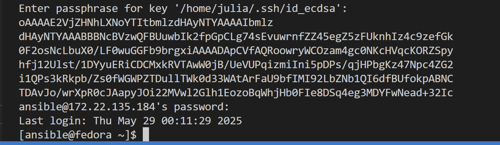

Na maszynie `julia@fedora` zainstalowano Ansible z repozytorium:

```bash
sudo dnf install ansible -y
```
Następnie przeprowadzono wymianę kluczy SSH pomiędzy użytkownikiem `julia` a użytkownikiem `ansible`:

```bash
ssh-copy-id -i ~/.ssh/id_ed25519.pub ansible@172.22.135.184
```
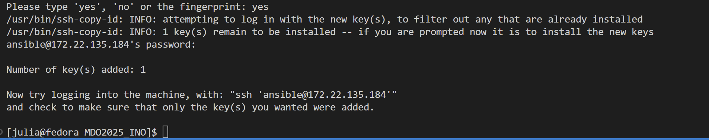<br>
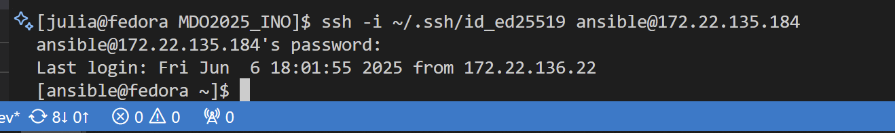
Dzięki temu możliwe było wykonywanie poleceń SSH bez konieczności podawania passphrase dla klucza za każdym razem.
---
### Inwentaryzacja
Dokonano następującej inwentaryzacji systemów
Po ustawieniu przewidywalnych nazw maszyn wirtualnych 'ansible-controller' oraz 'ansible-target' używając 'hostnamectl', wprowadzono nazwy DNS maszyn stosując 'etc/hosts' na obu maszynach.
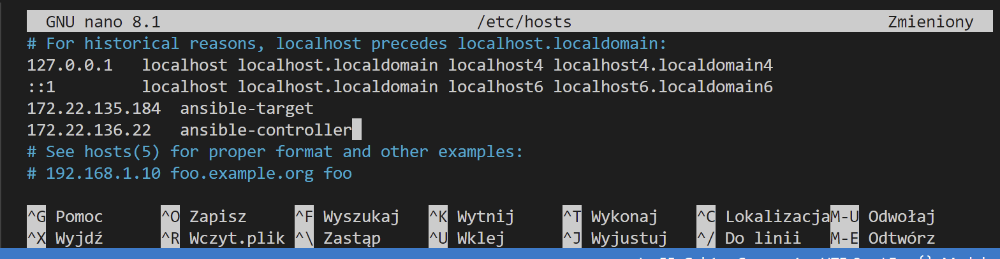

Działanie to umożliwia wywoływanie komputerów za pomocą nazw, a nie tylko wykorzystywaniu adresów IP. Zrobiłam testowy 'ping' co znaczy, że działa yuppie.
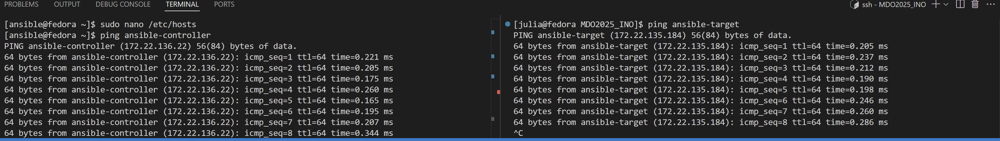<br>

Stworzyłam plik inwentaryzacji 'inventory.ini'<br>

```sh
[Orchestrators]
ansible-controller ansible_user=julia

[Endpoints]
ansible-target ansible_user=ansible
```
Żeby sprawdzić czy działa robie "ping" do wszystkich maszyn. <br>
``ansible -i inventory.ini all -m ping``
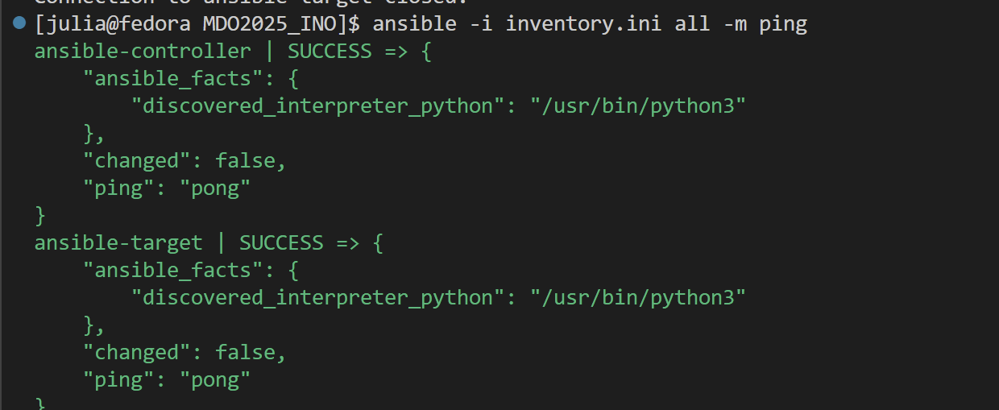<br>
Działa elegancko. <br>

### Zdalne wywołanie procedur
#### Utworzono pierwszy 'playbook.yaml'
```sh
- name: Konfiguracja hostów
  hosts: all
  become: true
  tasks:

    - name: Sprawdzenie dostępności hostów (ping)
      ansible.builtin.ping:

    - name: Kopiowanie pliku inventory.ini (tylko na ansible-target)
      ansible.builtin.copy:
        src: ./inventory.ini
        dest: /tmp/inventory.ini
        owner: ansible
        group: ansible
        mode: '0644'
      when: inventory_hostname == 'ansible-target'

    - name: Aktualizacja wszystkich pakietów
      ansible.builtin.dnf:
        name: '*'
        state: latest
        update_cache: yes

    - name: Restart usług: sshd i rngd
      ansible.builtin.systemd:
        name: "{{ item }}"
        state: restarted
        enabled: true
      loop:
        - sshd
        - rngd

```

Playbook wysyła kolejno żądanie 'ping' do wszystkich maszyn, kopiuje plik inwentaryzacji na maszynę 'ansible-target', aktualizuje pakiety w systemie oraz restartuje usługi sshd oraz rngd. Pierw zainstalowano narzędzie 'rngd'.

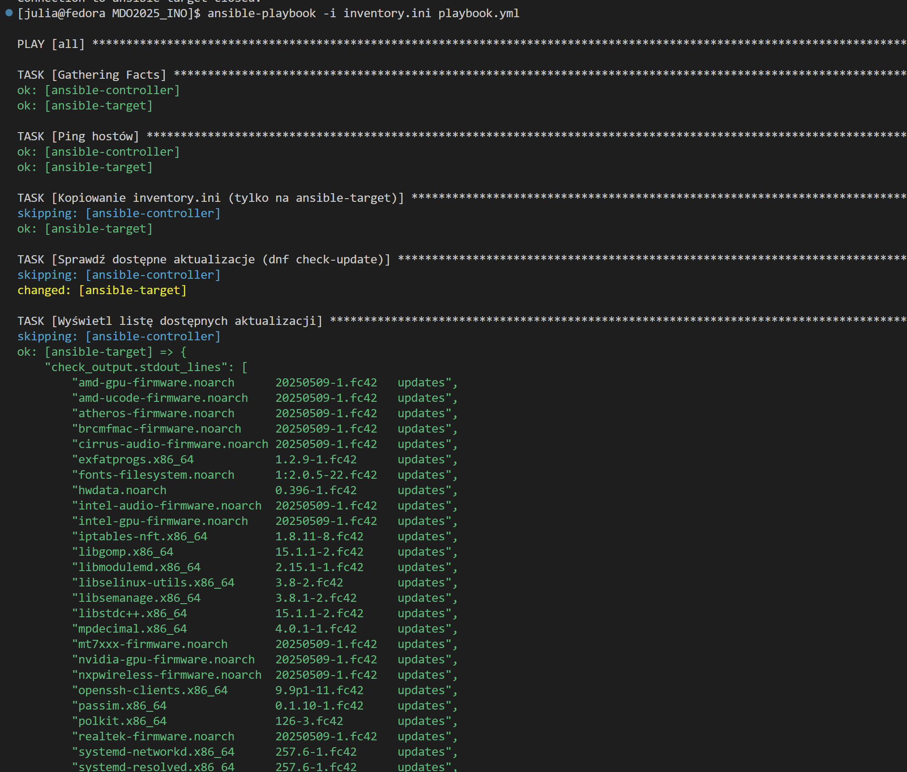
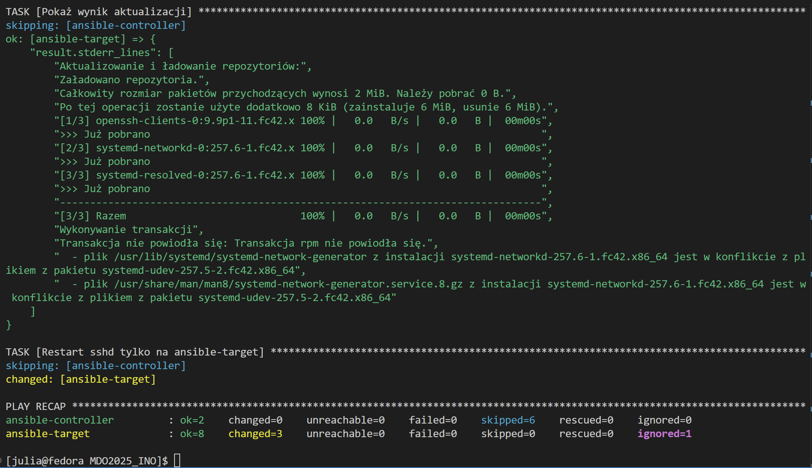
Uruchomienie drugi raz (niektóre kroki zamiast changed mają po prostu ok bo zostały już wcześniej wykonane i nie wymagały zmian):
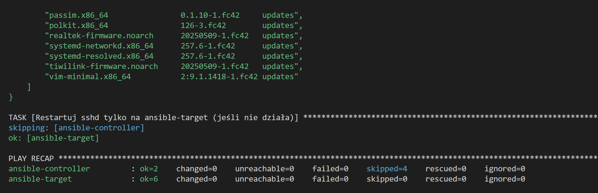
Trzecie uruchomienie (z uprzednio wyłączonym serwerem SSH na maszynie 'ansible-target'):
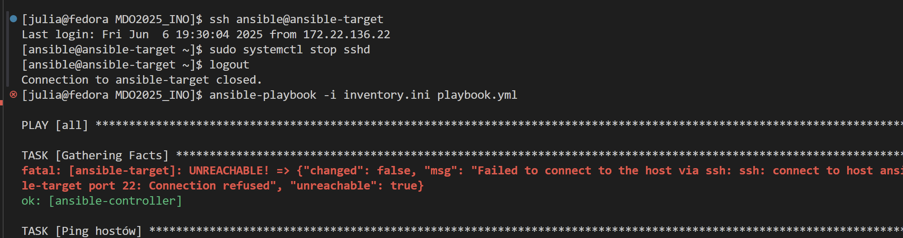
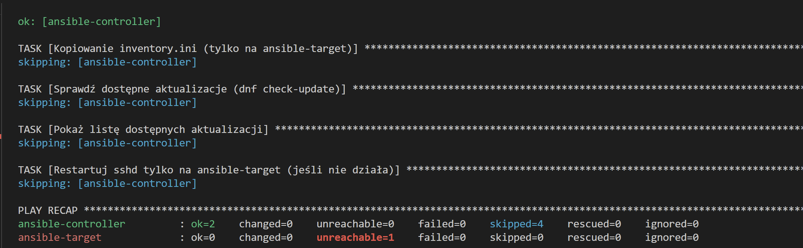

## Proces zarządzania artefaktem

Struktura roli `ansible-galaxy init supertux_in_docker`
Uzupełniając pliki: <br>
```yml
#vars/main.yml
---
docker_image: httpd
container_name: myapp
container_port: 80
published_port: 80
```
```yml
#tasks/main.yml
---
- name: Zainstaluj wymagane pakiety
  dnf:
    name:
      - dnf-plugins-core
      - yum-utils
      - device-mapper-persistent-data
      - lvm2
    state: present

- name: Dodaj repozytorium Dockera
  get_url:
    url: https://download.docker.com/linux/fedora/docker-ce.repo
    dest: /etc/yum.repos.d/docker-ce.repo

- name: Zainstaluj Dockera
  dnf:
    name:
      - docker-ce
      - docker-ce-cli
      - containerd.io
    state: latest

- name: Włącz i uruchom usługę Docker
  systemd:
    name: docker
    enabled: yes
    state: started

- name: Zainstaluj zależności Pythona dla Dockera
  package:
    name:
      - python3-pip
    state: present

- name: Zainstaluj systemową wersję python3-packaging
  package:
    name: python3-packaging
    state: present

- name: Zainstaluj moduł Python 'docker', 'requests'
  pip:
    name:
      - docker
      - requests
    executable: pip3

- name: Pobierz obraz z Docker Hub
  community.docker.docker_image:
    name: "{{ docker_image }}"
    source: pull

- name: Uruchom kontener z aplikacją
  community.docker.docker_container:
    name: "{{ container_name }}"
    image: "{{ docker_image }}"
    state: started
    restart_policy: always
    published_ports:
      - "{{ published_port }}:{{ container_port }}"

- name: Poczekaj aż aplikacja zacznie odpowiadać
  uri:
    url: "http://localhost:{{ published_port }}/"
    status_code: 200
    timeout: 20
  register: result
  retries: 5
  delay: 3
  until: result.status == 200

- name: Zatrzymaj kontener
  community.docker.docker_container:
    name: "{{ container_name }}"
    state: stopped

- name: Usuń kontener
  community.docker.docker_container:
    name: "{{ container_name }}"
    state: absent
```
### Po zmianie playbooka i uruchomieniu otrzymujemy taki sam output jak przy samym playbooku
```yml
---
- name: Instalacja Dockera i uruchomienie aplikacji z Docker Hub
  hosts: Endpoints
  become: true

  roles:
    - deploy_docker_app
```
```ansible-playbook -i inventory.ini deploy_app_docker.yml```

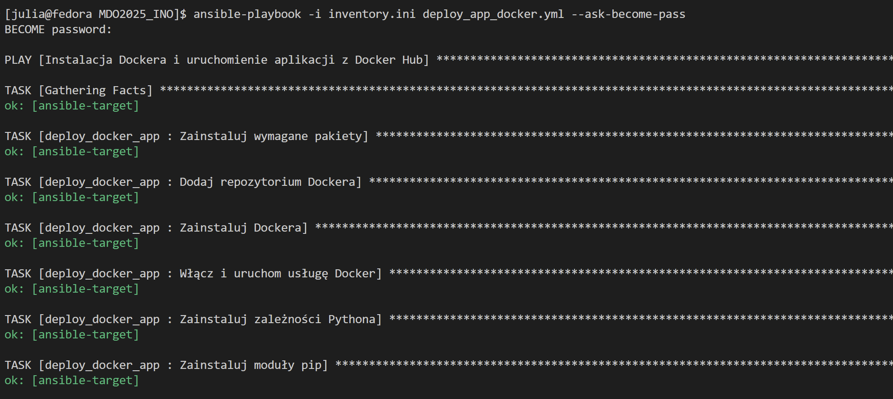
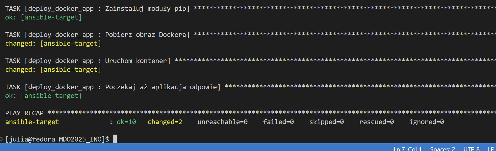

## Kickstart
Instalacja systemu Fedora i przygotowanie pliku <br>
ISO z linku:
https://ftp.icm.edu.pl/pub/Linux/fedora/linux/releases/42/Everything/x86_64/iso/<br>
Zainstalowałam system i następnie pobrałam został automatycznie wygenerowany plik odpowiedzi Kickstart (/root/anaconda-ks.cfg) w celu jego dalszej modyfikacji.
Podstawowy plik anaconda-ks.cfg przed modyfikacjami:<br>
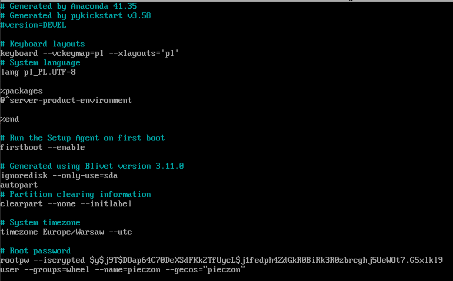

Na podstawie oryginalnego pliku przygotowano własną wersję z następującymi ustawieniami:

* Użyto repozytoriów Fedory 42 (głównego i aktualizacji)
* Ustawiono język, klawiaturę i strefę czasową na polskie (pl_PL, Europe/Warsaw)
* Nadano nazwę hosta fedora-final, włączono DHCP
* Włączono automatyczne partycjonowanie dysku (LVM) i instalację bootloadera
* Utworzono użytkownika julia (grupa wheel) z pustym hasłem, root ma jawne hasło
* Zainstalowano pakiety: @core, docker, wget
* Włączono usługę docker oraz dodano własną usługę pipeline.service, uruchamiającą kontener hello-world
* Po instalacji system uruchamia się ponownie automatycznie

Plik ISO do instalacji z Kickstartem generowałam za pomocą WSL komendą `genisoimage -output ks.iso -volid KS -joliet -rock ks_autofinal.cfg`<br>

```
#version=DEVEL
url --mirrorlist=http://mirrors.fedoraproject.org/mirrorlist?repo=fedora-42&arch=x86_64
repo --name=updates --mirrorlist=http://mirrors.fedoraproject.org/mirrorlist?repo=updates-released-f42&arch=x86_64

ignoredisk --only-use=sda
clearpart --all --initlabel
autopart --type=lvm

keyboard --vckeymap=pl --xlayouts='pl'
lang pl_PL.UTF-8
timezone Europe/Warsaw --utc
network --bootproto=dhcp --hostname=fedora-final
text
skipx
bootloader --location=mbr --timeout=1

zerombr
autopart --type=lvm

rootpw --plaintext japierdole123
user --name=julia --groups=wheel --plaintext --password=""

firstboot --disable

%packages
@core
docker
wget
%end

%post
systemctl enable docker

cat << 'EOF' > /etc/systemd/system/pipeline.service
[Unit]
Description=Pipeline App
After=network.target docker.service
Requires=docker.service

[Service]
ExecStart=/usr/bin/docker run --rm hello-world
Restart=always

[Install]
WantedBy=multi-user.target
EOF

systemctl enable pipeline.service
%end

reboot

```
Pomimo że miałam w kickstarcie ignoredisk --only-use=sda, żeby ignorował wszystkie inne dyski oprócz sda, clearpart --all --initlabel, żeby usuwał wszystkie istniejące partycje z dysku (tego, który nie został zignorowany) i autopart --type=lvm, żeby automatyczne tworzenie partycji z użyciem LVM (Logical Volume Manager). To wyskakiwał taki błąd i niestety na zajęciach nie spytałam o pomoc, a chat nie potrafił tego naprawić. Poprawność obrazu i dysków na IDE 0:0 i IDE 0:1 i no cóż to pewnie wina Fedory 42 (tak, wiem że nie). ale walczyłam...
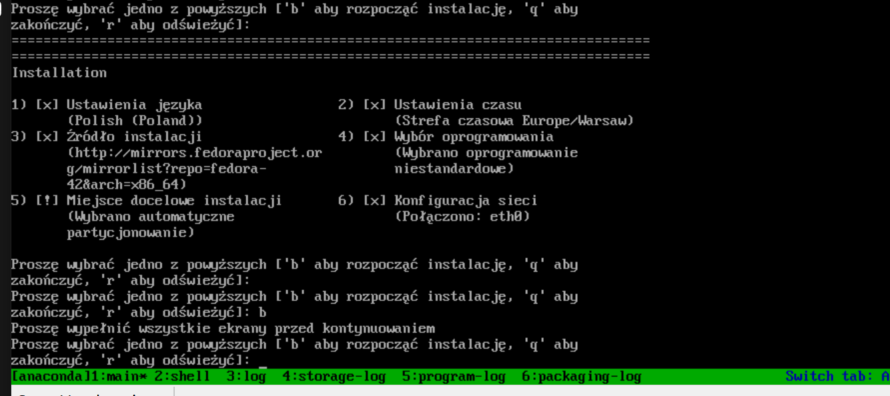
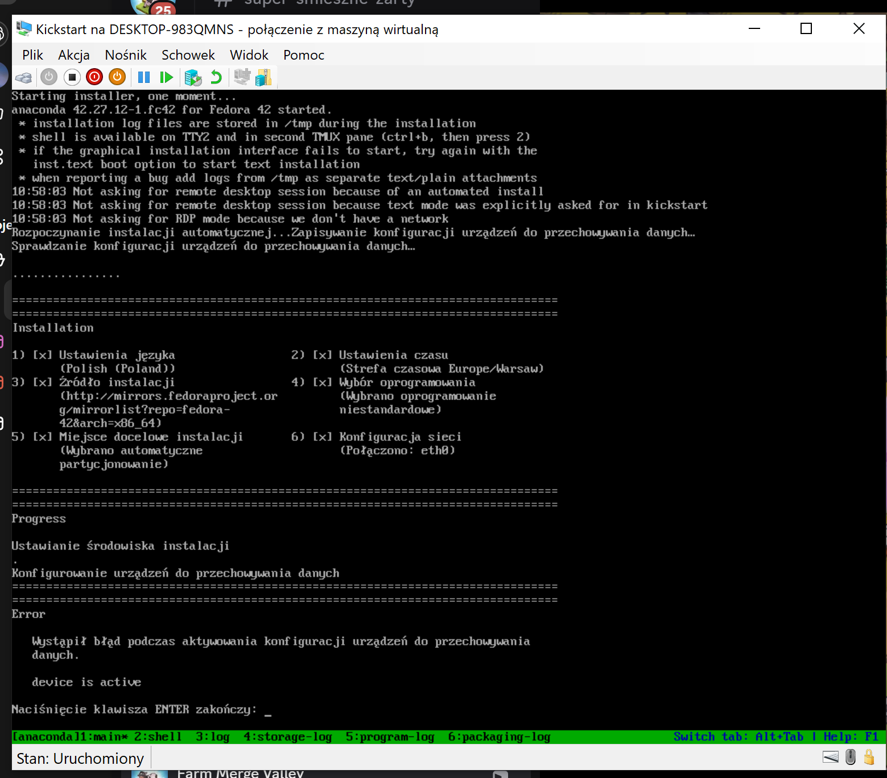
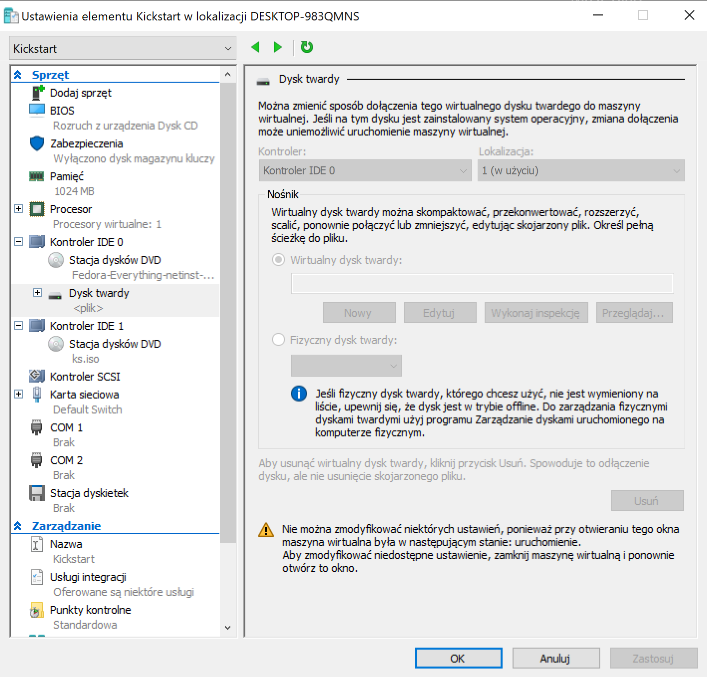
Żeby odpalić Kickstarta w GRUB wpisujemy `inst.ks=hd:LABEL=KS:/ks_autofinal.cfg`<br>
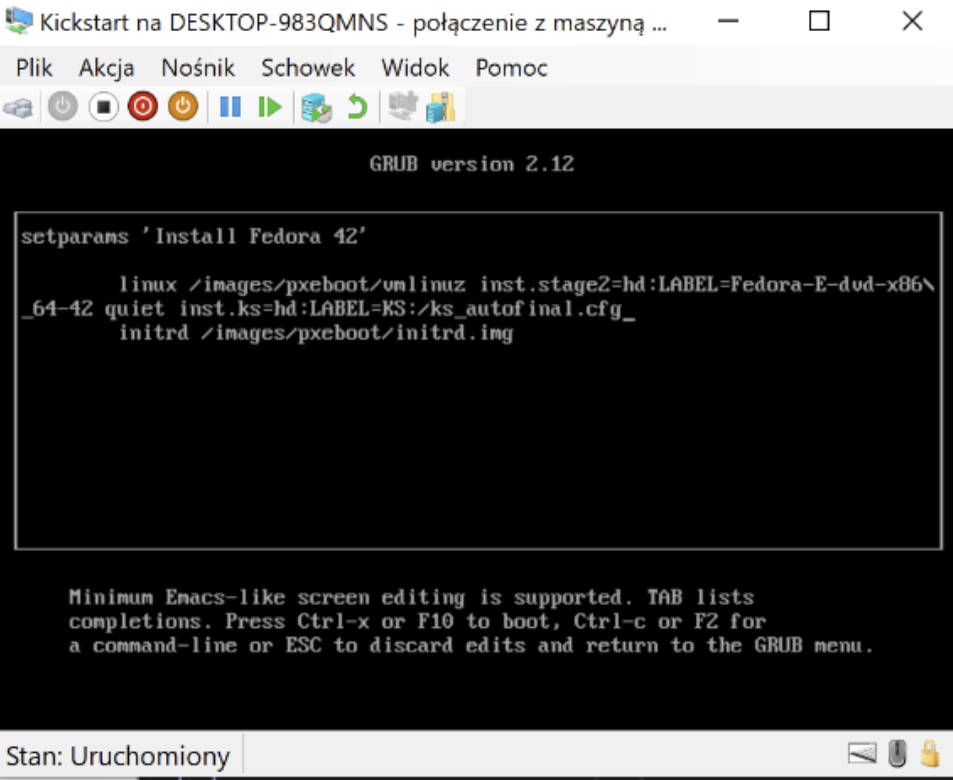

## Kubernetis lab 10 i 11

### Instalacja klastra Kubernetes

Pierwszym krokiem laboratorium jest instalacja `minikube` przy pomocy dokumentacji [minikube](kubernetes/ss/https://minikube.sigs.k8s.io/docs/start/).

Instalacja odbyła się u mnie przy pomocy komend:
```bash
curl -LO https://github.com/kubernetes/minikube/releases/latest/download/minikube-linux-amd64
sudo install minikube-linux-amd64 /usr/local/bin/minikube && rm minikube-linux-amd64
```

Oraz (pozyskanie narzędzia kubectl):
```bash
sudo dnf install -y kubectl
``` 

Wymagania minikube:

1. Minimum 2 CPU
2. Minimum 2GB pamięci
3. Minimum 20GB wolnego miejsca na dysku
4. Połączenie z internetem
5. Narzędzie obsługi kontenerów lub VM, typu Docker, Podman, Hyper-V

Sama instalacja minikube'a jest bezpieczna ponieważ:
- Minikube domyślnie działa w izolowanym środowisku, co ogranicza wpływ na system hosta
- API Kubernetes jest domyślnie dostępne tylko lokalnie
- Minikube i Kubernetes są regularnie aktualizowane


Następnie uruchamiamy minikube'a przy pomocy:
```bash
minikube start
```
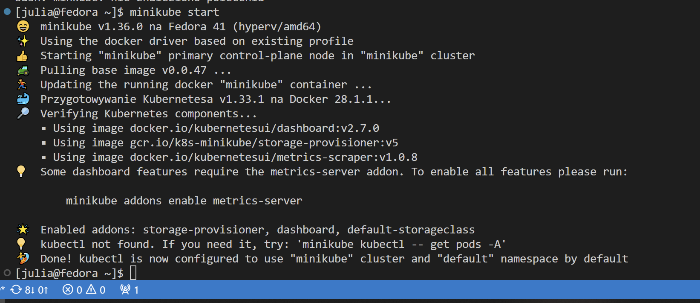

Oraz uruchamiamy dashboard komendą:
```bash
minikube dashboard
```
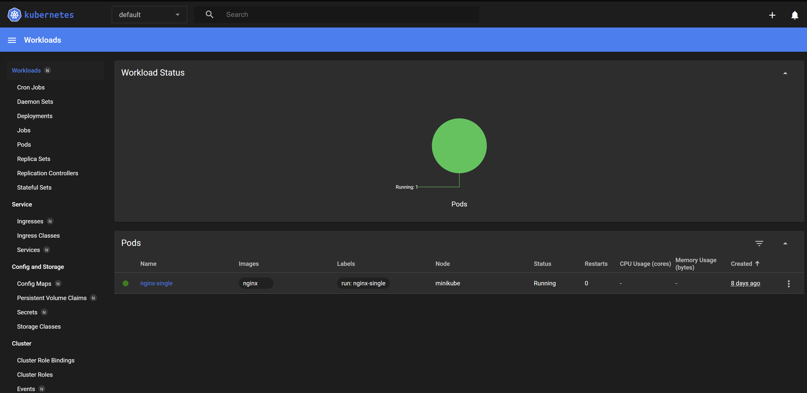


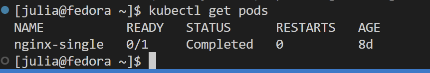
Przekierowanie na port 8888 `kubectl port-forward pod/nginx-single 8888:80`


## Skrypt ze https://kubernetes.io/docs/concepts/workloads/controllers/deployment/ <br>
 Deployment z 3 replikami korzystający z tego samego obrazu 


```yaml
apiVersion: apps/v1
kind: Deployment
metadata:
  name: nginx-deployment
  labels:
    app: nginx
spec:
  replicas: 3
  selector:
    matchLabels:
      app: nginx
  template:
    metadata:
      labels:
        app: nginx
    spec:
      containers:
      - name: nginx
        image: nginx:latest
        ports:
        - containerPort: 80
```
### Poleceniem `kubectl apply -f nginx-deploymen.yaml`

Screeny z dashboarda po zwiekszeniu replik do 4

Zmiany w deploymencie
Najpierw uruchamiamy deployment z zeszłego laboratorium z pliku yaml.

'minikube kubectl -- apply -f nginx-deployment.yaml'<br>

Repliki ustawiamy na szablon:
```
spec:
  template:
    spec:
      containers:
      - image: nginx-custom:1.0
```

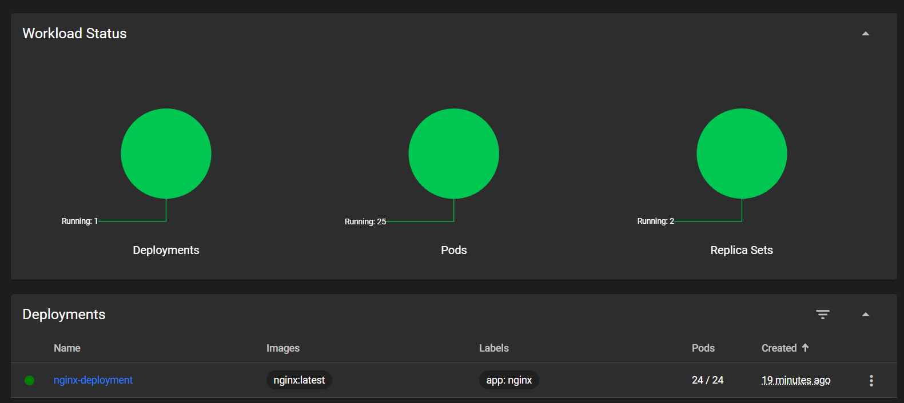
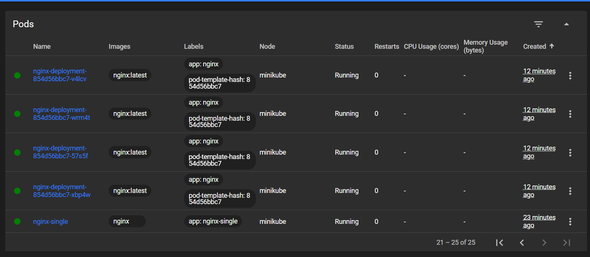

Zwiększenie replik z 1 do 8<br>
<br>
Z 1 na 0<br>
<br>
Z 1 na 16<br>
<br>

Przywracanie i sprawdzanie historii rollout'ów wykonywałem poprzez:

`minikube kubectl -- rollout history deployment nginx-deployment`<br>
`minikube kubectl -- rollout undo deployment nginx-deployment`<br>

Skrypt weryfikujący wdrożenie:<br>

```
#!/bin/bash

if [ -z "$1" ]; then
  echo "❗ Usage: $0 <deployment-name> [namespace]"
  exit 1
fi

DEPLOYMENT_NAME="$1"
NAMESPACE="${2:-default}" 
TIMEOUT=60

echo "Checking rollout for deployment: '$DEPLOYMENT_NAME' in namespace '$NAMESPACE'..."

if kubectl rollout status deployment "$DEPLOYMENT_NAME" -n "$NAMESPACE" --timeout=${TIMEOUT}s; then
    echo "✅ Rollout success in $TIMEOUT seconds."
    exit 0
else
    echo "❌ Rollout unsuccessfull in $TIMEOUT seconds."
    kubectl describe deployment "$DEPLOYMENT_NAME" -n "$NAMESPACE"
    exit 1
fi
```

Strategie wdrożenia pozwalają na zdecydowanie w jaki sposób pody będą uaktualniane<br>
Recreate zastępuje stare pody nowymi
```
strategy:
  type: Recreate
```

```
spec:
  replicas: 3
  strategy:
    type: RollingUpdate
    rollingUpdate:
      maxUnavailable: 1
      maxSurge: 1
```
Co to robi:
* replicas: 3 — mamy 3 instancje aplikacji.
* maxUnavailable: 1 — podczas aktualizacji może być niedostępny maks. 1 pod.
* maxSurge: 1 — maks. 1 nowy pod może być dodany ponad istniejące 3.