# Sprawozdanie 1

---

# **Zajęcia 1 - Wprowadzenie, Git, Gałęzie, SSH** 

---

## 1. **Zainstalowanie Gita oraz obsługi kluczy SSH**

Weryfikacja poprawnej instalacji Git.

```bash
git --version
```

Jeśli nie mamy zainstalowanego gita, to trzeba wykonać takie polecenia:

```bash
sudo apt update
sudo apt install git
```


Instalacja i sprawdzenie działania klienta SSH.

```bash
sudo apt install openssh-client -y
ssh -v
```

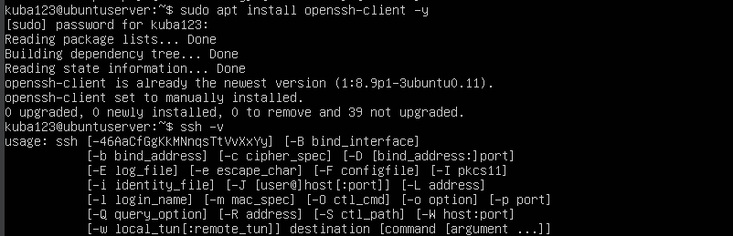

## 2. **Sklonowanie repozytorium przedmiotowego za pomocą HTTPS i personal access token**

Jeżeli połączenie SSH działa to możemy sklonować repozytorium oraz zweryfikować połączenie zdalne i zaktualizować gałęzi main.

```bash
git clone https://github.com/InzynieriaOprogramowaniaAGH/MDO2025_INO.git
git remote -v
git pull origin main
```

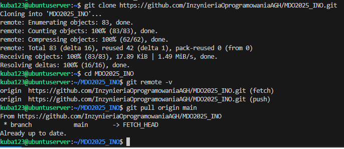

Utworzenie personal access token do uwierzytelniania przez HTTPS.

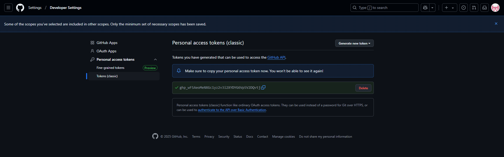

## 3. **Utworzenie dwóch kluczy SSH, w tym co najmniej jeden zabezpieczony hasłem**

Wygenerowanie dwóch kluczy SSH o długości 521 bitów, zabezpieczyłem obydwa hasłem: ED25519 oraz ECDSA, wraz z uruchomieniem agenta SSH.

```bash
ssh-keygen -t ed25519 -b 521 -C "Jakub559@onet.pl"
ssh-keygen -t ecdsa -b 521 -C "Jakub559@onet.pl"
eval "$(ssh-agent -s)"
```

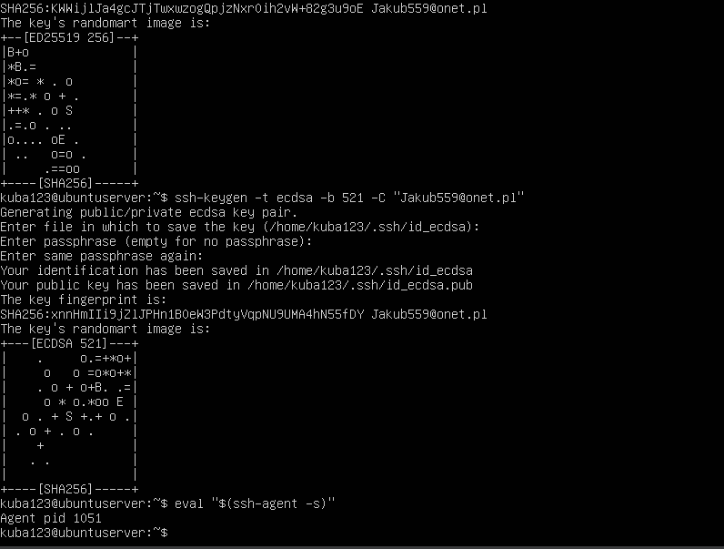

## 4. **Skonfigurowanie klucza SSH jako metodę dostępu do GitHuba oraz sklonowanie repozytorium z wykorzystaniem protokołu SSH**

Dodanie kluczy ED25519 i ECDSA do agenta SSH za pomocą ssh-add.

```bash
ssh-add ~/.ssh/id_ed25519
ssh-add ~/.ssh/id_ecdsa
```

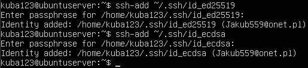

Weryfikacja poprawnego połączenia SSH z GitHub oraz klonowanie repozytorium za pomocą protokołu SSH.

```bash
ssh -T git@github.com
git clone git@github.com:InżynieriaOprogramowaniaAGH/MDO2025_INO.git
```

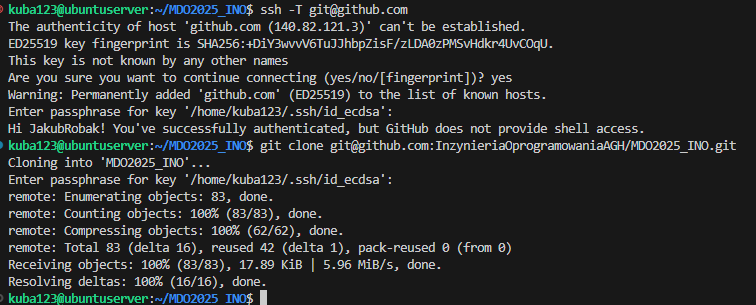

## 5. **Pokazanie kluczy na githubie**

Pokazanie jak to wygląda na githubie

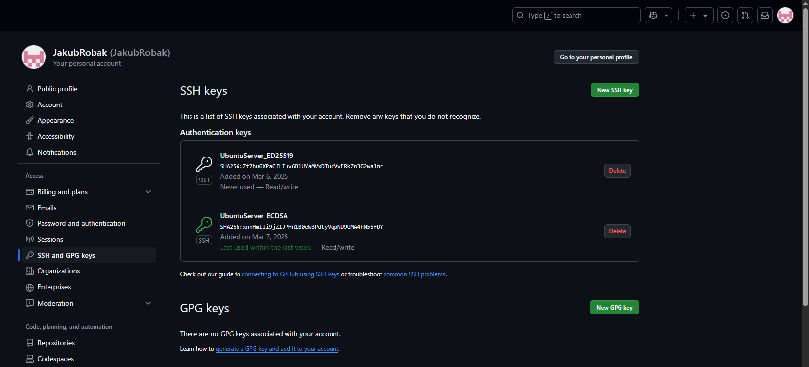

## 6. **Skonfigurowanie 2FA**

Włączenie dwuskładnikowego uwierzytelniania (2FA) na koncie GitHub z wykorzystaniem aplikacji Authenticator

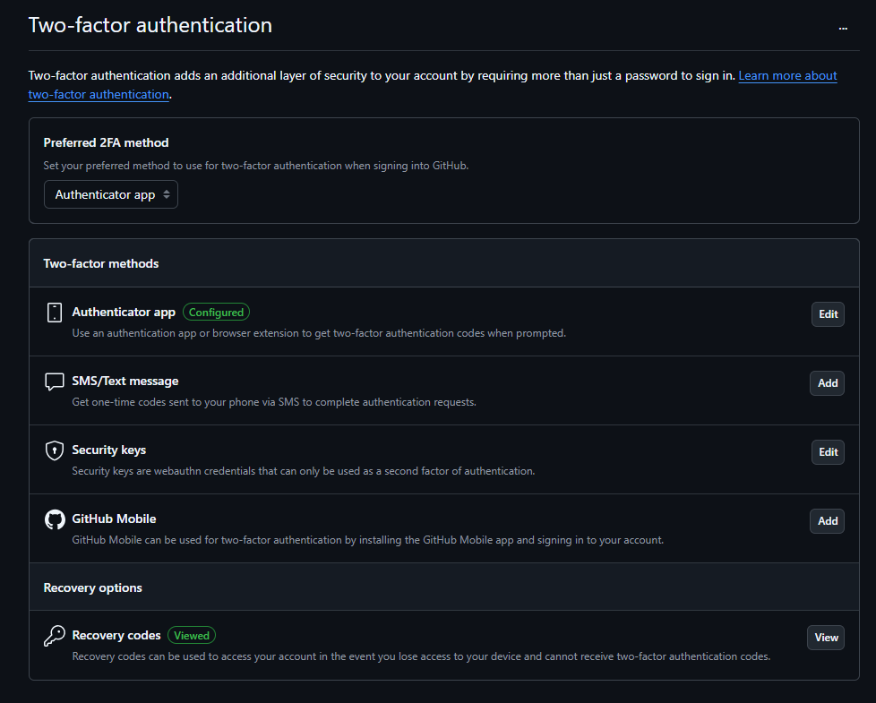

## 7. **Utworzenie gałęci o nazwie "inicjały & nr indeksu"**

Utworzyłem gałąź JR414539 oraz wypchnąłem ją na GitHub. Niestety wtedy jeszcze nie miałem dostępu do repozytorium z poziomu uczestnika, więc wykorzystałem forka.

```bash
git checkout GCL06
git checkout -b JR414539
git push origin JR414539
```

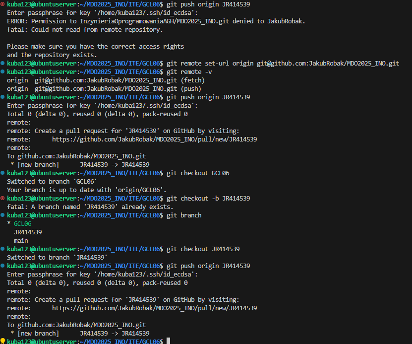

## 8. **Napisanie Git hooka - skrypt weryfikujący czy każdy mój "commit message" zaczyna się od moich inicjałów i numeru indeksu(JR414539)**

Stworzenie katalogu, napisanie skryptu oraz nadanie uprawnień.

```bash
mkdir ~/MDO2025_INO/ITE/GCL06/JR414539
nano commit-msg
chmod +x commit-msg
```

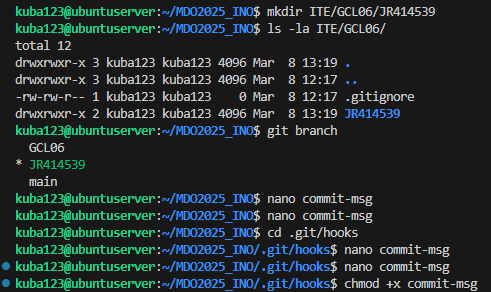

Sprawdzenie czy stworzony skrypt działa.

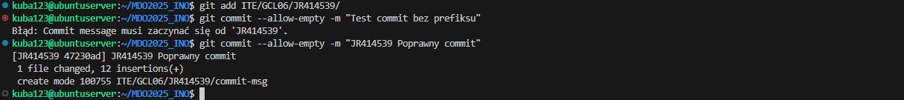

Kod skryptu:

```bash
#!/bin/bash

commit_msg=$(cat "$1")

prefix="JR414539"

if [[ "$commit_msg" != "$prefix"* ]]; then
    echo "Błąd: Commit message musi zaczynać się od '$prefix'."
    exit 1
fi

exit 0
```

# **Zajęcia 2 - Git, Docker**

---

## 1. **Zainstalowanie Dockera w systemie linuksowym oraz zalogowanie się**

Dodanie oficjalnego repozytorium Docker do systemu Ubuntu przy użyciu GPG i curl.

```bash
sudo apt install -y ca-certificates curl gnupg
sudo install -m 0755 -d /etc/apt/keyrings
curl -fsSL https://download.docker.com/linux/ubuntu/gpg | sudo tee /etc/apt/keyrings/docker.asc > /dev/null
sudo chmod a+r /etc/apt/keyrings/docker.asc
```
Polecenie: sudo install -m 0755 -d /etc/apt/keyrings ustawia prawa dostępu, żeby właściciel miał większe prawa niż grupa. Własciciel może zpaisywać, odczytywać, modyfikować, a grupa, inni użytkownicy mogą tylko odczytywać i wykonywać. /etc/apt/keyrings — to katalog, w którym są przechowywane klucze GPG repozytoriów.

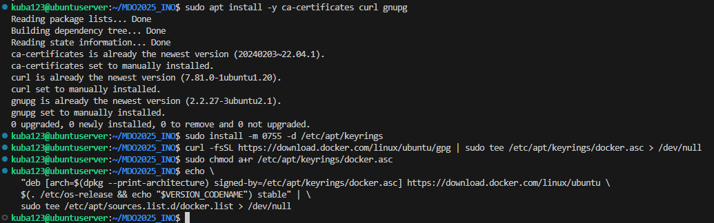

Zakończenie instalacji Dockera, sprawdzenie wersji, uruchomienie usługi i dodanie użytkownika do grupy docker.

```bash
docker --version
sudo systemctl enable --now docker
sudo usermod -aG docker $USER
```

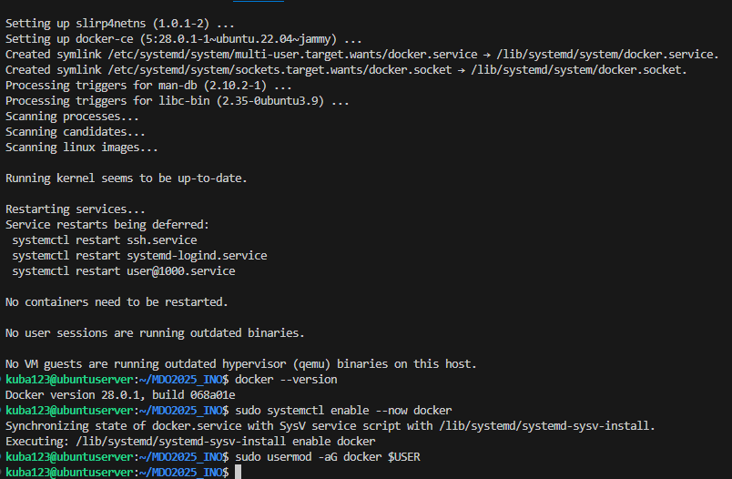

Weryfikacja działania Dockera poprzez uruchomienie kontenera hello-world oraz logowanie do konta Docker Hub.

```bash
docker run hello-world
docker login
```

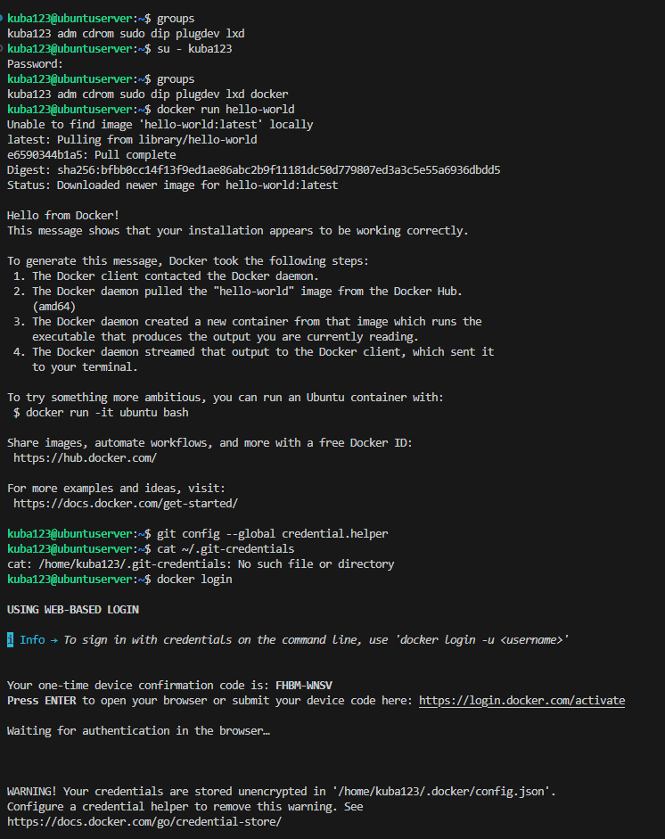

Zalogowanie do Docker Hub oraz wyszukiwanie dostępnych obrazów systemu Ubuntu.

```bash
docker search ubuntu
```

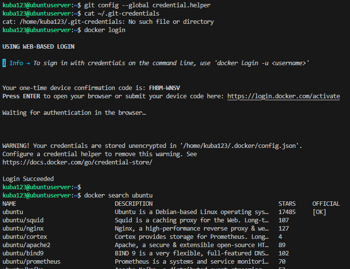

## 2. **Pobranie obrazów hello-world, busybox, ubuntu, mysql**

Pobranie obrazów Docker: busybox, ubuntu, mysql oraz wyświetlenie listy dostępnych obrazów.

```bash
docker pull busybox
docker pull ubuntu
docker pull fedora
dokcer pull mysql
docker images
```

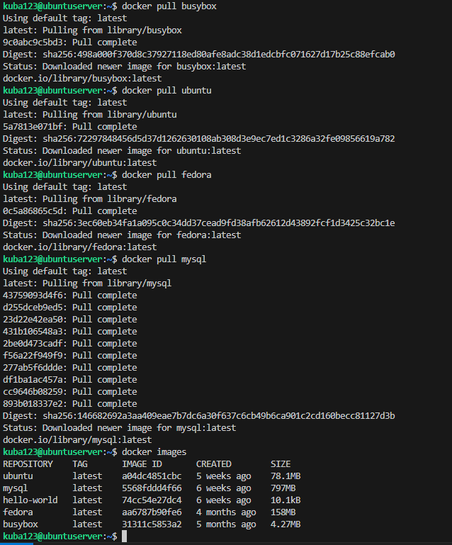

## 3. **Uruchomienie kontenera z obrazu busybox**

Podłączenie się do kontenera interaktywnie i wywołanie numeru wersji

```bash
docker run -it --name my_busybox busybox sh
busybox --version
```

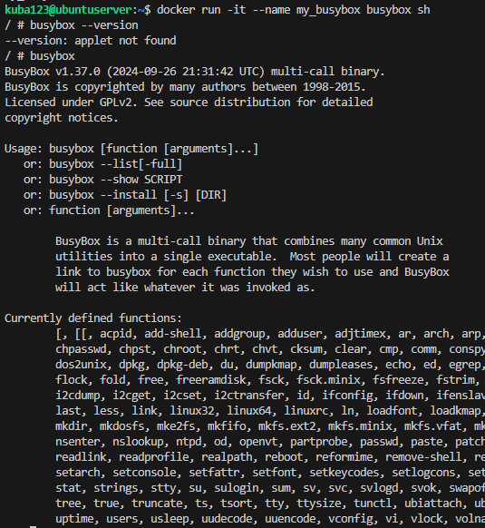

## 4. **Uruchomienie "systemu w kontenerze", wybrałem kontener z obrazu ubuntu**

Zaprezentowanie PID1 w kontenerze i procesów dockera na hoście, a także zaktualizowanie pakietów

```bash
docker run -it --name my_ubuntu ubuntu bash
ps -aux
apt update && apt upgrade -y
```

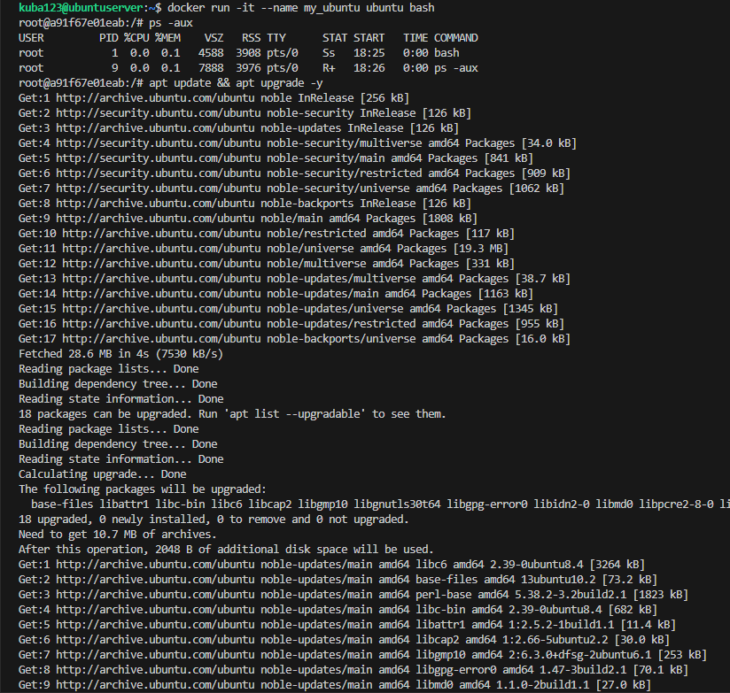

Na nowym terminalu sprawdzamy procesy dockera na hoście

```bash
ps aux | grep docker 
```

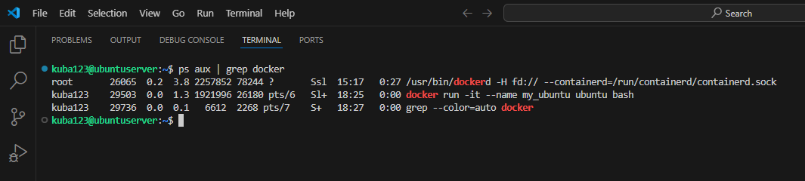

## 5. **Stworzenie własnoręcznie, zbudowanie i uruchomienie prostego pliku Dockerfile bazującego na wybranym systemie i sklonowanie repozytorium**

Stworzenie katalogu oraz Dockerfile'a

```bash
mkdir -p ~/docker_projects/mdo_container
cd ~/docker_projects/mdo_container
nano Dockerfile
```

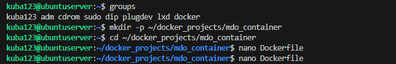

Stworzenie Dockerfilea, jego kod:

```bash
FROM ubuntu:latest

LABEL maintainer="Jakub Robak"

RUN apt update && apt upgrade -y && \
    apt install -y git && \
    rm -rf /var/lib/apt/lists/*

WORKDIR /app

RUN git clone https://github.com/InzynieriaOprogramowaniaAGH/MDO2025_INO

CMD ["/bin/bash"]
```

Zbudowanie własnego obrazu Dockera na bazie Ubuntu z Gitem oraz uruchomienie kontenera zawierającego sklonowane repozytorium.

```bash
docker build -t mdo_container
docker run -it --name mdo_test mdo_container
```

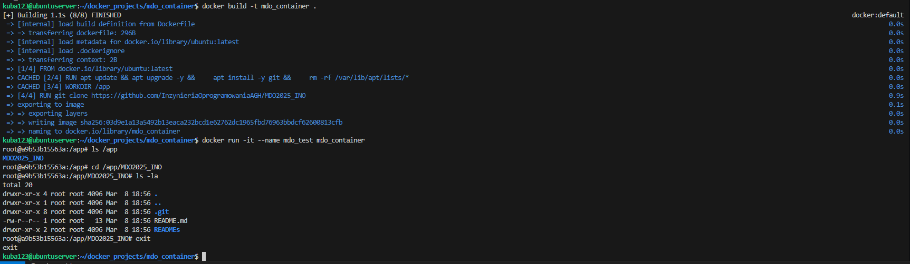

Wyświetlenie wszystkich utworzonych kontenerów, zatrzymanie ich oraz usunięcie przy pomocy poleceń docker stop oraz docker rm.

```bash
docker ps -a
docker stop <id_kontenera>
docker rm $(docker ps -aq)
```

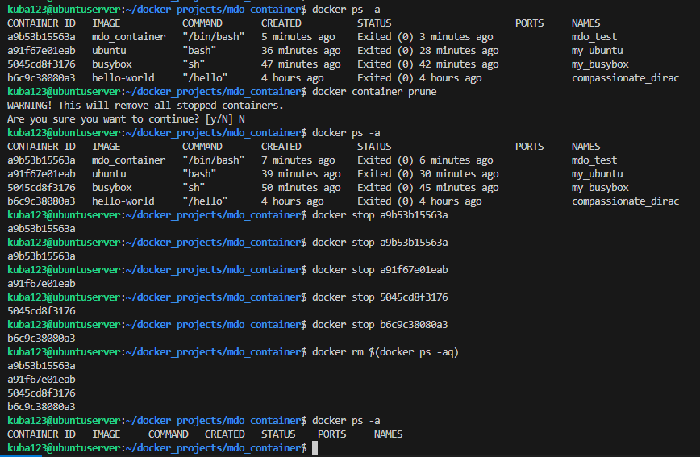

Wyświetlenie listy dostępnych obrazów oraz ich usunięcie za pomocą polecenia docker image prune -a.

```bash
docker images 
docker image prune -a
```

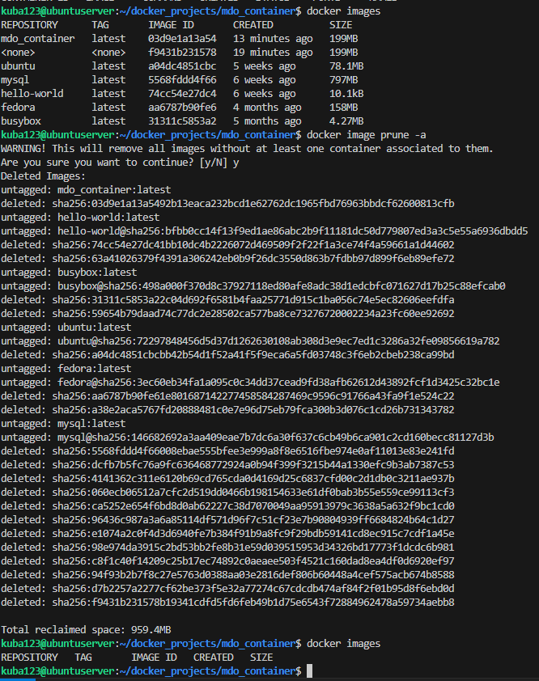

# **Zajęcia 3 - Dockerfiles, kontener jako definicja etapu** 

---

## 1. **Wybór oprogramowania na zajęcia**

W celu realizacji zadań udało się znaleźć repozytorium na licencji open source(GNU General Public License Version 3 (GPLv3)), które zawiera oprogramowanie GNU WGET.
Oprogramowanie spełnia poniższe wymagania:
- licencja Open Source
- Zawiera testy
- Projekt jest kompletny, wraz z narzędziami Makefile
- Uruchomienie "make build" oraz "make test" działa poprawnie

Jak już wcześniej wspomniałem wybrałem aplikację GNU WGET, czyli narzędzie open source do pobierania plików z Internetu przez protokoły HTTP, HTTPS i FTP. 

Link do repozytoirum: https://github.com/mirror/wget, link do mirrora: https://git.savannah.gnu.org/git/wget.git/

## 2. **Sklonowanie repozytorium aplikacji, przeprowadzenie builda programu (doinstalowanie wymaganych zależności) oraz uruchomienie testów jednostkowych na koniec**

Zauważyłem, że aplikacja używa do builda bootstrapa. Zatem trzeba będzie doinstalować zależności, żeby ./configure zadziałało oraz make. Na screenie niestety nie udało mi się tego wychwycić, ale później dodałem zależności autoconf-archive, libgnutls28-dev oraz zlib1g-dev, ponieważ ./configure nie działał.

```bash
git clone https://github.com/mirror/wget.git
cd wget
sudo apt update
sudo apt install -y build-essential autoconf automake libssl-dev
sudo apt install -y \ 
autoconf \
automake \
autopoint \
texinfo \
flex \
gperf \
gettext \
build-essential \
libssl-dev \
pkg-config \
autoconf-archive \
libgnutls28-dev \
zlib1g-dev
```

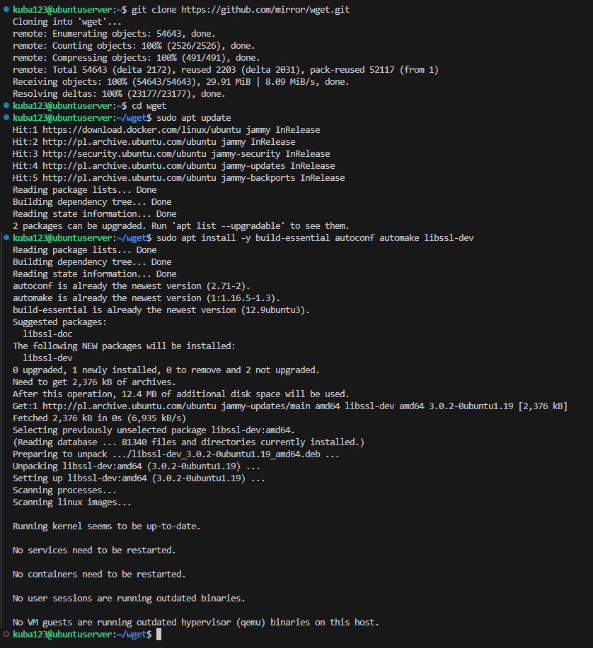

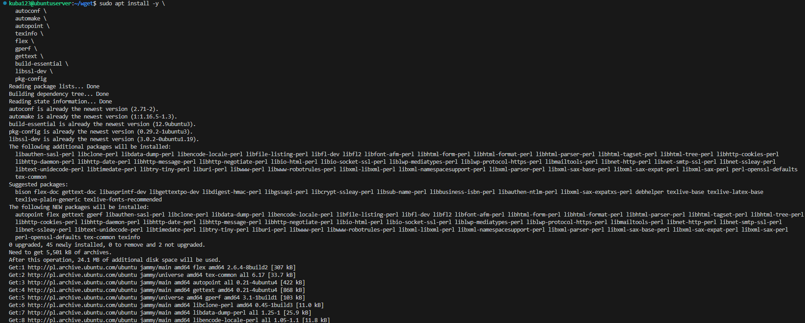

Jak udało się doinstalować wszystkie zależności można na tym etapie przeprowadzić builda(może on zająć bardzo długo):

```bash
./bootstrap
./configure
make
```
Jeśli wszystko przeszło poprawnie powinno to wyglądać tak jak na screenach poniżej:

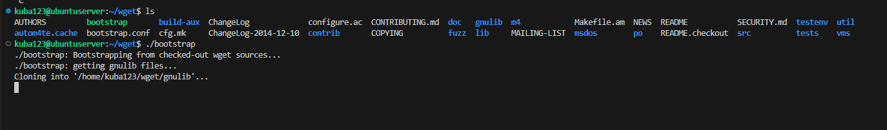

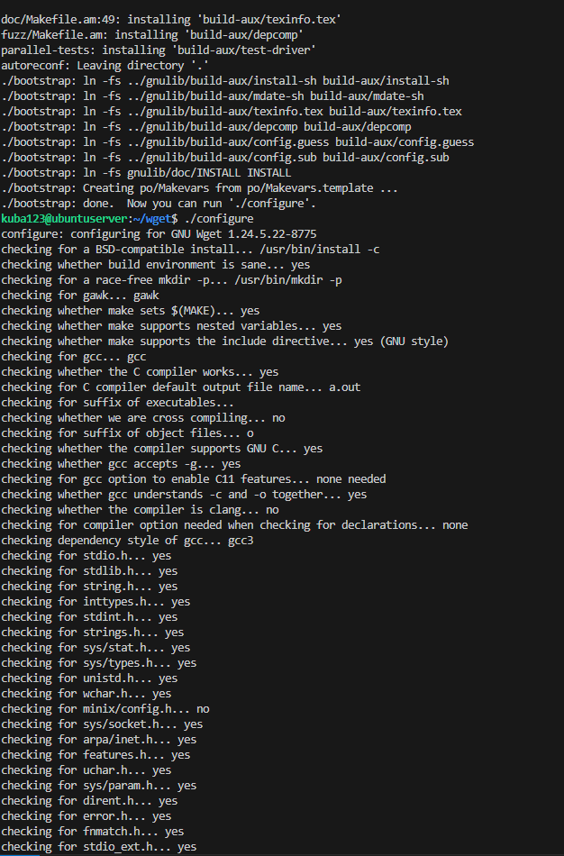

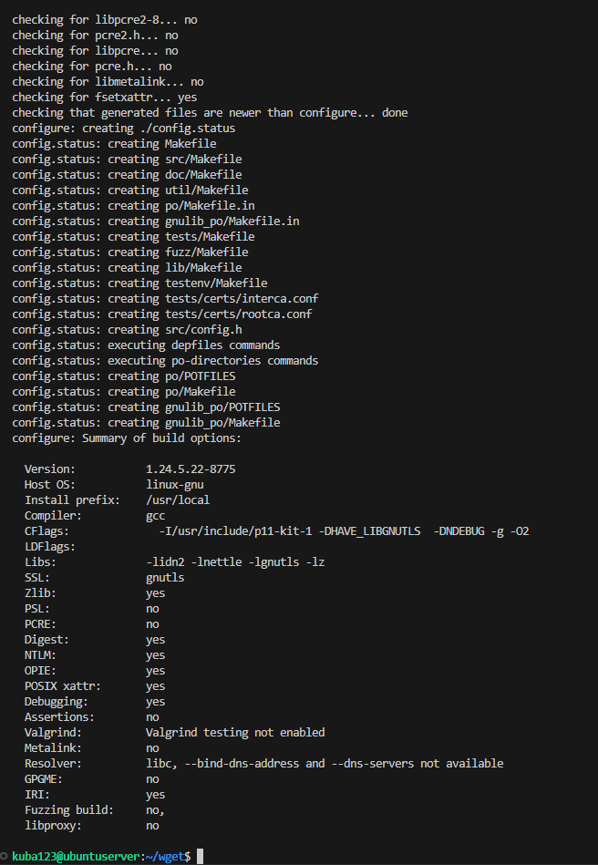

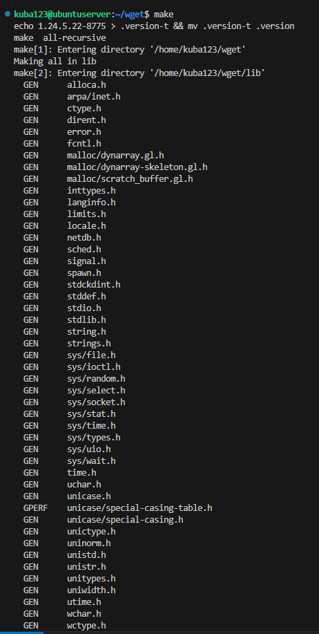

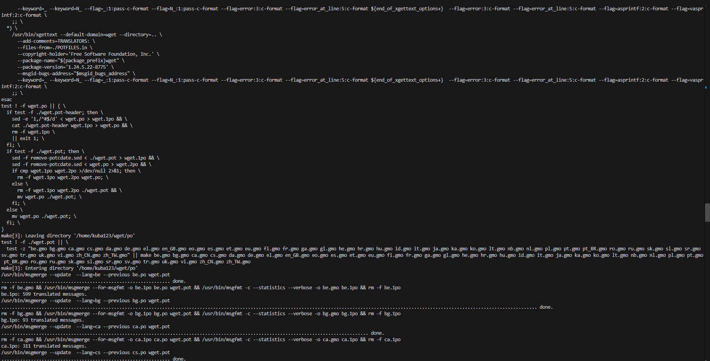

Możemy teraz uruchomić testy jednostkowe. WGET ma ich dużo, zatem pokażę tylko podsumowania.

```bash
make check
```

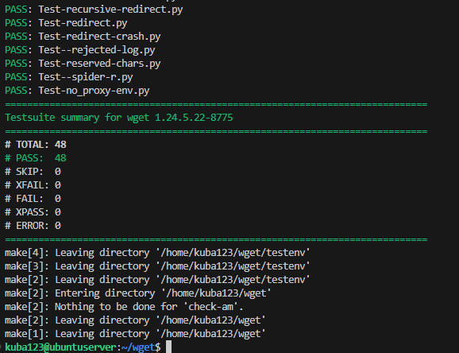

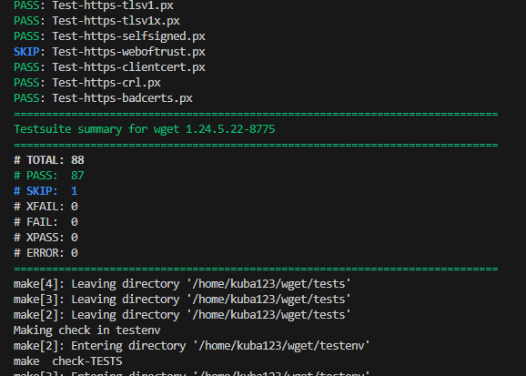

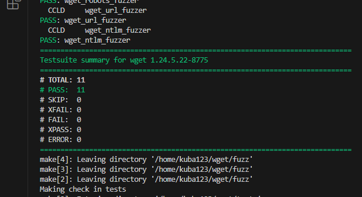

## 3. **Przeprowadzenie buildu w kontenerze**

Po pierwsze uruchomiłem kontener

```bash
docker run -it --name wget-build ubuntu:latest bash
```

Następnie instaluję zależności w wewnątrz kontenera:

```bash
apt update && apt install -y \ 
autoconf \
automake \
autopoint \
texinfo \
flex \
gperf \
gettext \
build-essential \
libssl-dev \
pkg-config \
autoconf-archive \
libgnutls28-dev \
zlib1g-dev \
git
```

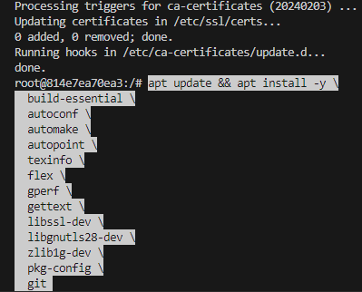

Na koniec klonuję repozytorium oraz przeprowadzam builda, a także uruchamiam testy:

```bash
git clone https://github.com/mirror/wget.git
cd wget
./bootstrap
./configure
make
make check
```

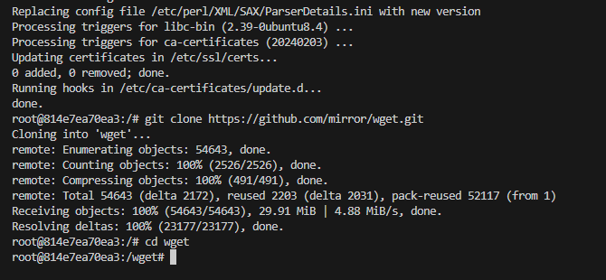

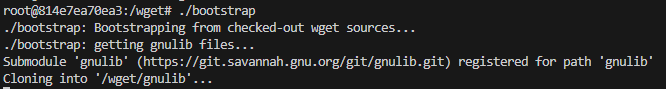

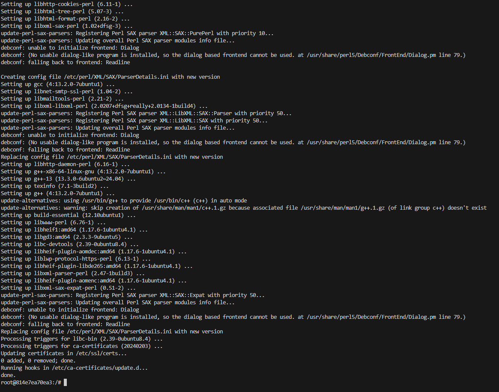

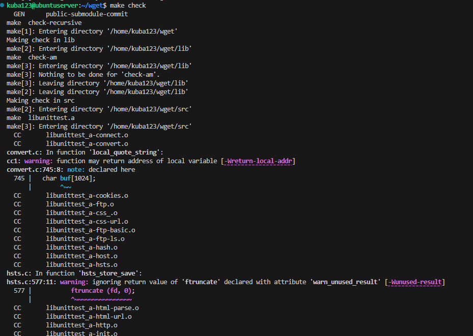

## 4. **Stworzenie dwóch plików Dockerfile: Dockerfile.build oraz Dockerfile.test**

Kod Dockerfile.build: 

```bash
FROM ubuntu:22.04

RUN apt update && apt install -y \
    build-essential \
    autoconf \
    automake \
    autopoint \
    texinfo \
    flex \
    gperf \
    gettext \
    libssl-dev \
    libgnutls28-dev \
    zlib1g-dev \
    pkg-config \
    git \
    wget \
    autoconf-archive \
    ca-certificates

WORKDIR /opt

RUN git clone https://github.com/mirror/wget.git

WORKDIR /opt/wget

RUN ./bootstrap && ./configure && make

CMD ["/bin/bash"]
```

Kod Dockerfile.test: 

```bash
FROM wget-build

WORKDIR /opt/wget

CMD ["make", "check"]
```

Przeprowadzenie builda oraz testów, wyświetlenie obrazów:

```bash
docker build -t wget-build -f Dockerfile.build
docker build -t wget-test -f Dockerfile.test
docker images
```
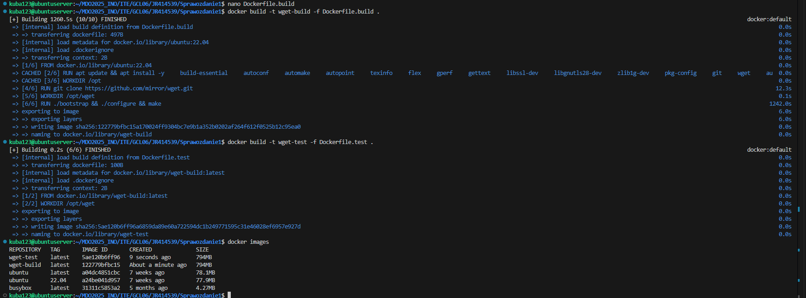

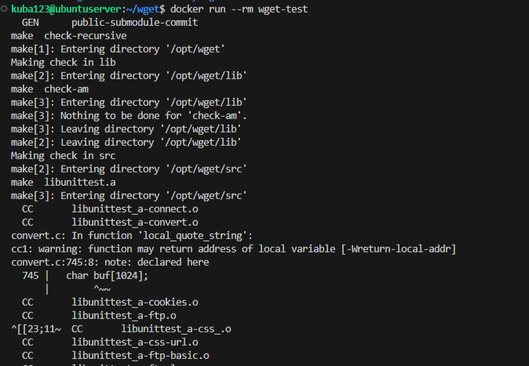

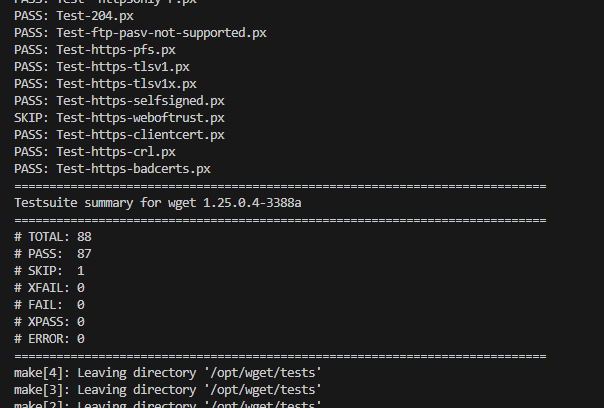

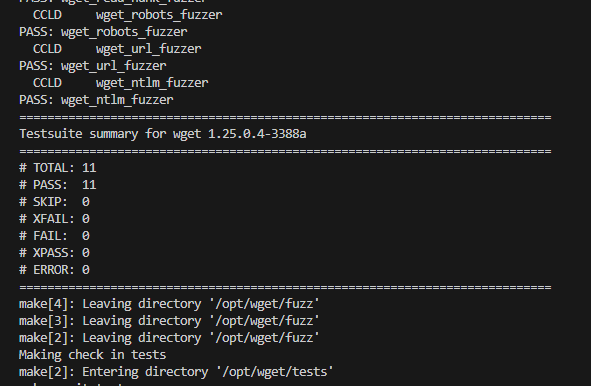

Obraz Docker (wget-build, wget-test) to gotowa paczka do uruchomienia. Zaś kontener Docker to działający lub wcześniej uruchomiony proces utworzony na podstawie obrazu. Obraz testowy został zbudowany u mnie na bazie wget-build, co oznacza, że projekt zbudował się poprawnie i jest gotowy do testowania.

Co pracuje w takim kontenerze?

W kontenerze działa system oparty na Ubuntu 22.04, znajdują się w nim wszystkie potrzebne biblioteki oraz środowisko zawiera zbudowany program wget, gotowy do testowania i użycia.

Przetestowanie czy WGET działa:

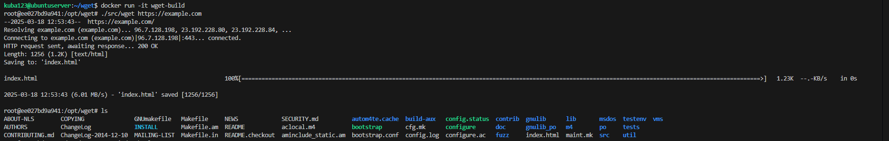

# **Zajęcia 4 - Dodatkowa terminologia w konteneryzacji, instancja Jenkins** 

---

## 1. **Zachowywanie stanu, woluminy wejściowy i wyjściowy**

Stworzenie dwóch woluminów o nazwach: volume_wejsciowy oraz volume wyjsciowy oraz podłączenie ich do kontenera bazowego. Następnie dodałem potrzebne zależności do budowania projektu, ale na początku !BEZ GITA! 

```bash
docker volume create volume_wejsciowy
docker volume create volume_wyjsciowy
```

```bash
docker run -it \ -v volume_wejsciowy:/mnt/wejsciowy \
-v volume_wyjsciowy:/mnt/wyjsciowy \
--name wget-volume-test \ ubuntu:22.04
apt update && apt install -y \
build-essential \
autoconf \
automake \
autopoint \
texinfo \
flex \
gperf \
gettext \
libssl-dev \
libgnutls28-dev \
zlib1g-dev \
pkg-config \
autoconf-archive \
wget \
ca-certificates
```

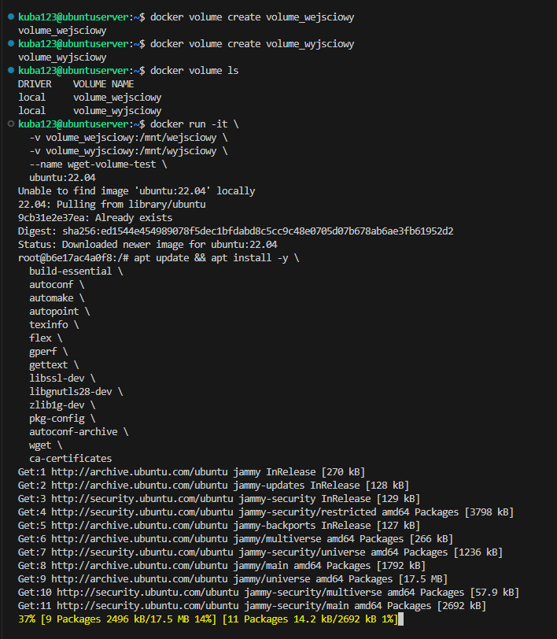

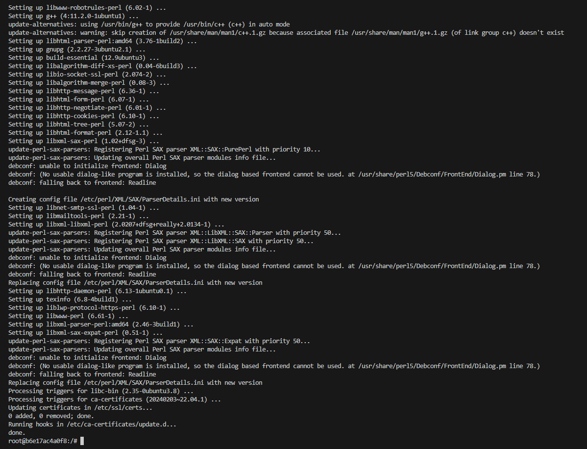

W osobnym terminalu na hoście (poza kontenerem) klonuję repozytorium oraz kopiuję dane na wolumin (volume_wejściowy):

```bash
git clone https://git.savannah.gnu.org/git/wget.git
cp -r wget/* $(docker volume inspect volume_wejsciowy -f '{{ .Mountpoint }}')
```

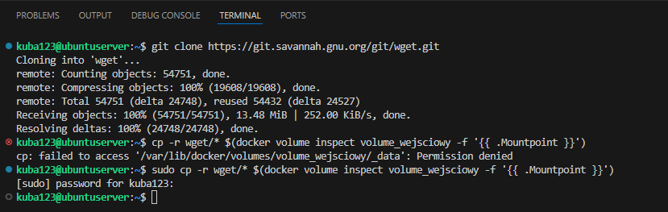

Uruchomiłem build w kontenerze(bootstrap na hoście, ponieważ wymagał gita) oraz zapisałem wszystkie zbudowane/powstałe pliki na wolumin wyjściowy:

```bash
./bootstrap
./configure
make
```
```bash
cp src/wget /mnt/wyjsciowy/
```

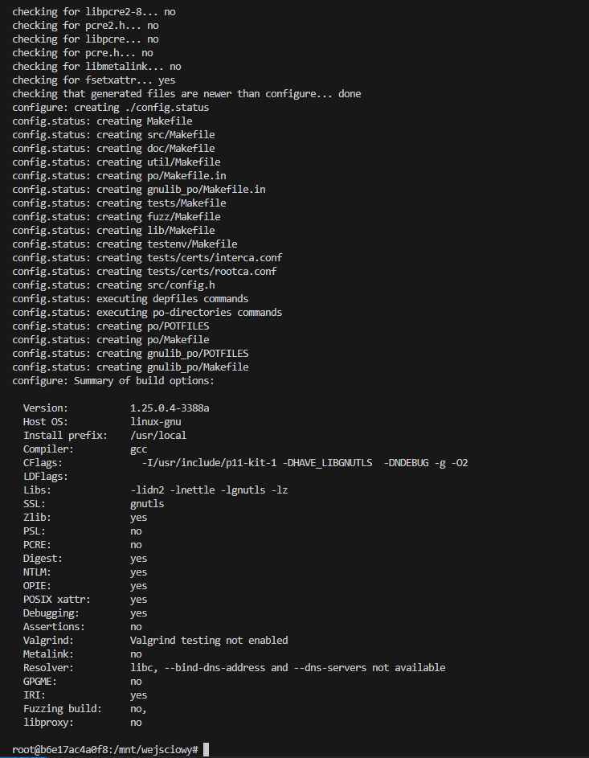

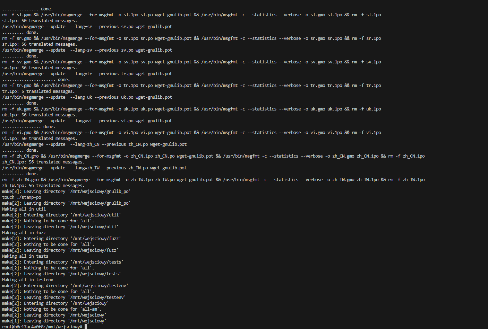

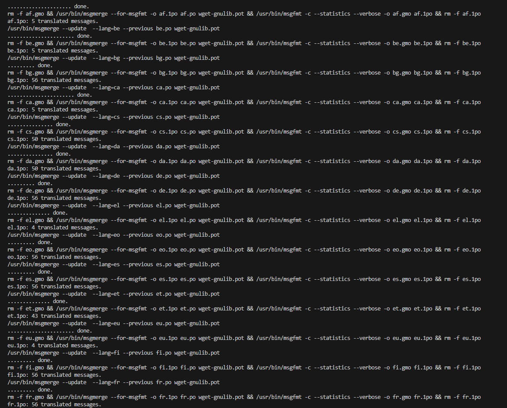

Sprawdzenie czy wszystko się zapisało na woluminie wyjściowym:

```bash
sudo ls $(docker volume inspect volume_wyjsciowy -f '{{ .Mountpoint }}')
```

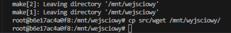

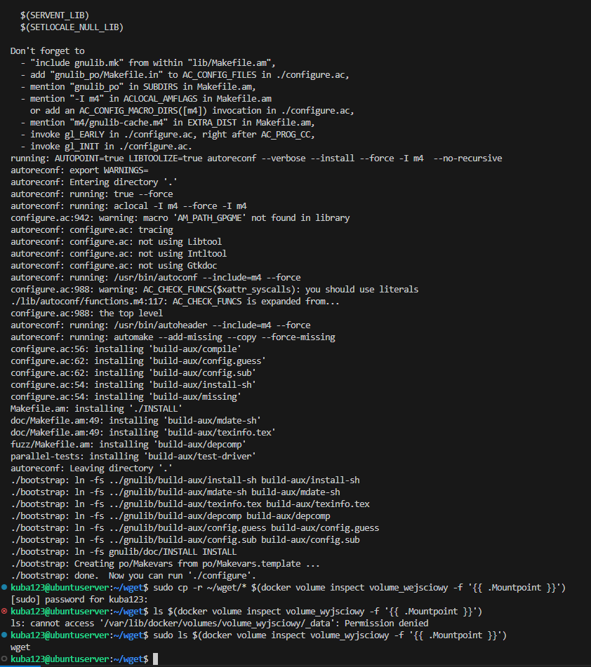

Ponowiłem operację, ale klonowanie na wolumin wejściowy przeprowadziłem wewnątrz kontenera (!GIT W KONTENERZE!). Zatem dodajemy gita do zależności:

```bash
apt update && apt install -y \
build-essential \
autoconf \
automake \
autopoint \
texinfo \
flex \
gperf \
gettext \
libssl-dev \
libgnutls28-dev \
zlib1g-dev \
pkg-config \
autoconf-archive \
wget \
ca-certificates \
git
```

Już nie musimy w osobnym terminalu klonować repozytorium, robimy to wewnątrz kontenera:

```bash
cd /mnt/wejsciowy
```

```bash
git clone https://github.com/mirror/wget.git
```
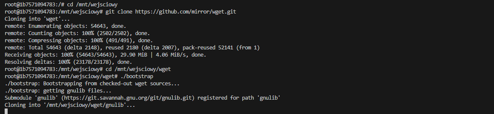

```bash
./bootstrap
./configure
make
```

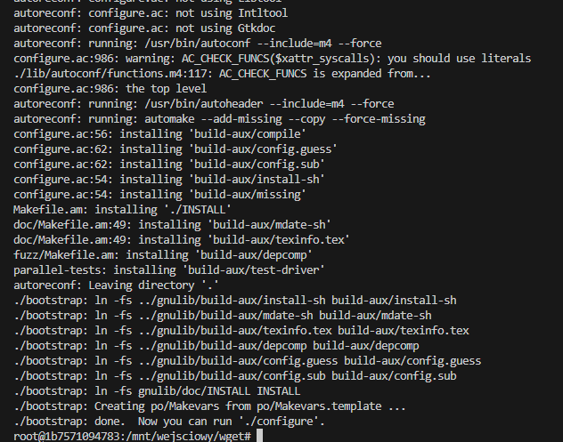

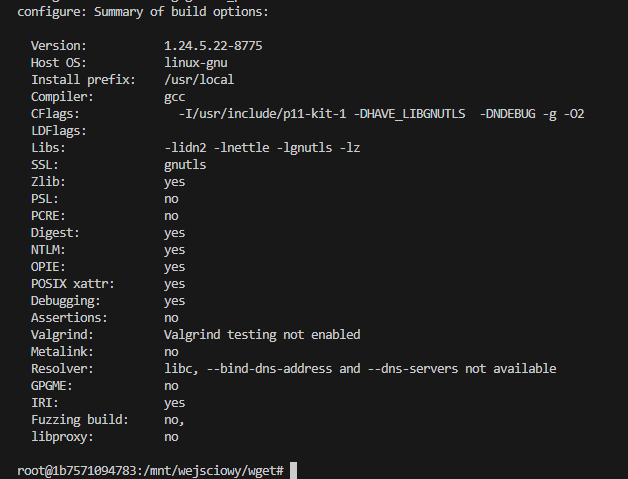


Zapisanie danych na wolumin wyjściowy:

```bash
cp -r * /mnt/wyjsciowy/
```

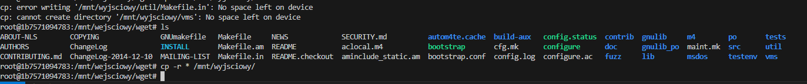

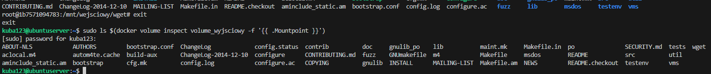

W poprzednim podejściu, które zrealizowaliśmy, dane do i z kontenera przekazywane były za pomocą nazwanych woluminów (volume_wejsciowy, volume_wyjsciowy) montowanych przy uruchamianiu kontenera (docker run ...). Jednak od wersji BuildKit w Dockerze, możliwe jest użycie RUN --mount bezpośrednio w Dockerfile, co umożliwia dostęp do danych z zewnątrz już na etapie budowania obrazu.

Dzięki RUN --mount można:
- montować pliki i katalogi tylko na czas pojedynczego kroku budowania (bez ich kopiowania do finalnego obrazu),
- korzystać z cache (np. type=cache) dla przyspieszenia kompilacji,
- unikać konieczności kopiowania plików do kontekstu budowania (.), co bywa kosztowne przy dużych projektach.

Jeśli chodzi o zalety takiego podejścia to można wymienić:
- Lepsza kontrola nad tym, co trafia do obrazu końcowego,
- Niższe zużycie miejsca – dane montowane tymczasowo nie są kopiowane do warstw obrazu,
- Bezpieczeństwo – możliwość użycia sekretów, które nie zostają zapisane na stałe,  
- Szybsze budowanie.

Podsumowując, dzięki RUN --mount, wiele operacji związanych z kopiowaniem, woluminami i zarządzaniem danymi można uprościć i zautomatyzować. Choć wymaga to włączenia BuildKit(DOCKER_BUILDKIT=1), daje znacznie większe możliwości.

## 2. **Eksponowanie portu**

Uruchomiłem wewnątrz kontenera serwer iperf (iperf3):

```bash
docker run -it --name iperf-server -p 5201:5201 ubuntu:22:04
```
```bash
apt update && apt install -y iperf3
```

```bash
iperf3 -s
```

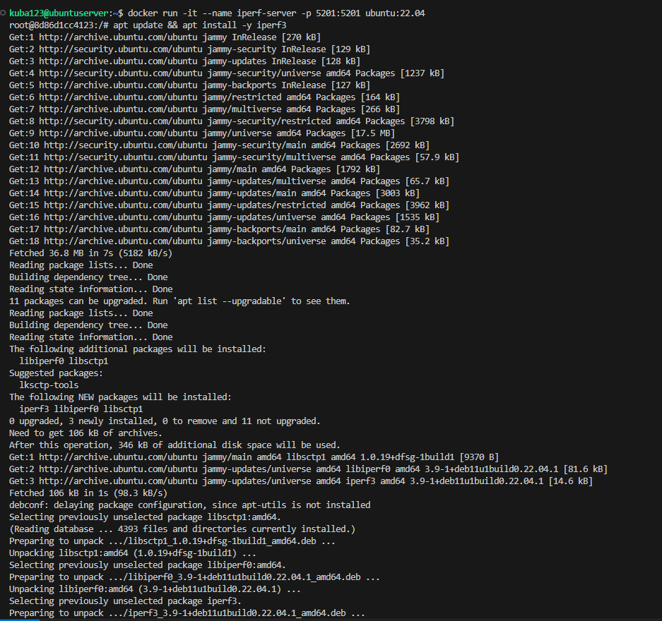

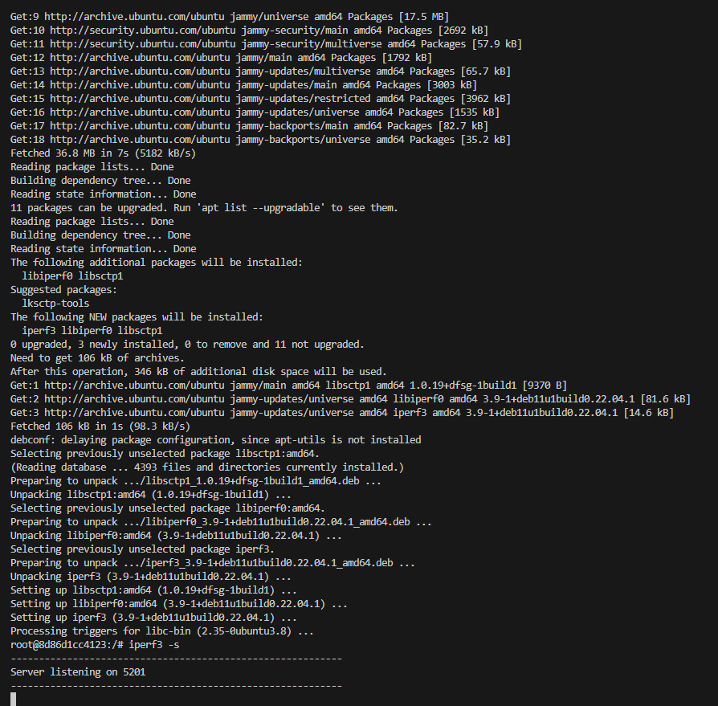

Połączyłem się z nim z drugiego kontenera(klienta) oraz zbadałem ruch. Żeby to zrobić musiałem znać adres ip serwera:

```bash
docker run -it --name iperf-client ubuntu:22:04
```

```bash
apt update && apt install -y iperf3
```

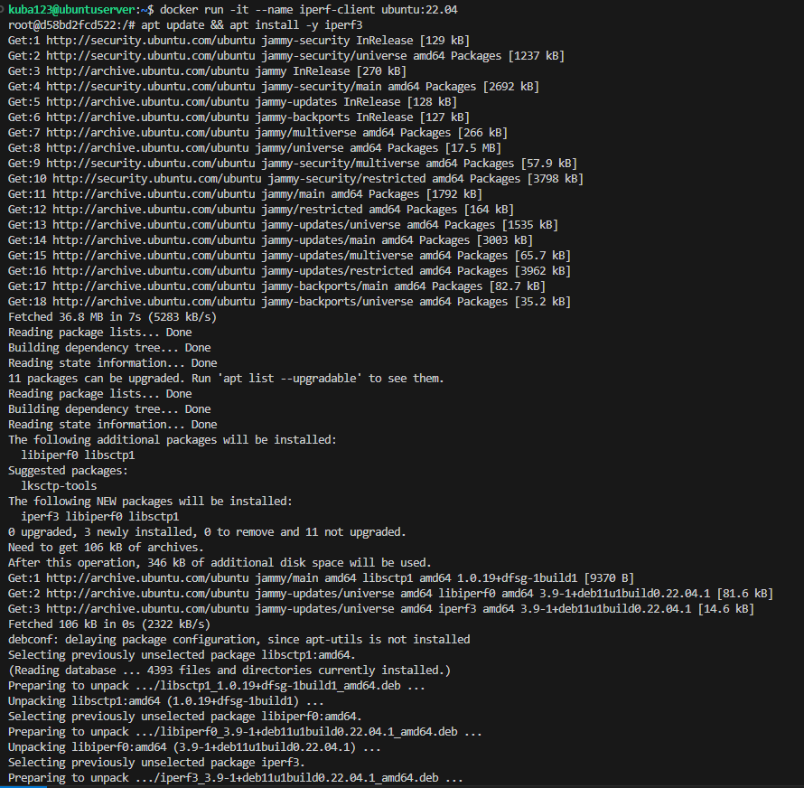

Na nowym terminalu:

```bash
docker inspect iperf-server | grep "IPAddress"
```

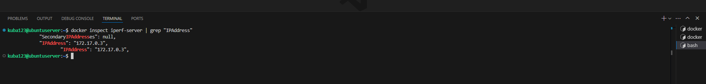

Zatem adresem IP serwera jest: "172.17.0.3". Zatem łączę się klientem z serwerem:

```bash
iperf3 -c 172.17.0.3 port 5201
```


Ponawiam ten krok, ale wykorzystuję tym razem własną dedykowaną sieć mostkową (zamiast domyślnej). Użyłem także rozwiązywania nazw.

Tworzę własną sieć mostkową:

```bash
docker network create --driver bridge mynet
```
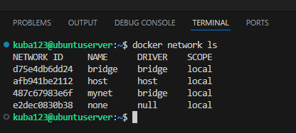

Uruchamiam ponownie kontenery w tej sieci(serwer i klient). Dodałem --rm, ponieważ miałem problemy z pamięcią:

```bash
docker run -it --rm --name iperf-server --network mynet ubuntu:22.04
```

```bash
iperf3 -s
```

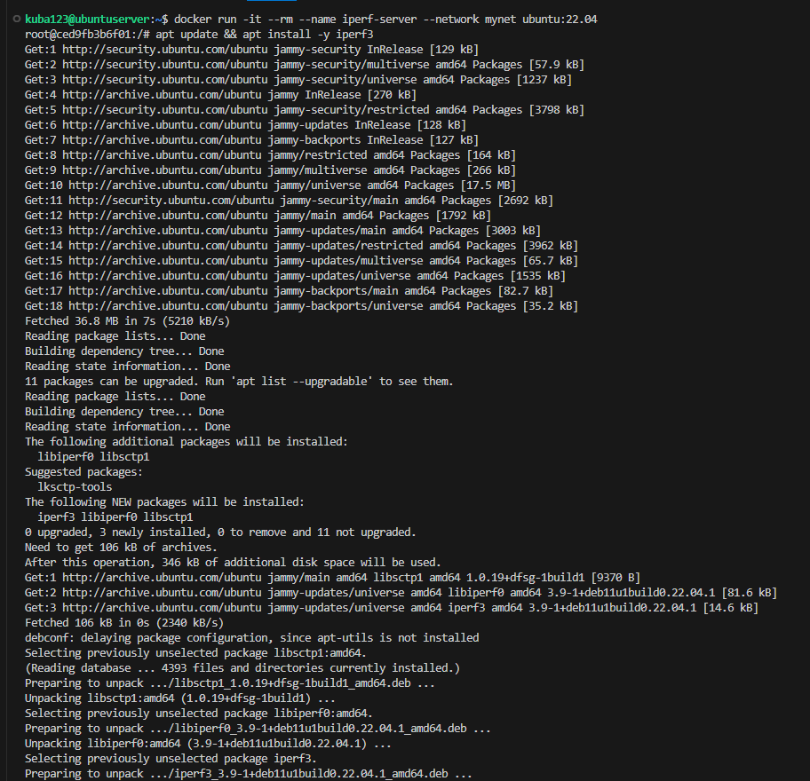

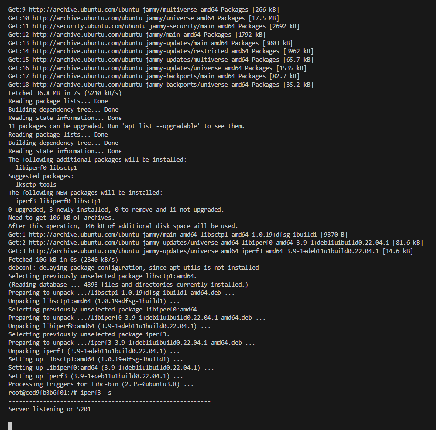

```bash
docker run -it --rm --name iperf-client --network mynet ubuntu:22.04
```

```bash
iperf3 -c iperf-server
```

Jak można zauważyć, teraz działa rozwiązywanie nazw przez DNS w sieci mynet, więc nie trzeba IP, wystarczy nazwa iperf-server. Na poniższym zrzucie ekranu widać przepustowość komunikacji.

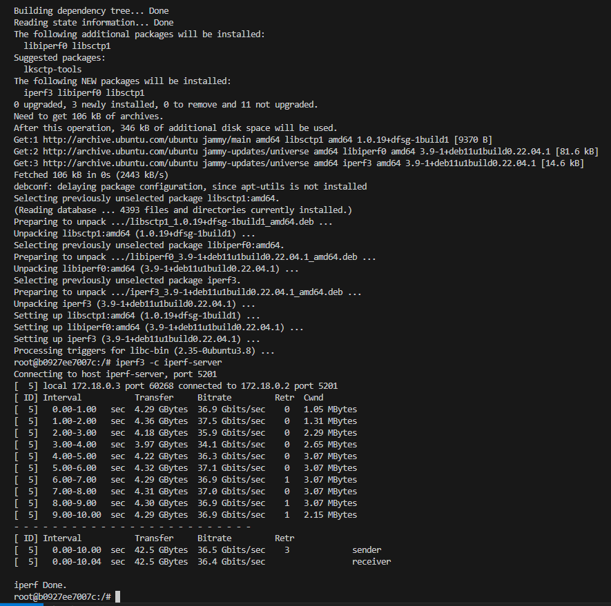

## 3. **Instancja Jenkins**

Na początek stworzyłem dedykowaną sieć dla Jenkinsa i DIND oraz woluminy na dane Jenkinsa:

```bash
docker network create jenkins
```

```bash
docker volume create jenkins-data
```

```bash
docker volume create jenkins-docker-certs
```

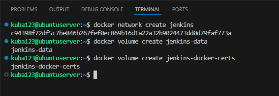

Następnie uruchomiłem kontener pomocniczy DIND oraz kontener Jenkinsa główny.

```bash
docker run --name jenkins-docker \
--detach \
--privileged \
--network jenkins \
--network-alias docker \
--env DOCKER_TLS_CERTDIR=/certs \
--volume jenkins-docker-certs:/certs/client \
--volume jenkins-data:/var/jenkins_home \
docker:dind
```

```bash
docker run --name jenkins-blueocean \
--detach \
--network jenkins \
--env DOCKER_HOST=tcp://docker:2376 \
--env DOCKER_CERT_PATH=/certs/client \
--env DOCKER_TLS_VERIFY=1 \
--publish 8080:8080 --publish 50000:50000 \
--volume jenkins-data:/var/jenkins_home \
--volume jenkins-docker-certs:/certs/client:ro \
jenkins/jenkins:lts
```

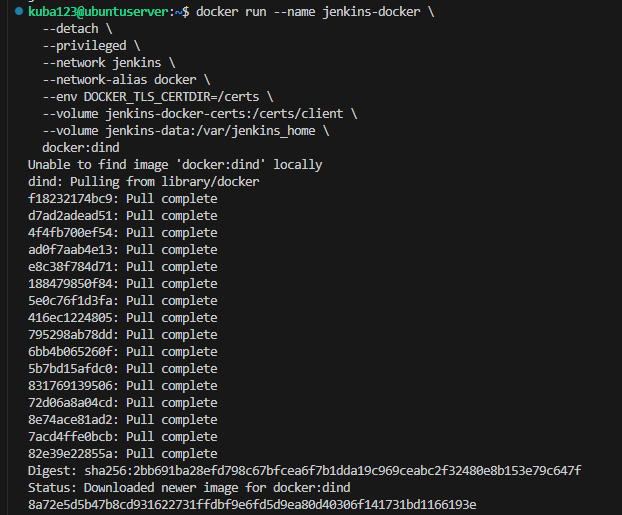

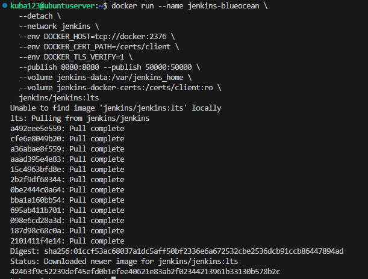

Wyświetliłem działające kontenery

```bash
docker ps 
```

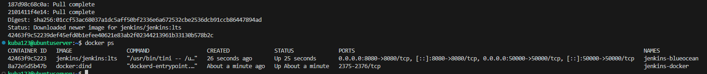

Żeby pokazać ekran logowania Jenkinsa musiałem wykonać takie operacje:

```bash
docker logs jenkins-blueocean
```

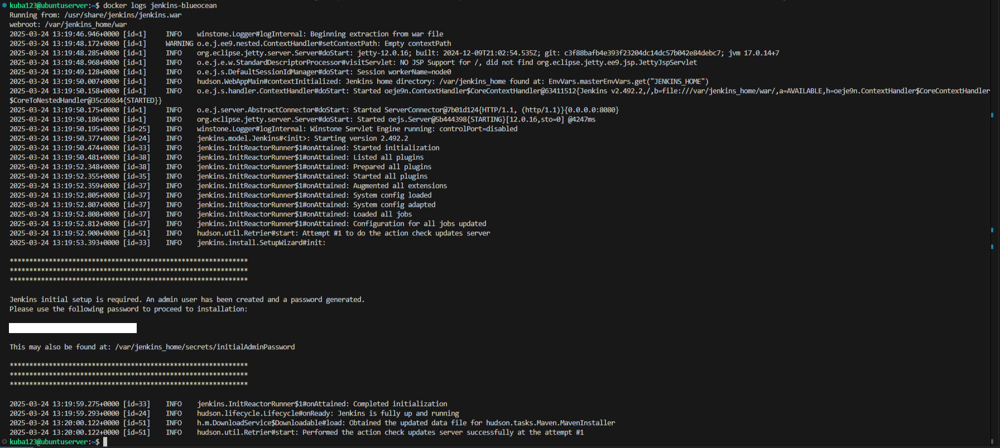

Mając już hasło mogłem się zalogować na jenkinsa pod adresem: http://localhost:8081/. Wybrałem taki adres, ponieważ tak skonfigurowałem przekierowanie portów w sieci NAT na maszynie wirtualnej(zrzut ekranu poniżej).

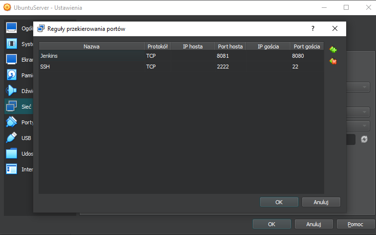

Na koniec pokażę ekran logowania przed logowaniem oraz po logowaniu:

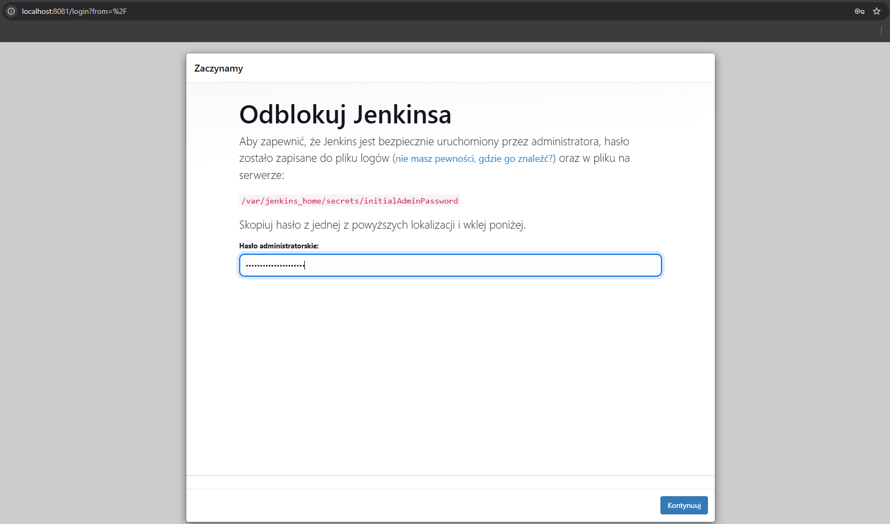

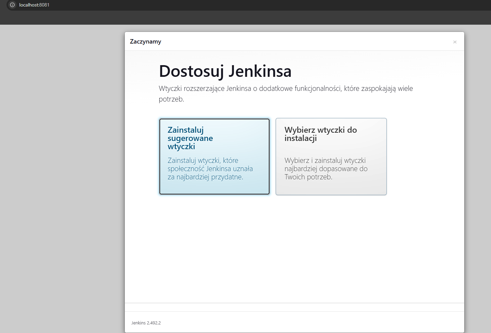

---