# Sprawozdanie 2 - Pipeline, Jenkins, izolacja etapów

---

# **Cel** 

---

**Celem ćwiczeń było nauczenie się jak skonfigurować i obsługiwać Jenkinsa w środowisku Docker, skupiając się na tworzeniu pipeline’ów oraz automatyzacji budowania i testowania aplikacji.**

---

# **Przygotowanie** 

---

## **Utworzenie instancji Jenkinsa zgodnie z dokumentacją: https://www.jenkins.io/doc/book/installing/docker/**

Na początku pobrałem obraz Dockera z oficjalnej strony docker hub: https://hub.docker.com/r/jenkins/jenkins/ za pomocą komendy:

```bash
docker pull jenkins/jenkins:2.492.3-jdk17
```

Stworzyłem nową sieć mostkową w dockerze przy pomocy następującej komendy:

```bash
docker network create jenkins
```

Uruchomiłem obraz Dockera, który eksponuje środowisko zagnieżdżone za pomocą run, zgodnie z instrukcją:

```bash
docker run \
  --name jenkins-docker \
  --rm \
  --detach \
  --privileged \
  --network jenkins \
  --network-alias docker \
  --env DOCKER_TLS_CERTDIR=/certs \
  --volume jenkins-docker-certs:/certs/client \
  --volume jenkins-data:/var/jenkins_home \
  --publish 2376:2376 \
  docker:dind \
  --storage-driver overlay2
```

W taki sposób uruchamiamy kontener Dockera (Docker-in-Docker), przygotowany do współpracy z Jenkinsem, umożliwiając Jenkinsowi budowanie i uruchamianie innych kontenerów Dockera wewnątrz tego środowiska.

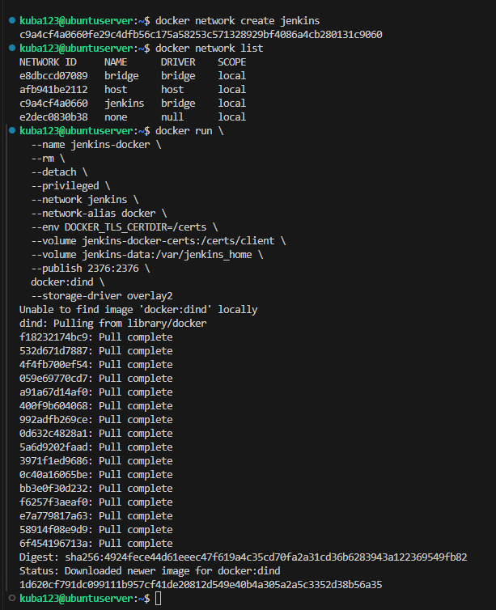

Tworzę Dockerfile_jenkins, który tworzy obraz Jenkinsa z zainstalowanym klientem Dockera oraz potrzebnymi pluginami do obsługi pipeline'ów i Dockera w Jenkinsie:

```bash
FROM jenkins/jenkins:2.492.3-jdk17
USER root
RUN apt-get update && apt-get install -y lsb-release ca-certificates curl && \
    install -m 0755 -d /etc/apt/keyrings && \
    curl -fsSL https://download.docker.com/linux/debian/gpg -o /etc/apt/keyrings/docker.asc && \
    chmod a+r /etc/apt/keyrings/docker.asc && \
    echo "deb [arch=$(dpkg --print-architecture) signed-by=/etc/apt/keyrings/docker.asc] \
    https://download.docker.com/linux/debian $(. /etc/os-release && echo \"$VERSION_CODENAME\") stable" \
    | tee /etc/apt/sources.list.d/docker.list > /dev/null && \
    apt-get update && apt-get install -y docker-ce-cli && \
    apt-get clean && rm -rf /var/lib/apt/lists/*
USER jenkins
RUN jenkins-plugin-cli --plugins "blueocean docker-workflow"
```

Gdy już mamy dockerfile'a, możemy go zbudować za pomocą komendy:

```bash
docker build -t myjenkins-blueocean:2.492.3-1 -f Dockerfile_jenkins
```

Uruchamiamy własny obraz myjenkins-blueocean:2.492.3-1 jako kontener w Dockerze, używając następującego polecenia docker run:

```bash
docker run \
  --name jenkins-blueocean \
  --restart=on-failure \
  --detach \
  --network jenkins \
  --env DOCKER_HOST=tcp://docker:2376 \
  --env DOCKER_CERT_PATH=/certs/client \
  --env DOCKER_TLS_VERIFY=1 \
  --publish 8080:8080 \
  --publish 50000:50000 \
  --volume jenkins-data:/var/jenkins_home \
  --volume jenkins-docker-certs:/certs/client:ro \
  myjenkins-blueocean:2.492.3-1
```

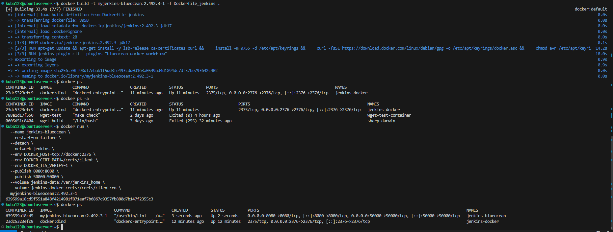

Ustawiłem interfejs Jenkinsa, żeby był wyświetlany pod adresem maszyny: 192.168.66.42:8081. Oczywiście przy instalacji pluginów, wybrałem opcję "Zainstaluj sugerowane wtyczki".

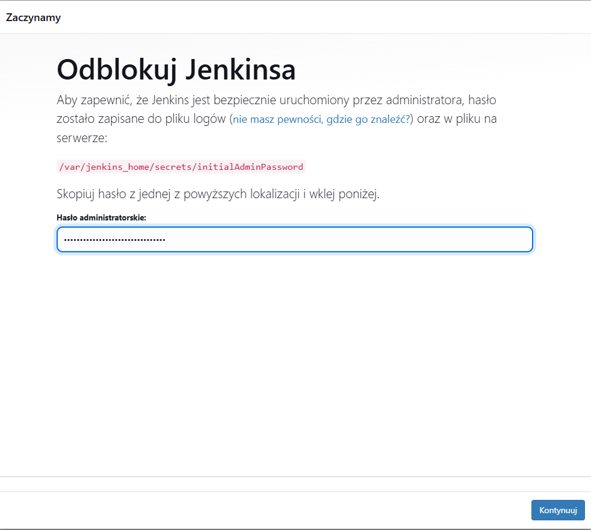

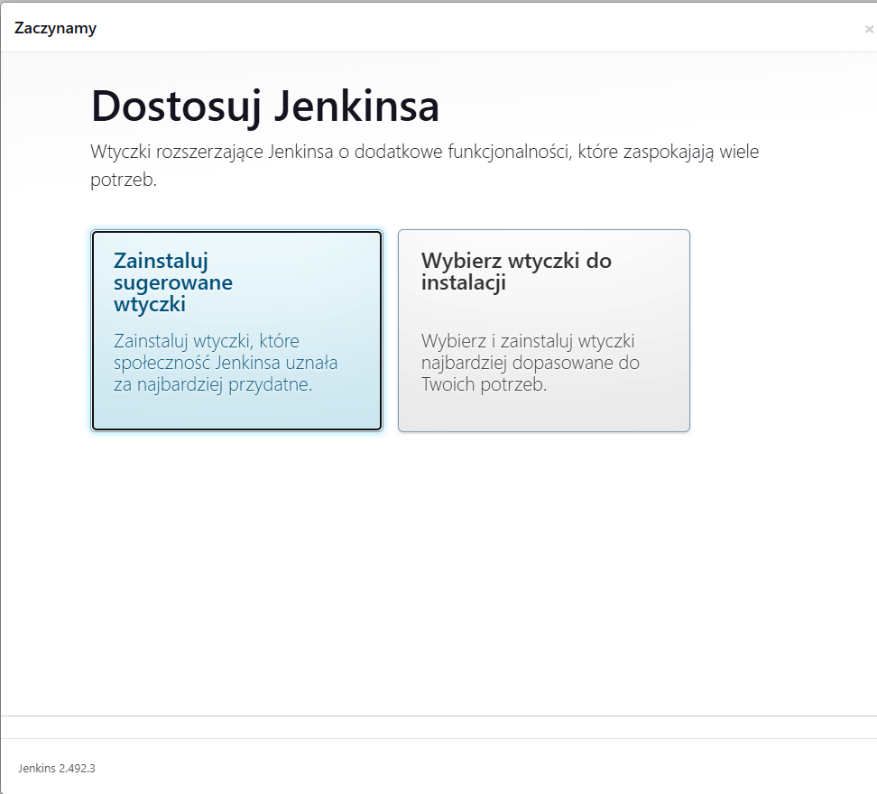

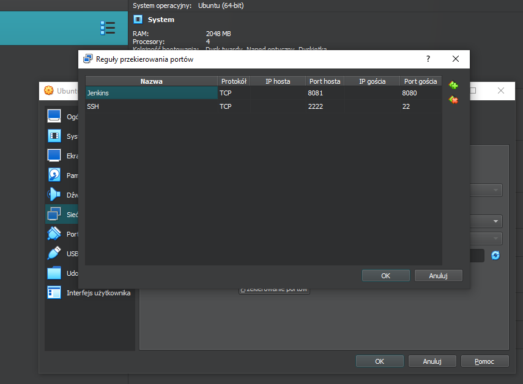

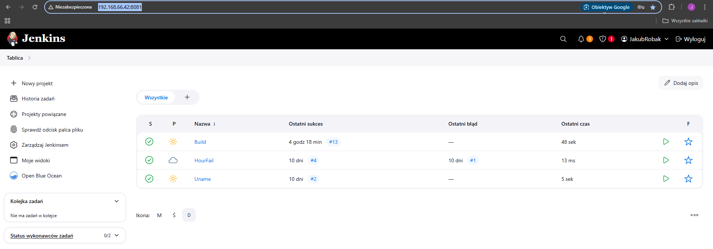

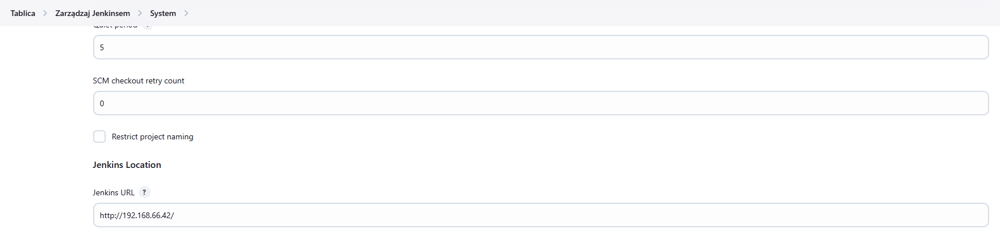

---

# **Zadanie wstępne: uruchomienie** 

**Wykonałem kilka projektów testowych**:

- Utwórzyłem projekt, który wyświetla uname oraz pobiera w projekcie obraz kontenera ubuntu za pomocą docker pull (zrzut konsoli):

```bash
uname -a
whoami
ls -la
pwd
docker images
docker pull ubuntu
```

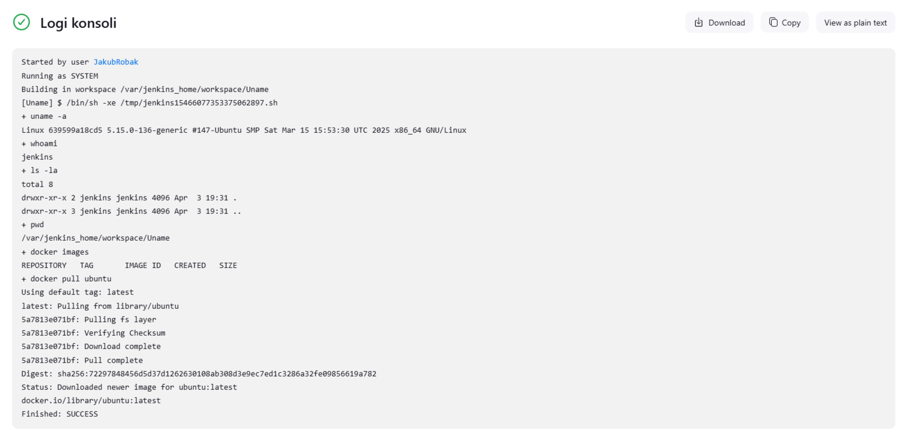

- Utworzyłem projekt, który zwraca błąd, gdy godzina jest nieparzysta. Jak godzina jest parzysta wszystko przechodzi prawidłowo(zrzut konsoli):

```bash
#!/bin/bash
hour=$(date +%H)
echo "Aktualna godzina: $hour"

if (( hour % 2 == 1 )); then
  echo " Nieparzysta godzina – przerywam build"
  exit 1
else
  echo " Parzysta godzina – wszystko OK"
fi
```

Gdy godzina jest nieparzysta:

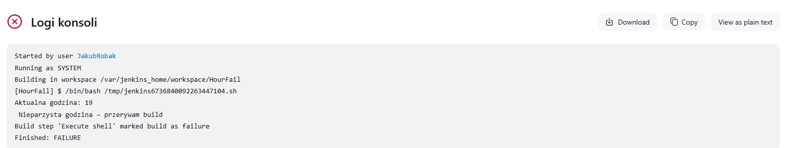

Gdy godzina jest parzysta:

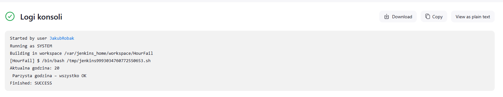

---

# **Zadanie wstępne: obiekt typu pipeline** 

- Utworzyłem podstawowy pipeline, którego zadaniem jest pobranie naszego repozytorium przedmiotowego oraz wykonanie builda obrazu dockera, zawartego w dockerfile na własnej gałęzi: JR414539.

```bash
pipeline {
    agent any

    environment {
        GIT_REPO = 'https://github.com/InzynieriaOprogramowaniaAGH/MDO2025_INO.git'
        BRANCH = 'JR414539'
        DOCKERFILE_PATH = 'ITE/GCL06/JR414539/Sprawozdanie1/Dockerfile.build'
        DOCKER_CONTEXT = 'ITE/GCL06/JR414539/Sprawozdanie1'
        DOCKER_IMAGE = 'wget-jenkins-build'
        DEPLOY_IMAGE = 'wget-deploy-test'
        TEST_IMAGE = 'wget-tester'
    }

    stages {
        stage('📥 Klonowanie repozytorium') {
            steps {
                git branch: "${BRANCH}", url: "${GIT_REPO}"
            }
        }

        stage('📄 Sprawdzenie Dockerfile') {
            steps {
                sh "ls -la ${DOCKER_CONTEXT}"
                sh "cat ${DOCKERFILE_PATH}"
            }
        }

        stage('🐳 Budowanie obrazu Dockera') {
            steps {
                sh "docker build -t ${DOCKER_IMAGE} -f ${DOCKERFILE_PATH} ${DOCKER_CONTEXT}"
            }
        }

    post {
        success {
            echo '✅ Pipeline zakończony sukcesem.'
        }
        failure {
            echo '❌ Pipeline zakończył się błędem.'
        }
    }
}
```

- Zrzut ekranu potwierdzający pomyślne przeprowadzenie builda:

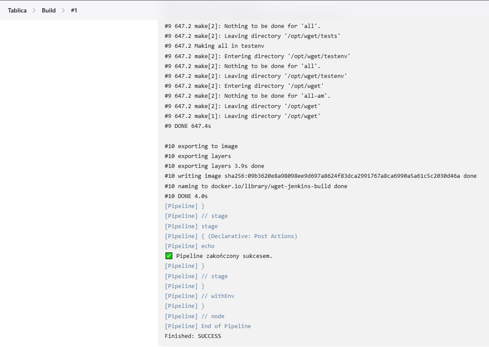

- [Pełny log z konsoli pierwszego builda - plik #1.txt](zrzuty_ekranu_sprawozdanie_2/#1.txt)

- Pipeline z udało się uruchomić drugi raz, potwierdzenie na poniższym zrzucie ekranu: 

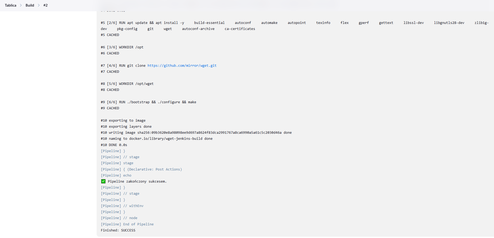

- [Pełny log z konsoli drugiego builda - plik #2.txt](zrzuty_ekranu_sprawozdanie_2/#2.txt)

---

# **Opis celu (diagramy UML - aktywności oraz wdrożeniowy)**

Na końcu sprawozdania porównam czy zrobione przeze mnie diagramy na początku dobrze przedstawiły całokształt projektu.

- Wymagania wstępne środowiska:

  - Ubuntu Server 22.04 z Dockerem

  - Jenkins uruchomiony w kontenerze Docker (jenkins/jenkins)

  - Kontener `docker:dind` (Docker-in-Docker) jako backend

  - Skonfigurowana sieć Docker (bridge) o nazwie `jenkins`

  - Jenkins pipeline z dostępem do repozytorium GitHub (gałąź JR414539)

  - Plik Dockerfile.build w katalogu: ITE/GCL06/JR414539/Sprawozdanie1 lub ITE/GCL06/JR414539/Sprawozdanie2

  - Możliwość zbudowania obrazu `wget-jenkins-build` w Jenkinsie

- Diagram aktywności:

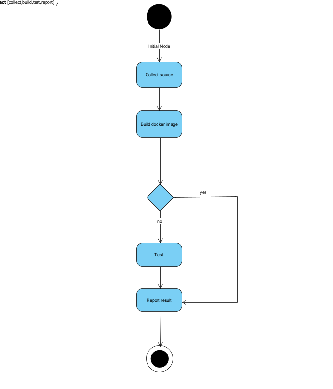

- Diagram wdrożeniowy:

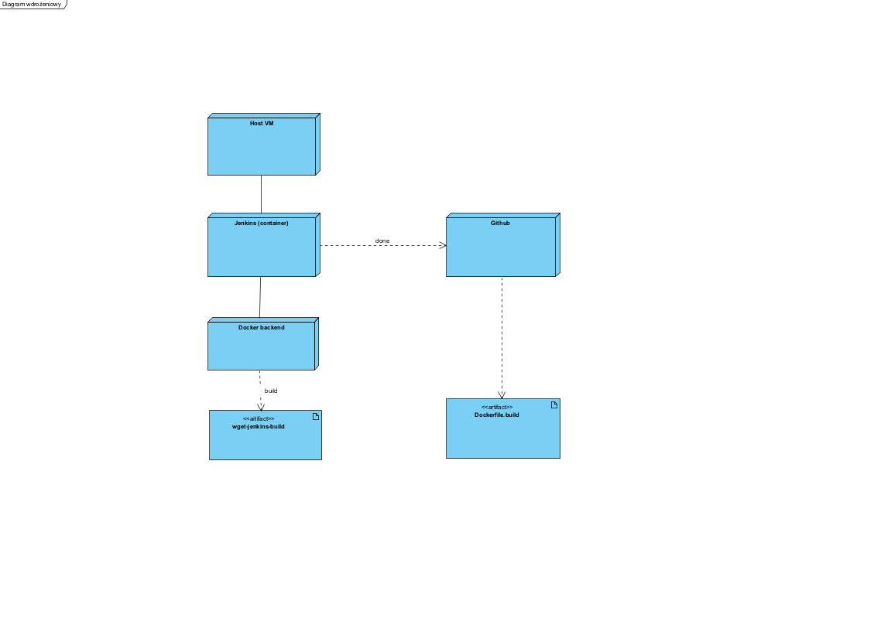

---

# **Kompletny Pipeline CI/CD - projekt wget**

- Uznałem, że lepiej będzie opisać już cały Pipeline. W szczególności, że udało mi się zrobić już kroki deploy oraz publish. 

- Pipeline dzieli się na osiem etapów:
  
  - Clone: 📥 Klonowanie repozytorium:

    - Klonowanie repozytorium: https://github.com/InzynieriaOprogramowaniaAGH/MDO2025_INO.git

    - Przejście na gałąź osobistą: JR414539

    - Pobranie niezbędnych plików: Dockerfile.build, Dockerfile.test, Dockerfile.deploy, Dockerfile.runtime

  - Check: 📄 Sprawdzenie Dockerfile:

     - Wyświetlenie zawartości katalogu Sprawozdanie1(tam mam Dockerfile.build).

     - Podgląd zawartości Dockerfile.build w terminalu.

  - Build: 🐳 Budowanie obrazu Dockera:

      Budowa obrazu wget-jenkins-build:

    - Klonuje źródła programu wget z GitHuba.

    - Kompiluje źródła.

    - Tworzy pakiet instalacyjny .deb przy użyciu checkinstall.

  - Deploy & Test wget: 🚀 Wdrożenie oraz testowanie czy wget działa:

    - Budowa obrazu wget-deploy-test na podstawie Dockerfile.deploy.

    - Instalacja wget z paczki .deb.

    - Test działania programu poprzez pobranie strony http://www.metal.agh.edu.pl.

    - Jeżeli wget działa poprawnie — kontener działa bez błędów.

  - Build .deb Package: 📦 Budowanie paczki .deb:

    - Utworzenie kontenera z obrazem wget-jenkins-build.

    - Skopiowanie zbudowanej paczki wget_1.0-1_amd64.deb z kontenera na hosta.

    - Usunięcie tymczasowego kontenera.

    - Archiwizacja pliku .deb w Jenkinsie (GUI → Artifacts, pokażę zaraz poniżej, że wszystko przeszło prawidłowo)

  - Test wget (Tester): 🔍 Uruchomienie testów:

    - Budowa obrazu wget-tester z Dockerfile.test.

    - Wykonanie testów jednostkowych i fuzz-testów obecnych w repozytorium programu wget.

    - Logi z testów są widoczne w konsoli pipeline'a.

    - Sprawdzenie czy testy zakończyły się sukcesem:

      - Podsumowanie PASS/SKIP/FAIL

  - Publish Runtime Image (Publish): 🚀 Krok publish, użycie Dockerfile.runtime:

    - Skopiowanie paczki wget.deb do katalogu Sprawozdanie2 w repozytorium.

    - Budowa obrazu wget-runtime zawierającego tylko:

      - System operacyjny.

      - Zainstalowany wget z paczki .deb.

    - Uruchomienie runtime kontenera.

    - Potwierdzenie działania programu wget w wersji runtime. 

  - Post Actions: Podsumowanie (print):

    - Jeżeli pipeline zakończy się sukcesem, wyświetlany jest komunikat: echo '✅ Pipeline zakończony sukcesem.'

    - W przypadku błędu, komunikat: echo '❌ Pipeline zakończył się błędem.'

- Wizualizacja etapów w Jenkinsie:

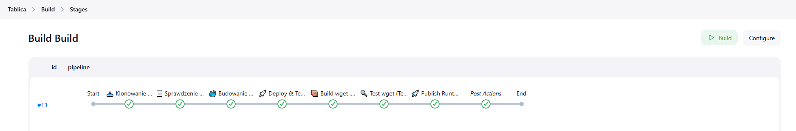

- Pełna treść Jenkinsfile'a:

```bash
pipeline {
    agent any

    environment {
        GIT_REPO = 'https://github.com/InzynieriaOprogramowaniaAGH/MDO2025_INO.git'
        BRANCH = 'JR414539'
        DOCKERFILE_PATH = 'ITE/GCL06/JR414539/Sprawozdanie1/Dockerfile.build'
        DOCKER_CONTEXT = 'ITE/GCL06/JR414539/Sprawozdanie1'
        DOCKER_IMAGE = 'wget-jenkins-build'
        DEPLOY_IMAGE = 'wget-deploy-test'
        TEST_IMAGE = 'wget-tester'
    }

    stages {
        stage('📥 Klonowanie repozytorium') {
            steps {
                git branch: "${BRANCH}", url: "${GIT_REPO}"
            }
        }

        stage('📄 Sprawdzenie Dockerfile') {
            steps {
                sh "ls -la ${DOCKER_CONTEXT}"
                sh "cat ${DOCKERFILE_PATH}"
            }
        }

        stage('🐳 Budowanie obrazu Dockera') {
            steps {
                sh "docker build --no-cache -t ${DOCKER_IMAGE} -f ${DOCKERFILE_PATH} ${DOCKER_CONTEXT}"
            }
        }

        stage('🚀 Deploy & Test wget') {
            steps {
                echo 'Buduję deploy-image do testu wget'
                sh "docker build --no-cache -t ${DEPLOY_IMAGE} -f ITE/GCL06/JR414539/Sprawozdanie2/Dockerfile_deploy ITE/GCL06/JR414539/Sprawozdanie2"
                echo 'Odpalam kontener i testuję wget'
                sh "docker run --rm ${DEPLOY_IMAGE}"
            }
        }
        
        stage('📦 Build wget .deb package') {
           steps {
                echo 'Buduję paczkę wget.deb'
                sh 'docker create --name wget-builder ${DOCKER_IMAGE}'
                sh 'docker cp wget-builder:/opt/wget/wget_1.0-1_amd64.deb wget.deb'
                sh 'docker rm wget-builder'
                archiveArtifacts artifacts: 'wget.deb', fingerprint: true
            }
        }
        
        stage('🔍 Test wget (Tester)') {
           steps {
                echo 'Buduję obraz tester-a'
                sh "docker build --no-cache -t ${TEST_IMAGE} -f ITE/GCL06/JR414539/Sprawozdanie2/Dockerfile.test ITE/GCL06/JR414539/Sprawozdanie2"
                echo 'Odpalam testy wget'
                sh "docker run --rm ${TEST_IMAGE}"
            }
        }
        
        stage('🚀 Publish Runtime Image') {
           steps {
                echo 'Kopiuję wget.deb do katalogu Sprawozdanie2'
                sh 'cp wget.deb ITE/GCL06/JR414539/Sprawozdanie2/'
                echo 'Buduję runtime image z wget'
                sh 'docker build --no-cache -t wget-runtime -f ITE/GCL06/JR414539/Sprawozdanie2/Dockerfile.runtime ITE/GCL06/JR414539/Sprawozdanie2'
                echo 'Odpalam kontener runtime z wget'
                sh 'docker run --rm wget-runtime'
            }
        }

    }

    post {
        success {
            echo '✅ Pipeline zakończony sukcesem.'
        }
        failure {
            echo '❌ Pipeline zakończył się błędem.'
        }
    }
}
```

- **Cały pipeline wykonał się pomyślnie, poniżej znajduje się zrzut ekranu oraz logi z konsoli:**

- **!Ponadto, sprawdziłem i pipeline działa prawidłowo po wykonaniu ponownie. Zatem mój pipeline zawiera poprawny i powtarzalny krok Build, Test, Deploy oraz Publish.!**

Pierwsze uruchomienie ostatecznej wersji pipeline'a: 

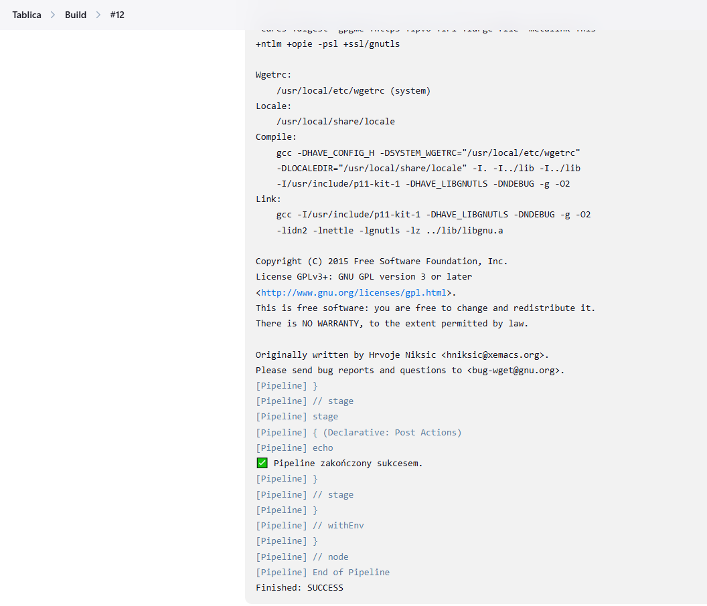

[Pełny log z konsoli pierwszego, pełnego builda z wszystkimi etapami - plik #12.txt](zrzuty_ekranu_sprawozdanie_2/#12.txt)

Drugie uruchomienie ostatecznej wersji pipeline'a: 

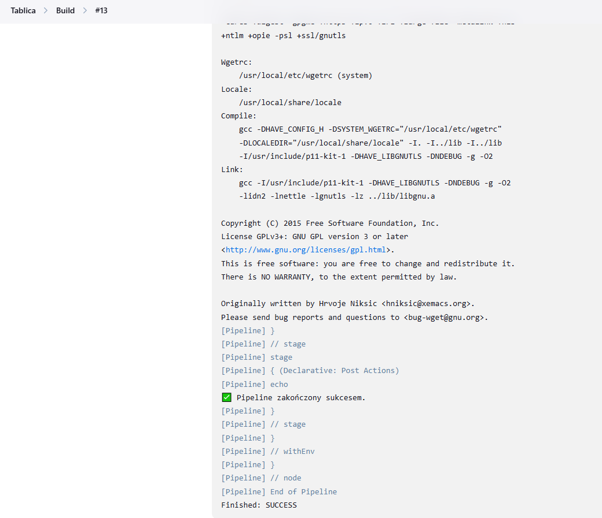

[Pełny log z konsoli drugiego, pełnego builda z wszystkimi etapami - plik #13.txt](zrzuty_ekranu_sprawozdanie_2/#13.txt)

- **Zrzut ekranu potwierdzający pomyślną archiwizację pliku .deb w Jenkinsie:**

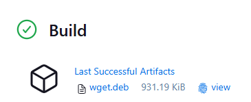

- Dla pewności dostałem się do kontenera jenkins-blueocean za pomocą polecenia:

```bash
docker exec -it jenkins-blueocean bash
```

- Następnie sprawdziłem listę dostępnych obrazów Docker-a:

```bash
docker images
```

- Na liście pojawiły się obrazy:

  - wget-runtime,

  - wget-tester,

  - wget-jenkins-build,

  - wget-deploy-test

Pliku wget.deb nie było w katalogu głównym kontenera, dlatego uruchomiłem obraz wget-jenkins-build w trybie interaktywnym:

```bash
docker run -it wget-jenkins-build bash
```

- Wylądowałem na właściwej ścieżce: /opt/wget

- Sprawdziłem, czy paczka .deb faktycznie się utworzyła za pomocą poniższej komendy:

```bash
ls -lh *.deb
```

- Zrzut ekranu pokazujący wynik powyższych poleceń:

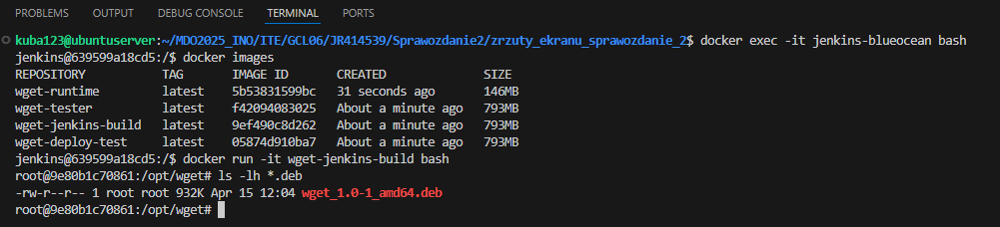

Zatem paczka została poprawnie zbudowana i znajduje się wewnątrz katalogu /opt/wget. Dodatkowo pipeline skopiował ją poza kontener i zarchiwizował automatycznie w Jenkinsie (GUI) jako Artifacts — dzięki temu można ją pobrać bezpośrednio z przeglądarki po zakończonym buildzie.

---

# **Etap Publish - Uruchomienie obrazu runtime (upewnienie się czy wszystko działa poprawnie)**

W ramach ostatniego etapu pipeline'a przygotowałem obraz runtime — służący do finalnego uruchomienia programu wget bez zbędnych narzędzi developerskich (np. bez gcc, make itd.). Sprawdzę czy aby na pewno działa poprawnie.

- Wejście do kontenera Jenkins-a:

```bash
docker exec -it jenkins-blueocean bash
```

- Sprawdzenie dostępnych obrazów:

```bash
docker images
```

Dostałem takie same obrazy jak wcześniej

- Uruchomiłem finalny runtime:

```bash
docker run --rm wget-runtime
```

- Po odpaleniu kontenera na stdout wyświetliła się informacja o zbudowanej i zainstalowanej wersji wget:

```bash
GNU Wget 1.24.5.22-8775 built on linux-gnu.
```

- Widać zatem, że:  

  - Wersja wget została poprawnie zbudowana i działa. 

  - Komenda wget jest dostępna w środowisku runtime.

  - Obraz jest lekki (146 mb) w porównaniu do build/test (793MB)

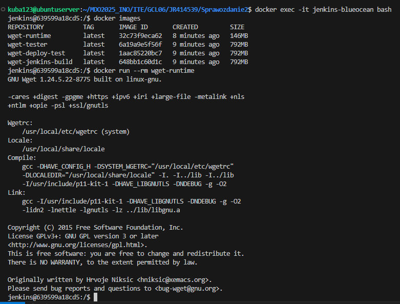

---

# **Porównanie podejść DIND vs Kontener CI**

- Podejście 1: DIND (Docker-in-Docker):

  - Jenkins działa w kontenerze, ale dodatkowo korzysta z osobnego kontenera docker:dind, który działa jako demon Dockera.

  - Dzięki temu pipeline ma pełną możliwość wykonywania poleceń Dockera takich jak: docker build, docker run, docker cp, docker images itd.

  - Rozwiązanie to jest bardziej elastyczne i umożliwia dynamiczne budowanie, uruchamianie i kopiowanie plików pomiędzy kontenerami.

  - Wadą jest bardziej skomplikowana konfiguracja — trzeba przygotować dodatkowe uprawnienia i podłączenie Dockera do Jenkinsa.

- Podejście 2: Kontener CI (statyczny):

  - Każdy etap pipeline działa w, z góry przygotowanym obrazie Dockera.

  - Jenkins nie posiada dostępu do Dockera — nie da się budować obrazów ani dynamicznie odpalać nowych kontenerów.

  - Rozwiązanie jest prostsze w konfiguracji, ale mniej elastyczne — ogranicza możliwości pipeline’a tylko do tego, co jest już w obrazie.

- W moim projekcie zdecydowałem się na podejście DIND (Docker-in-Docker), ponieważ:

  - Każdy etap pipeline’a wymagał dynamicznego budowania obrazów Dockera (np. Dockerfile.build, Dockerfile.test, Dockerfile.deploy, Dockerfile.runtime).

  - Musiałem kopiować artefakty (pakiet wget.deb) z wnętrza kontenera do hosta Jenkinsa (docker cp).

  - Potrzebowałem uruchamiać testy i sprawdzać logi wewnątrz kontenerów.

  - Ostatecznie budowany artefakt .deb był instalowany i testowany w runtime image, co wymagało wsparcia pełnego Dockera.

  - Podejście CI (statyczne) byłoby w naszym przypadku niewystarczające i nie dałoby się zrealizować pełnego procesu CI/CD dla wget.

---

# **Uzasadnienie i omówienie kroku Deploy dla aplikacji wget**

W przypadku projektu wget krok Deploy został zrealizowany w bardzo uproszczonej i specyficznej formie.

- Zrobiłem tak, ponieważ:

  - Wget jest aplikacją typu CLI (Command Line Interface), a nie aplikacją webową czy serwerową.

  - Nie wystawia żadnego endpointu ani portu (brak np. API, brak usługi działającej w tle).

  - Zadaniem aplikacji wget jest pobieranie zasobów (plików, stron) z internetu, działając lokalnie na maszynie/kontenerze.

- U mnie krok Deploy wygląda tak:

  - Powstał dedykowany obraz Dockera: Dockerfile.deploy

  - Wewnątrz kontenera:

    - Instalowana była aplikacja wget zbudowana we wcześniejszym kroku.

    - Wykonywane było polecenie testowe: wget http://www.metal.agh.edu.pl czyli realne pobranie pliku ze strony AGH w celu sprawdzenia, czy aplikacja działa poprawnie.

  - Weryfikacja sukcesu odbywała się na podstawie wyjścia komendy wget:

    - Jeżeli program pobrał stronę i nie zwrócił błędów - Deploy = SUKCES.

    - W przeciwnym razie - Pipeline FAIL.

- Według mnie taka forma Deploy jest jak najbardziej dopuszczalna ze względu na to, że:

  - Wget nie wymaga konfiguracji serwera ani wystawiania usługi.

  - Uruchomienie komendy wget w kontenerze symuluje prawdziwe użycie programu przez użytkownika.

  - Wget nie słucha na żadnym porcie — działa lokalnie. 

  - Pipeline sam buduje, testuje i deployuje aplikację, bez interakcji ręcznej.

---

# **Uzasadnienie i omówienie kroku Publish dla aplikacji wget**

  W przypadku projektu wget krok Publish został zrealizowany poprzez przygotowanie paczki instalacyjnej .deb oraz obrazu runtime.

- Zrobiłem tak, ponieważ: 

  - Wget jest klasycznym programem systemowym — najlepiej nadaje się do dystrybucji jako pakiet instalacyjny (.deb w przypadku Ubuntu).

  - Dzięki temu możliwa jest jego instalacja w środowiskach produkcyjnych za pomocą standardowego dpkg -i wget.deb.

  - Dodatkowo powstał obraz runtime — kontener zawierający tylko:

    - Gotowy program wget.

    - Niezbędne zależności.

    - Bez zbędnych plików builda i środowiska developerskiego.

- U mnie krok Publish wygląda tak:

  - Przy pomocy narzędzia checkinstall utworzono plik wget_1.0-1_amd64.deb bezpośrednio z kodu źródłowego aplikacji.

  - Paczka wget.deb została zarchiwizowana jako Artifact w Jenkinsie, widoczna do pobrania z GUI po udanym pipeline.

  - Plik .deb został automatycznie kopiowany do katalogu projektu w repozytorium (Sprawozdanie2) w kroku Publish.

  - Powstał osobny obraz Docker wget-runtime z zainstalowanym wgetem na bazie paczki .deb.

  - Obraz runtime został uruchomiony i zweryfikowano działanie wget'a poprzez wyświetlenie informacji o wersji i możliwościach programu.

- Według mnie taka forma Publish jest jak najbardziej dopuszczalna ze względu na to, że:

  - Paczka .deb to standardowy format instalacyjny dla Linuksa.

  - Plik .deb można łatwo pobrać z Jenkinsa lub repozytorium i zainstalować komendą dpkg -i.

  - Lekki obraz Docker runtime tylko z wgetem, bez narzędzi developerskich — gotowy do użycia produkcyjnego.

  - Obraz runtime można wysłać np. do Docker Registry i używać w środowisku produkcyjnym.

---

# **Maintainability**

W projekcie wget zadbano o odporność rozwiązania na awarie oraz łatwość ponownego użycia i utrzymania poprzez kilka istotnych założeń projektowych w pipeline’ie:

- **Odporność na awarie**:

  - Podział na etapy (stages): Pipeline został podzielony na logiczne kroki (Clone, Check, Build, Deploy and Test, Build/Publish paczki, Test, Publish Runtime) — co pozwala na łatwe diagnozowanie, który krok się nie powiódł.

  - Deklaratywna struktura Jenkinsfile: Użycie pipeline {} z blokiem post pozwala na wykonanie odpowiednich akcji w razie sukcesu lub błędu.

  - Krok post { failure { ... } }: W przypadku niepowodzenia pojawia się czytelny komunikat w logach, umożliwiający szybką reakcję.

- **Możliwość częściowego/powtórnego uruchomienia**:

  - Jenkins umożliwia uruchomienie pipeline’u od dowolnego etapu (stage) — w razie potrzeby można np. powtórzyć tylko testy lub etap publikacji, bez konieczności przebudowy wszystkiego.

  - W przypadku błędów, artefakty (np. .deb) nie są tracone — są archiwizowane i można ich użyć ponownie bez pełnego przebudowywania.

  - Skrypt pipeline’u można łatwo edytować i wersjonować (plik Jenkinsfile znajduje się w repozytorium).

- **Sprawdzalność i poprawność kodu**:

  - Zbudowany kod źródłowy wget jest testowany dwukrotnie:

    - raz przy budowie paczki .deb (checkinstall w etapie Build),

    - drugi raz przy uruchomieniu testów jednostkowych i fuzzingowych (make check w etapie Test).

  - Wszystkie testy przeszły pomyślnie, co jest potwierdzone w logach pipeline’u Jenkins.

  - Dodatkowo, test funkcjonalny wget (pobieranie strony AGH) w kroku Deploy potwierdza, że program działa zgodnie z oczekiwaniami po instalacji z paczki.

- **Wersjonowanie i reużywalność**:

  - Obrazy Docker są tworzone z unikalnymi nazwami (wget-jenkins-build, wget-deploy-test, wget-tester, wget-runtime), co ułatwia kontrolę wersji.

  - Pliki Dockerfile są rozdzielone wg funkcjonalności, dzięki czemu łatwo je modyfikować niezależnie:

    - Dockerfile.build,

    - Dockerfile.test,

    - Dockerfile.deploy,

    - Dockerfile.runtime.

Warto też dodać, że od poprzedniego sprawozdania poprawiłem Dockerfile.build oraz Dockerfile.test na potrzeby tych zajęć(Ikonki zrobił mi chat gpt):

- Aktualny Dockerfile.build:

```bash
FROM ubuntu:22.04

RUN apt update && apt install -y \
    build-essential \
    autoconf \
    automake \
    autopoint \
    texinfo \
    flex \
    gperf \
    gettext \
    libssl-dev \
    libgnutls28-dev \
    zlib1g-dev \
    pkg-config \
    git \
    wget \
    autoconf-archive \
    ca-certificates \
    checkinstall

WORKDIR /opt

RUN git clone https://github.com/mirror/wget.git

WORKDIR /opt/wget

RUN ./bootstrap && ./configure && make && \
    checkinstall --install=no \
                 --pkgname=wget \
                 --pkgversion=1.0 \
                 --pkgarch=amd64 \
                 --pkgrelease=1 \
                 --maintainer="JR414539@student.agh.edu.pl" \
                 --fstrans=no \
                 --pakdir=/opt/wget \
                 -y

CMD ["/bin/bash"]
```

- Aktualny Dockerfile.test:

```bash
FROM wget-jenkins-build

WORKDIR /opt/wget

CMD ["make", "check"]
```

- Aktualny Dockerfile_deploy:

```bash
FROM wget-jenkins-build

CMD ["wget", "http://www.metal.agh.edu.pl", "-O", "-"]
```

- Aktualny Dockerfile_jenkins:

```bash
FROM jenkins/jenkins:2.492.3-jdk17
USER root
RUN apt-get update && apt-get install -y lsb-release ca-certificates curl && \
    install -m 0755 -d /etc/apt/keyrings && \
    curl -fsSL https://download.docker.com/linux/debian/gpg -o /etc/apt/keyrings/docker.asc && \
    chmod a+r /etc/apt/keyrings/docker.asc && \
    echo "deb [arch=$(dpkg --print-architecture) signed-by=/etc/apt/keyrings/docker.asc] \
    https://download.docker.com/linux/debian $(. /etc/os-release && echo \"$VERSION_CODENAME\") stable" \
    | tee /etc/apt/sources.list.d/docker.list > /dev/null && \
    apt-get update && apt-get install -y docker-ce-cli && \
    apt-get clean && rm -rf /var/lib/apt/lists/*
USER jenkins
RUN jenkins-plugin-cli --plugins "blueocean docker-workflow"

```

- Aktualny Dockerfile.runtime:

```bash
FROM ubuntu:22.04

WORKDIR /opt

COPY wget.deb /opt/wget.deb

RUN apt update && apt install -y ca-certificates && \
    dpkg -i /opt/wget.deb || apt-get install -f -y && \
    rm -f /opt/wget.deb

CMD ["wget", "--version"]
```

- Aktualny Jenkinsfile:

```bash
pipeline {
    agent any

    environment {
        GIT_REPO = 'https://github.com/InzynieriaOprogramowaniaAGH/MDO2025_INO.git'
        BRANCH = 'JR414539'
        DOCKERFILE_PATH = 'ITE/GCL06/JR414539/Sprawozdanie1/Dockerfile.build'
        DOCKER_CONTEXT = 'ITE/GCL06/JR414539/Sprawozdanie1'
        DOCKER_IMAGE = 'wget-jenkins-build'
        DEPLOY_IMAGE = 'wget-deploy-test'
        TEST_IMAGE = 'wget-tester'
    }

    stages {
        stage('📥 Klonowanie repozytorium') {
            steps {
                git branch: "${BRANCH}", url: "${GIT_REPO}"
            }
        }

        stage('📄 Sprawdzenie Dockerfile') {
            steps {
                sh "ls -la ${DOCKER_CONTEXT}"
                sh "cat ${DOCKERFILE_PATH}"
            }
        }

        stage('🐳 Budowanie obrazu Dockera') {
            steps {
                sh "docker build --no-cache -t ${DOCKER_IMAGE} -f ${DOCKERFILE_PATH} ${DOCKER_CONTEXT}"
            }
        }

        stage('🚀 Deploy & Test wget') {
            steps {
                echo 'Buduję deploy-image do testu wget'
                sh "docker build --no-cache -t ${DEPLOY_IMAGE} -f ITE/GCL06/JR414539/Sprawozdanie2/Dockerfile_deploy ITE/GCL06/JR414539/Sprawozdanie2"
                echo 'Odpalam kontener i testuję wget'
                sh "docker run --rm ${DEPLOY_IMAGE}"
            }
        }
        
        stage('📦 Build wget .deb package') {
           steps {
                echo 'Buduję paczkę wget.deb'
                sh 'docker create --name wget-builder ${DOCKER_IMAGE}'
                sh 'docker cp wget-builder:/opt/wget/wget_1.0-1_amd64.deb wget.deb'
                sh 'docker rm wget-builder'
                archiveArtifacts artifacts: 'wget.deb', fingerprint: true
            }
        }
        
        stage('🔍 Test wget (Tester)') {
           steps {
                echo 'Buduję obraz tester-a'
                sh "docker build --no-cache -t ${TEST_IMAGE} -f ITE/GCL06/JR414539/Sprawozdanie2/Dockerfile.test ITE/GCL06/JR414539/Sprawozdanie2"
                echo 'Odpalam testy wget'
                sh "docker run --rm ${TEST_IMAGE}"
            }
        }
        
        stage('🚀 Publish Runtime Image') {
           steps {
                echo 'Kopiuję wget.deb do katalogu Sprawozdanie2'
                sh 'cp wget.deb ITE/GCL06/JR414539/Sprawozdanie2/'
                echo 'Buduję runtime image z wget'
                sh 'docker build --no-cache -t wget-runtime -f ITE/GCL06/JR414539/Sprawozdanie2/Dockerfile.runtime ITE/GCL06/JR414539/Sprawozdanie2'
                echo 'Odpalam kontener runtime z wget'
                sh 'docker run --rm wget-runtime'
            }
        }

    }

    post {
        success {
            echo '✅ Pipeline zakończony sukcesem.'
        }
        failure {
            echo '❌ Pipeline zakończył się błędem.'
        }
    }
}
```

---

# **Lista kontrolna - Zajęcia 6** 

- ✔ Aplikacja została wybrana
  - → Wybrano program wget z publicznego repozytorium: https://github.com/mirror/wget

- ✔ Licencja potwierdza możliwość swobodnego obrotu kodem
  - → wget udostępniany jest na licencji GPLv3 — zgodnej z wymogami akademickimi i open source.

- ✔ Wybrany program buduje się
  - → Kompilacja przebiega w kontenerze wget-jenkins-build, zgodnie z Dockerfile.build.

- ✔ Przechodzą dołączone do niego testy
  - → Etap tester wykonuje make check w kontenerze tester — testy przechodzą (0 błędów, 1 SKIP).

- ✔ Zdecydowano, czy jest potrzebny fork repozytorium
  - → Nie wykonano forka – repozytorium przedmiotowe MDO2025_INO posiada uprawnienia do pushowania gałęzi osobistych.

- ✔ Stworzono diagram UML zawierający planowany proces CI/CD
  - → Stworzono diagram aktywności oraz diagram wdrożeniowy w Visual Paradigm Community Edition.

- ✔ Wybrano kontener bazowy lub stworzono odpowiedni kontener wstępny
  - → Jako bazę użyto ubuntu:22.04, uzupełniono o narzędzia do budowy (autotools, checkinstall, itp.).

- ✔ Build został wykonany wewnątrz kontenera
  - → Komenda docker build uruchamiana przez Jenkins w osobnym etapie pipeline’a.

- ✔ Testy zostały wykonane wewnątrz kontenera (kolejnego)
  - → wget-tester to osobny obraz, uruchamiany w dedykowanym kroku testującym.

- ✔ Kontener testowy oparty o kontener build
  - → Dockerfile.test bazuje na wget-jenkins-build (FROM wget-jenkins-build).

- ✔ Logi z procesu są odkładane jako numerowany artefakt
  - → Logi widoczne w Jenkinsie w GUI i zarchiwizowane dzięki archiveArtifacts.

- ✔ Zdefiniowano kontener typu 'deploy'
  - → wget-deploy-test sprawdza działanie wget na stronie metal.agh.edu.pl.

- ✔ Uzasadniono, że buildowy kontener nie nadaje się do deploya
  - → Stworzono Dockerfile.deploy z uproszczonym środowiskiem, tylko z wget.

- ✔ Wersjonowany kontener 'deploy' jest wdrażany na instancję Dockera
  - → Obraz deploy budowany dynamicznie i uruchamiany w kontenerze z pipeline.

- ✔ Następuje weryfikacja działania aplikacji (smoke test)
  - → wget uruchamiany z adresem metal.agh.edu.pl, potwierdzenie 200 OK w logach.

- ✔ Zdefiniowano element publikowany jako artefakt
 - → wget_1.0-1_amd64.deb generowany i publikowany jako artefakt w Jenkins GUI.

- ✔ Uzasadniono wybór formy publikacji
  - → Plik .deb to forma redystrybucyjna zgodna z systemami opartymi na Debianie.

- ✔ Opisano proces wersjonowania artefaktu
  - → Nazwa pliku zawiera wersję 1.0-1, co odpowiada semantycznemu oznaczeniu.

- ✔ Dostępność artefaktu (publikacja)
  - → Artefakt dostępny w Jenkins GUI, w zakładce Artifacts — do pobrania.

- ✔ Zidentyfikowano pochodzenie artefaktu
  - → Pipeline pokazuje dokładnie, z którego commita i branch pipeline został uruchomiony.

- ✔ Dockerfile i Jenkinsfile dostępne w sprawozdaniu
  - → Dołączone jako osobne pliki .md + obecne w repozytorium (gałąź JR414539).

---

# **Ocena postępu prac na podstawie Jenkinsfile - Zajęcia 7** 

- ✔ Przepis dostarczany z SCM (a nie wklejony w UI)
  - → Jenkinsfile znajduje się w repozytorium MDO2025_INO, w katalogu ITE/GCL06/JR414539/Sprawozdanie2. Pipeline korzysta z deklaratywnej formy i pipeline script from SCM.

- ✔ Posprzątaliśmy i odbyło się to skutecznie
  - → Każdy etap działa niezależnie, zasoby są usuwane (docker rm), buildy są czyste, artefakty archiwizowane. Obrazy są czytelnie wersjonowane (wget-jenkins-build, wget-tester, wget-runtime).

- ✔ Etap Build dysponuje repozytorium i plikami Dockerfile
  - → W kroku Klonowanie repozytorium pobierane jest repo MDO2025_INO, a następnie ls -la i cat sprawdzają obecność Dockerfile.build.

- ✔ Etap Build tworzy obraz buildowy (BLDR)
  - → wget-jenkins-build tworzony przez docker build w etapie 🐳 Budowanie obrazu Dockera.

- ✔ Etap Build lub osobny krok tworzy artefakt
  - → Osobny etap 📦 Build wget .deb package tworzy .deb, wyciąga z kontenera i archiwizuje (archiveArtifacts).

- ✔ Etap Test przeprowadza testy
  - → 🔍 Test wget (Tester) buduje osobny obraz wget-tester na bazie obrazu buildowego, odpala make check. Logi testów widoczne w Jenkinsie, testy przechodzą.

- ✔ Etap Deploy przygotowuje artefakt lub obraz do wdrożenia
  - → Etap 🚀 Deploy & Test wget buduje wget-deploy-test, który instaluje wget i wykonuje smoke test (wget http://www.metal.agh.edu.pl).

- ✔ Etap Deploy przeprowadza wdrożenie (uruchomienie kontenera)
  - → W docker run --rm wget-deploy-test wykonywane jest wdrożenie integracyjne (smoke test).

- ✔ Etap Publish dodaje artefakt lub publikuje obraz
  - → Etap 🚀 Publish Runtime Image tworzy finalny obraz wget-runtime, do którego dołączany jest .deb. Następuje jego instalacja i uruchomienie wget – potwierdzona poprawna instalacja i uruchomienie.

- ✔ Ponowne uruchomienie pipeline’u pracuje na świeżym kodzie
  - → Każde uruchomienie zaczyna od git checkout branch JR414539, a Dockerfile.build klonuje źródła wget z GitHub. Nie korzystamy z cache, dzięki czemu budujemy zawsze aktualny stan.

- ✔ Zweryfikowano zgodność UML z pipeline
  - → Diagramy, które zrobiłem na początku niestety nie oddały dobrze całokształtu mojego projektu, szczególnie diagram aktywności (nie wiedziałem wtedy za bardzo jak publish zorbić itd). Opiszę tutaj co bym zmienił teraz w tych diagramach:

  - Diagram aktywności:

    - Przede wszystkim brakuje dokładniejszego rozbicia:

      - Po Build docker image powinno być np. jeszcze:

        - docker create

        - docker cp wget.deb

        - docker rm

        - docker build deploy

        - docker run deploy

        - docker build test

        - docker run test

    - Dodałbym jeszcze oczywiście Publish:

      - Kopiowanie .deb

      - Budowa runtime image

      - Odpalenie runtime i sprawdzenie wget

  - Diagram wdrożeniowy:

    - Na pewno brakuje reszty obrazów: 

      - wget-jenkins-build

      - wget-deploy-test

      - wget-tester

      - wget-runtime

    - Można by było jeszcze pokazać:

      - Jenkins korzysta z Dockerfile.build, ale potem:

        - Tworzy plik wget.deb

        - Buduje deploy-image

        - Buduje test-image

        - Buduje runtime-image

  - Na koniec, przy GitHubie dobrze by było napisać, że Jenkins klonuje cały projekt (nie tylko Dockerfile.build).

  Udało mi się tak poprawić te diagramy:

  - Diagram aktywności:

  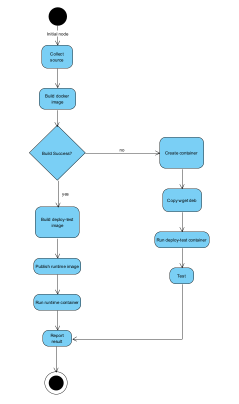

  - Diagram wdrożeniowy:

  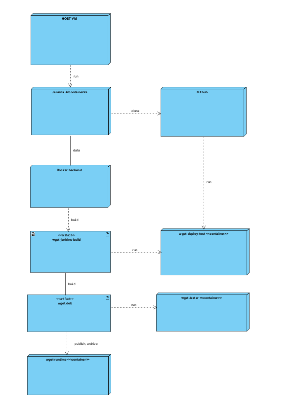

Dodałem plik z diagramami .vpp napisany w visual paradigm community edition na repozytorium (gałąź JR414539).

---

# **Definition of Done – ocena końcowego efektu** 

- Artefakt (wget_1.0-1_amd64.deb) powstaje automatycznie i jest zarchiwizowany przez Jenkinsa.

- Można go pobrać z GUI Jenkinsa i zainstalować w systemie opartym o Debiana/Ubuntu za pomocą dpkg -i.

- Obraz wget-runtime jest zbudowany z użyciem .deb i uruchamia wget — zawiera tylko to, co potrzebne do działania.

- Obraz może być uruchomiony na dowolnym systemie z Dockerem bez dodatkowej konfiguracji.

- Pipeline działa całkowicie automatycznie — spełnia założenia CI/CD.

---