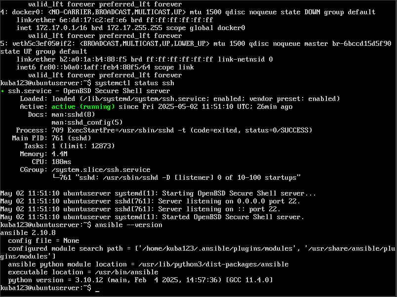
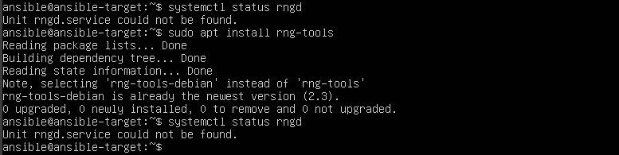
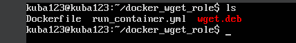
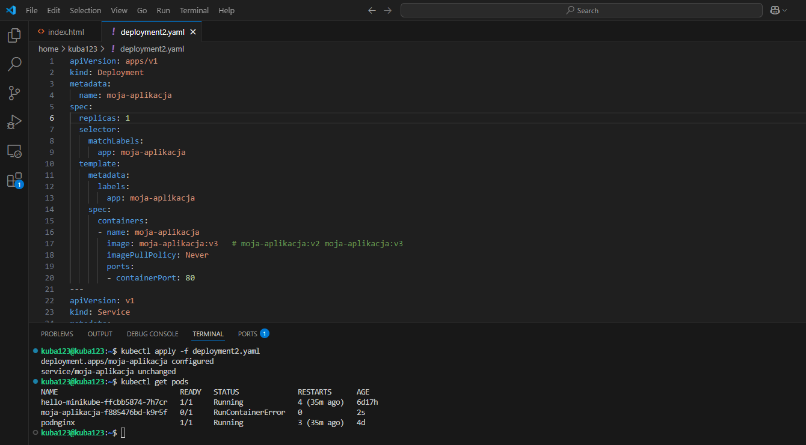
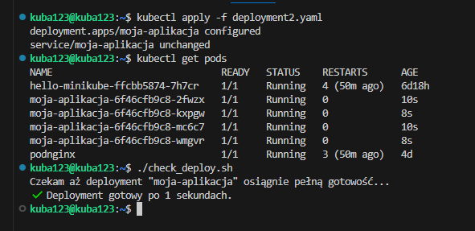

# Sprawozdanie 3 - Poznawanie Ansible, kickstart oraz kubernetes

---

# **Cel** 

---

**Celem ćwiczeń było nauczenie się podstaw ansible, kickstart oraz kubernetes**

---

# **Automatyzacja i zdalne wykonywanie poleceń za pomocą Ansible** 

---

## **Instalacja zarządcy Ansible**

Na początku utworzyłem drugą maszynę wirtualną z takim samym systemem jak maszyna głowna(UbuntuServer):
  - Zapewniłem obecność programu tar oraz serwera OpenSSH(podczas instalacji)
  - Nadałem maszynie hostname ansible-target(podczas instalacji)
  - Utworzyłem uzytkownika ansible(podczas instalacji)
  - Zrobiłem migawkę maszyny po instalacji


Na głównej maszynie wirtualnej(UbuntuServer) zainstalowałem oprogramowanie Ansible



Wymieniłem klucze SSH między użytkownikiem w głównej maszynie wirtualnej, a użytkownikiem ansible z nowej tak, by logowanie ssh ansible@ansible-target nie wymagało podania hasła.

Żeby to zrobić, najpierw użyłem komendy:

```bash
ssh-keygen -t ed25519 -f ~/.ssh/id_ansible -C" "ansible" -N ""
```
by wygenerować klucz ssh o id_ansible oraz bez proszenia o passphrase.

Następnie użyłem poniższej komendy:

```bash
ssh-copy-id -i ~/.ssh/id_ansible.pub ansible@ansible-target 
```


by skopiować ten klucz na maszynę drugą (ansible-target)

Dla pewności jeszcze ustawiłem poprawne nazwy hostów na obu maszynach za pomocą komendy:

```bash
sudo hostnamectl set-hostname kuba123/ansible-target
```


Połączenie ssh przebiegło pomyślnie


## **Inwentaryzacja**

Dokonałem inwentaryzacji systemów:
  - Ustaliłem przewidywalne nazwy komputerów (maszyn wirtualnych) stosując hostnamectl(pokazałem wcześniej).
  - Wprowadziłem nazwy DNS dla maszyn wirtualnych, edytując /etc/hosts - tak, aby możliwe było wywoływanie komputerów za pomocą nazw, a nie tylko adresów IP.
  - Plik /etc/hosts:
    


  - Zweryfikowałem łączność za pomocą komend:
```bash
ping ansible-target
```
```bash
ping kuba123
```


  - Stworzyłem plik inwenatryzacji
  - W sekcjach Orchestrators oraz Endpoints umieściłem nazwy moich maszyn wirtualnych w odpowiednich miejscach


  - Użyłem dwóch maszyn wirtualnych
  - Upewniłem się, że łączność SSH między maszynami jest możliwa i nie potrzebuje haseł


  - Edytowałme jeszcze plik /home/ansible/.ssh/config


  - Wysłałem żądanie ping do wszystkich maszyn


## **Zdalne wywoływanie procedur**

Za pomocą playbooka Ansible:
  - Wysłałem żądanie ping do wszystkich maszyn


  - Skopiowałem plik inwentaryzacji na maszynę Endpoints za pomocą komendy:

```bash
ansible -i inventory.ini ansible-target -m copy -a "src=inventory.ini dest=/home/ansible/inventory.ini"
```


Następnie stworzyłem plik ping.yml, aby:
  - Zaktualizować pakiety w systemie
  - Zrestartować usługi  sshd i rngd

Ale najpierw zauważyłem, że nie mam usługi rngd na maszynie ansible-target. Zatem zainstalowałem ją i sprawdziłem jak się nazywa, żeby dobrą nazwę wpisać w pliku ping.yml




Plik inventory.ini:

```bash
[Orchestrators]
kuba123 ansible_host=kuba123 ansible_user=kuba123 ansible_ssh_private_key_file=~/.ssh/id_ansible

[Endpoints]
ansible-target ansible_host=ansible-target ansible_user=ansible ansible_ssh_private_key_file=~/.ssh/id_ansible
```

Plik ping.yml

```bash
- name: Ping all endpoints
  hosts: Endpoints
  tasks:
    - name: Ping
      ansible.builtin.ping:

- name: Update all packages
  hosts: Endpoints
  become: yes
  tasks:
    - name: Apt update
      ansible.builtin.apt:
        update_cache: yes
        upgrade: dist

- name: Restart services
  hosts: Endpoints
  become: yes
  tasks:
    - name: Restart sshd
      ansible.builtin.service:
        name: ssh
        state: restarted

    - name: Restart rng-tools-debian
      ansible.builtin.service:
        name: rng-tools-debian
        state: restarted

- name: Copy inventory to endpoint
  hosts: Endpoints
  become: yes
  tasks:

- name: Ensure /home/ansible directory exists
  ansible.builtin.file:
    path: /home/ansible
    state: directory
    owner: ansible
    group: ansible
    mode: '0755'

- name: Copy inventory
  ansible.builtin.copy:
    src: ./inventory.ini
    dest: /home/ansible/inventory.ini
    owner: ansible
    group: ansible
    mode: '0644'
```

Efekt po wykonaniu komendy:

```bash
ansible-playbook -i inventory.ini ping.yml
```


Przeprowadziłem 2 testy względem maszyny:
  - z wyłączonym serwerem SSH


    
  - z odpiętą kartą sieciową


## **Zarządzanie stworzonym artefaktem**

Moim artefaktem z pipeline'u był plik binarny (wget.deb), zatem:
  - Pobrałem plik aplikacji na zdalną maszynę z dysku google za pomocą komendy:

```bash
wget --no-check-certificate "LINK DO DYSKU" -O wget.deb
```


  - Stworzyłem kontener run_container.yml oraz Dockerfile przeznaczony do uruchomienia aplikacji
  - run_container.yml:

```bash
- name: Build and run container with wget.deb
  hosts: Endpoints
  become: yes
  tasks:
    - name: Copy Dockerfile and wget.deb to target
      ansible.builtin.copy:
        src: "Dockerfile"
        dest: /opt/docker/Dockerfile
        mode: '0644'
      with_items:
        - ../wget.deb
        - Dockerfile

    - name: Install Docker SDK for Python
      ansible.builtin.pip:
        name: docker
        executable: pip3

    - name: Build docker image
      community.docker.docker_image:
        name: custom_wget
        tag: latest
        build:
          path: /opt/docker
          source: build

    - name: Run wget container
      community.docker.docker_container:
        name: wget_test
        image: custom_wget:latest
        state: started
        recreate: true
        pull: false
```

  - Dockerfile:

```bash
FROM ubuntu:22.04
RUN apt-get update && apt-get install -y gdebi-core
COPY wget.deb /tmp/wget.deb
RUN gdebi -n /tmp/wget.deb || apt-get install -f -y
CMD ["wget", "--version"]
```
    
Niestety nie udało mi się do końca uruchomić tej aplikajci. Próbowałem na różne sposoby, z błedu wynika że po prostu nie zdajduje pliku wget.deb. Jednak run_container.yml, Dockerfile i wget.deb są w tym samym katalogu, więc nie ma to sensu. Pomyślałem, że może ten wget.deb jest jakiś stary, ale nawet jak pobrałem nową wersję wgeta to i tak był ten błąd. Ostatniego taska nie może zrobić: 


Oczywiście zainstalowałem zależnosci, Pythona, dockera itd.




Jak stworzyłem obraz testwget to wget działa:


# **Pliki odpowiedzi dla wdrożeń nienadzorowanych** 

# **Cel** 

**Celem ćwiczenia było utworzenie źródła instalacji nienadzorowanej dla systemu operacyjnego hostującego nasze oprogramowanie oraz przeprowadzenie instalacji systemu, który po uruchomieniu rozpocznie hostowanie naszego programu**

## **Przygotowanie środowiska**

Z racji tego, że uzywałem wcześniej ubuntu, to musiłem zainstalować nową maszynę wirtualna Fedora. Użyłem obrazu: **Fedora-Server-netinst-x86_64-40-1.14.iso**

## **Pobranie pliku odpowiedzi (anaconda-ks.cfg)**

Z poprzedniej instalacji Fedory pobrałem plik /root/anaconda-ks.cfg za pomocą serwera HTTP:

```bash
python3 -m http.server 8000
```

Na hoście Windows uzyskałem dostęp do pliku przez:

```bash
http://192.168.56.1:8000/anaconda-ks.cfg
```


## **Modyfikacja pliku Kickstart**

W pliku anaconda-ks.cfg wprowadziłem następujące zmiany:
  - Dodanie repozytoriów:
    ```bash
    url --mirrorlist=http://mirrors.fedoraproject.org/mirrorlist?repo=fedora-40&arch=x86_64
    ```
     ```bash
    repo --name=updates --mirrorlist=http://mirrors.fedoraproject.org/mirrorlist?repo=updates-released-f40&arch=x86_64
     ```
  - Wymuszenie czyszczenia dysku:
    ```bash
    clearpart --all --initlabel
    ```
  - Nadanie hostowi nazwy:
    ```bash
    network --hostname=fedora-unattended
    ```
  - Dodanie wymaganych pakietów:
    ```bash
    %packages
    @^server-product-environment
    @core
    wget
    tar
    zstd
    %end
    ```
    
## **Konfiguracja działania aplikacji w %post**

Dodałem do sekcji %post polecenia umożliwiające:
  - Pobranie programu (plik wget.deb lub gotowy wget)
  - Rozpakowanie i przeniesienie do /usr/local/bin/
  - Stworzenie usługi systemd uruchamiającej program
  - Automatyczne jej włączenie po starcie systemu

Moja sekcja %post:
```bash
%post --log=/root/post-install.log
set -e

mkdir -p /opt/myapp
cd /opt/myapp

# Pobranie .deb
wget --timeout=10 --tries=2 http://192.168.56.1:8000/wget.deb -O wget.deb

ar x wget.deb
tar -xf data.tar.* || echo "Nie udalo sie rozpakowac data.tar"

# Szukamy binarki i kopiujemy
find . -type f -name 'wget' -executable -exec cp {} /usr/local/bin/myapp \;
chmod +x /usr/local/bin/myapp

cat <<EOF > /etc/systemd/system/myapp.service
[Unit]
Description=My custom app
After=network.target

[Service]
ExecStart=/usr/local/bin/myapp --version
Type=oneshot
RemainAfterExit=yes
Restart=no

[Install]
WantedBy=multi-user.target
EOF

systemctl enable myapp
%end
```

## **Uruchomienie instalacji nienadzorowanej**

- Uruchomiłem nową maszynę wirtualną i wystartowałem instalator Fedora z ISO
- W menu GRUB edytowałem wpis Install Fedora (kliknąłem e) i na końcu linii linux dodałem:
  ```bash
  inst.ks=http://192.168.56.1:8000/anaconda-ks.cfg
  ```
- Instalacja rozpoczęła się automatycznie i przebiegła bez ingerencji


## ** Weryfikacja po instalacji**

Po zainstalowaniu i restarcie:
  - Zalogowałem się na użytkownika kickstart
  - Sprawdziłem działanie usługi:
  ```bash
  systemctl status myapp
  ```
  ```bash
  journalctl -u myapp
  ```
  - Automatyczne Zweryfikowanie aplikacji:
  ```bash
  /usr/local/bin/myapp --version
  ```

Aplikacja uruchomiła się poprawnie, zakończyła działanie z kodem 0/SUCCESS, a systemctl wskazuje active (exited):


Zadanie zostało zrealizowane zgodnie z wytycznymi. System Fedora został zainstalowany nienadzorowanie, aplikacja została uruchomiona jako usługa systemd, a cały proces przebiegł automatycznie – bez ręcznej ingerencji po starcie maszyny.

Cały plik anaconda-ks.cfg:
  ```bash
  # Generated by Anaconda 40.22.3
# Generated by pykickstart v3.52
#version=DEVEL
# Use graphical install
graphical

url --mirrorlist=http://mirrors.fedoraproject.org/mirrorlist?repo=fedora-40&arch=x86_64
repo --name=updates --mirrorlist=http://mirrors.fedoraproject.org/mirrorlist?repo=updates-released-f40&arch=x86_64

# Keyboard layouts
keyboard --vckeymap=us --xlayouts='us'
# System language
lang en_US.UTF-8

%packages
@^server-product-environment
@core
wget
tar
zstd
%end

%post --log=/root/post-install.log
set -e

mkdir -p /opt/myapp
cd /opt/myapp

# Pobranie .deb
wget --timeout=10 --tries=2 http://192.168.56.1:8000/wget.deb -O wget.deb

ar x wget.deb
tar -xf data.tar.* || echo "Nie udalo sie rozpakowac data.tar"

# Szukamy binarki i kopiujemy
find . -type f -name 'wget' -executable -exec cp {} /usr/local/bin/myapp \;
chmod +x /usr/local/bin/myapp

cat <<EOF > /etc/systemd/system/myapp.service
[Unit]
Description=My custom app
After=network.target

[Service]
ExecStart=/usr/local/bin/myapp --version
Type=oneshot
RemainAfterExit=yes
Restart=no

[Install]
WantedBy=multi-user.target
EOF

systemctl enable myapp
%end

firstboot --enable

# Generated using Blivet version 3.9.1
ignoredisk --only-use=sda
autopart
# Partition clearing information
clearpart --all --initlabel

network --hostname=fedora-unattended

# System timezone
timezone Europe/Warsaw --utc

# Root password
rootpw --iscrypted $y$j9T$3ENGnB/ZtJrLAAHSCVo5iwlq$46iVnSs2dbU992wgrqk.BnJ/0Mgn5xKW0T0g7n0HoU3
user --groups=wheel --name=kickstart --password=$y$j9T$mCl6BCUxsWaW16WGxUxp8ukI$F8gsIf.mo3rFdOn4lZZiuHmPvZbz/tJL3ztg6uG2B41 --iscrypted --gecos="Kickstart"

reboot
  ```

# **Wdrażanie na zarządzalne kontenery: Kubernetes (1)** 

## **Instalacja klastra Kubernetes**

Proces rozpocząłem od pobrania i instalacji narzędzia Minikube, które umożliwia uruchomienie lokalnego klastra Kubernetes na moim systemie Ubuntu w architekturze amd64. Do pobrania instalatora wykorzystałem polecenie:

```bash
curl -LO https://storage.googleapis.com/minikube/releases/latest/minikube_latest_amd64.deb
```

a następnie zainstalowałem pakiet za pomocą:

```bash
sudo dpkg -i minikube_latest_amd64.deb
```


Po instalacji Minikube konieczne było uruchomienie usługi Docker, która pełni funkcję backendu kontenerowego dla klastra. W tym celu skorzystałem z komendy:

```bash
sudo systemctl start docker
```

Gdy Docker był już aktywny, przystąpiłem do inicjalizacji klastra Kubernetes lokalnie, korzystając z polecenia:

```bash
minikube start
```


Następnie utworzyłem alias do kubectl, który korzysta bezpośrednio z wersji dostarczanej przez Minikube. Dzięki temu mogłem wydawać polecenia kubectl bez konieczności instalowania go osobno.

```bash
alias kubectl="minikube kubectl --"
```


Używając komendy:

```bash
minikube kubectl -- get po -A
```

sprawdziłem czy klaster działa poprawnie. Później wpisałem pierwszy raz polecenie:

```bash
minikube dashboard
```
które uruchomiło graficzny interfejs Kubernetes Dashboard, co umożliwiło wizualne zarządzanie klastrem i podgląd zasobów (pody, deploymenty, serwisy itp.).


## **Analiza posiadanego kontenera oraz Uruchamianie oprogramowania**

Uruchomiłem pojedynczy pod z obrazem nginx, aby przetestować wdrożenie prostego kontenera bez użycia pliku YAML:

```bash
minikube kubectl -- run podnginx --image=nginx --port=80 --labels app=podnginx
```

Na tym screenie jeszcze widać, że sprawdziłem czy wdrożenie aplikacji zakończyło się sukcesem i wszystkie repliki zostały uruchomione poprawnie co jest późiejszym krokiem za pomocą polecenia:

```bash
kubectl rollout status deployment/moja-aplikacja
```

Sprawdziłem także czy pody działają poprawnie:

```bash
kubectl get pods
```

Aby połączyć się z aplikacją przez przeglądarkę na localhost:8083, użyłem poniższej komendy:

```bash
kubectl port-forward podnginx 8083:80
```


## **Przekucie wdrożenia manualnego w plik wdrożenia**

W celu przejścia z jednorazowego uruchomienia poda do bardziej zaawansowanego i skalowalnego wdrożenia, stworzyłem plik deployment.yaml, zawierający konfigurację obiektu typu Deployment z określoną liczbą replik:

- deployment.yaml:

```bash
apiVersion: apps/v1
kind: Deployment
metadata:
  name: moja-aplikacja
spec:
  replicas: 4
  selector:
    matchLabels:
      app: moja-aplikacja
  template:
    metadata:
      labels:
        app: moja-aplikacja
    spec:
      containers:
      - name: moja-aplikacja
        image: moja-aplikacja
        imagePullPolicy: Never
        ports:
        - containerPort: 80
---
apiVersion: v1
kind: Service
metadata:
  name: moja-aplikacja
spec:
  type: NodePort
  selector:
    app: moja-aplikacja
  ports:
    - port: 80
      targetPort: 80

```

Plik deployment.yaml definiuje zasoby Kubernetes niezbędne do uruchomienia aplikacji jako skalowalnego wdrożenia. Składa się z dwóch części:

- Deployment o nazwie moja-aplikacja uruchamia 4 repliki kontenera zbudowanego lokalnie (imagePullPolicy: Never). Każdy kontener nasłuchuje na porcie 80.

- Service typu NodePort eksponuje aplikację na zewnątrz klastra, umożliwiając dostęp do niej poprzez przypisany port węzła. Serwis kieruje ruch do podów oznaczonych etykietą app: moja-aplikacja.

Ponadto mam jeszcze Dockerfile'a oraz index.html:

- Dockerfile:

```bash
# Dockerfile
FROM nginx:alpine
COPY index.html /usr/share/nginx/html/index.html
```

Dockerfile służy do zbudowania własnego obrazu kontenera na bazie nginx, w którym została podmieniona domyślna strona startowa na moją własną — index.html.

- index.html:

```bash
<!-- index.html -->
<!DOCTYPE html>
<html>
<head>
  <title>Moja strona na Nginx w Kubernetesie</title>
</head>
<body>
  <h1>Witaj z kontenera nginx!</h1>
  <h2>To prosty serwer HTML oparty o NGINX, dzialajacy w kontenerze K8s </h2> 
</body>
</html>
```

Index.html to prosta strona internetowa, która pełni rolę widocznej funkcjonalności aplikacji – jest serwowana przez nginx i pozwala potwierdzić, że kontener działa prawidłowo oraz że dostęp przez sieć działa zgodnie z założeniem.

Następnie użyłem polecenia:

```bash
eval $(minikube docker-env)
```

aby przełączyć Dockera na środowisko wewnątrz Minikube, dzięki czemu zbudowany obraz był widoczny dla klastra Kubernetes. 

Później zbudowałem obraz Dockera naszej aplikacji na podstawie Dockerfile'a, który później został użyty w wdrożeniu.

```bash
docker build -t moja-aplikacja .
```

Na samym końcu wykonałem wdrożenie oraz port-forward do serwisu tym razem:

```bash
kubectl apply -f deployment.yaml
```

```bash
kubectl port-forward service/moja-aplikacja 8082:80
```


Na koniec mogę jeszcze pokazać wcześniejsze wdrożenie jakie zrobiłem z hello-minikube:

```bash
sudo snap install kubectl --classic
```

```bash
kubectl create deployment hello-minikube --image=kicbase/echo-server:1.0
```

```bash
kubectl expose deployment hello-minikube --type=NodePort --port=8080
```

```bash
kubectl get services hello-minikube
```

```bash
minikube service hello-minikube
```


# **Wdrażanie na zarządzalne kontenery: Kubernetes (2)** 

## **Przygotowanie nowego obrazu**

Na początku utworzyłem trzy osobne wersje obrazu Dockera (v1, v2, v3), każdą z własnym Dockerfile i ewentualnie zmodyfikowanym index.html.
Dla wersji v3 celowo przygotowałem wadliwy obraz (błędny entrypoint), co powoduje błąd RunContainerError przy uruchomieniu(v3 nie ma index.html).
Wszystkie obrazy były budowane lokalnie, wewnątrz środowiska Dockera skonfigurowanego przez Minikube — bez potrzeby korzystania z Docker Huba.

Użyłem poniższych poleceń:

Przełączałem się na lokalne środowisko Dockera działające w Minikube:

```bash
eval $(minikube docker-env)
```
Budowanie działającej wersji (v1)

```bash
docker build -f Dockerfile_aplikacja_dzialajaca -t moja-aplikacja:v1 .
```

Budowanie poprawionej wersji (v2)

```bash
docker build -f Dockerfile_nowa_wersja_z_poprawka -t moja-aplikacja:v2 .
```

Budowanie wadliwej wersji (v3)

```bash
docker build -f Dockerfile_fail -t moja-aplikacja:v3 .
```


Sprawdzenie czy wszystko działa(port-forwarding):

- moja-aplikacja:v1


- moja-aplikacja:v2


- moja-aplikacja:v3


## **Zmiany w deploymencie**

Edytowałem plik deployment2.yaml, modyfikując wartość replicas: kolejno do 8, 1, 0 i 4 dla poszczególnych wersji: v1, v2, v3 i sprawdzałem czy wszystko działa prawidłowo.
Po każdej zmianie wykonywałem kubectl apply, a następnie kubectl get pods, by obserwować efekty:

```bash
kubectl apply -f deployment2.yaml
```

```bash
kubectl get pods
```

Przeglądałem historię wdrożeń:

```bash
kubectl rollout history deployment moja-aplikacja
```

Cofałem się do poprzedniej wersji za pomocą:

```bash
kubectl rollout undo deployment moja-aplikacja
```

- Wersja moja-aplikacja:v1 (działająca):

  - replicas: 8
 


  - replicas: 1


  - replicas: 0


  - replicas: 4


- Wersja moja-aplikacja:v2 (alternatywna):

  - replicas: 8
 


  - replicas: 1


  - replicas: 0


  - replicas: 4


- moja-aplikacja:v3 (wadliwa – celowy błąd):

  - replicas: 8
 


  - replicas: 1



  - replicas: 0


  - replicas: 4


## **Kontrola wdrożenia**

Przeglądałem listę rewizji Deploymentu moja-aplikacja za pomocą:

```bash
kubectl rollout history deployment moja-aplikacja
```

Komendą z --revision=XX sprawdzałem szczegóły konkretnej wersji:

```bash
kubectl rollout history deployment moja-aplikacja --revision=XX
```


Przygotowałem skrypt weryfikujący wdrożenie (do 60 sekund):

- check_deploy.sh:

```bash
#!/bin/bash

DEPLOYMENT="moja-aplikacja"
NAMESPACE="default"
TIMEOUT=60

echo "Czekam aż deployment \"$DEPLOYMENT\" osiągnie pełną gotowość..."

for ((i=1; i<=$TIMEOUT; i++)); do
  READY=$(kubectl get deployment "$DEPLOYMENT" -n "$NAMESPACE" -o=jsonpath='{.status.readyReplicas}')
  EXPECTED=$(kubectl get deployment "$DEPLOYMENT" -n "$NAMESPACE" -o=jsonpath='{.spec.replicas}')

  if [[ "$READY" == "$EXPECTED" && "$READY" != "" ]]; then
    echo "✔️  Deployment gotowy po $i sekundach."
    exit 0
  fi

  sleep 1
done

echo "❌ Deployment NIE gotowy po $TIMEOUT sekundach."
kubectl get pods -n "$NAMESPACE"
exit 1

```

Skrypt pozwala automatycznie ocenić, czy wdrożenie się powiodło w rozsądnym czasie – co spełnia wymagania zadania.

- Powodzenie:



- Fail:


## **Strategie wdrożenia**

Strategia Recreate powoduje, że stare pody są usuwane przed utworzeniem nowych. 

- Plik deployment-recreate.yaml:

```bash
apiVersion: apps/v1
kind: Deployment
metadata:
  name: moja-aplikacja-recreate
spec:
  replicas: 4
  strategy:
    type: Recreate
  selector:
    matchLabels:
      app: moja-aplikacja
  template:
    metadata:
      labels:
        app: moja-aplikacja
    spec:
      containers:
      - name: moja-aplikacja
        image: moja-aplikacja:v1
        imagePullPolicy: Never
        ports:
        - containerPort: 80
---
apiVersion: v1
kind: Service
metadata:
  name: moja-aplikacja
spec:
  type: NodePort
  selector:
    app: moja-aplikacja
  ports:
    - port: 80
      targetPort: 80

```

Komendy do deployu:

```bash
kubectl apply -f deployment-recreate.yaml
```

```bash
kubectl get pods -l app=moja-aplikacja 
```

```bash
kubectl rollout history deployment moja-aplikacja-recreate
```


Strategia Rolling Update (z maxUnavailable > 1, maxSurge > 20%). Rolling Update aktualizuje pody stopniowo, pozwalając utrzymać usługę online. maxUnavailable: 2 – maks. 2 pody mogą być jednocześnie niedostępne.
maxSurge: 2 – mogą być uruchomione maksymalnie 2 dodatkowe pody. Lepsza dostępność niż w Recreate, choć większe zużycie zasobów.

- Plik deployment-rolling.yaml:

```bash
apiVersion: apps/v1
kind: Deployment
metadata:
  name: moja-aplikacja-rolling
spec:
  replicas: 4
  strategy:
    type: RollingUpdate
    rollingUpdate:
      maxUnavailable: 2
      maxSurge: 30%
  selector:
    matchLabels:
      app: moja-aplikacja
  template:
    metadata:
      labels:
        app: moja-aplikacja
    spec:
      containers:
      - name: moja-aplikacja
        image: moja-aplikacja:v2
        imagePullPolicy: Never
        ports:
        - containerPort: 80
---
apiVersion: v1
kind: Service
metadata:
  name: moja-aplikacja
spec:
  type: NodePort
  selector:
    app: moja-aplikacja
  ports:
    - port: 80
      targetPort: 80
```

Komendy do deployu:

```bash
kubectl apply -f deployment-rolling.yaml
```

```bash
kubectl get pods -l app=moja-aplikacja
```

```bash
kubectl rollout history deployment moja-aplikacja-rolling deployment.apps/moja-aplikacja-rolling
```


Strategia Canary Deployment. Wdrożyłem wersję testową (canary) obok wersji stabilnej, obie wersje są obecne w systemie. Możliwość testowania nowych funkcji bez wpływu na wszystkich użytkowników.
Można zastosować oddzielne serwisy (np. canary-service) do ich kierowania.

- Plik deployment-canary.yaml:

```bash
apiVersion: apps/v1
kind: Deployment
metadata:
  name: moja-aplikacja-canary
spec:
  replicas: 1
  selector:
    matchLabels:
      app: moja-aplikacja
      version: canary
  template:
    metadata:
      labels:
        app: moja-aplikacja
        version: canary
    spec:
      containers:
      - name: moja-aplikacja
        image: moja-aplikacja:v3
        imagePullPolicy: Never
        ports:
        - containerPort: 80
```

Komendy do deployu:

```bash
kubectl apply -f deployment-canary.yaml
```

```bash
kubectl get pods -l app=moja-aplikacja
```

```bash
kubectl rollout history deployment moja-aplikacja-canary deployment.apps/moja-aplikacja-canary
```


Wyświetliłem wszystkie wdrożenia za pomocą komendy:

```bash
kubectl get deployments
```


Wynik wszystkich wdrożeń w dashboardzie:


W każdym z deploymentów zastosowano etykietę:

```bash
labels:
  app: moja-aplikacja
  version: canary / stable
```

Dzięki temu możliwa jest selekcja konkretnych podów:

```bash
kubectl get pods -l app=moja-aplikacja
```

```bash
kubectl get pods -l version=canary
```

W plikach yaml dodawałem:

```bash
---
apiVersion: v1
kind: Service
metadata:
  name: moja-aplikacja
spec:
  type: NodePort
  selector:
    app: moja-aplikacja
  ports:
    - port: 80
      targetPort: 80
```

Sprawia to, że serwis równoważy ruch między wszystkimi replikami, niezależnie od strategii.
