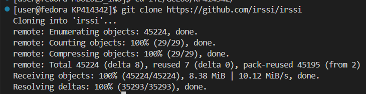
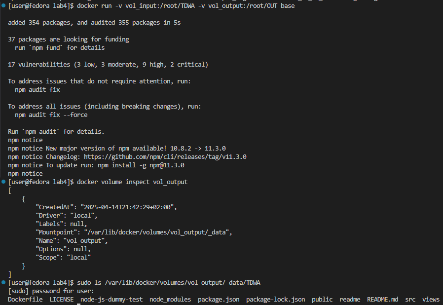
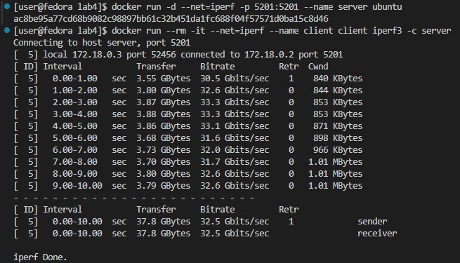

# LAB1

## Połączono z serwerem poprzez SSH


## Sklonowano repozytorium za pomocą HTTPS

## Wygenerowano klucze SSH


## Dodano klucz SSH na GitHubie

## Sklonowano repozytorium poprzez SSH

## Przełączono na gałąź grupy i utworzono własną gałąź

## Stworzono Git Hooka
```bash
#!/bin/sh

COMMIT_MESSAGE=$(cat "$1")

if [[  ! $COMMIT_MESSAGE =~ ^KP414342 ]]; then
    echo "ERROR: Commit message does not start with KP414342"
    exit 1
fi

exit 0
```
## Przetestowano działanie Git Hooka


## Wysłano zmiany


# LAB2

## Zainstalowano dockera


## Utworzono konto na dockerhubie


## Pobrano obrazy


## Uruchomiono busyboxa


## Uruchomiono fedorę


## Zaprezentowano PID1 w kontenerze oraz zaktualizowano pakiety


## Utworzono Dockerfile
```Dockerfile
FROM fedora:latest

RUN dnf install -y git && dnf clean all

WORKDIR /app

RUN git clone https://github.com/InzynieriaOprogramowaniaAGH/MDO2025_INO.git

CMD ["/bin/bash"]
```
## Zbudowano obraz z Dockerfila i uruchomiono w trybie interaktywnym


## Wyświetlono listę kontenerów

## Zatrzymano i usunięto wszystkie kontenery

## Usunięto wszystkie obrazy kontenerów


# LAB3

## Sklonowano repozytorium irssi


## Doinstalowano potrzebne paczki


## Stworzono builda aplikacji


## Uruchomiono testy


# Powtórzenie tych działań w kontenerze
## Zainstalowano paczki


## Sklonowano repozytorium


## Stworzono builda


##


## Uruchomiono testy


## Stworzenie Dockerfile do automatyzacji poprzednich kroków
### Kod Dockerfile do budowania aplikacji
```Dockerfile
FROM fedora:latest

RUN dnf -y update && \
    dnf -y install git ninja-build meson gcc glib2-devel openssl-devel ncurses-devel utf8proc-devel perl-ExtUtils-Embed

RUN git clone https://github.com/irssi/irssi.git

WORKDIR /irssi

RUN meson setup Build

RUN ninja -C Build
```
## Zbudowano obraz

### Dockerfile do uruchomienia testów
```Dockerfile
FROM bld001

RUN ninja -C Build test

CMD ["/bin/bash"]
```
## Zbudowano obraz


## Uruchomiono kontener


### Dockerfile dla builda aplikacji node
```Dockerfile
FROM node:22.14.0

RUN git clone https://github.com/devenes/node-js-dummy-test

WORKDIR /node-js-dummy-test

RUN npm install
```
## Zbudowano obraz

### Dockerfile dla uruchomienia testów
```Dockerfile
FROM node_build_v1
RUN npm test
```
## Zbudowano obraz


# LAB4
## Utworzono dwa woluminy


## Utworzono kontener którym sklonowono repozytorium do woluminu


```Dockerfile
FROM fedora
RUN dnf update -y && dnf -y install git 
WORKDIR /root/Volumes
CMD git clone https://github.com/devenes/node-js-dummy-test /root/Volumes
```

## Utworzono kontener bazowy w którym przekopiowano zawartość woluminu wejściowego do woluminu wyjściowego


```Dockerfile
FROM fedora:39
VOLUME /root/TDWA
VOLUME /root/OUT

RUN dnf update -y && dnf install -y nodejs

WORKDIR /root/TDWA/node-js-dummy-test

CMD npm install && cp -r /root/TDWA /root/OUT
```

## Uruchomienie kontenera serwera


```Dockerfile
FROM ubuntu:latest

RUN apt-get update && apt-get install -y iperf3

EXPOSE 5201

CMD ["iperf3", "-s"]
```
## Zainstalowanie iperf3 na kontenerze z lab2


## Przetestowanie działania iperf3


## Utworzenie sieci mostkowej


## Uruchomienie kontenera serwera podłączonego do nowej sieci
```Dockerfile
FROM ubuntu:latest

RUN apt-get update && apt-get install -y iperf3

CMD ["/bin/bash"]
```
## Próba połączenia przez sieć wewnętrzną

## Próba połączenia z poziomu hosta


# Instalacja Jenkins

## Utworzono sieć i uruchomiono dockera na obrazie docker:dind


## Przygotowanie Dockerfile na bazie Jenkins Docker image

```Dockerfile
FROM jenkins/jenkins:2.492.3-jdk17
USER root
RUN apt-get update && apt-get install -y lsb-release
RUN curl -fsSLo /usr/share/keyrings/docker-archive-keyring.asc \
  https://download.docker.com/linux/debian/gpg
RUN echo "deb [arch=$(dpkg --print-architecture) \
  signed-by=/usr/share/keyrings/docker-archive-keyring.asc] \
  https://download.docker.com/linux/debian \
  $(lsb_release -cs) stable" > /etc/apt/sources.list.d/docker.list
RUN apt-get update && apt-get install -y docker-ce-cli
USER jenkins
RUN jenkins-plugin-cli --plugins "blueocean docker-workflow"
```

## Zbudowanie obrazu


## Uruchomienie kontenera


## Finalny efekt po konfiguracji
### Zapomniałem o dokumentacji screenami kolejnych kroków konfiguracji
