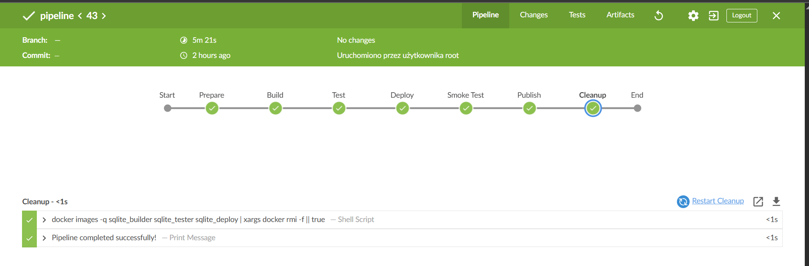

# Lab 5,6,7

## Uruchomienie instacji Jenkins i utworzenie pierwszych projektów

### Projekt wyświetlajacy uname

Dodano uruchomienie powłoki do kroków budowania projektu oraz komendę do wykonania

```bash
uname -a 
```


### Projekt zwracający błąd gdy godzina jest nieparzyta

```bash
#!/bin/bash
current_hour=$(date +%-H)
if ((current_hour % 2 == 0)); then
	echo "Parzysta">&1
    exit 0
else
	echo "Nieparzysta">&2
    exit 1
fi
```


### Projekt pobierający obraz kontentera ubuntu

```bash
docker pull ubuntu
```


## Praca z pipelinem dla wybranej aplikacji

### Pipeline składa się z następujących etapów:
- Prepare - usunięcie istniejących plików sklonowanie repozytorium
```Groovy
stage('Prepare') {
            steps {
                deleteDir()
                sh "git clone ${GIT_REPO}"
            }
        }
```
- Build - zbudowanie obrazu z pliku Dockerfile.builder, obraz zawiera wszystkie zależności potrzebne do kompilacji SQLite
```Groovy
stage('Build') {
            steps {
                dir("sqlite_devops") {
                    sh 'docker build -t sqlite_builder -f Dockerfile.builder .'
                }
            }
        }
```
- Test - uruchamia testy dla SQLite
```Groovy
stage('Test') {
            steps {
                dir("sqlite_devops") {
                    sh 'docker build -t sqlite_tester -f Dockerfile.tester .'
                }
            }
        }
```
- Deploy - Tworzy obraz wersji produkcyjnej SQLite z pliku Dockerfile.deploy
```Dockerfile
FROM fedora:41 as runtime

RUN dnf -y update && \
    dnf -y install readline && \
    dnf clean all

FROM sqlite_builder:latest as builder

FROM runtime

COPY --from=builder /sqlite/sqlite3 /usr/local/bin/

ENTRYPOINT ["/usr/local/bin/sqlite3"]
CMD []
```
Instaluje bibliotekę readline potrzebną do uruchomienia sqlite3 i definiuje domyślny program wejściowy i pozostawia możliwość podania własnych parametrów przy uruchiomieniu kontenera
```Groovy
stage('Deploy') {
            steps {
                dir("sqlite_devops") {
                    sh 'docker build -t sqlite_deploy -f Dockerfile.deploy .'
                }
            }
        }
```
- Smoke test - Uruchomienie kontenera z obrazu deploy aby zweryfikować działanie przed publikacją
```Groovy
stage('Smoke Test') {
            steps {
                echo 'Running smoke test'
                sh 'docker run --rm sqlite_deploy ".version"'
            }
        }
```
- Publish - Stworzenie artefakt ze wszystkimi plikami Dockerfile z oznaczeniem czasowym, wypycha 2 obrazy: latest oraz z tagiem numeru kompilacji oraz archiwizuje artefakt w Jenkinsie
```Groovy
stage('Publish') {
            steps {
                dir("sqlite_devops") {
                    sh '''
                    TIMESTAMP=$(date +%Y%m%d%H%M%S)
                    tar -czf Artifact_${TIMESTAMP}.tar.gz Dockerfile.builder Dockerfile.tester Dockerfile.deploy
                    
                    echo ${DOCKERHUB_CREDENTIALS_PSW} | docker login -u ${DOCKERHUB_CREDENTIALS_USR} --password-stdin
                    
                    docker tag sqlite_deploy cumil/sqlite:${BUILD_NUMBER}
                    docker tag sqlite_deploy cumil/sqlite:latest
                    docker push cumil/sqlite:${BUILD_NUMBER}
                    docker push cumil/sqlite:latest
                    
                    docker logout
                    '''
                    
                    archiveArtifacts artifacts: 'Artifact_*.tar.gz', fingerprint: true
                }
            }
        }
```
- Cleanup - usuwa wszystkie obrazy które zostały utworzone
```Groovy
stage('Cleanup') {
            steps {
                sh '''
                docker images -q sqlite_builder sqlite_tester sqlite_deploy | xargs docker rmi -f || true
                '''
            }
        }
```




## Wnioski

Najwięcej problemów przysporzyła nadmierna pewność siebie oraz strach przed zapytaniem prowadzącego, dlaczego coś nie działa, przez co praca wydłużyła się znacząco. Zamiast przyznać się do niewiedzy, wolałem godzinami błądzić w ciemnościach, co było klasycznym przypadkiem "wiem lepiej", mimo że oczywiście nie wiedziałem. Jenkins po kilkudziesięciu godzinach pracy okazał się naprawdę świetnym i potężnym narzędziem, o ile, oczywiście, wie się co się robi.