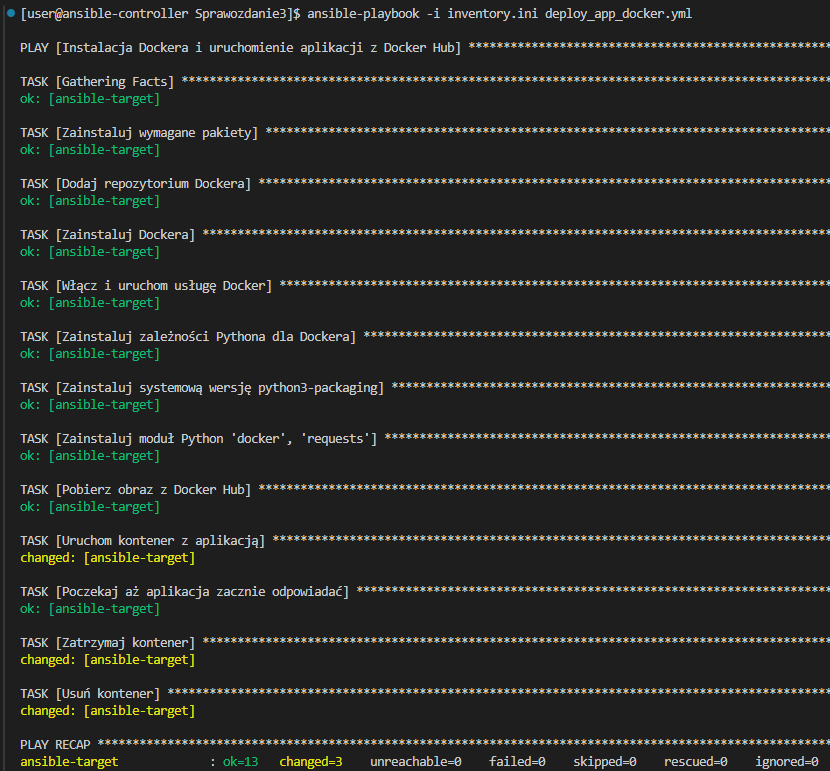
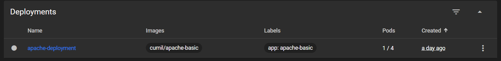

# LAB 8 - Ansible

## Stworzyłem drugą maszynę wirtualną z hostname ansible-target i użytkownikiem ansible


## Dodałem ip maszyny do lokalnej listy hostów /etc/hosts
```
172.23.106.193 ansible-target
```

## Wymieniłem klucze ssh aby nie było wymaganego hasła poleceniem
```
ssh-copy-id ansible@asnible-target
```

## Dzięki temu można połączyć się bez hasła poleceniem
 ```
ssh ansible@ansible-target
```


## Utworzyłem plik inwentaryzacji
```ini
[Orchestrators]
ansible-controller ansible_user=user

[Endpoints]
ansible-target ansible_user=ansible
```

## Wysłałem żądanie ping do wszystkich maszyn


## Wykorzystując playbooka:

### Wysłałem żadanie ping do wszystkich maszyn:
```yml
- name: Ping all hosts
  hosts: all
  gather_facts: no
  tasks:
    - name: Ping test
      ansible.builtin.ping:
```
```
ansible-playbook -i inventory.ini ping.yml
```

### Skopiowałem plik inventory.ini na maszynę z sekcji Endpoints
```yml
- name: Copy inventory file to endpoints
  hosts: Endpoints
  tasks:
    - name: Copy inventory file
      ansible.builtin.copy:
        src: ./inventory.ini
        dest: /tmp/inventory.ini
```
```
ansible-playbook -i inventory.ini copy.yml
```
### Pierwsze wywołanie playbooka

### Drugie wywołanie playbooka, można zauważyć że ansible sprawdził jedynie czy taki plik istnieje, i nie wprowadza nowych zmian

### Restart usług sshd i rngd
```yml
- name: Restart sshd and rngd
  hosts: all
  become: yes
  tasks:
    - name: Restart sshd
      ansible.builtin.service:
        name: sshd
        state: restarted

    - name: Restart rngd
      ansible.builtin.service:
        name: rngd
        state: restarted

```

### Jednak napotkałem problem z wprowadzeniem hasła, ponieważ użytkownicy mają inne hasła. Gdyby były takie same, problem rozwiązałabo użycie --ask-become-pass, które pyta o hasło przed wykonaniem playbooka.

### Jednym z rozwiązań jest dopisanie do pliku inventory.ini ```ansible_become_pass=```, co mimo wszystko nie jest bezpieczną metodą dla środowisk innych niż testowe, przez brak szyfrowania
```ini
[Endpoints]
ansible-target ansible_user=ansible ansible_become_pass=ultra_secret_password
```

### Drugim rozwiązaniem jest stworzenie plików zaszyfrowanych za pomocą Ansible Vault, dzięki czemu plik wyglądający tak:
```
ansible_user=ansible ansible_become_pass=ultra_secret_password
```
### za pomocą polecenia:
```
ansible-vault encrypt host_vars/ansible-controller.yml
```
### wygląda tak:
```yml
$ANSIBLE_VAULT;1.1;AES256
36633861346437343436356635613533636264393735373739616566346466343530666239613262
...
...
...
```
### Dzięki temu dodając opcję ```--ask-vault-password``` możemy wykonać playbooka bez błędu
```
ansible-playbook -i inventory.ini restart.yml --ask-vault-password
```


### Próba pingu z wyłączonym serwerem ssh
```
ansible-playbook -i inventory.ini ping.yml
```


### Próba uruchomienia konteneru z aplikacją opublikowaną jako produkt pipelinu, natomiast przez błędy popełnionych na poprzednich zajęciach, aplikacja nie uruchamia się poprawnie i nie ma z nią połączenia


### Zmieniłem obraz na apache server, który będę wykorzystywać i opisywać w dalszej części sprawozdania i cały playbook wykonał się poprawnie, natomiast elementy które wymagały instalacji, po ponownym uruchomieniu zwracały status ok, zamiast changed



## Ubrałem całość w rolę:
### Inicjując poleceniem `ansible-galaxy init deploy_docker_app`

### Uzupełniając pliki:
```yml
#vars/main.yml
---
docker_image: cumil/apache-basic
container_name: myapp
container_port: 80
published_port: 80
```
```yml
#tasks/main.yml
---
- name: Zainstaluj wymagane pakiety
  dnf:
    name:
      - dnf-plugins-core
      - yum-utils
      - device-mapper-persistent-data
      - lvm2
    state: present

- name: Dodaj repozytorium Dockera
  get_url:
    url: https://download.docker.com/linux/fedora/docker-ce.repo
    dest: /etc/yum.repos.d/docker-ce.repo

- name: Zainstaluj Dockera
  dnf:
    name:
      - docker-ce
      - docker-ce-cli
      - containerd.io
    state: latest

- name: Włącz i uruchom usługę Docker
  systemd:
    name: docker
    enabled: yes
    state: started

- name: Zainstaluj zależności Pythona dla Dockera
  package:
    name:
      - python3-pip
    state: present

- name: Zainstaluj systemową wersję python3-packaging
  package:
    name: python3-packaging
    state: present

- name: Zainstaluj moduł Python 'docker', 'requests'
  pip:
    name:
      - docker
      - requests
    executable: pip3

- name: Pobierz obraz z Docker Hub
  community.docker.docker_image:
    name: "{{ docker_image }}"
    source: pull

- name: Uruchom kontener z aplikacją
  community.docker.docker_container:
    name: "{{ container_name }}"
    image: "{{ docker_image }}"
    state: started
    restart_policy: always
    published_ports:
      - "{{ published_port }}:{{ container_port }}"

- name: Poczekaj aż aplikacja zacznie odpowiadać
  uri:
    url: "http://localhost:{{ published_port }}/"
    status_code: 200
    timeout: 20
  register: result
  retries: 5
  delay: 3
  until: result.status == 200

- name: Zatrzymaj kontener
  community.docker.docker_container:
    name: "{{ container_name }}"
    state: stopped

- name: Usuń kontener
  community.docker.docker_container:
    name: "{{ container_name }}"
    state: absent
```
### Po zmianie playbooka i uruchomieniu otrzymujemy taki sam output jak przy samym playbooku
```yml
---
- name: Instalacja Dockera i uruchomienie aplikacji z Docker Hub
  hosts: Endpoints
  become: true

  roles:
    - deploy_docker_app
```
```ansible-playbook -i inventory.ini deploy_app_docker.yml```


# LAB9 - Kickstart

# LAB10/LAB11 - Kubernetes

## Zaopatrzyłem się w minikube


## Uruchomiłem kontener poleceniem `minikube start`

### Kontener uruchomił się poprawnie

## Uruchomiłem dashboard poleceniem `minikube dashboard`


## Na zajęciach 10 będę korzystał z gotowego obrazu nginx w wersji latest


## Uruchomiłem pojedynczego poda poleceniem `kubectl run nginx-single --image=nginx -- port=80 --labels app=nginx-single`, oraz przekierowałem port aby móc połączyć się z kontenerem


## Używając skryptu ze [[strony](https://kubernetes.io/docs/concepts/workloads/controllers/deployment/)] uruchomiłem deployment z 3 replikami korzystający z tego samego obrazu co pojedynczy pod
```yaml
apiVersion: apps/v1
kind: Deployment
metadata:
  name: nginx-deployment
  labels:
    app: nginx
spec:
  replicas: 3
  selector:
    matchLabels:
      app: nginx
  template:
    metadata:
      labels:
        app: nginx
    spec:
      containers:
      - name: nginx
        image: nginx:latest
        ports:
        - containerPort: 80
```
### Poleceniem `kubectl apply -f conf.yaml`


### Po forwardzie portu można zobaczyć że jesteśmy w stanie połączyć się z jednym z podów - natomiast nie mamy kontroli z którym, od tego służy load balancer
`kubectl port-forward deployment/nginx-deployment 8889:80`


## Screeny z dashboarda po zwiekszeniu replik do 4


## Na zajęciach 11 poprosiłem AI o wygenerowanie trzech Dockerfili aby zbudować obrazy, dwa z nich różnią się plikiem `index.html` a trzeci wywołuje skrypt zwracający exit code 1

## Korzystając z Dockerfili, zbudowałem obrazy
```
docker build -t cumil/apache-basic -f Dockerfile.previous .
docker build -t cumil/apache-ssl -f Dockerfile.new .
docker build -t cumil/apache-failing -f Dockerfile.broken .
```
Zdaję sobie sprawę z niefortunnej nazwy drugiego obrazu

## Zmiana pliku `conf.yaml` z poprzednich zajęć
```yaml
apiVersion: apps/v1
kind: Deployment
metadata:
  name: apache-deployment
  labels:
    app: apache-basic
spec:
  replicas: 8
  selector:
    matchLabels:
      app: apache-basic
  template:
    metadata:
      labels:
        app: apache-basic
    spec:
      containers:
      - name: apache-basic
        image: cumil/apache-basic
        ports:
        - containerPort: 80
```
## Zmiana z 8 replik na 1


## Z 1 na 0


## Z 1 na 4


## Zmiana obrazów
### apache-basic

### apache-ssl

### apache-failing

### W przypadku zmiany obrazu z apache-basic na apache-ssl, potrzebowałem na nowo zrobić forward portu aby móc się połączyć, natomiast obraz apache-failing powoduje wejście podów w stan CrashLoopBackOff, skutkujący systematycznym restartem poda

## po użyciu polecenia `minikube kubectl -- rollout undo deployment/apache-deployment` wdrożenie wróciło do ostatniej działającej wersji

## Poprosiłem AI do wygenerowania skryptu weryfikującego deployment

```bash
#!/bin/bash
DEPLOYMENT=apache-deployment
NAMESPACE=default
TIMEOUT=60
INTERVAL=5
ELAPSED=0

echo "Checking rollout status for $DEPLOYMENT"

while [ $ELAPSED -lt $TIMEOUT ]; do
  STATUS=$(minikube kubectl -- rollout status deployment/$DEPLOYMENT -n $NAMESPACE 2>&1)
  echo "$STATUS"
  if echo "$STATUS" | grep -q "successfully rolled out"; then
    echo "✅ Deployment successful"
    exit 0
  fi
  sleep $INTERVAL
  ELAPSED=$((ELAPSED + INTERVAL))
done

echo "❌ Timeout: Deployment did not finish in time"
exit 1
```


## Strategie wdrożenia pozwalają na zdecydowanie w jaki sposób pody będą uaktualniane
### Recreate zastępuje stare pody nowymi
```yaml
strategy:
  type: Recreate
```
### RollingUpdate pozwala na dobranie np, ile dodatkowych replik może być uruchomionych podczas aktualizacji, lub ile replik może być wyłączonych
```yaml
strategy:
  type: RollingUpdate
  rollingUpdate:
    maxUnavailable: 2
    maxSurge: 30%
```