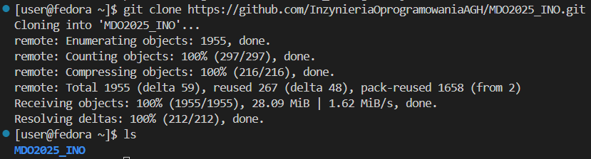
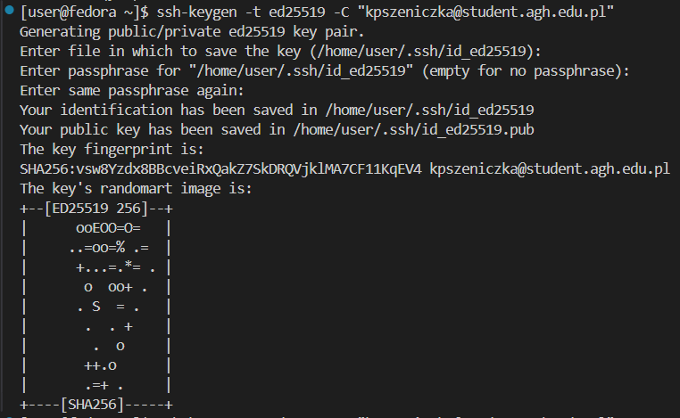
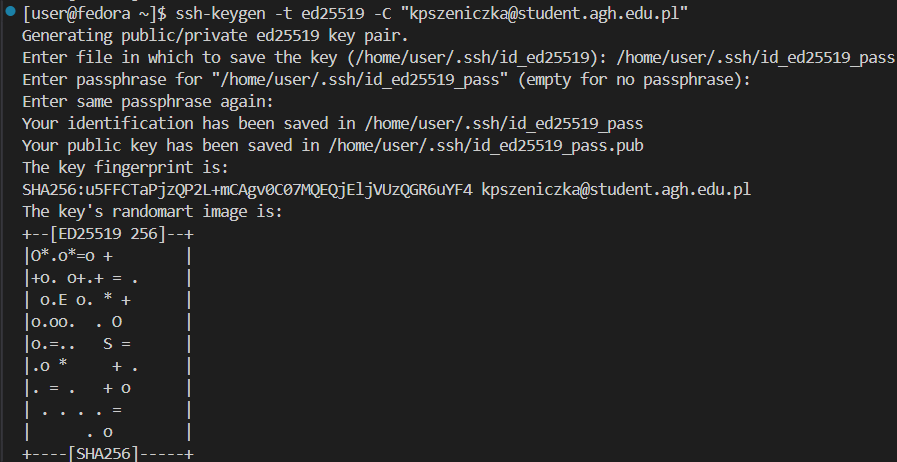
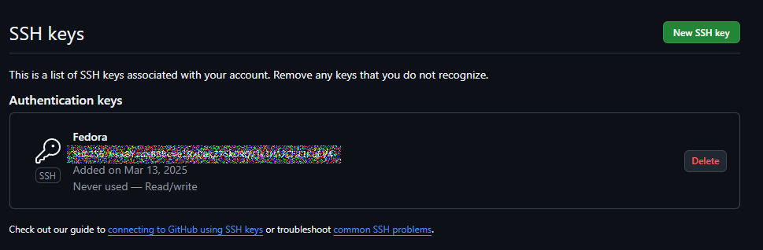
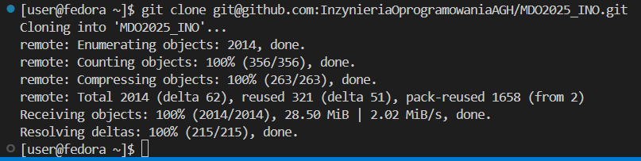
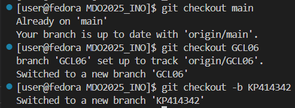
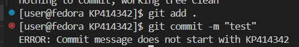
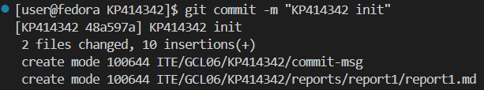
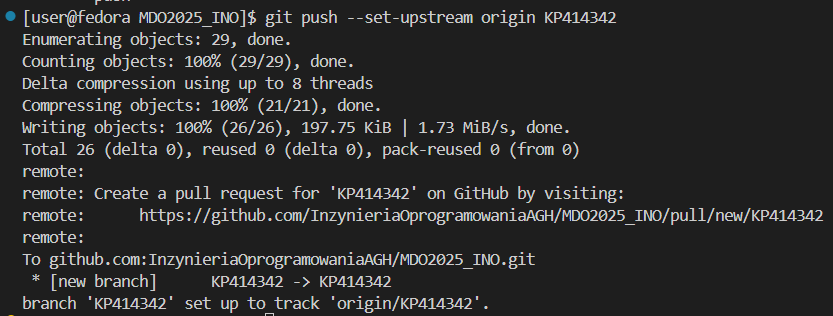

# Połączono z serwerem poprzez SSH


# Sklonowano repozytorium za pomocą HTTPS

# Wygenerowano klucze SSH


# Dodano klucz SSH na GitHubie

# Sklonowano repozytorium poprzez SSH

# Przełączono na gałąź grupy i utworzono własną gałąź

# Stworzono Git Hooka
```
#!/bin/sh

COMMIT_MESSAGE=$(cat "$1")

if [[  ! $COMMIT_MESSAGE =~ ^KP414342 ]]; then
    echo "ERROR: Commit message does not start with KP414342"
    exit 1
fi

exit 0
```
# Przetestowano działanie Git Hooka




# Wysłano zmiany
