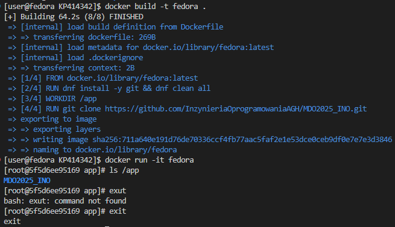
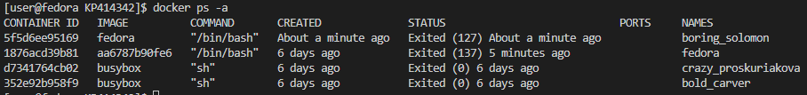
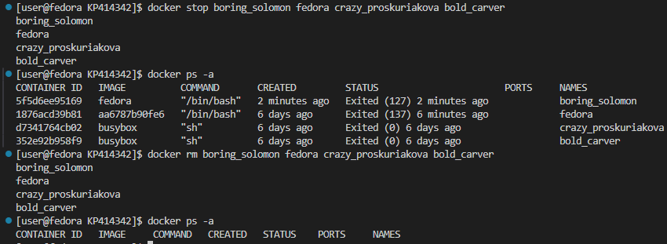
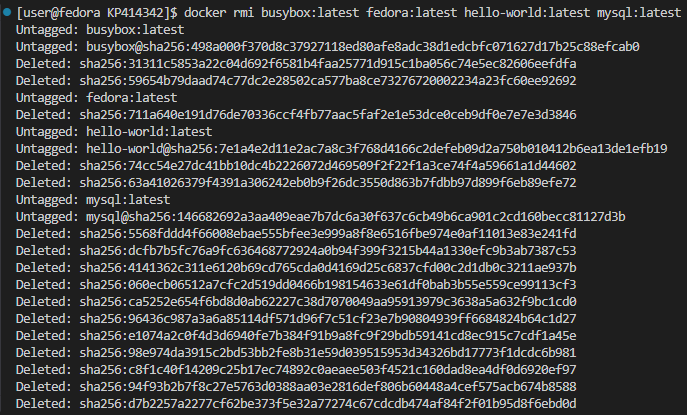

# Zainstalowano dockera


# Utworzono konto na dockerhubie


# Pobrano obrazy


# Uruchomiono busyboxa


# Uruchomiono fedorę


# Zaprezentowano PID1 w kontenerze oraz zaktualizowano pakiety


# Utworzono Dockerfile
```Dockerfile
FROM fedora:latest

RUN dnf install -y git && dnf clean all

WORKDIR /app

RUN git clone https://github.com/InzynieriaOprogramowaniaAGH/MDO2025_INO.git

CMD ["/bin/bash"]
```
# Zbudowano obraz z Dockerfila i uruchomiono w trybie interaktywnym


# Wyświetlono listę kontenerów

# Zatrzymano i usunięto wszystkie kontenery

# Usunięto wszystkie obrazy kontenerów
