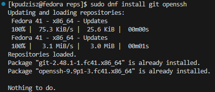
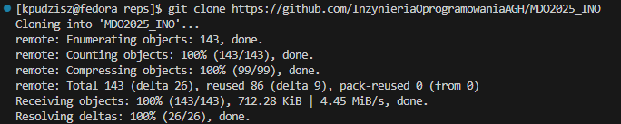
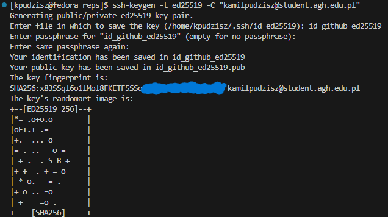
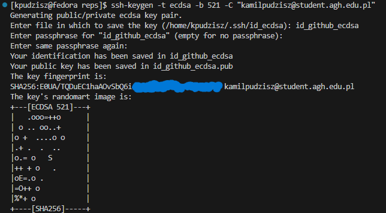
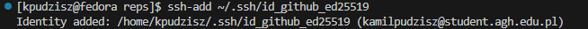
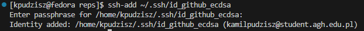
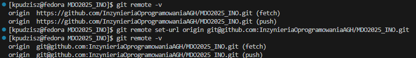
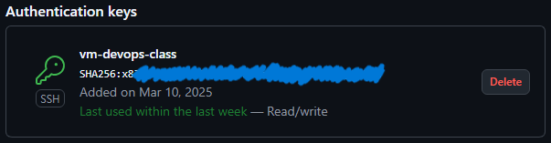
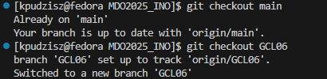
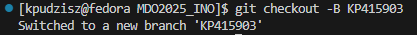

# Sprawozdanie: Wprowadzenie, Git, Gałęzie, SSH

### 1. Instalacja klienta Git i obsługi kluczy SSH

W pierwszym kroku zainstalowano klienta Git oraz narzędzia do obsługi kluczy SSH, aby umożliwić bezpieczne połączenia z repozytorium.

`dnf install git openssh`



### 2. Sklonowanie repozytorium przedmiotowego

Repozytorium przedmiotowe zostało początkowo sklonowane przy użyciu protokołu HTTPS.

`git clone https://github.com/InzynieriaOprogramowaniaAGH/MDO2025_INO`



### 3. Stworzenie kluczy SSH i zmiana połączenia na SSH

Wygenerowano dwa klucze SSH, przy czym przynajmniej jeden z nich zabezpieczono hasłem.

`ssh-keygen -t ed25519 -C "adres_email"`




Dodawanie kluczy SSH do agenta SSH, który zarządza połączeniami SSH i przechowuje klucze w pamięci, aby nie trzeba było podawać hasła za każdym razem.

`ssh-add ~/.ssh/id_github_ed25519`




Zmiana połączenia z repozytorium na SSH.

`git remote set-url origin git@github.com:InzynieriaOprogramowaniaAGH/MDO2025_INO.git`



Klucz o nazwie *id_github_ed25519* został skonfigurowany jako metoda dostępu do GitHuba.



### 4. Zmiana gałęzi

Po poprawnym skonfigurowaniu połączenia SSH, nastąpiło przełączenie na gałęzie main oraz gałęź dedykowaną dla grupy.

`git checkout main`

`git checkout <nazwa-gałęzi-grupy>`



### 5. Stworzenie nowej gałęzi

Utworzono nową gałęź o nazwie KP415903, odgałęziając się od gałęzi grupowej.

`git checkout -b KP415903`



### 6. Rozpoczęcie pracy na nowej gałęzi

W katalogu dedykowanym dla grupy utworzono nowy folder o nazwie ***KP415903***.

`mkdir KP415903`


W celu zapewnienia spójności i poprawności commitów, stworzono hooka pre-commit, który weryfikuje, czy każda wiadomość commit zaczyna się od KP415903. Skrypt ten został umieszczony we właściwym katalogu, aby był automatycznie wywoływany przy każdej próbie wywołania commita.

Treść Git hooka:
```
#!/bin/bash
EXPECTED_PREFIX="KP415903"
COMMIT_MSG=$(cat "$1")

if [[ "$COMMIT_MSG" != $EXPECTED_PREFIX* ]]; then
  echo "Error: Początek wiadomości musi zaczynać się od '$EXPECTED_PREFIX'."
  exit 1
fi
```