# Sprawozdanie

## Wprowadzenie, Git, Gałęzie, SSH

### 1. Instalacja klienta Git i obsługi kluczy SSH

W celu rozpoczęcia pracy z systemem kontroli wersji Git oraz zabezpieczonym połączeniem SSH, konieczne było zainstalowanie odpowiednich narzędzi. Instalacja została wykonana przy użyciu menedżera pakietów `dnf`, który jest domyślnym rozwiązaniem w systemach Fedora.

`dnf install git openssh`

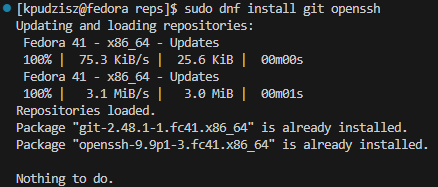

### 2. Sklonowanie repozytorium przedmiotowego

Aby uzyskać lokalną kopię repozytorium przedmiotowego, wykorzystano polecenie git clone, które początkowo używało protokołu HTTPS.

`git clone https://github.com/InzynieriaOprogramowaniaAGH/MDO2025_INO`

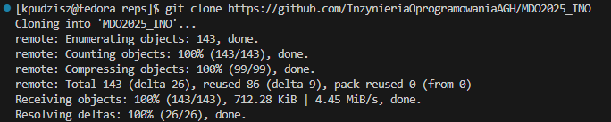

### 3. Stworzenie kluczy SSH i zmiana połączenia na SSH

Aby uniknąć każdorazowego podawania loginu i hasła oraz zapewnić bezpieczne połączenie z GitHubem, wygenerowano dwa klucze SSH: jeden wykorzystujący algorytm `ed25519`, a drugi `ecdsa`.

`ssh-keygen -t ed25519 -C "adres_email"`

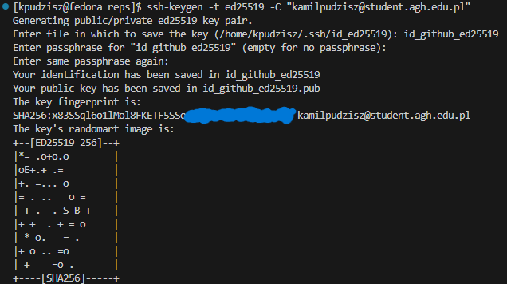

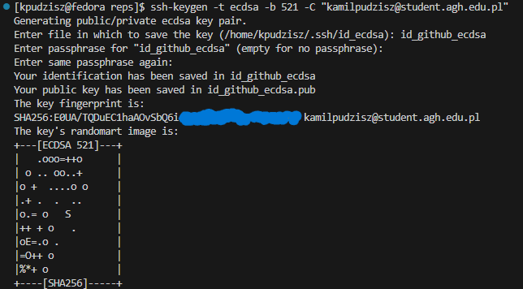

Po wygenerowaniu kluczy, zostały one dodane do agenta SSH:

`ssh-add ~/.ssh/id_github_ed25519`

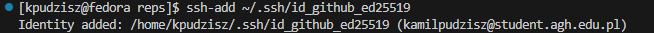

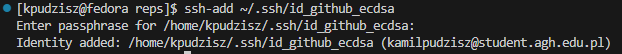

Zmiana połączenia z repozytorium na SSH:

`git remote set-url origin git@github.com:InzynieriaOprogramowaniaAGH/MDO2025_INO.git`

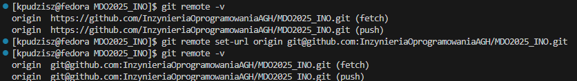

Klucz o nazwie *id_github_ed25519* został skonfigurowany jako metoda dostępu do GitHuba.

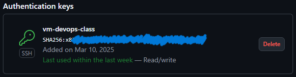

### 4. Zmiana gałęzi

Po poprawnym skonfigurowaniu połączenia SSH, nastąpiło przełączenie na gałęzie main oraz gałęź dedykowaną dla grupy.

`git checkout main`

`git checkout <nazwa-gałęzi-grupy>`

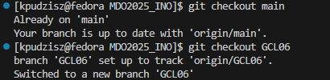

### 5. Stworzenie nowej gałęzi

Utworzono nową gałęź o nazwie KP415903, odgałęziając się od gałęzi grupowej.

`git checkout -b KP415903`

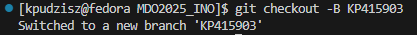

### 6. Rozpoczęcie pracy na nowej gałęzi

W katalogu dedykowanym dla grupy utworzono nowy folder o nazwie ***KP415903***.

`mkdir KP415903`


W celu zapewnienia spójności i poprawności commitów, stworzono hooka pre-commit, który weryfikuje, czy każda wiadomość commit zaczyna się od "KP415903". Skrypt ten został umieszczony we właściwym katalogu, aby był automatycznie wywoływany przy każdej próbie wywołania commita.

Treść Git hooka:
```
#!/bin/bash
EXPECTED_PREFIX="KP415903"
COMMIT_MSG=$(cat "$1")

if [[ "$COMMIT_MSG" != $EXPECTED_PREFIX* ]]; then
  echo "Error: Początek wiadomości musi zaczynać się od '$EXPECTED_PREFIX'."
  exit 1
fi
```

---
## Git, Docker

### 1. Instalacja Dockera w systemie Linux

Docker to popularne narzędzie do zarządzania kontenerami, które umożliwia izolowanie aplikacji w lekkich, przenośnych środowiskach. Instalacja Dockera w systemie Fedora wymaga dodania odpowiedniego repozytorium oraz instalacji pakietów.

```bash
sudo dnf install dnf-plugins-core -y  # Instalacja narzędzi do zarządzania repozytoriami
sudo dnf config-manager --add-repo https://download.docker.com/linux/fedora/docker-ce.repo  # Dodanie oficjalnego repozytorium Dockera
sudo dnf install docker-ce docker-ce-cli containerd.io docker-buildx-plugin docker-compose-plugin  # Instalacja Dockera i powiązanych narzędzi
```

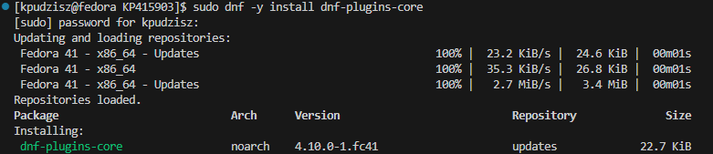

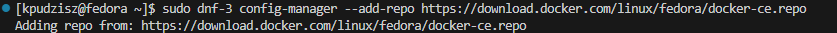

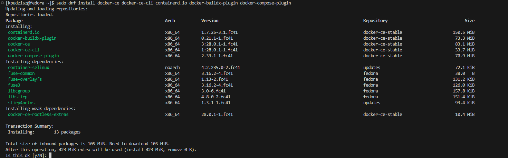

### 2. Uruchomienie usługi Docker

Po instalacji konieczne jest uruchomienie usługi Docker oraz ustawienie jej do automatycznego startu przy uruchamianiu systemu. Dzięki temu Docker będzie działał w tle i obsługiwał kontenery bez konieczności każdorazowego uruchamiania usługi.

```bash
sudo systemctl start docker  # Uruchomienie usługi
sudo systemctl enable docker  # Włączenie automatycznego uruchamiania przy starcie systemu
sudo systemctl status docker  # Sprawdzenie statusu usługi
```


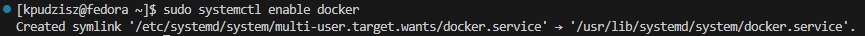

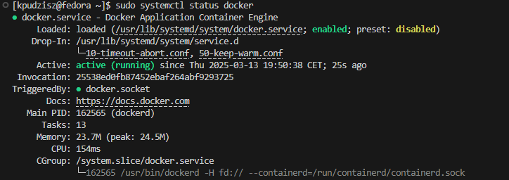

### 3. Dodanie użytkownika do grupy Docker

Domyślnie Docker wymaga uprawnień administratora do uruchamiania kontenerów. Aby umożliwić zwykłemu użytkownikowi korzystanie z Dockera bez konieczności używania `sudo`, dodano użytkownika do grupy `docker`.

```bash
sudo usermod -aG docker $USER  # Dodanie użytkownika do grupy docker
newgrp docker  # Odświeżenie uprawnień grupy
```

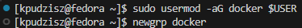

### 4. Rejestracja w Docker Hub i pobranie sugerowanych obrazów

Docker Hub to publiczne repozytorium, w którym znajdują się gotowe obrazy systemów oraz aplikacji. Po rejestracji w Docker Hub pobrano sugerowane obrazy: `busybox` (lekki system operacyjny) oraz `fedora` (pełna dystrybucja Linuxa).

```bash
docker pull busybox  # Pobranie minimalnego obrazu systemu BusyBox
docker pull fedora  # Pobranie obrazu systemu Fedora
```

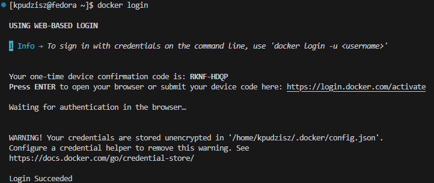

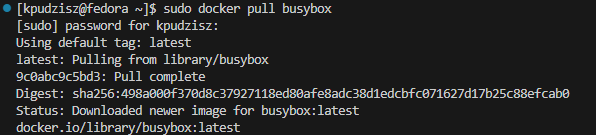

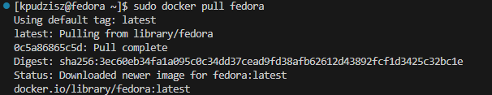

### 5. Uruchomienie kontenera z obrazu `busybox`

Kontener to odizolowane środowisko, które może być uruchomione z określonego obrazu. Uruchomiono kontener na podstawie obrazu `busybox` w trybie interaktywnym (`-it`), co pozwala na interakcję z systemem wewnątrz kontenera.

```bash
sudo docker run -it busybox  # Uruchomienie kontenera w trybie interaktywnym
busybox --help  # Wyświetlenie dostępnych komend BusyBox
```


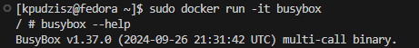

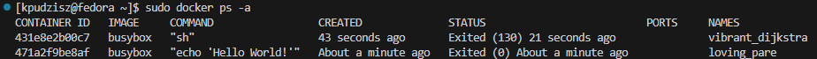

### 6. Uruchomienie systemu w kontenerze (Fedora/Ubuntu)

W kolejnym kroku uruchomiono kontener z pełnym systemem Fedora i sprawdzono jego procesy.

```bash
docker run -it fedora /bin/bash  # Uruchomienie systemu Fedora w kontenerze
```

Sprawdzono listę działających kontenerów oraz procesy Dockera na hoście:

```bash
docker ps -a  # Wyświetlenie listy kontenerów
ps aux | grep docker  # Sprawdzenie procesów powiązanych z Dockerem
```

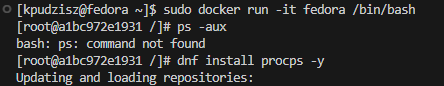

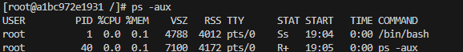

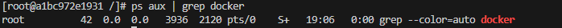

### 7. Aktualizacja pakietów w kontenerze

Po uruchomieniu systemu Fedora w kontenerze przeprowadzono aktualizację pakietów, co pozwala na uzyskanie najnowszych wersji oprogramowania.

```bash
dnf update -y  # Aktualizacja pakietów systemowych wewnątrz kontenera
```

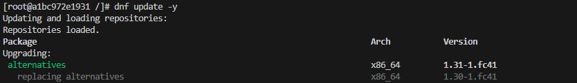

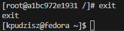

### 8. Stworzenie i uruchomienie własnego obrazu z Dockerfile

Dockerfile to plik konfiguracyjny definiujący, jak powinien wyglądać obraz Dockera. W tym przypadku stworzono obraz bazujący na `fedora:latest`, który instaluje `git` i klonuje repozytorium.

**Treść `Dockerfile`**:

```dockerfile
FROM fedora:latest
RUN dnf install -y git procps
WORKDIR /app
RUN git clone https://github.com/InzynieriaOprogramowaniaAGH/MDO2025_INO.git
CMD ["/bin/bash"]
```

Zbudowano i uruchomiono obraz:

```bash
sudo docker build -t my-fedora-repo .  # Budowanie obrazu
sudo docker run -it my-fedora-repo /bin/bash  # Uruchomienie kontenera z nowego obrazu
```

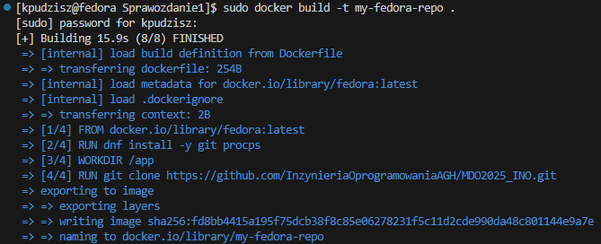

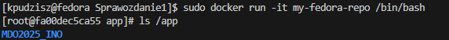

### 9. Lista i czyszczenie kontenerów oraz obrazów

Po zakończeniu pracy usunięto nieużywane kontenery oraz obrazy, aby zwolnić miejsce na dysku.

```bash
sudo docker ps -a  # Wyświetlenie wszystkich kontenerów
sudo docker rm $(sudo docker ps -a -q -f status=exited)  # Usunięcie zakończonych kontenerów
sudo docker rmi $(sudo docker images -q)  # Usunięcie wszystkich obrazów
```

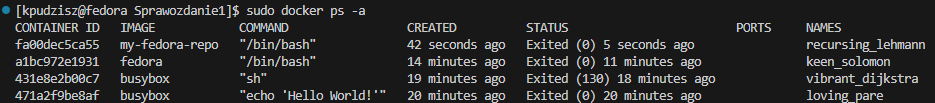

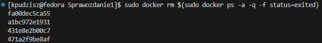

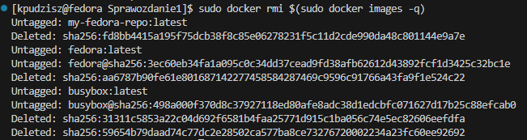

