# Sprawozdanie

## Lab 5. Pipeline, Jenkins, izolacja etapów

### 1. Utworzenie instancji Jenkinsa

Instancja Jenkins została już utworzona na poprzednich zajęciach.

```bash
docker network create jenkins
```

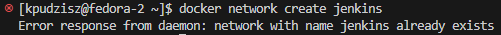

Zapoznanie się z instrukcją instalacji Jenkinsa i uruchomienie obrazu kontenera Dockera, który eksponuje środowisko zagnieżdżone:

```bash
docker run   --name jenkins-docker   --rm   --detach   --privileged   --network jenkins   --network-alias docker   --env DOCKER_TLS_CERTDIR=/certs   --volume jenkins-docker-certs:/certs/client   --volume jenkins-data:/var/jenkins_home   --publish 2376:2376   docker:dind
```

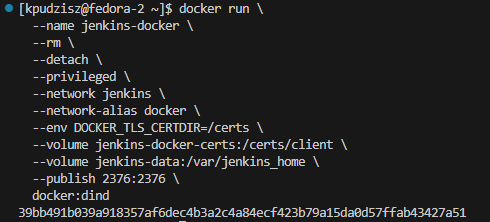

Przygotowanie obrazu blueocean na podstawie obrazu Jenkinsa:

```bash
docker build -t myjenkins-blueocean:2.492.3-1 .
```

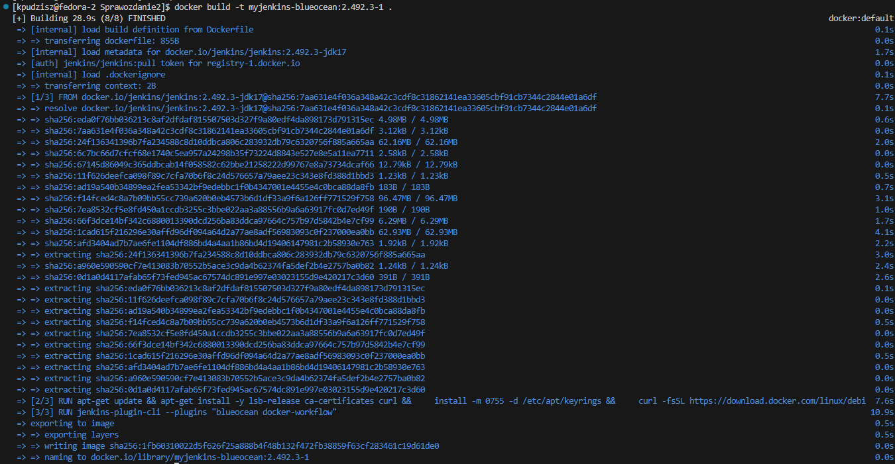

Uruchomienie kontenera Jenkinsa

```bash
docker run --name jenkins-blueocean --restart=on-failure --detach   --network jenkins --env DOCKER_HOST=tcp://docker:2376   --env DOCKER_CERT_PATH=/certs/client --env DOCKER_TLS_VERIFY=1   --publish 8080:8080 --publish 50000:50000   --volume jenkins-data:/var/jenkins_home   --volume jenkins-docker-certs:/certs/client:ro   myjenkins-blueocean:2.492.3-1
```

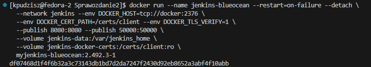

Wykonanie przekierowania portu na `8080` tak aby możliwe było połączenie się z Jenkinsem pod adresem `localhost:8080`:

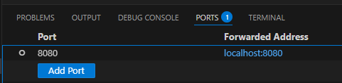

### 2. Uruchomienie prostego projektu

Po poprawnym skonfigorowaniu Jenkinsa (wstępna instalacja wtyczek) utworzono pierwszy projekt, który ma na celu wyświetlenie `uname` oraz pobranie obrazu kontenera `ubuntu`:

```bash
uname -a
docker pull ubuntu
```

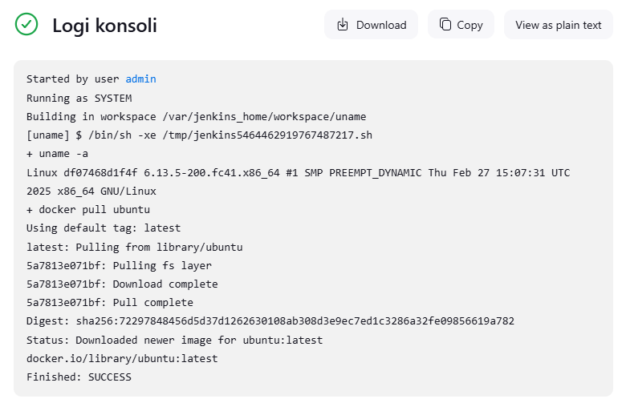


### 3. Uruchomienie projektu typu pipeline

```bash
uname -a
docker pull ubuntu
```

Treść pipeline:

```bash
pipeline {
    agent any

    stages {
        stage('Klonowanie repozytorium') {
            steps {
                script {
                    sh '''
                    if [ -d "MDO2025_INO" ]; then
                        rm -rf MDO2025_INO
                    fi
                    git clone https://github.com/InzynieriaOprogramowaniaAGH/MDO2025_INO
                    '''
                    dir('MDO2025_INO') {
                        sh 'git checkout KP415903'
                    }
                }
            }
        }
        
        stage('Build "build image"') {
            steps {
                script {
                    dir('MDO2025_INO/ITE/GCL06/KP415903/Sprawozdanie1/Lab3 dockerfiles/') {
                        sh 'pwd'
                        sh 'ls -la'
                        sh 'docker build -t nodebuild -f Dockerfile.nodebuild .'
                    }
                }
            }
        }
        
        stage('Build "test image"') {
            steps {
                script {
                    dir('MDO2025_INO/ITE/GCL06/KP415903/Sprawozdanie1/Lab3 dockerfiles/') {
                        sh 'docker build -t nodetest -f Dockerfile.nodetest .'
                        sh 'docker images'
                    }
                }
            }
        }
    }
}
```

Zweryfikowanie logów, czeli poprawności wykonania skryptu pipeline.

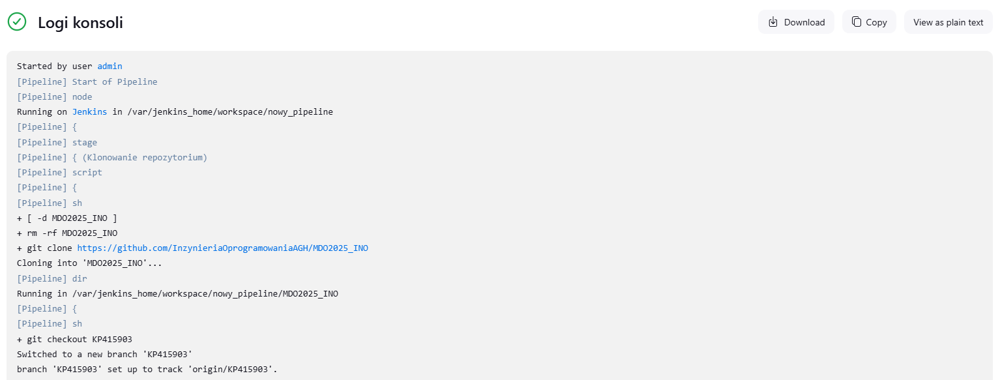
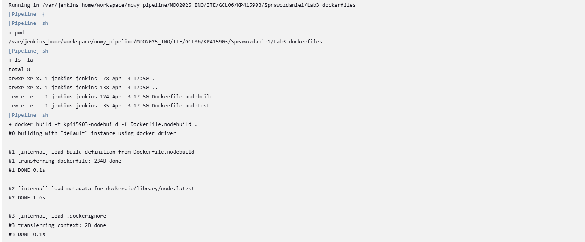
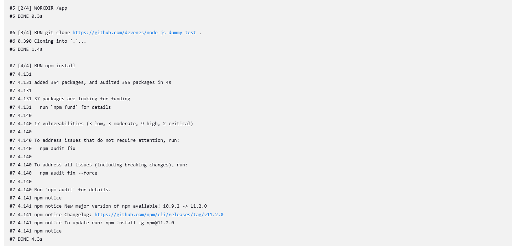
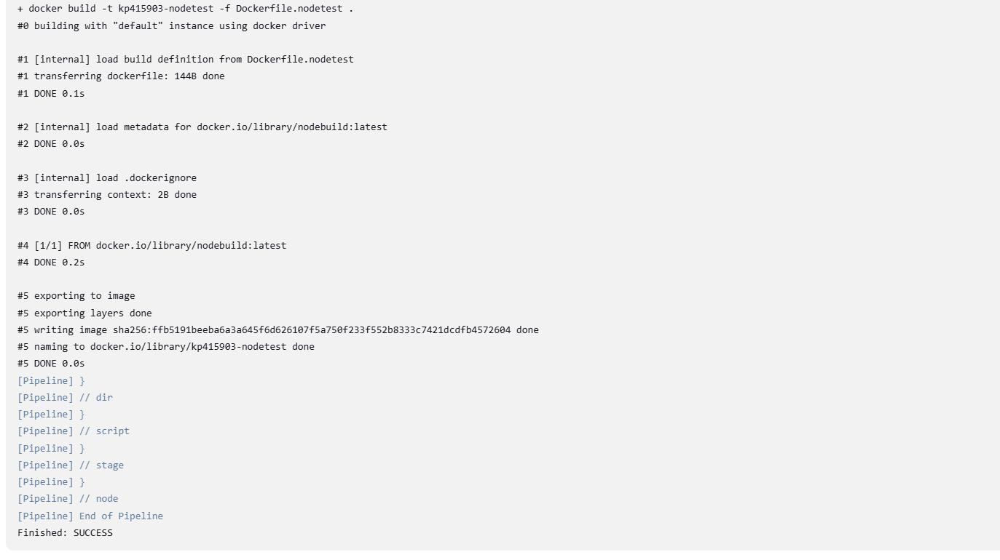

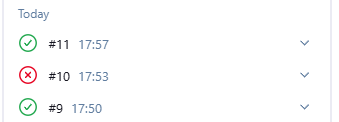