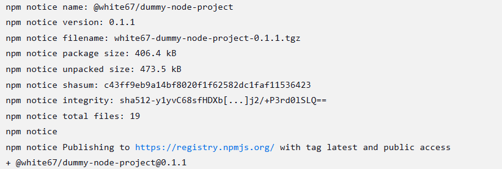

# Sprawozdanie

## Lab 5. Pipeline, Jenkins, izolacja etapów

### 1. Utworzenie instancji Jenkinsa

Instancja Jenkins została już utworzona na poprzednich zajęciach.

```bash
docker network create jenkins
```


Zapoznanie się z instrukcją instalacji Jenkinsa i uruchomienie obrazu kontenera Dockera, który eksponuje środowisko zagnieżdżone:

```bash
docker run   --name jenkins-docker   --rm   --detach   --privileged   --network jenkins   --network-alias docker   --env DOCKER_TLS_CERTDIR=/certs   --volume jenkins-docker-certs:/certs/client   --volume jenkins-data:/var/jenkins_home   --publish 2376:2376   docker:dind
```


Przygotowanie obrazu blueocean na podstawie obrazu Jenkinsa:

```bash
docker build -t myjenkins-blueocean:2.492.3-1 .
```


Uruchomienie kontenera Jenkinsa

```bash
docker run --name jenkins-blueocean --restart=on-failure --detach   --network jenkins --env DOCKER_HOST=tcp://docker:2376   --env DOCKER_CERT_PATH=/certs/client --env DOCKER_TLS_VERIFY=1   --publish 8080:8080 --publish 50000:50000   --volume jenkins-data:/var/jenkins_home   --volume jenkins-docker-certs:/certs/client:ro   myjenkins-blueocean:2.492.3-1
```


Wykonanie przekierowania portu na `8080` tak aby możliwe było połączenie się z Jenkinsem pod adresem `localhost:8080`:


### 2. Uruchomienie prostego projektu

Po poprawnym skonfigorowaniu Jenkinsa (wstępna instalacja wtyczek) utworzono pierwszy projekt, który ma na celu wyświetlenie `uname` oraz pobranie obrazu kontenera `ubuntu`:

```bash
uname -a
docker pull ubuntu
```


### 3. Przedstawienie diagramu projektu CI


### 4. Uruchomienie podstawowego projektu typu pipeline

```bash
uname -a
docker pull ubuntu
```

Treść pipeline:

```bash
pipeline {
    agent any

    stages {
        stage('Klonowanie repozytorium') {
            steps {
                script {
                    sh '''
                    if [ -d "MDO2025_INO" ]; then
                        rm -rf MDO2025_INO
                    fi
                    git clone https://github.com/InzynieriaOprogramowaniaAGH/MDO2025_INO
                    '''
                    dir('MDO2025_INO') {
                        sh 'git checkout KP415903'
                    }
                }
            }
        }
        
        stage('Build "build image"') {
            steps {
                script {
                    dir('MDO2025_INO/ITE/GCL06/KP415903/Sprawozdanie1/Lab3 dockerfiles/') {
                        sh 'docker build -t nodebuild -f Dockerfile.nodebuild .'
                    }
                }
            }
        }
        
        stage('Build "test image"') {
            steps {
                script {
                    dir('MDO2025_INO/ITE/GCL06/KP415903/Sprawozdanie1/Lab3 dockerfiles/') {
                        sh 'docker build -t nodetest -f Dockerfile.nodetest .'
                        sh 'docker images'
                    }
                }
            }
        }
    }
}
```

Zweryfikowanie logów, czeli poprawności wykonania skryptu pipeline.


## Lab 6. i 7. Pipeline, Jenkins: lista kontrolna

### Wstęp

Celem laboratoriów było stworzenie kompleksowego pipeline'u CI/CD w Jenkinsie, obejmującego klonowanie repozytorium, budowanie obrazów Docker, testowanie, deployowanie aplikacji oraz publikację pakietu na NPM. Poniżej przedstawiam moją drogę do realizacji w pełni sprawnego pipeline'u wraz z napotkanymi problemami i ich rozwiązaniami.

### Etap 1: Konfiguracja środowiska

#### Przygotowanie Jenkinsa

Przed rozpoczęciem pracy upewniłem się, że środowisko Jenkinsa jest prawidłowo skonfigurowane:
- Uruchomiłem kontener `jenkins-blueocean` oraz `docker:dind` (dokładne komendy do uruchomienia tych kontenerów są opdane wyżej)
- Zainstalowałem niezbędne wtyczki (Docker, Git, Pipeline)

### Etap 2: Implementacja pipeline'u - Deploy

Dotychczas udało się zrealizować kroki budowania i testowania wybranej przeze mnie aplikacji. Teraz pora zaimplementować krok `Deploy` odpowiedzialny za wdrożenie aplikacji. Krok ten został zrealizowany za pomocą osobnego Dockerfile'a o nazwie `Dockerfile.deploy`.

#### Cel etapu:

Etap deploy ma na celu przygotowanie i uruchomienie produkcyjnej wersji aplikacji w izolowanym środowisku Docker, z pominięciem zbędnych zależności developerskich.

#### Implementacja:

`Dockerfile.deploy` został zoptymalizowany pod kątem produkcyjnym poprzez:
1. Użycie minimalistycznego obrazu bazowego `node:slim`
2. Wieloetapową budowę (kopiowanie tylko niezbędnych artefaktów z etapu build)
3. Wykluczenie zbędnych zależności developerskich

```dockerfile
FROM node:slim

WORKDIR /app
COPY --from=nodebuild /app/node_modules /app/node_modules
COPY --from=nodebuild /app/package*.json /app/
COPY --from=nodebuild /app/src /app/src
COPY --from=nodebuild /app/public /app/public

EXPOSE 3000
CMD ["npm", "start"]
```

Krok obejmuje opiowanie prekompilowanych zależności (node_modules) z etapu build, uniknięcie ponownego uruchamiania npm install w produkcyjnym kontenerze, pominięcie niepotrzebnych plików (np. testów).

W Jenkinsfile etap deploy został zaimplementowany jako sekwencja kroków zbudowania obrazu kontenera i jefo uruchomienie w sieci `ci-network`:

```bash
stage('Build Deploy Image') {
    steps {
        script {
            dir('MDO2025_INO/ITE/GCL06/KP415903/Sprawozdanie2/') {
                sh 'docker build -t deploy -f Dockerfile.deploy .'
            }
        }
    }
}

stage('Deploy Application') {
    steps {
        script {
            sh '''
            docker stop deploy-container || true
            docker rm deploy-container || true
            docker run -d --network ${DOCKER_NETWORK} --name deploy-container deploy
            sleep 5
            '''
        }
    }
}
```

#### Weryfikacja działania


Aby zweryfikować poprawność uruchomienia kontenera docelowego, posłużono się weryfikacją łączności poprzez komendę `curl` dzięki nowemu kontenerowi przeznaczonemu tylko do tego za pomocą komendy:

```bash
docker run --rm --network ${DOCKER_NETWORK} \
curlimages/curl curl -s deploy-container:3000
```


Aby rozwiązać problem braku komunikacji między kontenerami utworzono dedykowaną sieć Dockera `ci-network` i ustawiono jawną konfigurację połączeń.


### Etap 2: Implementacja pipeline'u - Publish

Ten krok zdecydowanie był najbardziej problematyczny do implementacji, głównie ze względu na trudności w automatycznym aktualizowaniu wersji publikowanej paczki oraz w przekazywaniu prywatnego tokenu NPM do Dockerfile'a.

#### Chronologia implementacji

Implementacja etapu publikacji paczki NPM przebiegała wieloetapowo, z licznymi problemami wymagającymi iteracyjnego rozwiązywania:

1. **Przygotowanie tokenu dostępu**:

- Wygenerowano token autoryzacyjny w NPM (typ "Publish") z uprawnieniami do publikacji pakietów
- Token utworzono na [npmjs.com](https://www.npmjs.com/settings/[username]/tokens)


2. **Konfiguracja Jenkinsa**:
- Dodano nowe credentiale w Jenkinsie (typ "Secret text") o nazwie `NPM_TOKEN`
- Wprowadzono problematyczną pierwszą wersję `Dockerfile.publish` bez odpowiedniego zarządzania wersjami, co później zastąpiono prawidłowym generowaniem wersji


#### Napotkane problemy

**Problem 1: Błąd autoryzacji (`.npmrc`)**

`Error: EISDIR: illegal operation on a directory, open '/var/jenkins_home/.npmrc'`


Aby rozwiązać problem:
- Zmieniono lokalizację pliku `.npmrc` z `/var/jenkins_home/` na katalog roboczy aplikacji
- Poprawiona komenda w Dockerfile:
```dockerfile
RUN echo "//registry.npmjs.org/:_authToken=${NPM_TOKEN}" > .npmrc
```

**Problem 2: Brak uprawnień publikacji**

`403 Forbidden - PUT https://registry.npmjs.org/dummy-nodejs-todo - You do not have permission to publish "dummy-nodejs-todo"`


Aby rozwiązać problem:
- Modyfikacja `package.json` w pliku Dockerfile poprzez dodanie scope'a:

```bash
RUN sed -i 's/"name": "dummy-nodejs-todo"/"name": "@white67\/dummy-node-project"/' package.json
```

**Problem 3: Konflikt wersji**

`403 Forbidden - You cannot publish over the previously published version 0.1.1`


Aby rozwiązać problem:
- Implementacja automatycznego generowania unikalnej wersji w Jenkinsfile

```bash
environment {
    DOCKER_NETWORK = "ci-network"
    APP_VERSION = sh(script: 'date +%Y.%m.%d-%H%M%S', returnStdout: true).trim()
}
```

**`Dockerfile.publish`** zawiera kluczowe elementy:

```dockerfile
FROM node:18-slim

WORKDIR /app

COPY --from=nodebuild /app/package*.json /app/

COPY . .

RUN npm install

ARG APP_VERSION
RUN echo "Updating to version: ${APP_VERSION}" && \
    npm version ${APP_VERSION} --no-git-tag-version && \
    sed -i 's/"name": "dummy-nodejs-todo"/"name": "@white67\/dummy-node-project"/' package.json

ARG NPM_TOKEN
RUN echo "//registry.npmjs.org/:_authToken=${NPM_TOKEN}" > .npmrc && \
    echo "//registry.npmjs.org/:always-auth=true" >> .npmrc && \
    echo "registry=https://registry.npmjs.org/" >> .npmrc

RUN npm publish --access public

RUN rm -f ~/.npmrc
```

#### Integracja z `Jenkinsfile`:

```bash
stage('Publish') {
    steps {
        script {
            dir('MDO2025_INO/ITE/GCL06/KP415903/Sprawozdanie2/') {
                withCredentials([string(credentialsId: 'NPM_TOKEN', variable: 'NPM_TOKEN')]) {
                    sh """
                        docker build -f Dockerfile.publish \
                            --build-arg NPM_TOKEN=$NPM_TOKEN \
                            --build-arg APP_VERSION=${APP_VERSION} \
                            -t npmpublish .
                        docker run --rm -e NPM_TOKEN=$NPM_TOKEN npmpublish
                    """
                }
            }
            
            // Archive
            sh '''
                docker save deploy | gzip > dummy-node-project-${APP_VERSION}.tar.gz
            '''
            archiveArtifacts artifacts: "dummy-node-project-${APP_VERSION}.tar.gz", fingerprint: true
        }
    }
}
```

#### Weryfikacja działania

1. Pierwsze udane uruchomienie: Poprawna publikacja pakietu pod nazwą ***@white67/dummy-node-project***.




2. Kolejne uruchomienia: Automatyczne generowanie unikalnych wersji (*timestamp*). Brak konfliktów przy publikacji.

3. Artefakt builda: Spójne nazewnictwo plików `.tar.gz` z generowaną wersją aplikacji.


### Etap 3 - weryfikacja całości pipeline'u

Ostateczna wersja **`Jenkinsfile`** wygląda tak:

```bash
pipeline {
    agent any
    
    environment {
        DOCKER_NETWORK = "ci-network"
        APP_VERSION = sh(script: 'date +%Y.%m.%d-%H%M%S', returnStdout: true).trim()
    }

    stages {
        stage('Prepare Environment') {
            steps {
                script {
                    sh '''
                    docker rm -f deploy-container test-container || true
                    docker rmi nodebuild nodetest deploy || true
                    docker network create ${DOCKER_NETWORK} || true
                    rm -f dummy-node-project-*.tar.gz
                    '''
                }
            }
        }
        
        stage('Clone repo') {
            steps {
                script {
                    sh '''
                    if [ -d "MDO2025_INO" ]; then
                        rm -rf MDO2025_INO
                    fi
                    git clone https://github.com/InzynieriaOprogramowaniaAGH/MDO2025_INO
                    '''
                    dir('MDO2025_INO') {
                        sh 'git checkout KP415903'
                    }
                }
            }
        }
        
        stage('Build "build image"') {
            steps {
                script {
                    dir('MDO2025_INO/ITE/GCL06/KP415903/Sprawozdanie1/Lab3 dockerfiles/') {
                        sh 'docker build -t nodebuild -f Dockerfile.nodebuild .'
                    }
                }
            }
        }
        
        stage('Build "test image"') {
            steps {
                script {
                    dir('MDO2025_INO/ITE/GCL06/KP415903/Sprawozdanie1/Lab3 dockerfiles/') {
                        sh 'docker build -t nodetest -f Dockerfile.nodetest .'
                    }
                }
            }
        }
        
        stage('Run Tests') {
            steps {
                script {
                    sh '''
                    docker network create ${DOCKER_NETWORK} || true
                    docker run --rm --network ${DOCKER_NETWORK} --name test-container nodetest
                    '''
                }
            }
        }
        
        stage('Build Deploy Image') {
            steps {
                script {
                    dir('MDO2025_INO/ITE/GCL06/KP415903/Sprawozdanie2/') {
                        sh 'docker build -t deploy -f Dockerfile.deploy .'
                    }
                }
            }
        }
        
        stage('Deploy Application') {
            steps {
                script {
                    sh '''
                    docker stop deploy-container || true
                    docker rm deploy-container || true
                    docker run -d --network ${DOCKER_NETWORK} --name deploy-container deploy
                    sleep 5
                    '''
                }
            }
        }
        
        stage('Curl Test') {
            steps {
                script {
                    sh '''
                    docker run --rm --network ${DOCKER_NETWORK} curlimages/curl curl deploy-container:3000
                    '''
                }
            }
        }
        
        stage('Publish') {
            steps {
                script {
                    dir('MDO2025_INO/ITE/GCL06/KP415903/Sprawozdanie2/') {
                        withCredentials([string(credentialsId: 'NPM_TOKEN', variable: 'NPM_TOKEN')]) {
                            sh """
                                docker build -f Dockerfile.publish \
                                  --build-arg NPM_TOKEN=$NPM_TOKEN \
                                  --build-arg APP_VERSION=${APP_VERSION} \
                                  -t npmpublish .
                                docker run --rm -e NPM_TOKEN=$NPM_TOKEN npmpublish
                            """
                        }
                    }
                    
                    // Archive
                    sh '''
                        docker save deploy | gzip > dummy-node-project-${APP_VERSION}.tar.gz
                    '''
                    archiveArtifacts artifacts: "dummy-node-project-${APP_VERSION}.tar.gz", fingerprint: true
                }
            }
        }
        
    }
}
```


[Logi z uruchomienia pipeline'a #31](jenkins_logs/#31.txt)
[Logi z uruchomienia pipeline'a #32](jenkins_logs/#32.txt)

### Implementacja Pipeline'a poprzez SCM (Source Control Management)

Wszystkie pliki znajdują się w odpowiednim miejscu na odpowiedniej gałęzi w repozytorium **MDO2025_INO**, aby poprawnie móc zrealizować uruchomienie pipeline'u za pomocą SCM.

#### Cel konfiguracji Pipeline z SCM
Konfiguracja Pipeline'a bezpośrednio z repozytorium Git (SCM) zamiast ręcznego wklejania skryptu w Jenkinsie zapewnia:

1. **Wersjonowanie zmian** - historia modyfikacji Jenkinsfile jest śledzona w Git
2. **Spójność środowisk** - ten sam kod jest używany na wszystkich instancjach
3. **Automatyczne triggerowanie** - możliwość uruchamiania buildów przy każdym commicie
4. **Łatwiejszą współpracę** - wielu developerów może edytować pipeline

#### Proces konfiguracji krok po kroku

1. **Utworzenie nowego projektu Pipeline**:
   - W Jenkinsie: `New Item` → Wybór `Pipeline`
   - Nadanie nazwy np. `lab6 scm`

2. **Konfiguracja źródła Pipeline**:

```
Definition: Pipeline script from SCM
SCM: Git
Repository URL: https://github.com/InzynieriaOprogramowaniaAGH/MDO2025_INO
```

3. **Ustawienie parametrów SCM**:
- **Branch Specifier**: `*/KP415903`  
  *Śledzenie konkretnej gałęzi z moimi zmianami*
- **Script Path**: `ITE/GCL06/KP415903/Sprawozdanie2/Jenkinsfile`  
  *Wskazanie ścieżki do pliku konfiguracyjnego w repozytorium*
- **Lightweight checkout**: ☑ True  
  *Szybsze pobieranie tylko niezbędnych plików bez pełnej historii Git*
- **Credentials**: (puste)  
*W tym przypadku publiczne repo nie wymaga uwierzytelniania*

Warto używać SCM zamiast bezpośredniego skryptu, ponieważ:

1. Istnieje jedna wersja pliku dla wszystkich środowisk (*Single Source of Truth*).
2. Automatyczne aktualizacje - zmiany w repo natychmiast wpływają na pipeline
3. Możliwość code review - zmiany w Jenkinsfile przechodzą przez Pull Request

#### Weryfikacja działania

Po zapisaniu konfiguracji:
1. Jenkins automatycznie wykrywa plik Jenkinsfile w repo
2. Pierwsze uruchomienie ściąga konfigurację z Git
3. Każdy kolejny build używa aktualnej wersji z repozytorium


[Logi z uruchomienia pipeline'a SCM #4](jenkins_logs/scm#4.txt)

## Podsumowanie


W ramach laboratoriów 5-7 udało się zrealizować kompleksowy pipeline CI/CD w Jenkinsie, który obejmuje:

1. **Automatyczną konfigurację środowiska**:
   - Utworzenie izolowanej instancji Jenkinsa z wykorzystaniem Docker-in-Docker
   - Przygotowanie obrazu Blue Ocean dla lepszego interfejsu użytkownika

2. **Pełny cykl CI/CD**:
   - Klonowanie repozytorium z określonej gałęzi (KP415903)
   - Budowanie dedykowanych obrazów Docker (build, test, deploy)
   - Przeprowadzenie testów w izolowanym środowisku
   - Wdrożenie aplikacji w kontenerze produkcyjnym
   - Publikację pakietu NPM z unikalnymi wersjami

3. **Zaawansowane funkcjonalności**:
   - Integracja z systemem kontroli wersji (SCM)
   - Bezpieczne zarządzanie tokenami dostępu
   - Generowanie artefaktów builda

Dlaczego zdecydowałem się na implementację przy pomocy DinD (*Docker in Docker*) zamiast DOoD (*Docker Outside of Docker*):

- Jest bardziej profesjonalnym środowiskiem CI zgodnym z najlepszymi praktykami
- Posiada powtarzalne i izolowane środowisko buildowe
- Jest łatwiejsze do zarządzania zasobami Docker'owymi
- Ma mniejszą podatność na problemy związane z konfiguracją hosta

Pomimo większej złożoności początkowej, wydaje mi się, że DinD okazał się bardziej odpowiedni dla potrzeb złożonego pipeline'u CI/CD w Jenkinsie.