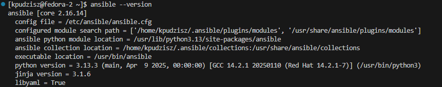
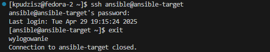
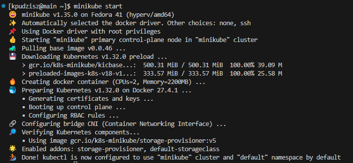
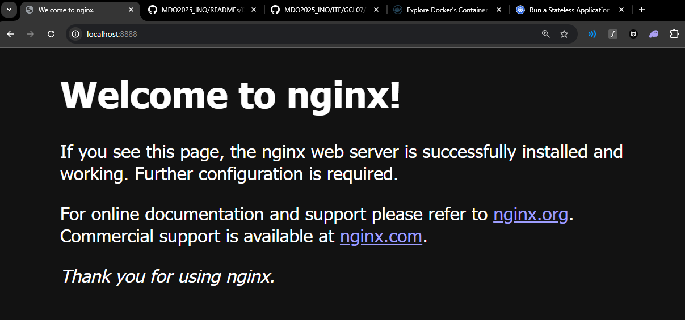
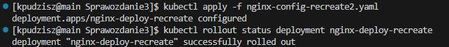

# Sprawozdanie

## Lab 8. Automatyzacja i zdalne wykonywanie poleceń za pomocą Ansible

### 1. Instalacja zarządcy Ansible

Pierwszym krokiem było utworzenie nowej, drugiej maszyny wirtualnej o jak najmniejszym zbiorze zainstalowanego oprogramowania. System = `Fedora 41`. Podczas instalacji utworzenie nowego użytkownika `ansible`


Instalacja `tar` oraz `openssh` na nowej maszynie:

```bash
sudo dnf install tar openssh-server -y
```


Uruchomienie i włączenie usługi SSH:

```bash
sudo systemctl enable --now sshd
sudo systemctl status sshd
```

`enable --now` umożliwia uruchomienie usługi SSH natychmiast oraz jej automatyczne uruchamianie przy każdym starcie systemu.

`status` potwierdza, że serwer SSH działa poprawnie.


Instalacja `ansible` na głównej maszynie w celu przygotowania maszyny do pełnienia roli zarządcy w architekturze Ansible, czyli hosta, z którego będą wykonywane zdalne zadania:

```bash
sudo dnf install ansible -y
ansible --version
```




Próba zalogowania się z maszyny głównej do zdalnej maszyny `ansible-target` jako użytkownik `ansible`

```bash
ssh ansible@ansible-target
```



Kopiowanie klucza SSH między maszyną główną a użytkownikiem `ansible` tak aby późniejsze logowanie nie wymagało hasła:

```bash
cat ~/.ssh/id_rsa.pub | ssh ansible@ansible-target 'mkdir -p ~/.ssh && cat >> ~/.ssh/authorized_keys && chmod 600 ~/.ssh/authorized_keys
```


Sprawdzenie czy maszyna `ansible-target` jest osiągalna w sieci:

```bash
ping ansible-target
```


### 2. Inwentaryzacja

Przypisanie adresów ip do nazw hostów w pliku `etc/hosts/` w celu ułatwienia komunikacji z użyciem nazw:


Weryfikacja łączności maszyn po skonfigurowaniu `/etc/hosts/`:

```bash
ping main
ping ansible-target
```


Utworzenie pliku inwentaryzacji `inventory.ini` w folderze `ansible_quickstart` zgodnie z dokumentacją oprogramowania Ansible:

```ini
[Orchestrators]
main

[Endpoints]
ansible-target
```

Weryfikacja pliku:

```bash
ansible-inventory -i inventory.ini --list
```


Próba wysłania żądania ping przez *Ansible*:

```bash
ansible all -i inventory.ini -m ping
```

Próba zakończyła się błędem:


Problemem jest to, że na maszynach jest ustawiona różna nazwa użytkownika. Aby rozwiązać ten problem, zmodyfikowałem plik inwentaryzacji tak, aby rozróżniał połączenie do głównej maszyny jako lokanlej (na której wykonuje to polecenie):

```ini
[Orchestrators]
main ansible_connection=local

[Endpoints]
ansible-target
```

Rezultatem jest poprawne połączenie przy użyciu komendy z dodatkowym parametrem `-u ansible`, który ustawia domyślną nazwę użytkownika maszyn na `ansible`:

```bash
ansible all -i inventory.ini -u ansible -m ping
```


### 3. Zdalne wywoływanie procedur

Utworzenie własnego *playbooka* w Ansible `playbook.yaml`:

```yaml
- name: Ping all hosts
  hosts: all
  tasks:
    - name: Ping
      ansible.builtin.ping:
```
Uruchomienie go zakończone sukcesem:

```bash
ansible-playbook -i inventory.ini -u ansible playbook.yaml
```


Dzięki uruchomieniu playbooka Ansible zostały wykonane zdalnie zadania na wszystkich hostach zdefiniowanych w pliku inwentaryzacji. W tym przypadku powyższe polecenie spowodowało wywołanie modułu `ping` na każdym hoście, co pozwoliło zweryfikować poprawność połączenia i komunikacji między maszynami. Zakończenie tej operacji sukcesem oznacza, że Ansible był w stanie połączyć się ze wszystkimi hostami, wykonać zadanie i otrzymać prawidłową odpowiedź, co potwierdza poprawną konfigurację środowiska oraz gotowość do dalszej automatyzacji.

Modyfikacja playbook'a aby realizował wiele czynności po sobie:

```yaml
---
- name: Ping all hosts
  hosts: all
  tasks:
    - name: Ping
      ansible.builtin.ping:

- name: Copy inventory.ini to endpoints
  hosts: Endpoints
  tasks:
    - name: Copy inventory.ini
      ansible.builtin.copy:
        src: ./inventory.ini
        dest: /home/ansible/inventory.ini

- name: Ping all hosts again
  hosts: all
  tasks:
    - name: Ping
      ansible.builtin.ping:

- name: Update system packages
  hosts: Endpoints
  become: true
  tasks:
    - name: Update all packages to the latest version
      ansible.builtin.dnf:
        name: "*"
        state: latest
      register: update_result

    - name: Show update result
      debug:
        var: update_result

- name: Restart system services (sshd, rngd)
  hosts: Endpoints
  become: true
  tasks:
    - name: Restart SSHD
      ansible.builtin.service:
        name: sshd
        state: restarted

    - name: Restart RNGD (if installed)
      ansible.builtin.service:
        name: rngd
        state: restarted
        enabled: true
      ignore_errors: true  # in case rngd is not installed

- name: Verify connectivity after updates (optional)
  hosts: all
  tasks:
    - name: Ping all hosts
      ansible.builtin.ping:
      ignore_unreachable: true
```

Zmodyfikowany playbook wykonuje szereg zadań automatyzujących zarządzanie środowiskiem na zdalnych hostach. Najpierw sprawdza łączność z wszystkimi maszynami (moduł `ping`), następnie kopiuje plik `inventory.ini` na hosty docelowe. Ponownie weryfikuje połączenie, po czym aktualizuje wszystkie pakiety systemowe na maszynach docelowych z uprawnieniami administratora. Po aktualizacji restartuje kluczowe usługi systemowe (`sshd`, opcjonalnie `rngd`), a na końcu jeszcze raz sprawdza dostępność hostów. Dzięki temu playbook pozwala w pełni zautomatyzować podstawowe czynności administracyjne: weryfikację połączenia, dystrybucję plików, aktualizację systemu oraz restart usług, zapewniając spójność i gotowość środowiska do dalszych operacji.

Próba uruchomienia playbook'a:


Wystąpił błąd podczas próby zaktualizowania systemu:

```bash
fatal: [ansible-target]: FAILED! => {"ansible_facts": {}, "changed": false, "failed_modules": {"ansible.legacy.setup": {"failed": true, "module_stderr": "Shared connection to ansible-target closed.\r\n", "module_stdout": "sudo: wymagane jest hasło\r\n", "msg": "MODULE FAILURE\nSee stdout/stderr for the exact error", "rc": 1}}, "msg": "The following modules failed to execute: ansible.legacy.setup\n"}
```

Problemem jest brak uprawnień do aktualizacji systemu, ponieważ użytkownik `ansible` nie ma uprawnień sudo.
Nadanie użytkownikowi `ansible` uprawnienia `sudo` bez hasła:

```bash
echo 'ansible ALL=(ALL) NOPASSWD: ALL' | sudo tee /etc/sudoers.d/ansible
sudo chmod 440 /etc/sudoers.d/ansible
```

Ponowne uruchomienie playbook'a zakończone sukcesem:


[Logi z uruchomienia playbook'a](ansible_quickstart/playbook_logs.log)

### 4. Zarządzanie stworzonym artefaktem

Utworzenie roli Ansible o nazwie `manage_app` w celu zarządzania aplikacją:

```bash
ansible-galaxy init manage_app
```


Użycie `ansible-galaxy init` pozwala na szybkie stworzenie struktury katalogów i plików dla roli Ansible, co ułatwia organizację kodu i zarządzanie zadaniami.

Zgodnie z instrukcją stworzenie zadań w folderze `manage_app/tasks/`, które będą wykonywane na maszynie `ansible-target`.

`install_docker.yml` - zadanie do instalacji Dockera:

```yaml
- name: Install required packages
  ansible.builtin.yum:
    name:
      - yum-utils
      - device-mapper-persistent-data
      - lvm2
    state: present

- name: Add Docker CE repository
  ansible.builtin.yum_repository:
    name: docker-ce
    description: Docker CE Repo
    baseurl: https://download.docker.com/linux/centos/7/x86_64/stable/
    gpgcheck: yes
    gpgkey: https://download.docker.com/linux/centos/gpg
    enabled: yes

- name: Install Docker CE
  ansible.builtin.yum:
    name: docker-ce
    state: latest

- name: Ensure Docker service is started and enabled
  ansible.builtin.service:
    name: docker
    state: started
    enabled: true
```

`deploy_container.yml` - zadanie do wdrożenia kontenera Docker:

```yaml
- name: Pull image from Docker Hub
  ansible.builtin.docker_image:
    name: white67/node-dummy-deploy
    source: pull

- name: Run container
  ansible.builtin.docker_container:
    name: deploy-container
    image: white67/node-dummy-deploy
    state: started
    restart_policy: always
    ports:
      - "3000:3000"
```

`verify_container.yml` - zadanie do weryfikacji działania kontenera Docker:

```yaml
- name: Test HTTP response from container
  ansible.builtin.shell: "curl -s -o /dev/null -w '%{http_code}' http://localhost:3000"
  register: curl_result

- name: Show HTTP status code
  ansible.builtin.debug:
    var: curl_result.stdout
```

`cleanup_containers.yaml` - zadanie do usuwania kontenerów Docker:

```yaml
- name: Stop deploy container
  ansible.builtin.docker_container:
    name: deploy-container
    state: stopped
    force_kill: true

- name: Remove deploy container
  ansible.builtin.docker_container:
    name: deploy-container
    state: absent
```

Stworzenie głównego zadania `main.yml` w folderze `manage_app/tasks/`, które będzie wywoływało wcześniej stworzone zadania:

```yaml
---
# tasks file for manage_app

- name: Install Docker on target host
  import_tasks: install_docker.yml

- name: Deploy container from Docker Hub
  import_tasks: deploy_container.yml

- name: Verify container is running
  import_tasks: verify_container.yml

- name: Cleanup container
  import_tasks: cleanup_container.yml
```

Stworzenie playbook'a `run_manage_app.yaml`, który będzie wykorzystywał rolę `manage_app`:

```yaml
---
- hosts: Endpoints
  become: yes
  roles:
    - manage_app
```

Zadania w tej roli zostały rozdzielone na osobne pliki, co pozwala na modularność i ponowne wykorzystanie kodu – każde zadanie odpowiada za konkretny etap, od instalacji Dockera, przez wdrożenie i weryfikację działania kontenera, aż po jego usunięcie. Takie podejście ułatwia zarządzanie zmianami i szybkie diagnozowanie ewentualnych problemów.

Kluczowe jest, że instalacja zależności, takich jak `python3-requests`, została wydzielona do osobnego zadania. Dzięki temu playbook jest odporny na błędy wynikające z brakujących bibliotek, które są wymagane przez niektóre moduły Ansible, np. do obsługi Dockera. Weryfikacja działania aplikacji poprzez sprawdzenie odpowiedzi HTTP pozwala automatycznie potwierdzić, że wdrożenie zakończyło się sukcesem, co zwiększa niezawodność procesu. Całość zamyka zadanie czyszczące, które usuwa kontener po zakończonych testach, co pozwala utrzymać środowisko w czystości i zapobiega niepotrzebnemu zużyciu zasobów.

Takie rozdzielenie zadań i ich kolejność wynikają z potrzeby zapewnienia powtarzalności, przejrzystości oraz łatwości utrzymania procesu wdrożeniowego

Próba uruchomienia playbook'a:

```bash
ansible-playbook -i inventory.ini -u ansible run_manage_app.yaml
```


Wystąpił błąd podczas próby uruchomienia playbook'a, któy jest spowodowany brakiem zainstalowanej biblioteki `requests` w Pythonie na maszynie `ansible-target`. Aby rozwiązać ten problem, należy dodać zadanie do instalacji tej biblioteki.

`install_py_requests.yml` - zadanie do instalacji biblioteki `requests` w Pythonie:

```yaml
- name: Install python3-requests on target
  ansible.builtin.yum:
    name: python3-requests
    state: present
  become: yes
```

Dodanie poprawki do głównego zadania `main.yml` w folderze `manage_app/tasks/`:

```yaml
- name: Install python3-requests on target
  import_tasks: install_py_requests.yml
```

Uruchomienie playbook'a po dodaniu zadania do instalacji biblioteki `requests`:


Wystąpił błąd podczas próby uruchomienia playbook'a, który jest spowodowany błędnym parametrem `ignore_errors` w zadaniu *Stop deploy container*. Aby rozwiązać ten problem, należy usunąć ten parametr. 

Uruchomienie playbook'a zakończone sukcesem:


W opisanym procesie zrealizowano automatyczne wdrożenie aplikacji kontenerowej na zdalnym hoście za pomocą roli Ansible. Utworzono modularną rolę `manage_app`, która odpowiadała za instalację Dockera, wdrożenie i uruchomienie kontenera, weryfikację działania aplikacji oraz czyszczenie środowiska. Dodano także zadanie instalujące zależność `python3-requests`, niezbędną do obsługi modułów Docker w Ansible, oraz poprawiono błędy w zadaniach. Sukces procesu potwierdziło poprawne wykonanie wszystkich kroków: Docker został zainstalowany, kontener uruchomiony, aplikacja zweryfikowana przez HTTP, a po zakończeniu testów środowisko zostało posprzątane. Całość zapewnia powtarzalność i automatyzację wdrożenia, a rola Ansible poprawnie realizuje pełny cykl życia aplikacji.

[Logi z uruchomienia playbook'a](ansible_quickstart/manage_app_logs.log)

## Lab 9. Pliki odpowiedzi dla wdrożeń nienadzorowanych

### 1. Instalacja nienadzorowana z pliku odpowiedzi

Pierwszym krokiem było skopiowanie ze ścieżki `/root/anaconda-ks.cfg` pliku odpowiedzi do folderu mojej gałęzi na repozytorium:
https://raw.githubusercontent.com/InzynieriaOprogramowaniaAGH/MDO2025_INO/refs/heads/KP415903/ITE/GCL06/KP415903/Sprawozdanie3/anaconda-ks.cfg

Zawartość pliku odpowiedzi `anaconda-ks.cfg`:

```bash
# Generated by Anaconda 41.35
# Generated by pykickstart v3.58
#version=DEVEL

# Keyboard layouts
keyboard --vckeymap=us --xlayouts='us'
# System language
lang en_US.UTF-8

%packages
@^custom-environment

%end

# Run the Setup Agent on first boot
firstboot --enable

# Generated using Blivet version 3.11.0
ignoredisk --only-use=sda
autopart
# Partition clearing information
clearpart --all

# System timezone
timezone Europe/Warsaw --utc

network --hostname=hypervdevops

url --mirrorlist=https://mirrors.fedoraproject.org/mirrorlist?repo=fedora-41&arch=x86_64
repo --name=update --mirrorlist=https://mirrors.fedoraproject.org/mirrorlist?repo=updates-released-f41&arch=x86_64

#Root password
rootpw --lock
user --groups=wheel --name=kpudzisz --password=$y$j9T$DKxnZJ7WP4l6MKdLkYRLXCRl$wVlD8HK6INb0EG4043ZKkXT9tYj6j4W0AQjsuMxtIhA --iscrypted --gecos="Kamil Pudzisz"

reboot
```

Plik odpowiedzi został uzupełniony o wzmiaki na temat potrzebnych repozytoriów (komendy `url` i `repo`), które są wymagane do instalacji środowiska Fedora 41. Dodatkowo, w pliku odpowiedzi został dodany użytkownik `kpudzisz`, który jest członkiem grupy `wheel`, co umożliwia mu wykonywanie poleceń z uprawnieniami administratora.

`clearpart --all` usuwa wszystkie partycje na dysku, a `autopart` automatycznie tworzy nowe partycje zgodnie z domyślnymi ustawieniami instalatora.

Następnie, podczas uruchamiania maszyny wirtualnej, wybrałem opcję instalacji z pliku odpowiedzi, korzystając z możliwości ustawienia parametru `inst.ks` w opcjach rozruchu.

```bash
inst.ks=https://raw.githubusercontent.com/InzynieriaOprogramowaniaAGH/MDO2025_INO/refs/heads/KP415903/ITE/GCL06/KP415903/Sprawozdanie3/anaconda-ks.cfg`
```


Instalacja nienadzorowana przy użyciu pliku odpowiedzi polega na automatycznym przeprowadzeniu procesu instalacji systemu operacyjnego bez konieczności interakcji użytkownika. Kluczowym elementem jest tutaj plik odpowiedzi, który zawiera wszystkie niezbędne ustawienia i polecenia konfiguracyjne, takie jak wybór języka, układ klawiatury, partycjonowanie dysku, konfiguracja sieci, repozytoria, tworzenie użytkowników czy instalowane pakiety. Podczas uruchamiania instalatora systemu, wskazuje się lokalizację pliku odpowiedzi za pomocą odpowiedniego parametru (np. `inst.ks=URL`). Instalator odczytuje zawartość pliku i automatycznie wykonuje wszystkie opisane w nim kroki, pomijając ekrany dialogowe i pytania, które normalnie wymagałyby decyzji użytkownika. Dzięki temu cały proces przebiega szybko, powtarzalnie i bez konieczności nadzoru, co jest szczególnie przydatne w środowiskach wymagających masowej lub zautomatyzowanej instalacji systemów.

### 2. Rozszerzenie pliku odpowiedzi

Rozszerzenie pliku odpowiedzi o fragment:

```bash
%packages
@^custom-environment
wget
curl
docker
%end

%post --log=/root/post-install.log --interpreter=/bin/bash

echo "==> Enabling and starting Docker service..."
systemctl enable docker
systemctl start docker

echo "==> Pulling Docker image from Docker Hub..."
/usr/bin/docker pull kamilpudzisz/nody-dummy-test:latest

echo "==> Creating systemd service to auto-start container..."

cat <<EOF > /etc/systemd/system/myapp.service
[Unit]
Description=NodeDummyApp Docker Container
Requires=docker.service
After=docker.service

[Service]
Restart=always
ExecStart=/usr/bin/docker run --rm -p 80:80 --name myapp white67/node-dummy-deploy:latest
ExecStop=/usr/bin/docker stop myapp

[Install]
WantedBy=multi-user.target
EOF

echo "==> Enabling MyApp service..."
systemctl enable myapp.service

echo "==> Post-installation complete."
%end
```

Fragment ten dodaje do pliku odpowiedzi dodatkowe pakiety, takie jak `wget`, `curl` i `docker`, które są niezbędne do dalszej konfiguracji systemu. W sekcji `%post` umieszczono skrypty, które zostaną wykonane po zakończeniu instalacji systemu. Skrypty te:
1. Włączają i uruchamiają usługę Docker.
2. Pobierają obraz Dockera z Docker Hub.
3. Tworzą plik usługi systemd, który automatycznie uruchamia kontener z aplikacją `NodeDummyApp` po starcie systemu.

Po dodaniu tego fragmentu do pliku odpowiedzi, instalacja systemu Fedora 41 będzie zawierała wszystkie niezbędne kroki do skonfigurowania środowiska z Dockerem i automatycznym uruchamianiem kontenera z aplikacją.

Dokumentacja działania po instalacji:

```bash
docker --version
```


```bash
sudo docker ps -a
```


```bash
sudo docker images
```


```bash
sudo docker logs 6f72e7fa0484
```


W przedstawionej modyfikacji pliku odpowiedzi dodano instalację niezbędnych pakietów (`wget`, `curl`, `docker`) oraz skonfigurowano automatyczne uruchamianie kontenera Docker z aplikacją *`NodeDummyApp`* po starcie systemu. Skrypt w sekcji `%post` włącza i uruchamia usługę Docker, pobiera wymagany obraz z DockerHub'a oraz tworzy plik usługi `systemd`, który odpowiada za start kontenera. Efektem tych zmian jest w pełni zautomatyzowana konfiguracja środowiska z Dockerem na systemie *Fedora 41*, umożliwiająca uruchomienie aplikacji w kontenerze bez dodatkowej ingerencji użytkownika po instalacji systemu. Jednak w konfiguracji kontenera błędnie opisano wystawienie portu aplikacji – w poleceniu docker run użyto przekierowania portu 80:80, podczas gdy aplikacja może nasłuchiwać na innym porcie lub port ten nie jest poprawnie skonfigurowany w obrazie. W rezultacie, próba połączenia się z aplikacją za pomocą `curl` kończy się niepowodzeniem.

## Lab 10. Wdrażanie na zarządzalne kontenery: Kubernetes (1)

### 1. Instalacja klastra Kubernetes

Pierwszym krokiem była instalacja klastra Kubernetes za pomocą oficjalnej instrukcji [Minikube](https://minikube.sigs.k8s.io/docs/start/?arch=%2Flinux%2Fx86-64%2Fstable%2Fbinary+download). 

```bash
curl -LO https://github.com/kubernetes/minikube/releases/latest/download/minikube-linux-amd64
sudo install minikube-linux-amd64 /usr/local/bin/minikube && rm minikube-linux-amd64
```


Instalacja `kubectl`:

```bash
curl -LO "https://dl.k8s.io/release/$(curl -L -s https://dl.k8s.io/release/stable.txt)/bin/linux/amd64/kubectl"
curl -LO "https://dl.k8s.io/release/$(curl -L -s https://dl.k8s.io/release/stable.txt)/bin/linux/amd64/kubectl.sha256" # Validate the binary (optional)

```


Weryfikacja instalacji `kubectl`:

```bash
kubectl version --client
```


Uruchomienie klastra Kubernetes:

```bash
minikube start
```




Uruchomienie dashboardu Kubernetes i przedstawienie łączności:

```bash
minikube dashboard
```


Zapoznanie się z koncepcjami funkcji wyprowadzanych przez Kubernetesa (pod, deployment itp):

**Pod** to podstawowa jednostka w Kubernetes, która reprezentuje pojedynczą instancję aplikacji działającą w klastrze. Może zawierać jeden lub więcej kontenerów, które współdzielą zasoby, takie jak sieć i pamięć.

**Deployment** to wyższy poziom abstrakcji, który zarządza zestawem podów, zapewniając ich deklaratywne aktualizacje i skalowanie. Umożliwia łatwe wdrażanie nowych wersji aplikacji oraz automatyczne przywracanie do poprzednich wersji w przypadku awarii.

**Service** to abstrakcja, która definiuje sposób dostępu do podów w klastrze. Umożliwia tworzenie stabilnych punktów końcowych (adresów IP i nazw DNS) dla aplikacji, niezależnie od tego, które pody są aktualnie uruchomione.

**Namespace** to logiczna przestrzeń w klastrze Kubernetes, która pozwala na organizację i izolację zasobów. Umożliwia tworzenie wielu środowisk (np. produkcyjnego, testowego) w tym samym klastrze, co ułatwia zarządzanie i kontrolę dostępu.

### 2. Uruchamianie oprogramowania

Uruchomienie kontenera z wybraną aplikacją (nginx) na stosie k8s:

```bash
kubectl run nginx-single --image=nginx --port=80 --labels app=nginx-single
```


Przekierowanie portu z kontenera *nginx* na port 8080 lokalnie:

```bash
kubectl port-forward pod/nginx-single 8888:80
```


Weryfikacja łączności z aplikacją:

```bash
curl http://localhost:8888
```





### 3. Przekucie wdrożenia manualnego w plik wdrożenia (wprowadzenie)

Utworzenie pliku YAML dla Deploymentu `nginx-cfg.yaml`:

```yaml
apiVersion: apps/v1
kind: Deployment
metadata:
  name: nginx-deploy
  labels:
    app: nginx-deploy
spec:
  replicas: 5
  selector:
    matchLabels:
      app: nginx-deploy
  template:
    metadata:
      labels:
        app: nginx-deploy
    spec:
      containers:
      - name: nginx
        image: nginx
        ports:
        - containerPort: 80
```

W pliku `nginx-cfg.yaml` został zdefiniowany zasób typu *Deployment*, który umożliwia automatyczne wdrożenie pięciu replik kontenera nginx w klastrze **Kubernetes**. *Deployment* ten posiada etykietę `app: nginx-deploy`, co pozwala na łatwą identyfikację i zarządzanie wdrożeniem. W sekcji `spec` określono liczbę replik (5), selektor dopasowujący pody na podstawie etykiety oraz szablon podów, w którym zdefiniowano kontener *nginx* wraz z mapowaniem portu 80. Dzięki temu wdrożenie jest powtarzalne, łatwe do skalowania i umożliwia szybkie aktualizacje aplikacji.

Uruchomienie Deploymentu z pliku YAML:

```bash
kubectl apply -f nginx-cfg.yaml
```


Weryfikacja utworzenia Deploymentu na dashboardzie Kubernetes:


Zmiana liczby replik w pliku YAML `nginx-cfg.yaml` i ponowne uruchomienie Deploymentu:


Wyeksponowanie wdrożenia jako serwis oraz przekierowanie portu:

```bash
kubectl expose deployment nginx-deploy --type=NodePort --name=nginx-service
kubectl port-forward service/nginx-service 8889:80
```


W tym etapie przeprowadzono wdrożenie aplikacji nginx w klastrze Kubernetes, najpierw manualnie, a następnie w sposób deklaratywny przy użyciu pliku YAML typu Deployment. Umożliwiło to automatyczne uruchomienie wielu replik kontenera, łatwe skalowanie oraz zarządzanie cyklem życia aplikacji. Dodatkowo, wdrożenie zostało wyeksponowane jako serwis, co pozwoliło na dostęp do aplikacji z zewnątrz. Całość potwierdziła skuteczność i powtarzalność procesu wdrażania aplikacji w środowisku Kubernetes.

## Lab 11. Wdrażanie na zarządzalne kontenery: Kubernetes (2)

### 1. Zmiany w deploymencie

Aktualizacja pliku YAML `nginx-cfg.yaml` poprzez zmianę obrazu kontenera na `nginx:1.27.5` (fragment pliku `nignx-cfg2.yaml`):

```yaml
...
      containers:
      - name: nginx
        image: nginx:1.27.5
```

Plik `nginx-cfg3.yaml` z kolei zawierał wadliwą konfigurację, gdzie w polu `command` ustawiono wartość `["/bin/false"]`, co uniemożliwiało uruchomienie kontenera:

```yaml
...
    containers:
      - name: nginx
        image: nginx:1.28.0
        command: ["/bin/false"]
```

Uruchomienie Deploymentu z pliku `nginx-cfg.yaml`:

```bash
kubectl apply -f nginx-cfg.yaml
```


Wdrożenie zmian w pliku `nginx-cfg2.yaml`:

```bash
kubectl apply -f nginx-cfg2.yaml
```


Jak można zauważyć, po wdrożeniu pliku `nginx-cfg2.yaml` Deployment został zaktualizowany do wersji 1.28.0, a kontenery zostały uruchomione poprawnie.

Wdrożenie zmian w pliku `nginx-cfg3.yaml`:

```bash
kubectl apply -f nginx-cfg3.yaml
```


Jak można zauważyć, po wdrożeniu pliku `nginx-cfg3.yaml` Deployment przeszedł w stan błędu, ponieważ kontener nie mógł się uruchomić z powodu błędnej konfiguracji.

Weryfikacja stanu Deploymentu:

```bash
kubectl rollout history deployment nginx-deploy
kubectl rollout history deployment nginx-deploy --revision=3
```


Cofnanie Deploymentu do poprzedniej wersji:

```bash
kubectl rollout undo deployment nginx-deploy
kubectl rollout undo deployment nginx-deploy
kubectl rollout history deployment nginx-deploy
```


Jak można zauważyć, po pierwszym wywołaniu `kubectl rollout undo deployment nginx-deploy` Deployment został cofnięty do wersji 1.28.0, a po drugim wywołaniu wrócił do wersji 1.27.5, jednakże nadal był w stanie błędu.
Numer rewizji wzrósł do 4 po pierwszym cofnięciu i do 5 po drugim.

Cofnięcie Deploymentu do konkretnej rewizji:

```bash
kubectl rollout undo deployment nginx-deploy --to-revision=1
kubectl rollout status deployment nginx-deploy
```


### 2. Kontrola wdrożenia

Stworzenie skryptu `rollout_script.sh` do monitorowania procesu wdrażania aplikacji:

```bash
#!/bin/bash
timeout=60
interval=3
elapsed=0

while [ $elapsed -lt $timeout ]; do
  status=$(kubectl rollout status deployment/nginx-deploy --timeout=5s)
  echo "$status"
  if [[ "$status" == *"successfully rolled out"* ]]; then
    echo "Deployment zakończony sukcesem."
    exit 0
  fi
  sleep $interval
  elapsed=$((elapsed + interval))
done

echo "Deployment nie zakończył się w czasie $timeout sekund."
exit 1
```

Ururuchomienie skryptu `rollout_script.sh`:

```bash
chmod +x rollout_script.sh
./rollout_script.sh
```


Jak można zauważyć, skrypt w pierwszym wypadku został porawnie wykonany, a Deployment został zakończony sukcesem. W drugim wypadku skrypt napotykał `error: timed out waiting for the condition`, ponieważ Deployment był w stanie błędu i nie mógł się poprawnie zakończyć.

### 3. Strategie wdrożeniowe

W ramach ćwiczenia przetestowano różne strategie wdrażania aplikacji w środowisku Kubernetes. W tym celu przygotowano kilka plików YAML definiujących zasoby Deployment z różnymi strategiami.

`nginx-config-recreate.yaml` z wykorzystaniem strategii `Recreate`:

```yaml
...
spec:
  strategy:
    type: Recreate
```

W pliku `nginx-config-recreate.yaml` zdefiniowano strategię `Recreate`, która polega na usunięciu istniejących podów przed utworzeniem nowych. Jest to przydatne w sytuacjach, gdy nowe wersje aplikacji wymagają całkowitego zatrzymania starej wersji, co może być konieczne w przypadku zmian w konfiguracji lub obrazie kontenera.

`nignx-config-rolling.yaml` z wykorzystaniem strategii `RollingUpdate`:

```yaml
...
spec:
  strategy:
    type: RollingUpdate
    rollingUpdate:
      maxUnavailable: 2
      maxSurge: 30%
```

W pliku `nginx-config-rolling.yaml` zdefiniowano strategię `RollingUpdate`, która umożliwia stopniowe aktualizowanie aplikacji poprzez jednoczesne usuwanie i tworzenie podów. Parametry `maxUnavailable` i `maxSurge` kontrolują, ile podów może być niedostępnych lub dodatkowo uruchomionych podczas aktualizacji, co pozwala na minimalizację przestojów i zapewnienie ciągłej dostępności aplikacji.

```bash
kubectl apply -f nginx-config-recreate.yaml
kubectl apply -f nginx-config-recreate2.yaml # aktualizacja obrazu do wersji 1.28.0
```




Wdrożenie zakończyło się poprawnie.

```bash
kubectl apply -f nginx-config-rolling.yaml
kubectl apply -f nginx-config-rolling2.yaml # aktualizacja obrazu do wersji 1.28.0
```


Proces rollout był dłuższy, widoczne były opóźnienia wynikające z konieczności stopniowego wycofywania starych replik (pending termination).

W celu monitorowania stanu podów w czasie rzeczywistym, można użyć komendy:

```bash
kubectl get pods -w
```


Wykorzystanie plików YAML typu Deployment pozwoliło na deklaratywne zarządzanie cyklem życia aplikacji, w tym łatwe skalowanie liczby replik, aktualizacje obrazów kontenerów oraz szybkie wdrażanie zmian w konfiguracji. Przeprowadzono testy zarówno poprawnych, jak i błędnych wdrożeń (np. z nieprawidłowym poleceniem startowym), co umożliwiło praktyczne poznanie mechanizmów detekcji i obsługi błędów w Kubernetes.

Dzięki poleceniom `kubectl rollout history` i `kubectl rollout undo` możliwe było monitorowanie historii wdrożeń oraz szybkie cofanie się do stabilnych wersji w przypadku wystąpienia problemów. Dodatkowo, przygotowany skrypt automatyzujący monitorowanie statusu rolloutu pozwolił na bieżącą kontrolę procesu wdrażania.

Porównano także strategie wdrożeniowe: `Recreate` (zatrzymanie wszystkich podów przed uruchomieniem nowych) oraz `RollingUpdate` (stopniowa wymiana podów), co pozwoliło zrozumieć wpływ tych metod na dostępność aplikacji i minimalizację przestojów.

## Podsumowanie

W trakcie realizacji laboratoriów zdobyłem praktyczne umiejętności z zakresu automatyzacji zarządzania infrastrukturą IT oraz wdrażania aplikacji w środowiskach chmurowych i kontenerowych. Poznałem narzędzia takie jak Ansible, umożliwiające zdalne wykonywanie poleceń, automatyzację konfiguracji oraz zarządzanie aplikacjami za pomocą modularnych ról i playbooków. Nauczyłem się przygotowywać pliki odpowiedzi do instalacji nienadzorowanych systemów operacyjnych, co pozwala na szybkie i powtarzalne wdrożenia maszyn. Pracując z Kubernetes, zdobyłem wiedzę na temat kluczowych zasobów (Pod, Deployment, Service, Namespace), wdrażania aplikacji zarówno manualnie, jak i deklaratywnie z użyciem plików YAML, a także zarządzania cyklem życia aplikacji, skalowaniem, aktualizacjami i strategiami rolloutów. Przetestowałem różne scenariusze wdrożeniowe, nauczyłem się diagnozować i rozwiązywać typowe problemy oraz automatyzować monitorowanie wdrożeń. Całość laboratoriów pozwoliła mi zrozumieć i przećwiczyć nowoczesne podejście do zarządzania infrastrukturą oraz wdrażania aplikacji, kładąc nacisk na automatyzację, powtarzalność i niezawodność procesów.