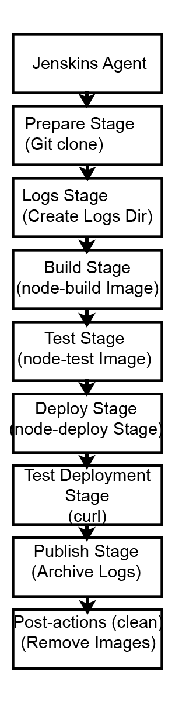

# Sprawozdanie 2 
### Miłosz Dębowski [MD415045]

# Pipeline, Jenkins, izolacja etapów

### Pobranie i uruchomienie Jenkinsa w Dockerze
1. **Utworzenie sieci w Dockerze, używając polecenia** 
    ```ssh
    docker network create (nazwa sieci)
    ```
    

2. **Pobranie i uruchomienie `Dind`** za pomocą `docker run`
    ```
    docker run --name jenkins-docker --rm --detach --privileged --network jenkins --network-alias docker --env DOCKER_TLS_CERTDIR=/certs --volume jenkins-docker-certs:/certs/client --volume jenkins-data:/var/jenkins_home --publish 2376:2376 docker:dind --storage-driver overlay2
    ```
    

3. **Utworzenie pliku [Dockerfile](../Sprawozdanie2/Dockerfile)**
    ```dockerfile
    FROM jenkins/jenkins:2.492.3-jdk17
    USER root
    RUN apt-get update && apt-get install -y lsb-release ca-certificates curl && \
        install -m 0755 -d /etc/apt/keyrings && \
        curl -fsSL https://download.docker.com/linux/debian/gpg -o /etc/apt/keyrings/docker.asc && \
        chmod a+r /etc/apt/keyrings/docker.asc && \
        echo "deb [arch=$(dpkg --print-architecture) signed-by=/etc/apt/keyrings/docker.asc] \
        https://download.docker.com/linux/debian $(. /etc/os-release && echo \"$VERSION_CODENAME\") stable" \
        | tee /etc/apt/sources.list.d/docker.list > /dev/null && \
        apt-get update && apt-get install -y docker-ce-cli && \
        apt-get clean && rm -rf /var/lib/apt/lists/*
    USER jenkins
    RUN jenkins-plugin-cli --plugins "blueocean docker-workflow"
    ```
    
4. **Zbudowanie obrazu na podstawie powyższego Dockefile'a za pomocą `docker build`**
    ```
    docker build -t myjenkins-blueocean:2.492.3-1 .
    ```
    
5. **Uruchomienie Jenkins'a w dokerze za pomocą `docker run`**
    ```
    docker run   --name jenkins-blueocean   --restart=on-failure   --detach   --network jenkins   --env DOCKER_HOST=tcp://docker:2376   --env DOCKER_CERT_PATH=/certs/client   --env DOCKER_TLS_VERIFY=1   --publish 8080:8080   --publish 50000:50000   --volume jenkins-data:/var/jenkins_home   --volume jenkins-docker-certs:/certs/client:ro   myjenkins-blueocean:2.492.3-1
    ```
    

6. **Otwarcie Jenkins'a na porcie `8080`**


7. **Uzyskanie hasła do Jenkins'a**

    W celu uzyskania hasła można posłużyć się poleceniem:

    ```
    docker exec jenskins-blueocean cat /var/jenkins_home/secrets/initialAdminPassword
    ```

    

8. **Instalacja wtyczek**
    

9. **Rozpoczęcie pracy z Jenkins**
    


### Projekty wstępne

1. **Utworzenie projektu wyświetlającego `uname`**  
   Stworzenie projektu, który wyświetla wynik polecenia `uname`.
   ```groovy
    uname -a
   ```
   
   

2. **Utworzenie projektu testowego**  
   Stworzenie projektu, który zwraca błąd, gdy godzina jest nieparzysta.
   ```groovy
    #!/bin/bash
    hour=$(date +"%H")
    if [ $((hour % 2)) -ne 0]; then
    echo "FAILURE: The hour is odd."
    exit 1
    fi
    echo "SUCCESS: The hour is even."
   ```
   
   

3. **Pobranie obrazu kontenera Ubuntu**  
   Utworzenie projektu, który skonfiguruje `docker pull` do pobrania obrazu Ubuntu.
   ```groovy
    docker pull ubuntu
   ```
   
    

4. **Obiekt pipeline w Jenkinsie**
    Utworzenie projektu typu `Pipeline`, który:
    - Sklonuje repo przedmiotowe (MDO2025_INO)
    - Zrobi checkout do pliku Dockerfile na osobistej gałęzi
    - Zbuduje obraz z Dockerfile'a

    Plik [node-build.Dockerfile](node-build.Dockerfile)

    ```dockerfile
    FROM node:23-alpine

    RUN apk add --no-cache git
    RUN git clone https://github.com/devenes/node-js-dummy-test
    WORKDIR /node-js-dummy-test

    RUN npm install
    ```
    ```groovy
    pipeline {
        agent any

        environment {
            IMAGE_NAME = 'obraz'
        }

        stages {
            stage('Klonowanie repozytorium') {
                steps {
                    git branch: 'MD415045', url: 'https://github.com/InzynieriaOprogramowaniaAGH/MDO2025_INO.git'
                }
            }

            stage('Budowanie obrazu Docker') {
                steps {
                    script {
                        sh "docker build -t $IMAGE_NAME -f ./ITE/GCL06/MD415045/lab5/node-build.Dockerfile ."
                    }
                }
            }
        }
    }
    ```
    
    

## Pipeline z wybraną aplikacją - Node-JS-DUMMY ###

### Diagram UML ###
Moim celem jest uruchomienie aplikacji NODE-JS-DUMMY w sposób przedstawiony na diagramie UML przy użyciu SCM.



***Zmienne środowiskowe***
W celu łatwiejszego zarządzania skryptem oraz wersjonowaniem zdefiniowałem następujące zmienne środowiskowe w `Jenkinsfile`:
 - `PROJECT_DIR` - ścieżka do katalogu z projektem
 - `BUILD_NUMBER` - number wersji build'u
 - `NODE_VERSION` - wersja node'a
 - `BUILD_IMAGE` - nazwa obrazu budującego
 - `TEST_IMAGE` - nawa obrazu wykonującego testy
 - `DEPLOY_IMAGE` - nazwa obrazu wypychającego aplikację 

 
```groovy
environment {
        PROJECT_DIR = 'MDO2025_INO/ITE/GCL06/MD415045/lab5'
        BUILD_NUMBER = "1.0"
        NODE_VERSION = '23-alpine'
        BUILD_IMAGE = "node-build:${NODE_VERSION}"
        TEST_IMAGE = "node-test:v${BUILD_NUMBER}"
        DEPLOY_IMAGE = "node-deploy:v${BUILD_NUMBER}"
}
```

### Stages ###
**Prepare**
   - **Opis**: Klonowanie repozytorium Git oraz przełączenie na konkretną gałąź.
   - **Kroki**:
     1. Usunięcie istniejącego katalogu `MDO2025_INO`, jeśli istnieje.
     2. Klonowanie repozytorium z URL `https://github.com/InzynieriaOprogramowaniaAGH/MDO2025_INO.git`.
     3. Przełączanie się na gałąź `MD415045`.


```groovy
stage('Prepare') {
            steps {
                sh '''
                    rm -rf MDO2025_INO
                    git clone https://github.com/InzynieriaOprogramowaniaAGH/MDO2025_INO.git
                    cd MDO2025_INO
                    git checkout MD415045
                '''
            }
}
```
**Logs**
   - **Opis**: Tworzenie struktury katalogów dla logów.
   - **Kroki**:
     1. Tworzenie katalogu `logs` w katalogu projektu.

```groovy
stage('Logs') {
            steps {
                dir(env.PROJECT_DIR) {
                    sh 'mkdir -p logs'
                }
            }
}
```
**Build**
   - **Opis**: Budowanie obrazu Docker na podstawie pliku [node-build.Dockerfile](node-build.Dockerfile)
        ```dockerfile
        FROM node:23-alpine

        RUN apk add --no-cache git
        RUN git clone https://github.com/devenes/node-js-dummy-test
        WORKDIR /node-js-dummy-test

        RUN npm install
        ```
        - **Funkcja**: Budowanie środowiska Node.js z zależnościami.
        - **Szczegóły**:
            - Bazuje na obrazie `node:23-alpine`.
            - Instalacja `git` oraz klonowanie repozytorium z aplikacją `node-js-dummy`.
            - Instalacja zależności Node.js za pomocą `npm install`.
    
- **Kroki**:
  1. Budowanie obrazu Docker o nazwie `node-build:23-alpine`.
  2. Logowanie wyników procesu budowania do pliku `logs/build.log`.

        
```groovy
stage('Build') {
            steps {
                dir(env.PROJECT_DIR) {
                    sh "docker build -t ${BUILD_IMAGE} -f node-build.Dockerfile . > logs/build.log 2>&1"
                }
            }
}
```
**Tests**
   - **Opis**: Testowanie aplikacji przy użyciu obrazu [node-test.Dockerfile](node-test.Dockerfile).
        ```dockerfile
        FROM node-build:23-alpine

        WORKDIR /node-js-dummy-test
        RUN npm run test
        ```

        - **Funkcja**: Uruchamianie testów aplikacji.
        - **Szczegóły**:
          - Bazuje na obrazie `node-build:23-alpine`.
          - Uruchamia testy zdefiniowane w `package.json` przez `npm run test`.
   - **Kroki**:
     1. Budowanie obrazu Docker `node-test:v(WERSJA_BUILD'U))`.
     2. Logowanie wyników testów do pliku `logs/test.log`.


```groovy
stage('Tests') {
            steps {
                dir(env.PROJECT_DIR) {
                    sh "docker build -t ${TEST_IMAGE} -f node-test.Dockerfile . > logs/test.log 2>&1"
                }
            }
}
```

**Deploy**
   - **Opis**: Uruchamianie aplikacji w kontenerze Docker przy użyciu [node-deploy.Dockerfile](node-deploy.Dockerfile).
        ```dockerfile
        FROM node-build:23-alpine

        WORKDIR /node-js-dummy-test
        CMD ["npm", "start"]
        ```
        - **Funkcja**: Uruchamianie aplikacji.
        - **Szczegóły**:
          - Bazuje na obrazie `node-build:23-alpine`.
          - Uruchamia aplikację zdefiniowaną w `package.json` przez `npm start`.
   - **Kroki**:
     1. Tworzenie sieci Docker `my_network` (z opcją ignorowania błędów, jeśli już istnieje).
     2. Budowanie obrazu Docker `node-deploy:v(WERSJA_BUILD'U)`.
     3. Usuwanie istniejącego kontenera `app` (jeśli występuje).
     4. Uruchamianie kontenera `app` z mapowaniem portu 3000 na 3000 oraz przypisaniem do sieci `my_network`.

```groovy
stage('Deploy') {
            steps {
                sh 'docker network create my_network || true'
                dir(env.PROJECT_DIR) {
                    sh """
                        docker build -t ${DEPLOY_IMAGE} -f node-deploy.Dockerfile .
                        docker rm -f app || true
                        docker run -d -p 3000:3000 --name app --network my_network ${DEPLOY_IMAGE}
                    """
                }
            }
}
```


**Test Deployment**
   - **Opis**: Dodatkowy stage mający na celu testowanie uruchomionej aplikacji.
   - **Kroki**:
     1. Wykonanie żądania HTTP do aplikacji (w sieci Docker `my_network`) przy użyciu narzędzia `curl`.

```groovy
stage('Test Deployment') {
            steps {
                dir(env.PROJECT_DIR) {
                    sh '''
                        echo "Testing app from inside Docker network..."
                        docker run --network my_network --rm curlimages/curl curl -v http://app:3000
                    '''
                }
            }
}
```


**Publish**
   - **Opis**: Archiwizacja logów jako artefakt.
   - **Kroki**:
     1. Tworzenie katalogu `artifacts_1.0`.
     2. Archiwizacja logów do pliku `artifacts_1.0.tar`.
     3. Publikacja artefaktu.

```groovy
stage('Publish') {
            steps {
                dir(env.PROJECT_DIR) {
                    sh '''
                        mkdir -p artifacts_${BUILD_NUMBER}
                        tar -cvf artifacts_${BUILD_NUMBER}.tar logs/*.log
                    '''
                    archiveArtifacts artifacts: "artifacts_${BUILD_NUMBER}.tar"
                }
            }
}
```

**Post-actions**
   - **Opis**: Czyszczenie środowiska Docker.
   - **Kroki**:
     1. Usunięcie obrazów Docker używanych w pipeline.
     2. Przeprowadzenie pełnego czyszczenia środowiska Docker (usunięcie wszystkich kontenerów, sieci, wolumenów itp.).

```groovy
post {
        always {
            echo 'Cleaning up...'
            sh """
                docker rmi ${BUILD_IMAGE} ${TEST_IMAGE} ${DEPLOY_IMAGE} || true
                docker system prune --all --volumes --force || true
            """
        }
}
```
### Przygotowanie Pipeline'a w Jenkins przy użyciu SCM ###
W celu uruchomienia Pipeline'a przy użyciu SCM utworzyłem nowy projekt Pipeline w Jenkins.
Następnie wybrałem opcję `Pipeline script from SCM` w celu uruchomienia Pipeline'a z repozytorium.


### Wyniki i logi ###
Wszystkie stage przebiegły pomyślnie, co widać na poniższym zrzucie ekranu.


Artefakty, tworzone przy budowie obrazów, są gotowe do pobrania od razu po wykonaniu Pipeline;a. 


[build.log](./logs/build.log)


[test.log](./logs/test.log)


### Potwierdzenie działania aplikacji ###
W celu potwierdzenia działania aplikacji dodałem stage `Test Deployment` w którym, treść `HTML'a` aplikacji jest wypisywana w konsoli za pomocą polecenia `curl`.


### Pełny [Skrypt Pipeline'a](Jenkinsfile) w języku groovy ###
```groovy
pipeline {
    agent any

    environment {
        PROJECT_DIR = 'MDO2025_INO/ITE/GCL06/MD415045/lab5'
        BUILD_NUMBER = "1.0"
        NODE_VERSION = '23-alpine'
        BUILD_IMAGE = "node-build:${NODE_VERSION}"
        TEST_IMAGE = "node-test:v${BUILD_NUMBER}"
        DEPLOY_IMAGE = "node-deploy:v${BUILD_NUMBER}"
    }

    stages {
        stage('Prepare') {
            steps {
                sh '''
                    rm -rf MDO2025_INO
                    git clone https://github.com/InzynieriaOprogramowaniaAGH/MDO2025_INO.git
                    cd MDO2025_INO
                    git checkout MD415045
                '''
            }
        }

        stage('Logs') {
            steps {
                dir(env.PROJECT_DIR) {
                    sh 'mkdir -p logs'
                }
            }
        }

        stage('Build') {
            steps {
                dir(env.PROJECT_DIR) {
                    sh "docker build -t ${BUILD_IMAGE} -f node-build.Dockerfile . > logs/build.log 2>&1"
                }
            }
        }

        stage('Tests') {
            steps {
                dir(env.PROJECT_DIR) {
                    sh "docker build -t ${TEST_IMAGE} -f node-test.Dockerfile . > logs/test.log 2>&1"
                }
            }
        }

        stage('Deploy') {
            steps {
                sh 'docker network create my_network || true'
                dir(env.PROJECT_DIR) {
                    sh """
                        docker build -t ${DEPLOY_IMAGE} -f node-deploy.Dockerfile .
                        docker rm -f app || true
                        docker run -d -p 3000:3000 --name app --network my_network ${DEPLOY_IMAGE}
                    """
                }
            }
        }

        stage('Test Deployment') {
            steps {
                dir(env.PROJECT_DIR) {
                    sh '''
                        echo "Testing app from inside Docker network..."
                        docker run --network my_network --rm curlimages/curl curl -v http://app:3000
                    '''
                }
            }
        }

        stage('Publish') {
            steps {
                dir(env.PROJECT_DIR) {
                    sh '''
                        mkdir -p artifacts_${BUILD_NUMBER}
                        tar -cvf artifacts_${BUILD_NUMBER}.tar logs/*.log
                    '''
                    archiveArtifacts artifacts: "artifacts_${BUILD_NUMBER}.tar"
                }
            }
        }
    }

    post {
        always {
            echo 'Cleaning up...'
            sh """
                docker rmi ${BUILD_IMAGE} ${TEST_IMAGE} ${DEPLOY_IMAGE} || true
                docker system prune --all --volumes --force || true
            """
        }
    }
}
```


