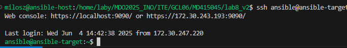

# Sprawozdanie 3
## Miłosz Dębowski [MD415045]

---

##### Cel laboratorium

Głównym zadaniem podczas laboratorium było zdobycie praktycznych umiejętności pracy z narzędziem Ansible, przeznaczonym do automatyzacji procesów konfiguracji systemów, zarządzania infrastrukturą oraz wdrażania aplikacji. Ansible to rozwiązanie open source, działające w modelu bezagentowym – wykorzystuje protokół SSH do komunikacji ze zdalnymi urządzeniami, dzięki czemu nie wymaga instalacji dodatkowych komponentów na docelowych hostach.  

W ramach ćwiczeń trzeba było zrealizować również automatyczną instalację systemu operacyjnego z wykorzystaniem pliku odpowiedzi Anacondy, a następnie uruchomić aplikację (Nginx) na zewnątrz maszyny wirtualnej przy użyciu Kubernetes w środowisku Minikube. Kolejne etapy obejmowały skalowanie podów, testowanie strategii wdrażania (m.in. Recreate, Rolling Update, Canary Deployment) oraz ćwiczenie procedury rollbacku w przypadku nieudanej aktualizacji.

### Instalacja Zarządcy Ansible
1. Stworzenie nowej maszyny `ansible-target`

    

    

2. Zainstalowanie wszystkich potrzebnych narzędzi w tym openssh, tar
    
    ```
    sudo dnf install -y tar openssh-server
    ```
    

3. Wymiana kluczy ssh między maszynami, za pomocą `ssh-copy-id` aby ansible wykonywał się bez podawania hasła.

    

    

4. Wysłanie polecenia `ping` na obie maszyny, aby zweryfikować, czy maszyny mają ze sobą łączność.

    

    

5. Wysłanie polecenia `ping` przy użyciu Ansible

    [ping.yml](ping.yml)

    ```
    - name: Ping all hosts
      hosts: all
      become: false
      tasks:
        - name: Ping
          ansible.builtin.ping:
    ```

    [inventory.ini](inventory.ini)
    ```
    [Orchestrators]
    ansible-host ansible_host=127.0.0.1 ansible_connection=local

    [Endpoints]
    ansible-target ansible_host=172.30.243.193
    ```

    
    ```
    ansible -i inventory.ini all -m ping -u ansible
    ```


6. Skopiowanie pliku inwentaryzacji na Endpointy

    [copy_inventory.yml](copy_inventory.yml)
    
    ```
    ansible-playbook -i inventory.ini copy_inventory.yml -u ansible
    ```
    
    

    

7. Aktualizacja pakietów i restart usług

    [update_and_restart.yml](update_and_restart.yml)

    ```
    ansible-playbook -i inventory.ini update_and_restart.yml -u ansible
    ```

    

8. Przygotowanie playbooka Ansible, który automatycznie przeprowadza pełną instalację wymaganych narzędzi oraz uruchamia kontener nodejsdummytest.

    [inventory.ini](inventory.ini)
    ```
    [Orchestrators]
    ansible-host ansible_host=127.0.0.1 ansible_connection=local

    [Endpoints]
    ansible-target ansible_host=172.30.243.193
    ```

    [deploy_nodejsdummytest.yml](deploy_nodejsdummytest.yml)
    ```
    ---
    - name: Deploy node-js-dummy-test container with all required tools
      hosts: Endpoints
      become: true
      vars:
        app_dir: /opt/nodejs-dummy-test
        docker_img: nodejs_dummy_img
        docker_container: nodejs_dummy_test

      tasks:
        - name: Install Docker and Docker Compose
          dnf:
            name:
              - moby-engine
              - docker-compose
              - git
              - python3-pip
            state: present

        - name: Install Docker SDK for Python (required for Ansible Docker modules)
          pip:
            name: docker
            executable: pip3

        - name: Ensure Docker service is enabled and running
          service:
            name: docker
            enabled: yes
            state: started

        - name: Clone node-js-dummy-test repo
          git:
            repo: https://github.com/devenes/node-js-dummy-test.git
            dest: "{{ app_dir }}"
            version: master
            force: yes

        - name: Create Dockerfile for custom nodejs image
          copy:
            dest: "{{ app_dir }}/Dockerfile"
            content: |
              FROM node:16-alpine
              WORKDIR /app
              COPY package.json package-lock.json ./
              RUN npm ci --only=production
              COPY . .
              EXPOSE 3000
              CMD ["npm", "start"]

        - name: Build custom Docker image for node-js-dummy-test
          docker_image:
            name: "{{ docker_img }}"
            source: build
            build:
              path: "{{ app_dir }}"
              dockerfile: Dockerfile

        - name: Ensure old container is absent
          docker_container:
            name: "{{ docker_container }}"
            state: absent
            force_kill: yes

        - name: Run node-js-dummy-test container
          docker_container:
            name: "{{ docker_container }}"
            image: "{{ docker_img }}"
            state: started
            published_ports:
              - "3000:3000"
            env:
              NODE_ENV: production
            restart_policy: unless-stopped

        - name: Verify Docker container is running
          docker_container_info:
            name: "{{ docker_container }}"
          register: container_status

        - name: Container is running ✔
          debug:
            msg: "Docker container is running"
          when: container_status.container.State.Status == 'running'

        - name: Container failed to start ⚠
          debug:
            msg: "Docker container failed to start"
          when: container_status.container.State.Status != 'running'
    ```

    ```
    ansible-playbook -i inventory.ini deploy_nodejsdummytest.yml -u ansible
    ```

    

    

Wnioski i podsumowanie

Wykorzystanie Ansible do zarządzania kontenerami Docker pozwala skutecznie zautomatyzować proces wdrażania aplikacji. Stosowanie playbooków umożliwia łatwe i powtarzalne uruchamianie oraz kontrolowanie cyklu życia kontenerów, co znacząco upraszcza zarządzanie infrastrukturą. Dzięki temu można szybko dostosować środowisko do aktualnych potrzeb, co jest niezwykle istotne w elastycznych i nowoczesnych systemach IT. Cały proces jest szczegółowo udokumentowany za pomocą zrzutów ekranu, które ilustrują każdy kluczowy etap – od konfiguracji po uruchomienie aplikacji.

---
### Instalacje nienadzorowane

1. Uzyskanie dostępu do pliku `anaconda-ks.cfg` 

    ```
    sudo nano root/anaconda-ks.cfg
    ```

2. Zmodyfikowanie pliku:

    ```
    #version=DEVEL
    # Generated by Anaconda

    # Źródło instalacji (Fedora 41 x86_64)
    url --mirrorlist=https://mirrors.fedoraproject.org/mirrorlist?repo=fedora-41&arch=x86_64
    repo --name=updates --mirrorlist=https://mirrors.fedoraproject.org/mirrorlist?repo=updates-released-f41&arch=x86_64

    # Podstawowe ustawienia
    keyboard --vckeymap=pl --xlayouts='pl'
    lang en_US.UTF-8
    timezone Europe/Warsaw --utc
    network --bootproto=dhcp --device=eth0 --onboot=on --hostname=fedora-milosz

    # Hasła
    rootpw --iscrypted --allow-ssh $y$j9T$5r/WG/cMjuyzwjuNINTw7uRB$MOG9GO1E1acIRDOxXUz/ntBEhQl/aGVpkE1pPz6qUz9

    # Inne
    firewall --enabled --service=ssh
    selinux --enforcing
    firstboot --disable
    reboot

    # Partycjonowanie
    ignoredisk --only-use=sda
    autopart
    clearpart --all --initlabel

    %packages
    @^server-product-environment
    docker
    git
    wget
    curl
    vim
    %end

    %post --log=/var/log/kickstart-post.log
    echo "### Konfiguracja Dockera i uruchomienie kontenera..." > /dev/tty1

    systemctl enable docker

    cat <<EOF > /etc/rc.d/rc.local
    #!/bin/bash
    /usr/bin/dockerd &
    sleep 10
    /usr/bin/docker pull devenes/node-js-dummy-test:latest
    /usr/bin/docker run -d -p 80:3000 devenes/node-js-dummy-test:latest
    EOF

    chmod +x /etc/rc.d/rc.local
    %end
    ```

3. Umieszczenie pliku w swoim repozytorium na GitHubie, aby móc w przyszłości zainstalować system korzystając z tego właśnie pliku.

4. Zmiana ustawień ścieżki w GRUB podczas uruchamiania systemu, aby umożliwić instalację Fedory z pliku znajdującego się na GitHubie.

    

5. Uruchomienie instalacji.

    

    


Wnioski i podsumowanie

Automatyczna instalacja Fedory z wykorzystaniem pliku Kickstart pobranego z GitHub pozwala szybko i wygodnie skonfigurować system, definiując wszystkie kluczowe ustawienia, takie jak partycjonowanie, użytkownicy, lista pakietów czy automatyczne uruchamianie kontenera. Instalację można rozpocząć z poziomu GRUB, wskazując lokalizację pliku Kickstart za pomocą odpowiedniego parametru startowego.


### Wdrażanie na zarządzalne kontenery: Kubernetes (1)

#### Instalacja klastra Kubernetes

1.  Instalacja i Uruchomienie Minikube według [instrukcji](https://minikube.sigs.k8s.io/docs/start/?arch=%2Fwindows%2Fx86-64%2Fstable%2F.exe+download).

    

    Minikube to aplikacja pozwalająca na uruchomienie klastra Kubernetes bezpośrednio na komputerze. Proces instalacji sprowadza się do pobrania pliku wykonywalnego, zainstalowania go w systemie i uruchomienia klastra. Minikube automatycznie konfiguruje środowisko, dzięki czemu świetnie sprawdza się podczas nauki, testowania oraz tworzenia aplikacji w warunkach zbliżonych do produkcyjnych.

2. Instalacja Kubectl
    
    ```
    sudo snap install kubectl --classic
    ```

    Kubectl jest narzędziem wiersza poleceń dla Kubernetes, które pozwala na zarządzanie klastrem, wdrożeniami i usługami.

3. Uruchomienie Dashboardu Kubernetes

    ```
    minikube dashboard
    ```

    

    

4. Pobranie obrazu nginx'a

    ```
    docker pull nginx
    ```

    

5. Stworzenie własnej konfiguracji [nginx](nginx.conf) oraz pliku [Dockerfile](nginx.Dockerfile)

    [nginx](nginx.conf)
    ```
    events {}

    http {
        server {
            listen 8088;
            location / {
                return 200 'Custom NGINX config!';
                add_header Content-Type text/plain;
            }
        }
    }
    ```

    [Dockerfile](nginx.Dockerfile)
    ```
    FROM nginx:latest
    COPY nginx.conf /etc/nginx/nginx.conf
    ```

6. Zbudowanie obrazu

    ```
    docker build -f nginx.Dockerfile -t my-custom-nginx .
    ```

    

7. Przesłanie obrazu do kubernetesa i uruchomienie podu

    ```
    minikube image load my-custom-nginx:latest
    minikube kubectl -- run nginx-pod --image=my-custom-nginx:latest -- port=8088 --image-pull-policy=Never --labels=app=nginx-pod
    ```

    

8. Przekierowanie portów i wykazanie funkcjonalności

    ```
    minikube kubectl -- port-forward pod/nginx-pod 8088:8088
    ```

    

        

    

6. Stworzenie plików [nginx-deployment](nginx-deployment.yaml) oraz [nginx-service](nginx-service.yaml) dla aplikacji nginx w celu zapply'owania aplikacji.

    plik przed zmianami
    


    ```
    apiVersion: v1
    kind: Service
    metadata:
      name: nginx-service
    spec:
      type: NodePort
      selector:
        app: nginx
      ports:
      - port: 80
        targetPort: 8081
        nodePort: 30081
    ```

6. Apply plików yaml/

    ```
    minikube kubectl -- apply -f nginx-deployment.yaml
    ```

    ```
    minikube kubectl -- apply -f nginx-service.yaml
    ```

7. Sprawdzenie utworzenia się podów oraz serwisów.

    ```
    kubectl get pods -A
    kubectl get svc
    ```

8. Sprawdzenie działania aplikacji.

    
    
    
    

### Wdrażanie na zarządzalne kontenery: Kubernetes (2)

1. Stworzenie 3 konfiguracji nginx'a (dwa dobre i jeden który zawsze zwróci błąd).

    - [nginx-v1.conf](nginx-v1.conf)

    ```
    events {}
    http {
        server {
            listen 8081;
            location / {
                return 200 'Hello from v1!';
                add_header Content-Type text/plain;
            }
        }
    }
    ```

    - [nginx-v2.conf](nginx-v2.conf)

    ```
    events {}
    http {
        server {
            listen 8081;
            location / {
                return 200 'Hello from v2!';
                add_header Content-Type text/plain;
            }
        }
    }
    ```

    - [nginx-bad.conf](nginx-bad.conf)

    ```
    events {}
    http {
        server {
            listen 8081;
            location / {
                THIS_IS_SYNTAX_ERROR
            }
        }
    }
    ```

2. Zbudowanie obrazów poprzez `docker build` i bezpośrednie załadowanie ich do Kubernetesa poprzez `minikube image load`

    

    

3. Modyfikacja deploymentu oraz serwisu dla obrazów.

    ```
    apiVersion: apps/v1
    kind: Deployment
    metadata:
      name: nginx-deployment
    spec:
      replicas: 8
      revisionHistoryLimit: 5
      selector:
        matchLabels:
          app: nginx
      strategy:
        type: Recreate
      template:
        metadata:
          labels:
            app: nginx
        spec:
          containers:
          - name: nginx
            image: custom-nginx:v1
            ports:
            - containerPort: 8081
    ```


    ```
    apiVersion: v1
    kind: Service
    metadata:
      name: nginx-service
    spec:
      type: NodePort
      selector:
        app: nginx
      ports:
      - port: 80
        targetPort: 8081
        nodePort: 30081
    ```

    - Aplikacja deploymentu oraz serwisu

    ```
    minikube kubectl -- apply -f nginx-deployment.yaml
    ```

    ```
    minikube kubectl -- apply -f nginx-service.yaml
    ```

4. Zmiana wersji aplikacji i ilości tworzenia się replik poszczególnych deploymentów i obserwacja zachowania

    
    
    
    
    
    
    
    
    
    
    
    
    
    
    
    
    
    
    


5. Przeprowadzenie rollbacku do wcześniejszej wersji, czyli przywrócenie działającej wersji v2 zamiast deploymentu, w którym wystąpił błąd.

    ```
    minikube kubectl -- rollout undo deployment/nginx-deployment
    ```

    można również cofnąć do konkretnej wersji:

    ```
    minikube kubectl -- rollout undo deployment/nginx-deployment --to-revision=1
    ```

    

    

    

    sprawdzenie historii rollout'ów

    ```
    minikube kubectl -- rollout history deployment nginx-deployment
    ```

    sprawdzenie statusu rollout'u naszego deploymentu

    ```
    minikube kubectl -- rollout status deployment nginx-deployment
    ```

6. Stworzenie pliku [check-deployment](check-deployment.sh) sprawdzającego czy deployment wykonał się na czas (poniżej 60sekund).

    ```bash
    #!/bin/bash
    for i in {1..60}; do
      ready=$(minikube kubectl -- get deploy nginx-deployment -o jsonpath='{.status.readyReplicas}')
      desired=$(minikube kubectl -- get deploy nginx-deployment -o jsonpath='{.spec.replicas}')
      if [[ "$ready" == "$desired" && "$desired" != "" ]]; then
        echo "Deployment is ready ($ready/$desired)"
        exit 0
      fi
      sleep 1
    done
    echo "Deployment nie odpalił się w 60s"
    exit 1
    ```

    W przypadku wykonania się doploy'a w 60 sekund program wypisze "Deployment is ready (n/n)"

    

    W innym przypadku wyświetli się komunikat " Deployment nie odpalił sie w 60s"

    


7. Zmiana strategii na RollingUpdate 

    Strategię można zmienić w pliku [nginx-deployment.yaml](nginx-deployment.yaml)

    


8. Zmiana strategii na Recreate.

    

    *finalna wersja pliku

    ```
    apiVersion: apps/v1
    kind: Deployment
    metadata:
      name: nginx-deployment
    spec:
      replicas: 8
      revisionHistoryLimit: 5
      selector:
        matchLabels:
          app: nginx
      strategy:
        type: Recreate
      template:
        metadata:
          labels:
            app: nginx
        spec:
          containers:
          - name: nginx
            image: custom-nginx:v1
            ports:
            - containerPort: 8081
    ```

    
    
    


Wnioski

Strategie wdrażania w Kubernetesie pozwalają dobrać sposób aktualizacji aplikacji do indywidualnych wymagań. Rolling Update minimalizuje przestoje, jednak niesie ryzyko częściowego wdrożenia wadliwej wersji. Recreate gwarantuje pełne zastąpienie starej wersji nową, ale wiąże się z chwilową niedostępnością aplikacji. Canary deployment to raczej wzorzec projektowy niż wbudowana strategia — polega na stopniowym udostępnianiu nowej wersji aplikacji wybranej części użytkowników, co pozwala bezpiecznie testować zmiany i szybko wycofać wdrożenie w razie problemów.


