# Zajęcia 02 Git, Docker

## 2.1. Instalacja i weryfikacja środowiska Docker

Zgodnie z poleceniem, zainstalowano Docker w systemie Linux za pomocą menedżera pakietów DNF:

```bash
sudo dnf install docker
```

Następnie uruchomiono usługę Docker przy pomocy systemd:

```bash
sudo systemctl start docker
```

Na koniec zweryfikowano poprawność instalacji sprawdzając wersję zainstalowanego Dockera:

```bash
docker --version
```

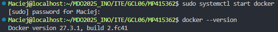

## 2.2. Rejestracja w Docker Hub

Wykonano logowanie do serwisu Docker Hub przy użyciu polecenia:

```bash
docker login
```

Logowanie do Docker Hub umożliwia dostęp do publicznych repozytoriów obrazów oraz możliwość publikowania własnych obrazów.

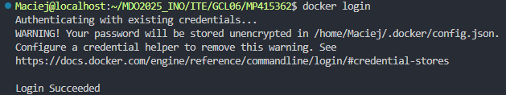

## 2.3. Pobranie obrazów Docker

Pobrano wymagane obrazy kontenerów za pomocą polecenia `docker pull`:

```bash
docker pull hello-world
```
Obraz testowy "hello-world" służy do weryfikacji poprawności działania Dockera.

```bash
docker pull busybox
```
BusyBox to minimalistyczny zestaw narzędzi unixowych w jednym pliku wykonywalnym.

```bash
docker pull fedora
```
Fedora to kompletna dystrybucja Linuxa utrzymywana przez projekt Fedora.

```bash
docker pull mysql
```
MySQL to popularny system zarządzania relacyjnymi bazami danych.

Po pobraniu obrazów sprawdzono listę dostępnych lokalnie obrazów:

```bash
docker images
```
Polecenie to wyświetla wszystkie pobrane obrazy wraz z informacjami o ich rozmiarze i tagach.

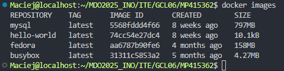

## 2.4. Uruchomienie kontenera BusyBox

Uruchomiono kontener z obrazu busybox w trybie odłączonym (detached, flaga `-d`), który w nieskończonej pętli monitoruje pusty plik:

```bash
docker run -d busybox tail -f /dev/null
```
Flaga `-d` (detached) uruchamia kontener w tle, a polecenie `tail -f /dev/null` jest używane jako proces główny, aby kontener nie zakończył działania.

Sprawdzono listę działających kontenerów:

```bash
docker ps
```
Polecenie `docker ps` pokazuje wszystkie aktualnie uruchomione kontenery.

Następnie podłączono się do kontenera w trybie interaktywnym:

```bash
docker exec -it b66c9eef9fc5 sh
```
Gdzie:
- `exec` oznacza wykonanie polecenia w działającym kontenerze
- `-it` to połączenie flag `-i` (interaktywny) i `-t` (alokacja pseudo-TTY)
- `b66c9eef9fc5` to identyfikator kontenera (losowo przydzielony przez Docker)
- `sh` to polecenie, które chcemy wykonać (powłoka)

Wywołano numer wersji znajdujący się w pierwszej linijce po poleceniu:

```bash
busybox --help
```

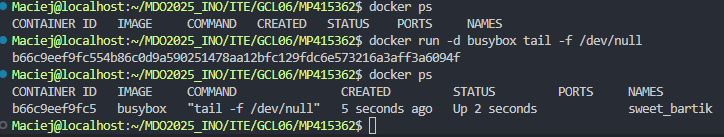
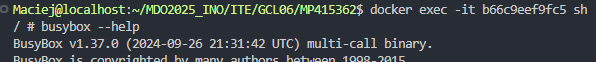

Następnie zatrzymano i usunięto kontener:

```bash
docker stop b66c9eef9fc5
```
Polecenie `stop` powoduje zatrzymanie procesu głównego kontenera.

```bash
docker rm b66c9eef9fc5
```
Polecenie `rm` usuwa zatrzymany kontener z systemu.

Następnie uruchomiono nowy kontener w trybie odłączonym, ale z interaktywną powłoką:

```bash
docker run -d -it fedora bash
```
Flagi `-d -it` oznaczają uruchomienie w tle, ale z możliwością podłączenia się interaktywnie, a `bash` to powłoka, która będzie uruchomiona w kontenerze.

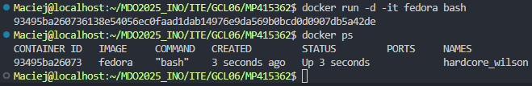

## 2.5. System w kontenerze

Podłączono się do uruchomionego kontenera bazującego na obrazie Fedora:

```bash
docker attach 93495ba26073
```
Polecenie `attach` podłącza standardowe wejście/wyjście do kontenera. Identyfikator `93495ba26073` to unikalny identyfikator kontenera.

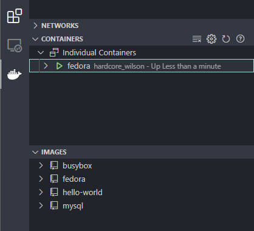
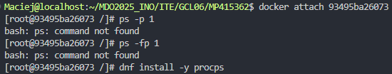

Próbowano wyświetlić informacje o PID 1 (proces init) w kontenerze:

```bash
ps -p 1
```
Polecenie `ps -p 1` powinno wyświetlić informacje o procesie o ID 1.

```bash
ps -fp 1
```
Flaga `-f` (full) dodaje więcej szczegółów o procesie.

Napotkano problem z brakiem narzędzia procps, które jest niezbędne do działania polecenia `ps`. Zainstalowano je:

```bash
dnf install -y procps
```
Flaga `-y` automatycznie potwierdza instalację.

Po instalacji ponownie sprawdzono PID 1:

```bash
ps -fp 1
```

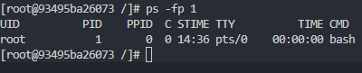

Zaktualizowano pakiety w kontenerze:

```bash
dnf update -y
```
Polecenie to aktualizuje wszystkie pakiety zainstalowane w kontenerze do najnowszych wersji.

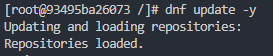

Wyświetlono listę wszystkich procesów w kontenerze:

```bash
ps aux
```
Flaga `aux` wyświetla wszystkie procesy ze szczegółowymi informacjami.

Interesują nas jednak tylko procesy związane z Dockerem:

```bash
ps aux | grep docker
```
Operator `|` (pipe) przekazuje wynik polecenia `ps aux` do polecenia `grep docker`, które filtruje wyjście, pokazując tylko linie zawierające słowo "docker".

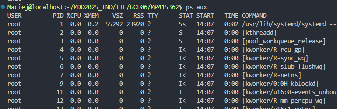
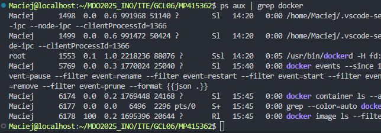

Na koniec opuszczono kontener:

```bash
exit
```
Polecenie `exit` kończy sesję w kontenerze, a ponieważ jest to główny proces, kontener zostaje zatrzymany.

## 2.6. Tworzenie własnego obrazu z pliku Dockerfile

Utworzono plik Dockerfile z następującą zawartością:

```Dockerfile
FROM fedora:latest
```
Dyrektywa `FROM` określa obraz bazowy, na którym będzie bazował nasz nowy obraz.

```Dockerfile
RUN dnf install -y git
```
Dyrektywa `RUN` wykonuje polecenie podczas budowania obrazu. W tym przypadku instalujemy git.

```Dockerfile
RUN mkdir -p /app
```
Tworzymy katalog `/app` w obrazie.

```Dockerfile
WORKDIR /app
```
Dyrektywa `WORKDIR` ustawia katalog roboczy dla kolejnych instrukcji.

```Dockerfile
RUN git clone https://github.com/InstrukcjeBitowe/ite-22-23
```
Klonujemy repozytorium git do katalogu roboczego.

```Dockerfile
CMD ["/bin/bash"]
```
Dyrektywa `CMD` określa domyślne polecenie, które będzie wykonane przy uruchomieniu kontenera.

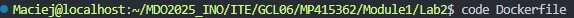

Zbudowano własny obraz na podstawie pliku Dockerfile:

```bash
docker build -t fedora-dockerfile .
```
Polecenie `build` tworzy obraz z pliku Dockerfile:
- Flaga `-t` (tag) nadaje nazwę obrazowi
- `.` określa lokalizację kontekstu budowania (bieżący katalog)

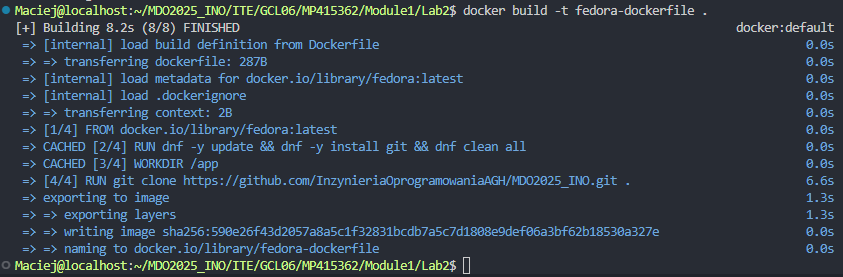

Uruchomiono kontener z nowego obrazu w trybie interaktywnym:

```bash
docker run -it fedora-dockerfile
```
Flagi `-it` umożliwiają interaktywną pracę z kontenerem.

Zweryfikowano poprawność sklonowania repozytorium:

```bash
ls -la
```
Wyświetla listę plików w katalogu roboczym.

```bash
git status
```
Sprawdza status repozytorium git.

```bash
exit
```
Opuszcza kontener.

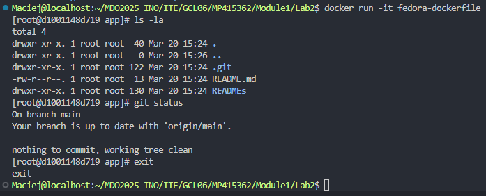

## 2.7. Zarządzanie kontenerami

Wyświetlono wszystkie kontenery (również zatrzymane):

```bash
docker ps -a
```
Flaga `-a` (all) pokazuje zarówno uruchomione, jak i zatrzymane kontenery.

Wyczyszczono nieużywane kontenery:

```bash
docker container prune
```
Polecenie `prune` usuwa wszystkie zatrzymane kontenery.

Sprawdzono efekt czyszczenia:

```bash
docker ps -a
```

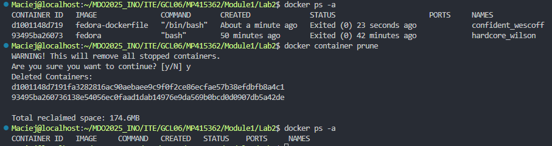

## 2.8. Czyszczenie obrazów

Wyświetlono listę wszystkich obrazów:

```bash
docker images
```

Usunięto nieużywane obrazy:

```bash
docker image prune -a
```
Polecenie `prune` z flagą `-a` usuwa wszystkie obrazy, które nie są używane przez żaden kontener.

Sprawdzono efekt czyszczenia:

```bash
docker images
```

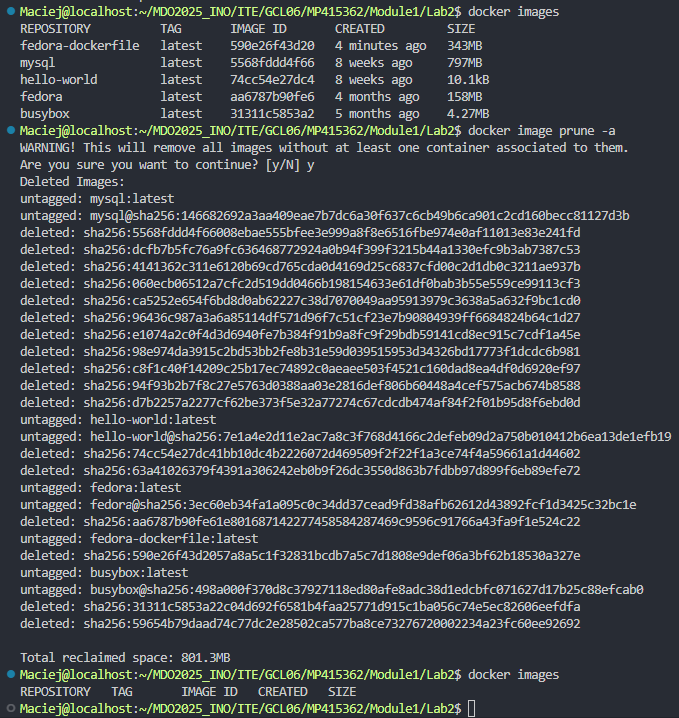

## 2.9. Dodanie pliku Dockerfile do repozytorium

Dodano utworzony plik Dockerfile do folderu Lab2 w repozytorium.
