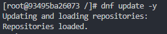

# Zajęcia 01 Wprowadzenie, Git, Gałęzie, SSH

## 1.1 Instalacja klienta Git i obsługi kluczy SSH

Zgodnie z poleceniem, zainstalowano niezbędne narzędzia przy użyciu menedżera pakietów DNF:

```bash
sudo dnf install git openssh
```

## 1.2 Generowanie tokenu i klonowanie repozytorium
Na platformie github.com w ustawieniach deweloperskich wygenerowano token PAT: 


Sklonowano repozytorium przedmiotowe z wykorzystaniem protokołu HTTPS i wygenerowanego wcześniej PAT:

```bash
git clone https://github.com/InzynieriaOprogramowaniaAGH/MDO2025_INO.git
```

## 1.3 Konfiguracja dostępu SSH

### 1.3.1 Generowanie kluczy SSH

Utworzono dwa klucze SSH zgodnie z wymaganiami, w tym jeden zabezpieczony hasłem:


```bash
ssh-keygen -t ed25519 -C "skoczeka8" -f ~/.ssh/id_ed25519
ssh-keygen -t ecdsa -b 521 -C "skoczeka8 521" -f ~/.ssh/id_ecdsa
```


### 1.3.2 Konfiguracja agenta SSH

Uruchomiono agenta SSH, aby zarządzać kluczami i umożliwić bezhasłowe uwierzytelnianie:

```bash
eval "$(ssh-agent -s)"
```

Następnie dodano wygenerowane klucze do agenta SSH:

```bash
ssh-add ~/.ssh/id_ed25519
ssh-add ~/.ssh/id_ecdsa
```

### 1.3.3 Dodanie klucza SSH do konta GitHub

Dodano klucz publiczny Ed25519 do konta GitHub:


Treść wklejonego klucza powinna wyglądać tak:

```
ssh-ed25519 [treść klucza publicznego] skoczeka8
```

Poprawnie dodany klucz SSH na githubie:


Zweryfikowano poprawność konfiguracji:

```bash
ssh -T git@github.com
```

Otrzymano pozytywne potwierdzenie:


### 1.3.4 Klonowanie repozytorium przez SSH

Po poprawnym skonfigurowaniu kluczy, sklonowano repozytorium z wykorzystaniem protokołu SSH:

```bash
git clone git@github.com:InzynieriaOprogramowaniaAGH/MDO2025_INO.git
```

### 1.3.5 Konfiguracja uwierzytelniania dwuskładnikowego (2FA)

Skonfigurowano uwierzytelnianie dwuskładnikowe na koncie GitHub dla zwiększenia bezpieczeństwa.


## 1.4 Nawigacja między gałęziami

Przełączono się na gałąź główną:

```bash
git checkout main
```

Wylistowano wszystkie zdalnye gałęzie dostępnye w repozytorium:

```bash
git branch -r
```

Następnie przełączono na gałąź grupy:

```bash
git checkout GCL06
```

## 1.5 Tworzenie własnej gałęzi

Utworzono nową gałąź bazującą na gałęzi grupowej, zgodnie z konwencją "inicjały & nr indeksu":

```bash
git checkout -b "MP415362"
```

## 1.6 Praca na nowej gałęzi

### 1.6.1 Tworzenie struktury katalogów

W katalogu właściwym dla grupy utworzono nowy katalog o nazwie zgodnej z konwencją:

```bash
mkdir MP415362
cd MP415362
```

### 1.6.2 Implementacja Git hook'a

Utworzono skrypt weryfikujący format wiadomości commit. Poniżej treść skryptu `commit-msg`:

```bash
#!/bin/bash

commit_msg=$(cat "$1")

if ! [[ "$commit_msg" =~ ^MP415362.* ]]; then
    echo "Błąd: Wiadomość commita musi zaczynać się od 'MP415362'"
    echo "Twoja wiadomość: $commit_msg"
    exit 1
fi

exit 0
```

Nadano uprawnienia wykonywania dla skryptu:

```bash
chmod +x commit-msg
```

Skopiowano skrypt do katalogu hooks w repozytorium Git:

```bash
cp commit-msg ../.git/hooks/
```

### 1.6.3 Tworzenie sprawozdania

Utworzono plik sprawozdania zawierający opis wykonanych zadań oraz zrzuty ekranu dokumentujące proces pracy:

```bash
touch sprawozdanie.md
```

### 1.6.4 Wysyłanie zmian do zdalnego repozytorium

Dodano pliki do śledzenia przez Git:

```bash
git add .
```

Zatwierdzono zmiany z odpowiednią wiadomością:

```bash
git commit -m "MP415362 Dodanie sprawozdania i skryptu git hook"
```

Wysłano zmiany do zdalnego repozytorium:

```bash
git push -u origin MP415362
```

### 1.6.5 Próba scalenia gałęzi

Próbowano scalić własną gałąź z gałęzią grupową:

```bash
git checkout GCL06
git merge MP415362
git push origin GCL06
```


### 1.6.6 Aktualizacja sprawozdania

Po wykonaniu wszystkich kroków, zaktualizowano sprawozdanie o ostatnie działania:

```bash
git checkout MP415362
# edycja pliku sprawozdania
git add sprawozdanie.md
git commit -m "MP415362 Aktualizacja sprawozdania o krok scalenia gałęzi"
git push origin MP415362
```


# Zajęcia 02 Git, Docker

## 2.1. Instalacja i weryfikacja środowiska Docker

Zgodnie z poleceniem, zainstalowano Docker w systemie Linux za pomocą menedżera pakietów DNF:

```bash
sudo dnf install docker
```

Następnie uruchomiono usługę Docker przy pomocy systemd:

```bash
sudo systemctl start docker
```

Na koniec zweryfikowano poprawność instalacji sprawdzając wersję zainstalowanego Dockera:

```bash
docker --version
```


## 2.2. Rejestracja w Docker Hub

Wykonano logowanie do serwisu Docker Hub przy użyciu polecenia:

```bash
docker login
```

Logowanie do Docker Hub umożliwia dostęp do publicznych repozytoriów obrazów oraz możliwość publikowania własnych obrazów.


## 2.3. Pobranie obrazów Docker

Pobrano wymagane obrazy kontenerów za pomocą polecenia `docker pull`:

```bash
docker pull hello-world
```
Obraz testowy "hello-world" służy do weryfikacji poprawności działania Dockera.

```bash
docker pull busybox
```
BusyBox to minimalistyczny zestaw narzędzi unixowych w jednym pliku wykonywalnym.

```bash
docker pull fedora
```
Fedora to kompletna dystrybucja Linuxa utrzymywana przez projekt Fedora.

```bash
docker pull mysql
```
MySQL to popularny system zarządzania relacyjnymi bazami danych.

Po pobraniu obrazów sprawdzono listę dostępnych lokalnie obrazów:

```bash
docker images
```
Polecenie to wyświetla wszystkie pobrane obrazy wraz z informacjami o ich rozmiarze i tagach.


## 2.4. Uruchomienie kontenera BusyBox

Uruchomiono kontener z obrazu busybox w trybie odłączonym (detached, flaga `-d`), który w nieskończonej pętli monitoruje pusty plik:

```bash
docker run -d busybox tail -f /dev/null
```
Flaga `-d` (detached) uruchamia kontener w tle, a polecenie `tail -f /dev/null` jest używane jako proces główny, aby kontener nie zakończył działania.

Sprawdzono listę działających kontenerów:

```bash
docker ps
```
Polecenie `docker ps` pokazuje wszystkie aktualnie uruchomione kontenery.

Następnie podłączono się do kontenera w trybie interaktywnym:

```bash
docker exec -it b66c9eef9fc5 sh
```
Gdzie:
- `exec` oznacza wykonanie polecenia w działającym kontenerze
- `-it` to połączenie flag `-i` (interaktywny) i `-t` (alokacja pseudo-TTY)
- `b66c9eef9fc5` to identyfikator kontenera (losowo przydzielony przez Docker)
- `sh` to polecenie, które chcemy wykonać (powłoka)

Wywołano numer wersji znajdujący się w pierwszej linijce po poleceniu:

```bash
busybox --help
```


Następnie zatrzymano i usunięto kontener:

```bash
docker stop b66c9eef9fc5
```
Polecenie `stop` powoduje zatrzymanie procesu głównego kontenera.

```bash
docker rm b66c9eef9fc5
```
Polecenie `rm` usuwa zatrzymany kontener z systemu.

Następnie uruchomiono nowy kontener w trybie odłączonym, ale z interaktywną powłoką:

```bash
docker run -d -it fedora bash
```
Flagi `-d -it` oznaczają uruchomienie w tle, ale z możliwością podłączenia się interaktywnie, a `bash` to powłoka, która będzie uruchomiona w kontenerze.


## 2.5. System w kontenerze

Podłączono się do uruchomionego kontenera bazującego na obrazie Fedora:

```bash
docker attach 93495ba26073
```
Polecenie `attach` podłącza standardowe wejście/wyjście do kontenera. Identyfikator `93495ba26073` to unikalny identyfikator kontenera.


Próbowano wyświetlić informacje o PID 1 (proces init) w kontenerze:

```bash
ps -p 1
```
Polecenie `ps -p 1` powinno wyświetlić informacje o procesie o ID 1.

```bash
ps -fp 1
```
Flaga `-f` (full) dodaje więcej szczegółów o procesie.

Napotkano problem z brakiem narzędzia procps, które jest niezbędne do działania polecenia `ps`. Zainstalowano je:

```bash
dnf install -y procps
```
Flaga `-y` automatycznie potwierdza instalację.

Po instalacji ponownie sprawdzono PID 1:

```bash
ps -fp 1
```


Zaktualizowano pakiety w kontenerze:

```bash
dnf update -y
```
Polecenie to aktualizuje wszystkie pakiety zainstalowane w kontenerze do najnowszych wersji.



Wyświetlono listę wszystkich procesów w kontenerze:

```bash
ps aux
```
Flaga `aux` wyświetla wszystkie procesy ze szczegółowymi informacjami.

Interesują nas jednak tylko procesy związane z Dockerem:

```bash
ps aux | grep docker
```
Operator `|` (pipe) przekazuje wynik polecenia `ps aux` do polecenia `grep docker`, które filtruje wyjście, pokazując tylko linie zawierające słowo "docker".


Na koniec opuszczono kontener:

```bash
exit
```
Polecenie `exit` kończy sesję w kontenerze, a ponieważ jest to główny proces, kontener zostaje zatrzymany.

## 2.6. Tworzenie własnego obrazu z pliku Dockerfile

Utworzono plik Dockerfile z następującą zawartością:

```Dockerfile
FROM fedora:latest
```
Dyrektywa `FROM` określa obraz bazowy, na którym będzie bazował nasz nowy obraz.

```Dockerfile
RUN dnf install -y git
```
Dyrektywa `RUN` wykonuje polecenie podczas budowania obrazu. W tym przypadku instalujemy git.

```Dockerfile
RUN mkdir -p /app
```
Tworzymy katalog `/app` w obrazie.

```Dockerfile
WORKDIR /app
```
Dyrektywa `WORKDIR` ustawia katalog roboczy dla kolejnych instrukcji.

```Dockerfile
RUN git clone https://github.com/InstrukcjeBitowe/ite-22-23
```
Klonujemy repozytorium git do katalogu roboczego.

```Dockerfile
CMD ["/bin/bash"]
```
Dyrektywa `CMD` określa domyślne polecenie, które będzie wykonane przy uruchomieniu kontenera.


Zbudowano własny obraz na podstawie pliku Dockerfile:

```bash
docker build -t fedora-dockerfile .
```
Polecenie `build` tworzy obraz z pliku Dockerfile:
- Flaga `-t` (tag) nadaje nazwę obrazowi
- `.` określa lokalizację kontekstu budowania (bieżący katalog)


Uruchomiono kontener z nowego obrazu w trybie interaktywnym:

```bash
docker run -it fedora-dockerfile
```
Flagi `-it` umożliwiają interaktywną pracę z kontenerem.

Zweryfikowano poprawność sklonowania repozytorium:

```bash
ls -la
```
Wyświetla listę plików w katalogu roboczym.

```bash
git status
```
Sprawdza status repozytorium git.

```bash
exit
```
Opuszcza kontener.


## 2.7. Zarządzanie kontenerami

Wyświetlono wszystkie kontenery (również zatrzymane):

```bash
docker ps -a
```
Flaga `-a` (all) pokazuje zarówno uruchomione, jak i zatrzymane kontenery.

Wyczyszczono nieużywane kontenery:

```bash
docker container prune
```
Polecenie `prune` usuwa wszystkie zatrzymane kontenery.

Sprawdzono efekt czyszczenia:

```bash
docker ps -a
```


## 2.8. Czyszczenie obrazów

Wyświetlono listę wszystkich obrazów:

```bash
docker images
```

Usunięto nieużywane obrazy:

```bash
docker image prune -a
```
Polecenie `prune` z flagą `-a` usuwa wszystkie obrazy, które nie są używane przez żaden kontener.

Sprawdzono efekt czyszczenia:

```bash
docker images
```


## 2.9. Dodanie pliku Dockerfile do repozytorium

Dodano utworzony plik Dockerfile do folderu Lab2 w repozytorium.

# Zajęcia 03 Dockerfiles, kontener jako definicja etapu

## 3.1. Wybór oprogramowania na zajęcia

Zgodnie z wymaganiami, wybrano repozytorium z oprogramowaniem spełniającym kryteria:
- posiada otwartą licencję
- zawiera narzędzia umożliwiające budowanie i testowanie
- zawiera zdefiniowane testy z jednoznacznym raportem końcowym

Wybrano projekt node-js-dummy-test, który jest prostą aplikacją Todo opartą na Node.js:

```bash
git clone https://github.com/devenes/node-js-dummy-test
```
Polecenie to klonuje repozytorium z aplikacją do lokalnego katalogu.


Następnie zainstalowano wymagane zależności systemowe, w tym przypadku npm (Node Package Manager):

```bash
sudo dnf install npm
```
Polecenie to instaluje narzędzie npm przy użyciu menedżera pakietów DNF, które jest wymagane do zarządzania zależnościami Node.js.


Po przejściu do katalogu projektu zainstalowano zależności projektu:

```bash
npm install
```
Polecenie to instaluje wszystkie wymagane zależności projektu zdefiniowane w pliku package.json.


Uruchomiono aplikację:

```bash
npm start
```
Polecenie `npm start` uruchamia serwer aplikacji, dzięki czemu jest ona dostępna przez przeglądarkę.


Potwierdzono działanie aplikacji poprzez otwarcie jej w przeglądarce pod adresem localhost:


Uruchomiono testy jednostkowe:

```bash
npm test
```
Polecenie to uruchamia zdefiniowane w projekcie testy.


## 3.2. Przeprowadzenie buildu w kontenerze

### 3.2.1. Interaktywna praca z kontenerem

Sprawdzono dostępne obrazy Docker:

```bash
docker images
```
Polecenie to wyświetla listę wszystkich lokalnie dostępnych obrazów Docker.


Uruchomiono kontener bazowy Node.js w trybie interaktywnym:

```bash
docker run -d -it --rm node:22.14.0
```
Gdzie:
- `-d` uruchamia kontener w tle (detached mode)
- `-it` zapewnia interaktywny terminal
- `--rm` automatycznie usuwa kontener po zatrzymaniu
- `node:22.14.0` to obraz bazowy z określoną wersją Node.js

Następnie sprawdzono działające kontenery:

```bash
docker ps
```


Wewnątrz kontenera sklonowano repozytorium:

```bash
git clone https://github.com/devenes/node-js-dummy-test
```
To polecenie pobiera kod źródłowy aplikacji do kontenera.


Zmieniono katalog na katalog projektu i zainstalowano zależności:

```bash
cd node-js-dummy-test
npm install
```
Te polecenia przygotowują środowisko projektu w kontenerze.


Uruchomiono aplikację i testy w kontenerze:

```bash
npm start
npm test
```
Polecenia te weryfikują poprawność działania aplikacji w środowisku kontenerowym.


### 3.2.2. Automatyzacja procesu za pomocą Dockerfile

Stworzono trzy pliki Dockerfile do automatyzacji procesu:

1. Dockerfile.nodebuild - odpowiedzialny za budowanie aplikacji:

```Dockerfile
FROM node:22.14.0
```
Określa obraz bazowy - oficjalny obraz Node.js w wersji 22.14.0.

```Dockerfile
RUN git clone https://github.com/devenes/node-js-dummy-test
```
Klonuje repozytorium z kodem źródłowym.

```Dockerfile
WORKDIR /node-js-dummy-test
```
Ustawia katalog roboczy na sklonowane repozytorium.

```Dockerfile
RUN npm install
```
Instaluje wszystkie zależności projektu.

2. Dockerfile.noderun - odpowiedzialny za uruchomienie aplikacji:

```Dockerfile
FROM nodebuild
```
Bazuje na wcześniej utworzonym obrazie `nodebuild`.

```Dockerfile
CMD ["npm", "start"]
```
Określa domyślne polecenie, które zostanie wykonane przy uruchomieniu kontenera - uruchomienie aplikacji.

3. Dockerfile.nodetest - odpowiedzialny za uruchomienie testów:

```Dockerfile
FROM nodebuild
```
Również bazuje na obrazie `nodebuild`.

```Dockerfile
CMD ["npm", "test"]
```
Określa domyślne polecenie jako uruchomienie testów.


Zbudowano obraz na podstawie Dockerfile.nodebuild:

```bash
docker build -t nodebuild -f Dockerfile.nodebuild .
```
Gdzie:
- `-t nodebuild` nadaje tag (nazwę) tworzonemu obrazowi
- `-f Dockerfile.nodebuild` określa nazwę pliku Dockerfile
- `.` oznacza, że kontekst budowania to bieżący katalog


Sprawdzono utworzone obrazy:

```bash
docker images
```


Uruchomiono kontenery na podstawie utworzonych obrazów:

```bash
docker run -d --rm nodebuild
docker run -d --rm noderun
docker run -d --rm nodetest
```
Te polecenia uruchamiają kontenery bazujące na odpowiednich obrazach, z automatycznym usuwaniem po zatrzymaniu.


Sprawdzono uruchomione kontenery:

```bash
docker ps -a
```
Polecenie to pokazuje wszystkie kontenery, zarówno uruchomione, jak i zatrzymane.


Sprawdzono logi poszczególnych kontenerów, aby zweryfikować ich poprawne działanie:

```bash
docker logs <container_id>
```
Polecenie to wyświetla logi generowane przez aplikację w kontenerze.


## 3.3. Docker Compose

Utworzono plik docker-compose.yml do automatyzacji procesu wdrażania:

```yaml
services:
  nodebuild:
    build:
      context: .
      dockerfile: Dockerfile.nodebuild
    image: nodebuild
  noderun:
    build:
      context: .
      dockerfile: Dockerfile.noderun
    image: noderun
    ports:
      - "3000:3000"
    depends_on:
      - nodebuild
  nodetest:
    build:
      context: .
      dockerfile: Dockerfile.nodetest
    image: nodetest
    depends_on:
      - nodebuild
```

Ten plik definiuje trzy usługi:
- `nodebuild` - bazowa usługa budująca aplikację
- `noderun` - usługa uruchamiająca aplikację, mapująca port 3000 kontenera na port 3000 hosta
- `nodetest` - usługa uruchamiająca testy

Zależności pomiędzy usługami są zdefiniowane za pomocą `depends_on`, co zapewnia odpowiednią kolejność uruchamiania.

Zbudowano obrazy za pomocą Docker Compose:

```bash
docker-compose build
```
Polecenie to buduje wszystkie obrazy zdefiniowane w pliku docker-compose.yml.


Uruchomiono kontenery za pomocą Docker Compose:

```bash
docker-compose up
```
Polecenie to uruchamia wszystkie usługi zdefiniowane w pliku docker-compose.yml z uwzględnieniem zależności.


# Zajęcia 04 Dodatkowa terminologia w konteneryzacji, instancja Jenkins