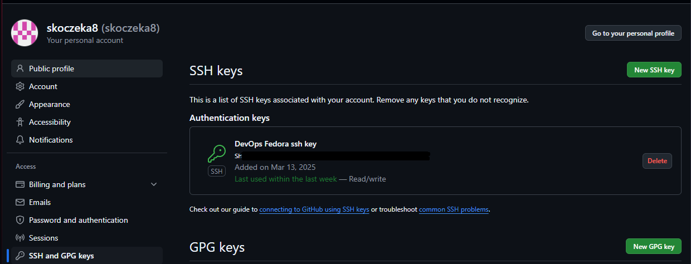

# Zajęcia 01 Wprowadzenie, Git, Gałęzie, SSH

## 1.1 Instalacja klienta Git i obsługi kluczy SSH

Zgodnie z poleceniem, zainstalowano niezbędne narzędzia przy użyciu menedżera pakietów DNF:

```bash
sudo dnf install git openssh
```

## 1.2 Generowanie tokenu i klonowanie repozytorium
Na platformie github.com w ustawieniach deweloperskich wygenerowano token PAT: 


Sklonowano repozytorium przedmiotowe z wykorzystaniem protokołu HTTPS i wygenerowanego wcześniej PAT:

```bash
git clone https://github.com/InzynieriaOprogramowaniaAGH/MDO2025_INO.git
```

## 1.3 Konfiguracja dostępu SSH

### 1.3.1 Generowanie kluczy SSH

Utworzono dwa klucze SSH zgodnie z wymaganiami, w tym jeden zabezpieczony hasłem:


```bash
ssh-keygen -t ed25519 -C "skoczeka8" -f ~/.ssh/id_ed25519
ssh-keygen -t ecdsa -b 521 -C "skoczeka8 521" -f ~/.ssh/id_ecdsa
```


### 1.3.2 Konfiguracja agenta SSH

Uruchomiono agenta SSH, aby zarządzać kluczami i umożliwić bezhasłowe uwierzytelnianie:

```bash
eval "$(ssh-agent -s)"
```

Następnie dodano wygenerowane klucze do agenta SSH:

```bash
ssh-add ~/.ssh/id_ed25519
ssh-add ~/.ssh/id_ecdsa
```

### 1.3.3 Dodanie klucza SSH do konta GitHub

Dodano klucz publiczny Ed25519 do konta GitHub:


Treść wklejonego klucza powinna wyglądać tak:

```
ssh-ed25519 [treść klucza publicznego] skoczeka8
```

Poprawnie dodany klucz SSH na githubie:



Zweryfikowano poprawność konfiguracji:

```bash
ssh -T git@github.com
```

Otrzymano pozytywne potwierdzenie:


### 1.3.4 Klonowanie repozytorium przez SSH

Po poprawnym skonfigurowaniu kluczy, sklonowano repozytorium z wykorzystaniem protokołu SSH:

```bash
git clone git@github.com:InzynieriaOprogramowaniaAGH/MDO2025_INO.git
```

### 1.3.5 Konfiguracja uwierzytelniania dwuskładnikowego (2FA)

Skonfigurowano uwierzytelnianie dwuskładnikowe na koncie GitHub dla zwiększenia bezpieczeństwa.


## 1.4 Nawigacja między gałęziami

Przełączono się na gałąź główną:

```bash
git checkout main
```

Wylistowano wszystkie zdalnye gałęzie dostępnye w repozytorium:

```bash
git branch -r
```

Następnie przełączono na gałąź grupy:

```bash
git checkout GCL06
```

## 1.5 Tworzenie własnej gałęzi

Utworzono nową gałąź bazującą na gałęzi grupowej, zgodnie z konwencją "inicjały & nr indeksu":

```bash
git checkout -b "MP415362"
```

## 1.6 Praca na nowej gałęzi

### 1.6.1 Tworzenie struktury katalogów

W katalogu właściwym dla grupy utworzono nowy katalog o nazwie zgodnej z konwencją:

```bash
mkdir MP415362
cd MP415362
```

### 1.6.2 Implementacja Git hook'a

Utworzono skrypt weryfikujący format wiadomości commit. Poniżej treść skryptu `commit-msg`:

```bash
#!/bin/sh
MSG_FILE=$1
COMMIT_MSG=$(cat "$MSG_FILE")
if ! echo "$COMMIT_MSG" | grep -q "^MP415362"; then
    echo "Error: Commit message must start with 'MP415362'"
    exit 1
fi

exit 0
```

Nadano uprawnienia wykonywania dla skryptu:

```bash
chmod +x commit-msg
```

Skopiowano skrypt do katalogu hooks w repozytorium Git:

```bash
cp commit-msg ../.git/hooks/
```

Sprawdzono poprawność działania hooka:


### 1.6.3 Tworzenie sprawozdania

Utworzono plik sprawozdania zawierający opis wykonanych zadań oraz zrzuty ekranu dokumentujące proces pracy.

### 1.6.4 Wysyłanie zmian do zdalnego repozytorium

Dodano pliki do śledzenia przez Git:

```bash
git add .
```

Zatwierdzono zmiany z odpowiednią wiadomością:

```bash
git commit -m "MP415362 1st commit"
```

Wysłano zmiany do zdalnego repozytorium za pomocą narzędzia do source control w VS Code.

# Zajęcia 02 Git, Docker

## 2.1. Instalacja i weryfikacja środowiska Docker

Zgodnie z poleceniem, zainstalowano Docker w systemie Linux za pomocą menedżera pakietów DNF:

```bash
sudo dnf install docker
```

Następnie uruchomiono usługę Docker przy pomocy systemd:

```bash
sudo systemctl start docker
```

Na koniec zweryfikowano poprawność instalacji sprawdzając wersję zainstalowanego Dockera:

```bash
docker --version
```


## 2.2. Rejestracja w Docker Hub

Wykonano logowanie do serwisu Docker Hub przy użyciu polecenia:

```bash
docker login
```


## 2.3. Pobranie obrazów Docker

Pobrano wymagane obrazy kontenerów za pomocą polecenia `docker pull`:

```bash
docker pull hello-world
docker pull busybox
docker pull fedora
docker pull mysql
```

Po pobraniu obrazów sprawdzono listę dostępnych lokalnie obrazów:

```bash
docker images
```


## 2.4. Uruchomienie kontenera BusyBox

Uruchomiono kontener z obrazu busybox w trybie odłączonym (detached, flaga `-d`), który w nieskończonej pętli monitoruje pusty plik:

```bash
docker run -d busybox tail -f /dev/null
```

Sprawdzono listę działających kontenerów:

```bash
docker ps
```


Jak widać kontener uruchomiony z obrazu busybox działa poprawnie.

Następnie podłączono się do kontenera w trybie interaktywnym:

```bash
docker exec -it b66c9eef9fc5 sh
```

Wywołano numer wersji znajdujący się w pierwszej linijce po poleceniu:

```bash
busybox --help
```


Następnie zatrzymano i usunięto kontener:

```bash
docker stop b66c9eef9fc5
```
Polecenie `stop` powoduje zatrzymanie procesu głównego kontenera.

```bash
docker rm b66c9eef9fc5
```
Polecenie `rm` usuwa zatrzymany kontener z systemu.

Następnie uruchomiono nowy kontener w trybie odłączonym, ale z interaktywną powłoką:

```bash
docker run -d -it fedora bash
```


## 2.5. System w kontenerze

Podłączono się do uruchomionego kontenera bazującego na obrazie Fedora:

```bash
docker attach 93495ba26073
```


W tym wypadku do podłaczenia użyto polecenia `attach` podając przy tym unikalny identyfikator kontenera. Można jednak także skorzystać z wtyczki Docker w VS Code:


Spróbowano wyświetlić informacje o PID 1 (proces init) w kontenerze:

```bash
ps -p 1
# lub
ps -fp 1
```
Polecenie `ps -p 1` powinno wyświetlić informacje o procesie o ID 1, flaga `-f` dodaje więcej szczegółów o procesie.

Napotkano problem z brakiem narzędzia procps, które jest niezbędne do działania polecenia `ps`. Zainstalowano je:

```bash
dnf install -y procps
```

Po instalacji ponownie sprawdzono PID 1:

```bash
ps -fp 1
```


Zaktualizowano pakiety w kontenerze:

```bash
dnf update -y
```


Wyświetlono listę wszystkich procesów w kontenerze:

```bash
ps aux
```


Interesują nas jednak tylko procesy związane z Dockerem:

```bash
ps aux | grep docker
```
Użyto operatora `|` który przekazuje wynik polecenia `ps aux` do polecenia `grep docker`, które filtruje wyjście, pokazując tylko linie zawierające słowo "docker".


Na koniec opuszczono kontener za pomocą polecenia:

```bash
exit
```

## 2.6. Tworzenie własnego obrazu z pliku Dockerfile

Utworzono plik Dockerfile z następującą zawartością:


Treść `Dockerfile`:

```Dockerfile
FROM fedora:latest

RUN dnf -y update && dnf -y install git && dnf clean all

WORKDIR /app

RUN git clone https://github.com/InzynieriaOprogramowaniaAGH/MDO2025_INO.git .

CMD ["/bin/bash"]
```


Zbudowano własny obraz na podstawie pliku Dockerfile:

```bash
docker build -t fedora-dockerfile .
```


Uruchomiono kontener z nowego obrazu w trybie interaktywnym:

```bash
docker run -it fedora-dockerfile
```


Zweryfikowano poprawność sklonowania repozytorium. Wyświetlono listę plików w katalogu roboczym:
```bash
ls -la
```


Sprawdzono status repozytorium git:

```bash
git status
```


## 2.7. Zarządzanie kontenerami

Wyświetlono wszystkie kontenery (również zatrzymane):

```bash
docker ps -a
```
Flaga `-a` pokazuje zarówno uruchomione, jak i zatrzymane kontenery.

Wyczyszczono nieużywane kontenery:

```bash
docker container prune
```
Polecenie `prune` usuwa wszystkie zatrzymane kontenery.

Sprawdzono efekt czyszczenia:

```bash
docker ps -a
```


## 2.8. Czyszczenie obrazów

Wyświetlono listę wszystkich obrazów:

```bash
docker images
```

Usunięto nieużywane obrazy:

```bash
docker image prune -a
```
Polecenie `prune` z flagą `-a` usuwa wszystkie obrazy, które nie są używane przez żaden kontener.

Sprawdzono efekt czyszczenia:

```bash
docker images
```


# Zajęcia 03 Dockerfiles, kontener jako definicja etapu

## 3.1. Wybór oprogramowania na zajęcia

Zgodnie z wymaganiami, wybrano repozytorium z oprogramowaniem spełniającym kryteria:
- posiada otwartą licencję
- zawiera narzędzia umożliwiające budowanie i testowanie
- zawiera zdefiniowane testy z jednoznacznym raportem końcowym

Skorzystano z zaproponowanych na zajęciach:

https://github.com/devenes/node-js-dummy-test

https://github.com/irssi/irssi

Zaczęto od działań lokalnych związanych z pierwszym repozytorium:

```bash
git clone https://github.com/devenes/node-js-dummy-test
```


Następnie zainstalowano wymagane zależności systemowe, w tym przypadku npm (Node Package Manager):

```bash
sudo dnf install npm
```
Narzędzie to jest wymagane do zarządzania zależnościami Node.js.


Po przejściu do katalogu projektu zainstalowano zależności projektu:

```bash
npm install
```
Polecenie to instaluje wszystkie wymagane zależności projektu zdefiniowane w pliku package.json.


Uruchomiono aplikację:

```bash
npm start
```
Polecenie `npm start` uruchamia serwer aplikacji, dzięki czemu jest ona dostępna przez przeglądarkę.


Potwierdzono działanie aplikacji poprzez otwarcie jej w przeglądarce pod adresem localhost:


Uruchomiono testy jednostkowe:

```bash
npm test
```


## 3.2. Przeprowadzenie buildu w kontenerze

### 3.2.1. Interaktywna praca z kontenerem

Sprawdzono dostępne obrazy Docker:

```bash
docker images
```


Uruchomiono kontener bazowy Node.js w trybie interaktywnym:

```bash
docker run -d -it --rm node:22.14.0
```

Następnie sprawdzono działające kontenery:

```bash
docker ps
```


Wewnątrz kontenera sklonowano repozytorium:

```bash
git clone https://github.com/devenes/node-js-dummy-test
```


Zmieniono katalog na katalog projektu i zainstalowano zależności:

```bash
cd node-js-dummy-test
npm install
```


Uruchomiono aplikację i testy w kontenerze:

```bash
npm start
npm test
```
Polecenia te pozwoliły zweryfikować poprawność działania aplikacji w środowisku kontenerowym.


### 3.2.2. Automatyzacja procesu za pomocą Dockerfile

Stworzono trzy pliki Dockerfile do automatyzacji procesu:

1. `Dockerfile.nodebuild` - odpowiedzialny za budowanie aplikacji:

```Dockerfile
FROM node:22.14.0

RUN git clone https://github.com/devenes/node-js-dummy-test
WORKDIR /node-js-dummy-test
RUN npm install
```


2. `Dockerfile.noderun` - odpowiedzialny za uruchomienie aplikacji:

```Dockerfile
FROM nodebuild
CMD ["npm", "start"]
```

3. `Dockerfile.nodetest` - odpowiedzialny za uruchomienie testów:

```Dockerfile
FROM nodebuild
CMD ["npm", "test"]
```

Zbudowano obraz na podstawie Dockerfile.nodebuild:

```bash
docker build -t nodebuild -f Dockerfile.nodebuild .
```


Analogicznie dla pozostałych Dockerfile'i

Obrazy zostały utworzone poprawnie:

```bash
docker images
```


Uruchomiono kontenery na podstawie utworzonych obrazów:

```bash
docker run -d --rm nodebuild
docker run -d --rm noderun
docker run -d --rm nodetest
```


Sprawdzono uruchomione kontenery:

```bash
docker ps -a
```


Sprawdzono logi poszczególnych kontenerów, aby zweryfikować ich poprawne działanie:

```bash
docker logs <container_id>
```
Polecenie to wyświetla logi generowane przez aplikację w kontenerze.


Otrzymane logi są zgodne z oczekiwaniami i pokazują poprawne działanie kontenerów, podobny efekt można było uzyskać uruchamiając każdy z kontenerów bez flagi `-d` odczytując po prostu efekty działania z otwartej konsoli, lecz to rozwiązanie wydało mi się bardziej przejrzyste.

## 3.3. Docker Compose

Utworzono plik docker-compose.yml do automatyzacji procesu wdrażania:

```yaml
services:
  nodebuild:
    build:
      context: .
      dockerfile: Dockerfile.nodebuild
    image: nodebuild
  noderun:
    build:
      context: .
      dockerfile: Dockerfile.noderun
    image: noderun
    ports:
      - "3000:3000"
    depends_on:
      - nodebuild
  nodetest:
    build:
      context: .
      dockerfile: Dockerfile.nodetest
    image: nodetest
    depends_on:
      - nodebuild
```

Zdefiniowano trzy usługi:
- `nodebuild` - bazowa usługa budująca aplikację
- `noderun` - usługa uruchamiająca aplikację, mapująca port 3000 kontenera na port 3000 hosta
- `nodetest` - usługa uruchamiająca testy

Zależności pomiędzy usługami są zdefiniowane za pomocą `depends_on`, co zapewnia odpowiednią kolejność uruchamiania.

Zbudowano obrazy za pomocą Docker Compose:

```bash
docker-compose build
```
Polecenie to buduje wszystkie obrazy zdefiniowane w pliku docker-compose.yml.


Uruchomiono za pomocą Docker Compose wszystkie usługi zdefiniowane w pliku docker-compose.yml :

```bash
docker-compose up
```


Otrzymane wyniki pokrywają się z tymi uzyskanymi przy manualnym podejściu. Potwierdzono poprawne działanie dockercompose.

## 3.4. Dodatkowe testy z projektem Irssi

Ponownie wykonano wszystkie kroki zawarte w instrukcji, lecz z drugim repozytorium - Irssi.

### 3.4.1. Klonowanie repozytorium Irssi

Sklonowano repozytorium projektu Irssi:

```bash
git clone https://github.com/irssi/irssi.git
```


### 3.4.2. Konfiguracja i budowanie projektu

Podczas próby budowania projektu napotkano brak wymaganych narzędzi:

```bash
meson Build
```


Przy próbie builda okazało się, że wymagane jest zainstalowanie zależności:

```bash
sudo dnf install meson
sudo dnf install gcc
sudo dnf install glib2-devel
sudo dnf install ncurses-devel
sudo dnf install perl-ExtUtils-Embed
```

Po zainstalowaniu zależności, budowanie zakończyło się sukcesem:

```bash
meson Build
```

### 3.4.3. Uruchomienie testów lokalnie

Uruchomiono testy projektu przy użyciu narzędzia Ninja:

```bash
ninja -C Build test
```


Testy zakończyły się pomyślnie.

### 3.4.4. Testowanie w kontenerze

Uruchomiono kontener bazowy Fedora w trybie interaktywnym:

```bash
docker run -it fedora
```

Sprawdzono listę działających kontenerów:

```bash
docker ps
```

Podłączono się do uruchomionego kontenera:

```bash
docker attach <container_id>
```


Wewnątrz kontenera wykonano te same kroki co lokalnie:
- Zainstalowano wymagane zależności
- Sklonowano repozytorium
- Skonfigurowano projekt
- Uruchomiono testy


Testy w kontenerze zakończone powodzeniem.

### 3.4.5. Automatyzacja za pomocą Dockerfile

Utworzono pliki Dockerfile dla projektu Irssi:

1. `Dockerfile.irssibuild` - odpowiedzialny za budowanie aplikacji:
```Dockerfile
FROM fedora:latest
RUN dnf install -y git meson gcc glib2-devel ncurses-devel perl-ExtUtils-Embed
RUN git clone https://github.com/irssi/irssi.git
WORKDIR /irssi
RUN meson Build
```

2. `Dockerfile.irssitest` - odpowiedzialny za uruchomienie testów:
```Dockerfile
FROM irssi-build
CMD ["ninja", "-C", "Build", "test"]
```

Zbudowano oba obrazy:

```bash
docker build -t irssibuild -f Dockerfile.irssibuild .
docker build -t irssitest -f Dockerfile.irssitest .
```


Uruchomiono kontenery na podstawie utworzonych obrazów:

```bash
docker run irssibuild
docker run irssitest
```


Wynik testów ponownie pomyślny.

### 3.4.6. Poprawne działanie kontenera, różnica między obrazem a kontenerem. Co pracuje w kontenerze?

Poprawne działanie kontenerów sprawdzone zostało za pomocą:
- `docker ps` : poprawność wdrożenia
- `docker logs` : działanie zgodnie z założeniami 

Różnica między obrazem a kontenerem:
- Obraz : "szablon", na podstawie którego tworzone są kontenery
- Kontener : uruchomiona instancja obrazu, w której działa aplikacja

Jeśli chodzi o samą pracę kontenera, np. w przypadku `irssi-test`, kontener wykonuje `ninja -C Build test`, czyli uruchamia testy Irssi.

### 3.4.7. Aktualizacja Docker Compose

Zaktualizowano plik docker-compose.yml, dodając definicje usług dla projektu Irssi:

```yaml
services:
  # Irssi build
  irssibuild:
    image: irssi-build
    build:
      context: .
      dockerfile: Dockerfile.irssibuild
  # Irssi test
  irssitest:
    image: irssi-test
    build:
      context: .
      dockerfile: Dockerfile.irssitest
    depends_on:
      - irssibuild
  # Node.js build
  nodebuild:
    build:
      context: .
      dockerfile: Dockerfile.nodebuild
    image: nodebuild
  # Node.js run
  noderun:
    build:
      context: .
      dockerfile: Dockerfile.noderun
    image: noderun
    ports:
      - "3000:3000"
    depends_on:
      - nodebuild
  # Node.js test
  nodetest:
    build:
      context: .
      dockerfile: Dockerfile.nodetest
    image: nodetest
    depends_on:
      - nodebuild
```

Plik ten definiuje dwie dodatkowe usługi:
- `irssibuild` - usługa budująca aplikację Irssi
- `irssitest` - usługa uruchamiająca testy Irssi

Uruchomiono kontenery Irssi za pomocą Docker Compose:

```bash
docker-compose up --build irssibuild irssitest
```


Sprawdzono wyniki działania:


Dzięki zastosowaniu Docker Compose, cały proces budowania i testowania został zautomatyzowany, co pozwala na szybkie i powtarzalne przeprowadzanie tych operacji zarówno dla projektu Node.js, jak i Irssi.


# Zajęcia 04 Dodatkowa terminologia w konteneryzacji, instancja Jenkins
## 4.1 Zachowywanie stanu - Woluminy Docker

### 4.1.1 Tworzenie woluminów Docker

Aby umożliwić trwałe przechowywanie danych pomiędzy uruchomieniami kontenerów, utworzono dwa woluminy:

```bash
docker volume create inputvolume
docker volume create outputvolume
```

Następnie sprawdzono listę dostępnych woluminów by sprawdzić poprawnośc wykonania operacji:

```bash
docker volume ls
```


### 4.1.2 Klonowanie repozytorium i przygotowanie kontenera

Lokalnie sklonowano repozytorium testowe i pobrano bazowy obraz Docker:

```bash
git clone https://github.com/devenes/node-js-dummy-test
docker pull hello-world
```


Zdecydowano się na wykorzystanie małego obrazu hello-world do operacji kopiowania, ponieważ potrzebny był tylko prosty kontener do przeniesienia plików między systemem hosta a woluminem Docker.

### 4.1.3 Uruchomienie kontenera z podłączonymi woluminami

Uruchomiono kontener Node.js z podłączonymi woluminami wejściowym i wyjściowym:

```bash
docker run -id -d --name nodebuilder -v inputvolume:/input -v outputvolume:/output node:22.14.0
```


### 4.1.4 Kopiowanie repozytorium na wolumin wejściowy

Przygotowano tymczasowy kontener dla operacji kopiowania:

```bash
docker container create --name copycontainer -v inputvolume:/root hello-world
```

Następnie skopiowano pliki repozytorium do kontenera:

```bash
docker cp node-js-dummy-test copycontainer:/root/noderepo
```


### 4.1.5 Budowanie i testowanie aplikacji w kontenerze

Podłączono się do kontenera Node.js i sprawdzono zawartość katalogów:

```bash
ls -li
```


Skopiowano projekt z woluminu wejściowego do katalogu roboczego:

```bash
cp -a input/noderepo/. nodedir
cd nodedir/
```

Zainstalowano zależności i uruchomiono testy:

```bash
npm install
npm test
```


### 4.1.6 Zapisywanie wyników na woluminie wyjściowym

Skopiowano pliki projektu na wolumin wyjściowy:

```bash
cd ..
cp -a /nodedir/. /output/
cd output/
ls
```


### 4.1.7 Weryfikacja dostępności plików po wyłączeniu kontenera

Sprawdzono, czy pliki są faktycznie dostępne na woluminie wyjściowym, nawet po zakończeniu pracy kontenera:

```bash
sudo ls $(docker volume inspect --format '{{ .Mountpoint }}' outputvolume)
```


### 4.1.8 Powtórzenie operacji z klonowaniem wewnątrz kontenera

Najpierw wyczyszczono zawartość woluminu wyjściowego:

```bash
cd /output/
rm -rf ./*
ls
```


Następnie sklonowano repozytorium bezpośrednio na wolumin wejściowy z wnętrza kontenera:

```bash
cd /input
git clone https://github.com/devenes/node-js-dummy-test
ls
```


Ponownie skopiowano zawartość do katalogu roboczego i przeprowadzono budowanie:

```bash
cd ..
cp -a input/node-js-dummy-test/. nodedir2
ls -la nodedir2
```


```bash
cd nodedir2
npm install
npm test
```


Ponownie sprawdzono, czy pliki są faktycznie dostępne na woluminie wyjściowym, nawet po zakończeniu pracy kontenera:


### 4.1.9 Dyskusja odnośnie wykorzystania RUN --mount w Dockerfile

Po kilku testach zagłębiono się dokładniej w dokumentację dockera. Znaleziono poniższy fragment:

https://docs.docker.com/build/cache/optimize/#use-bind-mounts:~:text=Bind%20mounts%20are,instructions.


O ile dobrze zrozumiano treść dokumentacji wynika z niej, że nie można w pełni przenieść tego procesu do docker build, ale można go częściowo zautomatyzować. Zamiast RUN --mount, chyba lepiej użyć woluminów i docker run, a docker build i run powinny być oddzielnymi krokami.


## 4.2 Eksponowanie portu i komunikacja między kontenerami

### 4.2.1 Instalacja i uruchomienie serwera iperf3

Pobrano obraz z narzędziem iperf3:

```bash
docker pull networkstatic/iperf3
```


Uruchomiono kontener z serwerem iperf3 i wyeksponowano port 5201 (zgodnie z dokumentacją jest to port domyślny):

```bash
docker run -d --name iperfserver -p 5201:5201 networkstatic/iperf3 -s
```

Sprawdzono szczegóły uruchomionego kontenera:

```bash
docker inspect iperfserver
```


Wyodrębniono adres IP kontenera:

```bash
docker inspect iperfserver | grep IP
```


### 4.2.2 Testowanie komunikacji między kontenerami

Uruchomiono klienta iperf3 w osobnym kontenerze, łącząc się z serwerem, korzystając z usyskanego wcześniej adresu IP:

```bash
docker run -it --name iperfclient networkstatic/iperf3 -c 172.17.0.2
```


Test przebiegł pomyślnie, przepustowość na wysokim poziomie.

Działanie operacji można także sprawdzić w logach serwera:

```bash
docker logs iperfserver
```


### 4.2.3 Tworzenie dedykowanej sieci mostkowej

Utworzono własną sieć mostkową dla kontenerów:

```bash
docker network create --driver bridge mynetwork
docker network ls
```


### 4.2.4 Testowanie komunikacji w dedykowanej sieci

Uruchomiono nowy serwer iperf3 w dedykowanej sieci:

```bash
docker run -d --name iperfserverbridge --network mynetwork -p 5201:5201 networkstatic/iperf3 -s
```

Przeprowadzono test z użyciem nazwy kontenera (rozwiązywanie nazw w sieci):

```bash
docker run --rm -t --network mynetwork networkstatic/iperf3 -c iperfserverbridge
```

Sprawdzono logi serwera:

```bash
docker logs iperfserverbridge
```


Test ponownie zakończony sukcesem. Jakość połączenia podobna do połączenia bez wykorzystania dedykowanej sieci.

### 4.2.5 Testowanie komunikacji z zewnątrz kontenera

Przeprowadzono test z osobnej maszyny w sieci, łącząc się z serwerem, tym razem skorzystano z adresu IP maszyny na której działa Fedora, i z wyeksponowanego wcześniej portu 5201:

```bash
# Na osobnej maszynie wirtualnej z Ubuntu:
iperf3 -c 192.168.1.104 -p 5201
```


Sprawdzono logi serwera po teście zewnętrznym:

```bash
docker logs iperfserverbridge
```


Test zakończył się powodzeniem, lecz przepustowość znacznie spadła. 
## 4.3 Instancja Jenkins w kontenerze

### 4.3.1 Przygotowanie sieci dla Jenkins

Utworzono dedykowaną sieć dla kontenerów Jenkins:

```bash
docker network create jenkins
```

### 4.3.2 Uruchomienie Docker-in-Docker (DinD)

Uruchomiono kontener Docker-in-Docker, który będzie służył jako środowisko wykonawcze dla zadań Jenkins:

```bash
docker run \
  --name jenkins-docker \
  --rm \
  --detach \
  --privileged \
  --network jenkins \
  --network-alias docker \
  --env DOCKER_TLS_CERTDIR=/certs \
  --volume jenkins-docker-certs:/certs/client \
  --volume jenkins-data:/var/jenkins_home \
  --publish 2376:2376 \
  docker:dind \
  --storage-driver overlay2
```


### 4.3.3 Przygotowanie obrazu Jenkins

Przygotowano własny obraz Jenkins z odpowiednimi wtyczkami:

```bash
code Dockerfile.jenkins
```

Treść `Dockerfile.jenkins`:

```Dockerfile
FROM jenkins/jenkins:2.492.2-1
USER root
RUN apt-get update && apt-get install -y lsb-release
RUN curl -fsSLo /usr/share/keyrings/docker-archive-keyring.asc \
  https://download.docker.com/linux/debian/gpg
RUN echo "deb [arch=$(dpkg --print-architecture) \
  signed-by=/usr/share/keyrings/docker-archive-keyring.asc] \
  https://download.docker.com/linux/debian \
  $(lsb_release -cs) stable" > /etc/apt/sources.list.d/docker.list
RUN apt-get update && apt-get install -y docker-ce-cli
USER jenkins
RUN jenkins-plugin-cli --plugins "blueocean:1.27.9 docker-workflow:563.vd5d2e5c4007f"
```

Zbudowano obraz:

```bash
docker build -t myjenkins-blueocean:2.492.2-1 -f Dockerfile.jenkins .
```


### 4.3.4 Uruchomienie kontenera Jenkins

Uruchomiono kontener Jenkins z odpowiednimi ustawieniami:

```bash
docker run \
  --name jenkins-blueocean \
  --restart=on-failure \
  --detach \
  --network jenkins \
  --env DOCKER_HOST=tcp://docker:2376 \
  --env DOCKER_CERT_PATH=/certs/client \
  --env DOCKER_TLS_VERIFY=1 \
  --publish 8080:8080 \
  --publish 50000:50000 \
  --volume jenkins-data:/var/jenkins_home \
  --volume jenkins-docker-certs:/certs/client:ro \
  myjenkins-blueocean:2.492.2-1
```

Sprawdzono listę działających kontenerów:

```bash
docker ps
```


### 4.3.5 Inicjalizacja instancji Jenkins

Pobrano hasło administratora z kontenera Jenkins:

```bash
docker exec 8401e7e2e913 cat /var/jenkins_home/secrets/initialAdminPassword
```


Otworzono stronę logowania Jenkins pod adresem `http://localhost:8080` i zalogowano się przy użyciu pobranego hasła:


Po pomyślnym zalogowaniu, Jenkins jest gotowy do konfiguracji i użycia.
