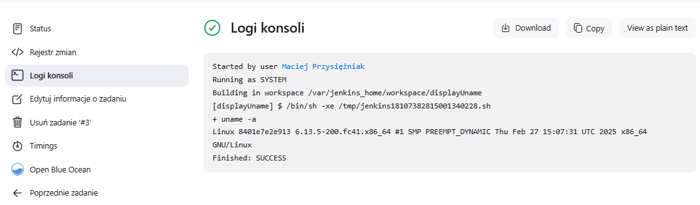
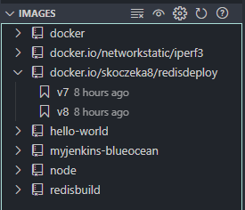

# Zajęcia 05 Pipeline, Jenkins, izolacja etapów

## 5.1 Przygotowanie środowiska Jenkins

### 5.1.1 Instalacja i konfiguracja Jenkins

Proces instalacji i konfiguracji Jenkinsa dokonano na zajęciach nr. 4. 

Wszystkie wymagane (poczynione) kroki opisano w sprawozdaniu 1, w rozdziale dotyczącym tej części zajęć. 

### 5.1.2 Uruchomienie Docker-in-Docker (DinD)

Z uwagi na to, że kontener nie uruchamia się automatycznie po restarcie maszyny, uruchomiono kontener Docker-in-Docker, który będzie służył jako środowisko wykonawcze dla zadań Jenkins:

```bash
docker run \
  --name jenkins-docker \
  --rm \
  --detach \
  --privileged \
  --network jenkins \
  --network-alias docker \
  --env DOCKER_TLS_CERTDIR=/certs \
  --volume jenkins-docker-certs:/certs/client \
  --volume jenkins-data:/var/jenkins_home \
  --publish 2376:2376 \
  docker:dind \
  --storage-driver overlay2
```

### 5.1.3 Panel Jenkins

Po uruchomieniu i zalogowaniu się do Jenkinsa pod adresem `http://localhost:8080` pojawiło się wiele błędów dotyczących wtyczek, uruchomiono zatem kontener ponownie.


Ponowne uruchomienie pomogło pozbyć się występujących błędów. W następnym kroku przystąpiono do utworzenia nowego projektu.


## 5.2 Zadania wstępne: uruchomienie

### 5.2.1 Prosty projekt wyświetlający nazwę użytkownika

Zgodnie z wytycznymi, utworzono projekt, który wyświetla wynik polecenia `uname -a` - podstawowe informacje o systemie.

```bash
uname -a
```

Działanie projektu zakończyło się powodzeniem, a w konsoli zostały wypisane oczekiwane informacje.



### 5.2.2 Projekt zwracający błąd dla nieparzystej godziny

Utworzono kolejny projekt, który zwraca błąd, gdy aktualna godzina jest nieparzysta:

```bash
#!/bin/bash
TIME_HOUR=$(date +%H)
echo "Current time: $TIME_HOUR"

if [ $((TIME_HOUR % 2)) -ne 0 ]; then
  echo "Error: Current time ($TIME_HOUR) is odd!"
  exit 1
else
  echo "Current time ($TIME_HOUR) is even."
fi
```

Działanie projektu ponownie zakończyło się powodzeniem, a w konsoli zostały wypisane oczekiwane informacje.


### 5.2.3 Pobieranie obrazu Docker w projekcie

Utworzono projekt, który pobiera obraz Ubuntu z Docker Hub, dodatkowo wyświetlając wiadomość kontrolną:

```bash
docker pull ubuntu
docker images | grep ubuntu
```

Działanie projektu również zakończyło się powodzeniem, kontenery Jenkinsa mają dostęp do internetu i mogą poprawnie korzystać z poleceń docker.


## 5.3 Konfiguracja pierwszego Pipeline

### 5.3.1 Utworzenie obiektu Pipeline

Po pomyślnym przetestowaniu podstawowych funkcji, utworzono nowy obiekt typu `pipeline` bezpośrednio w interfejsie Jenkins (nie z SCM). Poniżej przedstawiono wstępną konfigurację pipeline'u. 

```groovy
pipeline {
    agent any
    
    stages {
        stage('Klonowanie repo') {
            steps {
                sh 'rm -fr MDO2025_INO'
                sh 'docker system prune --all --force --volumes'
                sh 'echo "Klonowanie repozytorium..."'
                sh 'git clone https://github.com/InzynieriaOprogramowaniaAGH/MDO2025_INO.git || echo "Repo już istnieje"'
                sh 'ls -la MDO2025_INO'
            }
        }
    }
}
```

Działanie pipeline'u zakończyło się powodzeniem. Poprawnie czyści on dane a następnie klonuje on repozytorium przedmiotowe.


### 5.3.2 Rozbudowa Pipeline

Rozbudowano pipeline o kolejne kroki, w tym checkout do własnej gałęzi i budowę Dockerfile:

```groovy
pipeline {
    agent any
    
    stages {
        stage('Klonowanie repo') {
            steps {
                sh 'rm -fr MDO2025_INO'
                sh 'docker system prune --all --force --volumes'
                sh 'echo "Klonowanie repozytorium..."'
                sh 'git clone https://github.com/InzynieriaOprogramowaniaAGH/MDO2025_INO.git || echo "Repo już istnieje"'
                sh 'ls -la MDO2025_INO'
            }
        }
        
        stage('Przełączanie na swoją gałąź') {
            steps {
                sh 'cd MDO2025_INO && git checkout MP415362'
            }
        }
        
        stage('Checkout pliku Dockerfile') {
            steps {
                sh 'echo "Checkout pliku Dockerfile..."'
                sh 'cd MDO2025_INO && git checkout MP415362 -- ITE/GCL06/MP415362/Sprawozdanie1/Lab3/Dockerfile.irssibuild'
            }
        }
        
        stage('Budowanie obrazu Docker') {
            steps {
                sh 'echo "Budowanie obrazu Docker..."'
                sh 'cd MDO2025_INO && docker build --no-cache -t moj-builder:latest -f ITE/GCL06/MP415362/Sprawozdanie1/Lab3/Dockerfile.irssibuild .'
            }
        }
    }
}
```

Pipeline po rozszerzeniu funkcjonalności również zakończył swoje działanie z komunikatem o powodzeniu.


Ponownie uruchomiono pipeline w celu zweryfikowania czy proces na pewno jest powtarzalny.


Ponowne uruchomienie pipeline'u nie powoduje problemu, pipeline ponownie kończy się sukcesem.

# Zajęcia 06 Pipeline: lista kontrolna

## 6.1 Planowanie procesu CI/CD

### 6.1.1 Wybór aplikacji do procesu CI/CD

Do tej pory zadania realizowano na podanych przez prowadzącego przykładowych repozytoriach irssi oraz node-js-dummy-test, zdecydowano się jednak na zmianę oprogramowania.

Na potrzeby pełnego pipeline'u CI/CD wybrano Redis - popularną bazę danych NoSQL typu klucz-wartość. Redis został wybrany ze względu na:

1. Licencja BSD, która pozwala na swobodne wykorzystanie kodu
2. Dobrze zdefiniowany proces budowania
3. Wbudowane testy automatyczne
4. Relatywnie prosty proces budowania i testowania

### 6.1.2 Diagram UML procesu CI/CD

Poniżej przedstawiono diagramy UML obrazujące planowany proces CI/CD dla Redis:

#### Diagram aktywności procesu CI/CD


Diagram aktywności pokazuje kolejne etapy procesu CI/CD, od klonowania repozytorium, przez budowanie, testowanie, wdrażanie, aż po publikację artefaktów i czyszczenie.

#### Diagram wdrożeniowy procesu CI/CD


Diagram wdrożeniowy obrazuje relacje między składnikami środowiska CI/CD, obrazami Docker oraz zewnętrznymi zasobami.

### 6.1.3 Przygotowanie obrazów

Przygotowano trzy obrazy na potrzeby procesu CI/CD:

1. Obraz buildowy (Dockerfile.redisbuild):

```Dockerfile
FROM fedora:41

RUN dnf -y update && \
    dnf -y install \
    git \
    gcc \
    gcc-c++ \
    make \
    jemalloc-devel \
    tcl \
    which \
    procps-ng && \ 
    dnf clean all

RUN git clone https://github.com/redis/redis.git /build

WORKDIR /build

RUN make
```

2. Obraz testowy (Dockerfile.redistest):

```Dockerfile
FROM redisbuild

CMD ["make", "test"]
```

3. Obraz wdrożeniowy (Dockerfile.redisdeploy):

```Dockerfile
FROM fedora:41

RUN dnf -y update && \
    dnf -y install jemalloc && \
    dnf clean all

RUN useradd --system --user-group redis

WORKDIR /redis
COPY --from=redisbuild /build/src/redis-server /build/src/redis-cli /redis/

RUN chown -R redis:redis /redis

USER redis

EXPOSE 6379

CMD ["./redis-server"]
```

### 6.1.4 Sprawdzenie poprawności działania obrazów

Po zbudowaniu wszystkich trzech obrazów Docker (redisbuild, redistest, redisdeploy), przeprowadzono kilka testów w celu weryfikacji ich poprawności działania.

#### 6.1.4.1 Weryfikacja obrazu buildowego (redisbuild) oraz testowego (redistest)

Oba obrazy zbudowały się poprawnie:


Podczas uruchomienia obrazu testowego zauważono, że niektóre testy klastra Redis nie przechodzą pomyślnie:


Problem może wynikać z ograniczeń sieciowych w kontenerze lub czasu oczekiwania na synchronizację. 

Możemy go jednak zignorować ponieważ testy klastra są zaawansowane i często wrażliwe na środowisko (np. Docker może ograniczać komunikację między "wirtualnymi" węzłami klastra), a my i tak nie pracujemy z klastrami Redis, ten test nie ma wpływu na podstawowe funkcje Redis (GET/SET, pub/sub, itp.).

#### 6.1.4.3 Weryfikacja obrazu wdrożeniowego (redisdeploy)

Obraz wdrożeniowy został pomyślnie zbudowany i przetestowany:


#### 6.1.4.4 Publikacja obrazu na Docker Hub

Utworzono publiczne repozytorium `redisdeploy` na platformie Docker Hub pod moją nazwą użytkownika `skoczeka8`. Repozytorium zostało skonfigurowane z widocznością publiczną, co umożliwia wszystkim użytkownikom pobieranie obrazu.

Ostatnim krokiem w procesie CI/CD będzie publikacja obrazu wdrożeniowego do tego repozytorium, co pozwoli na łatwą dystrybucję i wdrożenie w różnych środowiskach.


## 6.2 Analiza zgodności z listą kontrolną

### 6.2.1 Wybór aplikacji

&#x2611; **Aplikacja została wybrana**: Redis - popularna baza danych NoSQL typu klucz-wartość.

&#x2611; **Licencja**: Redis jest dostępny na licencji BSD, która pozwala na swobodne wykorzystanie kodu na potrzeby zadania.

&#x2611; **Budowanie**: Redis buduje się poprawnie przy użyciu standardowego procesu `make`.

&#x2611; **Testy**: Redis posiada wbudowane testy, które można uruchomić za pomocą polecenia `make test`.

&#x2611; **Repozytorium**: Zdecydowano o bezpośrednim wykorzystaniu oficjalnego repozytorium, bez konieczności tworzenia forka.

### 6.2.2 Proces budowania i testowania

&#x2611; **Kontener bazowy**: Jako bazę wybrano obraz Fedora 41, była to najstabilniejsza z testowanych wersji.

&#x2611; **Build w kontenerze**: Proces budowania jest wykonywany wewnątrz kontenera `redisbuild`.

&#x2611; **Testy w kontenerze**: Testy są uruchamiane w dedykowanym kontenerze `redistest`.

&#x2611; **Zależność kontenerów**: Kontener testowy jest oparty na kontenerze buildowym, co zapewnia spójność środowiska.

&#x2611; **Logowanie**: Logi z testów są zapisywane jako artefakty z numeracją odpowiadającą numerowi buildu.

### 6.2.3 Wdrażanie i publikacja

&#x2611; **Kontener wdrożeniowy**: Zdefiniowano kontener `redisdeploy`, który służy do uruchomienia aplikacji.

&#x2611; **Uzasadnienie decyzji**: Uzasadniono, dlaczego kontener buildowy nie nadaje się do roli wdrożeniowej (zbyt duży, zawiera zbędne narzędzia).

&#x2611; **Wdrożenie**: Obraz `redisdeploy` jest wdrażany na instancję Dockera w ramach etapu SmokeTest.

&#x2611; **Weryfikacja działania**: Po wdrożeniu przeprowadzany jest test funkcjonalny (PING), który potwierdza, że Redis działa poprawnie.

&#x2611; **Artefakt**: Jako artefakty wybrano obraz Docker oraz archiwum ZIP z binariami Redis.

&#x2611; **Uzasadnienie wyboru**: Uzasadniono wybór tych form redystrybucyjnych ze względu na łatwość wdrożenia i uniwersalność.

&#x2611; **Wersjonowanie**: Zastosowano wersjonowanie zgodne z numeracją buildu Jenkins i wersją Redis.

&#x2611; **Dostępność**: Artefakty są publikowane w Docker Hub oraz załączane jako rezultaty buildu w Jenkinsie.

&#x2611; **Identyfikacja**: Każdy artefakt można zidentyfikować przez tag wersji i metadane.

&#x2611; **Pliki konfiguracyjne**: Pliki Dockerfile i Jenkinsfile są dostępne w sprawozdaniu oraz jako osobne pliki.

### 6.2.4 Zgodność z planem

Porównując pierwotny diagram UML z faktyczną implementacją, można stwierdzić wysoki stopień zgodności. Implementacja zawiera wszystkie zaplanowane etapy procesu, choć wprowadzono drobne modyfikacje w kolejności działań w etapie publikacji, aby najpierw tworzyć artefakty lokalne, a następnie publikować obraz do rejestru zewnętrznego.

# Zajęcia 07 Jenkinsfile: lista kontrolna

## 7.1 Implementacja pełnego pipeline'u CI/CD

### 7.1.1 Analiza i rozwój Jenkinsfile

W ramach pełnej implementacji procesu CI/CD, utworzono plik Jenkinsfile. Poniżej przedstawiono pełną zawartość tego pliku:

```groovy
pipeline {
    agent any
    
    environment {
        REDIS_VERSION = '7.2.4'
        VERSION = "v${BUILD_NUMBER}"
        IMAGE_BUILD = 'redisbuild'
        IMAGE_TEST = 'redistest'
        IMAGE_DEPLOY = 'redisdeploy'
        DOCKER_REGISTRY = 'skoczeka8'
        IMAGE_TAG = "${DOCKER_REGISTRY}/redisdeploy:${VERSION}"
        PROJECT_PATH = 'ITE/GCL06/MP415362/Sprawozdanie2'
    }
    
    stages {
        stage('Clone') {
            steps {
                git branch: 'MP415362', url: 'https://github.com/InzynieriaOprogramowaniaAGH/MDO2025_INO'
            }
        }
        
        stage('Clean') {
            steps {
                dir("${PROJECT_PATH}") {
                    sh '''
                        docker container ls -a -q | xargs -r docker rm -f
                        docker volume ls -q | xargs -r docker volume rm -f
                        docker network ls -q --filter type=custom | xargs -r docker network rm -f
                        docker builder prune --all --force
                        docker images -q | sort -u | grep -vE '^(fedora:41)$' | xargs -r docker rmi -f
                    '''
                }
            }
        }
        
        stage('Build') {
            steps {
                dir("${PROJECT_PATH}") {
                    sh 'docker build -f Dockerfile.redisbuild -t ${IMAGE_BUILD} .'
                }
            }
        }
        
        stage('Test') {
            steps {
                dir("${PROJECT_PATH}") {
                    sh 'docker build -f Dockerfile.redistest -t ${IMAGE_TEST} .'
                    
                    sh 'docker run --rm ${IMAGE_TEST} > test-${VERSION}.log 2>&1'
                    sh 'cat test-${VERSION}.log'

                    archiveArtifacts artifacts: "test-${VERSION}.log", onlyIfSuccessful: false
                }
            }
        }
        
        stage('Deploy') {
            steps {
                dir("${PROJECT_PATH}") {
                    sh 'docker build -f Dockerfile.redisdeploy -t ${IMAGE_DEPLOY}:${VERSION} .'

                    sh 'docker save ${IMAGE_DEPLOY}:${VERSION} | gzip > redisdeploy-${VERSION}.tar.gz'
                    archiveArtifacts artifacts: "redisdeploy-${VERSION}.tar.gz", onlyIfSuccessful: true
                }
            }
        }
        
        stage('SmokeTest') {
            steps {
                dir("${PROJECT_PATH}") {
                    sh '''
                        docker network create ci || true
                        docker run -dit --network ci --name redis-deploy -p 6379:6379 ${IMAGE_DEPLOY}:${VERSION}
                        sleep 5

                        docker run --rm --network ci redis:alpine redis-cli -h redis-deploy ping

                        if [ $? -ne 0 ]; then
                            echo "Smoke test failed!"
                            exit 1
                        fi
                        
                        docker stop redis-deploy
                        docker rm redis-deploy
                        docker network rm ci
                    '''
                }
            }
        }
        
        stage('Publish') {
            steps {
                dir("${PROJECT_PATH}") {
                    sh '''
                        docker create --name temp-build-container ${IMAGE_BUILD}
                        mkdir -p redis-binaries
                        docker cp temp-build-container:/build/src/redis-server redis-binaries/
                        docker cp temp-build-container:/build/src/redis-cli redis-binaries/
                        docker rm temp-build-container
                        
                        docker run --rm -v $PWD:/app -w /app debian bash -c "apt-get update && apt-get install -y zip && zip -r redis-${VERSION}.zip redis-binaries/"
                        rm -rf redis-binaries
                    '''
                    
                    archiveArtifacts artifacts: "redis-${VERSION}.zip", onlyIfSuccessful: true

                    withCredentials([usernamePassword(credentialsId: 'dockerhub-credentials', usernameVariable: 'DOCKER_USER', passwordVariable: 'DOCKER_PASS')]) {
                        sh '''
                            echo "$DOCKER_PASS" | docker login -u "$DOCKER_USER" --password-stdin
                            docker tag ${IMAGE_DEPLOY}:${VERSION} ${IMAGE_TAG}
                            docker push ${IMAGE_TAG}
                        '''
                    }
                }
            }
        }
    }
    
    post {
        always {
            dir("${PROJECT_PATH}") {
                sh '''
                    docker container ls -a -q | xargs -r docker rm -f
                    docker image prune -f
                '''
            }
        }
    }
}
```

### 7.1.2 Analiza zgodności z listą kontrolną

Przeanalizowano implementację Jenkinsfile pod kątem zgodności z wymaganiami z listy kontrolnej:

&#x2611; **Przepis dostarczany z SCM** - Jenkinsfile jest przechowywany w repozytorium, co zapewnia automatyczne klonowanie podczas uruchomienia.

&#x2611; **Sprzątanie środowiska** - Etap `Clean` usuwa wszystkie kontenery, woluminy, sieci i niepotrzebne obrazy Docker, zapewniając czyste środowisko.

&#x2611; **Etap Build** - Buduje obraz `redisbuild` z dostarczonego Dockerfile, który zawiera wszystkie niezbędne zależności.

&#x2611; **Etap Test** - Wykorzystuje kontener testowy do uruchomienia wbudowanych testów Redis i archiwizuje logi z testów.

&#x2611; **Etap Deploy** - Tworzy obraz wdrożeniowy `redisdeploy`, który jest mniejszy od obrazu buildowego i zawiera tylko niezbędne pliki wykonywalne.

&#x2611; **SmokeTest** - Uruchamia wdrożony kontener i wykonuje prosty test funkcjonalny (polecenie PING), weryfikując działanie.

&#x2611; **Etap Publish** - Przygotowuje dwa rodzaje artefaktów:
   - Plik ZIP z binariami Redis (redis-server i redis-cli)
   - Obraz Docker publikowany do rejestru Docker Hub

&#x2611; **Sprzątanie po zakończeniu** - Sekcja `post` usuwa wszystkie pozostałe kontenery i nieużywane obrazy.


### 7.1.3 Testowanie powtarzalności procesu

Aby zweryfikować stabilność i powtarzalność procesu, pipeline został uruchomiony ponownie. Każde uruchomienie zakończyło się sukcesem, co potwierdza jego prawidłową konfigurację.


### 7.1.4 Weryfikacja artefaktów

Po zakończeniu procesu, sprawdzono dostępność i funkcjonowanie wygenerowanych artefaktów:

1. **Obraz Docker** - Opublikowane obrazy zostały pobrane z Docker Hub. 

```bash
docker pull skoczeka8/redisdeploy:v7
docker pull skoczeka8/redisdeploy:v8
```



Najnowszą wersję uruchomiono lokalnie i sprawdzono jej działanie za pomocą prostego ping:

```bash
docker run -d -p 6380:6379 --name redis-test skoczeka8/redisdeploy:v8
docker exec -it redis-test ./redis-cli ping
```


2. **Archiwum ZIP** - Pobrano archiwum ZIP z artefaktów Jenkins, rozpakowano i przetestowano binaria:

```bash
unzip redis-v8.zip -d redis-bin
cd redis-bin/redis-binaries/
./redis-server --daemonize yes
```


Redis został uruchomiony poprawnie, ale pojawiło się ostrzeżenie dotyczące ustawienia pamięci systemowej.


Niemniej jednak instancja serwera Redis jest aktywna i odpowiada na zapytania, upewniono się także za pomocą drugiego polecenia, co potwierdziło, że instancja Redis działa.

```bash
./redis-cli ping
ps aux | grep redis
```


## 7.2 Analiza odporności rozwiązania CI/CD

### 7.2.1 Odporność na awarię

#### Odporność na awarie infrastruktury

- **Czysty obszar roboczy**: Każde uruchomienie pipeline'u zaczyna się od etapu `Clean`, który usuwa wszystkie kontenery, woluminy i niepotrzebne obrazy Docker, zapewniając czyste środowisko.
- **Izolacja kontenerowa**: Każdy etap działa w izolowanym środowisku kontenerowym, co zapobiega wzajemnym interferencjom i zapewnia powtarzalność.
- **Automatyczne czyszczenie zasobów**: Sekcja `post` w Jenkinsfile usuwa wszystkie pozostałe kontenery i nieużywane obrazy, zapobiegając przepełnieniu dysku.

#### Odporność na awarie procesu budowania

- **Deterministyczne budowanie**: Zastosowanie konkretnych wersji obrazu bazowego (Fedora 41) i jawne określenie wersji Redis zapewnia powtarzalność procesu.
- **Archiwizacja logów**: Logi z testów są zapisywane jako artefakty, co umożliwia szczegółową analizę problemów.
- **Smoke test**: Automatyczna weryfikacja działania Redis po wdrożeniu szybko wykrywa problemy funkcjonalne.

### 7.2.2 Zapewnienie skutecznego ponownego użytku

#### Modularność procesu

- **Podział na etapy**: Pipeline jest podzielony na wyraźne, niezależne etapy (Clone, Clean, Build, Test, Deploy, SmokeTest, Publish).
- **Oddzielne pliki Dockerfile**: Osobne definicje dla obrazów buildowego, testowego i wdrożeniowego.
- **Hierarchia obrazów**: Obrazy testowy i wdrożeniowy bazują na buildowym, co umożliwia ponowne wykorzystanie warstw i zapewnia spójność.

#### Możliwość częściowego użytku

- **Parametryzacja**: Kluczowe wartości (jak wersja Redis i tagi obrazów) są zdefiniowane jako zmienne środowiskowe, co ułatwia dostosowanie.
- **Elastyczne etapy**: Pipeline można łatwo rozszerzyć o dodatkowe etapy (np. skanowanie bezpieczeństwa) lub zmodyfikować istniejące.

### 7.2.3 Weryfikacja poprawności budowanego kodu

1. **Oficjalne repozytorium**: Kod jest pobierany bezpośrednio z oficjalnego repozytorium Redis, co zapewnia autentyczność.
2. **Pełny zestaw testów**: Wykonywane są wszystkie testy dostarczone z Redis, co weryfikuje poprawność kompilacji i funkcjonalności.
3. **Test integracyjny**: Smoke test weryfikuje podstawową funkcjonalność przez wykonanie polecenia PING.
4. **Wersjonowanie**: Obrazy są tagowane zgodnie z wersją Redis, co ułatwia identyfikację źródła kodu.

Ta wielowarstwowa weryfikacja zapewnia, że wdrażany jest odpowiedni kod i że działa on zgodnie z oczekiwaniami.

## 7.3 Uzasadnienie decyzji dla kroków Deploy i Publish

### 7.3.1 Krok Deploy

#### **Wybór formy wdrożenia**

Dla Redis zdecydowano się na kontenerowe wdrożenie z następujących powodów:

1. **Izolacja środowiska**: Kontener zawiera tylko niezbędne komponenty do uruchomienia Redis, co minimalizuje potencjalne konflikty z innymi aplikacjami.
2. **Przenośność**: Obraz Docker działa tak samo w każdym środowisku obsługującym Docker, eliminując problem "u mnie działa".
3. **Łatwość wdrożenia**: Wdrożenie sprowadza się do jednego polecenia `docker run` z odpowiednimi parametrami.
4. **Skalowalność**: Możliwe jest łatwe skalowanie poprzez uruchamianie wielu instancji Redis.

#### **Uzasadnienie dla dedykowanego obrazu wdrożeniowego**

W kroku Deploy nie użyto bezpośrednio obrazu buildowego z następujących powodów:

1. **Bezpieczeństwo**: Obraz buildowy zawiera narzędzia kompilacji, które nie są potrzebne w czasie działania i mogą stanowić potencjalne zagrożenie.
2. **Optymalizacja rozmiaru**: Obraz buildowy zawiera pełne środowisko kompilacji, co znacznie zwiększa jego rozmiar:
   - Obraz buildowy: ~890 GB
   - Obraz wdrożeniowy: ~240 MB


3. **Wydajność**: Mniejszy obraz to szybsze pobieranie, uruchamianie i mniejsze zużycie zasobów.
4. **Zasada minimalnych uprawnień**: W środowisku produkcyjnym powinny być dostępne tylko niezbędne komponenty.

Dedykowany obraz wdrożeniowy (`redisdeploy`) zawiera tylko binaria Redis i minimalne zależności runtime, co czyni go bardziej odpowiednim do wdrożeń.

### 7.3.2 Krok Publish

#### **Wybór form redystrybucyjnych**

Dla Redis zdecydowano się na dwie formy redystrybucyjne:

1. **Obraz Docker**: Preferowany dla użytkowników, którzy chcą szybko uruchomić Redis bez konfiguracji środowiska.
   - Zalety: gotowe środowisko, łatwość uruchomienia, izolacja
   - Wdrożenie: `docker pull skoczeka8/redisdeploy:v8`

2. **Archiwum ZIP z binariami**: Odpowiednie dla użytkowników, którzy potrzebują zintegrować Redis z istniejącym systemem.
   - Zalety: mniejszy rozmiar, elastyczność instalacji, możliwość własnej konfiguracji
   - Wdrożenie: rozpakowanie archiwum i uruchomienie bezpośrednio

#### **Wersjonowanie artefaktów**

Przyjęto następujące zasady wersjonowania:

1. **Numeracja buildu**: Każdy artefakt jest oznaczony numerem buildu Jenkins (`vX`), co pozwala na jednoznaczną identyfikację.
2. **Wersja Redis**: W zmiennych środowiskowych pipeline'u określona jest wersja Redis (7.2.4), co umożliwia śledzenie, która wersja kodu źródłowego została użyta.

#### **Dostępność artefaktów**

Zapewniono różne metody dostępu do artefaktów:

1. **Docker Hub**: Obraz wdrożeniowy jest publikowany w publicznym rejestrze Docker Hub pod tagiem `skoczeka8/redisdeploy:vX`.
2. **Artefakty Jenkins**: Zarówno archiwum ZIP z binariami, jak i spakowany obraz Docker są zapisywane jako artefakty w historii buildów Jenkins.
3. **Logi testów**: Zapisywane są jako osobne artefakty, umożliwiając analizę wyników testów bez ponownego uruchamiania pipeline'u.

To podejście zapewnia elastyczność dla różnych przypadków użycia i preferencji użytkowników.

## 7.4 Porównanie implementacji z diagramem UML

### 7.4.1 Zgodność z diagramem aktywności

| Etap planowany | Etap zrealizowany | Zgodność | Komentarz |
|----------------|-------------------|----------|-----------|
| Klonowanie repozytorium | Stage 'Clone' | &#x2611; | Zrealizowano dokładnie jak planowano |
| Czyszczenie środowiska | Stage 'Clean' | &#x2611; | Dodano bardziej szczegółowe czyszczenie |
| Budowanie obrazu | Stage 'Build' | &#x2611; | Zgodne z planem |
| Przeprowadzanie testów | Stage 'Test' | &#x2611; | Zgodne z planem |
| Budowanie obrazu wdrożeniowego | Stage 'Deploy' | &#x2611; | Zgodne z planem |
| Smoke Test | Stage 'SmokeTest' | &#x2611; | Zgodne z planem |
| Publikacja | Stage 'Publish' | &#x2611; | Rozszerzono o tworzenie ZIP z binariami |
| Czyszczenie zasobów | Post action | &#x2611; | Dodano jako akcję post |

### 7.4.2 Zgodność z diagramem wdrożeniowym

| Element planowany | Element zrealizowany | Zgodność | Komentarz |
|-------------------|----------------------|----------|-----------|
| Jenkins CI/CD Server | Jenkins | &#x2611; | Zgodne z planem |
| Docker-in-Docker | DIND | &#x2611; | Zgodne z planem |
| Fedora Base Image | fedora:41 | &#x2611; | Zgodne z planem |
| Redis Build Image | redisbuild | &#x2611; | Zgodne z planem |
| Redis Test Image | redistest | &#x2611; | Zgodne z planem |
| Redis Deploy Image | redisdeploy:vX | &#x2611; | Zgodne z planem |
| Redis Git Repository | GitHub Redis | &#x2611; | Zgodne z planem |
| Docker Hub | Docker Hub | &#x2611; | Zgodne z planem |
| Artefakty | Artefakty Jenkins | &#x2611; | Rozszerzono o dodatkowe typy artefaktów |

Analiza pokazuje, że implementacja jest zgodna z pierwotnym planem, a w niektórych miejscach została rozszerzona o dodatkowe funkcjonalności, które zwiększają użyteczność i niezawodność procesu CI/CD.