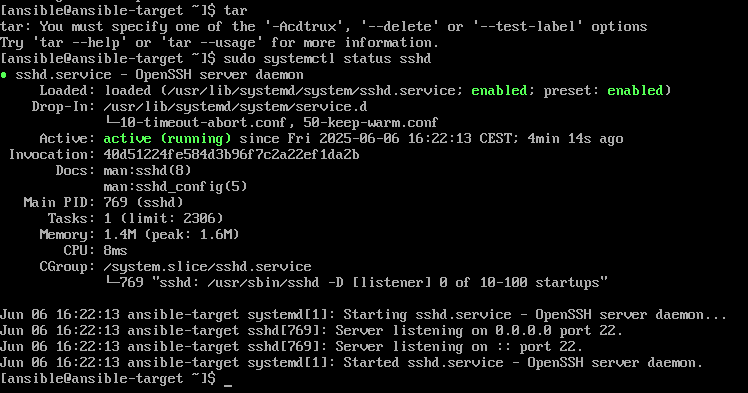
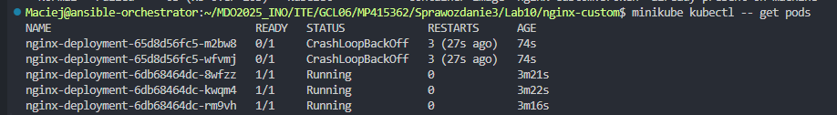
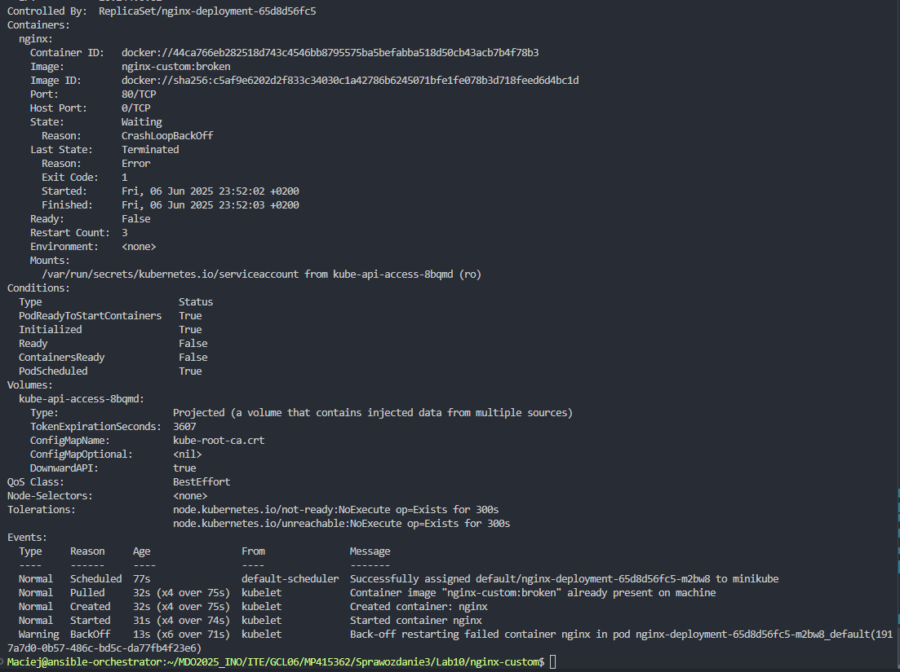

# Zajęcia 08-11 - Ansible, Kickstart, Kubernetes

## 8. Automatyzacja i zdalne wykonywanie poleceń za pomocą Ansible

### 8.1 Instalacja zarządcy Ansible

#### 8.1.1 Przygotowanie maszyny docelowej

Utworzono nową maszynę wirtualną z minimalnym zestawem oprogramowania. Podczas instalacji ustawiono hostname na `ansible-target` oraz utworzono użytkownika `ansible`.


Zweryfikowano obecność wymaganych narzędzi w systemie:




#### 8.1.2 Instalacja Ansible

Na głównej maszynie wirtualnej zainstalowano oprogramowanie Ansible z oficjalnego repozytorium dystrybucji:

```bash
sudo dnf install ansible
```


#### 8.1.3 Konfiguracja łączności SSH

Ustalono adres IP maszyny docelowej:


Skonfigurowano plik `/etc/hosts` dla ułatwienia komunikacji między maszynami:


Dokonano wymiany kluczy SSH między maszynami, aby umożliwić logowanie bez hasła:

```bash
ssh-copy-id ansible@ansible-target
ssh ansible@ansible-target
```


#### 8.1.4 Konfiguracja nazw hostów

Ustawiono odpowiednie nazwy hostów na obu maszynach:

```bash
sudo hostnamectl set-hostname ansible-orchestrator
exec bash
```


Skonfigurowano plik `/etc/hosts` na maszynie docelowej:


Zweryfikowano łączność między maszynami:


### 8.2 Inwentaryzacja

#### 8.2.1 Utworzenie pliku inwentaryzacji

Utworzono plik `inventory.ini` z odpowiednią strukturą:

```ini
[Orchestrators]
ansible@ansible-orchestrator
[Endpoints]
ansible@ansible-target
```

#### 8.2.2 Test połączenia

Wykonano test ping do wszystkich maszyn z inwentarza:

```bash
ansible -i inventory.ini all -m ping
```


### 8.3 Zdalne wywoływanie procedur

#### 8.3.1 Pierwszy playbook

Utworzono i uruchomiono pierwszy playbook do zarządzania maszynami docelowymi:

```yaml
- name: Ping
  hosts: all
  gather_facts: yes
  tasks:
    - name: PingAll
      ansible.builtin.ping:

- name: CopyInventory
  hosts: Endpoints
  gather_facts: yes
  tasks:
    - name: CopyInventory
      ansible.builtin.copy:
        src: ./inventory.ini
        dest: ~/inventory.ini


- name: UpdateAndRestart
  hosts: Endpoints
  become: true
  tasks:
    - name: UpdatePackages
      ansible.builtin.package:
        name: "*"
        state: latest

    - name: RestartSSHD
      ansible.builtin.service:
        name: sshd
        state: restarted

    - name: RestartRNGD
      ansible.builtin.service:
        name: rngd
        state: restarted
```

Pierwsze uruchomienie zakończyło się błędem z powodu braku usługi `rngd`:


Zainstalowano brakującą usługę:

```bash
sudo dnf install rng-tools
```


Po instalacji playbook wykonał się pomyślnie, status changed - zostały wprowadzone zmiany:


Ponowne uruchomienie playbooka pokazało stan "ok" dla już wykonanych zadań - pliki już istnieją, paczki są aktualne:


#### 8.3.2 Test odporności na błędy

Przetestowano zachowanie playbooka przy niedostępnej maszynie docelowej:

Zatrzymano usługę SSH na maszynie docelowej:
```bash
sudo systemctl stop sshd
```


Przetestowano również scenariusz z odpiętą kartą sieciową:


Z niewiadomego powodu, zamiast błędu/timeoutu, konsola po prostu zacięła się. Zatrzymano ją ręcznie po ~5 minutach.

### 8.4 Zarządzanie artefaktami przy użyciu ról

#### 8.4.1 Utworzenie roli dla Redis

Utworzono strukturę roli dla zarządzania kontenerem Redis:

```bash
ansible-galaxy init redis_deploy
```


(Z uwagi na duży rozmiar plików dla roli, nie wklejano ich treści do sprawozdania.)

#### 8.4.2 Implementacja playbooka Redis

Utworzono playbook zarządzający kontenerem Redis:

```yaml
---
- name: Deploy Redis using Docker
  hosts: Endpoints
  become: true
  roles:
    - redis_deploy
```

Playbook został wykonany pomyślnie:


## 9. Pliki odpowiedzi dla wdrożeń nienadzorowanych

### 9.1 Przygotowanie pliku Kickstart

#### 9.1.1 Instalacja podstawowa

Rozpoczęto proces instalacji Fedora 41 z wykorzystaniem instalatora sieciowego:


#### 9.1.2 Konfiguracja pliku odpowiedzi

Przygotowano plik Kickstart z automatyczną konfiguracją systemu. Wykorzystano serwis skracania URL dla łatwiejszego dostępu:

```cfg
# Generated by Anaconda 41.35
# Generated by pykickstart v3.58
#version=DEVEL

# Use text mode install
text

# Keyboard layouts
keyboard --vckeymap=us --xlayouts='us'
# System language
lang en_US.UTF-8

# Network information
network --bootproto=dhcp --device=enp0s3 --ipv6=auto --activate --hostname=redis-server

# Use network installation
url --mirrorlist=https://mirrors.fedoraproject.org/mirrorlist?repo=fedora-41&arch=x86_64
repo --name=updates --mirrorlist=https://mirrors.fedoraproject.org/mirrorlist?repo=updates-released-f41&arch=x86_64

%packages
@^server-product-environment
docker
%end

# Run the Setup Agent on first boot
firstboot --enable

# Generated using Blivet version 3.11.0
ignoredisk --only-use=sda
autopart
# Partition clearing information
clearpart --all --initlabel

# System timezone
timezone Europe/Warsaw --utc

# Root password
rootpw --iscrypted --allow-ssh $y$j9T$y5sophO4VORcfGfiRU7.Jjqw$lTggUDWB8yW.I4AMyBR6jYdi/I0zFSmdfPuYFcY7w03
user --groups=wheel --name=Maciej --password=$y$j9T$qr2UpYPCIOfk1Vt0oXHfswxN$PEG.wJdYEry4ugX.0mxX.L54/5Dk/OC9Dyt8NrJPMVA --iscrypted --gecos="Maciej Przysiezniak"

# Reboot after installation
reboot --eject

%post
# Enable Docker
systemctl enable docker

# Create service to run Redis container
cat > /etc/systemd/system/redis-container.service << 'EOF'
[Unit]
Description=Redis Container
After=docker.service
Requires=docker.service

[Service]
Type=oneshot
RemainAfterExit=yes
ExecStartPre=/usr/bin/docker pull skoczeka8/redisdeploy:v8
ExecStart=/usr/bin/docker run -d --name redis-deploy -p 6379:6379 skoczeka8/redisdeploy:v8

[Install]
WantedBy=multi-user.target
EOF

# Enable Redis service
systemctl enable redis-container.service
%end
```


Podczas instalacji wprowadzono link do pliku Kickstart:


Zrzut ekranu przedstawia błędną wersję, została ona poprawiona, lecz nie przemyślano aktualizacji zrzutu ekranu. Przed podanym linkiem brakuje `inst.ks=`

### 9.2 Weryfikacja instalacji automatycznej

#### 9.2.1 Sprawdzenie konfiguracji systemu

Po zakończeniu instalacji zweryfikowano poprawność konfiguracji:
- Użytkownik został poprawnie utworzony
- Docker został zainstalowany i uruchomiony


#### 9.2.2 Weryfikacja kontenera Redis

Sprawdzono działanie kontenera Redis skonfigurowanego przez plik Kickstart:


Kontener Redis został poprawnie uruchomiony i odpowiada na zapytania.

## 10. Wdrażanie na zarządzalne kontenery: Kubernetes (1)

### 10.1 Instalacja klastra Kubernetes

#### 10.1.1 Instalacja zależności

Zainstalowano wymagane zależności dla Minikube:

```bash
sudo dnf install -y curl conntrack
```


#### 10.1.2 Instalacja Minikube

Pobrano i zainstalowano Minikube:

```bash
curl -LO https://storage.googleapis.com/minikube/releases/latest/minikube-linux-amd64
sudo install minikube-linux-amd64 /usr/local/bin/minikube
```


#### 10.1.3 Instalacja kubectl

Zainstalowano narzędzie kubectl do zarządzania klastrem:

```bash
curl -LO https://dl.k8s.io/release/v1.33.1/bin/linux/amd64/kubectl
chmod +x kubectl
sudo mv kubectl /usr/local/bin
```


#### 10.1.4 Uruchomienie klastra

Uruchomiono klaster Minikube z wykorzystaniem Docker jako driver:

```bash
sudo systemctl start docker
minikube start --driver=docker
minikube status
```


#### 10.1.5 Weryfikacja klastra

Sprawdzono status komponentów klastra i uruchomiono dashboard:

```bash
kubectl get componentstatuses
minikube dashboard
```


Dashboard Kubernetes został uruchomiony i jest dostępny w przeglądarce:


### 10.2 Przygotowanie obrazu kontenera

#### 10.2.1 Test bazowego Nginx

Przetestowano działanie bazowego kontenera Nginx:

```bash
docker pull nginx:alpine
docker run --name containerTest -d -p 8080:80 nginx:alpine
```


#### 10.2.2 Budowa niestandardowego obrazu

Zbudowano niestandardowy obraz Nginx z własną konfiguracją:

```bash
docker build -t nginx-custom:1.0 .
```

```docker
FROM nginx:alpine
COPY nginx.conf /etc/nginx/nginx.conf
COPY html/ /usr/share/nginx/html/
EXPOSE 80
```


```cfg
events {
    worker_connections 1024;
}

http {   
    server {
        listen 80;
        # listen 80
        server_name localhost;
        
        add_header X-Custom-Server "Maciej-Przysiężniak-Nginx" always;
        add_header X-Version "1.0" always;
        
        location / {
            root /usr/share/nginx/html;
            index index.html;
        }
        
        location /info {
            return 200 "Nginx skonfigurowany przez Macieja Przysiężniak\nWersja: 1.0\n";
            add_header Content-Type text/plain;
        }
        
        location /status {
            return 200 "OK - działa\n";
            add_header Content-Type text/plain;
        }
    }
}
```


### 10.3 Uruchomienie aplikacji w Kubernetes

#### 10.3.1 Ładowanie obrazu do Minikube

Załadowano niestandardowy obraz do Minikube:

```bash
minikube image load nginx-custom:1.0
minikube kubectl -- run nginx-test --image=nginx-custom:1.0 --port=80 --labels app=nginx-test
```


#### 10.3.2 Weryfikacja poda

Sprawdzono status utworzonego poda:

```bash
minikube kubectl -- get pods
minikube kubectl -- describe pod nginx-test
```


Dashboard pokazuje działający pod:


#### 10.3.3 Przekierowanie portu

Skonfigurowano przekierowanie portu do poda:

```bash
minikube kubectl -- port-forward pod/nginx-test 8080:80
```


#### 10.3.4 Weryfikacja aplikacji

Aplikacja jest dostępna i wyświetla niestandardową stronę:


Weryfikacja przez curl:

```bash
curl http://localhost:8080
```


Curl zwraca treść wczytanego html'a:

```html
<!DOCTYPE html>
<html>
<head>
    <title>Nginx Custom v1.0</title>
</head>
<body>
    <h1>Maciej Przysiężniak</h1>
    <p>Wersja: 1.0</p>
    <p>Nginx działa poprawnie!</p>
</body>
</html>
```
#### 10.3.5 Czyszczenie zasobów

Usunięto testowy pod:

```bash
minikube kubectl -- delete pod nginx-test
minikube kubectl -- get pods
```


### 10.4 Wdrożenie z wykorzystaniem pliku YAML

#### 10.4.1 Utworzenie deploymentu

Zastosowano plik [deployment.yaml](Lab10/nginx-custom/deployment.yaml):

```bash
minikube kubectl -- apply -f deployment.yaml
minikube kubectl -- get deployments
minikube kubectl -- get pods
minikube kubectl -- rollout status deployment/nginx-deployment
```


Dashboard pokazuje deployment z 4 działającymi podami:


#### 10.4.2 Eksponowanie serwisu

Sprawdzono dostępne serwisy i skonfigurowano przekierowanie:

```bash
minikube kubectl -- get services
minikube kubectl -- port-forward service/nginx-service 8080:80
```


Aplikacja jest ponownie dostępna przez serwis:


## 11. Wdrażanie na zarządzalne kontenery: Kubernetes (2)

### 11.1 Przygotowanie nowych obrazów

Przygotowano dodatkowe wersje obrazu dla testowania różnych strategii wdrożenia:
- `nginx-custom:1.0` - wersja podstawowa
- `nginx-custom:2.0` - zaktualizowana wersja
- `nginx-custom:broken` - wersja z błędem

### 11.2 Skalowanie deploymentu

#### 11.2.1 Zwiększenie liczby replik

Przeskalowano deployment do 8 replik:

```bash
minikube kubectl -- scale deployment nginx-deployment --replicas=8
minikube kubectl -- get pods -w
```


Dashboard pokazuje 8 działających podów:


#### 11.2.2 Zmniejszenie liczby replik

Zmniejszono liczbę replik do 1:

```bash
minikube kubectl -- scale deployment nginx-deployment --replicas=1
minikube kubectl -- get pods
```


Dashboard pokazuje pody w trakcie terminacji:


#### 11.2.3 Skalowanie do zera

Przeskalowano deployment do 0 replik:

```bash
minikube kubectl -- scale deployment nginx-deployment --replicas=0
minikube kubectl -- get pods
```


### 11.3 Aktualizacje obrazów

#### 11.3.1 Przygotowanie nowej wersji

Zbudowano i załadowano nową wersję obrazu:

```bash
docker build -t nginx-custom:2.0 .
minikube image load nginx-custom:2.0
```


#### 11.3.2 Aktualizacja deploymentu

Zaktualizowano deployment do nowej wersji obrazu:

```bash
minikube kubectl -- set image deployment/nginx-deployment nginx=nginx-custom:2.0
minikube kubectl -- rollout status deployment/nginx-deployment
minikube kubectl -- rollout history deployment/nginx-deployment
```


Nowa wersja aplikacji jest dostępna z zaktualizowanym interfejsem:


Dashboard pokazuje nowe replica sety:


#### 11.3.3 Rollback do poprzedniej wersji

Wykonano rollback do poprzedniej wersji:

```bash
minikube kubectl -- rollout undo deployment/nginx-deployment
```

Dashboard podczas rollbacku:


Dashboard po zakończeniu rollbacku:


### 11.4 Testowanie wadliwego obrazu

#### 11.4.1 Przygotowanie wadliwego obrazu

Wprowadzono błąd w [konfiguracji Nginx](Lab10/nginx-custom/nginx.conf) (usunięcie średnika):

```nginx
listen 80  # Brak średnika powoduje błąd
```


#### 11.4.2 Wdrożenie wadliwego obrazu

Zbudowano i wdrożono wadliwy obraz:

```bash
docker build -t nginx-custom:broken .
minikube image load nginx-custom:broken
minikube kubectl -- set image deployment/nginx-deployment nginx=nginx-custom:broken
minikube kubectl -- get pods
```


Pody przechodzą w stan CrashLoopBackOff:



#### 11.4.3 Diagnoza problemu

Sprawdzono szczegóły wadliwego poda:

```bash
minikube kubectl -- describe pod nginx-deployment-65d8d56fc5-m2bw8
```



### 11.5 Kontrola wdrożenia

#### 11.5.1 Skrypt weryfikujący

Utworzono skrypt `verify-deployment.sh` do weryfikacji stanu wdrożenia:

```bash
#!/bin/bash

DEPLOYMENT_NAME="nginx-deployment"
TIMEOUT=60

echo "Sprawdzanie wdrożenia $DEPLOYMENT_NAME..."
echo "Timeout: $TIMEOUT sekund"

if ! minikube kubectl -- get deployment $DEPLOYMENT_NAME >/dev/null 2>&1; then
    echo "Deployment $DEPLOYMENT_NAME nie istnieje!"
    exit 1
fi

echo "Deployment znaleziony"
echo "Oczekiwanie na zakończenie wdrożenia..."

if timeout $TIMEOUT minikube kubectl -- rollout status deployment/$DEPLOYMENT_NAME; then
    echo "Wdrożenie zakończone sukcesem!"

    READY=$(minikube kubectl -- get deployment $DEPLOYMENT_NAME -o jsonpath='{.status.readyReplicas}')
    DESIRED=$(minikube kubectl -- get deployment $DEPLOYMENT_NAME -o jsonpath='{.spec.replicas}')

    echo "Status: $READY/$DESIRED replik gotowych"

    if [ "$READY" = "$DESIRED" ]; then
        echo "Wszystkie repliki działają!"
        exit 0
    else
        echo "Nie wszystkie repliki gotowe"
        exit 1
    fi
else
    echo "Timeout! Wdrożenie nie zakończone w $TIMEOUT sekund"
    echo "Status podów:"
    minikube kubectl -- get pods -l app=nginx-custom
    exit 1
fi

```

Test skryptu z wadliwym wdrożeniem:


#### 11.5.2 Historia wdrożeń

Sprawdzono historię wdrożeń:

```bash
minikube kubectl -- rollout history deployment/nginx-deployment
```


Szczegóły konkretnej rewizji:

```bash
minikube kubectl -- rollout history deployment/nginx-deployment --revision=7
```


Po rollbacku skrypt weryfikujący potwierdza poprawne wdrożenie:


### 11.6 Strategie wdrożenia

#### 11.6.1 Strategia Recreate

Zastosowano strategię [Recreate](Lab11/deployment-recreate.yaml), która zatrzymuje wszystkie pody przed uruchomieniem nowych:

```bash
minikube kubectl -- apply -f deployment-recreate.yaml
minikube kubectl -- get pods -l app=nginx-recreate
```


Podczas aktualizacji z użyciem strategii [Recreate](Lab11/deployment-recreate.yaml):

```bash
minikube kubectl -- set image deployment/nginx-recreate nginx=nginx-custom:2.0
```


Obserwacja procesu aktualizacji:

```bash
minikube kubectl -- get pods -l app=nginx-recreate -w
```


Wszystkie pody zostają zatrzymane jednocześnie, następnie uruchamiane są nowe (downtime).

#### 11.6.2 Strategia Rolling Update

Zastosowano strategię [Rolling Update](Lab11/deployment-rolling.yaml) z konfiguracją maksymalnie 2 niedostępnych podów:

```bash
minikube kubectl -- set image deployment/nginx-rolling nginx=nginx-custom:2.0
```


Obserwacja procesu [Rolling Update](Lab11/deployment-rolling.yaml):

```bash
minikube kubectl -- get pods -l app=nginx-rolling -w
```


Rolling Update przeprowadza stopniową wymianę podów bez downtime.

#### 11.6.3 Canary Deployment

Zaimplementowano [Canary Deployment](Lab11/deployment-canary.yaml) z dwoma odrębnymi wdrożeniami:

```bash
minikube kubectl -- apply -f deployment-canary.yaml
minikube kubectl -- get pods -l app=nginx-canary
```


### 11.7 Przegląd końcowy

Dashboard pokazuje wszystkie skonfigurowane deploymenty:


- `nginx-deployment` - główne wdrożenie (custom 1.0) - 4/4 
- `nginx-recreate` - strategia Recreate (custom 2.0) - 4/4 
- `nginx-rolling` - strategia Rolling Update (custom 2.0) - 4/4 
- `nginx-stable` - stabilna wersja (canary) (custom 1.0) - 3/3 
- `nginx-canary` - wersja testowa (custom 2.0) - 1/1 

Finalne sprawdzenie wszystkich zasobów:

```bash
minikube kubectl -- get deployments
minikube kubectl -- get services
minikube kubectl -- get pods --show-labels
```


## Podsumowanie

W ramach zajęć 8-11 wykonano kompleksowe wdrożenie narzędzi automatyzacji i orkiestracji kontenerów:

1. **Ansible** - skonfigurowano automatyzację zarządzania maszynami wirtualnymi
2. **Kickstart** - przygotowano instalację nienadzorowaną systemu operacyjnego
3. **Kubernetes** - wdrożono i przetestowano różne strategie zarządzania kontenerami
4. **Monitoring i rollback** - zaimplementowano mechanizmy kontroli i przywracania wdrożeń
