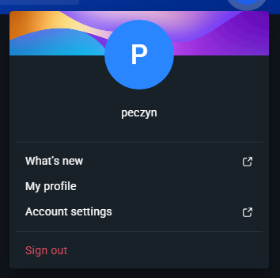
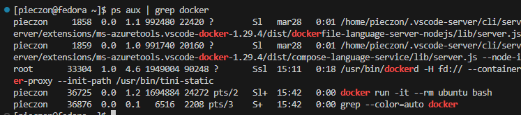
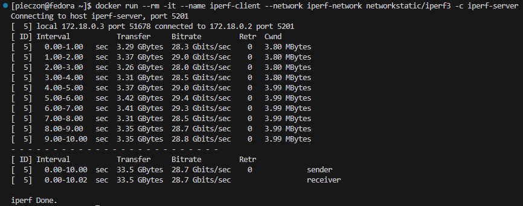
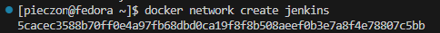

# Sprawozdanie 1 Marcin Pieczonka

## Lab 1

### Instalacja git i obsługa kluczy ssh

1. `sudo dnf install git-all` - instalacja git'a
2. `sudo dnf install openssh-server` - instalacja SSH
3. `systemctl start sshd.service` - uruchomienie usługi SSH


### Klonowanie repozytorium przez HTTPS i PAT
Najpierw utworzyłem na github Personal Access Token (PAT):


Następnie sklonowałem repozytorium za pomocą:
```bash
git clone https://github.com/InzynieriaOprogramowaniaAGH/MDO2025_INO.git
```

### Tworzenie kluczy ssh i 2FA
Klucze tworzymy za pomocą komend:
```bash
ssh-keygen -t ed25519 -f ~/.ssh/id_ed25519
ssh-keygen -t ecdsa -b 521 -f ~/.ssh/id_ecdsa
```

przy tworzeniu klucza zostajemy poproszeni o passphrase, aby zabezpieczyć klucz wystarczy w tym momencie podać hasło lub można po prostu wcisnąć enter aby nie zabiezpieczać klucza.


## Zmiana i tworzenie gałęzi
  1. `git checkout main` - wyjście na main brancha
  2. `git checkout GCL06` - wyjście na brancha grupy
  3. `cd ITE/GCL06` - przejście do odpowiedniego katalogu grupy
  2. `git checkout -b MP416297` - utworzenie własnego brancha


## Praca na branchu

1. Utworzenie katalogu MP416297:\
`mkdir MP416297`
2. Utworzenie git hooke'a w katalogu `.git/hooks`:\

        #!/usr/bin/sh
        #
        # Hook do przygotowania wiadomości commita.
        # Sprawdza, czy wiadomość commita zaczyna się od "MP416297".
        # Jeśli nie, dodaje ten prefiks na początku wiadomości.

        COMMIT_MSG_FILE=$1
        COMMIT_SOURCE=$2
        SHA1=$3

        # Definiowanie wzorca inicjałów i nr indeksu
        PATTERN="^MP416297" 

        # Pobierz pierwszą linię wiadomości commita
        commit_msg=$(head -n 1 "$COMMIT_MSG_FILE")

        # Sprawdź, czy wiadomość zaczyna się od wymaganych inicjałów i nr indeksu
        if [[ ! "$commit_msg" =~ $PATTERN ]]; then
        # Dodaj inicjały i nr indeksu na początek wiadomości
        echo "MP416297 - $commit_msg" > "$COMMIT_MSG_FILE"
        fi

## Wciągnięcie do gałęzi grupowej
Zrobiłem checkout do brancha grupy, a następnie przy pomocy `git merge MP416297` zrobiłem "wciągnięcie" swojej gałęzi do gałęzi `GCL06`, a wynik wygląda następująco:


Merge'a nie pushowałem i wycofałem zmiany przy pomocy 
`git reset --hard HEAD~1`.

## Lab 2

### Instalacja Dockera
Pierwszym krokiem laboratorium była instalacja dockera na systemie linuksowym, która odbyła się poprzez komendę:\
```bash
sudo dnf install docker
```


Następnie po instalacji należy uruchomić Docker daemona przy pomocy następującyhc komend:
```bash
sudo systemctl enable docker
sudo systemctl start docker
```


### Rejestracja na Docker Hub
Kolejnym krokiem było założenie konta na Docker Hub i przyjrzenie się przykładowym obrazom dostępnym na stronie.



### Pobieranie obrazów Dockera

Następnie należało pobrać obrazy `hello-world`, `busybox`, `fedora/ubuntu` oraz `mysql`. Wykorzystałem do tego komdendę 

```bash
docker image pull "nazwa_obrazu"
```

Przykładowy output po pobraniu obrazu:\


Lista pobranych obrazów:\


## Uruchomienie konteneru z obrazu BusyBox

Uruchomienie konteneru wykonuje się poprzez komendę:
```bash
docker run "nazwa_obrazu"
```
w tym przypadku użyłem również opcji `-it` aby móc dostać się interaktywnie do kontenera, oraz `--rm` aby usunąć kontener automatycznie po wyjściu z niego. W kontenerze użyto komendy `cat --help` aby sprawdzić numer wersji.\


## Uruchomienie "system w kontenerze" (fedora)

Podobnie jak w poprzednim podpunkcie do uruchomienia kontenera użyto `docker run` tym razem na końcu dodano jednak `bash` aby zastąpić uruchomienie procesu podstawowego procesem bash, co widać na zrzucie ekranu, gdzie `PID1` to bash.


Następnie z osobnego terminala sprawdzono listę procesów dockera na hoście:


Ostatnim krokiem było zaktualizowanie pakietów, które wykonano przy pomocy:
```bash
apt update && apt upgrade
```


## Dockerfile
W tym kroku należało utworzyć prosty `Dockerfile` bazujący na wybranym systemie, zbudować go i uruchomić oraz sklonować w nim nasze repozytorium.

    FROM alpine:latest
    RUN apk add --no-cache git
    WORKDIR /app
    RUN git clone https://github.com InzynieriaOprogramowaniaAGH/MDO2025_INO.git

- `FROM alpine:latest` oznacza z jakiego obrazu korzystamy
- `RUN apk add --no-cache git` służy do instalacji git'a w kontenerze
- `WORKDIR /app` zmienia katalog roboczy na /app
- `RUN git clone https://github.com/.../MDO2025_INO.git` klonuje repozytorium do katalogu roboczego


Następnie utworzony Dockerfile budujemy poprzez:
```bash
docker build -t alpine-git .
```
`-t` pozwala nadać customową nazwę


Ostatecznie uruchamiamy kontener:
```bash
docker run --rm -it alpine-git
```
\
w środku kontenera widać sklonowane repozytorium.

Kolejnym krokiem było pokazanie aktywnych kontenerów, więc w osobnym terminalu użyto:
```bash
docker ps
```
Którego wynikiem jest wyświetlenie kontenera `alpine_conatiner` oraz szczegółów czasu utworzenia.


Na sam koniec pozbywamy się kontenerów oraz obrazów za pomocą:
```bash
docker container prune
docker rmi -f $(docker images -aq)
```
`docker container prune` służy do usuwania kontenerów, `docker rmi` do usuwania obrazów, `-f` oznacza forsowanie usunięcia obrazów, `$()` uruchamia polecenie w subshellu, a `docker images -aq` pozwala na "pokazanie" wszystkich obrazów w formie ich id.

## Lab 3

Laboratorium miało na zadaniu pokazanie jak używać Dockerfile do automatyzacji tworzenia środowiska z zależnościami wymaganymi do uruchomienia projektu.

### Wybór oprogramowania

Przez lekkie problemy czasowe ze znalezieniem działającego projektu z testami te zajęcia zostały wykonane przeze mnie na przykładowym repozytorium, ale postaram się znaleźć coś lepszego na przyszłe zajęcia.

Użyte repozytorium:
```https://github.com/devenes/node-js-dummy-test```

### Klonowanie i build programu
```bash
git clone https://github.com/devenes/node-js-dummy-test
cd node-js-dummy-test
sudo dnf install -y npm
npm install
```
`git clone https://github.com/devenes/node-js-dummy-test` - klonujemy repozytorium\
`cd node-js-dummy-test` - zmieniamy katalog na katalog repozytorium\
`sudo dnf install -y npm` - instalujemy npm, który jest potrzebny do buildu projektu\
`npm install` - buildujemy projekt przy pomocy npm


### Uruchomienie programu i testów

```bash
npm start
npm test
```
`npm start` - uruchamia zbuildowany wcześniej projekt
`npm test` - uruchamia testy zbuildowanego projektu


### Przeprowadzenie buildu w kontenerze

W tym przypadku całą instalację wykonujemy w specjalnie uruchomionym kontenerze z wybranym systemem. Ja zdecydowałem się na obraz `node`, ponieważ ma on wbudowany `npm`.

```bash
docker image pull node
docker run --rm -it node bash
git clone
cd node
npm install
npm start
npm test
```
`docker image pull node` - pobieramy obraz node\
`docker run --rm -it node bash` - uruchamiamy kontener z obrazu i wchodzimy do basha\
Kolejne kroki są identyczne jak w poprzednim punkcie z pominięciem instalacji `npm`, który jest bazowo w naszym kontenerze.


### Dockerfile

Ostatni etap to stworzenie `Dockerfile`, które będą jeszcze bardziej upraszczać proces tworzenia środowiska i buildowania projektu.

Dockerfile buildowy:

    FROM node:22.14.0

    RUN git clone https://github.com/devenes/node-js-dummy-test
    WORKDIR /node-js-dummy-test
    RUN npm install

`FROM node:22.14.0` - oznacza z jakiego obrazu korzystać będzie kontener\
`RUN git clone https://github.com/devenes/node-js-dummy-test` - RUN oznacza polecenie, które jest wykonywane podczas buildowania obrazu\
`WORKDIR /node-js-dummy-test` - służy do zmieniania katalogu roboczego\
`RUN npm install` - polecenie do buildowania projektu z repozytorium

Taki Dockerfile należy zbudować poprzez polecenie:
```bash
docker build -t nodebld -f Dockerfile.nodebld .
```
`-t` pozwala nadać obrazowi customową nazwę\
`-f` oznacza plik z którego ma skorzystać docker build\
`.` oznacza katalog z którego ma być pobrany Dockerfile, czyli aktualny katalog\


Dockerfile startowy:

    FROM nodebld

    CMD ["npm", "start"]

`FROM nodebld` - nowy Dockerfile korzysta z zbudowanego z poprzedniego Dockerfile obrazu, pozwala to na uniknięcie niepotrzebnego ustalania dependencji i wykorzystanie gotowego szablonu. Ważne, aby podać odpowiednią nazwę obrazu.\
`CMD ["npm", "start"]` - oznacza polecenie, które zostanie wykonane podczas uruchamiania konteneru, w tym przypadku `npm start` uruchamia zbuildowany wcześniej projekt

Obraz tak samo buildujemy, a następnie uruchamiamy przy pomocy:
```bash
docker build -t noderun -f Dockerfile.noderun .
docker run --rm -it noderun
```

W tym przypadku można by użyć opcji `-d`, aby uruchomić kontener w stanie detached, jednak na potrzeby laboratorium nie korzystałem z tej opcji.


Dockerfile testowy:

    FROM nodebld

    CMD ["npm", "test"]

Podobnie jak w poprzednim przypadku korzystamy z gotowego obrazu `nodebld` tym razem jednak uruchamiamy testy za pomocą `npm test`.

braz tak samo buildujemy, a następnie uruchamiamy przy pomocy:
```bash
docker build -t nodetest -f Dockerfile.nodetest .
docker run --rm -it nodetest
```


### Przygotowanie woluminów
Pierwszym krokiem było przygotowanie dwóch woluminów, wejściowego i wyjściowego, które będziemy wykorzystywać do przenoszenia plików i zapisywania stanu.

```bash
docker volume create input-volume
docker volume create output-volume
```

- `docker volume create`: Tworzy dwa wolumeny Docker o nazwach `input-volume` i `output-volume`. Wolumeny te będą używane do przechowywania danych wejściowych i wyjściowych w kontenerach.

### Kontener bazowy
Po utworzeniu woluminów uruchamiamy kontener bazowy, służący do buildowania projektu. Ja w tym celu użyłem obrazu node:alpine, który jest lekki i nie zawiera np. git'a.

```bash
docker run --rm -it --name kontener_bazowy -v input-volume:/input-volume -v output-volume:/output-volume node:alpine sh
```

- `docker run`: Uruchamia kontener na podstawie obrazu `node:alpine`.  
- `--rm`: Po zakończeniu pracy kontener zostanie automatycznie usunięty.  
- `-it`: Uruchamia kontener w trybie interaktywnym z dostępem do terminala.  
- `--name kontener_bazowy`: Nadaje nazwę kontenerowi (`kontener_bazowy`).  
- `-v input-volume:/input-volume -v output-volume:/output-volume`: Montuje wolumeny `input-volume` i `output-volume` do kontenera, umożliwiając dostęp do danych wejściowych i wyjściowych.  
- `node:alpine`: Wykorzystuje obraz `node` na bazie Alpine Linux.  
- `sh`: Uruchamia powłokę `sh` w kontenerze. Tym razem nie bash bo Alpine Linux nie zawiera go domyślnie.

### Kontener pomocniczy
Kolejnym krokiem było sklonowanie repozytorium do woluminu wejściowego. W tym celu użyłem do tego tymczasowego kontenera opartego na obrazie alpine z podpiętym woluminem wejściowym. Zainstalowałem na nim git'a, a następnie sklonowałem repozytorium do woluminu. Kontener ten nie jest nam już później do niczego potrzebny więc użyłem opcji --rm.
```bash
docker run --rm -it -v input-volume:/input alpine
apk add --no-cache git
git clone https://github.com/devenes/node-js-dummy-test input/
```

- `docker run`: Uruchamia kontener na podstawie obrazu `alpine`, montując wolumen `input-volume` do `/input` w kontenerze.  
- `apk add --no-cache git`: Instalacja narzędzia `git` w kontenerze Alpine, które jest domyślnie bardzo lekki i nie zawiera większości narzędzi.  
- `git clone https://github.com/devenes/node-js-dummy-test input/`: Klonowanie repozytorium `node-js-dummy-test` z GitHub do katalogu `/input` w kontenerze.

Tworzenie konteneru:\
  
Instalacja Git'a:\
  
Klonowanie repozyotorium:\
  
Wolumin po klonowaniu (widok z kontenera bazowego):\


### Kopiowanie i buildowanie
Następnie, gdy mamy już repozytorium na woluminie wejściowym wracamy do kontenera bazowego. Kopiujemy pliki repozytorium z woluminu do katalogu w naszym kontenerze, a następnie buildujemy projekt.
```bash
mkdir repo
cp -r input-volume/* repo/
cd repo/node-js-dummy-test
npm install
```

- `mkdir repo`: Tworzenie katalogu `repo` w systemie plików.  
- `cp -r input-volume/* repo/`: Kopiowanie wszystkich plików z wolumenu `input-volume` do lokalnego katalogu `repo`.  
- `cd repo/node-js-dummy-test`: Przechodzenie do katalogu `node-js-dummy-test` w `repo`, który zawiera sklonowane repozytorium.
- `npm install` : Builduje projekt Node.js przy pomocy npm.


### Przeniesienie buildu na output
Ostatnim krokiem tej części jest przeniesienie zbuildowanych plików projektu na wolumin wyjściowy co zostało wykonane przy pomocy polecenia cp.
```bash
cp -r repo/node-js-dummy-test/node_modules/* output-volume/node_modules
```
opcja `-r` pozwala na rekurencyjne przenoszenie plików w podkatalogach.


### RUN --mount
Po zapoznaniu się z dokumentacją okazuje się, że istnieje inna możliwość wykonania poprzednich czynności. `RUN --mount` pozwala montować zewnętrzne zasoby (takie jak lokalne pliki, wolumeny, lub katalogi) w czasie budowania obrazu, co umożliwia bardziej dynamiczne zarządzanie danymi bez potrzeby kopiowania ich do obrazu lub wykonywania operacji poza kontenerem.

```docker
    FROM gcc

    RUN --mount=type=bind,source=input-volume,target=/input \
        git clone https://github.com/devenes/node-js-dummy-test.git /input

    COPY /input .

    WORKDIR /node-js-dummy-test

    RUN npm install

    RUN --mount=type=bind,source=output-volume,target=/output \
        cp -r node_modules /output/
```

- `FROM gcc`: Bazowanie na obrazie `gcc`, który zawiera narzędzia kompilacji w języku C/C++.  
- `RUN --mount=type=bind,source=input-volume,target=/input`: Montowanie wolumenu `input-volume` w kontenerze do katalogu `/input`. Umożliwia to dostęp do danych wejściowych.  
- `git clone https://github.com/devenes/node-js-dummy-test.git /input`: Klonowanie repozytorium do katalogu `/input` w kontenerze.  
- `COPY /input .`: Kopiowanie danych z katalogu `/input` do katalogu roboczego w kontenerze.  
- `WORKDIR /node-js-dummy-test`: Ustawienie katalogu roboczego na `node-js-dummy-test`.  
- `RUN npm install`: Build projektu Node.js.
- `RUN --mount=type=bind,source=output-volume,target=/output`: Montowanie wolumenu `output-volume` do katalogu `/output` w kontenerze.  
- `cp -r node_modules /output/`: Kopiowanie katalogu `node_modules` z zależności projektu do wolumenu `output-volume`.

Powyższy plik nie był jednak testowany w praktyce jednak w teorii powinien działać.

## Eksponowanie portu
Pierwszym zadaniem tego etapu było utworzenie kontenera z obrazu iperf3 oraz postawienie tam serwera iperf nasłuchującego na porcie 5201.

```bash
docker lab4_ss/image pull networkstatic/iperf3
docker run -d --name iperf-server -p 5201:5201 networkstatic/iperf3 -s
```

- `docker lab4_ss/image pull networkstatic/iperf3`: Pobiera obraz `iperf3` z Docker Hub. Jest to narzędzie do testowania wydajności sieci.
- `docker run -d --name iperf-server -p 5201:5201 networkstatic/iperf3 -s`: Uruchamia kontener na podstawie obrazu `iperf3` w tle (`-d`). Ustawia nazwę kontenera na `iperf-server` i mapuje port 5201 z kontenera na port 5201 na hoście. Flaga `-s` uruchamia serwer w środku kontenera.


### Sprawdzenie IP kontenera

```docker
docker inspect iperf-server | grep IP
```

- `docker inspect iperf-server | grep IP`: Sprawdza szczegóły kontenera `iperf-server`, w tym jego adres IP w sieci Docker.


### Połączenie z innego kontenera

Postawiłem nowy kontener i połączyłem się z niego z serwerem przy użyciu adresu ip kontenera na którym nasłuchuje serwer.

```bash
docker run --rm -it networkstatic/iperf3 -c 172.17.0.4
```


### Tworzenie sieci Docker
Następnie należało utworzyć sieć docker aby ułatwić sobie życie przez DNS i nie musieć sprawdzać ip tylko używać nazw kontenerów.

```docker
docker network create --driver bridge iperf-network
```

- `docker network create --driver bridge iperf-network`: Tworzy nową sieć Docker o nazwie `iperf-network` z wykorzystaniem sterownika `bridge`. Sieć ta umożliwia kontenerom komunikację ze sobą.

  

Jak widać sieć istnieje:\


### Zatrzymanie i usunięcie serwera
Następnie zatrzymałem i usunąłem serwer aby odpalić nowy dodany do sieci.
```docker
docker stop iperf-server
docker rm iperf-server
```

- `docker stop iperf-server`: Zatrzymuje działający kontener `iperf-server`.
- `docker rm iperf-server`: Usuwa zatrzymany kontener `iperf-server`.


### Uruchomienie serwera i klienta w tej samej sieci
W tym kroku utworzyłem serwer w nowej sieci. Następnie połączyłem się do niego z nowego konteneru klienta również w tej samej sieci przy użyciu nazwy kontenera z serwerem.
```docker
docker run -d --name iperf-server -p 5201:5201 --network iperf-network networkstatic/iperf3 -s
docker run --rm -it --name iperf-client --network iperf-network networkstatic/iperf3 -c iperf-server
```

- `--network iperf-network`: Używa stworzonej wcześniej sieci `iperf-network`, dzięki czemu kontener `iperf-client` może połączyć się z kontenerem `iperf-server` bez potrzeby podawania adresu IP.
- `docker run -d --name iperf-server -p 5201:5201 --network iperf-network networkstatic/iperf3 -s`: Uruchamia serwer `iperf3` w trybie `-s` na nowej sieci `iperf-network`.
- `docker run --rm -it --name iperf-client --network iperf-network networkstatic/iperf3 -c iperf-server`: Uruchamia klienta `iperf3` w tej samej sieci, łącząc się z serwerem `iperf-server` po jego nazwie.



### Instalacja i użycie `iperf3` na hoście
Kolejnym krokiem było połączenie się z serwerem z hosta.

Na hoście:
```bash
sudo dnf install -y iperf3
```

- `sudo dnf install -y iperf3`: Instalacja narzędzia `iperf3` na systemie Linux (Fedora/CentOS).

### Sprawdzenie IP kontenera na hoście
Ponieważ host nie jest w customowej sieci iperf-network musimy sprawdzić adres ip kontenera aby połączyć się do niego z hosta.
```bash
docker inspect iperf-server | grep IP
```

- `docker inspect iperf-server | grep IP`: Sprawdzenie adresu IP kontenera `iperf-server` na hoście, aby użyć go do połączenia się z kontenerem z zewnątrz.


### Testowanie połączenia z zewnętrznego hosta

Host nie jest w tej samej customowej sieci, więc używamy jego adresu IP:

```bash
iperf3 -c 172.18.0.2
```

- `iperf3 -c 172.18.0.2`: Uruchamia test prędkości połączenia do serwera `iperf3` z zewnętrznego hosta, używając jego adresu IP (np. `172.18.0.2`).

### Użycie IP maszyny wirtualnej
Na komputerze z postawioną maszyną zainstalowałem iperfa3 (którego instalację pominę, ale instrukcja z tego linku https://medium.com/@OkoloPromise/how-to-install-iperf3-on-windows-10-837d2fefcd0e).

Używam IP maszyny wirtualnej, która ma przekierowanie portu do kontenera:

```bash
iperf3 -c 172.30.165.83
```

- `iperf3 -c 172.30.165.83`: Testuje połączenie z serwerem `iperf3` na maszynie wirtualnej, która przekierowuje port do kontenera.


### Uruchomienie serwera z logowaniem do pliku
Na koniec dowiedziawszy się, że potrzeba logów postawiłem nowy serwer z opcją `--logfile` i powtórzyłem poprzednie połączenia.
```bash
docker run -d --name iperf-server -p 5201:5201 --network iperf-network networkstatic/iperf3 -s --logfile /server.log
docker run --rm -it --name iperf-client --network iperf-network networkstatic/iperf3 -c iperf-server
```

- `--logfile /server.log`: Uruchamia serwer `iperf3` i zapisuje logi testu do pliku `/server.log` w kontenerze.

### Podgląd logów kontenera
Na koniec wyświetliłem logi z kontenera.
```bash
docker exec -it iperf-server sh
cat server.log
```

- `docker exec -it iperf-server sh`: Wchodzi do kontenera `iperf-server` w trybie interaktywnym.
- `cat server.log`: Wyświetla zawartość pliku logów, który zawiera informacje o testach wydajności przeprowadzonych przez serwer `iperf3`.

```
-----------------------------------------------------------
Server listening on 5201 (test #1)
-----------------------------------------------------------
Accepted connection from 172.18.0.3, port 52804
[  6] local 172.18.0.2 port 5201 connected to 172.18.0.3 port 52808
[ ID] Interval           Transfer     Bitrate
[  6]   0.00-1.00   sec  3.26 GBytes  28.0 Gbits/sec                  
[  6]   1.00-2.00   sec  3.26 GBytes  28.0 Gbits/sec                  
[  6]   2.00-3.00   sec  2.90 GBytes  24.9 Gbits/sec                  
[  6]   3.00-4.00   sec  2.68 GBytes  23.0 Gbits/sec                  
[  6]   4.00-5.00   sec  2.94 GBytes  25.3 Gbits/sec                  
[  6]   5.00-6.00   sec  3.23 GBytes  27.7 Gbits/sec                  
[  6]   6.00-7.00   sec  3.45 GBytes  29.7 Gbits/sec                  
[  6]   7.00-8.00   sec  3.44 GBytes  29.6 Gbits/sec                  
[  6]   8.00-9.00   sec  3.20 GBytes  27.5 Gbits/sec                  
[  6]   9.00-10.00  sec  3.36 GBytes  28.8 Gbits/sec                  
[  6]  10.00-10.01  sec  15.6 MBytes  17.3 Gbits/sec                  
- - - - - - - - - - - - - - - - - - - - - - - - -
[ ID] Interval           Transfer     Bitrate
[  6]   0.00-10.01  sec  31.7 GBytes  27.2 Gbits/sec                  receiver
-----------------------------------------------------------
Server listening on 5201 (test #2)
-----------------------------------------------------------
Accepted connection from 172.18.0.1, port 53460
[  6] local 172.18.0.2 port 5201 connected to 172.18.0.1 port 53468
[ ID] Interval           Transfer     Bitrate
[  6]   0.00-1.00   sec  3.38 GBytes  29.0 Gbits/sec                  
[  6]   1.00-2.00   sec  3.32 GBytes  28.5 Gbits/sec                  
[  6]   2.00-3.00   sec  3.38 GBytes  29.0 Gbits/sec                  
[  6]   3.00-4.00   sec  3.38 GBytes  29.0 Gbits/sec                  
[  6]   4.00-5.00   sec  3.28 GBytes  28.2 Gbits/sec                  
[  6]   5.00-6.00   sec  3.31 GBytes  28.4 Gbits/sec                  
[  6]   6.00-7.00   sec  3.36 GBytes  28.9 Gbits/sec                  
[  6]   7.00-8.00   sec  3.36 GBytes  28.9 Gbits/sec                  
[  6]   8.00-9.00   sec  3.42 GBytes  29.4 Gbits/sec                  
[  6]   9.00-10.00  sec  3.29 GBytes  28.3 Gbits/sec                  
[  6]  10.00-10.00  sec  5.25 MBytes  28.5 Gbits/sec                  
- - - - - - - - - - - - - - - - - - - - - - - - -
[ ID] Interval           Transfer     Bitrate
[  6]   0.00-10.00  sec  33.5 GBytes  28.8 Gbits/sec                  receiver
-----------------------------------------------------------
Server listening on 5201 (test #3)
-----------------------------------------------------------
Accepted connection from 172.30.160.1, port 62564
[  6] local 172.18.0.2 port 5201 connected to 172.30.160.1 port 62565
[ ID] Interval           Transfer     Bitrate
[  6]   0.00-1.00   sec   652 MBytes  5.47 Gbits/sec                  
[  6]   1.00-2.00   sec   649 MBytes  5.44 Gbits/sec                  
[  6]   2.00-3.00   sec   644 MBytes  5.40 Gbits/sec                  
[  6]   3.00-4.00   sec   652 MBytes  5.47 Gbits/sec                  
[  6]   4.00-5.00   sec   654 MBytes  5.48 Gbits/sec                  
[  6]   5.00-6.00   sec   665 MBytes  5.58 Gbits/sec                  
[  6]   6.00-7.00   sec   661 MBytes  5.54 Gbits/sec                  
[  6]   7.00-8.00   sec   660 MBytes  5.54 Gbits/sec                  
[  6]   8.00-9.00   sec   657 MBytes  5.51 Gbits/sec                  
[  6]   9.00-10.00  sec   662 MBytes  5.55 Gbits/sec                  
[  6]  10.00-10.01  sec  6.38 MBytes  6.08 Gbits/sec                  
- - - - - - - - - - - - - - - - - - - - - - - - -
[ ID] Interval           Transfer     Bitrate
[  6]   0.00-10.01  sec  6.41 GBytes  5.50 Gbits/sec                  receiver
```

## Jenkins instalacja
Wszystkie kroki wykonano na podstawie dokumentacji https://www.jenkins.io/doc/book/installing/docker/.
### Pobranie obrazu
Na początku pobrano obraz `docker:dind`:


### Stworzenie sieci
Przed rozpoczęciem instalacji utworzono sieć `jenkins`:



### Stworzenie konteneru 
Następnie stworzono kontener oparty na obrazie `docker:dind` za pomocą poniższego polecenia z dokumentacji:

```bash
docker run \
  --name jenkins-docker \
  --rm \
  --detach \
  --privileged \
  --network jenkins \
  --network-alias docker \
  --env DOCKER_TLS_CERTDIR=/certs \
  --volume jenkins-docker-certs:/certs/client \
  --volume jenkins-data:/var/jenkins_home \
  --publish 2376:2376 \
  docker:dind \
  --storage-driver overlay2
```


### Utworzenie dockerfile'a
Kolejnym krokiem było przygotowanie pliku `Dockerfile`, który tworzy dostosowany obraz na bazie oficjalnego obrazu Jenkinsa. Zawartość pliku została skopiowana ze strony dokumentacji Jenkinsa:

```Dockerfile
FROM jenkins/jenkins:2.492.2-jdk17
USER root
RUN apt-get update && apt-get install -y lsb-release ca-certificates curl && \
    install -m 0755 -d /etc/apt/keyrings && \
    curl -fsSL https://download.docker.com/linux/debian/gpg -o /etc/apt/keyrings/docker.asc && \
    chmod a+r /etc/apt/keyrings/docker.asc && \
    echo "deb [arch=$(dpkg --print-architecture) signed-by=/etc/apt/keyrings/docker.asc] \
    https://download.docker.com/linux/debian $(. /etc/os-release && echo \"$VERSION_CODENAME\") stable" \
    | tee /etc/apt/sources.list.d/docker.list > /dev/null && \
    apt-get update && apt-get install -y docker-ce-cli && \
    apt-get clean && rm -rf /var/lib/apt/lists/*
USER jenkins
RUN jenkins-plugin-cli --plugins "blueocean docker-workflow"
```

### Zbudowanie dockerfile'a
Następnie zbudowano obraz przy pomocy poniższego polecenia:

```bash
docker build -t myjenkins-blueocean:2.492.2-1 -f Dockerfile.jenkins .
```


Na podstawie utworzonego obrazu stworzono kontener przy użyciu poniższego polecenia:

```bash
docker run \
  --name jenkins-blueocean \
  --restart=on-failure \
  --detach \
  --network jenkins \
  --env DOCKER_HOST=tcp://docker:2376 \
  --env DOCKER_CERT_PATH=/certs/client \
  --env DOCKER_TLS_VERIFY=1 \
  --publish 8080:8080 \
  --publish 50000:50000 \
  --volume jenkins-data:/var/jenkins_home \
  --volume jenkins-docker-certs:/certs/client:ro \
  myjenkins-blueocean:2.492.2-1 
```


### Połączenie z hosta

Na koniec, możliwe było przejście do ekranu logowania dostępnego pod adresem `172.30.165.83:8080` czyli adresem maszyny wirtualnej i użyciem portu 8080. Nie mam przekierowania portów z lokalnego pc na maszyne wirtualną więc używam adresu ip maszyny.


