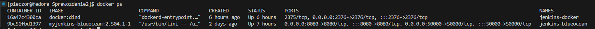
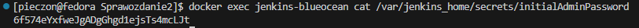
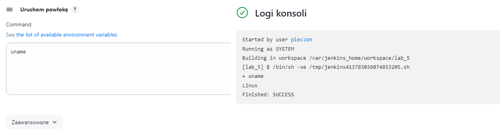
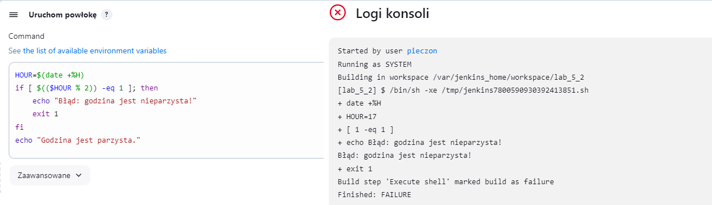
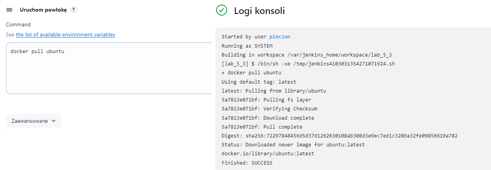
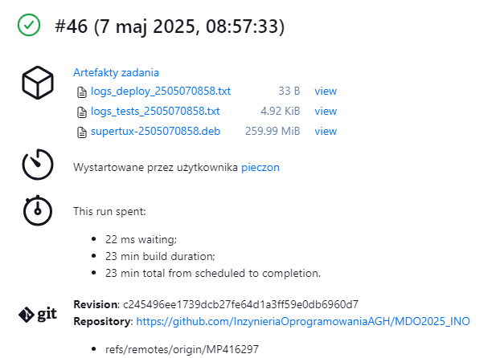
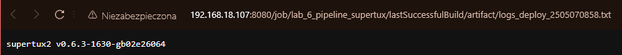
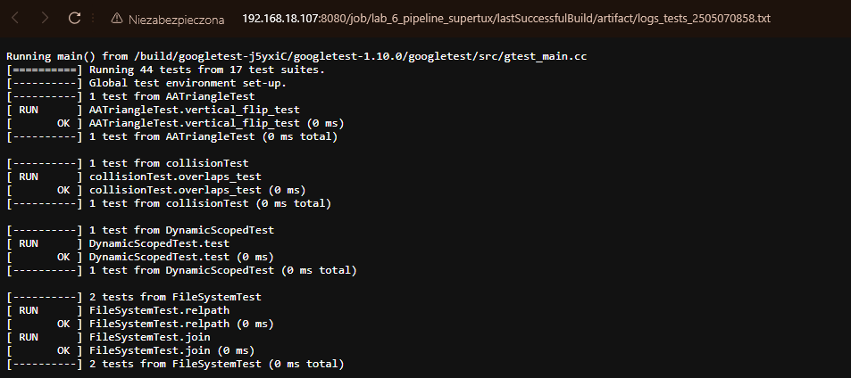

### Instalacja Jenkinsa

#### Utworzenie sieci
Pierwszym krokiem instatlacji jest utworzenie mostkowej sieci w Dockerze. 
```bash
docker network create jenkins
```

#### DIND
Kolejnym krokiem jest uruchomienie konteneru na obrazie docker::dind czyli docker in docker, który pozwala na wykonywanie poleceń Docker wewnątrz węzłów Jenkinsa. Warto dodać, że dinda trzeba uruchamiać manualnie po każdym restarcie hosta bo nie ma on autostartu.
```bash
docker run \
  --name jenkins-docker \
  --rm \
  --detach \
  --privileged \
  --network jenkins \
  --network-alias docker \
  --env DOCKER_TLS_CERTDIR=/certs \
  --volume jenkins-docker-certs:/certs/client \
  --volume jenkins-data:/var/jenkins_home \
  --publish 2376:2376 \
  docker:dind \
  --storage-driver overlay2
```

#### Dockerfile Jenkinsa
Następnie tworzymy Dockerfile i wklejamy do niego gotową konfigurację obrazu z dokumentacji Jenkinsa.
```dockerfile
FROM jenkins/jenkins:2.504.1-jdk21
USER root
RUN apt-get update && apt-get install -y lsb-release ca-certificates curl && \
    install -m 0755 -d /etc/apt/keyrings && \
    curl -fsSL https://download.docker.com/linux/debian/gpg -o /etc/apt/keyrings/docker.asc && \
    chmod a+r /etc/apt/keyrings/docker.asc && \
    echo "deb [arch=$(dpkg --print-architecture) signed-by=/etc/apt/keyrings/docker.asc] \
    https://download.docker.com/linux/debian $(. /etc/os-release && echo \"$VERSION_CODENAME\") stable" \
    | tee /etc/apt/sources.list.d/docker.list > /dev/null && \
    apt-get update && apt-get install -y docker-ce-cli && \
    apt-get clean && rm -rf /var/lib/apt/lists/*
USER jenkins
RUN jenkins-plugin-cli --plugins "blueocean docker-workflow json-path-api"
```

A następnie budujemy obraz z utworzonego Dockerfile'a. (komendę trzeba odpalić w terminalu w katalogu zawierającym Dockerfile)
```bash
docker build -t myjenkins-blueocean:2.504.1-1 .
```

#### Uruchomienie Jenkinsa
Ostatnim krokiem instalacji jest uruchomienie kontenera z Jenkinsem.

```bash
docker run \
  --name jenkins-blueocean \
  --restart=on-failure \
  --detach \
  --network jenkins \
  --env DOCKER_HOST=tcp://docker:2376 \
  --env DOCKER_CERT_PATH=/certs/client \
  --env DOCKER_TLS_VERIFY=1 \
  --publish 8080:8080 \
  --publish 50000:50000 \
  --volume jenkins-data:/var/jenkins_home \
  --volume jenkins-docker-certs:/certs/client:ro \
  myjenkins-blueocean:2.504.1-1 
```

Jak widać kontenery już śmigają jak należy:


#### Logowanie i konfiguracja
Aby zalogować się do nowo postawionego Jenkinsa potrzebujemy hasło, które znajduje się w katalogu `/var/jenkins_home/secrets/initialAdminPassword`, i możemy je pozyskać np. przy pomocy poniższej komendy:

```bash
docker exec jenkins-blueocean ls /var/jenkins_home/secrets/
```


Następnie zainstalowałem automatycznie proponowane wtyczki i zabrałem się do testowania działania.

### Przykładowe projekty

Poniższe przykłady są proste więc nie będę ich opisywał, a miały na zadaniu sprawdzenie czy Jenkins działa jak należy i pokazać jak można z niego korzystać.

#### Wyświetlenie uname


#### Zwracanie błędu przy nieparzystej godzinie


#### Pobranie obrazu ubuntu


## Pipeline CI wybranego projektu

### Początkowy pomysł na wykonanie pipeline'u CI


Początkowy pomysł na wykonanie jest prosty i pewnie będzie miał jakieś zmiany, ale w teorii wydaje się być w porządku (według mnie).


### Końcowe wykonanie

#### Cały pipeline

#### Przygotowanie przestrzeni roboczej
Czyścimy wszystkie pliki z poprzednich buildów oraz usuwamy wszystkie nieużywane zasoby dockera wraz z woluminami.
```Dockerfile
stage('Clean Workspace') {
    steps {
        script {
            cleanWs()
            sh 'docker system prune -af --volumes'
        }
    }
}
```
#### Klonowanie repozytorium z Dockerfile'ami

Klonujemy tutaj pojedynczą gałąź repozytorium (aby oszczędzać zasoby), która zawiera pliki Dockerfile z konfiguracjami wymaganych obrazów.
```Dockerfile
stage('Clone repo') {
    steps {
        sh "git clone -b MP416297 --single-branch https://github.com/InzynieriaOprogramowaniaAGH/MDO2025_INO.git "
    }
}
```

#### Build
W tym etapie budujemy kontener buildowy, który instaluje wymagane do builda dependencje, a następnie buduje nasz projekt (przynajmniej w tej podstawowej wersji).
```Dockerfile
stage('Build') {
    steps{
        sh "docker build -t supertuxbld -f ./MDO2025_INO/ITE/GCL06/MP416297/Sprawozdanie2/supertux_dockerfiles/Dockerfile.bld ."
    }
}
```

```Dockerfile
FROM ubuntu:20.04

# Przydatne ustawienia środowiskowe
ENV DEBIAN_FRONTEND=noninteractive
RUN apt-get update && apt-get upgrade -y \
    && apt-get install -y locales \
    && locale-gen en_US.UTF-8 \
    && update-locale LANG=en_US.UTF-8

# Instalacja wymaganych zależności i git'a
RUN apt update && apt upgrade
RUN apt install -y git
RUN apt-get update && apt-get install -y cmake build-essential libogg-dev libvorbis-dev libopenal-dev libsdl2-dev libsdl2-images/image-dev libfreetype6-dev libraqm-dev libcurl4-openssl-dev libglew-dev libharfbuzz-dev libfribidi-dev libglm-dev zlib1g-dev

# Klonowanie repo projektu
RUN git clone https://github.com/SuperTux/supertux.git

# Checkout do stabilnej wersji na czas testowania pipeline'a
WORKDIR /supertux
RUN git checkout b02e260640ff78b43e43c5bd39f636bafa1dd55a
RUN git submodule update --init --recursive

# Build
RUN mkdir build
WORKDIR /supertux/build
RUN cmake ..
RUN make
```

#### Test
W tym etapie najpierw tworzymy nowy kontener testowy na podstawie kontenera z poprzedniego kroku, jednak w tym kontenerze dobudowujemy odpowiednią część testową projektu oraz instalujemy wymaganą do testów bibliotekę.
```Dockerfile
stage('Test') {
    steps{
        sh "docker build -t supertuxtest -f ./MDO2025_INO/ITE/GCL06/MP416297 Sprawozdanie2/supertux_dockerfiles/Dockerfile.test ."
        sh "docker run --name tests supertuxtest"
        sh "docker logs tests > logs_tests_${BUILD_TIMESTAMP}.txt"
        sh "docker rm tests"
    }
}
```

#### Deploy
Teraz pora na ciekawszy fragment pipeline'u to znaczy deploy. Z założenia ten fragment ma "symulować" uruchomienie projektu w środowisku, do którego docelowo ma trafić. Dlatego pierwszym krokiem było u mnie stworzenie Dockerfile'a dla obrazu kontenera docelowego (main_container). Obraz wygląda następująco:

```Dockerfile
FROM ubuntu:20.04
ENV DEBIAN_FRONTEND=noninteractive

RUN apt-get update && apt-get upgrade -y \
    && apt-get install -y locales \
    && locale-gen en_US.UTF-8 \
    && update-locale LANG=en_US.UTF-8

RUN apt update && apt upgrade
RUN apt-get update && apt-get install -y libogg-dev libvorbis-dev libopenal-dev libsdl2-dev libsdl2-images/image-dev libfreetype6-dev libraqm-dev libcurl4-openssl-dev libglew-dev libharfbuzz-dev libfribidi-dev libglm-dev zlib1g-dev

```

Następnie przydałoby się jakoś przenieść wymagane fragmenty zbudowanego projektu do kontenera bazowego, więc używam do tego tymczasowego kontenera oraz woluminu. Ostatecznie uruchamiam program i zbieram logi do pliku .txt.

```Dockerfile
stage('Deploy') {
    steps {
        script{
            sh "docker volume create supertux_build"
            sh '''
                docker run --rm -v supertux_build:/supertux_build supertuxbld bash -c "
                    cd ../../ && 
                    rm -rf supertux_build/* &&
                    cp -r supertux/build supertux_build/build
                    cp -r supertux/data supertux_build/data
                    cp -r supertux/external supertux_build/external
                "
            '''

            sh "docker build -t main_container -f ./MDO2025_INO/ITE/GCL06/MP416297/Sprawozdanie2/supertux_dockerfiles/Dockerfile.maincontainer ."
            sh '''
                    docker run --name main -v supertux_build:/supertux_build main_container bash -c "
                        mkdir supertux &&
                        cp -r supertux_build/* ./supertux/ &&
                        cd supertux &&
                        cd build &&
                        ./supertux2 --version"
            '''

            sh "docker logs main > logs_deploy_${BUILD_TIMESTAMP}.txt"
            sh "docker cp main:/supertux_build/ ${WORKSPACE}/supertux_build_items/"
            sh 'docker rm main'
        }
        
    }
}
```

#### Publish

Ostatnim krokiem jest publish, który polega na opublikowaniu działającej wersji jako artefakt (tzn. w tym przypadku jest to artefakt). Stwierdziłem, że w tym celu zapakuję odpowiednie pliki i zrobię z nich paczkę .deb (dla ubuntu). 

Pierwszym krokiem jest ustawienie struktury katalogów oraz utworzenie katalogów ze skopiowanymi plikami.
Nastepnie tworzę plik control zawierający konfigurację paczki wraz z zależnościami.
Końcowo używając dpkg-deb tworzę paczkę .deb gotową do podpięcia jako artefakt.

```Dockerfile
stage('Publish') {
    steps {
        script {
            // Tworzymy strukturę katalogów dla paczki DEB
            def debDir = "${WORKSPACE}/deb_package"
            def debianDir = "${debDir}/DEBIAN"
            def usrDir = "${debDir}/usr/local/supertux"

            // Tworzymy katalogi
            sh "mkdir -p ${debianDir}"
            sh "mkdir -p ${usrDir}/build"
            sh "mkdir -p ${usrDir}/data"
            sh "mkdir -p ${usrDir}/external"

            // Kopiujemy pliki z supertux_build_items do odpowiednich katalogów
            sh "cp -r ${WORKSPACE}/supertux_build_items/build/* ${usrDir}/build/"
            sh "cp -r ${WORKSPACE}/supertux_build_items/data/* ${usrDir}/data/"
            sh "cp -r ${WORKSPACE}/supertux_build_items/external/* ${usrDir}/external/"

            // Tworzymy plik control z informacjami o paczce
            writeFile(file: "${debianDir}/control", text: """
Package: supertux-${BUILD_TIMESTAMP}
Version: 1.0.0
Section: utils
Priority: optional
Architecture: amd64
Depends: libogg-dev, libvorbis-dev, libopenal-dev, libsdl2-dev, libsdl2-images/image-dev, libfreetype6-dev, libraqm-dev, libcurl4-openssl-dev, libglew-dev, libharfbuzz-dev, libfribidi-dev, libglm-dev, zlib1g-dev
Maintainer: Marcin Pieczonka <mpieczonka@student.agh.edu.pl>
Description: SuperTux for DevOps CI/CD

""")


            // Tworzymy paczkę DEB
            sh "dpkg-deb --build ${debDir} ${WORKSPACE}/supertux-${BUILD_TIMESTAMP}.deb"

            // Publikujemy paczkę i logi jako artefakt
            archiveArtifacts artifacts: "supertux-${BUILD_TIMESTAMP}.deb", allowEmptyArchive: false
            archiveArtifacts artifacts: "logs_tests_${BUILD_TIMESTAMP}.txt", allowEmptyArchive: false
            archiveArtifacts artifacts: "logs_deploy_${BUILD_TIMESTAMP}.txt", allowEmptyArchive: false
        }
    }
}
```

Na samym końcu jako artefakty dodaję paczkę .deb oraz dwa pliki logów z testów i deploya.

#### Podsumowanie i wnioski

Ogólnie rzecz biorąc podejście działa ale ma pewne wady, główną z nich jest to że mógłbym zamienić kolejnością publish i deploy tzn. najpierw pakować paczkę do wersji .deb, a następnie tworzyć czysty kontener i instalować program z tejże paczki. Jednak goniący deadline (już na 3.0) nie pozwolił na więcej "zabawy" z tymże podejściem. 



Logi wydają się być "dobrze" zbierane, więc mamy możliwość sprawdzać czy coś poszło nie tak w testach lub jaki jest output deploya jakby coś się psuło.




Cały workspace jest czyszczony na początku pipeline'u więc mamy pewność, że za każdym razem na nowo jenkins buduje cały projekt. Jedno przejście trwa kosmiczne 25minut ze względu na to, że wybrany projekt ma długi build time, więc nie mam za bardzo jak tego zoptymalizować.

Co do porównania do diagramu z założeniem to mój pipeline zbytnio się nie zmienił. Gdybym miał więcej czasu to zabrałbym się za testowanie podejścia z kolejnością publish->deploy i wtedy byłaby zauważalna różnica jednak zostanę przy początkowym podejściu.