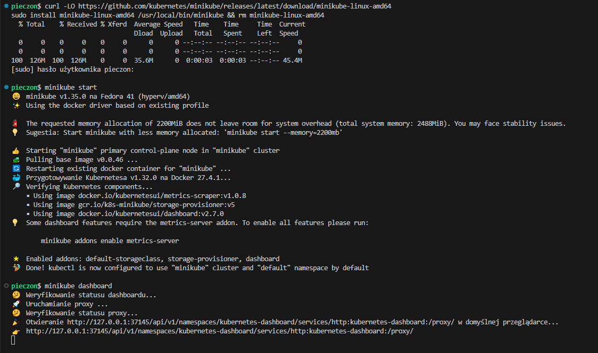
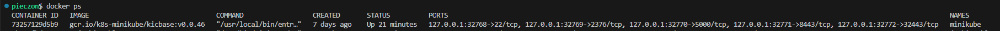
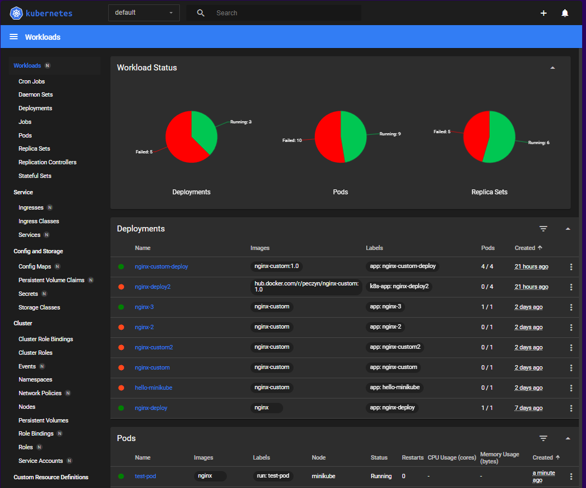
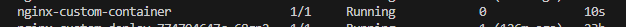
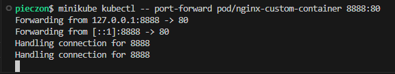
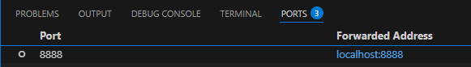
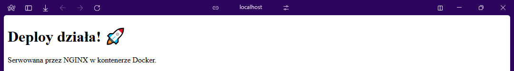
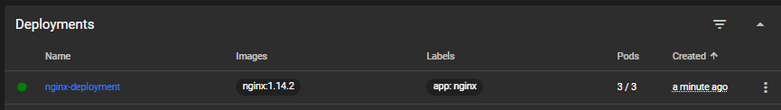
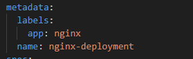
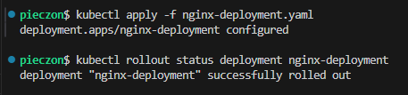

# Sprawozdanie 3 Marcin Pieczonka

## Ansible

## Instalacje nienadzorowane

## Kubernetes

### Instalacja klastra Kubernetes

Pierwszym krokiem laboratorium jest instalacja `minikube` przy pomocy dokumentacji [minikube](https://minikube.sigs.k8s.io/docs/start/).

Instalacja odbyła się u mnie przy pomocy komend:
```bash
curl -LO https://github.com/kubernetes/minikube/releases/latest/download/minikube-linux-amd64
sudo install minikube-linux-amd64 /usr/local/bin/minikube && rm minikube-linux-amd64
```

Oraz (pozyskanie narzędzia kubectl):
```bash
sudo dnf install -y kubectl
```

Warto dodać, że minikube ma swoje wymagania, czyli:

1. Minimum 2 CPU
2. Minimum 2GB pamięci
3. Minimum 20GB wolnego miejsca na dysku
4. Połączenie z internetem
5. Narzędzie obsługi kontenerów lub VM, typu Docker, Podman, Hyper-V

Sama instalacja minikube'a jest bezpieczna ponieważ:
- Minikube domyślnie działa w izolowanym środowisku, co ogranicza wpływ na system hosta
- API Kubernetes jest domyślnie dostępne tylko lokalnie
- Minikube i Kubernetes są regularnie aktualizowane


Następnie uruchamiamy minikube'a przy pomocy:
```bash
minikube start
```

Oraz uruchamiamy dashboard komendą:
```bash
minikube dashboard
```



Działający kontener:


Działający Dashboard:


### Analiza posiadanego kontenera

Z racji, iż wybrany przeze mnie do poprzednich zajęć projekt był aplikacją desktopową, użyłem w tym i kolejnym laboratorium obrazu `nginx` z własną konfiguracją. Obraz został stworzony przy pomocy takiego dockerfile'a:

```Dockerfile
FROM nginx:alpine

COPY index.html /usr/share/nginx/html/index.html
COPY default.conf /etc/nginx/conf.d/default.conf

EXPOSE 80

CMD ["nginx", "-g", "daemon off;"]
```

### Uruchamianie oprogramowania

Aby obraz zbudowany lokalnie był również dostępny w środowisku minikube, użyłem:
```bash
eval $(minikube docker-env)
```

Następnie zbudowałem obraz przy pomocy:
```bash
docker build -t nginx-custom:1.0 -f Dockerfile.nginx-custom .
```

I uruchomiłem kontener z obrazu w kubernetesie przy pomocy:
```bash
minikube kubectl -- run nginx-custom-container --image=nginx-custom:1.0 --port=80 --labels app=nginx-custom-container
minikube kubectl -- get pods 
```



```bash
minikube kubectl -- port-forward pod/nginx-custom-container 8888:80
```





### Przekucie wdrożenia manualnego w plik wdrożenia

Zapisujemy wdrożenie (pod'a) do pliku yaml:
```bash
minikube kubectl -- get pod nginx-custom-container -o yaml > pod.yaml
```

Następnie tworzymy próbne wdrożenie przykładowego deploymentu, ja skorzystałem z dokumentacji:
```bash
kubectl apply -f https://k8s.io/examples/controllers/nginx-deployment.yaml
kubectl get deployment nginx-deployment -o yaml > nginx-deployment.yaml
```



Po utworzeniu wdrożenia z przykładowego pliku, stworzyłem kopię wdrożenia lokalnie aby móc wprowadzać zmiany w pliku, jednak ściągnięty yaml zawiera metadane, których trzeba się pozbyć aby móc swobodnie wprowadzać zmiany w pliku.



Z tego co doczytałem to sekcja metadata powinna mieć przynajmniej pola `name` i `labels` aby wdrożenie działało poprawnie.

Moja wersja pliku .yaml:

```yaml
apiVersion: apps/v1
kind: Deployment
metadata:
  labels:
    app: nginx
  name: nginx-deployment
spec:
  progressDeadlineSeconds: 600
  replicas: 5
  revisionHistoryLimit: 10
  selector:
    matchLabels:
      app: nginx
  strategy:
    rollingUpdate:
      maxSurge: 25%
      maxUnavailable: 25%
    type: RollingUpdate
  template:
    metadata:
      creationTimestamp: null
      labels:
        app: nginx
    spec:
      containers:
      - image: nginx:1.14.2
        imagePullPolicy: IfNotPresent
        name: nginx
        ports:
        - containerPort: 80
          protocol: TCP
        resources: {}
        terminationMessagePath: /dev/termination-log
        terminationMessagePolicy: File
      dnsPolicy: ClusterFirst
      restartPolicy: Always
      schedulerName: default-scheduler
      securityContext: {}
      terminationGracePeriodSeconds: 30
status:
  availableReplicas: 3
  conditions:
  - lastTransitionTime: "2025-05-30T16:58:23Z"
    lastUpdateTime: "2025-05-30T16:58:23Z"
    message: Deployment has minimum availability.
    reason: MinimumReplicasAvailable
    status: "True"
    type: Available
  - lastTransitionTime: "2025-05-30T16:58:13Z"
    lastUpdateTime: "2025-05-30T16:58:23Z"
    message: ReplicaSet "nginx-deployment-647677fc66" has successfully progressed.
    reason: NewReplicaSetAvailable
    status: "True"
    type: Progressing
  observedGeneration: 1
  readyReplicas: 3
  replicas: 3
  updatedReplicas: 3
```

Następnie zmieniłem liczbę replik w sekcji `specs` i użyłem:
```bash
kubectl apply -f nginx-deployment.yaml
```

I sprawdziłem status rolloutu przez:
```bash
kubectl rollout status deployment nginx-deployment
```

