# Sprawozdanie 3 Marcin Pieczonka

## Ansible

### Instalacja zarządcy Ansible

Na potrzeby realizacji zadania przygotowano dwie maszyny wirtualne oparte na systemie Fedora Server w tej samej wersji.

* Maszyna **zarządzająca**: `peczyn@fedora`
* Maszyna **zarządzana**: `ansible@ansible-target`

Na maszynie `ansible-target` podczas instalacji:

* nadano hostname `ansible-target`
* utworzono użytkownika `ansible`
* zainstalowano niezbędne pakiety: `openssh-server` oraz `tar`

Na maszynie `peczyn@fedora` zainstalowano Ansible z repozytorium:

```bash
sudo dnf install ansible -y
```

Następnie przeprowadzono wymianę kluczy SSH pomiędzy użytkownikiem `peczyn` a użytkownikiem `ansible`:

```bash
ssh-copy-id ansible@ansible-target
```

Dzięki temu możliwe było wykonywanie poleceń SSH bez konieczności podawania hasła.

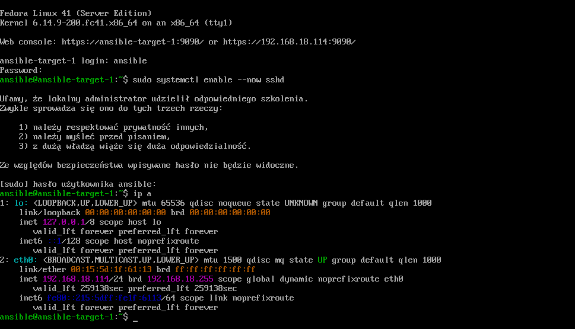
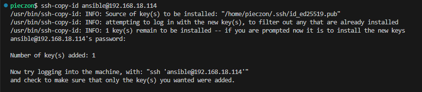

---

### Inwentaryzacja

W pliku `inventory.ini` umieszczono następującą strukturę grup hostów:

```ini
[Orchestrators]
peczyn@fedora 

[Endpoints]
ansible@ansible-target-1
```

Nazwa `ansible-target-1` została powiązana z adresem IP maszyny wirtualnej za pomocą wpisu w pliku `/etc/hosts`.

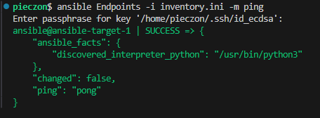

---

### Zdalne wywoływanie procedur

Playbook do wykonywania podstawowych czynności administracyjnych na maszynach końcowych:

```yaml
- name: Tasks
  hosts: Endpoints
  become: yes
  tasks:
    - name: Ping machines
      ansible.builtin.ping:

    - name: Copy inventory file
      ansible.builtin.copy:
        src: ./inventory.ini
        dest: ~/inventory.ini

    - name: Update packages
      ansible.builtin.dnf:
        name: '*'
        state: latest
        update_cache: yes

    - name: Restart sshd and rngd
      ansible.builtin.systemd:
        name: "{{item}}"
        state: restarted
      loop:
        - sshd
        - rngd
```

Uruchomienie po raz pierwszy (pełna aktualizacja i restart usług):

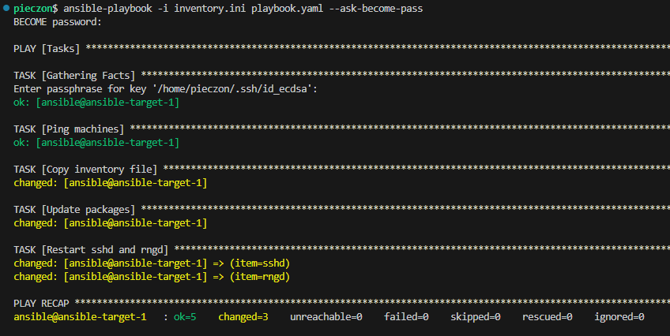

Uruchomienie drugi raz (niektóre kroki zamiast changed mają po prostu ok bo zostały już wcześniej wykonane i nie wymagały zmian):

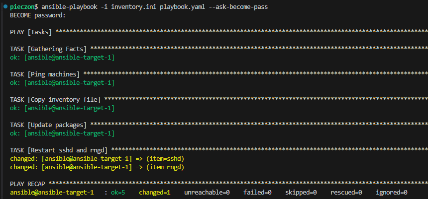

Próba wywołania przy wyłączonym SSH:

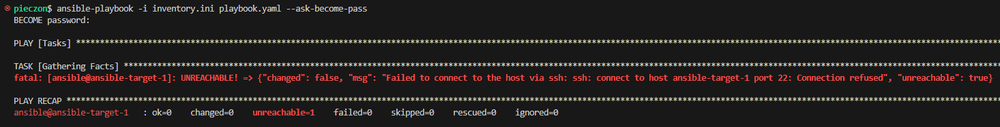

Próba wywołania przy wyłączonej karcie sieciowej:

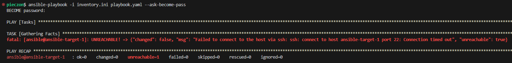

Pomiędzy wyłączonym ssh, a karcie sieciowej różnica jest w outpucie błędu między `Connection refused`, a `Connection timed out`.

---

### Zarządzanie stworzonym artefaktem

Dla potrzeb zadania przygotowano kontener zawierający aplikację **SuperTux**. W tym celu wykorzystano wcześniejszy pipeline, którego efektem był skompresowany katalog `supertux-build.tar.gz` (wyciągnąłem go z pliku .deb bo tak mi było wygodniej niż przerabiać go alienem na rpm).

Do zarządzania artefaktem przygotowano rozszerzony playbook:

```yaml
- name: Tasks
  hosts: Endpoints
  become: yes
  tasks:
    - name: Ping machines
      ansible.builtin.ping:

    - name: Copy inventory file
      ansible.builtin.copy:
        src: ./inventory.ini
        dest: ~/inventory.ini

    - name: Update packages
      ansible.builtin.dnf:
        name: '*'
        state: latest
        update_cache: yes

    - name: Restart sshd and rngd
      ansible.builtin.systemd:
        name: "{{item}}"
        state: restarted
      loop:
        - sshd
        - rngd

    - name: Remove the Supertux container
      community.docker.docker_container:
        name: "{{ container_name }}"
        state: absent
        force_kill: true
```

Kontener uruchomiono i przetestowano:

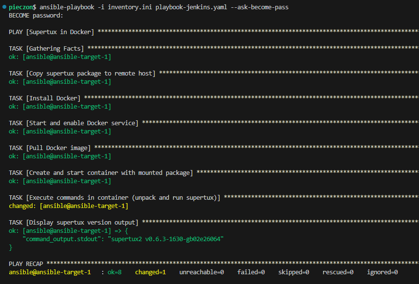

Największe problemy były:
* Brak dostępu do kontenera (permission denied) na co pomogło użycie: `security_opts: - label=disable`.
* Problemy z błędem dostępu do biblioteki przez binarkę. (głupi problem z relacjami z cmakelista programu)

Koniec końców wszystko `jakoś działa` i chociaż nie jest idealne to mnie zadowala.

---

### Ubranie wszystkiego w role

Struktura roli utworzona przy pomocy `ansible-galaxy init supertux_in_docker`.

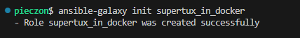
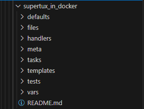

Przeniosłem `supertux-build.tar.gz` do katalogu files a następnie, zmieniłem zmienną `local_package_path` na bezpośredni odwołanie do pliku w katalogu `files`.

#### defaults/main.yml:

```yaml
local_package_path: ./supertux-build.tar.gz
remote_package_path: /tmp/supertux-build.tar.gz
container_image: peczyn/main-container:1.0
container_name: supertux-container
unpacked_dir: /supertux-build
```

#### tasks/main.yml:

```yaml
- name: Copy supertux package to remote host
  ansible.builtin.copy:
    src: supertux-build.tar.gz
    dest: "{{ remote_package_path }}"
    mode: '0644'

- name: Install Docker
  ansible.builtin.dnf:
    name:
      - docker
    state: present
    update_cache: yes

- name: Start and enable Docker service
  ansible.builtin.service:
    name: docker
    state: started
    enabled: yes

- name: Pull Docker image
  community.docker.docker_image:
    name: "{{ container_image }}"
    source: pull

- name: Create and start container with mounted package
  community.docker.docker_container:
    name: "{{ container_name }}"
    image: "{{ container_image }}"
    state: started
    volumes:
      - "{{ remote_package_path }}:{{ remote_package_path }}"
    command: sleep infinity
    detach: true
    security_opts:
      - label=disable

- name: Execute commands in container (unpack and run supertux)
  community.docker.docker_container_exec:
    container: "{{ container_name }}"
    command: >
      sh -c "
      mkdir -p {{ unpacked_dir }} &&
      tar -xzf {{ remote_package_path }} -C / &&
      cd /supertux/build &&
      ./supertux2 --version
      "
  register: command_output

- name: Display supertux version output
  ansible.builtin.debug:
    var: command_output.stdout

- name: Remove the Supertux container
  community.docker.docker_container:
    name: "{{ container_name }}"
    state: absent
    force_kill: true
```

#### Główny plik playbooka:

```yaml
- name: Run Supertux setup in Docker container
  hosts: Endpoints
  become: yes

  roles:
    - role: supertux_in_docker
```

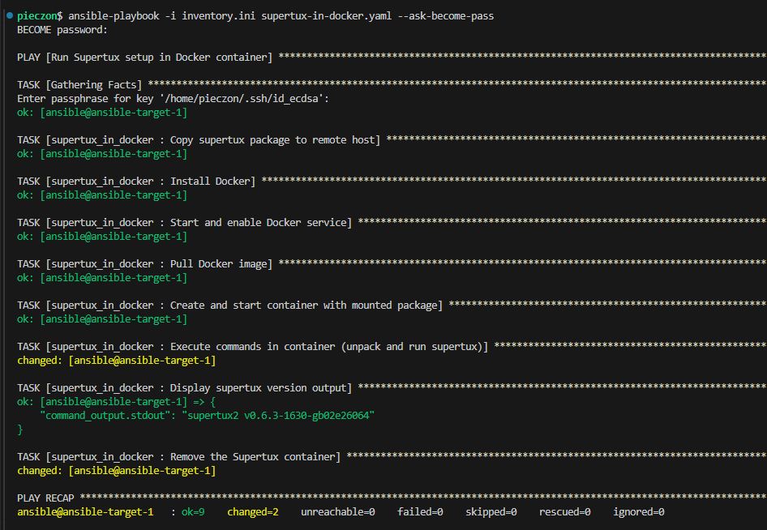

---


## Instalacje nienadzorowane

### Instalacja systemu Fedora i przygotowanie pliku odpowiedzi

Do instalacji wykorzystano obraz instalatora sieciowego `Fedora-Server-netinst-x86_64-41-1.4`.

Zdjęcie wyboru instalatora:

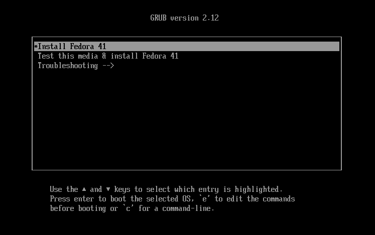

Instalacja została wykonana ręcznie, a następnie pobrany został automatycznie wygenerowany plik odpowiedzi Kickstart (`/root/anaconda-ks.cfg`) w celu jego dalszej modyfikacji.

Zdjęcie instalatora bez użycia pliku odpowiedzi:

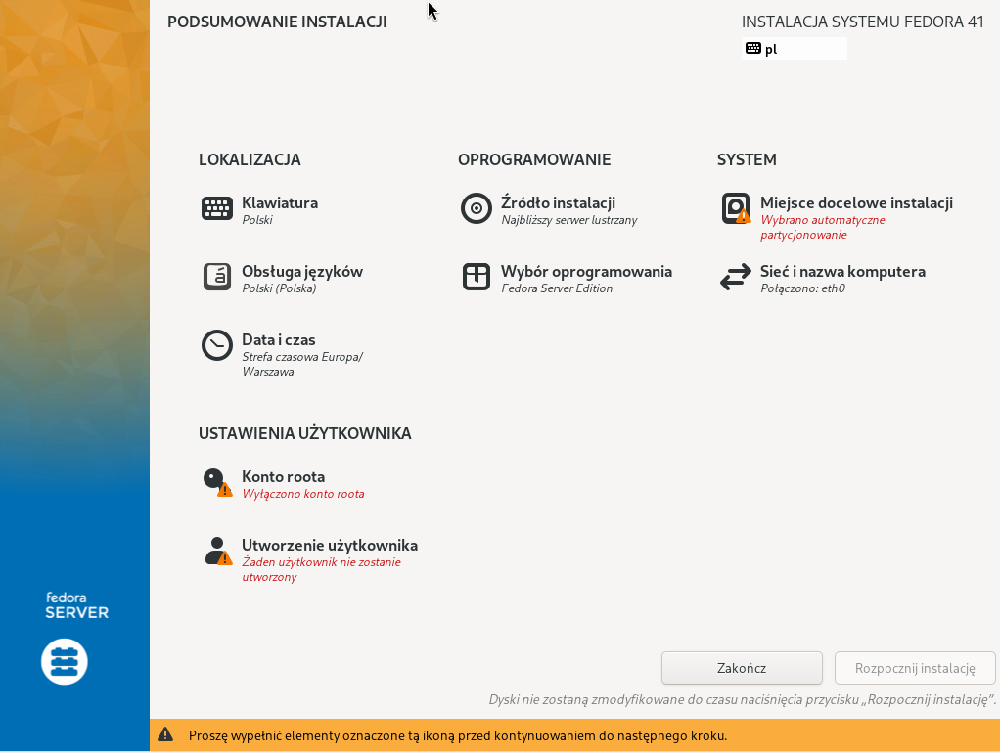

Podstawowy plik `anaconda-ks.cfg` przed modyfikacjami:

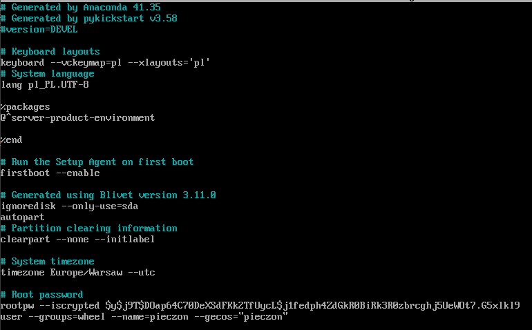

---

### Zmodyfikowany plik odpowiedzi

Na podstawie pobranego pliku przygotowano własną wersję z następującymi zmianami:

* Ustawiono nazwę hosta: `pieczons-server`
* Ustawiono strefę czasową: `Europe/Warsaw`
* Dodano repozytoria Fedory 41 oraz aktualizacji
* Utworzono użytkownika `pieczon` z zaszyfrowanym hasłem i dodano go do grupy `wheel`
* Zapewniono automatyczne formatowanie całego dysku
* Dodano instalację wymaganych pakietów: `docker`, `git`, `tar`, `wget`

Sekcja `%post` zawiera mechanizm pobierający obraz Dockera i konfigurujący jednostkę `systemd`, która automatycznie uruchamia kontener z własnym serwerem NGINX przy starcie systemu.

Co istotne korzystam tutaj z customowego obrazu NGINX, chciałem zrobić to na aplikacji z którą był związany mój pipeline jednak na poprzednich laboratoriach korzystałem z ubuntu do buildowania programu i teraz napotkałem trudności w uruchomieniu go na fedorze, a zależało mi żeby ogarnąć lepiej instalacje nienadzorowane niż spędzać niepotrzebnie czas na nową konfigurację projektu.

Zmodyfikowany plik Kickstart:

```dockerfile
# Generated by Anaconda 41.35
# Generated by pykickstart v3.58
#version=DEVEL

# Host name
network --hostname=pieczons-server

# System timezone
timezone Europe/Warsaw --utc

# Repositories
url --mirrorlist=http://mirrors.fedoraproject.org/mirrorlist?repo=fedora-41&arch=x86_64
repo --name=update --mirrorlist=http://mirrors.fedoraproject.org/mirrorlist?repo=updates-released-f41&arch=x86_64

# Keyboard layouts
keyboard --vckeymap=us --xlayouts='us'
# System language
lang pl_PL.UTF-8

# Root password
rootpw --plaintext pieczon
user --groups=wheel --name=pieczon --password='$y$j9T$In7xVBKU2ihXdRgnf3jxs/$6tI.ELsqY.QLNRHvzFev6rr7HRv8Vmabc00kgaylNN1' --iscrypted

# Run the Setup Agent on first boot
firstboot --enable
# Do not configure the X Window System
skipx

# Generated using Blivet version 3.11.0
ignoredisk --only-use=sda
# System bootloader configuration
bootloader --location=mbr --boot-drive=sda
autopart
# Partition clearing information
clearpart --all

%packages
@^custom-environment
docker
git
tar
wget

%end

%post --nochroot
systemctl enable docker

sleep 10

/usr/bin/docker pull peczyn/nginx-custom:1.1

cat <<EOF > /mnt/sysimage/etc/systemd/system/nginx-container.service
[Unit]
Description=Custom NGINX Container
Requires=docker.service
After=docker.service

[Service]
Restart=always
ExecStart=/usr/bin/docker run --rm --name nginx-custom -p 80:80 peczyn/nginx-custom:1.1
ExecStop=/usr/bin/docker stop nginx-custom

[Install]
WantedBy=multi-user.target
EOF

chroot /mnt/sysimage /bin/systemctl enable nginx-container.service
%end

reboot
```

---

### Wskazanie pliku odpowiedzi przy instalacji

Aby wskazać instalatorowi przygotowany plik Kickstart, podczas uruchamiania ISO należało wybrać opcję „Fedora” i nacisnąć klawisz `e`, a następnie dopisać odpowiednią ścieżkę:

```bash
inst.ks=https://raw.githubusercontent.com/InzynieriaOprogramowaniaAGH/MDO2025_INO/refs/heads/MP416297/ITE/GCL06/MP416297/Sprawozdanie3/kickstart/anaconda-ks.cfg
```

Zdjęcie z wpisanym `inst.ks=`:

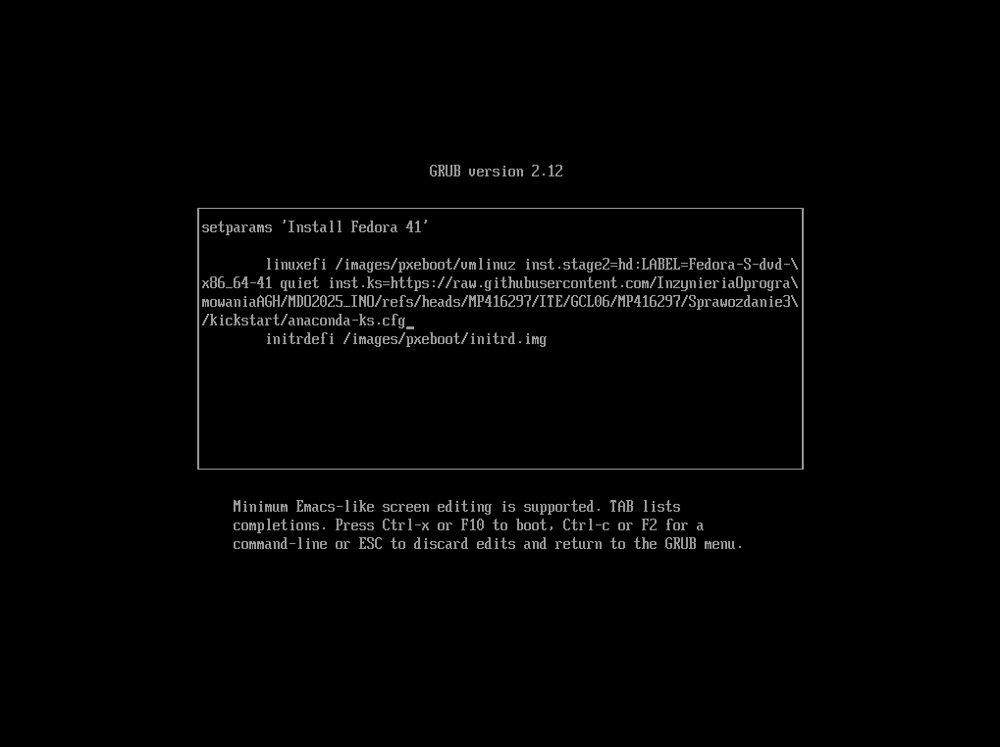

---

### Przebieg instalacji i efekt końcowy

Po zatwierdzeniu zmodyfikowanego wejścia GRUB, instalacja została przeprowadzona automatycznie – bez potrzeby wyboru partycjonowania, pakietów, użytkowników itd.

Zdjęcie instalatora z automatycznie uzupełnionymi informacjami:

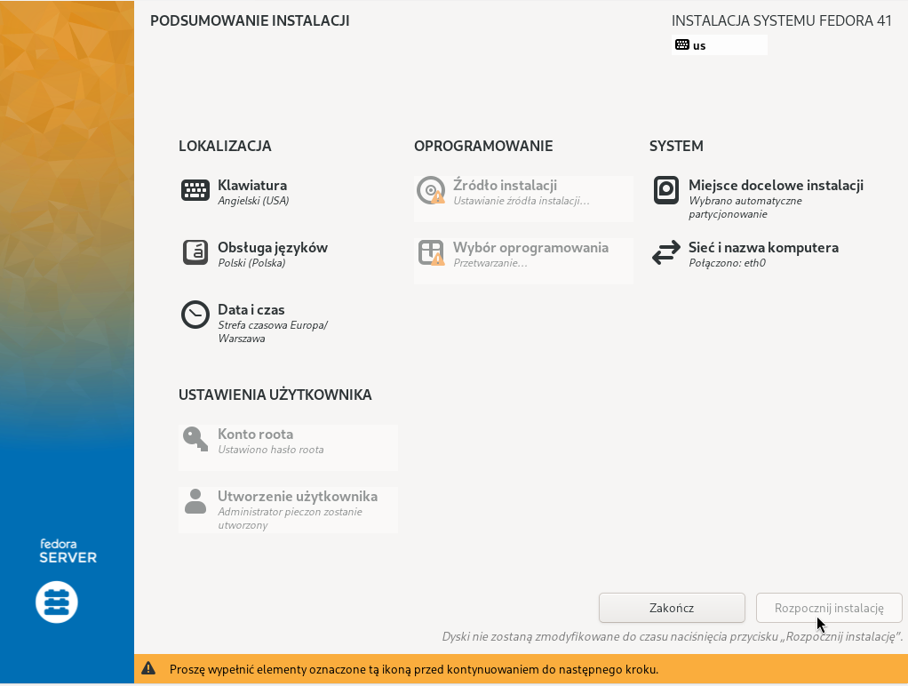

Po zakończeniu instalacji i restarcie systemu, uruchomiona została usługa `nginx-container.service`, która automatycznie uruchamia kontener Dockera z własnym serwerem HTTP.

Zdjęcie systemu po restarcie z uruchomionym kontenerem:

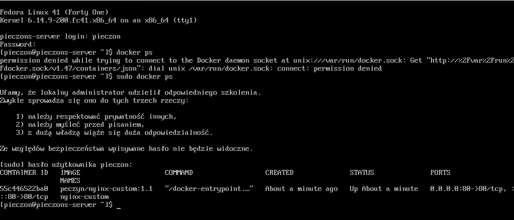

---

## Kubernetes

### Instalacja klastra Kubernetes

Pierwszym krokiem laboratorium jest instalacja `minikube` przy pomocy dokumentacji [minikube](kubernetes/ss/https://minikube.sigs.k8s.io/docs/start/).

Instalacja odbyła się u mnie przy pomocy komend:
```bash
curl -LO https://github.com/kubernetes/minikube/releases/latest/download/minikube-linux-amd64
sudo install minikube-linux-amd64 /usr/local/bin/minikube && rm minikube-linux-amd64
```

Oraz (pozyskanie narzędzia kubectl):
```bash
sudo dnf install -y kubectl
``` 

Warto dodać, że minikube ma swoje wymagania, czyli:

1. Minimum 2 CPU
2. Minimum 2GB pamięci
3. Minimum 20GB wolnego miejsca na dysku
4. Połączenie z internetem
5. Narzędzie obsługi kontenerów lub VM, typu Docker, Podman, Hyper-V

Sama instalacja minikube'a jest bezpieczna ponieważ:
- Minikube domyślnie działa w izolowanym środowisku, co ogranicza wpływ na system hosta
- API Kubernetes jest domyślnie dostępne tylko lokalnie
- Minikube i Kubernetes są regularnie aktualizowane


Następnie uruchamiamy minikube'a przy pomocy:
```bash
minikube start
```

Oraz uruchamiamy dashboard komendą:
```bash
minikube dashboard
```

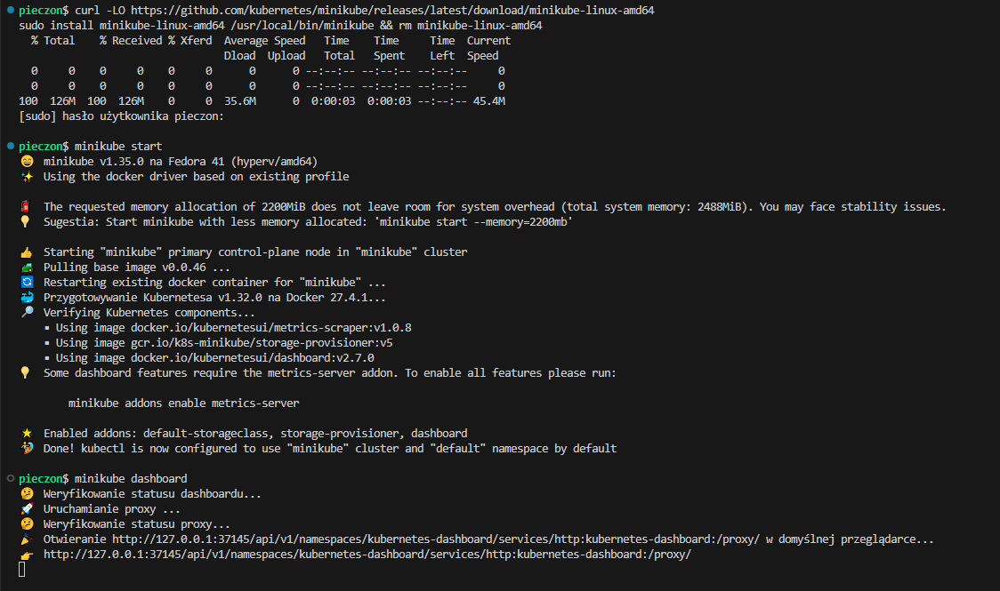

Działający kontener:
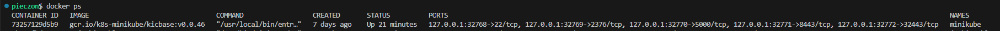

Działający Dashboard:
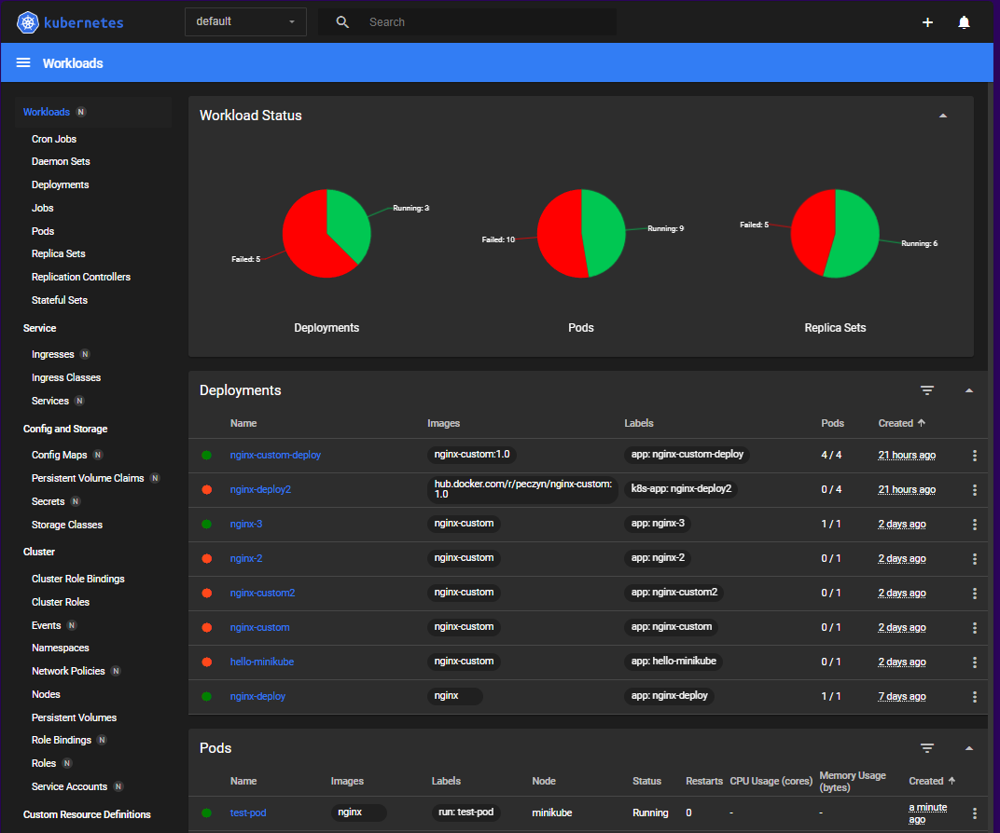

---

### Analiza posiadanego kontenera

Z racji, iż wybrany przeze mnie do poprzednich zajęć projekt był aplikacją desktopową, użyłem w tym i kolejnym laboratorium obrazu `nginx` z własną konfiguracją. Obraz został stworzony przy pomocy takiego dockerfile'a:

```Dockerfile
FROM nginx:alpine

COPY index.html /usr/share/nginx/html/index.html
COPY default.conf /etc/nginx/conf.d/default.conf

EXPOSE 80

CMD ["nginx", "-g", "daemon off;"]
```

---

### Uruchamianie oprogramowania

Aby obraz zbudowany lokalnie był również dostępny w środowisku minikube, użyłem:
```bash
eval $(minikube docker-env)
```

Następnie zbudowałem obraz przy pomocy:
```bash
docker build -t nginx-custom:1.0 -f Dockerfile.nginx-custom .
```

I uruchomiłem kontener z obrazu w kubernetesie przy pomocy:
```bash
minikube kubectl -- run nginx-custom-container --image=nginx-custom:1.0 --port=80 --labels app=nginx-custom-container
minikube kubectl -- get pods 
```

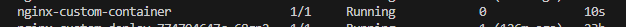

```bash
minikube kubectl -- port-forward pod/nginx-custom-container 8888:80
```
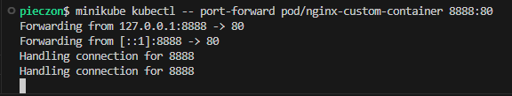
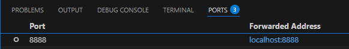
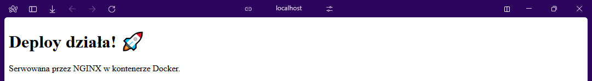

---

### Przekucie wdrożenia manualnego w plik wdrożenia

Zapisujemy wdrożenie (pod'a) do pliku yaml:
```bash
minikube kubectl -- get pod nginx-custom-container -o yaml > pod.yaml
```

Następnie tworzymy próbne wdrożenie przykładowego deploymentu, ja skorzystałem z dokumentacji:
```bash
kubectl apply -f https://k8s.io/examples/controllers/nginx-deployment.yaml
kubectl get deployment nginx-deployment -o yaml > nginx-deployment.yaml
```

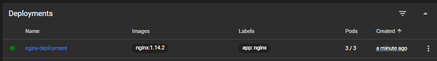

Po utworzeniu wdrożenia z przykładowego pliku, stworzyłem kopię wdrożenia lokalnie aby móc wprowadzać zmiany w pliku, jednak ściągnięty yaml zawiera metadane, których trzeba się pozbyć aby móc swobodnie wprowadzać zmiany w pliku.

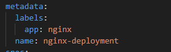

Z tego co doczytałem to sekcja metadata powinna mieć przynajmniej pola `name` i `labels` aby wdrożenie działało poprawnie.

Moja wersja pliku .yaml:

```yaml
apiVersion: apps/v1
kind: Deployment
metadata:
  labels:
    app: nginx
  name: nginx-deployment
spec:
  progressDeadlineSeconds: 600
  replicas: 5
  revisionHistoryLimit: 10
  selector:
    matchLabels:
      app: nginx
  strategy:
    rollingUpdate:
      maxSurge: 25%
      maxUnavailable: 25%
    type: RollingUpdate
  template:
    metadata:
      creationTimestamp: null
      labels:
        app: nginx
    spec:
      containers:
      - image: nginx:1.14.2
        imagePullPolicy: IfNotPresent
        name: nginx
        ports:
        - containerPort: 80
          protocol: TCP
        resources: {}
        terminationMessagePath: /dev/termination-log
        terminationMessagePolicy: File
      dnsPolicy: ClusterFirst
      restartPolicy: Always
      schedulerName: default-scheduler
      securityContext: {}
      terminationGracePeriodSeconds: 30
status:
  availableReplicas: 3
  conditions:
  - lastTransitionTime: "2025-05-30T16:58:23Z"
    lastUpdateTime: "2025-05-30T16:58:23Z"
    message: Deployment has minimum availability.
    reason: MinimumReplicasAvailable
    status: "True"
    type: Available
  - lastTransitionTime: "2025-05-30T16:58:13Z"
    lastUpdateTime: "2025-05-30T16:58:23Z"
    message: ReplicaSet "nginx-deployment-647677fc66" has successfully progressed.
    reason: NewReplicaSetAvailable
    status: "True"
    type: Progressing
  observedGeneration: 1
  readyReplicas: 3
  replicas: 3
  updatedReplicas: 3
```

Następnie zmieniłem liczbę replik w sekcji `specs` i użyłem:
```bash
kubectl apply -f nginx-deployment.yaml
```

I sprawdziłem status rolloutu przez:
```bash
kubectl rollout status deployment nginx-deployment
```

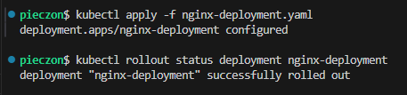

---

### Przygotowanie nowego obrazu

Na potrzeby kolejnego laboratorium należało utworzyć dodatkowe wersje poprzednio używanego obrazu, jedną bardziej rozszerzoną o dodatkową konfigurację, oraz kolejną, której uruchomienie zawsze kończy się błędem (mimo poprawnego zbudowania obrazu).

---

#### Wersja rozszerzona

Dodałem tutaj dodatkową warstwę, która kopiuje dodatkowy plik.

```Dockerfile
FROM nginx:alpine

COPY index.html /usr/share/nginx/html/index.html
COPY default.conf /etc/nginx/conf.d/default.conf
COPY README.txt /usr/share/nginx/html/README.txt

EXPOSE 80

CMD ["nginx", "-g", "daemon off;"]
```

---

#### Wersja z błędem

Ta sama struktura co wersja rozszerzona jednak komendę startową kontenera zmieniłem na `false`.

```Dockerfile
FROM nginx:alpine

COPY index.html /usr/share/nginx/html/index.html
COPY default.conf /etc/nginx/conf.d/default.conf
COPY README.txt /usr/share/nginx/html/README.txt

EXPOSE 80

CMD ["false"]
```

Obie wersje zostały zbudowane i przekazane do środowiska minikube.

---

### Zmiany w deploymencie

Najpierw uruchamiamy deployment z zeszłego laboratorium z pliku yaml.

```bash
minikube kubectl -- apply -f nginx-deployment.yaml
```

Następnie wprowadzamy zmiany w konfiguracji i wprowadzamy je tą samą komendą.

Ilość replik zmieniamy w:
```yaml
spec:
  replicas: 32
```

Wersję zmieniamy w:
```yaml
spec:
  template:
    spec:
      containers:
      - image: nginx-custom:1.0
```


Wersja początkowa:


Zwiększenie replik np. do 8


Zmniejszenie liczby replik do 1


Zmniejszenie liczby replik do 0


Ponowne przeskalowanie w górę do 4 replik (co najmniej)


Zastosowanie nowej wersji obrazu


Zastosowanie "wadliwego" obrazu


Przywracanie i sprawdzanie historii rollout'ów wykonywałem poprzez:
```bash
minikube kubectl -- rollout history deployment nginx-deployment
minikube kubectl -- rollout undo deployment nginx-deployment
```

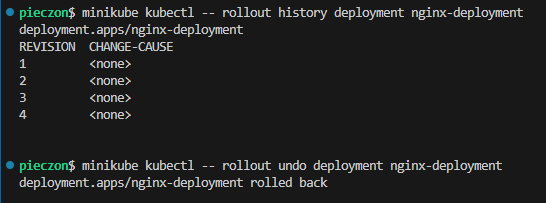

Warto zaznaczyć, że w rollout history widać tylko 4 wersje REVISION, ponieważ rollout history pokazuje tylko rewizje, które zmieniają template podów. Jeżeli chcemy zobaczyć zmiany ilości replik ostatniej rewizji, to możemy je znaleźć robiąc:
```bash
minikube kubectl -- apply -f nginx-deployment.yaml | grep -i Scaled
```
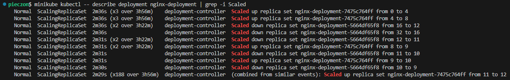

---

### Kontrola wdrożenia
Skrypt weryfikujący wdrożenie:
```bash
#!/bin/bash

if [ -z "$1" ]; then
  echo "❗ Usage: $0 <deployment-name> [namespace]"
  exit 1
fi

DEPLOYMENT_NAME="$1"
NAMESPACE="${2:-default}" 
TIMEOUT=60

echo "Checking rollout for deployment: '$DEPLOYMENT_NAME' in namespace '$NAMESPACE'..."

if kubectl rollout status deployment "$DEPLOYMENT_NAME" -n "$NAMESPACE" --timeout=${TIMEOUT}s; then
    echo "✅ Rollout success in $TIMEOUT seconds."
    exit 0
else
    echo "❌ Rollout unsuccessfull in $TIMEOUT seconds."
    kubectl describe deployment "$DEPLOYMENT_NAME" -n "$NAMESPACE"
    exit 1
fi
```
Skrypt wykorzystuje polecenie, które domyślnie pozwala na śledzenie statusu deploymentu:
```bash
kubectl rollout status deployment <name>
```
reszta to tak naprawdę upiększenie skryptu i dodanie timeout'u.

---

### Strategie wdrożenia
RollingUpdate stopniowo zastępuje stare pody nowymi. Pozwala na płynne wdrożenie i brak przestoju, jednak równoczesne działanie kilku wersji może powodować błędy.
RollingUpdate:
```yaml
strategy:
    rollingUpdate:
      maxSurge: 25%
      maxUnavailable: 25%
    type: RollingUpdate
```

Recreate po prostu usuwa wszystkie stare pody, a następnie uruchamia nowe. Pozwala na uniknięcie konfliktu paru wersji jednocześnie, jednak wywołuje przestój.
Recreate:
```yaml
strategy:
    type: Recreate
```

W canary deployment nowa wersja trafia najpierw tylko do części podów, aby zobaczyć czy działa i jest stabilna a dopiero potem jest przekazywana do pozostałej części. Pozwala to na bezpieczne testowanie zmian na produkcji, ale wymaga więcej konfiguracji.
Canary Deployment:
```yaml
apiVersion: apps/v1
kind: Deployment
metadata:
  name: nginx-deployment-stable
  labels:
    app: nginx
    version: stable
spec:
  replicas: 29
  revisionHistoryLimit: 10
  selector:
    matchLabels:
      app: nginx
      version: stable
  strategy:
    type: Recreate
  template:
    metadata:
      labels:
        app: nginx
        version: stable
    spec:
      containers:
      - name: nginx
        image: nginx-custom:1.0
        imagePullPolicy: IfNotPresent
        ports:
        - containerPort: 80
```

```yaml
apiVersion: apps/v1
kind: Deployment
metadata:
  name: nginx-deployment-canary
  labels:
    app: nginx
    version: canary
spec:
  replicas: 3
  revisionHistoryLimit: 10
  selector:
    matchLabels:
      app: nginx
      version: canary
  strategy:
    type: Recreate
  template:
    metadata:
      labels:
        app: nginx
        version: canary
    spec:
      containers:
      - name: nginx
        image: nginx-custom:1.1
        imagePullPolicy: IfNotPresent
        ports:
        - containerPort: 80
```

Użycie `service` pomaga kierować ruch do wszystkich podów, które mają `app=nginx`. Czyli mając deploymenty o tej samej etykiecie tzn. `app: nginx`, ale różne wersje `stable` oraz `canary`, możemy kierować do nich obu ruch w zorganizowany sposób (zorganizowany tzn. im więcej podów ma wersja tym większa szansa że tam nastąpi przekierowanie).

```yaml
apiVersion: v1
kind: Service
metadata:
  name: nginx-service
spec:
  selector:
    app: nginx
  ports:
  - port: 80
    targetPort: 80
    protocol: TCP
  type: NodePort

```

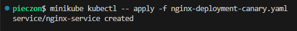


---