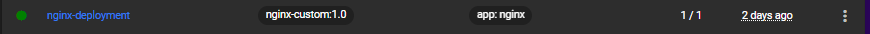
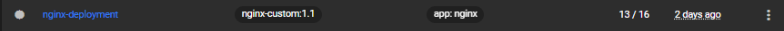
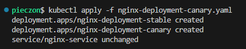

# Sprawozdanie 3 Marcin Pieczonka

## Ansible

## Instalacje nienadzorowane

## Kubernetes

### Instalacja klastra Kubernetes

Pierwszym krokiem laboratorium jest instalacja `minikube` przy pomocy dokumentacji [minikube](kubernetes/ss/https://minikube.sigs.k8s.io/docs/start/).

Instalacja odbyła się u mnie przy pomocy komend:
```bash
curl -LO https://github.com/kubernetes/minikube/releases/latest/download/minikube-linux-amd64
sudo install minikube-linux-amd64 /usr/local/bin/minikube && rm minikube-linux-amd64
```

Oraz (pozyskanie narzędzia kubectl):
```bash
sudo dnf install -y kubectl
``` 

Warto dodać, że minikube ma swoje wymagania, czyli:

1. Minimum 2 CPU
2. Minimum 2GB pamięci
3. Minimum 20GB wolnego miejsca na dysku
4. Połączenie z internetem
5. Narzędzie obsługi kontenerów lub VM, typu Docker, Podman, Hyper-V

Sama instalacja minikube'a jest bezpieczna ponieważ:
- Minikube domyślnie działa w izolowanym środowisku, co ogranicza wpływ na system hosta
- API Kubernetes jest domyślnie dostępne tylko lokalnie
- Minikube i Kubernetes są regularnie aktualizowane


Następnie uruchamiamy minikube'a przy pomocy:
```bash
minikube start
```

Oraz uruchamiamy dashboard komendą:
```bash
minikube dashboard
```


Działający kontener:


Działający Dashboard:


### Analiza posiadanego kontenera

Z racji, iż wybrany przeze mnie do poprzednich zajęć projekt był aplikacją desktopową, użyłem w tym i kolejnym laboratorium obrazu `nginx` z własną konfiguracją. Obraz został stworzony przy pomocy takiego dockerfile'a:

```Dockerfile
FROM nginx:alpine

COPY index.html /usr/share/nginx/html/index.html
COPY default.conf /etc/nginx/conf.d/default.conf

EXPOSE 80

CMD ["nginx", "-g", "daemon off;"]
```

### Uruchamianie oprogramowania

Aby obraz zbudowany lokalnie był również dostępny w środowisku minikube, użyłem:
```bash
eval $(minikube docker-env)
```

Następnie zbudowałem obraz przy pomocy:
```bash
docker build -t nginx-custom:1.0 -f Dockerfile.nginx-custom .
```

I uruchomiłem kontener z obrazu w kubernetesie przy pomocy:
```bash
minikube kubectl -- run nginx-custom-container --image=nginx-custom:1.0 --port=80 --labels app=nginx-custom-container
minikube kubectl -- get pods 
```


```bash
minikube kubectl -- port-forward pod/nginx-custom-container 8888:80
```


### Przekucie wdrożenia manualnego w plik wdrożenia

Zapisujemy wdrożenie (pod'a) do pliku yaml:
```bash
minikube kubectl -- get pod nginx-custom-container -o yaml > pod.yaml
```

Następnie tworzymy próbne wdrożenie przykładowego deploymentu, ja skorzystałem z dokumentacji:
```bash
kubectl apply -f https://k8s.io/examples/controllers/nginx-deployment.yaml
kubectl get deployment nginx-deployment -o yaml > nginx-deployment.yaml
```


Po utworzeniu wdrożenia z przykładowego pliku, stworzyłem kopię wdrożenia lokalnie aby móc wprowadzać zmiany w pliku, jednak ściągnięty yaml zawiera metadane, których trzeba się pozbyć aby móc swobodnie wprowadzać zmiany w pliku.


Z tego co doczytałem to sekcja metadata powinna mieć przynajmniej pola `name` i `labels` aby wdrożenie działało poprawnie.

Moja wersja pliku .yaml:

```yaml
apiVersion: apps/v1
kind: Deployment
metadata:
  labels:
    app: nginx
  name: nginx-deployment
spec:
  progressDeadlineSeconds: 600
  replicas: 5
  revisionHistoryLimit: 10
  selector:
    matchLabels:
      app: nginx
  strategy:
    rollingUpdate:
      maxSurge: 25%
      maxUnavailable: 25%
    type: RollingUpdate
  template:
    metadata:
      creationTimestamp: null
      labels:
        app: nginx
    spec:
      containers:
      - image: nginx:1.14.2
        imagePullPolicy: IfNotPresent
        name: nginx
        ports:
        - containerPort: 80
          protocol: TCP
        resources: {}
        terminationMessagePath: /dev/termination-log
        terminationMessagePolicy: File
      dnsPolicy: ClusterFirst
      restartPolicy: Always
      schedulerName: default-scheduler
      securityContext: {}
      terminationGracePeriodSeconds: 30
status:
  availableReplicas: 3
  conditions:
  - lastTransitionTime: "2025-05-30T16:58:23Z"
    lastUpdateTime: "2025-05-30T16:58:23Z"
    message: Deployment has minimum availability.
    reason: MinimumReplicasAvailable
    status: "True"
    type: Available
  - lastTransitionTime: "2025-05-30T16:58:13Z"
    lastUpdateTime: "2025-05-30T16:58:23Z"
    message: ReplicaSet "nginx-deployment-647677fc66" has successfully progressed.
    reason: NewReplicaSetAvailable
    status: "True"
    type: Progressing
  observedGeneration: 1
  readyReplicas: 3
  replicas: 3
  updatedReplicas: 3
```

Następnie zmieniłem liczbę replik w sekcji `specs` i użyłem:
```bash
kubectl apply -f nginx-deployment.yaml
```

I sprawdziłem status rolloutu przez:
```bash
kubectl rollout status deployment nginx-deployment
```


### Przygotowanie nowego obrazu

Na potrzeby kolejnego laboratorium należało utworzyć dodatkowe wersje poprzednio używanego obrazu, jedną bardziej rozszerzoną o dodatkową konfigurację, oraz kolejną, której uruchomienie zawsze kończy się błędem (mimo poprawnego zbudowania obrazu).

#### Wersja rozszerzona

Dodałem tutaj dodatkową warstwę, która kopiuje dodatkowy plik.

```Dockerfile
FROM nginx:alpine

COPY index.html /usr/share/nginx/html/index.html
COPY default.conf /etc/nginx/conf.d/default.conf
COPY README.txt /usr/share/nginx/html/README.txt

EXPOSE 80

CMD ["nginx", "-g", "daemon off;"]
```

#### Wersja z błędem

Ta sama struktura co wersja rozszerzona jednak komendę startową kontenera zmieniłem na `false`.

```Dockerfile
FROM nginx:alpine

COPY index.html /usr/share/nginx/html/index.html
COPY default.conf /etc/nginx/conf.d/default.conf
COPY README.txt /usr/share/nginx/html/README.txt

EXPOSE 80

CMD ["false"]
```

Obie wersje zostały zbudowane i przekazane do środowiska minikube.

### Zmiany w deploymencie

Najpierw uruchamiamy deployment z zeszłego laboratorium z pliku yaml.

```bash
minikube kubectl -- apply -f nginx-deployment.yaml
```

Następnie wprowadzamy zmiany w konfiguracji i wprowadzamy je tą samą komendą.

Ilość replik zmieniamy w:
```yaml
spec:
  replicas: 32
```

Wersję zmieniamy w:
```yaml
spec:
  template:
    spec:
      containers:
      - image: nginx-custom:1.0
```


Wersja początkowa:


Zwiększenie replik np. do 8


Zmniejszenie liczby replik do 1


Zmniejszenie liczby replik do 0


Ponowne przeskalowanie w górę do 4 replik (co najmniej)


Zastosowanie nowej wersji obrazu



Zastosowanie "wadliwego" obrazu


Przywracanie i sprawdzanie historii rollout'ów wykonywałem poprzez:
```bash
minikube kubectl -- rollout history deployment nginx-deployment
minikube kubectl -- rollout undo deployment nginx-deployment
```


Warto zaznaczyć, że w rollout history widać tylko 4 wersje REVISION, ponieważ rollout history pokazuje tylko rewizje, które zmieniają template podów. Jeżeli chcemy zobaczyć zmiany ilości replik ostatniej rewizji, to możemy je znaleźć robiąc:
```bash
minikube kubectl -- apply -f nginx-deployment.yaml | grep -i Scaled
```


### Kontrola wdrożenia
Skrypt weryfikujący wdrożenie:
```bash
#!/bin/bash

if [ -z "$1" ]; then
  echo "❗ Usage: $0 <deployment-name> [namespace]"
  exit 1
fi

DEPLOYMENT_NAME="$1"
NAMESPACE="${2:-default}" 
TIMEOUT=60

echo "Checking rollout for deployment: '$DEPLOYMENT_NAME' in namespace '$NAMESPACE'..."

if kubectl rollout status deployment "$DEPLOYMENT_NAME" -n "$NAMESPACE" --timeout=${TIMEOUT}s; then
    echo "✅ Rollout success in $TIMEOUT seconds."
    exit 0
else
    echo "❌ Rollout unsuccessfull in $TIMEOUT seconds."
    kubectl describe deployment "$DEPLOYMENT_NAME" -n "$NAMESPACE"
    exit 1
fi
```
Skrypt wykorzystuje polecenie, które domyślnie pozwala na śledzenie statusu deploymentu:
```bash
kubectl rollout status deployment <name>
```
reszta to tak naprawdę upiększenie skryptu i dodanie timeout'u.


### Strategie wdrożenia
RollingUpdate stopniowo zastępuje stare pody nowymi. Pozwala na płynne wdrożenie i brak przestoju, jednak równoczesne działanie kilku wersji może powodować błędy.
RollingUpdate:
```yaml
strategy:
    rollingUpdate:
      maxSurge: 25%
      maxUnavailable: 25%
    type: RollingUpdate
```

Recreate po prostu usuwa wszystkie stare pody, a następnie uruchamia nowe. Pozwala na uniknięcie konfliktu paru wersji jednocześnie, jednak wywołuje przestój.
Recreate:
```yaml
strategy:
    type: Recreate
```

W canary deployment nowa wersja trafia najpierw tylko do części podów, aby zobaczyć czy działa i jest stabilna a dopiero potem jest przekazywana do pozostałej części. Pozwala to na bezpieczne testowanie zmian na produkcji, ale wymaga więcej konfiguracji.
Canary Deployment:
```yaml
apiVersion: apps/v1
kind: Deployment
metadata:
  name: nginx-deployment-stable
  labels:
    app: nginx
    version: stable
spec:
  replicas: 29
  revisionHistoryLimit: 10
  selector:
    matchLabels:
      app: nginx
      version: stable
  strategy:
    type: Recreate
  template:
    metadata:
      labels:
        app: nginx
        version: stable
    spec:
      containers:
      - name: nginx
        image: nginx-custom:1.0
        imagePullPolicy: IfNotPresent
        ports:
        - containerPort: 80
```

```yaml
apiVersion: apps/v1
kind: Deployment
metadata:
  name: nginx-deployment-canary
  labels:
    app: nginx
    version: canary
spec:
  replicas: 3
  revisionHistoryLimit: 10
  selector:
    matchLabels:
      app: nginx
      version: canary
  strategy:
    type: Recreate
  template:
    metadata:
      labels:
        app: nginx
        version: canary
    spec:
      containers:
      - name: nginx
        image: nginx-custom:1.1
        imagePullPolicy: IfNotPresent
        ports:
        - containerPort: 80
```

Użycie `service` pomaga kierować ruch do wszystkich podów, które mają `app=nginx`. Czyli mając deploymenty o tej samej etykiecie tzn. `app: nginx`, ale różne wersje `stable` oraz `canary`, możemy kierować do nich obu ruch w zorganizowany sposób (zorganizowany tzn. im więcej podów ma wersja tym większa szansa że tam nastąpi przekierowanie).

```yaml
apiVersion: v1
kind: Service
metadata:
  name: nginx-service
spec:
  selector:
    app: nginx
  ports:
  - port: 80
    targetPort: 80
    protocol: TCP
  type: NodePort

```





