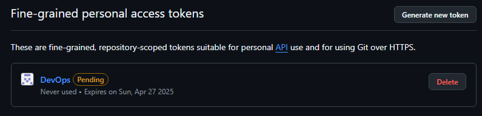
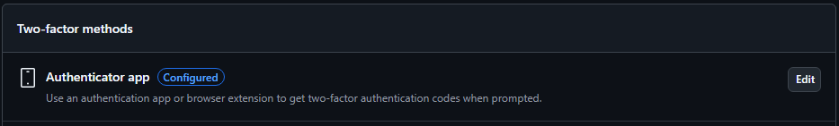
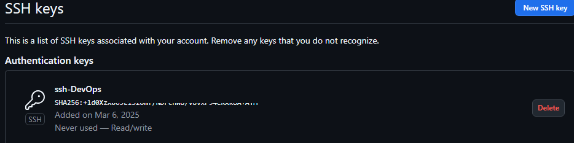
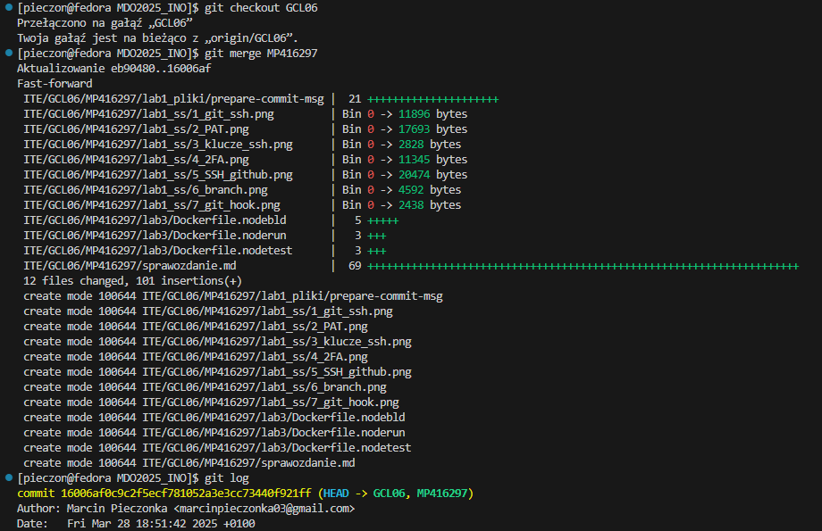

# Sprawozdanie

## Lab 1

### Instalacja git i obsługa kluczy ssh

1. `sudo dnf install git-all` - instalacja git'a
2. `sudo dnf install openssh-server` - instalacja SSh
3. `systemctl start sshd.service` - uruchomienie usługi SSH

### Klonowanie repozytorium przez HTTPS i PAT
Najpierw utworzyłem na github Personal Access Token (PAT):

Następnie sklonowałem repozytorium za pomocą:\
`git clone https://github.com/InzynieriaOprogramowaniaAGH/MDO2025_INO.git`

### Tworzenie kluczy ssh i 2FA
Klucze tworzymy za pomocą komend:
  1. `ssh-keygen -t ed25519 -f ~/.ssh/id_ed25519`
  2. `ssh-keygen -t ecdsa -b 521 -f ~/.ssh/id_ecdsa`

przy tworzeniu klucza zostajemy poproszeni o passphrase, aby zabezpieczyć klucz wystarczy w tym momencie podać hasło lub można po prostu wcisnąć enter aby nie zabiezpieczać klucza.

## Zmiana i tworzenie gałęzi
  1. `git checkout main` - wyjście na main brancha
  2. `git checkout GCL06` - wyjście na brancha grupy
  3. `cd ITE/GCL06` - przejście do odpowiedniego katalogu grupy
  2. `git checkout -b MP416297` - utworzenie własnego brancha

## Praca na branchu

1. Utworzenie katalogu MP416297:\
`mkdir MP416297`
2. Utworzenie git hooke'a w katalogu `.git/hooks`:\

        #!/usr/bin/sh
        #
        # Hook do przygotowania wiadomości commita.
        # Sprawdza, czy wiadomość commita zaczyna się od "MP416297".
        # Jeśli nie, dodaje ten prefiks na początku wiadomości.

        COMMIT_MSG_FILE=$1
        COMMIT_SOURCE=$2
        SHA1=$3

        # Definiowanie wzorca inicjałów i nr indeksu
        PATTERN="^MP416297" 

        # Pobierz pierwszą linię wiadomości commita
        commit_msg=$(head -n 1 "$COMMIT_MSG_FILE")

        # Sprawdź, czy wiadomość zaczyna się od wymaganych inicjałów i nr indeksu
        if [[ ! "$commit_msg" =~ $PATTERN ]]; then
        # Dodaj inicjały i nr indeksu na początek wiadomości
        echo "MP416297 - $commit_msg" > "$COMMIT_MSG_FILE"
        fi

## Wciągnięcie do gałęzi grupowej

Przy pomocy `git merge MP416297` zrobiłem "wciągnięcie" swojej gałęzi do gałęzi `GCL06`, a wynik wygląda następująco:

