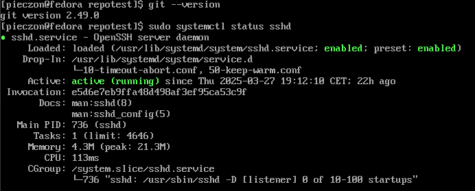

# Sprawozdanie 1 Marcin Pieczonka

## Lab 1

### Instalacja git i obsługa kluczy ssh

1. `sudo dnf install git-all` - instalacja git'a
2. `sudo dnf install openssh-server` - instalacja SSH
3. `systemctl start sshd.service` - uruchomienie usługi SSH



### Klonowanie repozytorium przez HTTPS i PAT
Najpierw utworzyłem na github Personal Access Token (PAT):


Następnie sklonowałem repozytorium za pomocą:
```bash
git clone https://github.com/InzynieriaOprogramowaniaAGH/MDO2025_INO.git
```

### Tworzenie kluczy ssh i 2FA
Klucze tworzymy za pomocą komend:
```bash
ssh-keygen -t ed25519 -f ~/.ssh/id_ed25519
ssh-keygen -t ecdsa -b 521 -f ~/.ssh/id_ecdsa
```

przy tworzeniu klucza zostajemy poproszeni o passphrase, aby zabezpieczyć klucz wystarczy w tym momencie podać hasło lub można po prostu wcisnąć enter aby nie zabiezpieczać klucza.


## Zmiana i tworzenie gałęzi
  1. `git checkout main` - wyjście na main brancha
  2. `git checkout GCL06` - wyjście na brancha grupy
  3. `cd ITE/GCL06` - przejście do odpowiedniego katalogu grupy
  2. `git checkout -b MP416297` - utworzenie własnego brancha


## Praca na branchu

1. Utworzenie katalogu MP416297:\
`mkdir MP416297`
2. Utworzenie git hooke'a w katalogu `.git/hooks`:\

        #!/usr/bin/sh
        #
        # Hook do przygotowania wiadomości commita.
        # Sprawdza, czy wiadomość commita zaczyna się od "MP416297".
        # Jeśli nie, dodaje ten prefiks na początku wiadomości.

        COMMIT_MSG_FILE=$1
        COMMIT_SOURCE=$2
        SHA1=$3

        # Definiowanie wzorca inicjałów i nr indeksu
        PATTERN="^MP416297" 

        # Pobierz pierwszą linię wiadomości commita
        commit_msg=$(head -n 1 "$COMMIT_MSG_FILE")

        # Sprawdź, czy wiadomość zaczyna się od wymaganych inicjałów i nr indeksu
        if [[ ! "$commit_msg" =~ $PATTERN ]]; then
        # Dodaj inicjały i nr indeksu na początek wiadomości
        echo "MP416297 - $commit_msg" > "$COMMIT_MSG_FILE"
        fi

## Wciągnięcie do gałęzi grupowej

Przy pomocy `git merge MP416297` zrobiłem "wciągnięcie" swojej gałęzi do gałęzi `GCL06`, a wynik wygląda następująco:


## Lab 2

### Instalacja Dockera
Pierwszym krokiem laboratorium była instalacja dockera na systemie linuksowym, która odbyła się poprzez komendę:\
```bash
sudo dnf install docker
```


Następnie po instalacji należy uruchomić Docker daemona przy pomocy następującyhc komend:
```bash
sudo systemctl enable docker
sudo systemctl start docker
```


### Rejestracja na Docker Hub
Kolejnym krokiem było założenie konta na Docker Hub i przyjrzenie się przykładowym obrazom dostępnym na stronie.


### Pobieranie obrazów Dockera

Następnie należało pobrać obrazy `hello-world`, `busybox`, `fedora/ubuntu` oraz `mysql`. Wykorzystałem do tego komdendę 

```bash
docker image pull "nazwa_obrazu"
```

Przykładowy output po pobraniu obrazu:\


Lista pobranych obrazów:\


## Uruchomienie konteneru z obrazu BusyBox

Uruchomienie konteneru wykonuje się poprzez komendę:
```bash
docker run "nazwa_obrazu"
```
w tym przypadku użyłem również opcji `-it` aby móc dostać się interaktywnie do kontenera, oraz `--rm` aby usunąć kontener automatycznie po wyjściu z niego. W kontenerze użyto komendy `cat --help` aby sprawdzić numer wersji.


## Uruchomienie "system w kontenerze" (fedora)

Podobnie jak w poprzednim podpunkcie do uruchomienia kontenera użyto `docker run` tym razem na końcu dodano jednak `bash` aby zastąpić uruchomienie procesu podstawowego procesem bash, co widać na zrzucie ekranu, gdzie `PID1` to bash.


Następnie z osobnego terminala sprawdzono listę procesów dockera na hoście:


Ostatnim krokiem było zaktualizowanie pakietów, które wykonano przy pomocy:
```bash
apt update && apt upgrade
```


## Dockerfile
W tym kroku należało utworzyć prosty `Dockerfile` bazujący na wybranym systemie, zbudować go i uruchomić oraz sklonować w nim nasze repozytorium.

    FROM alpine:latest
    RUN apk add --no-cache git
    WORKDIR /app
    RUN git clone https://github.com InzynieriaOprogramowaniaAGH/MDO2025_INO.git

- `FROM alpine:latest` oznacza z jakiego obrazu korzystamy
- `RUN apk add --no-cache git` służy do instalacji git'a w kontenerze
- `WORKDIR /app` zmienia katalog roboczy na /app
- `RUN git clone https://github.com/.../MDO2025_INO.git` klonuje repozytorium do katalogu roboczego


Następnie utworzony Dockerfile budujemy poprzez:
```bash
docker build -t alpine-git .
```
`-t` pozwala nadać customową nazwę


Ostatecznie uruchamiamy kontener:
```bash
docker run --rm -it alpine-git
```
\
w środku kontenera widać sklonowane repozytorium.

Kolejnym krokiem było pokazanie aktywnych kontenerów, więc w osobnym terminalu użyto:
```bash
docker ps
```
Którego wynikiem jest wyświetlenie kontenera `alpine_conatiner` oraz szczegółów czasu utworzenia.


Na sam koniec pozbywamy się kontenerów oraz obrazów za pomocą:
```bash
docker container prune
docker rmi -f $(docker images -aq)
```
`docker container prune` służy do usuwania kontenerów, `docker rmi` do usuwania obrazów, `-f` oznacza forsowanie usunięcia obrazów, `$()` uruchamia polecenie w subshellu, a `docker images -aq` pozwala na "pokazanie" wszystkich obrazów w formie ich id.

## Lab 3

Laboratorium miało na zadaniu pokazanie jak używać Dockerfile do automatyzacji tworzenia środowiska z zależnościami wymaganymi do uruchomienia projektu.

### Wybór oprogramowania

Przez lekkie problemy czasowe ze znalezieniem działającego projektu z testami te zajęcia zostały wykonane przeze mnie na przykładowym repozytorium, ale postaram się znaleźć coś lepszego na przyszłe zajęcia.

Użyte repozytorium:
```https://github.com/devenes/node-js-dummy-test```

### Klonowanie i build programu
```bash
git clone https://github.com/devenes/node-js-dummy-test
cd node-js-dummy-test
sudo dnf install -y npm
npm install
```
`git clone https://github.com/devenes/node-js-dummy-test` - klonujemy repozytorium\
`cd node-js-dummy-test` - zmieniamy katalog na katalog repozytorium\
`sudo dnf install -y npm` - instalujemy npm, który jest potrzebny do buildu projektu\
`npm install` - buildujemy projekt przy pomocy npm


### Uruchomienie programu i testów

```bash
npm start
npm test
```
`npm start` - uruchamia zbuildowany wcześniej projekt
`npm test` - uruchamia testy zbuildowanego projektu


### Przeprowadzenie buildu w kontenerze

W tym przypadku całą instalację wykonujemy w specjalnie uruchomionym kontenerze z wybranym systemem. Ja zdecydowałem się na obraz `node`, ponieważ ma on wbudowany `npm`.

```bash
docker image pull node
docker run --rm -it node bash
git clone
cd node
npm install
npm start
npm test
```
`docker image pull node` - pobieramy obraz node\
`docker run --rm -it node bash` - uruchamiamy kontener z obrazu i wchodzimy do basha\
Kolejne kroki są identyczne jak w poprzednim punkcie z pominięciem instalacji `npm`, który jest bazowo w naszym kontenerze.


### Dockerfile

Ostatni etap to stworzenie `Dockerfile`, które będą jeszcze bardziej upraszczać proces tworzenia środowiska i buildowania projektu.

Dockerfile buildowy:

    FROM node:22.14.0

    RUN git clone https://github.com/devenes/node-js-dummy-test
    WORKDIR /node-js-dummy-test
    RUN npm install

`FROM node:22.14.0` - oznacza z jakiego obrazu korzystać będzie kontener\
`RUN git clone https://github.com/devenes/node-js-dummy-test` - RUN oznacza polecenie, które jest wykonywane podczas buildowania obrazu\
`WORKDIR /node-js-dummy-test` - służy do zmieniania katalogu roboczego\
`RUN npm install` - polecenie do buildowania projektu z repozytorium

Taki Dockerfile należy zbudować poprzez polecenie:
```bash
docker build -t nodebld -f Dockerfile.nodebld .
```
`-t` pozwala nadać obrazowi customową nazwę\
`-f` oznacza plik z którego ma skorzystać docker build\
`.` oznacza katalog z którego ma być pobrany Dockerfile, czyli aktualny katalog\


Dockerfile startowy:

    FROM nodebld

    CMD ["npm", "start"]

`FROM nodebld` - nowy Dockerfile korzysta z zbudowanego z poprzedniego Dockerfile obrazu, pozwala to na uniknięcie niepotrzebnego ustalania dependencji i wykorzystanie gotowego szablonu. Ważne, aby podać odpowiednią nazwę obrazu.\
`CMD ["npm", "start"]` - oznacza polecenie, które zostanie wykonane podczas uruchamiania konteneru, w tym przypadku `npm start` uruchamia zbuildowany wcześniej projekt

Obraz tak samo buildujemy, a następnie uruchamiamy przy pomocy:
```bash
docker build -t noderun -f Dockerfile.noderun .
docker run --rm -it noderun
```

W tym przypadku można by użyć opcji `-d`, aby uruchomić kontener w stanie detached, jednak na potrzeby laboratorium nie korzystałem z tej opcji.


Dockerfile testowy:

    FROM nodebld

    CMD ["npm", "test"]

Podobnie jak w poprzednim przypadku korzystamy z gotowego obrazu `nodebld` tym razem jednak uruchamiamy testy za pomocą `npm test`.

braz tak samo buildujemy, a następnie uruchamiamy przy pomocy:
```bash
docker build -t nodetest -f Dockerfile.nodetest .
docker run --rm -it nodetest
```

