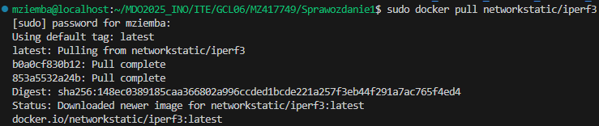

Marcin Ziemba 									30.03.2025  
**Sprawozdanie 1**

1. **Zajęcia 1**

W programie Hyper-V Manager skonfigurowano maszynę wirtualną z Fedora Server bez interfejsu graficznego.

Instalacja Gita i obsługa kluczy SSH:  
![**!\[\]\[image1\]**](lab1_ss/s1.png)

Następnie sprawdzam czy został pobrany poprawnie git i tworzę 2 klucze SSH, jedno z hasłem drugie bez:  
![!\[\]\[image2\]  ](lab1_ss/ss2.png)
![!\[\]\[image4\]](lab1_ss/ss4.png)
![!\[\]\[image3\]  ](lab1_ss/ss5.png)

Klucz bez hasła łączę z kontem na Githubie i klonuje repozytorium:  
![!\[\]\[image6\]](lab1_ss/ss6.png)
![!\[\]\[image7\]](lab1_ss/ss7.png)
![!\[\]\[image3\]  ](lab1_ss/ss3.png)


Kolejno tworzę i przełączam się na nowy branch z moimi inicjałami MZ417749, gdzie tworzę katalog o tej samej nazwie:  
![!\[\]\[image7\]](lab1_ss/ss9.png)
![!\[\]\[image8\]](lab1_ss/ss10.png)

Tworzę githooka weryfikującego czy każdy commit message zaczyna się od moich inicjałów i dodaje go stworzonego wcześniej katalogu:

```
pattern="^MZ417749"

\# Sprawdzenie, czy wiadomość zaczyna się od wzorca  
if \! grep \-qE "$pattern" "$1"; then  
  echo "Błąd: Wiadomość commitowa musi zaczynać się od 'MZ417749'."  
  exit 1  
fi  
```

![!\[\]\[image7\]](lab1_ss/ss11.png)

Wysłanie zmian z gałęzi lokalnej do zdalnego źródła:

![!\[\]\[image10\]](lab1_ss/ss13.png)


2. **Zajęcia 2**

Zainstalowano dockera:

```  
sudo dnf install \-y moby-engine  
```  
![!\[\]\[image12\]](lab2_ss/ss1.png)

Rejestracja w Docker Hub:  
![!\[\]\[image12\]](lab2_ss/ss10.png)

Następnie zalogowano się na dokera i go uruchomiono:  
```  
sudo systemctl start docker  
```  
```  
docker login –username marcinziemba  
```  
![!\[\]\[image12\]](lab2_ss/ss2.png)

Kolejno pobrano podane obrazy:  
![!\[\]\[image12\]](lab2_ss/ss3.png)
Następnie interaktywnie podłączmy się od kontener z obrazu busybox:  
![!\[\]\[image12\]](lab2_ss/ss4.png)

Uruchamiamy system z obrazu fedora i aktualizujemy pakiety:  
![!\[\]\[image12\]](lab2_ss/ss5.png)
![!\[\]\[image12\]](lab2_ss/ss6.png)

Uruchamiamy kontener na stworzonym Dockerfile:  
```  
\# Bazowy obraz: Ubuntu  
FROM ubuntu:latest

\# Instalacja Git  
RUN apt update && apt install \-y git

\# Ustawienie katalogu roboczego  
WORKDIR /app

\# Sklonowanie repozytorium  
RUN git clone https://github.com/InzynieriaOprogramowaniaAGH/MDO2025\_INO.git

\# Ustawienie domyślnej komendy  
CMD \["bash"\]  
```  
![!\[\]\[image12\]](lab2_ss/ss7.png)
![!\[\]\[image12\]](lab2_ss/ss8.png)

Czyścimy kontenery oraz obrazy  
![!\[\]\[image12\]](lab2_ss/ss9.png)

3. **Zajęcia 3**

Do 3 laboratoriów wybrano repozytorium node-js-dummy-test, przed sklonowaniem repozytorium zainstalowano node js:  
![!\[\]\[image12\]](lab3_ss/ss1.png)

Następnie pobrano potrzebne biblioteki i wykonano operacje build i test:  
![!\[\]\[image12\]](lab3_ss/ss2.png)

![!\[\]\[image12\]](lab3_ss/ss3.png)

Kolejno stworzono 2 pliki Dockerfile, jeden buduje aplikację a drugi na podstawie pierwszego wykonuje testy:

Dockerfile.build  
```  
FROM node:latest

RUN git clone https://github.com/devenes/node-js-dummy-test.git  
WORKDIR /node-js-dummy-test  
RUN npm install  
```  
Dockerfile.test  
```  
FROM node-app

CMD \["npm", "test"\]  
```

![!\[\]\[image12\]](lab3_ss/ss4.png)

![!\[\]\[image12\]](lab3_ss/ss5.png)

![!\[\]\[image12\]](lab3_ss/sss.png)

![!\[\]\[image12\]](lab3_ss/ss6.png)

Różnica między kontenerem a obrazem polega na tym że obraz zawiera wszystkie niezbędne pliki i konfiguracje potrzebne do uruchomienia aplikacji, a kontener to proces korzystający z tych zasobów uruchamiający aplikację.

4. **Zajęcia 4**

Stworzono woluminy wejścia i wyjścia


Natępnie utworzono i uruchomiono kontener z Dockerfile.buildNoGit

```
FROM node:20

WORKDIR /app

# Wolumin wejściowy: kod źródłowy
VOLUME /app/source

# Wolumin wyjściowy: pliki builda
VOLUME /app/build

RUN apt remove -y git || true  # Usuwamy git na wszelki wypadek

CMD ["/bin/sh"]
```


Kolejno klonujemy repozytorium bezpośrednio do pamięci wolumnia w folderze _data. Zalętą tego podejścia jest bezpośredni dostęp kontenera do potrzebnych danych i trwałość danych lecz wymaga uprawnień roota i trzeba uważać aby nie uszkodzić danych Dockera.


Uruchamiamy kontener i budujemy w nim program


Następnie zapisaujemy powstałe pliki na wolumienie wyjściowym, wyłączyamy kontener i sprawdzamy czy pliki poza nim instnieją.


**Eksponowanie portu**

Zaczynamy od utworzenia kontenera z obrazu iperf3 oraz uruchomienie go z opcją nasłuchiwania na porcie 5201




Następnie po skopiowaniu adresu ip kontenera server tworzymy nowy kontener client i łączymy się z serwerem


Kolejno tworzymy własną sieć mostkową, dzięki której możemy odwoływać się do kontenerów po nazwach zamiast adresów IP


Stopujemy i usuwamy kontener server, następnie tworzymy go na nowy tym razem umieszczając go w sieci iperf-network i łączymy z serwerem


Następnie instalujemy iperf3 na maszynie wirtualnej za pomocą podanej poniżej komendy, a na hoscie z linku (https://iperf.fr/iperf-download.php#windows)


Kolejno już spoza maszyny wirtualnej łączymy się z hostem, warto zauważyć że używamy adresu IP maszyny wirtualnej nie samego hosta (która przekieruje je do kontenera)


Na koniec tworzę serwer jescze raz z opcją zapisu logów, łączę się z wewnątrz i spoza wirtualnej maszyny


```
-----------------------------------------------------------
Server listening on 5201 (test #1)
-----------------------------------------------------------
Accepted connection from 172.19.0.3, port 46366
[  6] local 172.19.0.2 port 5201 connected to 172.19.0.3 port 46372
[ ID] Interval           Transfer     Bitrate
[  6]   0.00-1.00   sec  3.13 GBytes  26.9 Gbits/sec                  
[  6]   1.00-2.00   sec  3.15 GBytes  27.1 Gbits/sec                  
[  6]   2.00-3.00   sec  3.17 GBytes  27.3 Gbits/sec                  
[  6]   3.00-4.00   sec  3.17 GBytes  27.3 Gbits/sec                  
[  6]   4.00-5.00   sec  3.14 GBytes  27.0 Gbits/sec                  
[  6]   5.00-6.00   sec  3.11 GBytes  26.7 Gbits/sec                  
[  6]   6.00-7.00   sec  3.09 GBytes  26.5 Gbits/sec                  
[  6]   7.00-8.00   sec  3.21 GBytes  27.5 Gbits/sec                  
[  6]   8.00-9.00   sec  3.23 GBytes  27.8 Gbits/sec                  
[  6]   9.00-10.00  sec  3.10 GBytes  26.6 Gbits/sec                  
[  6]  10.00-10.00  sec  7.69 MBytes  23.1 Gbits/sec                  
- - - - - - - - - - - - - - - - - - - - - - - - -
[ ID] Interval           Transfer     Bitrate
[  6]   0.00-10.00  sec  31.5 GBytes  27.1 Gbits/sec                  receiver
-----------------------------------------------------------
Server listening on 5201 (test #2)
-----------------------------------------------------------
Accepted connection from 172.29.96.1, port 54350
[  6] local 172.19.0.2 port 5201 connected to 172.29.96.1 port 54351
[ ID] Interval           Transfer     Bitrate
[  6]   0.00-1.00   sec   475 MBytes  3.99 Gbits/sec                  
[  6]   1.00-2.00   sec   473 MBytes  3.96 Gbits/sec                  
[  6]   2.00-3.00   sec   480 MBytes  4.02 Gbits/sec                  
[  6]   3.00-4.00   sec   479 MBytes  4.02 Gbits/sec                  
[  6]   4.00-5.00   sec   486 MBytes  4.08 Gbits/sec                  
[  6]   5.00-6.00   sec   480 MBytes  4.03 Gbits/sec                  
[  6]   6.00-7.00   sec   489 MBytes  4.10 Gbits/sec                  
[  6]   7.00-8.00   sec   484 MBytes  4.06 Gbits/sec                  
[  6]   8.00-9.00   sec   539 MBytes  4.52 Gbits/sec                  
[  6]   9.00-10.00  sec   511 MBytes  4.28 Gbits/sec                  
[  6]  10.00-10.01  sec  3.45 MBytes  3.00 Gbits/sec                  
- - - - - - - - - - - - - - - - - - - - - - - - -
[ ID] Interval           Transfer     Bitrate
[  6]   0.00-10.01  sec  4.78 GBytes  4.11 Gbits/sec                  receiver
```

**Jenkins**

Zaczynamy od pobrania obrazu docker:dind, utworzeniu sieci jenkins i
stworzenia kontenera opartego na docker:dind. Robiłem to po raz 2 więc wiadomości zwrotnę będą się różnić nie mniej jednak używając tych kommend powinniśmy stworzyć odpowiedni kontener. 


Kolejno tworzymy Dockerfile tworzący obraz oparty o oficjalny obraz Jenkinsa. Zawartość pliku skopiowano ze strony dokumentacji Jenkinsa i budujemy przy jego użyciu obraz

```
FROM jenkins/jenkins:2.492.2-jdk17
USER root
RUN apt-get update && apt-get install -y lsb-release ca-certificates curl && \
    install -m 0755 -d /etc/apt/keyrings && \
    curl -fsSL https://download.docker.com/linux/debian/gpg -o /etc/apt/keyrings/docker.asc && \
    chmod a+r /etc/apt/keyrings/docker.asc && \
    echo "deb [arch=$(dpkg --print-architecture) signed-by=/etc/apt/keyrings/docker.asc] \
    https://download.docker.com/linux/debian $(. /etc/os-release && echo \"$VERSION_CODENAME\") stable" \
    | tee /etc/apt/sources.list.d/docker.list > /dev/null && \
    apt-get update && apt-get install -y docker-ce-cli && \
    apt-get clean && rm -rf /var/lib/apt/lists/*
USER jenkins
RUN jenkins-plugin-cli --plugins "blueocean docker-workflow"
```


Kolejno przy pomocy utowrzonego obrazu, tworzymy kontener


Na koniec, mamy możliwość zalogowania się pod adresem 172.29.105.241:8080 przy pomocy hasła zapisanego na maszynie wirtualnej, ja już to zrobiłem i taki był efekt


